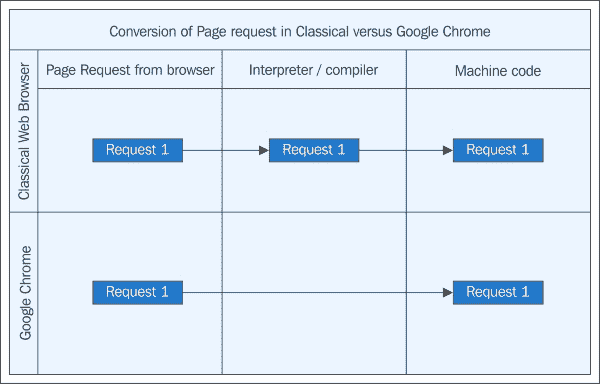
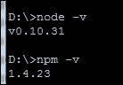
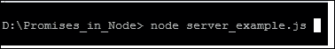
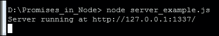
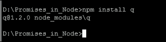

# 第六章：Node.js 中的承诺

在上一章中，我们学习了 WinRT 中的承诺以及它们是如何使用微软平台来实现的。承诺的概念比其他语言有更广泛的覆盖。这是开源技术中增长最快的概念之一。

在本章中，我们将讨论一种正在彻底改变现代网络开发进程并增强我们实时网络方法的 JavaScript 实现。这项令人惊叹的技术被称为 Node.js，它是一个用 JavaScript 编写的平台，基于 Google 的 V8 引擎。Node.js 中的承诺比其他任何平台或实现都要有趣、演变快和富有成效。让我们深入了解 Node.js 中的承诺能为我们实时网络提供什么。

# V8 引擎 – 机械结构

一个只有 F1 赛车手和跑车制造商才知道的术语，在 2008 年 Google 首次推出其惊人的网络浏览器 Google Chrome 时，被引入到了网络浏览器中。

就像许多现实生活中的产品和它们的机制被计算机行业复制和描绘一样，V8 引擎是近年来此类建模的真实例子之一。由于本书的重点是承诺，所以我们简要地看看 V8 引擎实际上是什么。

V8 引擎是一个非传统的带有八个气缸安装在曲轴上以产生额外马力的引擎。这个引擎比 V6（另一种 V 型引擎）更平稳，比 V12 引擎更便宜。

# Google Chrome 中的 V8 引擎

使 Google 在网络浏览器竞赛中位居首位的开源项目就是 Google Chrome。Chrome 是基于一种独特设计的 JavaScript 引擎 V8 构建的。基于 V8，Chrome 在很短的时间内就获得了全球用户的热烈欢迎和关注。它最初于 2008 年 9 月 2 日发布。然而，这个 V8 JavaScript 引擎究竟做了什么，使它比其他任何程序都更快、更出色呢？它并不涉及将高级语言解释器编译成机器代码。它基本上跳过了代码解释的中间部分，并将高级代码直接转换为机器代码。这就是 Chrome 之所以如此快速的原因：



# Node.js 的发展

自从 Google Chrome 作为开源网络浏览器发布以来，人们开始对它产生兴趣。这种迅速的兴趣主要有两个原因。从普通用户的视角来看，它比任何其他网络浏览器都要快得多，而从开发者的视角来看，它通过将高级指令瞬间转换为机器代码，去除了完整的编译器或解释器的中间层，从而革命化了浏览器技术。

许多开发者开始探索代码库，寻找他们参与的解决方案的可能性，并充分利用这个新的、令人惊叹的代码库。

Ryan Dahl 是那些想尝试 V8 JavaScript 引擎的开发者之一，当时他在 Joyent 工作，忙于解决问题。问题是在上传过程中让浏览器知道还剩多少时间。受到最近发布的 V8 和 Ruby 的 Mongrel web 服务器的影响，他起草了后来演变成 Node.js 的代码基础。

# 关于 Node.js 的简要介绍

Dahl 创建的是现代 web 应用开发中的一个全新概念——Node.js 的第一个版本。

简单来说，Node.js 的服务器端 JavaScript 是基于谷歌的 V8 引擎构建的。Node.js 是一个基于事件和非阻塞 I/O 的平台。它轻量级、高效，最适合用于运行在分布式设备上的数据密集型实时 web 应用。

# 下载并安装 Node.js

你可以从 Node.js 的官方网站 [`nodejs.org/download`](http://nodejs.org/download) 下载 Node.js。

Node.js 适用于多种平台。选择你的操作系统，安装程序将引导你完成剩余步骤。

Node.js 作为开源项目也托管在 GitHub 上，位于 [`github.com/joyent/node`](https://github.com/joyent/node)，供全世界的开发者贡献其发展和开发。

安装说明非常简单易懂，只需按照与你的操作系统相关的安装程序操作。这个过程非常直接，无需太多麻烦即可完成。你只需要按照屏幕上的提示操作即可。

# Node 包管理器——NPM

使用 Node.js 的一个最大优点是 NPM（Node Package Manager），即 Node 包管理器。这是开发者通过更快的共享代码库来协作想法的有效方式。然而，这并不是全部。NPM 最好的用途之一是下载并安装一个称为**包**的不同简单代码目录。这可以通过简单地输入命令（如 `npm install express`）轻松完成，这将下载并在你的机器上安装整个包。每个包都有一个 `.json` 文件，其中包含有关该包的元数据。在类 Unix 环境中，Node 包管理器不仅可以帮助下载和设置其他包，还可以更新 Node.js 本身。

NPM 也是 Node.js 在 JavaScript 开发者社区中变得越来越受欢迎的另一个原因。与其他语言相比，在其他语言中上传库和二进制文件是非常耗时且需要权限的。而 NPM 是一个更快、更少关注权限的模型，吸引了开发者上传并与其他社区成员分享他们的作品。

有关 NPM 的更多信息以及如何贡献你的代码，请访问 [`www.npmjs.com/`](https://www.npmjs.com/)。

在后面的章节中，我们将看到 NPM 如何帮助我们安装和使用我们选择的包，以及使用 NPM 工作是多么的快速和流畅。

# 环境选择

Node.js 在平台独立性方面具有所有安装，设置和库，适用于目前可用的所有主要操作系统。它适用于所有基于 Unix 的操作系统，以及 Mac 和 Windows 平台。由于我们主要关注让您了解 Node.js 与承诺之间的联系，因此我们将基于 Windows 7（任何版本）平台进行代码示例，因为它是广泛可用的，并且 Node.js 在 Windows 7 上也可用且稳定。此外，它非常简单且节省时间。

### 提示

请记住，使用基于 Windows 的系统对代码及其输出没有任何影响。这对于任何操作系统都是相同的，没有任何更改。您可以毫不犹豫地将在任何其他操作系统上使用相同的代码库。

# 为 Node.js 设置环境

让我们熟悉一下环境以及如何使用 Node.js 完成事情。首先，最重要的是，我们必须知道如何设置以编译代码并在我们的机器上运行。

如果您阅读此部分，则假定您已经在计算机上安装了 Node.js 的最新版本；否则，请参阅前面的部分以下载和安装 Node.js。

在您设置 Node.js 之后，通过输入以下命令检查您计算机上可用的 Node.js 和 NPM 版本：

```js
D:\> node –v
D:\> NPM  –v

```

输出应该与以下截图类似：



检查 Node.js 和 NPM 的版本

请注意，当前的 Node.js 版本是 0.10.31，当前的 NPM 版本是 1.4.23。我们的示例将基于这些版本，不会低于这些版本。

# 一个简单的 Node 服务器

现在，我们已经准备好进行一些实验，让我们尝试一个简单的 node 服务器。为此，您只需要两款软件。一个是默认的文本编辑器，如 Windows 中的记事本或 Ubuntu 中的 Nano，以及一个网络浏览器。对于网络浏览器，我们建议使用 Google Chrome，因为它在所有平台上都很容易获得，并且与 Node.js 原生兼容。

所以，在您喜欢的文本编辑器中输入以下代码：

```js
// simple server written in Nodejs
// This server would be running on default IP http://127.0.0.1
var http = require('http');
http.createServer(function (request, response) 
{
  response.writeHead(200, {'Content-Type': 'text/plain'}); // this defines the MIME type of content
  response.end('Hello World\n'); // this is the browser's output. 
}).listen(1337, '127.0.0.1'); // 1337 is the port number where the browser is listing to this request. 
console.log('Server running at http://127.0.0.1:1337/'); //This line will show at command prompt  
```

使用任何名字以`.js`扩展名保存文件。在我们的示例中，我们使用名称`server_example.js`。将此文件保存在目录（例如`Promises_in_Node`）中，然后打开您的终端程序。对于 Windows，它是命令提示符。导航到您保存文件的目录，并输入以下命令：



如果代码没有错误，它将编译并在屏幕上显示以下输出：



现在，打开 Chrome 浏览器，在地址栏输入`http://127.0.0.1:1337/`并按下*Enter*键。这个屏幕会显示 Node.js 服务器的成功输出：


就是这些！现在您已经准备好深入研究 Node.js 中的承诺。

# 到目前为止我们所学的

让我们总结一下我们已经学到了什么。我们了解了 V8 引擎是什么，以及它是如何由 Google Chrome 作为 JavaScript 引擎开发的，Node.js 是什么，以及它是如何作为一个问题解决技术发展成为一个完整的应用程序开发平台的。我们学习了 Node 包管理器以及如何在 Node.js 应用程序开发中使用它。然后我们学习了如何下载 Node.js，如何安装它，以及开发 Node.js 时需要考虑的依赖项，最后，我们学习了如何使用 Node.js 编写简单的服务器并在浏览器中查看其输出。这是一个检查点，如果你对 Node.js 仍然感到困惑，请再次阅读，然后继续。

接下来的部分将让您更好地了解 Node.js 和承诺，以及承诺为何在 Node.js 开发者中获得如此多的尊重。

# 使用 Q 库的 Node.js

在第二章《JavaScript 异步模型》中，我们讨论了回调地狱是什么以及我们如何使用承诺来处理它。每种语言的实现也会有所不同。Node.js 也是如此。Node.js 中的承诺是以一种不同的方式实现的。在 Node.js 中，承诺不仅用于处理回调地狱，如果一个函数不能返回一个值或抛出一个异常，它也可以轻松地传递一个承诺。这与我们之前看到的章节有些不同。从 Node.js 的角度来看，一个承诺是一个代表返回值或能够抛出异常的对象，此外，它还可以作为远程对象的代理来提高延迟。

让我们来看一下下面的代码：

```js
process_one(function (value1) {
    process_two(value1, function(value2) {
        process_three(value2, function(value3) {
            process_four(value3, function(value4) {
                // Do something with value4 
            });
        });
    });
});
```

乱七八糟，不是吗？不仅乱七八糟，而且非常令人困惑，难以维护。现在，看看使用承诺以下的代码：

```js
Q.fcall(process_one)
.then(process_two)
.then(process_three)
.then(process_four)
.then(function (value4) {
    // Do something with value4 
})
.catch(function (error) {
    // Error Handler
})
.done();
```

现在，这段代码更清晰、更高效，并且有一个额外的特点，即隐式的错误传播，就像我们在 Java 中的`try`-`catch`和`finally`块一样，捕获任何不必要的异常，并在遇到意外条件时防止程序完全崩溃。

回调方法被称为控制反转，它是一个能够接受回调而不是返回值的函数。这种机制可以更容易地被描述为“不要调用我，我会调用你”的说法。

Q 中的承诺有一个非常特别的倾向，因为它清楚地使输入参数与控制流程参数独立。只有在使用和创建 API 时，尤其是在变长参数、剩余参数和展开参数方面，才能真正看到它的真正好处。

# 继续学习 Q

在简要介绍了 Node.js 和 Q 之后，让我们看看如何开发应用程序。首先，我们需要获取 Q 库以设置其模块。

使用 Node 包管理器，按照以下截图安装 Q 库：



正如你所见，提示说它的`q`版本是 1.2.0，这是稳定版本，也向后兼容。我们将使用这个版本作为本章所有示例的依据。

在我们的环境和过去的升级中，我们现在可以尝试一些常见的、富有成效的承诺特性。

承诺有一个`then`方法，你可以用它来获取最终的返回值（满足）或抛出异常（拒绝）。到现在，我们都在阅读这本书的前几章后知道了这一点。

```js
iPromiseSomething() .then(function (value) { //your code }, function (reason) { //your code } );
```

以下是前面的代码行是如何工作的：

+   如果`iPromiseSomething`返回一个稍后得到满足的承诺，并带有返回值，第一个函数（满足处理器）将被调用

+   如果`iPromiseSomething`函数后来被抛出的异常拒绝，第二个函数（拒绝处理器）将被调用，并带有异常

正如你所见，承诺的解决总是异步的，这意味着满足或拒绝处理器总是在事件循环的下一轮（即 Node.js 中的`process.nextTick`）被调用。这种机制确保在满足或拒绝处理器被执行之前，它总是返回一个值。

# 在 Q 中的传播

`then`方法总是返回一个承诺，该承诺要么被处理，要么被拒绝。

在我们的示例代码中，我们将输出分配给`reapPromise`变量，它将持有该值：

```js
var reapPromise  = getInputPromise()
.then(function (input) {
}, function (reason) {
});
```

`reapPromise`变量是任一处理器的返回值的新的承诺。只有一个处理器会被调用，并且它将负责以函数的形式解决`reapPromise`，该函数只能返回一个值（一个未来的值）或抛出一个异常。

无论情况如何，都可能有以下几种结果：

+   如果你在处理器中返回一个值，`reapPromise`将被满足

+   如果在处理器中抛出了异常，`reapPromise`将被拒绝

+   如果在处理器中返回一个承诺，`reapPromise`将变成那个承诺

+   因为它将成为一个新的承诺，所以它在管理延迟、组合结果或从错误中恢复时将很有用。

如果`getInputPromise()`承诺被拒绝，而你忘记了拒绝处理器，错误将传递给`reapPromise`：

```js
var reapPromise = getInputPromise()
.then(function (value) {
});
```

如果输入承诺得到满足，而你失败了满足处理器，值将传递给`reapPromise`：

```js
var reapPromise = getInputPromise()
.then(null, function (error) {
});
```

当你只对处理错误感兴趣时，Q 承诺提供了一个 fail 简写：

```js
var reapPromise = getInputPromise()
.fail(function (error) {
});
```

如果你只为现代引擎编写 JavaScript 或者使用 CoffeeScript，你可以使用 catch 而不是 fail。

承诺还提供了一个`fin`函数，它类似于一个`finally`子句。当`getInputPromise()`返回的承诺要么返回一个值，要么抛出一个错误时，最终处理器将被调用，不带任何参数。

`getInputPromise()`返回的值或抛出的错误，除非最终处理失败，否则会直接传递给`reapPromise`；如果最终处理返回一个承诺，可能会延迟：

```js
var reapPromise = getInputPromise()
.fin(function () {
});
```

简而言之：

+   如果处理程序返回一个值，该值将被忽略

+   如果处理程序抛出错误，错误将传递给`reapPromise`

+   如果处理程序返回一个承诺，`reapPromise`将被推迟

最终的值或错误与立即返回的值或抛出的错误有相同的效果；一个值将被忽略，一个错误将被传递。

因此，当我们寻找传播时，我们需要记住我们从返回值中想看到什么。在使用 Q 的传播时，`then`、`fail`和`fin`函数是记住的关键。

### 提示

如果你为现代引擎写 JavaScript，你可能用`finally`代替`fin`。

# 链式和嵌套承诺

记得在第二章中学习过的承诺链吗？*JavaScript 异步模型*，我们了解了所有关于链式调用和回调地狱处理的事情？使用 Q 的 Node.js 版本与此相同。

在 Node.js 中使用 Q 链式承诺有两种方法：一种是在处理程序内部链式承诺，另一种是在其外部。

假设我们同时在做很多事情，我们可以像这样设置承诺链：

```js
f1_promise()
    .then(function() { return s1_promise(); })
    .then(function() { return t1_promise();  })
        ...
    .then(function() { return nth_promise();    });
```

所以，我们可以说`ANY_promise()`函数可以包含一些行为，这将返回一个承诺对象，最终返回一个结果。一旦真实结果返回，它将触发链中的下一个函数。

现在看起来不错，如果你想在异步函数中设置一个点，并在我们获得结果后再执行链中下一个承诺的行为，那会怎样？

Q 针对此问题有一个解决方案。使用`.defer()`和`deferred.resolve()`，你可以以更加可管理和可预测的方式得到结果。

# Q 中的序列

链式调用（chaining）之外，序列（sequences）也是另一种按照你的意愿来组织结果的方法。序列是一种预定义的方式来获得你所期望的场景结果。为了更紧密地控制结果并生成它们，Q 提供了一种独特的序列方式。

假设你有多个生成承诺的函数，它们都需要按顺序运行。你可以像这个例子这样手动完成：

```js
return seq(startValue).then(secondValue).then(thirdValue);
```

你必须确保每个`then()`都必须与其他`then();`在序列中，以保持序列。否则，序列将会中断，你将无法稍后获得另一个值。

另一种方法是动态地指导你的序列。这可能会更快，但在执行代码时需要更多的注意力，因为不可预测的代码可能会损害整个序列。

这是一个动态实现的代码片段：

```js
var funcs = [startValue, secondValue, thirdValue];

var result = Q(startValue); 
funcs.forEach(function (f) {
    result = result.then(f);
});
return result;
```

如果这看起来你使用了太多的代码行，使用`reduce`：

```js
return func.reduce(function (tillNow, f) {
    return tillNow.then(f); 
}, Q(startValue));
```

# Q 的组合

有了 Q，你在 Node.js 中就有了一个独特的功能，如果你想组合一个承诺列表的数组，就可以写出更干净、易管理的代码。这可以帮助你以更易管理的方式编写更复杂级别的顺序数据结构。我们如何达到这个目标呢？使用`all`。考虑以下示例：

```js
return Q.all([
    eventAdd(2, 2),
    eventAdd (10, 20)
]);
```

`Q.all([func1(), func2()]);`函数将是前述代码的通用形式。你也可以使用`spread`来替换`then`。我们可以用 Q 替换另一个新东西吗？事实上不行！`spread`函数将值扩散到完成处理器的参数中。对于拒绝处理器，它将获取失败的第一个信号。因此，任何注定要首先失败的承诺都将由拒绝处理器处理：

```js
function eventAdd (var1, var2) { 
    return Q.spread([var1, var2], function (var1, var2) {
        return a + b;
    })
}

Q.spread(). Call all initially

return getUsr() .then(function (userName) { return [username, getUser(userName)]; }) .spread(function (userName, user) {
});
```

调用函数时，它将返回`allSettled`。在这个函数内部，一个承诺将被作为数组返回，该数组持有值。当这个承诺被履行时，该数组包含原始承诺的履行值，在相同的序列中这些承诺。美妙的是，如果任何承诺被拒绝，它将立即被拒绝，而不是等待其他人到来并分享他们的状态：

```js
Q.allSettled(promises)
.then(function (results) {
    results.forEach(function (result) {
        if (result.state === "fulfilled") {
            var value = result.value;
        } else {
            var reason = result.reason;
        }
    });
});
```

`any`函数接受一个承诺数组，返回一个由第一个被履行的承诺实现的承诺，或者在所有给定的承诺都被拒绝时被拒绝：

```js
Q.any(promises).then(function (firstPromise) {
    // list of any of the promises that were fulfilled. 
}, function (error) {
    // All of the promises were rejected. 
});
```

# 如何在 Node.js 中处理 Q 错误

有时，承诺创建错误时会发生拒绝。这些错误足够聪明，可以避开分配来处理这些错误的处理程序。因此，我们需要明确地处理它们。

让我们看看以下片段，看看它如何被处理：

```js
return scenario().then(function (value) {
    throw new Error("I am your error mesg here .");
}, function (error) {
    // We only get here if scenario fails 
});
```

为什么会出现这种情况？假设承诺之间的并行性和`try`/`catch`，在我们尝试执行`scenario()`时，错误处理器代表`scenario()`的`catch`，而履行处理器代表`try`/`catch`块之后的代码。现在，这段代码需要自己的`try`/`catch`块。

`try`/`catch`块对于那些为一些主要语言编写代码的人来说并不是一个新概念。由于 Node.js 基于 JavaScript，而 Q 此刻正在处理它，所以语法可能有点不同，但功能基本上与以下代码相同：

```js
Q.
try(function()
    {return scneario().then(function(value)throw new Error("im your thrown error");)} )
.catch({ function (error)
    {console.error("i am catched",error)} 
});
```

简单来说，在承诺方面，这意味着你在串联你的拒绝处理程序。

# 使用承诺进行进度管理

与其他库不同，承诺有一个独特的通信能力。如果你想让它与你交谈，它可以更新你的进度。最好是，这些是通过开发者编程的方式，在指定的时间间隔内通知他们进展情况。我们可以通过使用我们最喜欢的`then()`函数来实现：

```js
return uploadFile()
.then(function () {
    // Success uploading the file 
}, function (err) {
    // There was an error, and we get the reason for error 
}, function (progress) {
    // this is where I am reporting back my progress. executed 
});
```

使用 Q 有很多优点。对于这个特定主题，它提供了一个简短的调用进度，通过使用`*.progress();`，将我们的努力减少到只有一行。

```js
return uploadFile().progress(function (progress) {
    // We get notified of the upload's progress 
});
```

# 到达承诺链的末端

当我们谈论结束一个承诺链时，我们必须确保在任何错误没有在结束前得到处理，因为如果处理不当，它会被重新抛出并报告。

这是一个临时解决方案。我们正在探索使未处理的错误可见，而无需任何显式处理的方法。

所以，返回的代码如下所示：

```js
return hoo()
.then(function () {
    return "foo";
});
Or we can do It like this:
hoo()
.then(function () {
    return "bar";
})
.done();
```

我们为什么要这样做？我们为什么需要以这种方式调用机制？答案非常简单，你必须结束链或必须将其返回给另一个承诺。这是因为处理程序捕获错误，这是一个不幸的模式，异常可能会被忽视。

偶尔，你需要从零开始创建一个承诺。这是很正常的；你可以自己创建一个承诺，或者从另一个链中获取它。无论哪种情况，都要考虑到这是一个开始。使用 Q，你可以以多种方式创建新的承诺。以下是一些示例：

```js
Q.fcall(); 
//Using this function fcall you can create and  call other //functions, along with Promise functions. To do that simply //follow this syntax 
return Q.fcall(function () {
    return 10; 
});
```

不仅如此，`fcall();`还可以用来获取一个异常处理的承诺，它看起来像以下代码片段：

```js
return Q.fcall(function () {
    throw new Error("I am an error");
});
```

由于`fcall();`可以调用函数，甚至可以调用承诺函数，因此它使用`eventualAdd();`函数来添加两个数字：

```js
return Q.fcall(eventualAdd, 2, 2);
```

# 基于回调的承诺与基于 Q 的承诺

假设你必须与基于回调而不是基于承诺的接口进行交互，你的选择会是什么？答案是 Q 提供了`Q.nfcall()`和`friends();`，但大多数时候，我们不得不依赖`deferred`：

```js
var deferred = Q.defer();
FS.readFile("hoo.txt", "utf-8", function (error, text) {
    if (error) {
        deferred.reject(new Error(error));
    } else {
        deferred.resolve(text);
    }
});
return deferred.promise;
```

通常，我们可以像这样实现它：

```js
//normal way of handling rejected promises.
deferred.reject(new Error("Can't do it"));
//this is how we do it
var rejection = Q.fcall(function () {
    throw new Error("Can't do it");
});
deferred.resolve(rejection);
```

## 关于延迟、超时和通知的一些话

有时候，我们想要让函数的输出有一定的延迟或比正常情况更慢。这时我们正在等待某个事件的发生，比如在强度指示器中检查密码的强度。

对于所有这些需求，Q 提供了一系列函数来给你这种控制。这些函数包括：

+   `Q.delay()`

+   `Q.notify()`

+   `deferred.notify()`

前面的函数不仅能够在需要时创建延迟，还能在延迟可能发生时进行通知。如果你想要推迟通知，可以使用`deferred.notify()`来实现目的。

## Q.delay()

以下代码是`Q.delay`的简化实现：

```js
function delay(ms) {
    var deferred = Q.defer();
    setTimeout(deferred.resolve, ms);
    return deferred.promise;
}
```

## Q.timeout()

使用`Q.timeout`的简单方法：

```js
function timeout(promise, ms) {
    var deferred = Q.defer();
    Q.when(promise, deferred.resolve);
    delay(ms).then(function () {
        deferred.reject(new Error("Timed out"));
    });
    return deferred.promise;
}
```

## deferred.notify()

最后，你可以使用`deferred.notify()`向承诺发送进度通知。

在浏览器中有一个 XML HTTP 请求的包装器：

```js
function requestOkText(url) {
    var request = new XMLHttpRequest();
    var deferred = Q.defer();
    request.open("GET", url, true);
    request.onload = onload;
    request.onerror = onerror;
    request.onprogress = onprogress;
    request.send();

    function onload() {
        if (request.status === 200) {
            deferred.resolve(request.responseText);
        } else {
            deferred.reject(new Error("Status code was " + request.status));
        }
    }

    function onerror() {
        deferred.reject(new Error("Can't XHR " + JSON.stringify(url)));
    }

    function onprogress(event) {
        deferred.notify(event.loaded / event.total);
    }

    return deferred.promise;
}
```

以下是如何使用这个`requestOkText`函数的示例：

```js
requestOkText("http://localhost:5000")
.then(function (responseText) {
    // If the HTTP response returns 200 OK, log the response text. 
    console.log(responseText);
}, function (error) {
    // If there's an error or a non-200 status code, log the error. 
    console.error(error);
}, function (progress) {
    // Log the progress as it comes in. 
    console.log("Request progress: " + Math.round(progress * 100) + "%");
});
```

# Q.Promise() – 创建承诺的另一种方法

`Q.Promise`是一个承诺创建的 API，它的功能与 deferred 概念相同，但不会引入另一个概念实体。

让我们用`Q.Promise`重写前面的`requestOkText`示例：

```js
function requestOkText(url) {
    return Q.Promise(function(resolve, reject, notify) {
        var request = new XMLHttpRequest();
        request.open("GET", url, true);
        request.onload = onload;
        request.onerror = onerror;
        request.onprogress = onprogress;
        request.send();

        function onload() {
            if (request.status === 200) {
                resolve(request.responseText);
            } else {
                reject(new Error("Status code was " + request.status));
            }
        }
        function onerror() {
            reject(new Error("Can't XHR " + JSON.stringify(url)));
        }
        function onprogress(event) {
            notify(event.loaded / event.total);
        }
    });
}
```

如果`requestOkText`抛出异常，返回的承诺将被拒绝，并以抛出的异常作为其拒绝的原因。

# Q 的静态方法

对 promises 对象的类型转换是必须的，并且你必须将不同来源生成的 promises 转换为 Q 类型的 promises。这是因为一个简单的事实，即不是所有的 promise 库都提供与 Q 相同的保证，当然也不提供所有相同的方法。

```js
//using when 
return Q.when(AmIAvalueOrPromise, function (value) {
}, function (error) {
});
//The following are equivalent:
return Q.all([a, b]);
return Q.fcall(function () {
    return [a, b];
})
.all();
```

大多数库只提供部分功能的 `then` 方法。另一方面，Q 与其他库非常不同：

```js
return Q($.ajax(...))
.then(function () {
});
```

如果你得到的 promise 不是由你的库提供的 Q 类型的 promise，你应该使用 Q 函数来包装它。你甚至可以使用 `Q.invoke();` 作为简写，如下面的代码所示：

```js
return Q.invoke($, 'ajax', ...)
.then(function () {
});
```

# Promise 作为代理

一个区分 promise 的奇妙之处在于，它不仅可以作为本地对象，也可以作为远程对象的代理。有一些方法让你自信地使用属性或调用函数。所有这些交换都返回 promises，以便它们可以被链式调用。

以下是可以用作 promise 代理的函数列表：

| 直接操作 | 使用 promise 作为代理 |
| --- | --- |
| `value.foo` | `promise.get("foo")` |
| `value.foo = value` | `promise.put("foo", value)` |
| `delete value.foo` | `promise.del("foo")` |
| `value.foo(...args)` | `promise.post("foo", [args])` |
| `value.foo(...args)` | `promise.invoke("foo", ...args)` |
| `value(...args)` | `promise.fapply([args])` |
| `value(...args)` | `promise.fcall(...args)` |

你可以通过使用这些函数而不是 `then()` 来减少往返，如果 promise 是远程对象的代理。

即使在本地对象的情况下，这些方法也可以作为特别简单的满足处理器的简写。例如，你可以替换：

```js
return Q.fcall(function () {
    return [{ foo: "bar" }, { foo: "baz" }];
})
.then(function (value) {
    return value[0].foo;
});
```

以下代码：

```js
return Q.fcall(function () {
    return [{ foo: "bar" }, { foo: "baz" }];
})
.get(0)
.get("foo");
```

# 熟悉 Node.js —— Q 方式

当你使用遵循 Node.js 回调模式的功能时，其中回调以 `function(err, result)` 的形式出现，Q 提供了一些有利的服务函数来适应它们之间。最重要的两个函数是：`Q.nfcall()` 和 `Q.nfapply()`：

+   `Q.nfcall()`：Node.js 函数调用

    ```js
    return Q.nfcall(FS.readFile, "foo.txt", "utf-8");
    ```

+   `Q.nfapply()`：Node.js 函数应用

    ```js
    return Q.nfapply(FS.readFile, ["foo.txt", "utf-8"]);
    ```

它们都用于调用具有类似 Node.js 外观的函数，以便它们可以生成 promises。

# 解绑及其解决方案

当你使用方法而不是简单函数时，你很可能会轻易遇到常见的问题，即传递一个方法到另一个函数（如 `Q.nfcall`）会解除方法与其所有者的绑定。Q 也提供了它的服务，以便你可以避免这个问题，通过采用这两种方式之一：

+   使用 `Function.prototype.bind()`

+   使用 Q 提供的这些方法：

    ```js
    return Q.ninvoke(redisClient, "get", "user:1:id"); // node invoke
    return Q.npost(redisClient, "get", ["user:1:id"]); // node post
    ```

还有一种创建可重用包装器的方法，使用：

+   `Q.denodeify`：

    ```js
    //using Q.denodeify
    var readFile = Q.denodeify(FS.readFile);
    return readFile("foo.txt", "utf-8");
    ```

+   `Q.nbind`：

    ```js
    // Q.nbind
    var redisClientGet = Q.nbind(redisClient.get, redisClient);
    return redisClientGet("user:1:id");
    ```

# Q 对跟踪堆栈的支持

Q 还扩展了对长堆栈跟踪的可选支持；这帮助开发者通过提供错误的整个原因和拒绝原因，而不仅仅是简单地停止，没有意义或可读的错误。

下面的函数就是这样一个例子，其中错误没有以有意义的方式处理，当有人尝试执行这段代码时，他/她经历了没有意义且无法追踪的错误：

```js
function TheDepthOfMyCode() {
  Q.delay(100).done(function explode() {
    throw new Error("hello I am your error Stack!");
  });
}
TheDepthOfMyCode ();
```

这将给我们一个看起来原始且不怎么有用的堆栈跟踪，类似于这样：

```js
Error: hello I am your error Stack!
 at explode (/path/to/test.js5:166)
 at _fulfilled (/path/to/test.js:q:54)
 at resolvedValue.promiseDispatch.done (/path/to/q.js:923:20)
 at makePromise.promise.promiseDispatch (/path/to/q.js:400:23)
 at pending (/path/to/q.js:397:39)
 at process.startup.processNextTick.process._tickCallback (node.js:244:9)

```

然而，如果你通过设置`Q.longStackSupport = true`来启用这个功能，那么这将给我们一个看起来类似这样的有用的堆栈跟踪：

```js
Error: hello I am your error Stack!
 at explode (/path/to/test.js:3:11)
From previous event:
 at theDepthsOfMyProgram (/path/to/test.js:2:16)
 at Object.<anonymous> (/path/to/test.js:7:1)

```

与大多数时候不同，在 JavaScript 中，我们使用断点或使用`alert()`来查看错误发生在哪里，这相当令人沮丧且耗时。Q 不仅给了我们一种优雅的方式来到达错误发生的地方，而且整个跟踪也可以被阅读和分析来解决问题。

### -   提示

在 Node.js 中，这个特性也可以通过设置`Q_DEBUG`环境变量来启用：

```js
Q_DEBUG=1 node server.js
```

这将启用 Q 的每个实例的长堆栈支持：

# 制作基于承诺的动作

从 Q 开始，执行返回 promises 的动作。比如说，把 Node.js 动作`http.get`作为承诺动作：

```js
// using-promise.js
var httpGet = function (opts) {
     var deferred = Q.defer();
     http.get(opts, deferred.resolve);
     return deferred.promise;
};
```

稍后，你可以使用：`httpGet(...).then(function (res) {...});`，但你需要确保函数返回 promises。第一个`Q.defer()`返回一个空承诺和对其的操作集合。`deferred.promise`是空承诺，它固定了一个特定的值：

```js
// promise-resolve-then-flow.js
var deferred = Q.defer();
deferred.promise.then(function (obj) {
    console.log(obj);
});

deferred.resolve("Hello World");
```

这将`Hello World`打印到控制台。通常，你可以将普通的回调动作转换为：

```js
// promise-translate-action.js
action(arg1, arg2, function (result) {
    doSomething(result);
});
```

承诺动作：

```js
// promise-translate-action.js
var promiseAction = function (arg1, arg2) {
    var deferred = Q.defer();
    action(arg1, arg2, deferred.resolve);
    return deferred.promise;
}

promiseAction(arg1, arg2).then(function (result) {
    doSomething(result);
});
```

# 对象处理 promises

我们学到了很多关于承诺如何帮助对象处理的知识，无论是本地对象还是远程对象。正如前面提到的，`then`回调可以使用结果以任何方式。此外，每个处理都被分解为属性访问或函数调用的基本操作，例如：

```js
// object-unsued.js
httpGet(url.parse("http://abc.org")).then(function (response) {
    return response.headers["location"].replace(/^http:/, "");
}).then(console.log);
```

## 原始访问的分解

-   `Q`可以分解每个原始访问的连续动作。让我们看一下以下的代码：

```js
// object-decomposed.js
httpGet(url.parse("http://abc.org")).then(function (response) {
    return response.headers;
}).then(function (handlers) {
    return handlers["location"];
}).then(function (location) {
    return location.replace(/^http:/, "");
}).then(console.log);
```

关于 Q 的 promises 还有一个好处。它们有一个支持原始访问的承诺方法。

通过它们，分解的动作也翻译为：

```js
// object.primitive.js
httpGet(url.parse("http://example.org"))
    .get("handlers").get("location").post("replace", [/^http:/, ""])
    .then(console.log);
```

# 查看重访

`view()`方法帮助将所有值镜像到基于 Q 的 promises 中，而无需任何区分，无论是来自一个值还是任何其他函数。有两种方法可以实现这一点：

+   `promise.post(name)`

+   `promise.send(name)`

这会将 promise 值的操作方法转换为方法结果的 promise。

`view()`的结果拥有 promise 值的所有方法。你可以在`view()`的`then`回调中使用`view`，例如：

```js
// object-view.js
Q.resolve(new Date()).view().then(function (dateView) {
    return dateView.toTimeString().then(function (str) {
        return /\((.*)\)/.exec(str)[0]
    });
}).then(console.log);
```

# 放弃一个 promise

我们之前看到了如何使用`done();`，但这里它以一种全面的影响出现。

使用`done();`，我们可以结束我们的承诺并放弃我们的程序。我总是有一种方法来链接承诺：

```js
then().then().done();
```

如果承诺已经被验证（并且在之前没有捕获到错误），`done()`函数将强制产生一个无法捕获的错误（例如，`setTimeout(function () {throw ex;}, 0)`）。

在 Node.js REPL 中，运行`Q.reject("uncaught").done()`，然后以错误退出。

如果错误已经传递到`done()`函数，你可以认为这只是编程中的一个错误（并不是异常状态）。

# 量子工具箱（Q）用于 Node.js

在这一章中，我们了解到承诺在 Node.js 中使用起来越来越方便。以下是由 Q 为 Node.js 提供的主要工具集合：

+   `Q.nfapply(fs.readFile, [filename, encoding]).then(console.log);`

+   `Q.nfcall(fs.readFile, filename, encoding).then(console.log);`

+   `Q.nfbind(fs.readFile)(filename, encoding).then(console.log);`

+   `Q.npost(fs, "readFile", [filename, encoding]).then(console.log);`

+   `Q.nsend(fs, "readFile", filename, encoding).then(console.log);`

Q 还有更多功能，但前面提到的是一些最好用、最常用、最合理的用法，这些可以帮助我们编写更易管理、更干净、更具有动态控制的机制。

# 总结

这一章从开始到结束都是一次美妙的旅程，并且从一开始就教导我们关于 Node.js 的知识。我们没有选择用计算机科学术语来解释东西，而是直接深入到了 V8 引擎的机械部分，从那里我们看到了真实世界对象如何映射到计算中。

我们学习了 Node.js 是什么，这个最惊人的库是从哪里开始的，是谁建造的，以及为什么和如何它帮助我们创建实时 web 应用。

然后我们转向了 Q，这是向 Node.js 提供承诺的最佳方式。我们看到了如何安装 Q，然后我们看到了与 Node.js 一起使用 Q 的不同方法。我们也实现了使用 Q 作为 Node.js 的承诺实现的目标。

这一章将鼓励你开始在 Node.js 上工作，特别是如何利用 Q 作为 Node.js 的承诺库。

在下一章中，我们将深入探讨 Angular.js 的世界以及它是如何实现承诺（promises）的。
