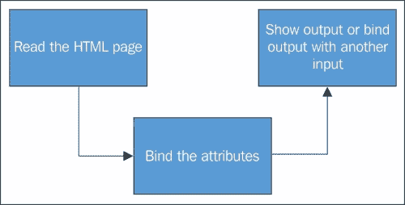
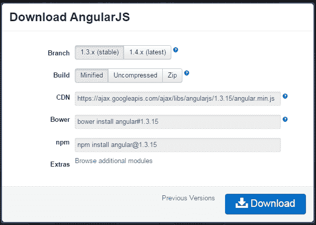
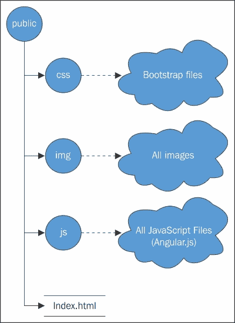
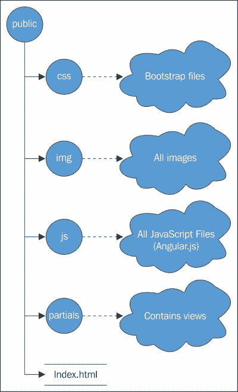

# 第七章：Angular.js 中的承诺

在上一章，我们学习了 Node.js 及其实现。我们还看到了 Node.js 如何用来放大实时网络，以及如何使用承诺来提供更高效的 app。

在本章中，我们探讨了承诺实现的另一面，即在 Angular.js 中的承诺。

随着我们的学习深入，我们将了解什么是 Angular.js，它为什么被创建，它能给我们带来哪些好处，最后，我们将学习如何在 Angular.js 中实现承诺（promises）。

让我们从 Angular.js 的介绍和设置开始。将提供一些示例代码和运行示例。然后我们将转到 Angular.js 中的承诺。

# Angular.js 的演变

自从单页网络应用程序诞生以来，人们已经找到了编写此类应用程序代码的许多方法。单页网络应用程序的使用之所以迅速增加，是因为它们更快、平台无关、轻便，适用于所有类型的设备，并能自动调整到所有屏幕尺寸。这是工程师希望开发单页网络应用程序，并且更愿意使用简化日常工作的库和框架的主要原因。

Angular.js 的创建是基于相同的概念。Angular.js 的核心是采用声明式编程概念，指出用户界面应用来连接软件服务，而我们可以使用命令式编程来定义业务逻辑。

Angular.js 的框架扩展了经典的 HTML（HTML5），以将内容紧密结合。它使用了一种双向数据绑定技术，有助于自动同步模型和视图。有了这些特性，Angular.js 与 DOM 无关，这有助于提高性能和耦合模块的安全标准。

Angular.js 最显著的非功能性属性是其维护者——谷歌的大脑。

谷歌是 Angular.js 开发、维护和发布不同版本背后的力量。

Angular.js 最初于 2009 年发布，旨在提供客户端**MVC**（模型-视图-控制器）实现，以简化应用程序的开发和测试。此外，它还提供了一个工具集，用于创建富互联网应用程序和现代实时网络应用程序的工具。



# Angular.js 文档的结构

Angular.js 使用基础文档的 HTML 文件进行实现。其语法非常简单且容易记忆。页面的结构是一个带有`ng`的简单 HTML 文件。这被称为 Angular.js 指令，它可以与 HTML 一起使用，也可以作为独立的文档链接。

要开始使用 Angular.js，你需要添加几行代码，它就可以运行起来。要使用 Angular.js，请执行以下步骤：

1.  添加`ng`指令；你只需要添加这段简单的代码就可以开始使用 Angular.js：

    ```js
    <html ng-app="opdsys">
    ```

1.  在文件中添加库：

    ```js
    <script type="text/JavaScript" src="img/angular.min.js"></script>
    ```

1.  现在，在 HTML 标签内定义变量，如下所示：

    ```js
    <tr ng-repeat= "reservations in reservation| archive" >
    ```

1.  最后，你可以通过调用变量来使用它：

    ```js
    <td>  {{reservations.id}} < /td>
    ```

# 开始学习 Angular.js

想要下载 Angular.js，请前往[`angularjs.org/`](https://angularjs.org/)并点击**下载**按钮。以下对话框将出现：



选择稳定和压缩构建，然后点击**下载**。这个文件是紧凑的，去除了所有的空白，以便更快地加载。你需要将这个文件保存到你的工作目录中，因为你将在本章的后续部分需要它。

# 创建你的第一个 Angular.js 文件

我们将使用下载的文件将其包含在我们的 HTML 中。从那里，它将展示 Angular.js 是一个双向绑定的框架，并实时显示结果。

## 第一步 - 创建 HTML 5 文档

创建一个这样的文件：

```js
<html>
<head>
  <title></title>
</head>
<body>

</body>
</html>
```

## 第二步 - 向其中添加 JavaScript 文件

创建一个包含以下代码的 JavaScript 文件：

```js
<html>
<head>
  <title> OPD System</title>
  <script type="text/javascript" src='angular.min.js' ></script>
</head>
<body> </body>
```

在前面的代码中添加 Angular.js 指令：

```js
<html ng-app >
<head>
  <title>OPD System</title>
  <script type="text/javascript" src='angular.min.js' ></script>
</head>
<body>
</body>
```

就这样；你现在有一个可以进一步使用的工作 Angular.js 文件了。

# 如何在你本地机器上使用 Angular.js

你有几种方法可以在你的本地机器上体验 Angular.js。一种方法是使用你本地下载的服务器。XAMPP 或 Node.js 服务器可以是你执行 Angular.js 代码的最佳选择。

你可以从[`www.apachefriends.org/download.html`](https://www.apachefriends.org/download.html)下载 XAMPP 服务器并在你的 PC 上安装它。安装完成后，你只需将你的 Angular.js 文件/文件夹拖放到`htdocs`文件夹中，并通过简单地访问`http://localhost/source/`来访问这些文件，其中`source`应该是`htdocs`内的文件夹名称。

使用 Node.js，只需将以下代码粘贴到文本文件中并将其保存为`app.js`：

```js
//sample node server from official site at https://nodejs.org/
var http = require('http');
http.createServer(function (req, res) {
  res.writeHead(200, {'Content-Type': 'text/plain'});
  res.end('Hello World\n');
}).listen(1337, '127.0.0.1');
console.log('Server running at http://127.0.0.1:1337/');
```

将此文件保存到您驱动器上的任何文件夹中。现在，通过在 Windows 机器的**运行**实用程序中键入`cmd`来打开命令提示符，并转到包含`app.js`文件的文件夹。

一旦你到达那里，请输入以下行并按**Enter**：

```js
> node app.js

```

你将看到屏幕上的响应如下：

```js
Server running at http://127.0.0.1:1337/

```

一旦你得到这个响应，你的服务器就可以使用了。将你的 Angular.js 文件放在`app.js`文件所在的同一文件夹中，并使用浏览器访问它，如下所示：

`http://127.0.0.1:1337/source/`

这里，`source`是包含`app.js`文件的文件夹。

# 你对服务器有什么偏好？

你可以使用其中任何一个服务器，因为它们都是开源的，并且都具有对 Angular.js 很好的适应性。选择哪一个完全取决于你。为了让你更容易理解，我选择了 Node.js，因为它非常方便且易于维护，并且性能输出更高。

# Angular.js 的关键元素

在我们深入了解 Angular.js 中如何实现承诺之前，我们将首先查看 Angular.js 的关键元素以及它们是如何为我们工作的。

在本节中，您将学习 Angular.js 的关键元素。所获得的技能将在本章后续部分中使用。您将能够根据需要将 Angular.js 中的承诺概念应用于 Angular.js 并编写自己的自定义承诺。

我们将讨论的最常见元素是：

+   提供作用域数据

+   过滤输出

+   控制作用域

+   路由视图

## 提供作用域数据

我们将对前端 HTML、CSS 和 JavaScript 进行操作，以在浏览器中显示结果。我们还将从[`getbootstrap.com/getting-started/#download`](http://getbootstrap.com/getting-started/#download)获取 bootstrap，以在代码中进行美容修饰：

1.  文件结构必须如以下图片中所定义。为了展示代码如何工作，我们将使用 Node.js 服务器。名为 public 的文件夹需要部署在`app.js`所在的文件夹中。一旦服务器启动，导航到`http://127.0.0.1:3000`，您将在那里看到运行的应用程序。

1.  我们将为地铁站的可用服务创建一个应用程序。让我们称这个站为 Stratford，从这里我们将查看哪个地铁服务可用。

1.  在`js/controller`文件夹中创建一个名为`app.js`的文件。这个文件将看起来像这样：

    ```js
    function AppCtrl ($scope) {
      $scope.serviceName = {
        "CRTL": {
            "code": "CRTL",
            "name": "Central Line Service",
            "currentLocation": "Oxford Circus",

        },

        "JUBL": {
            "code": "JUBL",
            "name": "Jubblie Line Service",
            "currentLocation": "westham",

        },

        "DLR": {
            "code": "DLR",
            "name": "Docland Ligt railway",
            "currentLocation": " westham",

        },

      };
    }
    ```

1.  现在，在 public 文件夹的根目录下创建一个 HTML 文件，命名为`index.html`，并添加以下代码：

    ```js
    <html ng-app>
    <head>
      <title>Services listing </title>
      <script type="text/javascript" src="img/angular.min.js"></script>
      <script type="text/javascript" src="img/app.js"></script>
      <link rel="stylesheet" type="text/css" href="css/bootstrap.min.css">
      <link rel="stylesheet" type="text/css" href="css/bootstrap-responsive.min.css">
    </head>
    <body>
      < ul ng-repeat="services in services">
        <li>{{serviceName.code}}</li>
        <li>{{serviceName.name}}</li>
      </ul> </body>
    </html>
    ```

现在，当您在浏览器中刷新时，它会显示离开 Stratford 车站的服务。然而，这是如何实现的呢？

在 HTML 文档的顶部，有一个`ng`指令将创建 Angular.js 应用程序，然后我们可以包含 JavaScript 文件；一个是 Angular.js 的压缩文件，另一个是我们创建的 JavaScript 文件，它提供作用域以便 HTML 显示它。这一切都是由于一个变量声明`$scope`。

`$scope`负责在提供的范围内绑定数据并提供输出。这有助于 Angular.js 在其独特的范围内执行计算，这就是全部！

## 数据过滤

有时，我们需要以特定格式显示应用程序中的数据。在 Angular.js 中，这就像简单地为我们要过滤的元素提供一些操作符一样简单。

用于此目的的操作符是管道符号，`|`。一旦我们添加了一个管道符号，Angular.js 就知道我们想要过滤掉一些东西。让我们看看两个最重要的过滤器：

为了在页面输出中将文本转换为大写，请考虑以下代码：

```js
<html ng-app>
<head>
  <title>Services listing </title>
  <script type="text/javascript" src="img/angular.min.js"></script>
  <script type="text/javascript" src="img/app.js"></script>
  <link rel="stylesheet" type="text/css" href="css/bootstrap.min.css">
  <link rel="stylesheet" type="text/css" href="css/bootstrap-responsive.min.css">
</head>
<body>
  <div class="container" ng-controller="AppCtrl">
    <h1>Services from Stratford station</h1>
    <ul>
      <li ng-repeat="service in service">{{serviceName.code}}
       - {{serviceName.name | uppercase}}</li>
    </ul>

  </div>
</body>
</html>
```

过滤数据的最有帮助的功能是获取整个对象作为 JSON。这不仅有助于调试模式，而且还用于验证提供的数据以查看格式是否正确。

考虑以下代码，它不仅会过滤出作为 JSON 对象的数据，而且在显示输出之前还会验证它：

```js
<html ng-app>
<head>
  <title>Services listing </title>
  <script type="text/javascript" src="img/angular.min.js"></script>
  <script type="text/javascript" src="img/app.js"></script>
  <link rel="stylesheet" type="text/css" href="css/bootstrap.min.css">
  <link rel="stylesheet" type="text/css" href="css/bootstrap-responsive.min.css">
</head>
<body>
  <div class="container" ng-controller="AppCtrl">
    <h1>Services from Stratford station</h1>
    <ul>
      <li ng-repeat="service in service">{{serviceName.code}}
       - {{serviceName | json}}</li>
    </ul>

  </div>
</body>
</html>
```

这将返回整个 JavaScript 对象作为 JSON。现在，您可以通过获取您的手脏，挖掘 JavaScript 代码并添加`alert()`，来验证数据或进入调试模式。

## 控制作用域

我们还可以向特定流提供一个完整的函数，而不是一个单一的变量；这将帮助我们无需太多麻烦地在任何应用程序的不同部分之间进行互联。考虑以下 JavaScript 代码，它显示了我们如何向特定流提供一个完整的函数：

```js
function AppCtrl ($scope) {
  $scope.serviceName = {
    "CRTL": {
      "code": "CRTL",
      "name": "Central Line Service",
      "currentLocation": "Oxford Circus",

    },

    "JUBL": {
      "code": "JUBL",
      "name": "Jubblie Line Service",
      "currentLocation": "westham",

    },

    "DLR": {
      "code": "DLR",
      "name": "Docland Ligt railway",
      "currentLocation": " westham",

    },

  };

  $scope.curretStation = null;

  $scope.setAirport = function (code) {
    $scope.curretStation = $scope.service[code];
  };
}
```

在最后三行中，我们添加了一个函数，它将被完全传递给 HTML 输出中的调用`ng`指令。HTML 代码看起来像这样：

```js
<html ng-app>
<head>
  <title>Services listing </title>
  <script type="text/javascript" src="img/angular.min.js"></script>
  <script type="text/javascript" src="img/app.js"></script>
  <link rel="stylesheet" type="text/css" href="css/bootstrap.min.css">
  <link rel="stylesheet" type="text/css" href="css/bootstrap-responsive.min.css">
</head>
<body>
  <div class="container" ng-controller="AppCtrl">
    <h1>Services from Stratford station</h1>
    <ul>
      <li ng-repeat="Services in ServicesName">
        <a href="" ng-click="setAirport(Services.code)">{{Services.code}} - {{Services.code}}</a>
      </li>
    </ul>

    <p ng-show="currentStation">Current Services: {{currentStationname}}</p>
  </div>
</body>
</html>
```

请注意，我们写的代码非常整洁，更新非常少。我们可以在`body`标签完成之前的最后几行实现许多所需的更改；您将注意到我们是如何通过 Angular.js 传递一个完整的函数的。

## 路由视图

传统的网站由许多通过`href`标签链接在一起的页面组成。他们的内容很难阅读，并且比以往任何时候都需要更多的维护。随着单页 Web 应用程序的出现，信息立即出现在浏览器中，因为视图可以通过从一个链接路由到另一个链接，而不需要重复访问服务器，或不需要等待页面加载。



从我们的示例中，我们将添加另一个文件作为一个模块，并将其放在 JS 文件夹的根目录下。代码看起来像这样：

```js
angular.module('services', [])
  .config(airlineRouter);

function airlineRouter ($routeProvider) {
  $routeProvider
    .when('/', {templateUrl: 'partials/destinations.html',
      controller: 'DestinationsCtrl'})
    .when('/Services/:airportCode', {
      templateUrl: 'partials/stations.html',
      controller: 'ServiceCtrl'
    })
    .when('/service', {
      template: '<h3>Flights</h3> {{Services | json}}',
      controller: 'FlightsCtrl'})
    .when('/reservations', {
      template: '<h3>Your Reservations</h3> {{Services | json}}',
      controller: 'ReservationsCtrl'});
}
```

这将在不经过服务器的情况下，在浏览器中动态生成视图。我们需要添加更多的文件以增加动态性。我们将添加一个名为`partials`的文件夹，在该文件夹中我们放置了两个名为`services`和`destination`的文件。

`destination.html`文件将看起来像这样：

```js
<div class="pull-left span6">
  <h3>All Destinations</h3>
  <ul>
    <li ng-repeat="destinationin destinations">
      <a href="" ng-click="setDestinations (service.code)">{{name.code}} - {{destination.name}}</a>
    </li>
  </ul>

</div>
<div class="span5" ng-include src="img/sidebarURL"></div>
```

`services.html`文件将看起来像这样：

```js
<div ng-show="CurrentServices">
  <h3>{{CurrentServices.name}}</h3>

  <h4>Destinations</h4>

  <ul>
    <li ng-repeat="destination in CurrentServices.destinations">
      <a ng-href="#/airports/{{destination}}">{{destination}}</a>
    </li>
  </ul>
</div>
```

在根目录下的 public 文件夹中编辑`index.html`文件后，视图将看起来像这样：

```js
<html ng-app="ServiceCtrl">
<head>
  <title>Demo</title>
  <script type="text/javascript" src="img/angular.min.js"></script>
  <script type="text/javascript" src="img/app.js"></script>
  <script type="text/javascript" src="img/destinations.js"></script>
  <script type="text/javascript" src="img/services.js"></script>
  <script type="text/javascript" src="img/reservations.js"></script>
  <script type="text/javascript" src="img/station.js"></script>
  <script type="text/javascript" src="img/app.js"></script>
  <link rel="stylesheet" type="text/css" href="css/bootstrap.min.css">
  <link rel="stylesheet" type="text/css" href="css/bootstrap-responsive.min.css">
</head>
<body>
  <div class="container" ng-controller="AppCtrl">
    <h1>AngulAir</h1>

    <ul class="nav nav-pills">
      <li ng-class="destinationsActive">
        <a href="#">Destinations</a>
      </li>
      <li ng-class="servicesActive">
        <a href="#/services">services</a>
      </li>
      <li ng-class="reservationsActive">
        <a href="#/reservations">Reservations</a>
      </li>
    </ul>

    <div ng-view></div>
  </div>
</body>
</html>
```

# 在 Angular.js 中实现承诺。

承诺的全部内容在于如何将异步行为应用于应用程序的某一部分或整个应用程序。有许多其他的 JavaScript 库也存在承诺的概念，但在 Angular.js 中，它比其他任何客户端应用程序都要高效。

在 Angular.js 中，承诺有两种口味，一个是`$q`，另一个是 Q。它们之间有什么区别？我们将在接下来的部分详细探讨。现在，我们将看看对 Angular.js 来说承诺意味着什么。

在 Angular.js 中实现承诺有多种可能的方式。最常见的是使用`$q`参数，这是受 Chris Kowal 的 Q 库启发的。主要的是，Angular.js 使用这个来提供异步方法的实现。

在 Angular.js 中，服务的顺序是从上到下，从`$q`开始，它被认为是最高层；在其中，还嵌入了许多其他子类，例如`$q.reject()`或`$q.resolve()`。与 Angular.js 中的一切承诺相关的都必须遵循`$q`参数。

从`$q.when()`方法开始，它看起来像是立即创建一个方法，但实际上它只是规范化了一个可能或不创建承诺对象的值。`$q.when()`的用法基于传递给它的值。如果传递的值是一个承诺，`$q.when()`会执行它的任务；如果它不是一个承诺值，`$q.when()`会创建它。

# 在 Angular.js 中使用承诺的架构

由于 Chris Kowal 的 Q 库是全局承诺回调返回的提供者和灵感来源，Angular.js 也使用它来实现承诺。Angular.js 中的许多服务默认返回类型都是面向承诺的。这包括`$interval`、`$http`和`$timeout`。然而，Angular.js 中有个适当的承诺使用机制。看看下面的代码，了解承诺如何在 Angular.js 中自我映射：

```js
var promise = AngularjsBackground();
promise.then(
  function(response) {
    // promise process 
  },
  function(error) {
    // error reporting 
  },
  function(progress) {
    // send progress

});
```

在 Angular.js 中提到的所有服务都返回一个承诺对象。它们在接收参数方面可能有所不同，但它们都以带有多个键的单个承诺对象作为回应。例如，当你提供四个名为`data`、`status`、`header`和`config`的参数时，`$http.get`返回一个单一对象。

```js
$http.get('/api/tv/serials/sherlockHolmes ')
  .success(function(data, status, headers, config) {
    $scope.movieContent = data;
});
```

如果我们在这里使用承诺的概念，相同的代码将被重写为：

```js
var promise = $http.get('/api/tv/serials/sherlockHolmes ')
promise.then(
  function(payload) {
    $scope.serialContent = payload.data;
});
```

之前的代码比这之前的代码更简洁，也更容易维护，这使得使用 Angular.js 的工程师更容易适应。

# 将回调作为承诺的处理方式

在 Angular.js 中实现承诺定义了您对承诺作为回调处理的使用。实现不仅定义了如何在 Angular.js 中使用承诺，还定义了应采取哪些步骤使服务成为“承诺返回”。这表明您异步地执行某事，一旦您的任务完成，您必须触发`then()`服务，要么结束您的任务，要么将其传递给另一个`then()`方法：`/异步 _ 任务.then().then().done()`。

更简单地说，您可以这样做来实现承诺作为回调的处理方式：

```js
angular.module('TVSerialApp', [])
  .controller('GetSerialsCtrl', 
    function($log, $scope, TeleService) {
      $scope.getserialListing = function(serial) {
        var promise = 
          TeleService.getserial('SherlockHolmes');
        promise.then(
          function(payload) { 
            $scope.listingData = payload.data;
          },
          function(errorPayload) {
            $log.error('failure loading serial', errorPayload);
        });
      };
  })
  .factory('TeleService', function($http) {
    return {

      getserial: function(id) {
        return $http.get(''/api/tv/serials/sherlockHolmes' + id);
      }
    }
  });
```

# 盲目传递参数和嵌套承诺

无论你使用哪个承诺服务，你都必须非常确定你传递了什么，以及这如何影响你的承诺函数的整体工作。盲目传递参数可能会导致控制器混淆，因为它必须处理自己的结果同时处理其他请求。比如说我们正在处理`$http.get`服务，你盲目地给它传递了太多的负载。由于它必须在并行中处理自己的结果，可能会导致混淆，从而可能引发回调地狱。然而，如果你想要后处理结果，你必须处理一个额外的参数，称为`$http.error`。这样，控制器就不用处理自己的结果，像 404 和重定向这样的调用将被保存。

你也可以通过构建自己的承诺并使用以下代码返回你选择的结果和你想要的有效负载来重现前面的场景：

```js
factory('TVSerialApp', function($http, $log, $q) {
 return {
    getSerial: function(serial) {
      var deferred = $q.defer();
      $http.get('/api/tv/serials/sherlockHolmes' + serial)
        .success(function(data) { 
          deferred.resolve({
            title: data.title,
            cost: data.price});
        }).error(function(msg, code) {
            deferred.reject(msg);
            $log.error(msg, code);
        });
        return deferred.promise;
    }
  }
});
```

通过构建自定义承诺，你有许多优点。你可以控制输入和输出调用，记录错误消息，将输入转换为所需的输出，并通过使用`deferred.notify(mesg)`方法共享状态。

# 延迟对象或组合的承诺

由于在 Angular.js 中自定义承诺有时可能难以处理，最坏的情况下可能会出现故障，承诺提供了另一种实现方式。它要求你在`then`方法中转换你的响应，并以一种自主的方式返回转换后的结果给调用方法。考虑我们在上一节中使用的相同代码：

```js
this.getSerial = function(serial) {
    return $http.get('/api/tv/serials/sherlockHolmes'+ serial)
        .then(
                function (response) {
                    return {
                        title: response.data.title,
                        cost:  response.data.price

                    });
                 });
};
```

我们从前面方法中产生的输出将是一个链式、承诺式且转换过的。你再次可以使用输出用于另一个输出，将其链式到另一个承诺，或简单地显示结果。

控制器可以转换为以下代码行：

```js
$scope.getSerial = function(serial) {
  service.getSerial(serial) 
  .then(function(serialData) {
    $scope.serialData = serialData;
  });
};
```

这显著减少了代码行数。同时，这也帮助我们维持了服务级别，因为`then()`中的自动安全机制可以帮助它转换为失败的承诺，并保持其余代码不变。

# 处理嵌套调用

在`success`函数中使用内部返回值时，承诺代码可以感觉到你忽略了一件最明显的事情：错误控制器。缺失的错误可能导致你的代码停止运行或陷入无法恢复的灾难。如果你想克服这个问题，只需抛出错误。怎么做？请看下面的代码：

```js
this.getserial = function(serial) {
    return $http.get('/api/tv/serials/sherlockHolmes' + serial)
        .then(
            function (response) {
                return {
                    title: response.data.title,
                    cost:  response.data.price
                });
            },
            function (httpError) {
                // translate the error
                throw httpError.status + " : " + 
                    httpError.data;
            });
};
```

现在，无论代码进入何种错误情况，它都会返回一个字符串，而不是一串`$http`状态或配置详情。这也可以拯救你的整个代码进入停滞模式，并帮助你在调试。另外，如果你附上了日志服务，你可以精确地定位出错的地点。

# Angular.js 中的并发

我们都希望在单一时间槽中获得最大输出，通过请求多个服务调用并从它们获取结果。Angular.js 通过其`$q.all`服务提供此功能；您可以同时调用许多服务，如果您想要将它们全部或任意组合在一起，您只需要`then()`将它们按照您想要的顺序组合在一起。

首先获取数组的有效载荷：

```js
[ 
  { url: 'myUr1.html' },
  { url: 'myUr2.html' },
  { url: 'myUr3.html' }
]
```

现在这个数组将被以下代码使用：

```js
service('asyncService', function($http, $q) {
     return {
       getDataFrmUrls: function(urls) {
         var deferred = $q.defer();
         var collectCalls = [];
         angular.forEach(urls, function(url) {
           collectCalls.push($http.get(url.url));
         });

         $q.all(collectCalls)
         .then(
           function(results) {
           deferred.resolve(
             JSON.stringify(results)) 
         },
         function(errors) {
           deferred.reject(errors);
         },
         function(updates) {
           deferred.update(updates);
         });
         return deferred.promise;
       }
     };
});
```

通过为每个 URL 执行`$http.get`来创建一个 promise，并将其添加到数组中。`$q.all`函数接受一个 promise 数组的输入，然后将所有结果处理成一个包含每个答案的对象的单个 promise。这将被转换为 JSON 并传递给调用者函数。

结果可能像这样：

```js
[
  promiseOneResultPayload,
  promiseTwoResultPayload,
  promiseThreeResultPayload
]
```

# 成功和错误的组合

`$http`返回一个 promise；您可以根据这个 promise 定义它的成功或错误。许多人认为这些函数是 promise 的标准部分——但实际上，它们并不是看起来那样。

使用 promise 意味着你在调用`then()`。它有两个参数——成功回调函数和失败回调函数。

想象一下这个代码：

```js
$http.get("/api/tv/serials/sherlockHolmes")
.success(function(name) {
    console.log("The tele serial name is : " + name);
})
.error(function(response, status) {
    console.log("Request failed " + response + " status code: " + status);
};
```

这可以重写为：

```js
$http.get("/api/tv/serials/sherlockHolmes")
.success(function(name) {
    console.log("The tele serial name is : " + name);
})
.error(function(response, status) {
    console.log("Request failed " + response + " status code: " + status);
};

$http.get("/api/tv/serials/sherlockHolmes")
.then(function(response) {
    console.log("The tele serial name is :" + response.data);
}, function(result) {
    console.log("Request failed : " + result);
};
```

可以使用`success`或`error`函数，具体取决于情境的选择，但使用`$http`有一个好处——它很方便。`error`函数提供了响应和状态，而`success`函数提供了响应数据。

这并不是 promise 的标准部分。任何人都可以向 promise 添加自己的这些函数版本，如下面的代码所示：

```js
//my own created promise of success function

promise.success = function(fn) { 
    promise.then(function(res) {
        fn(res.data, res.status, res.headers, config);
    });
    return promise;
};

//my own created promise of error function

promise.error = function(fn) {  
    promise.then(null, function(res) {
        fn(res.data, res.status, res.headers, config);
    });
    return promise;
};
```

# 安全方法

所以，讨论的真正问题是与`$http`一起使用什么？成功还是错误？记住，编写 promise 没有标准方式；我们必须考虑许多可能性。

如果您更改代码，使 promise 不是从`$http`返回的，那么当我们从缓存加载数据时，如果您期望成功或错误，您的代码将会断裂。

因此，最佳做法是尽可能使用`then`。这不仅会概括编写 promise 的整体方法，还会减少代码中的预测元素。

# 路由您的 promise

Angular.js 具有路由 promise 的最佳特性。当您同时处理多个 promise 时，这个特性很有帮助。以下是如何通过以下代码实现路由的：

```js
$routeProvider
  .when('/api/', {
      templateUrl: 'index.php',
      controller: 'IndexController'
  })
  .when('/video/', {
      templateUrl: 'movies.php',
      controller: 'moviesController'
  })
```

正如您所观察到的，我们有两个路由：`api`路由带我们到索引页，使用`IndexController`，视频路由带我们到电影页。

```js
app.controller('moviesController', function($scope, MovieService) {  
    $scope.name = null;

    MovieService.getName().then(function(name) {
        $scope.name = name;
    });
});
```

有一个问题，直到`MovieService`类从后端获取名称，该名称是`null`。这意味着如果我们的视图绑定到名称，首先它是空的，然后才设置。

这就是路由器出现的地方。路由器解决了将名称设置为`null`的问题。我们可以这样做到：

```js
var getName = function(MovieService) {  
       return MovieService.getName();
   };

$routeProvider
  .when('/api/', {
      templateUrl: 'index.php',
      controller: 'IndexController'
  })
  .when('/video/', {
      templateUrl: 'movies.php',
      controller: 'moviesController'
  })
```

在添加解析后，我们可以重新访问控制器的代码：

```js
app.controller('MovieController', function($scope, getName) {

    $scope.name = name;

});
```

您还可以为您的承诺定义多个解决方法，以获得最佳可能的输出：

```js
$routeProvider
  .when('/video', {
      templateUrl: '/MovieService.php',
      controller: 'MovieServiceController',
      // adding one resole here
      resolve: {
          name: getName,
          MovieService: getMovieService,
          anythingElse: getSomeThing
      }
      // adding another resole here
       resolve: {
          name: getName,
          MovieService: getMovieService,
          someThing: getMoreSomeThing
      }
  })
```

# 总结

在本章中，我们学习了如何在 Angular.js 中实现承诺，它是如何发展的，以及承诺如何帮助创建为实时网络应用而设计的应用程序。我们还看到了 Q 库的功能以及 Angular.js 中使用承诺的实现代码，并学习了如何在我们下一个应用程序中使用它们。

Angular.js 中承诺的规范非常接近 ECMAScript 6 提出的规范，但是当 Angular.js 完全采用承诺作为自己的规范时，可能会有所变化。它将定义自己的一套规则来使用承诺，这可能与规范本身不同。

在下一章中，我们将探讨如何在 jQuery 中实现承诺，以及将会是怎样的机制以及它将带来哪些好处。
