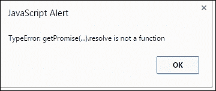
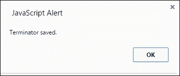
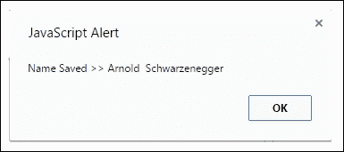
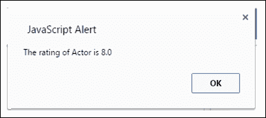
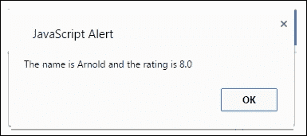

# 第八章：jQuery 中的承诺（Promises）

在上一章中，我们学习了承诺（promises）是如何在 Angular.js 中实现的，以及它们如何在快速发展的实时 Web 应用行业中提供好处的。在本章中，我们将探讨另一个非常著名且实用的 JavaScript 库，用于前端 Web/移动应用开发。

jQuery 是众多常用的 JavaScript 库之一，它被认为是维护性最强、最先进且易于采用的库之一。jQuery 也有助于缩短冗长的代码行，使其变得更简洁、更易理解。这一工具帮助 jQuery 获得了超出想象的普及度。在本章中，我们将回顾 jQuery 的发展历程，它是如何演进的，如何使用它以及承诺（promises）是如何在 jQuery 的成熟过程中发挥作用的。让我们从简要回顾 jQuery 的发展历程开始。

# 它从哪里开始？

在 JavaScript 中编写代码的古典方式相当繁琐。由于该语言没有很多固定的规则，编写出的 JavaScript 代码变得难以实现和修改。开发人员选择函数和变量名称的方式使得简单函数变得不易阅读，因此在类似性质的另一个项目中不值得使用。此外，JavaScript 被认为是计算机世界中第二流的编程语言，因此没有多少人认真使用它。

2006 年 8 月，jQuery 的诞生照亮了 JavaScript 世界。jQuery 的创造者约翰·雷西格（John Resig）在他的博客文章中宣布 jQuery 1.0 正式发布。这是人们开始真正认真对待 JavaScript 并确信其可信度的第一次。虽然 JavaScript 从 90 年代初就已经存在（如第一章所述），但它经历了很多起伏。最终，随着 Firefox 浏览器和 jQuery 的发布，JavaScript 终于获得了一些可信度。

# 幕后 – jQuery 是如何工作的？

jQuery 基于一个简单的原则：写得更少，做得更多。在几行 jQuery 代码中，你将能够完成比传统编写代码方式更多的任务。jQuery 在短时间内使许多任务变得容易完成。它还使代码更整洁、更易读，这在 JavaScript 中是前所未有的。

jQuery 出现后，JavaScript 开始发生了戏剧性的变化。许多新的实现开始出现在屏幕上，采用更加成熟的方法，但 jQuery 获得的地位是无法比拟的，至今仍然如此。

说到这里，让我们回到我们的主题：jQuery 幕后是如何工作的？

一切围绕着美元符号（$）。jQuery 库提供了 jQuery() 函数，该函数允许你像 CSS 选择器一样选择元素。例如：

```js
var itemsList = jQuery query("ul");
```

或者：

```js
var itemsList = $("ul");
```

在前一行中，`$`符号是 jQuery 的表示。在 JavaScript 中，变量名可以是任何东西，但必须不以数字开头，且不能包含连字符。这样使用`$`对于规则来说更方便，也更容易记住。你也可以找到像这样的函数：

```js
window.jQuery = window.$ = jQuery;
```

在这里，`$`符号出现在函数的最后。你会在 jQuery 源代码中注意到同样的情况。

这个机制是当你调用`$()`并给它提供一个选择器时，你实际上正在创建一个新的 jQuery 对象。在 JavaScript 中，函数也是对象，这意味着`$()`不仅嵌入了一个单一的对象，而且它可能包含方法、变量和多个对象。所以，你可以使用`$.support`来获取当前环境的信息，或者你也可以使用`$.ajax`来进行 AJAX 调用以发起 AJAX 请求。

# 你的文档准备好提交了吗？

有时，当你在文档还未完成时提交它，而你不知道它还需要进一步处理，这种情况可能会发生。这样的事件将触发一系列事件，最终使你的页面或应用程序进入服务失败模式。

使用 jQuery，这种情况很少发生，因为它提供了`$(document).ready()`方法，该方法将帮助完成文档的处理。一个简单的例子可以在这里看到：

```js
$(document).ready(function() {
  console.log('ready!');
});
```

函数将执行，并在文档准备好时传递给`.ready()`。我们使用`$(document)`从页面的文档创建一个 jQuery 对象。然后我们在这个对象上调用`.ready()`函数，把它传递给我们想要执行的函数。

# 如何使用 jQuery

正如我们在第七章中看到的，*Angular.js 中的 Promises*，与 Angular.js 相关的文档是链接在 HTML 页面中调用函数的 JavaScript 文件；jQuery 中使用了相同的结构。

jQuery 是一个链接在 HTML 文件开头的 JavaScript 文件。这可以通过两种方式实现：从 Web 上的位置调用文件，或者将 JavaScript 文件下载到你的本地硬盘上然后嵌入代码。无论哪种方式都可以工作，但我们更倾向于从硬盘上使用它。

以下代码行显示了当我们想要从远程位置链接文件时：

```js
<head>
<script src="img/jquery-1.9.min.js"></script>
</head>
```

或者，我们可以将文件下载到我们的本地硬盘上，并像这样更改语法：

```js
<head>
<script src="img/jquery-1.9.min.js"></script>
</head>
```

在这里，`src="js"`表示 JavaScript 文件存在的本地文件夹。

总之，你可以选择使用已经写好的 jQuery，通过在 HTML 文件头部嵌入 URL 来使用它，或者你可以下载它并进行自己的修改。无论哪种方式，你的输出都会在浏览器的屏幕上生成。

# 语法：

jQuery 的真正力量在于其自定义的语法，这将帮助选择 HTML 元素并执行一些操作。它的语法相当直接且容易记住，而且非常整洁。以下是 jQuery 语法的示例：

```js
$(selector).action ()
```

美元符号（`$`）定义了你是否将使用 jQuery，而`selector`查询是用来查找 HTML 元素的，`action`定义将在选定的元素上执行什么类型的操作。

以下是一些使用 jQuery 语法的示例，解释了 jQuery 是如何工作的：

+   `$(this).hide()`：隐藏当前元素

+   `$("p").hide()`：隐藏所有`<p>`元素

+   `$(".test").hide()`：隐藏所有具有`class="test"`的元素

+   `$("#test").hide()`：隐藏具有`id="test"`的元素

这些是 jQuery 提供的成百上千种方法中的几个示例。对于方法和 API 的完整参考，以下是所有 jQuery 需求的链接：[`api.jquery.com/`](https://api.jquery.com/)。

# jQuery 中的缓存

让我们简要讨论一下与 jQuery 相关的缓存，以及作为一个概念的缓存。

缓存的概念与互联网本身一样古老，至少与现代互联网一样古老。开发者使用它来存储重复的数据，以减少服务器调用成本或记住用户与服务器之间的连接。

缓存通过将图像写入并把会话信息发送到用户硬盘上的特殊位置——临时存储，以多种方式提高 web 应用的性能。通常，这个位置是专门在本地硬盘上创建的，专门处理这类数据。

比如说你正在通过浏览器浏览一个在线购物车。在最初的时刻，网站被加载到你的临时记忆中。这包括添加产品的图片和其他元信息，这标志着该特定网站的初始缓存。现在，假设你决定购买一个产品并登录到购物车的用户区域。这将会在一个名为 cookie 的小文本文件中缓存你的信息，该文件持有关于你是谁以及记住你正在与哪个 web 服务器对话的信息。这是一个将你的信息缓存到临时位置的流程，以减少服务器调用，优化导航，并让服务器记住你的身份。

jQuery 在缓存需要缓存的元素方面有什么提供呢？让我们来看看。

jQuery 中的缓存是通过 data 函数提供的，它与你在 jQuery 中调用的任何其他函数相同。这个函数本身允许你将随机数据绑定到随机选择器。大多数开发者使用它来操作 DOM 元素，但它的应用并不仅限于于此。你可以在给定的时间槽内添加多个选择器，以绑定多个引用，因为函数会自动处理；就是这么简单和容易。然而，元素和它们的处理程序是如何保持在内存中的呢？

jQuery 遵循“名称对应值”的方法来编写和处理内存中的元素。其独特之处在于，元素的名称对于许多条目来说可以相同，但它们必须指向不同的 DOM 元素。这样，通过值引用就变得重要了，并且引用特定元素对于使用它的程序来说会更快、更容易遍历。

现在，要向数据函数添加元素，我们将遵循与此类似的语法：

```js
$("#Textbox_").data("im_textbox1", value)
```

从这里，你可以看到我们将选择器与`data()`函数绑定，并在函数内部提供了两个参数作为名称及其相应的值。这样，我们可以绑定尽可能多的选择器来缓存它们。

但是，故事有一个转折。你可以使用`data()`在缓存中写入，但它不会自动删除数据。你必须从临时内存中手动删除它。你可以像这样调用`removeData()`方法：

```js
$("#Textbox_").removeData(value)
```

当然，你可以通过编写某种 cron/定时任务函数来自动化`removeData()`的函数调用。然而，这需要巧妙的工程设计和大量的干燥运行，因为此操作可能会从临时存储中永久删除任何重要数据，所以建议非常谨慎地使用此类定时任务。

总的来说，jQuery 中的缓存是一个基本组成部分，没有它，你无法优化应用程序的流程和数据遍历。使用 jQuery 缓存还可以优化服务器调用的数量，并提高你代码的性能。

# 示例

在我们开始本章的主要内容之前，我们需要了解如何编写可以使用 jQuery 查询的文件。这将使我们更好地理解代码级别的运作，并将使我们能够熟练地在 jQuery 中使用承诺。

让我们从选择器开始。

## 选择器

选择器使我们能够选择和操作 HTML。我们可以使用它们来查找基于它们 ID 的 HTML 元素：类、类型、属性、值等等。这些选择器与 CSS 中的选择器类似，但带有 jQuery 的特色。这里的特色是所有选择器都以美元符号`$`开头，后面跟着圆括号和点，如下面的代码所示：

```js
<!DOCTYPE html>
<html>
   <head>
      <title> Selector in action </title>
      <script src="img/jquery-1.9.0.js"></script>
      <script>
         $(document).ready(function(){
             $("button").click(function(){
                 $("p").hide(); // this will able to select paragraph element from HTML
             });
         });
      </script>
   </head>
   <body>
      <h2>I am a heading </h2> <!-- this is the place from where the  paragraph is selected -->
      <p>I am a paragraph.</p>
      <button>I am a button </button>
   </body>
</html>
```

看看前面的代码。`</script>`标签后面的脚本标签是选择器定义自己并进行请求处理的地方。一旦页面加载完成，它将带有一个按钮说“我是一个段落”，当你点击它时，按钮的名称将从“我是一个段落”更改为“我是一个按钮”。这一切都是在没有页面更改的情况下发生的，因为 jQuery 能够实时地与 HTML 元素交互并在同一页面上显示结果。这是 jQuery 众多开发者每天都在使用的有益特性之一。这种绑定、即时计算是 jQuery 成为许多开发者选择的原因。

## 事件方法

jQuery 有许多事件驱动的接口。当您触发某个事件时，这些接口将被调用。有许多事件，如鼠标点击、鼠标双击、键盘按键、鼠标悬停和触摸。jQuery 使它们变得简单；你只需要写几行代码，其余的处理将由 jQuery 库完成。请看以下示例：

```js
<!DOCTYPE html>
<html>
   <head>
      <script src="img/jquery-1.9.0.js"></script>
      <script>
         $(document).ready(function(){
             $("h1").click(function(){
                 $(this).hide();
             });
         });
      </script>
   </head>
   <body>
      <h1> Click me to make me disappear </h1>
   </body>
</html>
```

当我点击屏幕上出现的文本时，页面会发生什么？有人猜测吗？是的，当我把`h1`标签的值传递给 jQuery 函数时，它会消失，当它感觉到鼠标被点击时，它会隐藏它。这是我们通常在表单或文本区域中玩占位符的方式，但现在，表单已经内置了这种能力。

说了这么多，是时候转向我们章节的重点了。

# jQuery 之前的 JavaScript 和之后的 JavaScript

曾经有一段时间，一个简单的鼠标点击可以通过一个简单的函数`element.onClick = functionName`来捕获。这对当时来说很好，直到另一个想要监听同一个点击事件的函数出现。这个问题通过从 DOM 函数中添加`addListenerEvent`函数来解决。这个函数尽可能多地添加了监听器函数，我们通常采用这种方法。

然而，这样的情况是注定要再次发生的，因为我们现在面临着与 AJAX 调用相同的问题。AJAX 使用一个单一的回调函数，不仅是 jQuery 的`$ajax()`，还有具有类似问题的`XMLHttpRequest`对象。

# 解决方案——在 jQuery 中引入承诺

对于前面问题的解决方案最终在 jQuery 1.5 中以延迟对象的形式提供。在 jQuery 中引入延迟概念之前，典型的 AJAX 调用是这样的：

```js
$.ajax({
  url: "/testURL.com",
  Success: TheSuccessFunction,
  Error: TheErrorFunction
});
```

你能猜出这个函数的输出是什么吗？是的，一个单独的`XMLHttpRequest`对象，这对于那些仍然维护着在 jQuery 1.5 之前构建的应用的人来说是相当预期的。

那么，jQuery 1.5 中引入了什么重大变化呢？首先，它是基于一个 common JavaScript 规范，定义了常见的接口，可以根据需要进行扩展，其次，它们非常全局化，你可以将这些功能用在类似的服务中，比如 Node.js。

在 jQuery 1.5 中添加了延迟对象之后，之前的代码被重写成了这样：

```js
var promise = $.ajax({
  url: "/testURL.com"
});
promise.done(TheSuccessFunction);
promise.fail(TheErrorFunction);
```

如果您想要编写前述代码的更简洁版本，可以按照以下方式实现：

```js
var promise = $.ajax({
  url: "/testURL.com"
});

promise.then(TheSuccessFunction,TheErrorFunction);
```

同样，通过在 jQuery 中引入承诺，带来了许多其他进步。在以下部分中，我们将详细了解 jQuery 是如何实现其承诺的。

# jQuery 中的延迟

像在承诺的任何其他实现中一样，`Deferred`在 jQuery 中也有其重要性和价值。力量在于概念的实现，这是简单而强大的。在 jQuery 中，`deferred`有两个重要的方法，用于与三个重要事件链接以附加回调。这些方法是`resolve`和`reject`，可以附加回调的事件是`done()`、`fail()`和`always()`。让我们通过一个例子来看一下：

```js
<!DOCTYPE html>
<html>
   <head>
      <script src="img/jquery-1.9.0.js"></script>
      <script>
         var deferred = $.Deferred();

         deferred.done(function(value) {
         alert(value);
         });

         deferred.resolve("hello $.deferred ");

      </script>
   </head>
   <body>
      <h1> $.deferred was just displayed </h1>
   </body>
</html>
```

在这里要记住的是，无论`deferred`是否解决，回调总是会被执行，但是当你调用`reject`方法时，失败的回调将被执行。说到这一点，我们前面的例子可以像这样：

```js
<!DOCTYPE html>
<html>
   <head>
      <script src="img/jquery-1.9.0.js"></script>
      <script>
         var deferred = $.Deferred();

         deferred.resolve("hello resolve");

         deferred.done(function(value) {
           alert(value);
         });

      </script>
   </head>
   <body>
      <h1> sample example of Deferred  object.  </h1>
   </body>
</html>
```

如果我们要总结`$.Deferred`对象是什么；我们可以说是只是一个有方法的承诺，这将允许其所有者要么解决要么拒绝它。

# $.Deferred().promise() in jQuery

`Deferred`的闪亮之星之一就是它的承诺。这个方法能做什么？嗯，它返回一个对象，并且几乎与`Deferred`相同的接口。但是，有一个陷阱。它只是为了附加回调，而不是解决或拒绝。

这是一个在某些其他情况下非常有用的功能，比如说你想调用一个 API。这将没有能力解决或拒绝延迟。这样的代码最终会失败，因为这里的承诺没有方法。

尝试执行这段代码，将其保存为`test.html`然后运行文件：

```js
<!DOCTYPE html>
<html>
   <head>
      <script src="img/jquery-1.9.0.js"></script>
      <script>
         function getPromise(){
             return $.Deferred().promise();
         }

         try{
             getPromise().resolve("a");
         }
         catch(err){
         alert(err);
         }
      </script>
   </head>
   <body>
      <h1> you have seen the error.  </h1>
   </body>
</html>
```

你会得到一个错误，像这样：



所以，像前面提到的那样，它返回一个对象，并且几乎与`Deferred`相同的接口。然而，它只是为了附加回调，而不是解决或拒绝；这是我们之前谈论的陷阱。现在，我们如何解决它？很简单。你可以将承诺作为另一个函数的返回值；让我们尝试以下代码：

```js
<!DOCTYPE html>
<html>
   <head>
      <script src="img/jquery-1.9.0.js"></script>
      <script>
         var post = $.ajax({
             url: "/localhost/json/", 
             data: {json: JSON.stringify({firstMovieName: "Terminator", secondMovieName: "Terminator 2"})} ,
             type: "POST"
         });

         post.done(function(p){
             alert(p.firstMovieName +  " saved.");
         });

         post.fail(function(){
             alert("error! b/c this URL is not functioning");
         });

      </script>
   </head>
   <body>
      <h1> you have seen the error.  </h1>
   </body>
</html>
```

当你运行前面的代码时，它会在页面的警告对话框中给出一个错误，如果 URL 变量中传递的 URL 是真实的，它不应该这样做。为了理解，让我们假设 URL 是正确的，它保存了值，结果会像这样：



前面代码和那一段代码只有一个区别——你可以添加尽可能多的回调，代码的语法干净，因为它显示我们不想在方法中有一个额外的参数。因此，你可以要求 jQuery 中的承诺执行一些操作。

# jQuery 中的承诺投射

在某些情况下，我们只需要显示一个承诺的名字。当您只想查看元素可以是什么或者您想对对象执行哪些操作时，这将非常有用。使用 jQuery，我们可以通过使用`pipe()`函数轻松实现。

考虑这个我们正在投射结果的代码，结果是一个演员：

```js
<!DOCTYPE html>
<html>
   <head>
      <script src="img/jquery-1.9.0.js"></script>
      <script>
         var post = $.post("/echo/json/",
          {
              json: JSON.stringify({firstName: "Arnold", lastName: "Schwarzenegger"})
          }
         ).pipe(function(p){ 
          return "Name Saved >> " + p.firstName + "  " + p.lastName;
         });

         post.done(function(r){ alert(r); });
      </script>
   </head>
   <body>
      <h1> you have seen the result .  </h1>
   </body>
</html>
```

代码的结果将是一个全名，阿诺德·施瓦辛格，在浏览器的警告对话框中显示：



如你所见，结果的投影是一个用作对象的演员名字。所以，我们不是一个人 deferred，我们有一个`Name Saved >> Arnold Schwarzenegger`的 deferred。

`pipe`函数也可以用来从方法调用深处返回对象。我们可以挖掘出一个演员的名字和他的 IMDB 评分，如下面的代码所示：

```js
<!DOCTYPE html>
<html>
   <head>
      <script src="img/jquery-1.9.0.js"></script>
      <script>
         function getActorById(customerId){
             return $.post("/echo/json/", {
                     json: JSON.stringify({firstName: "Arnold", lastName: "Schwarzenegger", rating: "8.0"})
             }).pipe(function(p){
                 return p.rating;
             });
         }

         function getRating(rating){
             return $.post("/echo/json/", {
                     json: JSON.stringify({
                         rating: "8.0" })
             }).pipe(function(p){
                 return p.rating;
             });
         }

         function getActorRatingById(id){
             return getActorById)
                    .pipe(getRating);  
         }

         getActorRatingById(123)
             .done(function(a){
                 alert("The rating of Actor is " + a); 
             });

      </script>
   </head>
   <body>
      <h1> you have seen the result .  </h1>
   </body>
</html>
```

当你运行这段代码时，它将在浏览器上给你一个警告输出，看起来像这样：



借助`pipe()`方法，我们将深入探讨回调和在传递给函数`getActorById()`时正确参数的传递；我们能够得到我们期望的结果显示。类似地，你也可以在回调内部使用`pipe()`来拒绝`deferred`。

使用`pipe`的另一种方法是递归 deferred。比如说，你在 API 调用的后端有一个异步操作，你需要轮询所有的响应集合才能使用它们。你可以请`pipe()`帮助你。

考虑以下代码，这将帮助收集 API 响应并让你知道是否已经收集了所有的响应：

```js
<!DOCTYPE html>
<html>
   <head>
      <script src="img/jquery-1.9.0.js"></script>
      <script>
         function getStatus(){
             var d = $.Deferred();
             $.post(
                 "/echo/json/",
                 {
                     json: JSON.stringify( {status: Math.floor(Math.random()*4+1)} ),
                     delay: 1
                 }
             ).done(function(s){
                 d.resolve(s.status);
             }).fail(d.reject); 
             return d.promise();
         }

         function pollApiCallDone(){
             //do something
             return getStatus()
                     .pipe(function(s){
                         if(s === 1 || s == 2) {
                             return s;  
                         }

                         return pollApiCallDone();
                     });
         }

         $.blockUI({message: "Please wait while we are  Loading the results"});

         pollApiCallDone()
             .pipe(function(s){ 
                     switch(s){
                     case 1:
                         return "completed";
                     case 2:
                         return "not completed";
                     }  
             })
             .done(function(s){
                 $.unblockUI();
                 alert("The status of collection of API call is   >>> " + s);
             });

      </script>
   </head>
   <body>
      <h1> you have seen the result .  </h1>
   </body>
</html>
```

请注意，我们没有为计算结果提供任何硬编码值，而是每次刷新时使用`math.random()`来计算结果。这只是一个机制，你可以用它来轮询数据，验证它，然后按需使用。

所以，我们看到了`pipe()`方法在编写整洁和可维护的代码方面的好处。这也让我们看到了我们如何在较长的时间内使用`deferred`，同时仍然在 jQuery 的庇护下。

# 使用$.when 联合承诺

`$.when`是另一个可以接受多个承诺并返回一个主 deferred 对象的方法。这个主对象可以在所有承诺都被解决时解决，或者如果任何承诺被拒绝，它将被拒绝。你可能有一个序列，如`when().then().done()`，或者你可以添加多个`when()`方法，后面跟着`then()`和`done()`。

让我们来看一个用`$when()`的代码示例：

```js
<!DOCTYPE html>
<html>
   <head>
      <script src="img/jquery-1.9.0.js"></script>
      <script>
         function getActorByRating(id){
         var d = $.Deferred();
         $.post(
           "/echo/json/",
           {json: JSON.stringify({firstName: "Arnold", lastName: "Schwarzenegger", rating: "8.0"})}
         ).done(function(p){
           d.resolve(p);
         }).fail(d.reject); 
         return d.promise();
         }

         function getActorById(rating){
         return $.post("/echo/json/", {
               json: JSON.stringify({
                   rating: "8.0"})
         }).pipe(function(p){
           return p.rating;
         });
         }

         $.when(getActorByRating(123), getActorById("123456789"))
         .done(function(person, rating){
           alert("The name is " + person.firstName + " and the rating is " + rating);
         });
      </script>
   </head>
   <body>
      <h1> you have seen the result .  </h1>
   </body>
</html>
```

当你执行前面的代码时，它将生成如下输出：



注意，在代码的最后，`$.when`函数返回一个新的主 deferred 对象，我们在一个`done()`回调中使用了两个结果。

我们还改变了`getActorByRating()`方法，因为 AJAX 调用的承诺，包含内容负载，在结果中的第一个元素以及状态代码。

然而，这并不是结束；你也可以用`$.when`和管道使用。让我们看看：

```js
<!DOCTYPE html>
<html>
   <head>
      <script src="img/jquery-1.9.0.js"></script>
      <script>
         function getActor(id){
           var d = $.Deferred();
           $.post(
               "/echo/json/",
               {json: JSON.stringify({firstName: "Arnold", lastName: "Schwarzenegger", rating: "8.0"})}
           ).done(function(p){
               d.resolve(p);
           }).fail(d.reject); 
           return d.promise();
         }

         function getPersonByRating(rating){
           return $.post("/echo/json/", {
                   json: JSON.stringify({
                       rating: "8.0" })
           }).pipe(function(p){
               return p.rating;
           });
         }

         $.when(getActor(123), getPersonByRating("123456789"))
           .pipe(function(person, rating){
               return $.extend(person, {rating: rating});
           })
           .done(function(person){
               alert("The name is " + person.firstName + " and the rating is " + person.rating);
           });

      </script>
   </head>
   <body>
      <h1> you have seen the result .  </h1>
   </body>
</html>
```

从之前的代码中，你可以很容易地看出`when()`和`pipe()`是如何组合在一起产生结果的。通过总结之前的代码，我们可以认为我们代码的顺序就像`when()`、`pipe()`和`done()`。`done()`方法是最后一个里程碑，它已经编译并在我们的屏幕上展示了结果。

我们也可以将`when()`用作操作符。记住在 JavaScript 中，每个方法都可以是一个变量。让我们看看如何使用这段代码：

```js
<!DOCTYPE html>
<html>
   <head>
      <script src="img/jquery-1.9.0.js"></script>
      <script>
         function getActor(id){
           var d = $.Deferred();
           $.post(
               "/echo/json/",
               {json: JSON.stringify({firstName: "Arnold", lastName: "Schwarzenegger", rating: "8.0"}),
                delay: 4}
           ).done(function(p){
               d.resolve(p);
           }).fail(d.reject); 
           return d.promise();
         }

         function getActorByRating(rating){
           return $.post("/echo/json/", {
                    json: JSON.stringify({
                                   rating: "8.0"
                                    }),
                    delay: 2
           }).pipe(function(p){
               return p.rating;
           });
         }

         function load(){
           $.blockUI({message: "Loading..."});
           var loading = getActor(123)
              .done(function(c){
                  $("span#firstName").html(c.firstName)
              });

           var loadingRating = getActorByRating("8.0")
               .done(function(rating){
                   $("span#rating").html(rating)
                                   });

           $.when(loading, loadingRating)
            .done($.unblockUI);
         }

         load();

      </script>
   </head>
   <body>
      <h1> you have seen the result .  </h1>
   </body>
</html>
```

所以从之前的代码中，你可以清楚地看到我们如何以多种不同的方式使用`when()`。我们可以通过添加更多实现和解决复杂问题的最佳案例来增加它的多样性。

# 你自己的$.Deferred 过程

你可以根据需要自定义 deferred 对象。这很简单，可以通过调用`jQuery.Deferred()`方法来实现。我们还可以定义自己的流程和流动顺序，并按需安排输出。我们可以使用`setInterval()`来设置延迟，并使用`setTimeout()`来决定何时结束序列。变量声明的范围决定了 deferred 对象是本地处理还是全局处理。如果 deferred 对象被分配给一个局部变量，我们可以调用 deferred 对象的`resolve()`、`promise()`和`notify()`事件。

让我们来看看这个例子：

```js
var myCustomPromise = process();
myCustomPromise.done(function() {
    $('#result').html('done.');
});
myCustomPromise.progress(function() {
    $('#result').html($('#result').html() + '.');
});

function process() {
    var deferred = $.Deferred();

    MyTimerCall = setInterval(function() {
        deferred.notify();
    }, 1000);

    setTimeout(function() {
        clearInterval(MyTimerCall);
        deferred.resolve();
    }, 10000);

    return deferred.myCustomPromise();
}
```

所以，从之前的代码中，我们能够实现一个流程的骨架。这可以通过使其更简洁，或者通过添加一些组合方法，如`then()`、`when()`等来简化。

让我们来看看这段紧凑的代码：

```js
var MyTimerCall;

(function process() {
  $('#result').html('waiting…');
  var deferred = $.Deferred();

  MyTimerCall = setInterval(function() {
    deferred.notify();
  }, 1000);

  setTimeout(function() {
     clearInterval(MyTimerCall);
     deferred.resolve();
  }, 10000);

  return deferred.promise();
})().then(function() { $('#result').html('done.'); },
        null,
        function() { $('#result').html($('#result').html() + '.'); });
```

这样更加简洁，易于扩展。这一节的学习要点是，你也可以选择 jQuery 中的自定义 deferred。它简单、可维护，并且可以根据你的需要进行扩展。

# jQuery 中的 promise 的出现

到目前为止，我们已经学习了如何在 jQuery 中使用 promise，什么是 deferred 对象，以及如何使用这个概念来实现某些任务。为什么要使用它？答案很简单，它有很多能力来最大化我们的输出，并在更短的时间内构建应用程序。然而，它实际上能为我们做什么呢？让我们来看看。

我们可以调用`done()`和`fail()`函数无数次，每次都可以有不同的回调。也许我们有一个回调函数可以停止我们的动画，或者一个执行新 AJAX 调用的函数，等等：

```js
var promise = $.ajax({
  url: "/echo/"
});

promise.done(StopFadeFunction);
promise.done(FormAjaxFunction);
promise.done(ShowIErrorFunction);
promise.fail(GetErrorFunction);
```

无论 AJAX 调用是否完成，我们仍然可以调用`done()`和`fail()`函数，回调立即执行。所以，声明的变量并不是什么大问题。当调用完成后，它将最终进入成功状态或失败状态，并且这个状态不会改变。

我们可以组合 promise。比如说，我们需要同时执行两个 AJAX 调用，并且需要在两者都成功完成后执行一个函数，如下面的代码所示：

```js
$.when() function.
var promise1 = $.ajax("/echo1");
var promise2 = $.ajax("/echo2");
$.when(promise1, promise2).done(function(Obj1, Obj2) {
  // place object handler here
});
```

从 jQuery 1.8 开始，我们可以连续地链式调用`then()`函数：

```js
var promiseOne = $.ajax("/echo1");

function getSomthing () {
    return $.ajax("/echo2");
}
promiseOne.then(getSomthing).then(function(customeServerScript){
    // Both promises are resolved
});
```

# 总结

所以，随着这一章的结束，让我们回顾一下我们迄今为止所涵盖的主题。

我们已经看到了 jQuery 是如何开始成形的，以及它是如何成为现代网页开发的一个基本元素。我们已经学会了如何构建基本的 jQuery 文档以及如何调用嵌入 HTML 文件中的函数。我们已经了解了为什么我们开始在 jQuery 中使用延迟和承诺，以及它是如何帮助我们实现基于网络平台和便携设备的尖端应用程序的。我们已经看到了许多工作示例，以更好地理解并澄清任何疑问。jQuery 中的承诺主题非常庞大，但我们试图尽可能地总结，为那些之前没有使用过这个属性的人打下坚实的基础，并帮助那些已经开始使用它的人。

在下一章中，我们将了解如何将所有结合的 JavaScript 及其属性整合在一起，以使世界变得更紧密，并在未来使我们的生活变得更容易。
