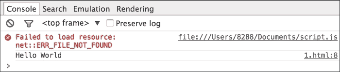
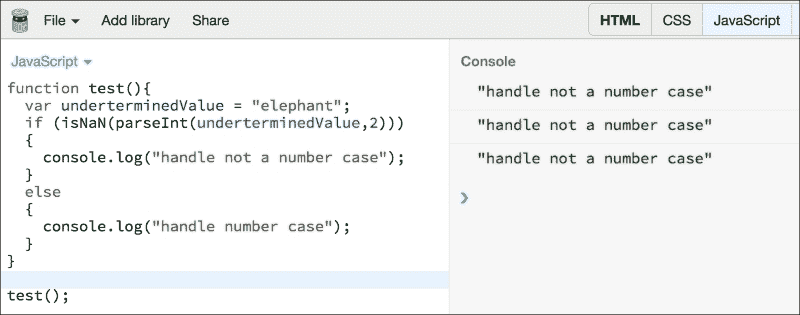
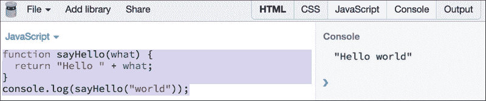

# 第一章：JavaScript 简介

编写文章的起初几句话总是困难的，尤其是在谈论像 JavaScript 这样的主题时。这种困难主要源于人们对这门语言已经有了太多的说法。自从 Netscape Navigator 的早期阶段以来，JavaScript 就一直是*网络的语言*——如果你愿意，可以说是互联网的通用语。JavaScript 从业余爱好者的工具迅速转变为鉴赏家的武器。

JavaScript 是网络和开源生态系统中最受欢迎的语言。[`githut.info/`](http://githut.info/) 图表记录了过去几年中 GitHub 上活跃仓库的数量以及该语言的整体受欢迎程度。JavaScript 的流行和重要性可以归因于它与浏览器的关联。Google 的 V8 和 Mozilla 的 SpiderMonkey 是分别驱动 Google Chrome 和 Mozilla Firefox 浏览器的极度优化的 JavaScript 引擎。

尽管网络浏览器是 JavaScript 最广泛使用的平台，但现代数据库如 MongoDB 和 CouchDB 使用 JavaScript 作为它们的脚本和查询语言。JavaScript 也在浏览器之外成为了重要的平台。例如，**Node.js** 和 **io.js** 项目提供了强大的平台，用于使用 JavaScript 开发可扩展的服务器环境。一些有趣的项目正在将语言能力推向极限，例如，**Emscripten** ([`kripken.github.io/emscripten-site/`](http://kripken.github.io/emscripten-site/)) 是一个基于**低级虚拟机** (**LLVM**) 的项目，它将 C 和 C++编译成高度优化的 JavaScript，格式为**asm.js**。这允许你在网上以接近本地速度运行 C 和 C++。

JavaScript 围绕坚实的基础构建，例如，函数、动态对象、松散类型、原型继承以及强大的对象字面量表示法。

虽然 JavaScript 建立在坚实的设计原则上，但不幸的是，这门语言不得不随着浏览器一起发展。网络浏览器以支持各种特性和标准的方式而闻名。JavaScript 试图适应浏览器的所有奇思妙想，结果做出了一些非常糟糕的设计决策。这些糟糕的部分（这个术语由 Douglas Crockford 闻名）使这门语言的优点对大多数人来说都显得黯淡。程序员编写了糟糕的代码，其他程序员试图调试这些糟糕代码时噩梦般地努力，这门语言最终获得了坏名声。不幸的是，JavaScript 是最被误解的编程语言之一([`javascript.crockford.com/javascript.html`](http://javascript.crockford.com/javascript.html))。

对 JavaScript 的另一种批评是，它让你在没有成为该语言专家的情况下完成事情。我见过程序员因为想快速完成事情而写出极其糟糕的 JavaScript 代码，而 JavaScript 正好允许他们这样做。我花了很多时间调试一个显然不是程序员的人写的非常糟糕的 JavaScript。然而，语言是一种工具，不能因为草率的编程而受到责备。像所有工艺一样，编程需要极大的奉献和纪律。

# 一段简短的历史

1993 年，**国家超级计算应用中心**（**NCSA**）的**Mosaic**浏览器是第一个流行的网页浏览器之一。一年后，网景通讯公司创建了专有的网页浏览器**Netscape Navigator**。几名原始 Mosaic 作者参与了 Navigator 的开发。

1995 年，网景通讯公司聘请了布兰登·艾奇，承诺让他实现**Scheme**（一种 Lisp 方言）在浏览器中。在这一切发生之前，网景与太阳微系统公司（现在称为甲骨文）联系，希望在导航者浏览器中包含 Java。

由于 Java 的流行和易编程，网景决定脚本语言的语法必须与 Java 相似。这排除了采用现有的如 Python、**工具命令语言**（**TCL**）或 Scheme 等语言。艾奇仅用 10 天就编写了最初的原型（[`www.computer.org/csdl/mags/co/2012/02/mco2012020007.pdf`](http://www.computer.org/csdl/mags/co/2012/02/mco2012020007.pdf)），1995 年 5 月。JavaScript 的第一个代号是**Mocha**，由马克·安德森提出。网景后来将其改为**LiveScript**，出于商标原因。1995 年 12 月初，太阳公司将 Java 商标授权给网景。该语言最终被更名为 JavaScript。

# 如何使用这本书

如果你希望快速完成事情，这本书不会对你有所帮助。这本书将专注于用 JavaScript 正确编码的方法。我们将花很多时间了解如何避免该语言的缺点，并在 JavaScript 中构建可靠且可读的代码。我们将避免该语言的草率特性，以确保你不会习惯它们——如果你已经学会了使用这些习惯来编程，这本书将试图让你改掉这个习惯。我们将重点关注正确的风格和工具，以使你的代码变得更好。

本书中的大多数概念都将是来自现实世界问题的例子和模式。我会坚持让你为每个片段编写代码，以确保你对概念的理解被编程到你的肌肉记忆中。相信我，没有比写大量代码更好的学习编程的方法了。

通常，你需要创建一个 HTML 页面来运行嵌入式 JavaScript 代码，如下所示：

```js
<!DOCTYPE html>
<html>
<head>
 <script type="text/javascript" src="img/script.js"></script>
 <script type="text/javascript">
 var x = "Hello World";
 console.log(x);
 </script>
</head>
<body>
</body>
</html>
```

这个示例代码展示了 JavaScript 嵌入 HTML 页面的两种方式。首先，`<head>`中的`<script>`标签导入了 JavaScript，而第二个`<script>`标签则用于嵌入内联 JavaScript。

### 提示

**下载示例代码**

你可以从[`www.packtpub.com`](http://www.packtpub.com)下载你购买的所有 Packt Publishing 书籍的示例代码文件。如果你在其他地方购买了此书，你可以访问[`www.packtpub.com/support`](http://www.packtpub.com/support)并注册，以便让文件直接通过电子邮件发送给你。

你可以将这个 HTML 页面保存到本地并在浏览器中打开。在 Firefox 中，你可以打开**开发者**控制台（Firefox 菜单 | **开发者** | **网络控制台**），你可以在**控制台**标签上看到**"Hello World"**文本。根据你的操作系统和浏览器版本，屏幕可能看起来会有所不同：


你可以使用 Chrome 的**开发者工具**运行并检查页面：



这里一个非常有趣的事情是，在控制台上显示了一个关于我们尝试使用以下代码行导入的缺失`.js`文件的错误：

```js
<script type="text/javascript" src="img/script.js"></script>
```

使用浏览器开发者控制台或像**Firebug**这样的扩展在调试代码错误条件时非常有用。我们将在后面的章节中详细讨论调试技术。

创建这样的 HTML 骨架对本书中的每一个练习来说可能会很繁琐。相反，我们想为 JavaScript 使用一个**读-评估-打印循环**（**REPL**）。与 Python 不同，JavaScript 没有内置的 REPL。我们可以使用 Node.js 作为 REPL。如果你已经在你的电脑上安装了 Node.js，你只需在命令行中输入`node`就可以开始与之实验。你会观察到 Node REPL 错误并不是非常优雅地显示。

让我们看看以下示例：

```js
EN-VedA:~$ node
>function greeter(){
  x="World"l
SyntaxError: Unexpected identifier
 at Object.exports.createScript (vm.js:44:10)
 at REPLServer.defaultEval (repl.js:117:23)
 at bound (domain.js:254:14)
 …

```

在出现此错误之后，你必须重新启动。尽管如此，它还是能让你更快地尝试小段代码。

我个人经常使用的一个工具是**JS Bin**([`jsbin.com/`](http://jsbin.com/)). JS Bin 为你提供了一套很好的工具来测试 JavaScript，比如语法高亮和运行时错误检测。以下是 JS Bin 的屏幕截图：



根据你的喜好，你可以选择一个让你更容易尝试代码示例的工具。无论你使用哪个工具，确保你在这本书中输出了每一个练习。

# Hello World

没有一种编程语言应该没有传统的 Hello World 程序就被发布——这本书为什么应该有任何不同？

请（不要复制和粘贴）在 JS Bin 中输入以下代码：

```js
function sayHello(what) {
  return "Hello " + what;
}
console.log(sayHello("world"));
```

你的屏幕应该看起来像以下样子：



## JavaScript 概览

简而言之，JavaScript 是一种基于原型的脚本语言，具有动态类型和一流的函数支持。JavaScript 大部分语法借鉴了 Java，但也受到了 Awk、Perl 和 Python 的影响。JavaScript 是大小写敏感的，且对空格不敏感。

### 注释

JavaScript 允许单行或多行注释。其语法与 C 或 Java 类似：

```js
// a one line comment

/* this is a longer, 
   multi-line comment
 */

/* You can't /* nest comments */ SyntaxError */
```

### 变量

变量是值的符号名称。变量的名称，或标识符，必须遵循某些规则。

JavaScript 变量名必须以字母、下划线 (_) 或美元符号 ($) 开头；后续字符还可以是数字 (0-9)。由于 JavaScript 是大小写敏感的，所以字母包括 *A* 至 *Z* （大写）和 *a* 至 *z* （小写）的字符。

你可以在变量名中使用 ISO 8859-1 或 Unicode 字母。

在 JavaScript 中，新变量应该使用 **var** 关键字定义。如果你声明了一个变量但没有给它赋值，那么它默认的类型是未定义。一个糟糕的事情是，如果你不使用 var 关键字声明变量，它们会变成隐式的全局变量。让我重申一下，隐式的全局变量是一件糟糕的事情——我们将在书中讨论变量作用域和闭包时详细讨论这个问题，但重要的是要记住，除非你知道你在做什么，否则你应该总是用 var 关键字声明变量：

```js
var a;      //declares a variable but its undefined
var b = 0;
console.log(b);    //0
console.log(a);    //undefined
console.log(a+b);  //NaN
```

NaN 值是一个特殊值，用来表示实体*不是数字*。

### 常量

你可以使用 **const** 关键字创建一个只读的命名常量。常量名必须以字母、下划线或美元符号开头，并可以包含字母、数字或下划线字符：

```js
const area_code = '515';
```

常量不能通过赋值改变其值，也不能重新声明，并且必须初始化为一个值。

JavaScript 支持标准类型变体：

+   数字

+   字符串

+   布尔值

+   符号（ECMAScript 6 新增）

+   对象：

    +   函数

    +   数组

    +   日期

    +   正则表达式

+   空值

+   未定义

### 数字

**Number** 类型可以表示 32 位整数和 64 位浮点值。例如，以下代码行声明了一个变量来保存整数值，该值由字面量 555 定义：

```js
var aNumber = 555;
```

要定义一个浮点值，你需要包含一个小数点和一个小数点后的一位数字：

```js
var aFloat = 555.0;
```

本质上，在 JavaScript 中并没有所谓的整数。JavaScript 使用 64 位浮点表示，这与 Java 的 double 相同。

因此，你会看到如下内容：

```js
EN-VedA:~$ node
> 0.1+0.2
0.30000000000000004
> (0.1+0.2)===0.3
false

```

我建议你阅读 Stack Overflow 上的详尽回答([`stackoverflow.com/questions/588004/is-floating-point-math-broken`](http://stackoverflow.com/questions/588004/is-floating-point-math-broken))和([`floating-point-gui.de/`](http://floating-point-gui.de/))，它解释了为什么会这样。然而，重要的是要理解浮点数运算应该小心处理。在大多数情况下，你可能不需要依赖小数的极端精确度，但如果需要，你可以尝试使用诸如**big.js**([`github.com/MikeMcl/big.js`](https://github.com/MikeMcl/big.js))之类的库来解决这个问题。

如果你打算编写极其精确的财务系统，你应该将$值表示为分，以避免舍入错误。我曾经参与过的其中一个系统过去将**增值税**（**VAT**）金额四舍五入到两位小数。每天有成千上万的订单，这个每订单的舍入金额变成了一个巨大的会计难题。我们需要彻底重构整个 Java Web 服务堆栈和 JavaScript 前端。

还有一些特殊值也被定义为 Number 类型的部分。前两个是`Number.MAX_VALUE`和`Number.MIN_VALUE`，它们定义了 Number 值集的外部界限。所有 ECMAScript 数字必须在这两个值之间，没有例外。然而，一个计算可能会产生不在这两个值之间的数字。当计算结果大于`Number.MAX_VALUE`时，它被赋予`Number.POSITIVE_INFINITY`的值，意味着它不再有数值。同样，计算结果小于`Number.MIN_VALUE`时，被赋予`Number.NEGATIVE_INFINITY`的值，也没有数值。如果计算返回一个无限值，则结果不能用于任何进一步的计算。你可以使用`isInfinite()`方法来验证计算结果是否为无限值。

JavaScript 的另一个特性是一个特殊的值，称为 NaN（*Not a Number*的缩写）。通常，这发生在从其他类型（字符串、布尔值等）转换失败时。观察 NaN 的以下特性：

```js
EN-VedA:~ $ node
> isNaN(NaN);
true
> NaN==NaN;
false
> isNaN("elephant");
true
> NaN+5;
NaN

```

第二行很奇怪——NaN 不等于 NaN。如果 NaN 是任何数学运算的一部分，结果也变成 NaN。一般来说，避免在任何表达式中使用 NaN。对于任何高级数学运算，你可以使用`Math`全局对象及其方法：

```js
> Math.E
2.718281828459045
> Math.SQRT2
1.4142135623730951
> Math.abs(-900)
900
> Math.pow(2,3)
8

```

你可以使用`parseInt()`和`parseFloat()`方法将字符串表达式转换为整数或浮点数：

```js
> parseInt("230",10);
230
> parseInt("010",10);
10
> parseInt("010",8); //octal base
8
> parseInt("010",2); //binary
2
> + "4"
4

```

使用`parseInt()`时，你应该提供一个明确的基数，以防止在旧浏览器上出现糟糕的惊喜。最后一个技巧就是使用`+`号自动将`"42"`字符串转换为数字`42`。谨慎地处理`parseInt()`的结果与`isNaN()`。让我们看看以下示例：

```js
var underterminedValue = "elephant";
if (isNaN(parseInt(underterminedValue,2))) 
{
   console.log("handle not a number case");
}
else
{
   console.log("handle number case");
}
```

在这个例子中，你无法确定`underterminedValue`变量如果从外部接口设置值可能持有的类型。如果`isNaN()`没有处理，`parseInt()`将引发异常，程序可能会崩溃。

### 字符串

在 JavaScript 中，字符串是 Unicode 字符的序列（每个字符占用 16 位）。字符串中的每个字符可以通过它的索引来访问。第一个字符的索引是零。字符串被`"`或`'`括起来——两者都是表示字符串的有效方式。让我们看以下：

```js
> console.log("Hippopotamus chewing gum");
Hippopotamus chewing gum
> console.log('Single quoted hippopotamus');
Single quoted hippopotamus
> console.log("Broken \n lines");
Broken
 lines
```

最后一行展示了当你用反斜杠`\`转义某些字符字面量时，它们可以作为特殊字符使用。以下是这样一些特殊字符的列表：

+   `\n`: 换行

+   `\t`: 制表符

+   `\b`: 退格

+   `\r`: 回车

+   `\\`: 反斜杠

+   `\'`: 单引号

+   `\"`: 双引号

你可以在 JavaScript 字符串中获得对特殊字符和 Unicode 字面量的默认支持：

```js
> '\xA9'
'©'
> '\u00A9'
'©'

```

关于 JavaScript 字符串、数字和布尔值的一个重要事情是，它们实际上有包装对象围绕它们的原始等价物。以下示例展示了包装对象的使用：

```js
var s = new String("dummy"); //Creates a String object
console.log(s); //"dummy"
console.log(typeof s); //"object"
var nonObject = "1" + "2"; //Create a String primitive 
console.log(typeof nonObject); //"string"
var objString = new String("1" + "2"); //Creates a String object
console.log(typeof objString); //"object"
//Helper functions
console.log("Hello".length); //5
console.log("Hello".charAt(0)); //"H"
console.log("Hello".charAt(1)); //"e"
console.log("Hello".indexOf("e")); //1
console.log("Hello".lastIndexOf("l")); //3
console.log("Hello".startsWith("H")); //true
console.log("Hello".endsWith("o")); //true
console.log("Hello".includes("X")); //false
var splitStringByWords = "Hello World".split(" ");
console.log(splitStringByWords); //["Hello", "World"]
var splitStringByChars = "Hello World".split("");
console.log(splitStringByChars); //["H", "e", "l", "l", "o", " ", "W", "o", "r", "l", "d"]
console.log("lowercasestring".toUpperCase()); //"LOWERCASESTRING"
console.log("UPPPERCASESTRING".toLowerCase()); //"upppercasestring"
console.log("There are no spaces in the end     ".trim()); //"There are no spaces in the end"
```

JavaScript 也支持多行字符串。用`` ` ``（重音符号—[`en.wikipedia.org/wiki/Grave_accent`](https://en.wikipedia.org/wiki/Grave_accent)）括起来的字符串被认为是多行。让我们看以下示例：

```js
> console.log(`string text on first line
string text on second line `);
"string text on first line
string text on second line "

```

这种字符串也被称为模板字符串，可以用于字符串插值。JavaScript 允许使用这种语法进行 Python 式的字符串插值。

通常，你会做类似以下的事情：

```js
var a=1, b=2;
console.log("Sum of values is :" + (a+b) + " and multiplication is :" + (a*b));

```

然而，在字符串插值中，事情变得更加清晰：

```js
console.log(`Sum of values is :${a+b} and multiplication is : ${a*b}`);

```

### 未定义值

JavaScript 用两个特殊值来表示没有意义值——null，当非值是故意的，和 undefined，当值还没有分配给变量。让我们看以下示例：

```js
> var xl;
> console.log(typeof xl);
undefined
> console.log(null==undefined);
true

```

### 布尔值

JavaScript 布尔原语由`true`和`false`关键字表示。以下规则决定什么变成假，什么变成真：

+   假，0，空字符串（""），NaN，null，和未定义被表示为假

+   其他一切都是真

JavaScript 布尔值之所以棘手，主要是因为创建它们的方式行为差异很大。

在 JavaScript 中有两种创建布尔值的方法：

+   你可以通过将一个真或假的字面量赋给一个变量来创建原始的布尔值。考虑以下示例：

    ```js
    var pBooleanTrue = true;
    var pBooleanFalse = false;

    ```

+   使用`Boolean()`函数；这是一个普通函数，返回一个原始的布尔值：

    ```js
    var fBooleanTrue = Boolean(true);
    var fBooleanFalse = Boolean(false);

    ```

这两种方法都返回预期的*真值*或*假值*。然而，如果你使用`new`操作符创建一个布尔对象，事情可能会出得很糟糕。

本质上，当你使用`new`操作符和`Boolean(value)`构造函数时，你不会得到一个原始的`true`或`false`，你得到的是一个对象——不幸的是，JavaScript 认为一个对象是*真值*：

```js
var oBooleanTrue = new Boolean(true);
var oBooleanFalse = new Boolean(false);
console.log(oBooleanTrue); //true
console.log(typeof oBooleanTrue); //object
if(oBooleanFalse){
 console.log("I am seriously truthy, don't believe me");
}
>"I am seriously truthy, don't believe me"

if(oBooleanTrue){
 console.log("I am also truthy, see ?");
}
>"I am also truthy, see ?"

//Use valueOf() to extract real value within the Boolean object
if(oBooleanFalse.valueOf()){
 console.log("With valueOf, I am false"); 
}else{
 console.log("Without valueOf, I am still truthy");
}
>"Without valueOf, I am still truthy"

```

因此，明智的做法是始终避免使用 Boolean 构造函数来创建一个新的 Boolean 对象。这违反了布尔逻辑的基本合同，你应该远离这种难以调试的错误代码。

### instanceof 操作符

使用引用类型存储值的一个问题一直是使用**typeof**操作符，它无论引用的是什么类型的对象，都会返回`object`。为了解决这个问题，你可以使用**instanceof**操作符。让我们看一些例子：

```js
var aStringObject = new String("string");
console.log(typeof aStringObject);        //"object"
console.log(aStringObject instanceof String);    //true
var aString = "This is a string";
console.log(aString instanceof String);     //false

```

第三行返回`false`。当我们讨论原型链时，我们将讨论为什么会这样。

### Date 对象

JavaScript 没有日期数据类型。相反，你可以使用**Date**对象及其方法来处理应用程序中的日期和时间。Date 对象相当全面，包含了许多处理大多数与日期和时间相关用例的方法。

JavaScript 将日期处理方式与 Java 相似。JavaScript 将日期存储为自 1970 年 1 月 1 日 00:00:00 以来的毫秒数。

你可以使用以下声明创建一个 Date 对象：

```js
var dataObject = new Date([parameters]);
```

Date 对象构造函数的参数可以是以下形式：

+   不带参数创建今天的日期和时间。例如，`var today = new Date();`。

+   一个表示日期为`Month day, year hours:minutes:seconds`的字符串。例如，`var twoThousandFifteen = new Date("December 31, 2015 23:59:59");`。如果你省略小时、分钟或秒，值将被设置为`0`。

+   一组表示年份、月份和日期的整数值。例如，`var christmas = new Date(2015, 11, 25);`。

+   一组表示年份、月份、日、时、分和秒的整数值。例如，`var christmas = new Date(2015, 11, 25, 21, 00, 0);`。

以下是一些关于如何在 JavaScript 中创建和操作日期的示例：

```js
var today = new Date();
console.log(today.getDate()); //27
console.log(today.getMonth()); //4
console.log(today.getFullYear()); //2015
console.log(today.getHours()); //23
console.log(today.getMinutes()); //13
console.log(today.getSeconds()); //10
//number of milliseconds since January 1, 1970, 00:00:00 UTC
console.log(today.getTime()); //1432748611392
console.log(today.getTimezoneOffset()); //-330 Minutes

//Calculating elapsed time
var start = Date.now();
// loop for a long time
for (var i=0;i<100000;i++);
var end = Date.now();
var elapsed = end - start; // elapsed time in milliseconds
console.log(elapsed); //71
```

对于任何需要对日期和时间对象进行细粒度控制的严肃应用程序，我们推荐使用诸如**Moment.js**([`github.com/moment/moment`](https://github.com/moment/moment)), **Timezone.js**([`github.com/mde/timezone-js`](https://github.com/mde/timezone-js)), 或**date.js**([`github.com/MatthewMueller/date`](https://github.com/MatthewMueller/date)))这样的库。这些库为你简化了很多重复任务，帮助你专注于其他更重要的事情。

### +操作符

当**+**操作符作为一元操作符使用时，对一个数字没有任何影响。然而，当应用于字符串时，+操作符将其转换为数字，如下所示：

```js
var a=25;
a=+a;            //No impact on a's value  
console.log(a);  //25

var b="70";
console.log(typeof b); //string
b=+b;           //converts string to number
console.log(b); //70
console.log(typeof b); //number
```

程序员经常使用+操作符快速将字符串的数值表示转换为数字。然而，如果字符串字面量不能转换为数字，你会得到稍微不可预测的结果，如下所示：

```js
var c="foo";
c=+c;            //Converts foo to number
console.log(c);  //NaN
console.log(typeof c);  //number

var zero="";
zero=+zero; //empty strings are converted to 0
console.log(zero);
console.log(typeof zero);
```

我们将在文本后面讨论+操作符对其他几种数据类型的影响。

### ++和--操作符

++运算符是将值增加 1 的简写，--运算符是将值减少 1 的简写。Java 和 C 有等效的运算符，大多数人熟悉它们。这个怎么样？

```js
var a= 1;
var b= a++;
console.log(a); //2
console.log(b); //1
```

呃，这里发生了什么？`b`变量不应该有值`2`吗？++和--运算符是可以作为前缀或后缀使用的单目运算符。它们的使用顺序很重要。当++用作前缀形式如`++a`时，它在值从表达式返回之前增加值，而不是像`a++`那样在值返回之后增加。让我们看看以下代码：

```js
var a= 1;
var b= ++a;
console.log(a);  //2
console.log(b);  //2
```

许多程序员使用链式赋值来为多个变量分配单个值，如下所示：

```js
var a, b, c;
a = b = c = 0;
```

这是可以的，因为赋值运算符(=)导致值被赋值。在这个例子中，`c=0`被评估为`0`；这将导致`b=0`也被评估为`0`，因此，`a=0`也被评估。

然而，对前面例子的微小修改将产生非凡的结果。考虑这个：

```js
var a = b = 0;
```

在这个例子中，只有变量`a`是用`var`声明的，而变量`b`被创建成了一个意外的全局变量。（如果你处于严格模式，这将产生一个错误。）在 JavaScript 中，小心你所希望的，你可能会得到它。

### 布尔运算符

JavaScript 中有三个布尔运算符——与(&), 或(|), 非(!)。

在讨论逻辑与和或运算符之前，我们需要了解它们是如何产生布尔结果的。逻辑运算符从左到右求值，并且它们是按照以下短路规则进行测试的：

+   **逻辑与**：如果第一个操作数确定了结果，第二个操作数就不会被评估。

    在下面的示例中，我突出了如果它作为短路评估规则的一部分被执行时的右表达式：

    ```js
    console.log(true  && true); // true AND true returns true
    console.log(true  && false);// true AND false returns false
    console.log(false && true);// false AND true returns false
    console.log("Foo" && "Bar");// Foo(true) AND Bar(true) returns Bar
    console.log(false && "Foo");// false && Foo(true) returns false
    console.log("Foo" && false);// Foo(true) && false returns false
    console.log(false && (1 == 2));// false && false(1==2) returns false
    ```

+   **逻辑或**：如果第一个操作数是真，第二个操作数就不会被评估：

    ```js
    console.log(true  || true); // true AND true returns true
    console.log(true  || false);// true AND false returns true
    console.log(false || true);// false AND true returns true
    console.log("Foo" || "Bar");// Foo(true) AND Bar(true) returns Foo
    console.log(false || "Foo");// false && Foo(true) returns Foo
    console.log("Foo" || false);// Foo(true) && false returns Foo
    console.log(false || (1 == 2));// false && false(1==2) returns false
    ```

    然而，逻辑与和逻辑或也可以用于非布尔操作数。当左操作数或右操作数不是原始布尔值时，与和或运算符不返回布尔值。

现在我们将解释三个逻辑布尔运算符：

+   逻辑与(&&)：如果第一个操作数对象是*假值*，它返回那个对象。如果它是*真值*，第二个操作数对象将被返回：

    ```js
    console.log (0 && "Foo");  //First operand is falsy - return it
    console.log ("Foo" && "Bar"); //First operand is truthy, return the second operand
    ```

+   逻辑或(||)：如果第一个操作数是*真值*，它将被返回。否则，第二个操作数将被返回：

    ```js
    console.log (0 || "Foo");  //First operand is falsy - return second operand
    console.log ("Foo" || "Bar"); //First operand is truthy, return it
    console.log (0 || false); //First operand is falsy, return second operand
    ```

    逻辑或的典型用途是为变量分配默认值：

    ```js
    function greeting(name){
        name = name || "John";
        console.log("Hello " + name);
    }

    greeting("Johnson"); // alerts "Hi Johnson";
    greeting(); //alerts "Hello John"
    ```

    你将在大多数专业的 JavaScript 库中频繁看到这个模式。你应该理解如何使用逻辑或运算符来实现默认值。

+   **逻辑非**：这总是返回一个布尔值。返回的值取决于以下情况：

    ```js
    //If the operand is an object, false is returned.
    var s = new String("string");
    console.log(!s);              //false

    //If the operand is the number 0, true is returned.
    var t = 0;
    console.log(!t);              //true

    //If the operand is any number other than 0, false is returned.
    var x = 11;
    console.log(!x);              //false

    //If operand is null or NaN, true is returned
    var y =null;
    var z = NaN;
    console.log(!y);              //true
    console.log(!z);              //true
    //If operand is undefined, you get true
    var foo;
    console.log(!foo);            //true
    ```

此外，JavaScript 支持类似于 C 的三元运算符，如下所示：

```js
var allowedToDrive = (age > 21) ? "yes" : "no";
```

如果`(age>21)`，`?`后面的表达式将被赋值给`allowedToDrive`变量，否则`:`后面的表达式将被赋值。这相当于一个 if-else 条件语句。让我们看另一个例子：

```js
function isAllowedToDrive(age){
  if(age>21){
    return true;
  }else{
    return false;
  }
}
console.log(isAllowedToDrive(22));
```

在这个例子中，`isAllowedToDrive()`函数接受一个整数参数`age`。根据这个变量的值，我们返回真或假给调用函数。这是一个众所周知且最熟悉的 if-else 条件逻辑。大多数时候，if-else 使代码更容易阅读。对于单一条件的简单情况，使用三元运算符也可以，但如果你看到你正在为更复杂的表达式使用三元运算符，尝试坚持使用 if-else，因为解析 if-else 条件比解析一个非常复杂的三元表达式要容易。

条件语句可以如下嵌套：

```js
if (condition1) {
  statement1
} else if (condition2) {
  statement2
} else if (condition3) {
  statement3
}
..
} else {
  statementN
}
```

纯粹出于审美原因，你可以像下面这样缩进嵌套的`else if`：

```js
if (condition1) {
  statement1
} else
    if (condition2) {
```

不要在条件语句的地方使用赋值语句。大多数时候，它们被使用是因为下面的错误：

```js
if(a=b) {
  //do something
}
```

大多数时候，这是由于错误造成的；意图中的代码是`if(a==b)`，或者更好，`if(a===b)`。当你犯这个错误，并用赋值语句替换条件语句时，你最终会犯一个非常难以发现的错误。然而，如果你真的想在一个 if 语句中使用赋值语句，请确保你的意图非常明确。

一种方法是在你的赋值语句周围加上额外的括号：

```js
if((a=b)){
  //this is really something you want to do
}
```

处理条件执行的另一种方法是使用 switch-case 语句。JavaScript 中的 switch-case 结构与 C 或 Java 中的类似。让我们看以下例子：

```js
function sayDay(day){
  switch(day){
    case 1: console.log("Sunday");
      break;
    case 2: console.log("Monday");
      break;
    default:
      console.log("We live in a binary world. Go to Pluto");
  }
}

sayDay(1); //Sunday
sayDay(3); //We live in a binary world. Go to Pluto
```

这种结构的一个问题是，你有`break`语句在每一个`case`后面；否则，执行将会递归到下一级。如果我们从第一个`case`语句中移除`break`语句，输出将会如下：

```js
>sayDay(1);
Sunday
Monday
```

正如您所看到的，如果我们省略`break`语句，在条件满足后立即中断执行，执行顺序会继续递归到下一级。这可能会导致代码中难以检测到的问题。然而，如果你打算一直递归到下一级，这种写条件逻辑的方式也很流行：

```js
function debug(level,msg){
  switch(level){
    case "INFO": //intentional fall-through
    case "WARN" :  
    case "DEBUG": console.log(level+ ": " + msg);  
      break;
    case "ERROR": console.error(msg);  
  }
}

debug("INFO","Info Message");
debug("DEBUG","Debug Message");
debug("ERROR","Fatal Exception");
```

在这个例子中，我们故意让执行递归，以编写简洁的 switch-case。如果级别是 INFO、WARN 或 DEBUG，我们使用 switch-case 递归到单一点执行。我们省略这个`break`语句。如果你想遵循这种写 switch 语句的模式，请确保你记录你的使用方式，以提高可读性。

switch 语句可以有一个`default`案例，用来处理任何不能被其他案例评估的值。

JavaScript 有一个 while 和 do-while 循环。while 循环让你迭代一系列表达式，直到满足某个条件。以下第一个例子迭代了`{}`内的语句，直到`i<10`表达式为真。记住，如果`i`计数器的值已经大于`10`，循环根本不会执行：

```js
var i=0;
while(i<10){
  i=i+1;
  console.log(i);
}
```

下面的循环会一直执行到无穷大，因为条件总是为真——这可能导致灾难性的后果。你的程序可能会耗尽你所有的内存，或者更糟糕的事情：

```js
//infinite loop
while(true){
  //keep doing this
}
```

如果你想要确保至少执行一次循环，你可以使用 do-while 循环（有时被称为后置条件循环）：

```js
var choice;
do {
  choice=getChoiceFromUserInput();
} while(!isInputValid(input));
```

在这个例子中，我们要求用户输入，直到我们找到有效的用户输入。当用户输入无效时，我们继续要求用户输入。人们总是认为，从逻辑上讲，每个 do-while 循环都可以转换为 while 循环。然而，do-while 循环有一个非常有效的用例，就像我们刚才看到的那样，你希望在循环块执行一次之后才检查条件。

JavaScript 有一个非常强大的循环，类似于 C 或 Java——for 循环。for 循环之所以流行，是因为它允许你在一句话中定义循环的控制条件。

下面的例子会打印五次`Hello`：

```js
for (var i=0;i<5;i++){
  console.log("Hello");
}
```

在循环的定义中，你定义了循环计数器`i`的初始值为`0`，定义了`i<5`的退出条件，最后定义了增量因子。

前面例子中的所有三个表达式都是可选的。如果需要，你可以省略它们。例如，下面的变体都将产生与之前循环相同的结果：

```js
var x=0;
//Omit initialitzation
for (;x<5;x++){
  console.log("Hello");
}

//Omit exit condition
for (var j=0;;j++){
  //exit condition
  if(j>=5){
    break;  
  }else{
    console.log("Hello");
  }
}
//Omit increment
for (var k=0; k<5;){
  console.log("Hello");
  k++;
}
```

你也可以省略这三个表达式，写 for 循环。一个经常使用的有趣习惯是用 for 循环与空语句。下面的循环用于将数组的所有元素设置为`100`。注意循环体内没有主体：

```js
var arr = [10, 20, 30];
// Assign all array values to 100
for (i = 0; i < arr.length; arr[i++] = 100);
console.log(arr);
```

这里的空语句只是我们在 for 循环语句之后看到的那个单一的语句。增量因子也修改了数组内容。我们将在书的后面讨论数组，但在这里，只要看到循环定义本身将数组元素设置为`100`值就足够了。

### 等价

JavaScript 提供了两种等价模式——严格和宽松。本质上，宽松等价在比较两个值时会执行类型转换，而严格等价则不进行任何类型转换的检查。严格等价检查由===完成，而宽松等价检查由==完成。

ECMAScript 6 还提供了`Object.is`方法来进行与===相同的严格等价检查。然而，`Object.is`对 NaN 有特殊的处理：-0 和+0。当*NaN===NaN*和*NaN==NaN*评估为假时，`Object.is(NaN,NaN)`将返回真。

#### 严格等价使用===

严格等价比较两个值而不进行任何隐式的类型转换。以下规则适用：

+   如果值属于不同的类型，它们是不相等的。

+   对于相同类型的非数字值，如果它们的值相同，它们是相等的。

+   对于原始数字，严格等价对于值来说是有效的。如果值相同，===结果为`true`。然而，NaN 不等于任何数字，所以`NaN===<一个数字>`将会是`false`。

严格等价始终是正确的等价检查。始终使用===而不是==作为等价检查的规则：

| 条件 | 输出 |
| --- | --- |
| `"" === "0";` | 错误 |
| `0 === "";` | 错误 |
| `0 === "0";` | 错误 |
| `false === "false";` | 错误 |
| `false === "0";` | 错误 |
| `false === undefined;` | 错误 |
| `false === null;` | 错误 |
| `null === undefined;` | 错误 |

在比较对象时，结果如下：

| 条件 | 输出 |
| --- | --- |
| `{} === {};` | 错误 |
| `new String('bah') === 'bah';` | 错误 |
| `new Number(1) === 1;` | 错误 |
| `var bar = {};``bar === bar;` | 正确 |

以下是在 JS Bin 或 Node REPL 上尝试的进一步示例：

```js
var n = 0;
var o = new String("0");
var s = "0";
var b = false;

console.log(n === n); // true - same values for numbers
console.log(o === o); // true - non numbers are compared for their values
console.log(s === s); // true - ditto

console.log(n === o); // false - no implicit type conversion, types are different
console.log(n === s); // false - types are different
console.log(o === s); // false - types are different
console.log(null === undefined); // false
console.log(o === null); // false
console.log(o === undefined); // false
```

当进行严格等价检查时，你可以使用`!==`来处理**不等于**的情况。

#### 使用==的弱等价

绝对不要诱惑你使用这种等价形式。严肃地说，离这种形式远一点。这种等价形式主要是由于 JavaScript 的弱类型而有很多问题。等价操作符==，首先尝试强制类型然后再进行比较。以下示例展示了它是如何工作的：

| 条件 | 输出 |
| --- | --- |
| `"" == "0";` | 错误 |
| `0 == "";` | 正确 |
| `0 == "0";` | 正确 |
| `false == "false";` | 错误 |
| `false == "0";` | 正确 |
| `false == undefined;` | 错误 |
| `false == null;` | 错误 |
| `null == undefined;` | 正确 |

从这些示例中，可以看出弱等价可能会导致意外的结果。此外，隐式强制类型转换在性能上是有代价的。所以，一般来说，在 JavaScript 中应避免使用弱等价。

## javascript 类型

我们简要讨论了 JavaScript 是一种动态语言。如果你有使用强类型语言如 Java 的先前经验，你可能会对完全缺乏你所熟悉的类型检查感到有些不舒服。纯粹主义者认为 JavaScript 应该声称有**标签**或者也许是**子类型**，但不是类型。尽管 JavaScript 没有传统意义上的**类型**定义，但深入理解 JavaScript 如何处理数据类型和强制类型转换内部是绝对必要的。每个非平凡的 JavaScript 程序都需要以某种形式处理值强制类型转换，所以理解这个概念很重要。

显式强制类型转换发生在当你自己修改类型时。在以下示例中，你将使用`toString()`方法将一个数字转换为字符串并从中提取第二个字符：

```js
var fortyTwo = 42;
console.log(fortyTwo.toString()[1]); //prints "2"
```

这是一个显式类型转换的例子。再次强调，我们在这里使用“类型”这个词是比较宽泛的，因为在声明`fortyTwo`变量时，并没有任何地方强制类型。

然而，强制转换发生的许多不同方式。显式强制转换可能容易理解且 mostly 可靠；但如果你不小心，强制转换可能会以非常奇怪和惊讶的方式发生。

围绕强制转换的混淆可能是 JavaScript 开发者谈论最多的挫折之一。为了确保你心中永远不会有这种混淆，让我们重新回顾一下 JavaScript 中的类型。我们之前谈过一些概念：

```js
typeof 1             === "number";    // true
typeof "1"           === "string";    // true
typeof { age: 39 }   === "object";    // true
typeof Symbol()      === "symbol";    // true
typeof undefined     === "undefined"; // true
typeof true          === "boolean";   // true
```

到目前为止，还不错。我们已经知道了这些，我们刚才看到的一些例子加强了我们对于类型的想法。

从一个类型转换到另一个类型的值的转换称为**类型转换**或显式强制转换。JavaScript 也通过根据某些猜测改变值的类型来进行隐式强制转换。这些猜测使 JavaScript 在几种情况下发挥作用，不幸的是，它默默地、意外地失败了。以下代码段显示了显式和隐式强制转换的情况：

```js
var t=1;
var u=""+t; //implicit coercion
console.log(typeof t);  //"number"
console.log(typeof u);  //"string"
var v=String(t);  //Explicit coercion
console.log(typeof v);  //"string"
var x=null
console.log(""+x); //"null"
```

很容易看出这里发生了什么。当你用`""+t`对数字值`t`（在这个例子中是`1`）进行操作时，JavaScript 意识到你试图将*某种东西*与一个`""`字符串连接起来。因为只有字符串才能与其他字符串连接，所以 JavaScript 前进并把一个数字`1`转换为一个`"1"`字符串，然后将两者连接成一个字符串值。这就是当 JavaScript 被要求隐式转换值时会发生的事情。然而，`String(t)`是一个明确调用数字转换为字符串的。这是一个类型的显式转换。最后的部分令人惊讶。我们正在将`null`与`""`连接——这不应该失败吗？

那么 JavaScript 是如何进行类型转换的呢？一个抽象值如何变成字符串或数字或布尔值？JavaScript 依赖于`toString()`、`toNumber()`和`toBoolean()`方法来进行这些内部转换。

当一个非字符串值被强制转换为字符串时，JavaScript 内部使用`toString()`方法来完成这个转换。所有原始值都有自然的字符串形式——`null`的自然字符串形式是`"null"`，`undefined`的自然字符串形式是`"undefined"`，依此类推。对于 Java 开发者来说，这类似于一个类有一个`toString()`方法，返回该类的字符串表示。我们将看到对象的情况是如何工作的。

所以本质上，你可以做类似以下的事情：

```js
var a="abc";
console.log(a.length);
console.log(a.toUpperCase());
```

```js
As we discussed earlier, JavaScript kindly wraps these primitives in their wrappers by default thus making it possible for us to directly access the wrapper's methods and properties as if they were of the primitives themselves.
```

当任何非数字值需要被转换为数字时，JavaScript 内部使用`toNumber()`方法：`true`变成`1`，`undefined`变成`NaN`，`false`变成`0`，`null`变成`0`。字符串上的`toNumber()`方法与字面转换一起工作，如果这个失败了，方法返回`NaN`。

其他一些情况呢？

```js
typeof null ==="object" //true
```

好吧，`null`是一个对象？是的，一个特别持久的错误使得这成为可能。由于这个错误，你在测试一个值是否为`null`时需要小心：

```js
var x = null;
if (!x && typeof x === "object"){
  console.log("100% null");
}
```

那么可能还有其他具有类型的东西，比如函数呢？

```js
f = function test() {
  return 12;
}
console.log(typeof f === "function");  //prints "true"
```

那么数组呢？

```js
console.log (typeof [1,2,3,4]); //"object"
```

确实如此，它们也是对象。我们将在书的后面详细介绍函数和数组。

在 JavaScript 中，值有类型，变量没有。由于语言的动态特性，变量可以随时持有任何值。

JavaScript 不强制类型，这意味着该语言不坚持变量始终持有与初始类型相同的值。变量可以持有字符串，然后在下一个赋值中持有数字，依此类推：

```js
var a = 1; 
typeof a; // "number"  
a = false; 
typeof a; // "boolean"
```

typeof 操作符总是返回一个字符串：

```js
typeof typeof 1; // "string"
```

## 自动分号插入

尽管 JavaScript 基于 C 风格语法，但它不强制在源代码中使用分号。

然而，JavaScript 并不是一个无分号的语言。JavaScript 语言解析器需要分号来理解源代码。因此，当解析器遇到由于缺少分号而导致的解析错误时，它会自动插入分号。需要注意的是，**自动分号插入**（**ASI**）只有在存在换行符（也称为行 break）时才会生效。分号不会在一行中间插入。

基本上，如果 JavaScript 解析器解析一行，在该行中会发生解析错误（缺少预期的分号）并且它可以插入一个，它会这样做。插入分号的条件是什么？只有当某些语句的末尾和该行的换行符/行 break 之间只有空白字符和/或注释时。

关于 ASI 一直有激烈的争论——一个合理地被认为是设计选择非常糟糕的功能。网络上进行了史诗般的讨论，例如[`github.com/twbs/bootstrap/issues/3057`](https://github.com/twbs/bootstrap/issues/3057)和[`brendaneich.com/2012/04/the-infernal-semicolon/`](https://brendaneich.com/2012/04/the-infernal-semicolon/)。

在判断这些论点的有效性之前，你需要了解 ASI 影响了什么。以下受 ASI 影响的声明：

+   一个空声明

+   一个 var 声明

+   一个表达式声明

+   一个 do-while 声明

+   一个 continue 声明

+   一个 break 声明

+   一个 return 声明

+   一个 throw 声明

ASI 背后的想法是使分号在行的末尾成为可选。这样，ASI 帮助解析器确定语句何时结束。通常，它在分号处结束。ASI 规定，在以下情况下语句也以如下情况结束：

+   换行符（例如，换行符）后面跟着一个非法令牌

+   遇到一个闭合括号

+   文件已达到末尾

让我们看看以下示例：

```js
if (a < 1) a = 1 console.log(a)
```

在 1 之后 console 令牌是非法的，并按照以下方式触发 ASI：

```js
if (a < 1) a = 1; console.log(a);
```

在下面的代码中，大括号内的语句没有用分号终止：

```js
function add(a,b) { return a+b }
```

ASI 为前面的代码创建了一个语法上正确的版本：

```js
function add(a,b) { return a+b; }
```

## JavaScript 风格指南

每种编程语言都会发展出自己的风格和结构。不幸的是，新开发者并没有付出太多努力去学习一门语言的风格细微差别。一旦养成了坏习惯，后来要发展这项技能就非常困难了。为了生成美观、可读且易于维护的代码，学习正确的风格是非常重要的。有很多样式建议。我们将选择最实用的那些。在适用的情况下，我们将讨论合适的样式。让我们设定一些风格基础规则。

### 空白符

虽然空白符在 JavaScript 中并不重要，但正确使用空白符可以使代码更易读。以下指南将帮助你在代码中管理空白符：

+   不要混合空格和制表符。

+   在你编写任何代码之前，选择使用软缩进（空格）或真正的制表符。为了提高可读性，我总是建议你将编辑器的缩进大小设置为两个字符——这意味着两个空格或两个空格表示一个真正的制表符。

+   始终开启*显示不可见字符*设置。这种做法的好处如下：

    +   强制一致性。

    +   消除行尾的空白符。

    +   消除行尾的空白符。

    +   提交和差异更容易阅读。

    +   在可能的情况下使用**EditorConfig** ([`editorconfig.org/`](http://editorconfig.org/))。

### 括号、换行符和括号

如果、否则、for、while 和 try 总是有空格和括号，并且跨越多行。这种风格有助于提高可读性。让我们看看以下的代码：

```js
//Cramped style (Bad)
if(condition) doSomeTask();

while(condition) i++;

for(var i=0;i<10;i++) iterate();

//Use whitespace for better readability (Good)
//Place 1 space before the leading brace.
if (condition) {
  // statements
}

while ( condition ) {
  // statements
}

for ( var i = 0; i < 100; i++ ) {
  // statements
}

// Better:

var i,
    length = 100;

for ( i = 0; i < length; i++ ) {
  // statements
}

// Or...

var i = 0,
    length = 100;

for ( ; i < length; i++ ) {
  // statements
}

var value;

for ( value in object ) {
  // statements
}

if ( true ) {
  // statements
} else {
  // statements
}

//Set off operators with spaces.
// bad
var x=y+5;

// good
var x = y + 5;

//End files with a single newline character.
// bad
(function(global) {
  // ...stuff...
})(this);

// bad
(function(global) {
  // ...stuff...
})(this);↵
↵

// good
(function(global) {
  // ...stuff...
})(this);↵
```

### 引号

无论你更喜欢单引号还是双引号，都不应该有区别；JavaScript 解析它们的方式没有区别。然而，为了保持一致性，同一个项目中不要混合引号。选择一种风格并坚持使用。

### 行尾和空行

空白符可能会使代码差异和更改列表无法辨认。许多编辑器允许你自动删除额外的空行和行尾空格——你应该使用这些功能。

### 类型检查

检查一个变量的类型可以按照如下方式进行：

```js
//String:
typeof variable === "string"
//Number:
typeof variable === "number"
//Boolean:
typeof variable === "boolean"
//Object:
typeof variable === "object"
//null:
variable === null
//null or undefined:
variable == null
```

### 类型转换

如下在语句开头执行类型强制：

```js
// bad
const totalScore = this.reviewScore + '';
// good
const totalScore = String(this.reviewScore);
```

对数字使用`parseInt()`，并且总是需要一个基数来进行类型转换：

```js
const inputValue = '4';
// bad
const val = new Number(inputValue);
// bad
const val = +inputValue;
// bad
const val = inputValue >> 0;
// bad
const val = parseInt(inputValue);
// good
const val = Number(inputValue);
// good
const val = parseInt(inputValue, 10);
```

以下示例向你展示了如何使用布尔值进行类型转换：

```js
const age = 0;  // bad 
const hasAge = new Boolean(age);  // good 
const hasAge = Boolean(age); // good 
const hasAge = !!age;
```

### 条件评估

有关条件语句的样式指南有很多。让我们研究一下以下的代码：

```js
// When evaluating that array has length,
// WRONG:
if ( array.length > 0 ) ...

// evaluate truthiness(GOOD):
if ( array.length ) ...

// When evaluating that an array is empty,
// (BAD):
if ( array.length === 0 ) ...

// evaluate truthiness(GOOD):
if ( !array.length ) ...

// When checking if string is not empty,
// (BAD):
if ( string !== "" ) ...

// evaluate truthiness (GOOD):
if ( string ) ...

// When checking if a string is empty,
// BAD:
if ( string === "" ) ...

// evaluate falsy-ness (GOOD):
if ( !string ) ...

// When checking if a reference is true,
// BAD:
if ( foo === true ) ...

// GOOD
if ( foo ) ...

// When checking if a reference is false,
// BAD:
if ( foo === false ) ...

// GOOD
if ( !foo ) ...

// this will also match: 0, "", null, undefined, NaN
// If you MUST test for a boolean false, then use
if ( foo === false ) ...

// a reference that might be null or undefined, but NOT false, "" or 0,
// BAD:
if ( foo === null || foo === undefined ) ...

// GOOD
if ( foo == null ) ...

// Don't complicate matters
return x === 0 ? 'sunday' : x === 1 ? 'Monday' : 'Tuesday';

// Better:
if (x === 0) {
    return 'Sunday';
} else if (x === 1) {
    return 'Monday';
} else {
    return 'Tuesday';
}

// Even Better:
switch (x) {
    case 0:
        return 'Sunday';
    case 1:
        return 'Monday';
    default:
        return 'Tuesday';
}
```

### 命名

命名非常重要。我敢肯定你遇到过命名简短且难以辨认的代码。让我们研究一下以下代码行：

```js
//Avoid single letter names. Be descriptive with your naming.
// bad
function q() {

}

// good
function query() {
}

//Use camelCase when naming objects, functions, and instances.
// bad
const OBJEcT = {};
const this_is_object = {};
function c() {}

// good
const thisIsObject = {};
function thisIsFunction() {}

//Use PascalCase when naming constructors or classes.
// bad
function user(options) {
  this.name = options.name;
}

const bad = new user({
  name: 'nope',
});

// good
class User {
  constructor(options) {
    this.name = options.name;
  }
}

const good = new User({
  name: 'yup',
});

// Use a leading underscore _ when naming private properties.
// bad
this.__firstName__ = 'Panda';
this.firstName_ = 'Panda';

// good
this._firstName = 'Panda';
```

### eval()方法是邪恶的

```js
eval():
```

```js
console.log(typeof eval(new String("1+1"))); // "object"
console.log(eval(new String("1+1")));        //1+1
console.log(eval("1+1"));                    // 2
console.log(typeof eval("1+1"));             // returns "number"
var expression = new String("1+1");
console.log(eval(expression.toString()));    //2
```

我将避免展示`eval()`的其他用途，并确保你被劝阻得足够，从而远离它。

### 严格模式

ECMAScript 5 有一个严格模式，结果是更干净的 JavaScript，具有更少的危险功能、更多的警告和更逻辑的行为。正常（非严格）模式也称为**松散模式**。严格模式可以帮助你避免一些松散编程实践。如果你正在启动一个新的 JavaScript 项目，我强烈建议你默认使用严格模式。

要开启严格模式，你需要在你的 JavaScript 文件或你的`<script>`元素中首先输入以下行：

```js
'use strict';
```

请注意，不支持 ECMAScript 5 的 JavaScript 引擎将简单地忽略前述语句，并以非严格模式继续执行。

如果你想要为每个函数开启严格模式，你可以这样做：

```js
function foo() {
    'use strict';

}
```

当你与遗留代码库合作时，这很方便，因为在大范围内开启严格模式可能会破坏事物。

如果你正在处理现有的遗留代码，要小心，因为使用严格模式可能会破坏事物。这一点有告诫：

#### 为现有代码启用严格模式可能会破坏它

代码可能依赖于不再可用的功能或与松散模式和严格模式不同的行为。不要忘记你有选项可以向处于松散模式的文件中添加单个严格模式函数。

#### 小心地封装

当你连接和/或压缩文件时，你必须小心，确保严格模式在应该开启的地方没有关闭或相反。两者都可能破坏代码。

以下部分详细解释了严格模式的功能。你通常不需要了解它们，因为你大部分时候会因为不应该做的事情而收到警告。

#### 在严格模式下，变量必须声明

在严格模式下，所有变量都必须显式声明。这有助于防止打字错误。在松散模式下，对未声明变量的赋值将创建一个全局变量：

```js
function sloppyFunc() {
  sloppyVar = 123; 
} sloppyFunc();  // creates global variable `sloppyVar`
console.log(sloppyVar);  // 123
```

在严格模式下，对未声明变量的赋值会抛出异常：

```js
function strictFunc() {
  'use strict';
  strictVar = 123;
}
strictFunc();  // ReferenceError: strictVar is not defined
```

##### 在严格模式下，`eval()`函数更简洁

在严格模式下，`eval()`函数变得不那么怪异：在评估的字符串中声明的变量不再添加到围绕`eval()`的作用域中。

#### 在严格模式下被阻止的功能

不允许使用 with 语句。（我们将在书中稍后讨论这个问题。）在编译时间（加载代码时）你会得到一个语法错误。

在松散模式下，带前导零的整数被解释为八进制（基数 8）如下：

```js
> 010 === 8 true

```

在严格模式下，如果你使用这种字面量，你会得到一个语法错误：

```js
function f() { 
'use strict'; 
return 010 
} 
//SyntaxError: Octal literals are not allowed in 
```

### 运行 JSHint

**JSHint** 是一个程序，用于标记使用 JavaScript 编写的程序中的可疑用法。该项目核心包括本身作为一个库以及作为 Node 模块分发的**命令行界面**（**CLI**）程序。

如果你安装了 Node.js，你可以使用`npm`如下安装 JSHint：

```js
npm install jshint –g

```

```js
test.js file:
```

```js
function f(condition) {
  switch (condition) {
  case 1:
    console.log(1);
  case 2:
    console.log(1);
  }
}
```

当我们使用 JSHint 运行文件时，它将警告我们在 switch case 中缺少`break`语句，如下所示：

```js
>jshint test.js
test.js: line 4, col 19, Expected a 'break' statement before 'case'.
1 error

```

JSHint 可以根据您的需求进行配置。查看[`jshint.com/docs/`](http://jshint.com/docs/)的文档，了解如何根据您的项目需求自定义 JSHint。我广泛使用 JSHint，并建议您开始使用它。您会惊讶地发现，使用这样一个简单的工具，您能够在代码中修正多少隐藏的错误和风格问题。

您可以在项目的根目录下运行 JSHint，并对整个项目进行 lint 检查。您可以在`.jshintrc`文件中放置 JSHint 指令。这个文件可能如下所示：

```js
{
     "asi": false,
     "expr": true,
     "loopfunc": true,
     "curly": false,
     "evil": true,
     "white": true,
     "undef": true,
     "indent": 4
}
```

# 总结

在本章中，我们围绕 JavaScript 语法、类型和风格考虑方面设定了一些基础。我们故意没有讨论其他重要方面，如函数、变量作用域和闭包，主要是因为它们应该在这本书中有自己的独立章节。我相信这一章节帮助你理解了 JavaScript 的一些基本概念。有了这些基础，我们将看看如何编写专业质量的 JavaScript 代码。
