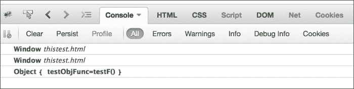

# 第二章：函数、闭包和模块

在上一章中，我们故意没有讨论 JavaScript 的某些方面。这些是赋予 JavaScript 其力量和优雅的一些语言特性。如果你是一个中级或高级的 JavaScript 程序员，你可能正在积极使用对象和函数。然而，在许多情况下，开发者在这些基本层面上绊倒，对 JavaScript 核心构造产生了半生不熟或有时错误的理解。由于对 JavaScript 中闭包概念的普遍理解不足，许多程序员无法很好地使用 JavaScript 的功能方面。在 JavaScript 中，对象、函数和闭包之间有很强的相互联系。理解这三个概念之间强烈的关系可以大大提高我们的 JavaScript 编程能力，为我们提供任何类型应用程序开发坚实的基础。

函数是 JavaScript 的基础。理解 JavaScript 中的函数是你武器库中最重要的武器。关于函数最重要的事实是，在 JavaScript 中，函数是第一类对象。它们像任何其他 JavaScript 对象一样被对待。与其他 JavaScript 数据类型一样，它们可以被变量引用，通过字面量声明，甚至可以作为函数参数传递。

就像 JavaScript 中的任何其他对象一样，函数具有以下能力：

+   它们可以通过字面量创建

+   它们可以分配给变量、数组元素和其他对象的属性

+   它们可以作为参数传递给函数

+   它们可以从函数中作为值返回

+   它们可以拥有动态创建和赋值的属性

在本章以及本书的剩余部分，我们将讨论 JavaScript 函数的这些独特能力。

# 函数字面量

JavaScript 中最重要的概念之一是函数是执行的主要单位。函数是你会包裹所有代码的地方，因此它们会给你的程序带来结构。

JavaScript 函数是通过函数字面量声明的。

函数字面量由以下四个部分组成：

+   函数关键字。

+   可选的名称，如果指定，必须是一个有效的 JavaScript 标识符。

+   用括号括起来的参数名称列表。如果函数没有参数，你需要提供空括号。

+   函数体，作为一系列用花括号括起来的 JavaScript 语句。

## 函数声明

下面是一个非常简单的例子，用于展示函数声明的所有组成部分：

```js
function add(a,b){
  return a+b;
}
c = add(1,2);
console.log(c);  //prints 3
```

这种声明以`function`关键词开头，后接函数名。函数名是可选的。如果一个函数没有指定名称，则称其为匿名函数。我们将看到匿名函数是如何使用的。第三部分是一组函数参数，被括号括起来。括号内是一组零个或多个由逗号分隔的参数名称。这些名称将在函数中被定义为变量，并且它们不会初始化为 undefined，而是初始化为函数调用时提供的参数。第四部分是一组用大括号括起来的语句。这些语句是函数的主体。当函数被调用时，它们将被执行。

这种函数声明方法也被称为**函数语句**。当你这样声明函数时，函数的内容将被编译，并且会创建一个与函数同名的对象。

另一种函数声明方式是通过**函数表达式**：

```js
var add = function(a,b){
  return a+b;
}
c = add(1,2);
console.log(c);  //prints 3
```

在这里，我们创建了一个匿名函数并将其赋值给一个`add`变量；这个变量像之前的例子一样用来调用函数。这种函数声明方式的一个问题是，我们无法进行这种函数的递归调用。递归是一种优雅的编程方式，函数调用自己。你可以使用命名的函数表达式来解决这个限制。作为一个例子，参考以下计算给定数字`n`的阶乘的函数：

```js
var facto = function factorial(n) {
  if (n <= 1)
    return 1;
  return n * factorial(n - 1);
};
console.log(facto(3));  //prints 6
```

在这里，你没有创建一个匿名函数，而是创建了一个有名字的函数。现在，因为函数有一个名字，所以它可以递归地调用自己。

最后，你可以创建自调用函数表达式（我们稍后讨论它们）：

```js
(function sayHello() {
  console.log("hello!");
})();
```

一旦定义，一个函数可以在其他 JavaScript 函数中被调用。函数体执行完毕后，调用者代码（执行函数的代码）将继续执行。你还可以将一个函数作为参数传递给另一个函数：

```js
function changeCase(val) {
  return val.toUpperCase();
}
function demofunc(a, passfunction) {
  console.log(passfunction(a));
}
demofunc("smallcase", changeCase);
```

在前面的示例中，我们用两个参数调用`demofunc()`函数。第一个参数是我们想要转换为大写的字符串，第二个参数是`changeCase()`函数的函数引用。在`demofunc()`中，我们通过传递给`passfunction`参数的引用调用`changeCase()`函数。在这里，我们通过将函数引用作为参数传递给另一个函数来传递一个函数引用。这个强大的概念将在书中讨论回调的部分详细讨论。

一个函数可能返回一个值，也可能不返回值。在前面的例子中，我们看到`add`函数向调用代码返回了一个值。除了在函数末尾返回一个值外，显式调用`return`还可以让你有条件地从函数中返回：

```js
var looper = function(x){
  if (x%5===0) {
    return;
  }
  console.log(x)
}
for(var i=1;i<10;i++){
  looper(i);
}
```

```js
1, 2, 3, 4, 6, 7, 8, and 9, and not 5\. When the if (x%5===0) condition is evaluated to true, the code simply returns from the function and the rest of the code is not executed.
```

# 函数作为数据

在 JavaScript 中，函数可以赋值给变量，而变量是数据。你很快就会看到这是一个强大的概念。让我们看以下示例：

```js
var say = console.log;
say("I can also say things");
```

在前面的例子中，我们将熟悉的`console.log()`函数赋值给 say 变量。任何函数都可以赋值给一个变量，正如前面例子所示。给变量添加括号将调用它。此外，你还可以将函数作为参数传递给其他函数。仔细研究下面的例子并在 JS Bin 中键入它：

```js
var validateDataForAge = function(data) {
 person = data();
  console.log(person);
  if (person.age <1 || person.age > 99){
    return true;
  }else{
    return false;
  }
};

var errorHandlerForAge = function(error) {
  console.log("Error while processing age");
};

function parseRequest(data,validateData,errorHandler) {
  var error = validateData(data);
  if (!error) {
    console.log("no errors");
  } else {
    errorHandler();
  }
}

var generateDataForScientist = function() {
  return {
    name: "Albert Einstein",
    age : Math.floor(Math.random() * (100 - 1)) + 1,
  };
};
var generateDataForComposer = function() {
  return {
    name: "J S Bach",
    age : Math.floor(Math.random() * (100 - 1)) + 1,
  };
};

//parse request
parseRequest(generateDataForScientist, validateDataForAge, errorHandlerForAge);
parseRequest(generateDataForComposer, validateDataForAge, errorHandlerForAge);
```

在这个例子中，我们正在将函数作为参数传递给`parseRequest()`函数。我们为两个不同的调用传递了不同的函数，`generateDataForScientist`和`generateDataForComposers`，而其他两个函数保持不变。你可以观察到我们定义了一个通用的`parseRequest()`。它接受三个函数作为参数，这些函数负责拼接具体内容：数据、验证器、和错误处理程序。`parseRequest()`函数是完全可扩展和可定制的，并且因为它将被每个请求调用，所以有一个单一、干净的调试点。我敢肯定你已经开始欣赏 JavaScript 函数所提供的强大功能。

# 作用域

对于初学者来说，JavaScript 的作用域稍微有些令人困惑。这些概念可能看起来很简单；然而，并非如此。存在一些重要的细微差别，必须理解才能掌握这个概念。那么作用域是什么？在 JavaScript 中，作用域指的是代码的当前上下文。

变量的作用域是变量存在的上下文。作用域指定你可以从哪里访问变量，以及在该上下文中你是否可以访问变量。作用域可以是全局定义的或局部定义的。

## 全局作用域

任何你声明的变量默认都在全局作用域中定义。这是 JavaScript 中采取的最令人烦恼的语言设计决策之一。由于全局变量在其他所有作用域中都是可见的，所以任何作用域都可以修改全局变量。全局变量使得在同一个程序/模块中运行松耦合的子程序变得更加困难。如果子程序碰巧有全局变量并且共享相同的名称，那么它们会相互干扰，并且很可能失败，通常以难以诊断的方式失败。这种情况有时被称为命名空间冲突。我们在前一章中讨论了全局作用域，但现在让我们简要地重新访问它，以了解如何最好地避免这种情况。

你可以用两种方法创建全局变量：

+   第一种方法是将 var 声明放在任何函数外部。本质上，任何在函数外部声明的变量都被定义在全局作用域中。

+   第二种方法是在声明变量时省略 var 声明（也称为隐式全局变量）。我认为这是为了方便新程序员而设计的，但结果却成了一个噩梦。即使在函数作用域内，如果你在声明变量时省略了 var 声明，它默认也是在全局作用域中创建的。这很糟糕。你总是应该让你程序运行于**ESLint**或**JSHint**，让他们标记出这样的违规行为。下面的示例展示了全局作用域的行为：

    ```js
    //Global Scope
    var a = 1;
    function scopeTest() {
      console.log(a);
    }
    scopeTest();  //prints 1
    ```

在这里，我们在函数外部声明了一个变量，并在全局作用域中。这个变量在`scopeTest()`函数中可用。如果你在函数作用域（局部）内给全局作用域变量赋新值，全局作用域中的原始值将被覆盖：

```js
//Global Scope
var a = 1;
function scopeTest() {
  a = 2; //Overwrites global variable 2, you omit 'var'
  console.log(a);
}
console.log(a); //prints 1
scopeTest();  //prints 2
console.log(a); //prints 2 (global value is overwritten)
```

## 局部作用域

与大多数编程语言不同，JavaScript 没有块级作用域（作用域限定在周围的括号内）；相反，JavaScript 有函数级作用域。函数内部声明的变量是局部变量，只能在函数内部或该函数内部的函数中访问：

```js
var scope_name = "Global";
function showScopeName () {
  // local variable; only accessible in this function
  var scope_name = "Local";
  console.log (scope_name); // Local
}
console.log (scope_name);     //prints - Global
showScopeName();             //prints – Local
```

## 函数作用域与块作用域

JavaScript 变量的作用域在函数级别。你可以将这看作是一个小气泡被创建出来，防止变量从这个气泡外部被看到。函数为在其内部声明的变量创建这样一个气泡。你可以这样想象气泡：

```js
-GLOBAL SCOPE---------------------------------------------|
var g =0;                                                 |
function foo(a) { -----------------------|                |
    var b = 1;                           |                |
    //code                               |                |
    function bar() { ------|             |                |
        // ...             |ScopeBar     | ScopeFoo       |
    }                ------|             |                |
    // code                              |                |
    var c = 2;                           |                |
}----------------------------------------|                |
foo();   //WORKS                                          |
bar();   //FAILS                                          |
----------------------------------------------------------|
```

JavaScript 使用作用域链来为给定函数建立作用域。通常有一个全局作用域，每个定义的函数都有自己的嵌套作用域。在另一个函数内部定义的任何函数都有一个局部作用域，它与外部函数链接。*源代码中的位置始终定义作用域*。在解析变量时，JavaScript 从最内层的作用域开始向外搜索。有了这个，让我们来看看 JavaScript 中的各种作用域规则。

在前面的粗略绘图视觉中，你可以看到`foo()`函数定义在全局作用域中。`foo()`函数在其局部作用域内有访问`g`变量的权限，因为它在全局作用域中。`a`、`b`和`c`变量在局部作用域内可用，因为它们是在函数作用域内定义的。`bar()`函数也在函数作用域内声明，并在`foo()`函数内可用。然而，一旦函数作用域结束，`bar()`函数就不可用了。你不能从`foo()`函数外部看到或调用`bar()`函数——一个作用域气泡。

现在`bar()`函数也有了自己的函数作用域（气泡），这里有什么可用？`bar()`函数可以访问`foo()`函数以及`foo()`函数的父作用域内创建的所有变量——`a`、`b`和`c`。`bar()`函数还可以访问全局作用域变量`g`。

这是一个强大的想法。花点时间思考一下。我们刚刚讨论了 JavaScript 中全局作用域可以变得多么泛滥和不受控制。那我们为什么不定性地将一段任意代码包裹在一个函数中呢？我们可以将这个作用域气泡隐藏起来，并围绕这段代码创建一个作用域气泡。使用函数包装来创建正确的作用域将有助于我们编写正确的代码，并防止难以检测的错误。

函数作用域和在此作用域内隐藏变量及函数的另一个优点是，你可以避免两个标识符之间的冲突。以下示例展示了这样一个糟糕的情况：

```js
function foo() {
  function bar(a) {
    i = 2; // changing the 'i' in the enclosing scope's for-loop
    console.log(a+i);
  }
  for (var i=0; i<10; i++) {
    bar(i); // infinite loop
  }
}
foo();
```

在`bar()`函数中，我们不知不觉地修改了`i=2`的值。当我们从`for`循环内部调用`bar()`时，`i`变量的值被设置为`2`，我们陷入了无限循环。这是一个命名空间冲突的坏例子。

到目前为止，使用函数作为作用域听起来是实现 JavaScript 模块化和正确性的好方法。嗯，虽然这种技术有效，但实际上并不理想。第一个问题是我们必须创建一个命名函数。如果我们只是为了引入函数作用域而不断创建这样的函数，我们就会污染全局作用域或父作用域。此外，我们必须不断调用这些函数。这引入了大量样板代码，使代码随时间变得不可读：

```js
var a = 1;
//Lets introduce a function -scope
//1\. Add a named function foo() into the global scope
function foo() { 
 var a = 2;
 console.log( a ); // 2
} 
//2\. Now call the named function foo()
foo();
console.log( a ); // 1
```

我们在全局作用域中创建了一个新的函数`foo()`，并通过调用这个函数后来执行代码。

在 JavaScript 中，你可以通过创建立即执行的函数来解决这两个问题。仔细研究和输入以下示例：

```js
var a = 1;
//Lets introduce a function -scope
//1\. Add a named function foo() into the global scope
(function foo() { 
 var a = 2;
 console.log( a ); // 2
})(); //<---this function executes immediately
console.log( a ); // 1
```

请注意，包装函数声明以`function`开头。这意味着，而不是将函数视为标准声明，而是将函数视为函数表达式。

`(function foo(){ })`表达式作为语句意味着`foo`标识符只存在于`foo()`函数的作用域中，而不是在外部作用域。隐藏`foo`名称本身意味着它不会不必要的污染外部作用域。这是非常有用且更好。我们在函数表达式后添加`()`以立即执行它。所以完整的模式如下所示：

```js
(function foo(){ /* code */ })();

```

这种模式如此常见，以至于它有一个名字：**IIFE**，代表**立即调用** **函数表达式**。许多程序员在使用 IIFE 时省略函数名称。由于 IIFE 的主要用途是引入函数作用域，因此实际上并不需要命名函数。我们可以像下面这样写先前的例子：

```js
var a = 1;
(function() { 
 var a = 2;
 console.log( a ); // 2
})(); 
console.log( a ); // 1
```

在这里，我们创建了一个匿名函数作为立即执行的函数表达式（IIFE）。虽然这与先前的命名 IIFE 相同，但使用匿名 IIFE 有几个缺点：

+   由于在堆栈跟踪中看不到函数名称，因此调试此类代码非常困难。

+   你不能对匿名函数使用递归（如我们之前讨论的）

+   过度使用匿名 IIFE 有时会导致代码不可读。

迪奥格斯·克劳福德（Douglas Crockford）和其他一些专家推荐 IIFE 的一小部分变化：

```js
(function(){ /* code */ }());
```

这两种 IIFE 形式都很流行，你将看到大量使用这两种变体的代码。

你可以向 IIFE 传递参数。以下示例展示了如何向 IIFE 传递参数：

```js
(function foo(b) { 
    var a = 2;
    console.log( a + b ); 
})(3); //prints 5
```

## 内联函数表达式

还有一种匿名函数表达式的流行用法，即把函数作为参数传递给其他函数：

```js
function setActiveTab(activeTabHandler, tab){
  //set active tab
  //call handler
  activeTabHandler();
}
setActiveTab( function (){ 
 console.log( "Setting active tab" );
}, 1 );
//prints "Setting active tab"
```

再次，你可以给这个内联函数表达式命名，以确保在调试代码时获得正确的堆栈跟踪。

## 块级作用域

正如我们之前讨论的，JavaScript 没有块作用域的概念。熟悉其他语言（如 Java 或 C）的程序员会觉得这非常不舒服。**ECMAScript 6**（**ES6**）引入了**let** 关键字来引入传统的块作用域。这非常方便，如果你确定你的环境将支持 ES6，你应该总是使用 `let` 关键字。以下代码所示：

```js
var foo = true;
if (foo) {
  let bar = 42; //variable bar is local in this block { }
  console.log( bar );
}
console.log( bar ); // ReferenceError
```

然而，截至目前，ES6 并不被大多数流行浏览器默认支持。

到目前为止，本章应该已经向你充分解释了 JavaScript 中作用域是如何工作的。如果你仍然不清楚，我建议你停在这里，重新阅读本章的早期部分。上网查找你的疑惑，或者在 Stack Overflow 上提出你的问题。总之，一定要确保你对作用域规则没有任何疑惑。

我们很容易认为代码执行是自上而下，逐行进行的。这是大多数 JavaScript 代码执行的方式，但有一些例外。

考虑以下代码：

```js
console.log( a );
var a = 1;
```

如果你说这是无效的代码，当我们调用 `console.log()` 时会得到 `undefined`，你完全正确。然而，这个呢？

```js
a = 1;
var a;
console.log( a );
```

preceding 代码的输出应该是什么？自然会期望 `undefined` 作为 `var a` 语句在 `a = 1` 之后，似乎自然地假设变量被重新定义并分配了默认的 `undefined`。然而，输出将是 `1`。

当你看到 `var a = 1` 时，JavaScript 将其拆分为两个语句：`var a` 和 `a = 1`。第一个语句，声明，在编译阶段处理。第二个语句，赋值，在执行阶段保持原位。

所以，前面的片段实际上将按以下方式执行：

```js
var a;   //----Compilation phase

a = 1;    //------execution phase
console.log( a );
```

第一个片段实际上按以下方式执行：

```js
var a;     //-----Compilation phase

console.log( a );   
a = 1;     //------execution phase  
```

所以，如我们所见，变量和函数声明在编译阶段被移动到代码的顶部——这也被称为**提升**。非常重要记住的是，只有声明本身被提升，而任何赋值或其他可执行逻辑都保持原位。以下片段展示了函数声明是如何被提升的：

```js
foo();
function foo() {
  console.log(a); // undefined
  var a = 1;
}
```

`foo()` 函数的声明被提升，以至于我们能够在定义它之前执行该函数。提升的一个重要方面是它按作用域工作。在 `foo()` 函数内部，变量的声明将被提升到 `foo()` 函数的顶部，而不是程序的顶部。利用提升执行 `foo()` 函数的实际代码如下：

```js
function foo() {
  var a;
  console.log(a); // undefined
  a = 1;
}
```

我们看到了函数声明被提升，但函数表达式不会。下一节解释了这个案例。

# 函数声明与函数表达式

我们看到了定义函数的两种方式。虽然它们都服务于相同的目的，但这些两种声明之间存在差异。查看下面的例子：

```js
//Function expression
functionOne();
//Error
//"TypeError: functionOne is not a function

var functionOne = function() {
  console.log("functionOne");
};
//Function declaration
functionTwo();
//No error
//Prints - functionTwo

function functionTwo() {
  console.log("functionTwo");
}
```

```js
sayMoo() but such a conditional code is not guaranteed to work across all browsers and can result in unpredictable results:
```

```js
// Never do this - different browsers will behave differently
if (true) {
  function sayMoo() {
    return 'trueMoo';
  }
}
else {
  function sayMoo() {
    return 'falseMoo';
  }
}
foo();
```

然而，用函数表达式这样做是完全安全且明智的：

```js
var sayMoo;
if (true) {
  sayMoo = function() {
    return 'trueMoo';
  };
}
else {
  sayMoo = function() {
    return 'falseMoo';
  };
}
foo();
```

如果你好奇想知道为什么不应该在条件块中使用函数声明，请继续阅读；否则，你可以跳过下面的段落。

函数声明只能出现在程序或函数体中。它们不能出现在块（`{ ... }`）中。块只能包含语句，不能包含函数声明。由于这个原因，几乎所有 JavaScript 的实现都有与这个不同的行为。建议*永远*不要在条件块中使用函数声明。

另一方面，函数表达式非常流行。在 JavaScript 程序员中，基于某种条件对函数定义进行分叉是一个非常常见的模式。由于这样的分叉通常发生在同一作用域中，几乎总是需要使用函数表达式。

# `arguments`参数

`arguments`参数包含了所有传递给函数的参数。这个集合有一个名为`length`的属性，包含了参数的数量，单个参数的值可以使用数组索引表示法来获取。好吧，我们有点撒谎。`arguments`参数不是一个 JavaScript 数组，如果你尝试在`arguments`上使用数组方法，你会失败得很惨。你可以把`arguments`看作是一个类似数组结构。这使得能够编写接受不确定数量参数的函数成为可能。下面的片段展示了如何向函数传递可变数量的参数，并使用`arguments`数组遍历它们：

```js
var sum = function () { 
  var i, total = 0;
  for (i = 0; i < arguments.length; i += 1) {
    total += arguments[i];
  }
  return total;
};
console.log(sum(1,2,3,4,5,6,7,8,9)); // prints 45
console.log(sum(1,2,3,4,5)); // prints 15
```

正如我们讨论的，`arguments`参数并不是一个真正的数组；可以像下面这样将其转换为数组：

```js
var args = Array.prototype.slice.call(arguments);
```

一旦转换为数组，你可以随意操作列表。

## 这个参数

每当函数被调用时，除了代表在函数调用中提供的显式参数之外，还会隐式地传递一个名为`this`的参数给函数。它指的是与函数调用隐式相关联的对象，称为**函数上下文**。如果你编过 Java 代码，`this`关键字对你来说会很熟悉；就像 Java 一样，`this`指向定义方法类实例。

有了这些知识，让我们来谈谈各种调用方法。

### 作为函数的调用

如果一个函数不是作为方法、构造函数，或者通过`apply()`或`call()`调用，它就简单地以*函数*的形式调用：

```js
function add() {}
add();
var substract = function() {

};
substract();
```

当一个函数以这种模式调用时，`this`绑定到全局对象。许多专家认为这是一个糟糕的设计选择。自然地，我们可能会认为`this`会被绑定到父上下文。当你处于这种情况时，你可以将`this`的值捕获到另一个变量中。我们稍后重点关注这种模式。

### 作为方法调用

方法是与对象上的属性绑定的函数。对于方法来说，在调用时`this`绑定到调用对象上：

```js
var person = {
  name: 'Albert Einstein',
  age: 66,
  greet: function () {
    console.log(this.name);
  }
};
person.greet();
```

在这个例子中，当调用`greet`时`this`绑定到`person`对象上，因为`greet`是`person`的一个方法。让我们看看这两种调用模式下这种行为是如何表现的。

让我们准备这个 HTML 和 JavaScript harness：

```js
<!DOCTYPE html>
<html>
<head>
  <meta charset="utf-8">
  <title>This test</title>
  <script type="text/javascript">
 function testF(){ return this; }
 console.log(testF()); 
 var testFCopy = testF;
 console.log(testFCopy()); 
 var testObj = {
 testObjFunc: testF
 };
 console.log(testObj.testObjFunc ());
  </script>
</head>
<body>
</body>
</html>
```

在**Firebug**控制台中，你可以看到以下输出：



前两个方法调用都是作为函数调用；因此，`this`参数指向全局上下文（在这个例子中是`Window`）。

接下来，我们定义了一个名为`testObj`的变量，它有一个名为`testObjFunc`的属性，该属性接收对`testF()`的引用——如果你现在还不清楚对象是如何创建的，也不要担心。这样做，我们创建了一个`testObjMethod()`方法。现在，当我们调用这个方法时，我们期望当显示`this`的值时显示函数上下文。

### 作为构造函数的调用

**构造函数**的声明与其他任何函数一样，即将作为构造函数的函数也没有什么特别之处。然而，它们的调用方式却大不相同。

要作为构造函数调用函数，我们在函数调用前加上**new**关键字。当这样做时，`this`绑定到新对象上。

在我们讨论更多之前，让我们先快速介绍一下 JavaScript 中的面向对象。当然，我们将在下一章中详细讨论这个话题。JavaScript 是一种基于原型继承的语言。这意味着对象可以直接从其他对象继承属性。这种语言是无类的。设计为用`new`前缀调用的函数称为构造函数。通常，为了更容易区分，它们使用**帕斯卡命名法**而不是**驼峰命名法**。在下面的例子中，注意`greet`函数使用`this`来访问`name`属性。`this`参数绑定到`Person`上：

```js
var Person = function (name) {
  this.name = name;
};
Person.prototype.greet = function () {
  return this.name;
};
var albert = new Person('Albert Einstein');
console.log(albert.greet());
```

我们将在下一章学习对象时讨论这种特定的调用方法。

### 使用`apply()`和`call()`方法调用

我们之前说过，JavaScript 函数是对象。与其他对象一样，它们也有一些特定的方法。要使用`apply()`方法调用函数，我们向`apply()`传递两个参数：作为函数上下文的对象和一个作为调用参数的数组。`call()`方法的用法类似，不同之处在于参数是直接在参数列表中传递，而不是作为数组。

# 匿名函数

我们在这章的早些时候向你介绍了匿名函数，因为它们是一个关键概念，所以我们将详细介绍它们。对于受 Scheme 启发的语言来说，匿名函数是一个重要的逻辑和结构构建。

匿名函数通常用于函数不需要在稍后引用的情况下。让我们看看匿名函数的一些最流行的使用情况。

## 在创建对象时使用匿名函数

匿名函数可以赋值给对象属性。这样做时，我们可以使用点（`.`）运算符调用该函数。如果你来自 Java 或其他面向对象语言的背景，你会发现这非常熟悉。在这样 languages, a function, which is part of a class is generally called with a notation—`Class.function()`. Let's consider the following example:

```js
var santa = {
  say :function(){ 
    console.log("ho ho ho"); 
  }
}
santa.say();
```

在这个例子中，我们创建了一个具有`say`属性的对象，该属性是一个匿名函数。在这个特定情况下，这个属性被称为方法而不是函数。我们不需要给这个函数命名，因为我们打算将其作为对象属性调用。这是一个流行的模式，应该会派上用场。

## 在创建列表时使用匿名函数

在这里，我们创建了两个匿名函数并将它们添加到一个数组中。（我们稍后会对数组进行详细介绍。）然后，你遍历这个数组并在循环中执行这些函数：

```js
<script type="text/javascript">
var things = [
  function() { alert("ThingOne") },
  function() { alert("ThingTwo") },
];
for(var x=0; x<things.length; x++) {
  things[x]();
}
</script>
```

## 将匿名函数作为另一个函数的参数

这是最流行的模式之一，你会在大多数专业库中找到这样的代码：

```js
// function statement
function eventHandler(event){
  event();
}

eventHandler(function(){
  //do a lot of event related things
  console.log("Event fired");
});
```

你将匿名函数传递给另一个函数。在接收函数中，你执行作为参数传递的函数。如果你正在创建一次性函数，例如对象方法或事件处理程序，这会非常方便。与先声明一个函数然后将其作为两个单独的步骤进行处理相比，匿名函数语法更为简洁。

## 在条件逻辑中使用匿名函数

你可以使用匿名函数表达式来条件性地改变行为。以下示例展示了这种模式：

```js
var shape;
if(shape_name === "SQUARE") {
  shape = function() {
    return "drawing square";
  }
}
else {
  shape = function() {
    return "drawing square";
  }
}
alert(shape());
```

在这里，根据条件，我们将不同的实现分配给`shape`变量。如果使用得当，这种模式非常有用。过度使用可能导致代码难以阅读和调试。

在这本书的后面部分，我们将探讨几种函数式技巧，例如**记忆化**和缓存函数调用。如果你是快速浏览了整个章节后到达这里的，我建议你停一下，思考一下我们迄今为止讨论的内容。最后几页包含了大量信息，所有这些信息需要一段时间才能吸收。我建议你在继续之前重新阅读这一章。下一节将重点介绍闭包和模块模式。

# 闭包

传统上，闭包一直是纯函数式编程语言的一个特性。JavaScript 通过将闭包视为核心语言结构的一部分，显示了它与这类函数式编程语言的亲和力。闭包在主流 JavaScript 库和高级生产代码中越来越受欢迎，因为它们可以帮助你简化复杂操作。你会在经验丰富的 JavaScript 程序员那里听到他们对闭包几乎带有敬畏的谈论——仿佛闭包是超出了普通人智力范围的一些神奇构造。然而，事实并非如此。当你研究这个概念时，你会发现闭包其实非常明显，几乎是不言自明。在你达到闭包的顿悟之前，我建议你多次阅读这一章节，上网查找资料，编写代码，阅读 JavaScript 库，以了解闭包的行为——但不要放弃。

你首先必须认识到的是，闭包在 JavaScript 中无处不在。它并不是语言中一个隐藏的特殊部分。

在我们深入细节之前，让我们快速回顾一下 JavaScript 中的词法作用域。我们详细讨论了在 JavaScript 中如何根据函数级别确定词法作用域。词法作用域基本上决定了所有标识符在哪里以及如何声明，并预测在执行期间它们如何被查找。

简而言之，闭包是当一个函数被声明时创建的上下文，它允许函数访问和操作位于该函数之外的变量。换句话说，闭包允许函数访问在自己声明时处于作用域内的所有变量及其他函数。

让我们通过一些示例代码来理解这个定义：

```js
var outer = 'I am outer'; //Define a value in global scope
function outerFn() { //Declare a a function in global scope
  console.log(outer);
}
outerFn(); //prints - I am outer
```

你期待一些闪亮的东西吗？不，这真的是闭包最普通的情况。我们在全局作用域中声明一个变量，并在全局作用域中声明一个函数。在函数中，我们能够访问在全局作用域中声明的变量——`outer`。所以，本质上，`outerFn()`函数的外部作用域就是一个闭包，并且始终对`outerFn()`可用。这是一个不错的开始，但也许你还不确定为什么这是一件多么伟大的事情。

让我们让事情变得复杂一些：

```js
var outer = 'Outer'; //Variable declared in global scope
var copy;
function outerFn(){  //Function declared in global scope

  var inner = 'Inner'; //Variable has function scope only, can not be
  //accessed from outside 

  function innerFn(){     //Inner function within Outer function, 
    //both global context and outer
    //context are available hence can access 
    //'outer' and 'inner'
    console.log(outer);
    console.log(inner);
  }
  copy=innerFn;          //Store reference to inner function, 
  //because 'copy' itself is declared
  //in global context, it will be available 
  //outside also
}
outerFn();
copy();  //Cant invoke innerFn() directly but can invoke via a 
//variable declared in global scope
```

是什么现象使得在`innerFn()`内部函数执行时，即使它创建的作用域已经消失很久，`inner`变量仍然可用？当我们在`outerFn()`中声明`innerFn()`时，不仅函数声明被定义，而且还创建了一个闭包，它不仅包含函数声明，还包括声明时处于作用域内的所有变量。当`innerFn()`执行时，即使它是在自己声明的作用域消失后执行，它仍然可以通过闭包访问到自己声明时的原始作用域。

让我们继续扩展这个示例，以了解你可以使用闭包做到何种程度：

```js
var outer='outer';
var copy;
function outerFn() {
  var inner='inner';
  function innerFn(param){
    console.log(outer);
    console.log(inner);
 console.log(param);
 console.log(magic);
  }
  copy=innerFn;
}
console.log(magic); //ERROR: magic not defined
var magic="Magic";
outerFn();
copy("copy");
```

在前面的示例中，我们添加了一些东西。首先，我们在`innerFn()`中添加了一个参数——只是为了说明参数也是闭包的一部分。我们有两个重要的点想要强调。

即使在外层作用域中声明变量是在函数声明之后，外层作用域中的所有变量也会被包含在内。这使得`innerFn()`中的行`console.log(magic)`可以正常工作。

然而，在全局作用域中相同的行`console.log(magic)`将失败，因为即使在相同的作用域中，尚未定义的变量也不能引用。

所有这些示例都是为了传达一些关于闭包如何工作的概念。闭包是 JavaScript 语言中的一个突出特性，您可以在大多数库中看到它们。

让我们看看一些关于闭包的流行模式。

# 定时器和回调

在实现定时器或回调时，您需要异步调用处理程序，通常在稍后的时间点。由于异步调用，我们需要从这些函数外部访问变量。考虑以下示例：

```js
function delay(message) {
  setTimeout( function timerFn(){
    console.log( message );
  }, 1000 );
}
delay( "Hello World" );
```

我们将内部`timerFn()`函数传递给内置库函数`setTimeout()`。然而，`timerFn()`对外层`delay()`作用域有闭包，因此它可以引用变量 message。

# 私有变量

闭包经常用来封装一些作为私有变量的信息。JavaScript 不允许像 Java 或 C++这样的编程语言中的封装，但通过使用闭包，我们可以实现类似的封装：

```js
function privateTest(){
 var points=0;
  this.getPoints=function(){
    return points;
  };
  this.score=function(){
    points++;
  };
}

var private = new privateTest();
private.score();
console.log(private.points); // undefined
console.log(private.getPoints());
```

在前面的示例中，我们创建了一个打算作为构造函数调用的函数。在这个`privateTest()`函数中，我们创建了一个名为`var points=0`的变量作为函数作用域变量。这个变量仅在`privateTest()`中可用。此外，我们创建了一个访问器函数（也称为获取器）——`getPoints()`——这个方法允许我们从`privateTest()`外部只读取点变量的一个值，使得这个变量成为函数的私有变量。然而，另一个方法`score()`允许我们不直接从外部访问的情况下修改私有点变量值。这使得我们可以编写代码，以受控的方式更新私有变量。当您编写基于合同和预定义接口控制变量访问的库时，这种模式非常有用。

# 循环和闭包

考虑以下在循环中使用函数的示例：

```js
for (var i=1; i<=5; i++) {
  setTimeout( function delay(){
    console.log( i );
  }, i*100);
}
```

```js
print 1, 2, 3, 4, and 5 on the console at an interval of 100 ms, right? Instead, it prints 6, 6, 6, 6, and 6 at an interval of 100 ms. Why is this happening? Here, we encounter a common issue with closures and looping. The i variable is being updated after the function is bound. This means that every bound function handler will always print the last value stored in i. In fact, the timeout function callbacks are running after the completion of the loop. This is such a common problem that JSLint will warn you if you try to use functions this way inside a loop.
```

我们如何修复这种行为？我们可以在作用域中引入一个函数作用域和局部复制的`i`变量。以下代码片段向您展示了我们如何这样做：

```js
for (var i=1; i<=5; i++) {
  (function(j){
    setTimeout( function delay(){
      console.log( j );
    }, j*100);
  })( i );
}
```

我们在 IIFE 中传递了`i`变量，并将其复制到局部变量`j`中。在每次迭代中引入 IIFE 可以为新迭代创建一个新的作用域，从而更新具有正确值的局部副本。

# 模块

模块用于模仿类，并专注于变量和函数的公共和私有访问。模块有助于减少全局作用域的污染。有效使用模块可以减少大型代码库中的名称冲突。这种模式采取的典型格式如下：

```js
Var moduleName=function() {
  //private state
  //private functions
  return {
     //public state
     //public variables
  }
}
```

要在此前格式中实现此模式，有两个要求：

+   必须有一个外部闭合函数至少执行一次。

+   这个闭合函数必须至少返回一个内部函数。这是创建对私有状态的闭包所必需的——没有它，你根本无法访问私有状态。

检查以下模块示例：

```js
var superModule = (function (){
  var secret = 'supersecretkey';
  var passcode = 'nuke';

  function getSecret() {
    console.log( secret );
  }

  function getPassCode() {
    console.log( passcode );
  }

  return {
    getSecret: getSecret,
    getPassCode: getPassCode
  };
})();
superModule.getSecret();
superModule.getPassCode();
```

这个示例满足两个条件。首先，我们创建一个 IIFE 或命名函数作为外部闭合。定义的变量将保持私有，因为它们在函数作用域内。我们返回公共函数，以确保我们对私有作用域有闭包。在模块模式中使用 IIFE 将实际上导致这个函数的单例实例。如果你想要创建多个实例，你也可以创建作为模块一部分的命名函数表达式。

我们将继续探索 JavaScript 函数方面的各种方面，特别是闭包。这种优雅结构可以有大量的创新用途。理解各种模式的有效方式是研究流行库的代码并在你的代码中实践这些模式。

## 风格上的考虑

正如前章所述，我们将以某些风格上的考虑来结束这次讨论。再次说明，这些通常是公认的指导原则，而非规则——如果你有理由相信其他情况，请随意偏离它们：

+   使用函数声明，而不是函数表达式：

    ```js
    // bad
    const foo = function () {
    };

    // good
    function foo() {
    }
    ```

+   永远不要在非函数块中声明一个函数（if，while 等）。相反，将函数赋值给一个变量。浏览器允许这样做，但它们的解释各不相同。

+   永远不要将参数命名为`arguments`。这将优先于给予每个函数作用域的`arguments`对象。

# 总结

在本章中，我们学习了 JavaScript 函数。在 JavaScript 中，函数扮演着至关重要的角色。我们讨论了函数是如何创建和使用的。我们还讨论了闭包和函数作用域中变量的 scope 的重要概念。我们讨论了函数作为创建可见类和封装的方法。

在下一章中，我们将查看 JavaScript 中的各种数据结构和数据操作技术。
