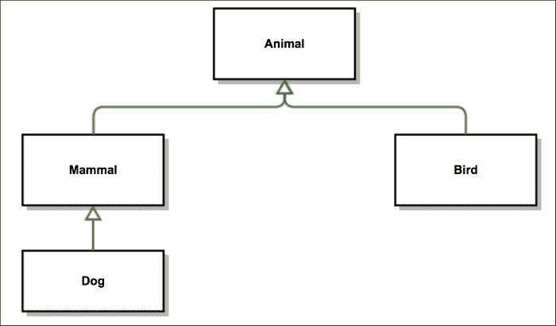
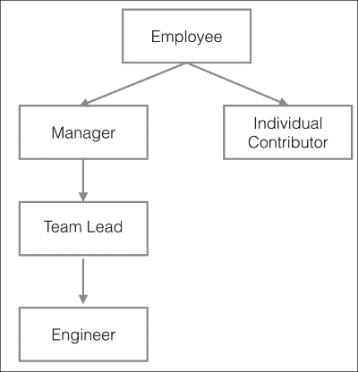

# 第四章：面向对象的 JavaScript

JavaScript 最基本的数据类型是对象数据类型。JavaScript 对象可以被视为可变的基于键值对的集合。在 JavaScript 中，数组、函数和 RegExp 都是对象，而数字、字符串和布尔值是类似对象的构造，是不可变的，但具有方法。在本章中，你将学习以下主题：

+   理解对象

+   实例属性与原型属性

+   继承

+   获取器和设置器

# 理解对象

在我们开始研究 JavaScript 如何处理对象之前，我们应该先花些时间来了解一下面向对象范式。像大多数编程范式一样，**面向对象编程**（**OOP**）也是为了解决复杂性而产生的。主要思想是将整个系统划分为更小的、相互隔离的部分。如果这些小部分能隐藏尽可能多的实现细节，它们就变得容易使用了。一个经典的汽车类比将帮助你理解 OOP 的非常重要的一点。

当你驾驶汽车时，你在操作界面——转向、离合器、刹车和油门。你使用汽车的视角被这个界面所限制，这使得我们能够驾驶汽车。这个界面本质上隐藏了所有真正驱动汽车复杂的系统，比如它的发动机内部运作、电子系统等等。作为一名驾驶员，你不需要关心这些复杂性。这是面向对象编程（OOP）的主要驱动力。一个对象隐藏了实现特定功能的所有复杂性，并向外界暴露了一个有限的接口。所有其他系统都可以使用这个接口，而无需真正关心被隐藏的内部复杂性。此外，一个对象通常会隐藏其内部状态，不让其他对象直接修改。这是 OOP 的一个重要方面。

在一个大型系统中，如果许多对象调用其他对象的接口，而允许它们修改这些对象的内部状态，事情可能会变得非常糟糕。OOP 的基本理念是，对象的内部状态 inherently hidden from the outside world，并且只能通过受控的接口操作来更改。

面向对象编程（OOP）是一个重要的想法，也是从传统的结构化编程向前迈出的明确一步。然而，许多人认为 OOP 做得过头了。大多数 OOP 系统定义了复杂且不必要的类和类型层次结构。另一个大的缺点是，在追求隐藏状态的过程中，OOP 几乎将对象状态视为不重要。尽管 OOP 非常流行，但在许多方面显然是有缺陷的。然而，OOP 确实有一些非常好的想法，尤其是隐藏复杂性并只向外部世界暴露接口。JavaScript 采纳了一些好想法，并围绕它们构建了其对象模型。幸运的是，这使得 JavaScript 对象非常多功能。在他们开创性的作品中，《设计模式：可重用面向对象软件的元素》，*四人帮*给出了更好的面向对象设计两个基本原则：

+   面向接口编程，而不是面向实现

+   对象组合优于类继承

这两个想法实际上是与经典 OOP 的运作方式相反的。经典继承的运作方式是基于继承，将父类暴露给所有子类。经典继承紧密耦合了子类和其父类。经典继承中有机制可以在一定程度上解决这个问题。如果你在像 Java 这样的语言中使用经典继承，通常建议*面向接口编程，而不是面向实现*。在 Java 中，你可以使用接口编写松耦合的代码：

```js
//programming to an interface 'List' and not implementation 'ArrayList'
List theList = new ArrayList();
```

而不是编程到实现，你可以执行以下操作：

```js
ArrayList theList = new ArrayList();
```

编程到一个接口有什么帮助？当你编程到`List`接口时，你只能调用`List`接口独有的方法，不能调用`ArrayList`特定的方法。编程到一个接口给你自由改变你的代码并使用`List`接口的任何其他特定子类。例如，我可以改变我的实现并使用`LinkedList`而不是`ArrayList`。你可以将你的变量更改为使用`LinkedList`：

```js
List theList = new LinkedList();
```

这种方法的优点是，如果你在你的程序中 100 次使用`List`，你根本不需要担心在所有这些地方改变实现。因为你是面向接口编程，而不是面向实现，所以你能够编写松耦合的代码。当你使用经典继承时，这是一个重要的原则。

经典继承也有一个限制，即你只能在父类范围内增强子类。你不能根本区别于从祖先那里得到的东西。这阻碍了重用。经典继承还有其他几个问题，如下：

+   继承引入了紧密耦合。子类对其祖先有所了解。这种紧密耦合了一个子类与其父类之间的关系。

+   当你从父类继承时，你无法选择继承什么和不继承什么。*Joe Armstrong*（**Erlang**的发明者）很好地解释了这种情况——他那如今著名的名言：

    > *"面向对象语言的问题在于，它们携带的所有这些隐式环境。你想要一根香蕉，但你所得到的是一个拿着香蕉和整个丛林的大猩猩。"*

## JavaScript 对象的行为

有了这些背景知识，让我们来探讨一下 JavaScript 对象的行为。从广义上讲，一个对象包含属性，这些属性定义为键值对。属性键（名称）可以是字符串，值可以是任何有效的 JavaScript 值。你可以使用对象字面量来创建对象。以下片段展示了对象字面量是如何创建的：

```js
var nothing = {};
var author = {
  "firstname": "Douglas",
  "lastname": "Crockford"
}
```

属性的名称可以是任何字符串或空字符串。如果属性名是合法的 JavaScript 名称，你可以省略属性名周围的引号。所以`first-name`周围需要引号，但`firstname`周围可以省略引号。逗号用于分隔这些对。你可以像下面这样嵌套对象：

```js
var author = {
  firstname : "Douglas",
  lastname : "Crockford",
  book : {
    title:"JavaScript- The Good Parts",
    pages:"172"
  }
};
```

可以通过使用两种表示法来访问对象的属性：数组表示法和点表示法。根据数组表示法，你可以通过将字符串表达式包裹在`[]`中来从对象中检索值。如果表达式是一个有效的 JavaScript 名称，你可以使用点表示法使用`.`代替。使用`.`是从对象中检索值的首选方法：

```js
console.log(author['firstname']); //Douglas
console.log(author.lastname);     //Crockford
console.log(author.book.title);   // JavaScript- The Good Parts
```

如果你尝试获取一个不存在的值，你会得到一个`undefined`错误。以下将返回`undefined`：

```js
console.log(author.age);
```

一个有用的技巧是使用`||`运算符在这种情况下填充默认值：

```js
console.log(author.age || "No Age Found");
```

你可以通过将新值赋给属性来更新对象的值：

```js
author.book.pages = 190;
console.log(author.book.pages); //190
```

如果你仔细观察，你会意识到你看到的对象字面量语法与 JSON 格式非常相似。

对象的方法是对象的属性，可以持有函数值，如下所示：

```js
var meetingRoom = {};
meetingRoom.book = function(roomId){
  console.log("booked meeting room -"+roomId);
}
meetingRoom.book("VL");
```

## 原型

除了我们添加到对象上的属性外，几乎所有对象都有一个默认属性，称为**原型**。当一个对象没有请求的属性时，JavaScript 会去它的原型中查找。`Object.getPrototypeOf()`函数返回一个对象的 prototype。

许多程序员认为原型与对象的继承密切相关——它们确实是一种定义对象类型的方式——但从根本上说，它们与函数紧密相关。

原型是用来定义将应用于对象实例的属性和函数的一种方式。原型的属性最终成为实例化对象的属性。原型可以被视为创建对象的蓝图。它们可以被视为面向对象语言中类的类似物。JavaScript 中的原型用于编写经典风格的面向对象代码并模仿经典继承。让我们重新回顾一下我们之前的例子：

```js
var author = {};
author.firstname = 'Douglas';
author.lastname = 'Crockford';
```

```js
new operator to instantiate an object via constructors. However, there is no concept of a class in JavaScript, and it is important to note that the new operator is applied to the constructor function. To clearly understand this, let's look at the following example:
```

```js
//A function that returns nothing and creates nothing
function Player() {}

//Add a function to the prototype property of the function
Player.prototype.usesBat = function() {
  return true;
}

//We call player() as a function and prove that nothing happens
var crazyBob = Player();
if(crazyBob === undefined){
  console.log("CrazyBob is not defined");
}

//Now we call player() as a constructor along with 'new' 
//1\. The instance is created
//2\. method usesBat() is derived from the prototype of the function
var swingJay = new Player();
if(swingJay && swingJay.usesBat && swingJay.usesBat()){
  console.log("SwingJay exists and can use bat");
}
```

在前一个例子中，我们有一个`player()`函数，它什么也不做。我们以两种不同的方式调用它。第一个调用是作为普通函数，第二个调用作为构造函数——注意这个调用中使用了`new()`操作符。一旦函数被定义，我们向它添加了一个`usesBat()`方法。当这个函数作为普通函数调用时，对象没有被实例化，我们看到`undefined`被赋值给`crazyBob`。然而，当我们使用`new`操作符调用这个函数时，我们得到了一个完全实例化的对象，`swingJay`。

# 实例属性与原型属性对比

实例属性是对象实例本身的一部分属性，如下例所示：

```js
function Player() {
  this.isAvailable = function() {
    return "Instance method says - he is hired";
  };
}
Player.prototype.isAvailable = function() {
  return "Prototype method says - he is Not hired";
};
var crazyBob = new Player();
console.log(crazyBob.isAvailable());
```

当你运行这个例子时，你会看到**实例方法说 - 他被雇佣了**被打印出来。在`Player()`函数中定义的`isAvailable()`函数被称为`Player`的实例。这意味着除了通过原型附加属性外，你还可以使用`this`关键字在构造函数中初始化属性。当我们实例属性和原型中都有相同的函数定义时，实例属性优先。决定初始化优先级的规则如下：

+   属性从原型绑定到对象实例。

+   属性在构造函数中绑定到对象实例。

这个例子让我们了解了`this`关键字的用法。`this`关键字很容易让人混淆，因为它在 JavaScript 中的行为不同。在其他面向对象的编程语言（如 Java）中，`this`关键字指的是类当前的实例。在 JavaScript 中，`this`的值由函数的调用上下文和调用位置决定。让我们看看这种行为需要如何仔细理解：

+   在全局上下文中使用`this`：当在全局上下文中调用`this`时，它绑定到全局上下文。例如，在浏览器中，全局上下文通常是`window`。这也适用于函数。如果你在全局上下文中定义的函数中使用`this`，它仍然绑定到全局上下文，因为函数是全局上下文的一部分：

    ```js
    function globalAlias(){
      return this;
    }
    console.log(globalAlias()); //[object Window]
    ```

+   在对象方法中使用`this`：在这种情况下，`this`被赋值或绑定到包含它的对象。注意，如果你们嵌套对象，包含对象是立即的父级：

    ```js
    var f = {
      name: "f",
      func: function () {
        return this; 
      }
    };
    console.log(f.func());  
    //prints - 
    //[object Object] {
    //  func: function () {
    //    return this; 
    //  },
    //  name: "f"
    //}
    ```

+   在没有上下文的情况下：如果一个函数没有被任何对象调用，它不会获得任何上下文。默认情况下，它绑定到全局上下文。当你在这样一个函数中使用`this`时，它也绑定到全局上下文。

+   当在构造函数中使用`this`时：正如我们之前所看到的，当一个函数通过`new`关键字调用时，它充当构造函数。在构造函数的情况下，`this`指向正在构造的对象。在下面的例子中，`f()`被用作构造函数（因为它通过`new`关键字调用），因此，`this`指向正在创建的新对象。所以当我们说`this.member = "f"`时，新成员被添加到正在创建的对象中，在这个例子中，这个对象碰巧是`o`：

    ```js
    var member = "global";
    function f()
    {
      this.member = "f";
    }
    var o= new f(); 
    console.log(o.member); // f
    ```

我们发现，当实例属性和原型属性同时定义同一个属性时，实例属性具有优先权。很容易想象，当创建新对象时，构造函数的原型属性会被复制过来。然而，这并不是一个正确的假设。实际发生的情况是，原型被附加到对象上，并在引用该对象的任何属性时引用它。本质上，当引用对象的属性时，以下情况之一会发生：

+   检查对象是否具有该属性。如果找到，则返回该属性。

+   检查相关原型。如果找到属性，则返回该属性；否则，返回一个`undefined`错误。

这是一个重要的理解，因为在 JavaScript 中，以下代码实际上完全有效：

```js
function Player() {
  isAvailable=false;
}
var crazyBob = new Player();
Player.prototype.isAvailable = function() {
  return isAvailable;
};
console.log(crazyBob.isAvailable()); //false
```

这段代码是之前示例的稍微变体。我们首先创建一个对象，然后将其函数附加到原型上。当你最终在对象上调用`isAvailable()`方法时，如果在该对象中找不到它（在这个例子中是`crazyBob`），JavaScript 会到其原型中寻找。你可以将其视为*热代码加载*——如果使用得当，这种能力可以在对象创建后为你提供巨大的扩展基本对象框架的权力。

如果你已经熟悉面向对象编程（OOP），你可能想知道我们是否能控制对象成员的可见性和访问权限。正如我们之前讨论的，JavaScript 没有类。在像 Java 这样的编程语言中，你有访问修饰符，如`private`和`public`，可以让你控制类成员的可见性。在 JavaScript 中，我们可以使用函数作用域实现类似的功能：

+   你可以在函数中使用`var`关键字声明私有变量。它们可以通过私有函数或特权方法访问。

+   私有函数可以在对象的构造函数中声明，并且可以通过特权方法调用。

+   特权方法可以通过`this.method=function() {}`声明。

+   公共方法通过`Class.prototype.method=function(){}`声明。

+   公共属性可以用`this.property`声明，并从对象外部访问。

以下示例展示了几种实现方式：

```js
function Player(name,sport,age,country){ 

  this.constructor.noOfPlayers++;

  // Private Properties and Functions
  // Can only be viewed, edited or invoked by privileged members
  var retirementAge = 40;
  var available=true;
  var playerAge = age?age:18;
  function isAvailable(){ return available && (playerAge<retirementAge); } 
  var playerName=name ? name :"Unknown";
  var playerSport = sport ? sport : "Unknown";

  // Privileged Methods
  // Can be invoked from outside and can access private members
  // Can be replaced with public counterparts
  this.book=function(){ 
    if (!isAvailable()){ 
      this.available=false;
    } else {
      console.log("Player is unavailable");
    } 
  };
  this.getSport=function(){ return playerSport; }; 
  // Public properties, modifiable from anywhere
  this.batPreference="Lefty";
  this.hasCelebGirlfriend=false;
  this.endorses="Super Brand";
} 

// Public methods - can be read or written by anyone
// Can only access public and prototype properties
Player.prototype.switchHands = function(){ this.batPreference="righty"; }; 
Player.prototype.dateCeleb = function(){ this.hasCelebGirlfriend=true; } ;
Player.prototype.fixEyes = function(){ this.wearGlasses=false; };

// Prototype Properties - can be read or written by anyone (or overridden)
Player.prototype.wearsGlasses=true;

// Static Properties - anyone can read or write
Player.noOfPlayers = 0;

(function PlayerTest(){ 
  //New instance of the Player object created.
  var cricketer=new Player("Vivian","Cricket",23,"England"); 
  var golfer =new Player("Pete","Golf",32,"USA"); 
  console.log("So far there are " + Player.noOfPlayers + " in the guild");

  //Both these functions share the common 'Player.prototype.wearsGlasses' variable
  cricketer.fixEyes(); 
  golfer.fixEyes(); 

  cricketer.endorses="Other Brand";//public variable can be updated 

  //Both Player's public method is now changed via their prototype 
  Player.prototype.fixEyes=function(){ 
    this.wearGlasses=true;
  };
  //Only Cricketer's function is changed
  cricketer.switchHands=function(){
    this.batPreference="undecided";
  };

})();
```

让我们从这个例子中理解一些重要的概念：

+   `retirementAge`变量是一个私有变量，没有特权方法来获取或设置其值。

+   `country`变量是一个通过构造函数参数创建的私有变量。构造函数参数作为私有变量对对象可用。

+   当我们调用`cricketer.switchHands()`时，这个函数只应用于`cricketer`本身，而没有同时应用于两名球员，尽管它本身是`Player`对象的一个原型函数。

+   私有函数和特权方法随着每个新对象的创建而实例化。在我们的例子中，每次我们创建一个新的球员实例时，都会创建`isAvailable()`和`book()`的新副本。另一方面，只有公共方法的一个副本被创建，并在所有实例之间共享。这可能会带来一些性能提升。如果你*真的*不需要将某事设为私有，考虑将其设为公共。

# 继承

继承是面向对象编程（OOP）的一个重要概念。通常会有许多实现相同方法的对象，也很常见几乎相似的对象定义，差异仅在于几个方法。继承在促进代码重用方面非常有用。我们可以看看以下继承关系的经典示例：



在这里，你可以看到从通用的**Animal**类中，我们派生出更具体的一些类，如**Mammal**和**Bird**，这些都是基于特定的特性。哺乳动物和鸟类班级都有动物类的同一个模板；然而，它们还定义了特定于它们自己的行为和属性。最后，我们派生出一个非常具体的哺乳动物，**Dog**。狗从动物类和哺乳动物类中继承了共同的属性和行为，同时它还增加了狗特有的属性和行为。这可以继续添加复杂的继承关系。

传统上，继承被用来建立或描述**IS-A**关系。例如，狗是哺乳动物。这就是我们所说的**经典继承**。你可能会在面向对象的语言如 C++和 Java 中看到这样的关系。JavaScript 有一个完全不同的机制来处理继承。JavaScript 是一种无类语言，使用原型进行继承。原型继承在本质上非常不同，需要深入理解。经典继承和原型继承在本质上非常不同，需要仔细研究。

在经典继承中，实例从类蓝图中继承，并创建子类关系。你不能在类定义本身上调用实例方法。你需要创建一个实例，然后在这个实例上调用方法。另一方面，在原型继承中，实例从其他实例中继承。

至于继承，JavaScript 只使用对象。如我们之前讨论的，每个对象都有一个链接到另一个对象的原型。这个原型对象，反过来，也有自己的原型，依此类推，直到找到一个其原型为`null`的对象；`null`，按定义，没有原型，作为原型链中的最后一个链接。

为了更好地理解原型链，让我们考虑以下示例：

```js
function Person() {}
Person.prototype.cry = function() { 
  console.log("Crying");
}
function Child() {}
Child.prototype = {cry: Person.prototype.cry};
var aChild = new Child();
console.log(aChild instanceof Child);  //true
console.log(aChild instanceof Person); //false
console.log(aChild instanceof Object); //true
```

在这里，我们定义了一个`Person`，然后是`Child`——一个孩子 IS-A 人。我们还把`Person`的`cry`属性复制给了`Child`的`cry`属性。当我们尝试使用`instanceof`来看这种关系时，我们很快意识到，仅仅通过复制行为，我们并不能真正使`Child`成为`Person`的实例；`aChild instanceof Person`失败。这只是复制或伪装，并不是继承。即使我们把`Person`的所有属性复制给`Child`，我们也不会从`Person`继承。这通常是一个糟糕的主意，这里只是为了说明目的。我们希望导出一个原型链——一个 IS-A 关系，一个真正的继承，我们可以说是 child IS-A person。我们希望创建一个链：child IS-A person IS-A mammal IS-A animal IS-A object。在 JavaScript 中，这是通过使用一个对象的实例作为原型来完成的：

```js
SubClass.prototype = new SuperClass();
Child.prototype = new Person();
```

让我们修改之前的示例：

```js
function Person() {}
Person.prototype.cry = function() { 
  console.log("Crying");
}
function Child() {}
Child.prototype = new Person();
var aChild = new Child();
console.log(aChild instanceof Child);  //true
console.log(aChild instanceof Person); //true
console.log(aChild instanceof Object); //true
```

修改后的行使用了`Person`实例作为`Child`的原型。这与之前的方法有重要的区别。这里我们声明 child IS-A person。

我们讨论了 JavaScript 如何在一个属性直到它达到`Object.prototype`的原型链中寻找属性。让我们详细讨论原型链的概念，并尝试设计以下员工层次结构：



这是继承的典型模式。经理 IS-A(n) 员工。**经理**从**员工**继承了共同的属性。它可以拥有一个报告人员的数组。一个**个人贡献者**也是基于一个员工，但他没有任何报告人员。一个**团队领导**从经理派生出来，有几个与经理不同的功能。我们本质上是在做每个孩子从它的父母那里导出属性（经理是父母，团队领导是孩子）。

让我们看看我们如何在 JavaScript 中创建这个层次结构。让我们定义我们的`Employee`类型：

```js
function Employee() {
  this.name = '';
  this.dept = 'None';
  this.salary = 0.00;
}
```

这些定义没有什么特别之处。`Employee`对象包含三个属性—姓名、薪水、部门。接下来，我们定义`Manager`。这个定义展示了如何指定继承链中的下一个对象：

```js
function Manager() {
 Employee.call(this);
  this.reports = [];
}
Manager.prototype = Object.create(Employee.prototype);

```

在 JavaScript 中，你可以在定义构造函数后任何时候将原型实例添加到构造函数的 prototype 属性中。在这个例子中，我们还没有探索到两个想法。首先，我们调用`Employee.call(this)`。如果你来自 Java 背景，这与构造函数中的`super()`方法调用类似。`call()`方法用一个特定的对象作为其上下文（在这个例子中，是给定的`this`值）调用一个函数，换句话说，`call()`允许指定在函数执行时哪个对象将被`this`关键字引用。与 Java 中的`super()`类似，调用`parentObject.call(this)`是初始化正在创建的对象所必需的。

我们看到的另一点是使用`Object.create()`而不是调用`new`。`Object.create()`创建了一个具有指定原型的对象。当我们调用`new Parent()`时，会调用父类的构造逻辑。在大多数情况下，我们想要的是`Child.prototype`是一个通过原型链接到`Parent.prototype`的对象。如果父类构造函数包含特定于父类的额外逻辑，我们在创建子对象时不想运行这个逻辑。这可能会导致非常难以发现的错误。`Object.create()`创建了与`new`运算符相同的父子原型链接，而不会调用父类构造函数。

为了有一个无副作用且准确的继承机制，我们必须确保我们执行以下操作：

+   将原型设置为父类的实例来初始化原型链（继承）；这只需要做一次（因为原型对象是共享的）

+   调用父类的构造函数初始化对象本身；这在每次实例化时都会进行（你可以在构造它时传递不同的参数）

在理解了这一点的基础上，我们来定义其余的对象：

```js
function IndividualContributor() {
  Employee.call(this);
  this.active_projects = [];
}
IndividualContributor.prototype = Object.create(Employee.prototype);

function TeamLead() {
  Manager.call(this);
  this.dept = "Software";
  this.salary = 100000;
}
TeamLead.prototype = Object.create(Manager.prototype);

function Engineer() {
  TeamLead.call(this);
  this.dept = "JavaScript";
  this.desktop_id = "8822" ;
  this.salary = 80000;
}
Engineer.prototype = Object.create(TeamLead.prototype);
```

基于这个层次结构，我们可以实例化这些对象：

```js
var genericEmployee = new Employee();
console.log(genericEmployee);
```

你可以看到以下代码片段的输出：

```js
[object Object] {
  dept: "None",
  name: "",
  salary: 0
}
```

一个通用的`Employee`对象分配给`None`的部门（如默认值中所指定），其余属性也分配为默认值。

接下来，我们实例化一个经理；我们可以像下面这样提供具体的值：

```js
var karen = new Manager();
karen.name = "Karen";
karen.reports = [1,2,3];
console.log(karen);
```

你会看到以下输出：

```js
[object Object] {
  dept: "None",
  name: "Karen",
  reports: [1, 2, 3],
  salary: 0
}
```

对于`TeamLead`，其`reports`属性是从基类（在这个例子中是 Manager）派生出来的：

```js
var jason = new TeamLead();
jason.name = "Json";
console.log(jason);
```

你会看到以下的输出：

```js
[object Object] {
  dept: "Software",
  name: "Json",
  reports: [],
  salary: 100000
}
```

当 JavaScript 处理新的操作符时，它创建一个新对象，并将这个对象作为`this`的值传递给父对象——即`TeamLead`构造函数。构造函数设置`projects`属性的值，并隐式地将内部`__proto__`属性的值设置为`TeamLead.prototype`的值。`__proto__`属性决定了用于返回属性值的原型链。这个过程不会在`jason`对象中设置从原型链继承的属性值。当读取属性的值时，JavaScript 首先检查该对象中是否存在这个值。如果值存在，这个值就被返回。如果值不存在，JavaScript 使用`__proto__`属性检查原型链。说到这里，当你做以下操作时会发生什么：

```js
Employee.prototype.name = "Undefined";
```

它不会传播到`Employee`的所有实例中。这是因为当你创建一个`Employee`对象的实例时，这个实例获得了名字的局部值。当你通过创建一个新的`Employee`对象来设置`TeamLead`原型时，`TeamLead.prototype`拥有`name`属性的局部值。因此，当 JavaScript 查找`jason`对象（`TeamLead`的一个实例）的`name`属性时，它找到了`TeamLead.prototype`中的这个属性的局部值。它不会尝试进一步查找链中的`Employee.prototype`。

如果你想在运行时改变属性的值，并且希望新值被对象的的所有后代继承，你不能在对象的构造函数中定义属性。要实现这一点，你需要将其添加到构造函数的原型中。例如，让我们稍稍修改一下先前的例子：

```js
function Employee() {
  this.dept = 'None';
  this.salary = 0.00;
}
Employee.prototype.name = '';
function Manager() {
  this.reports = [];
}
Manager.prototype = new Employee();
var sandy = new Manager();
var karen = new Manager();

Employee.prototype.name = "Junk";

console.log(sandy.name);
console.log(karen.name);
```

```js
String object to add a reverse() method to reverse a string. This method does not exist in the native String object but by manipulating String's prototype, we add this method to String:
```

```js
String.prototype.reverse = function() {
  return Array.prototype.reverse.apply(this.split('')).join('');
};
var str = 'JavaScript';
console.log(str.reverse()); //"tpircSavaJ"
```

虽然这是一个非常强大的技术，但使用时应该小心，不要过度使用。参阅[`perfectionkills.com/extending-native-builtins/`](http://perfectionkills.com/extending-native-builtins/)以了解扩展原生内置对象的陷阱以及如果你打算这样做应该注意什么。

# 访问器和方法

**访问器方法**是获取特定属性值方便的方法；正如其名，**设置器方法**是设置属性值的方法。通常，你可能希望基于其他值派生一个值。传统上，访问器和方法通常是像下面的函数：

```js
var person = {
  firstname: "Albert",
  lastname: "Einstein",
  setLastName: function(_lastname){
    this.lastname= _lastname;
  },
  setFirstName: function (_firstname){
    this.firstname= _firstname;
  },
  getFullName: function (){
    return this.firstname + ' '+ this.lastname;
  }  
};
person.setLastName('Newton');
person.setFirstName('Issac');
console.log(person.getFullName());
```

如你所见，`setLastName()`、`setFirstName()`和`getFullName()`是用于属性*获取*和*设置*的函数。`Fullname`是通过连接`firstname`和`lastname`属性派生出的属性。这是一个非常常见的用例，ECMAScript 5 现在为您提供了访问器和方法的默认语法。

以下示例展示了如何在 ECMAScript 5 中使用对象字面量语法创建访问器和方法：

```js
var person = {
  firstname: "Albert",
  lastname: "Einstein",
  get fullname() {
    return this.firstname +" "+this.lastname;
  },
  set fullname(_name){
    var words = _name.toString().split(' ');
    this.firstname = words[0];
    this.lastname = words[1];
  }
};
person.fullname = "Issac Newton";
console.log(person.firstname); //"Issac"
console.log(person.lastname);  //"Newton"
console.log(person.fullname);  //"Issac Newton"
```

声明访问器和方法的另一种方式是使用`Object.defineProperty()`方法：

```js
var person = {
  firstname: "Albert",
  lastname: "Einstein",
};
Object.defineProperty(person, 'fullname', {
  get: function() {
    return this.firstname + ' ' + this.lastname;
  },
  set: function(name) {
    var words = name.split(' ');
    this.firstname = words[0];
    this.lastname = words[1];
  }
});
person.fullname = "Issac Newton";
console.log(person.firstname); //"Issac"
console.log(person.lastname);  //"Newton"
console.log(person.fullname);  //"Issac Newton"
```

在这个方法中，即使对象已经被创建，你也可以调用`Object.defineProperty()`。

既然你已经尝到了 JavaScript 对象导向的味道，接下来我们将介绍由**Underscore.js**提供的一组非常有用的工具方法。我们在上一章讨论了 Underscore.js 的安装和基本使用。这些方法将使对对象的基本操作变得非常容易：

+   `keys()`：这个方法检索对象自身可枚举属性的名称。请注意，这个函数不会遍历原型链：

    ```js
    var _ = require('underscore');
    var testobj = {
      name: 'Albert',
      age : 90,
      profession: 'Physicist'
    };
    console.log(_.keys(testobj));
    //[ 'name', 'age', 'profession' ]
    ```

+   `allKeys()`: 这个方法会检索对象自身和继承的属性的名称：

    ```js
    var _ = require('underscore');
    function Scientist() {
      this.name = 'Albert';
    }
    Scientist.prototype.married = true;
    aScientist = new Scientist();
    console.log(_.keys(aScientist)); //[ 'name' ]
    console.log(_.allKeys(aScientist));//[ 'name', 'married' ]

    ```

+   `values()`：这个方法检索对象自身属性的值：

    ```js
    var _ = require('underscore');
    function Scientist() {
      this.name = 'Albert';
    }
    Scientist.prototype.married = true;
    aScientist = new Scientist();
    console.log(_.values(aScientist)); //[ 'Albert' ]
    ```

+   `mapObject()`: 这个方法会将对象中每个属性的值进行转换：

    ```js
    var _ = require('underscore');
    function Scientist() {
      this.name = 'Albert';
      this.age = 90;
    }
    aScientist = new Scientist();
    var lst = _.mapObject(aScientist, function(val,key){
      if(key==="age"){
        return val + 10;
      } else {
        return val;
      }
    });
    console.log(lst); //{ name: 'Albert', age: 100 }
    ```

+   `functions()`：这会返回一个排序好的列表，包含对象中每个方法的名称——对象每个函数属性的名称。

+   `pick()`：这个函数返回一个对象的副本，过滤出提供的键的值：

    ```js
    var _ = require('underscore');
    var testobj = {
      name: 'Albert',
      age : 90,
      profession: 'Physicist'
    };
    console.log(_.pick(testobj, 'name','age')); //{ name: 'Albert', age: 90 }
    console.log(_.pick(testobj, function(val,key,object){
      return _.isNumber(val);
    })); //{ age: 90 }
    ```

+   `omit()`: 这个函数是`pick()`的逆操作——它返回一个对象的副本，过滤掉指定键的值。

# 总结

允许 JavaScript 应用程序通过使用对象导向带来的更大控制和结构，从而提高代码的清晰度和质量。JavaScript 的对象导向基于函数原型和原型继承。这两个概念可以为开发者提供大量的财富。

在本章中，我们看到了基本的对象创建和操作。我们探讨了构造函数如何用于创建对象。我们深入研究了原型链以及如何在原型链上操作继承。这些基础将用于构建我们在下一章中探索的 JavaScript 模式的知识。
