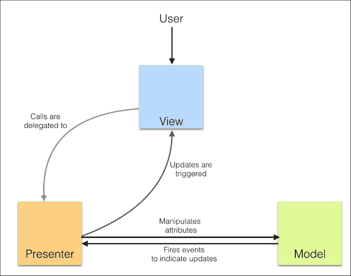
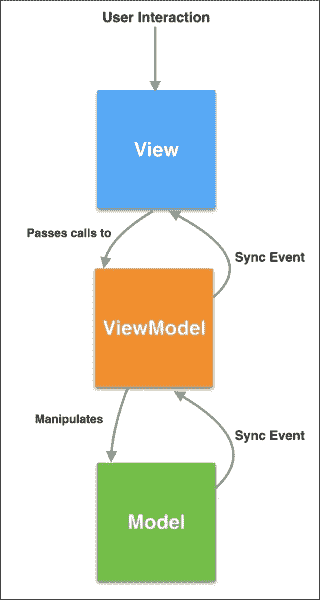

# 第五章：JavaScript 模式

到目前为止，我们已经查看了几个编写 JavaScript 代码所必需的基本构建块。一旦你开始使用这些基本构建块来构建更大的系统，你很快就会意识到有些事情可能有一种标准的方法。在开发大型系统时，你会遇到重复的问题；模式旨在为这些已知和识别的问题提供标准化的解决方案。模式可以被视为最佳实践、有用的抽象或模板来解决常见问题。编写可维护的代码是困难的。编写模块化、正确和可维护的代码的关键是理解重复的主题并使用通用模板来编写这些优化的解决方案。关于设计模式的最重要文本是一本于 1995 年出版的书籍，名为《设计模式：可重用面向对象软件的元素》，作者是埃里希·伽玛（Erich Gamma）、理查德·赫尔姆（Richard Helm）、拉尔夫·约翰逊（Ralph Johnson）和约翰·维利斯 ides（John Vlissides）——一个被称为**四人帮**（简称 GOF）的团队。这本开创性的作品给出了各种模式的正式定义，并解释了今天我们使用的大多数流行模式的实现细节。理解模式的重要性是非常重要的：

+   模式提供了解决常见问题的经过验证的解决方案：模式提供了优化解决特定问题的模板。这些模式得到了坚实的工程经验支持，并经过验证。

+   模式旨在被重用：它们足够通用，可以适应问题的变体。

+   模式定义了词汇：模式是定义良好的结构，因此为解决方案提供了一个通用的词汇。这在跨大型团队沟通时非常有表现力。

# 设计模式

在本章中，我们将探讨一些适用于 JavaScript 的设计模式。然而，编码模式对于 JavaScript 来说非常具体，对我们来说也非常重要。虽然我们花费了大量时间和精力来理解和掌握设计模式，但理解反模式以及如何避免陷阱也同样重要。在通常的软件开发周期中，有几种地方可能会引入糟糕的代码，主要是在代码接近发布的时候，或者当代码交给另一个团队进行维护时。如果将这些糟糕的设计结构记录为反模式，它们可以指导开发者知道该避免哪些陷阱，以及如何不采用糟糕的设计模式。大多数语言都有它们自己的反模式。根据它们解决的问题类型，设计模式被 GOF 归类为几个大类：

+   **创建型设计模式**：这些模式处理各种对象创建机制。尽管大多数语言提供了基本对象创建方法，但这些模式关注对象创建的优化或更受控的机制。

+   **结构设计模式**：这些模式都是关于对象及其之间关系的组合。想法是在系统中的某处发生变化时，对整体对象关系的影响最小。

+   **行为设计模式**：这些模式专注于对象之间的相互依赖和通信。

下面的表格是一个有用的工具，用于识别模式的类别：

+   创建型模式：

    +   工厂方法

    +   抽象工厂

    +   建造者

    +   原型

    +   单例

+   结构模式：

    +   适配器

    +   桥接

    +   组合

    +   装饰器

    +   外观

    +   享元

    +   代理

+   行为模式

    +   解释器

    +   模板方法

    +   责任链

    +   命令

    +   迭代器

    +   中介者

    +   备忘录

    +   观察者

    +   状态

    +   策略

    +   访问者

本章中我们将讨论的一些模式可能不包括在此列表中，因为它们更特定于 JavaScript 或这些经典模式的一种变体。同样，我们也不会讨论不适合 JavaScript 或不常用的模式。

# 命名空间模式

在 JavaScript 中过度使用全局作用域几乎是一种禁忌。当你构建更大的程序时，有时很难控制全局作用域被污染的程度。命名空间可以减少程序创建的全局变量数量，并帮助避免命名冲突或过度的前缀命名。使用命名空间的想法是创建一个全局对象，为您的应用程序或库添加所有这些对象和函数，而不是用对象污染全局作用域。JavaScript 没有显式的语法来定义命名空间，但命名空间可以很容易地创建。考虑以下示例：

```js
function Car() {}
function BMW() {}
var engines = 1;
var features = {
  seats: 6,
  airbags:6
};
```

我们正在全局作用域中创建所有这些内容。这是一个反模式，这从来不是一个好主意。然而，我们可以重构这个代码，创建一个全局对象，并让所有的函数和对象成为这个全局对象的一部分，如下所示：

```js
// Single global object
var CARFACTORY = CARFACTORY || {};
CARFACTORY.Car = function () {};
CARFACTORY.BMW = function () {};
CARFACTORY.engines = 1;
CARFACTORY.features = {
  seats: 6,
  airbags:6
};
```

按惯例，全局命名空间对象名称通常全部用大写书写。这种模式为应用程序添加了命名空间，防止了您的代码以及您的代码与使用的第三方库之间的命名冲突。许多项目在其公司或项目名后使用独特名称来为他们的命名空间创建唯一名称。

尽管这似乎是一种理想的方式来限制你的全局变量并为你的代码添加一个命名空间，但它有点冗长；你需要为每个变量和函数加上命名空间前缀。你需要输入更多内容，代码变得不必要地冗长。此外，单一的全局实例意味着代码的任何部分都可以修改全局实例，其余的功能得到更新状态—这可能会导致非常糟糕的副作用。在之前的例子中，一个有趣的现象是这一行—`var CARFACTORY = CARFACTORY || {};`. 当你在一个大型代码库上工作时，你不能假设你正在为这个命名空间（或者给它分配一个属性）创建第一次。有可能命名空间已经存在。为了确保只有当命名空间尚未创建时才创建命名空间，始终依赖通过短路`||`操作符的快速默认是安全的。

# 模块模式

随着你构建大型应用程序，你很快会意识到保持代码库的组织和模块化变得越来越困难。模块模式有助于保持代码清晰地分离和组织。

模块将更大的程序分成更小的部分，并赋予它们一个命名空间。这非常重要，因为一旦你将代码分成模块，这些模块可以在多个地方重复使用。仔细设计模块的接口将使您的代码非常易于重用和扩展。

JavaScript 提供了灵活的函数和对象，这使得创建健壮的模块系统变得容易。函数作用域有助于创建模块内部的命名空间，而对象可用于存储一系列导出的值。

在我们开始探索模式本身之前，让我们快速回顾一下我们之前讨论的一些概念。

我们详细讨论了对象字面量。对象字面量允许你按照如下方式创建名称-值对：

```js
var basicServerConfig = {
  environment: "production",
  startupParams: {
    cacheTimeout: 30,
    locale: "en_US"
  },
  init: function () {
    console.log( "Initializing the server" );
  },
  updateStartup: function( params ) {
      this.startupParams = params;
      console.log( this.startupParams.cacheTimeout );
      console.log( this.startupParams.locale );
  }
};
basicServerConfig.init(); //"Initializing the server"
basicServerConfig.updateStartup({cacheTimeout:60, locale:"en_UK"}); //60, en_UK
```

在这个例子中，我们创建了一个对象字面量，并定义了键值对来创建属性和函数。

在 JavaScript 中，模块模式被广泛使用。模块有助于模仿类的概念。模块允许我们包含一个对象的公共/私有方法和变量，但最重要的是，模块将这些部分限制在全局作用域之外。由于变量和函数被包含在模块作用域内，我们自动防止了与其他使用相同名称的脚本发生命名冲突。

模块模式的另一个美丽方面是，我们只暴露公共 API。与内部实现相关的所有其他内容都在模块的闭包内保持私有。

与其他面向对象的编程语言不同，JavaScript 没有显式的访问修饰符，因此，没有*隐私*的概念。你不能有公共变量或私有变量。如我们之前讨论的，在 JavaScript 中，函数作用域可以用来强制这个概念。模块模式使用闭包来限制变量和函数的访问仅限于模块内部；然而，变量和函数是在被返回的对象中定义的，这对外部是可用的。

让我们考虑之前的例子，将其转换为模块。我们实际上是在使用一个立即执行的函数表达式（IIFE），并返回模块的接口，即`init`和`updateStartup`函数：

```js
var basicServerConfig = (function () {
  var environment= "production";
  startupParams= {
    cacheTimeout: 30,
    locale: "en_US"
  };
  return {
    init: function () {
      console.log( "Initializing the server" );
    },
    updateStartup: function( params ) {
      this.startupParams = params;
      console.log( this.startupParams.cacheTimeout );
      console.log( this.startupParams.locale );
    }
  };
})();
basicServerConfig.init(); //"Initializing the server"
basicServerConfig.updateStartup({cacheTimeout:60, locale:"en_UK"}); //60, en_UK
```

在这个例子中，`basicServerConfig`作为全局上下文中的一个模块创建。为了确保我们不会污染全局上下文，创建模块时命名空间很重要。此外，由于模块本质上是可以重用的，确保我们使用命名空间避免命名冲突也很重要。对于`basicServerConfig`模块，以下代码片段展示了创建命名空间的方法：

```js
// Single global object
var SERVER = SERVER||{};
SERVER.basicServerConfig = (function () {
  Var environment= "production";
  startupParams= {
    cacheTimeout: 30,
    locale: "en_US"
  };
  return {
    init: function () {
      console.log( "Initializing the server" );
    },
    updateStartup: function( params ) {
      this.startupParams = params;
      console.log( this.startupParams.cacheTimeout );
      console.log( this.startupParams.locale );
    }
  };
})();
SERVER.basicServerConfig.init(); //"Initializing the server"
SERVER.basicServerConfig.updateStartup({cacheTimeout:60, locale:"en_UK"}); //60, en_UK
```

使用命名空间与模块通常是好主意；然而，并不是说模块必须与命名空间相关联。

模块模式的一种变体试图克服原始模块模式的一些问题。这种改进的模块模式也被称为**揭示**模块模式（**RMP**）。RMP 最初由*Christian Heilmann*普及。他不喜欢在从另一个函数调用公共函数或访问公共变量时必须使用模块名。另一个小问题是，你必须在返回公共接口时使用对象字面量表示法。考虑以下示例：

```js
var modulePattern = function(){
  var privateOne = 1;
  function privateFn(){
    console.log('privateFn called');
  }
  return {
    publicTwo: 2,
    publicFn:function(){
      modulePattern.publicFnTwo();   
    },
    publicFnTwo:function(){
      privateFn();
    }
  }
}();
modulePattern.publicFn(); "privateFn called"
```

你可以看到，在`publicFn()`中我们需要通过`modulePattern`调用`publicFnTwo()`。此外，公共接口是以对象字面量返回的。改进经典的模块模式的就是所谓的 RMP。这个模式背后的主要思想是在私有作用域中定义所有成员，并返回一个匿名对象，该对象指向需要作为公共接口公开的私有功能。

让我们看看如何将我们之前的示例转换为 RMP。这个示例深受 Christian 博客的启发：

```js
var revealingExample = function(){
  var privateOne = 1;
  function privateFn(){
    console.log('privateFn called');
  }
  var publicTwo = 2;
  function publicFn(){
    publicFnTwo();    
  }
  function publicFnTwo(){
    privateFn();
  }
  function getCurrentState(){
    return 2;
  }
  // reveal private variables by assigning public pointers
  return {
    setup:publicFn,
    count:publicTwo,
    increaseCount:publicFnTwo,
    current:getCurrentState()
  };
}();
console.log(revealingExample.current); // 2
revealingExample.setup(); //privateFn called
```

在这里的一个重要区别是，你在私有作用域中定义函数和变量，并返回一个匿名对象，该对象指向你想作为公共接口公开的私有变量和函数。这是一个更干净的变体，应优先于经典模块模式。

然而，在生产代码中，你希望使用一种更标准的模块创建方法。目前，创建模块主要有两种方法。第一种被称为**CommonJS 模块**。CommonJS 模块通常更适合服务器端 JavaScript 环境，如**Node.js**。一个 CommonJS 模块包含一个`require()`函数，该函数接收模块的名称并返回模块的接口。该格式是由 CommonJS 的志愿者小组提出的；他们的目标是设计、原型化和标准化 JavaScript API。CommonJS 模块由两部分组成。首先，模块需要暴露的变量和函数列表；当你将一个变量或函数赋值给`module.exports`变量时，它就从模块中暴露出来。其次，一个`require`函数，模块可以使用它来导入其他模块的导出：

```js
//Add a dependency module 
var crypto = require('crypto');
function randomString(length, chars) {
  var randomBytes = crypto.randomBytes(length);
  ...
  ...
}
//Export this module to be available for other modules
module.exports=randomString;
```

CommonJS 模块在服务器端的 Node.js 和浏览器端的**curl.js**中得到支持。

JavaScript 模块的另一种形式被称为**异步模块定义**（**AMD**）。它们是以浏览器为首要目标的模块，并选择异步行为。AMD 使用一个`define`函数来定义模块。这个函数接受一个模块名称数组和一个函数。一旦模块被加载，`define`函数就带着它们的接口作为参数执行这个函数。AMD 提案旨在异步加载模块及其依赖项。`define`函数用于根据以下签名定义命名或未命名模块：

```js
define(
  module_id /*optional*/,
  [dependencies] /*optional*/,
  definition function /*function for instantiating the module or object*/
);
```

你可以如下添加一个无依赖的模块：

```js
define(
{ 
  add: function(x, y){ 
    return x + y; 
  } 
});
```

`require`模块的使用如下：

```js
require(["math","draw"], function ( math,draw ) {
  draw.2DRender(math.pi);
});
```

**RequireJS**([`requirejs.org/docs/whyamd.html`](http://requirejs.org/docs/whyamd.html))是实现 AMD 的模块加载器之一。

## ES6 模块

两种不同的模块系统和不同的模块加载器可能会让人感到有些害怕。ES6 试图解决这个问题。ES6 有一个拟定的模块规范，试图保留 CommonJS 和 AMD 模块模式的优点。ES6 模块的语法类似于 CommonJS，并且 ES6 模块支持异步加载和可配置的模块加载：

```js
//json_processor.js
function processJSON(url) {
  ...
}
export function getSiteContent(url) {
  return processJSON(url);
}
//main.js
import { getSiteContent } from "json_processor.js";
content=getSiteContent("http://google.com/");
```

ES6 导出允许你以类似于 CommonJS 的方式导出一个函数或变量。在需要使用这个导入的函数的代码中，你使用`import`关键字来指定你想从哪里导入这个依赖。一旦依赖被导入，它就可以作为程序的一个成员使用。我们将在后面的章节中讨论如何在不支持 ES6 的环境中使用 ES6。

# 工厂模式

工厂模式是另一种流行的对象创建模式。它不需要使用构造函数。这个模式提供了一个接口来创建对象。基于传递给工厂的类型，该特定类型的对象由工厂创建。这个模式的一个常见实现通常是使用类的构造函数或静态方法。这样的类或方法的目的如下：

+   它抽象了创建类似对象时的重复操作

+   它允许消费者不了解对象创建的内部细节就能创建对象

让我们举一个常见的例子来了解工厂的使用。假设我们有以下内容：

+   构造函数，`CarFactory()`

+   在`CarFactory`中有一个名为`make()`的静态方法，它知道如何创建`car`类型的对象

+   具体的`car`类型，如`CarFactory.SUV`、`CarFactory.Sedan`等

我们希望如下使用`CarFactory`：

```js
var golf = CarFactory.make('Compact');
var vento = CarFactory.make('Sedan');
var touareg = CarFactory.make('SUV');
```

以下是实现这样一个工厂的方法。以下实现相当标准。我们通过编程调用构造函数来创建指定类型的对象——`CarFactory[const].prototype = new CarFactory();`。

我们在映射对象类型到构造函数。实现这个模式可能有以下几种变化：

```js
// Factory Constructor
function CarFactory() {}
CarFactory.prototype.info = function() {
  console.log("This car has "+this.doors+" doors and a "+this.engine_capacity+" liter engine");
};
// the static factory method
CarFactory.make = function (type) {
  var constr 0= type;
  var car;
  CarFactory[constr].prototype = new CarFactory();
  // create a new instance
  car = new CarFactory[constr]();
  return car;
};

CarFactory.Compact = function () {
  this.doors = 4;
  this.engine_capacity = 2; 
};
CarFactory.Sedan = function () {
  this.doors = 2;
  this.engine_capacity = 2;
};
CarFactory.SUV = function () {
  this.doors = 4;
  this.engine_capacity = 6;
}; 
  var golf = CarFactory.make('Compact');
  var vento = CarFactory.make('Sedan');
  var touareg = CarFactory.make('SUV');
  golf.info(); //"This car has 4 doors and a 2 liter engine"
```

我们建议您在 JS Bin 中尝试这个例子，并通过实际编写代码来理解这个概念。

# 混入模式

混入有助于显著减少我们代码中的功能重复，并有助于功能重用。我们可以将共享功能移动到混入中，减少共享行为的重复。这样，您就可以专注于构建实际功能，而不必重复共享行为。让我们考虑以下示例。我们想要创建一个可以被任何对象实例使用的自定义日志记录器。日志记录器将成为需要在使用/扩展混入的对象之间共享的功能：

```js
var _ = require('underscore');
//Shared functionality encapsulated into a CustomLogger
var logger = (function () {
  var CustomLogger = {
    log: function (message) {
      console.log(message);
    }
  };
  return CustomLogger;
}());

//An object that will need the custom logger to log system specific logs
var Server = (function (Logger) {
  var CustomServer = function () {
    this.init = function () {
      this.log("Initializing Server...");
    };
  };

  // This copies/extends the members of the 'CustomLogger' into 'CustomServer'
  _.extend(CustomServer.prototype, Logger);
  return CustomServer;
}(logger));

(new Server()).init(); //Initializing Server...
```

在这个例子中，我们使用了来自**Underscore.js**的`_.extend`——我们在上一章讨论了这个函数。这个函数用于将源（`Logger`）的所有属性复制到目标（`CustomServer.prototype`）。正如您在这个例子中观察到的，我们创建了一个共享的`CustomLogger`对象，旨在被任何需要其功能的对象实例使用。这样一个对象是`CustomServer`——在其`init()`方法中，我们调用这个自定义日志记录器的`log()`方法。这个方法对`CustomServer`是可用的，因为我们通过 Underscore 的`extend()`将`CustomLogger`扩展到`CustomServer`。我们动态地将混入的功能添加到消费者对象中。理解混入和继承之间的区别很重要。当您在多个对象和类层次结构中有共享功能时，您可以使用混入。如果您在单一的类层次结构中有共享功能，您可以使用继承。在原型继承中，当你从原型继承时，对原型的任何更改都会影响继承原型的一切。如果您不想这样，可以使用混入。

# 装饰器模式

装饰器模式背后的主要思想是，你应以一个具有某些基本功能的普通对象开始你的设计。随着设计的演变，你可以使用现有的装饰器来增强你的普通对象。这是一种在面向对象世界中非常流行的模式，尤其是在 Java 中。让我们以`BasicServer`为例，这是一个具有非常基本功能的服务器。这些基本功能可以通过装饰来服务于特定目的。我们可以有两个不同的情况，这个服务器可以同时服务于 PHP 和 Node.js，并在不同的端口上提供服务。这些不同的功能是通过装饰基本服务器实现的：

```js
var phpServer = new BasicServer();
phpServer = phpServer.decorate('reverseProxy');
phpServer = phpServer.decorate('servePHP');
phpServer = phpServer.decorate('80');
phpServer = phpServer.decorate('serveStaticAssets');
phpServer.init();
```

节点服务器将具有以下内容：

```js
var nodeServer = new BasicServer();
nodeServer = nodeServer.decorate('serveNode');
nodeServer = nodeServer.decorate('3000');
nodeServer.init();
```

在 JavaScript 中实现装饰器模式有几种方法。我们将讨论一种方法，其中模式通过列表实现，不依赖于继承或方法调用链：

```js
//Implement BasicServer that does the bare minimum
function BasicServer() {
  this.pid = 1;
  console.log("Initializing basic Server");
  this.decorators_list = []; //Empty list of decorators
}
//List of all decorators
BasicServer.decorators = {};

//Add each decorator to the list of BasicServer's decorators
//Each decorator in this list will be applied on the BasicServer instance
BasicServer.decorators.reverseProxy = {
  init: function(pid) {
    console.log("Started Reverse Proxy");
    return pid + 1;
  }
};
BasicServer.decorators.servePHP = {
  init: function(pid) {
    console.log("Started serving PHP");
    return pid + 1;
  }
};
BasicServer.decorators.serveNode = {
  init: function(pid) {
    console.log("Started serving Node");
    return pid + 1;
  }
};

//Push the decorator to this list everytime decorate() is called
BasicServer.prototype.decorate = function(decorator) {
  this.decorators_list.push(decorator);
};
//init() method looks through all the applied decorators on BasicServer
//and executes init() method on all of them
BasicServer.prototype.init = function () {
  var running_processes = 0;
  var pid = this.pid;
  for (i = 0; i < this.decorators_list.length; i += 1) {
    decorator_name = this.decorators_list[i];
    running_processes = BasicServer.decorators[decorator_name].init(pid);
  }
  return running_processes;
};

//Create server to serve PHP
var phpServer = new BasicServer();
phpServer.decorate('reverseProxy');
phpServer.decorate('servePHP');
total_processes = phpServer.init();
console.log(total_processes);

//Create server to serve Node
var nodeServer = new BasicServer();
nodeServer.decorate('serveNode');
nodeServer.init();
total_processes = phpServer.init();
console.log(total_processes);
```

`BasicServer.decorate()`和`BasicServer.init()`是两个真正发生事情的方法。我们将所有要应用到`BasicServer`上的装饰器推送到`BasicServer`的装饰器列表中。在`init()`方法中，我们从这些装饰器列表中执行或应用每个装饰器的`init()`方法。这是一种不使用继承的更清洁的装饰器模式方法。这种方法在 Stoyan Stefanov 的书中《JavaScript 模式，O'Reilly 媒体》中有描述，因其简单性而在 JavaScript 开发者中得到了重视。

# 观察者模式

首先，让我们看看观察者模式的语言无关定义。在 GOF 的书中，《设计模式：可重用面向对象软件的元素》，定义观察者模式如下：

一个或多个观察者对主题的状态感兴趣，并通过附着自身向主题注册他们的兴趣。当主题中发生观察者可能感兴趣的变化时，会发送一个通知消息，调用每个观察者的更新方法。当观察者不再对主题的状态感兴趣时，他们可以简单地将自己分离。

在观察者设计模式中，主题保持一个依赖于它的对象列表（称为观察者），并在状态变化时通知它们。主题使用广播向观察者通知变化。观察者可以在不再希望收到通知时从列表中删除自己。基于这种理解，我们可以定义此模式中的参与者：

+   **主题**：它保持观察者的列表，并具有添加、删除和更新观察者的方法

+   **观察者**：为需要在主题状态变化时通知的对象提供接口

让我们创建一个可以添加、删除和通知观察者的主题：

```js
var Subject = ( function(  ) {
  function Subject() {
    this.observer_list = [];
  }
  // this method will handle adding observers to the internal list
  Subject.prototype.add_observer = function ( obj ) {
    console.log( 'Added observer' );
    this.observer_list.push( obj );
  };
  Subject.prototype.remove_observer = function ( obj ) {
    for( var i = 0; i < this.observer_list.length; i++ ) {
      if( this.observer_list[ i ] === obj ) {
        this.observer_list.splice( i, 1 );
        console.log( 'Removed Observer' );
      }
    }
  };
  Subject.prototype.notify = function () {
    var args = Array.prototype.slice.call( arguments, 0 );
    for( var i = 0; i<this.observer_list.length; i++ ) {
 this.observer_list[i].update(args);
    }
  };
  return Subject;
})();
```

这是一个相当直接实现的`Subject`。关于`notify()`方法的重要事实是，所有观察者对象`update()`方法的调用方式，以广播方式更新。

现在让我们定义一个创建随机推文的简单对象。这个对象提供了一个接口，通过 `addObserver()` 和 `removeObserver()` 方法向 `Subject` 添加和删除观察者。它还调用 `Subject` 的 `notify()` 方法，并传递新获取的推文。当这种情况发生时，所有观察者都会传播新推文已更新，新推文作为参数传递：

```js
function Tweeter() {
  var subject = new Subject();
  this.addObserver = function ( observer ) {
    subject.add_observer( observer );
  };
  this.removeObserver = function (observer) {
    subject.remove_observer(observer);
  };
  this.fetchTweets = function fetchTweets() {
    // tweet
    var tweet = {
      tweet: "This is one nice observer"
    };
    // notify our observers of the stock change
    subject.notify( tweet );
  };
}
```

现在让我们添加两个观察者：

```js
var TweetUpdater = {
  update : function() {
    console.log( 'Updated Tweet -  ', arguments );
  }
};
var TweetFollower = {
  update : function() {
    console.log( '"Following this tweet -  ', arguments );
  }
};
```

这两个观察者都只有一个 `update()` 方法，该方法将由 `Subject.notify()` 方法调用。现在我们实际上可以通过推特的界面将这些观察者添加到 `Subject` 中：

```js
var tweetApp = new Tweeter();
tweetApp.addObserver( TweetUpdater );
tweetApp.addObserver( TweetFollower );
tweetApp.fetchTweets();
tweetApp.removeObserver(TweetUpdater);
tweetApp.removeObserver(TweetFollower);
```

这将导致以下输出：

```js
Added observer
Added observer
Updated Tweet -   { '0': [ { tweet: 'This is one nice observer' } ] }
"Following this tweet -   { '0': [ { tweet: 'This is one nice observer' } ] }
Removed Observer
Removed Observer
```

这是一个基本的实现，用于说明观察者模式的思想。

# JavaScript 模型-视图*模式

**模型-视图-控制器**（**MVC**）、**模型-视图-呈现器**（**MVP**）和 **模型-视图-视图模型**（**MVVM**）在服务器应用程序中一直很受欢迎，但在最近几年，JavaScript 应用程序也开始使用这些模式来结构和管理工作量大的项目。许多 JavaScript 框架已经出现，支持 **MV*** 模式。我们将讨论使用 **Backbone.js** 的几个示例。

## 模型-视图-控制器

模型-视图-控制器（MVC）是一种流行的结构模式，其核心思想是将应用程序分为三个部分，以将信息的内部表示与表示层分离。MVC 包含组件。模型是应用程序对象，视图是底层模型对象的表示，控制器处理用户界面根据用户交互的行为。

## 模型

模型是代表应用程序中数据的构造。它们与用户界面或路由逻辑无关。模型更改通常通过遵循观察者设计模式来通知视图层。模型也可能包含用于验证、创建或删除数据的代码。当数据更改时自动通知视图层做出反应的能力使得像 Backbone.js、**Amber.js** 等框架在构建 MV* 应用程序时非常有用。以下示例向您展示了一个典型的 Backbone 模型：

```js
var EmployeeModel = Backbone.Model.extend({
  url: '/employee/1',
  defaults: {
    id: 1,
    name: 'John Doe',
    occupation: null
  }
  initialize: function() {
 }
}); var JohnDoe = new EmployeeModel();
```

这个模型结构可能在不同框架之间有所不同，但它们通常有一些共同点。在大多数现实世界中应用程序中，您希望您的模型被持久化到内存存储或数据库中。

## 视图

视图是您模型的视觉表示。通常，模型的状态在呈现给视图层之前进行处理、筛选或按摩。在 JavaScript 中，视图负责渲染和操作 DOM 元素。视图观察模型，并在模型发生变化时收到通知。当用户与视图交互时，通过视图层（通常通过控制器）更改模型的某些属性。在诸如 Backbone 的 JavaScript 框架中，视图是使用模板引擎（如**Handlebar.js**([`handlebarsjs.com/`](http://handlebarsjs.com/))或**mustache.js**([`mustache.github.io/`](https://mustache.github.io/)))创建的。这些模板本身并不是视图。它们观察模型，并根据这些变化保持视图状态更新。让我们来看一个用 Handlebar 定义的视图示例：

```js
<li class="employee_photo">
  <h2>{{title}}</h2>
  
  <div class="employee_details">
    {{employee_details}}
  </div>
</li>
```

像前一个示例这样的视图包含包含模板变量的标记。这些变量通过自定义语法进行分隔。例如，在 Handlebar.js 中，模板变量使用`{{ }}`进行分隔。框架通常以 JSON 格式传输数据。视图如何从模型中填充由框架透明处理。

## 控制器

控制器作为模型和视图之间的层，负责当用户改变视图属性时更新模型。大多数 JavaScript 框架与经典定义的控制器有所偏离。例如，Backbone 没有一个叫做控制器的概念；他们有一个叫做**路由器**的东西，负责处理路由逻辑。你可以把视图和路由器的组合看作是一个控制器，因为很多同步模型和视图的逻辑都在视图本身内完成。一个典型的 Backbone 路由器如下所示：

```js
var EmployeeRouter = Backbone.Router.extend({
  routes: { "employee/:id": "route" },
  route: function( id ) {
    ...view render logic...
  }
});
```

# 模型-视图-呈现器模式

模型-视图-呈现器是我们之前讨论的原始 MVC 模式的一种变体。MVC 和 MVP 都旨在分离关注点，但在很多基本方面它们是不同的。MVP 中的呈现器具有视图所需的必要逻辑。视图的任何调用都会委派给呈现器。呈现器还观察模型，并在模型更新时更新视图。许多作者认为，因为呈现器将模型与视图绑定在一起，所以它也执行了传统控制器的角色。有各种 MVP 的实现方式，而且没有框架提供开箱即用的经典 MVP。在 MVP 的实现中，以下是一些将 MVP 与 MVC 分开的主要区别：

+   视图没有参考模型

+   呈现器有一个模型参考，并在模型变化时负责更新视图

MVP 通常有两种实现方式：

+   被动视图：视图尽可能天真，所有的业务逻辑都在呈现器中。例如，一个简单的 Handlebars 模板可以被视为一个被动视图。

+   监控控制器：视图中大多包含声明性逻辑。当视图中的简单声明性逻辑不足时，由呈现器接管。

下面的图表描述了 MVP 架构：



# 模型-视图-视图模型

MVVM 最初是由微软为与**Windows Presentation Foundation** (**WPF**) 和 **Silverlight** 使用而提出的。MVVM 是 MVC 和 MVP 的一个变种，并进一步试图将用户界面（视图）与业务模型和应用程序行为分离。MVVM 在 MVC 和 MVP 中讨论的领域模型之上创建了一个新的模型层。这个模型层将属性作为视图的接口。假设我们 UI 上有复选框。复选框的状态被捕捉到一个`IsChecked`属性中。在 MVP 中，视图会有这个属性，呈现器会设置它。然而，在 MVVM 中，呈现器会有`IsChecked`属性，视图负责与它同步。既然呈现器实际上并没有做传统呈现器的工作，它被重新命名为视图模型：



这些方法的实现细节取决于我们试图解决的问题和所使用的框架。

# 摘要

在构建大型应用程序时，我们会看到某些问题模式一次又一次地重复。这些问题模式有定义良好的解决方案，可以复用以构建健壮的解决方案。在本章中，我们讨论了一些关于这些模式的重要模式和思想。大多数现代 JavaScript 应用程序使用这些模式。在一个大型系统中不实现模块、装饰器、工厂或 MV*模式的情况很少见。这些是我们本章讨论的基础思想。下一章我们将讨论各种测试和调试技术。
