# 第六章：测试与调试

随着你编写 JavaScript 应用程序，你很快就会意识到拥有一个健全的测试策略是不可或缺的。事实上，编写足够的测试用例几乎总是一个坏主意。确保以下几点非常重要：

+   现有的代码按照规范运行。

+   任何新代码都不会破坏规格定义的行为。

这两个点都非常重要。许多工程师认为只有第一个点是覆盖代码足够测试的唯一原因。测试覆盖的最明显优势是确保推送到生产系统的代码基本上是错误免费的。编写测试用例以智能地覆盖代码的最大功能区域通常会给你关于代码整体质量的一个很好的指示。在这个问题上不应该有任何争论或妥协。不幸的是，许多生产系统仍然缺乏足够的代码覆盖。建立一个工程师文化，让开发者在编写代码时思考编写测试用例，这一点非常重要。

第二个点甚至更重要。遗留系统通常非常难以管理。当你在别人写的代码或大型分布式团队写的代码上工作时，很容易引入错误和破坏事物。即使是最优秀的工程师也会犯错误。当你在一个你不太熟悉的大的代码库上工作时，如果没有健全的测试覆盖来帮助你，你会引入错误。由于没有测试用例来确认你的更改，你对所做的更改没有信心，你的代码发布将会是颤抖的、缓慢的，显然充满了隐藏的错误。

你将避免重构或优化你的代码，因为你其实不确定代码库的哪些更改可能会潜在地破坏某些功能（再次，因为没有测试用例来确认你的更改）——所有这些都是一个恶性的循环。这就像一个土木工程师说，“虽然我已经建造了这座桥，但我对自己建造的质量没有信心。它可能会立即倒塌或永远不会倒塌。”尽管这听起来像是一种夸张，但我见过很多高影响的生产代码在没有测试覆盖的情况下被推送到生产环境中。这是危险的，应该避免。当你编写足够的测试用例来覆盖大部分功能性代码，并对这些代码进行更改时，你会立即意识到是否有新更改的问题。如果你的更改导致测试用例失败，你就会意识到问题。如果你的重构破坏了测试场景，你就会意识到问题——所有这些都发生在代码推送到生产环境之前。

近年来，像测试驱动开发和自测试代码这样的想法越来越流行，尤其是在**敏捷方法论**中。这些从根本上来说是正确的想法，将帮助你编写健壮的代码——你自信的代码。我们将在本章讨论所有这些想法。你将了解如何在现代 JavaScript 中编写好的测试用例。我们还将查看几种调试代码的工具和方法。JavaScript 传统上在测试和调试方面一直有点困难，主要是因为缺乏工具，但现代工具使这两者变得容易和自然。

# 单元测试

当我们谈论测试用例时，我们大部分时候是指**单元测试**。假设我们要测试的单元始终是一个函数是不正确的。单元（或工作单元）是一个构成单一行为的逻辑单位。这个单元应该能够通过公共接口调用，并且应该能够独立测试。

因此，单元测试执行以下功能：

+   它测试一个单一的逻辑函数

+   它可以不按照特定的执行顺序运行

+   它处理自己的依赖项和模拟数据

+   它总是对相同的输入返回相同的结果

+   它应该是自解释的，可维护的，可读的

### 注意

马丁·福勒提倡使用**测试金字塔**([`martinfowler.com/bliki/TestPyramid.html`](http://martinfowler.com/bliki/TestPyramid.html))策略，以确保我们有大量的单元测试，从而确保最大的代码覆盖率。测试金字塔指出，你应该编写比高级集成和 UI 测试更多的底层单元测试。

有两种重要的测试策略我们将在此章节讨论。

## 测试驱动开发

**测试驱动** **开发**（**TDD**）在过去几年中得到了很多重视。这个概念最初是在**极限编程**方法论中提出的。这个想法是有一个短暂重复的开发周期，重点是先编写测试用例。这个周期如下所示：

1.  根据特定代码单元的规格添加测试用例。

1.  运行现有的测试用例套，看看你写的新的测试用例是否会失败——它应该会（因为没有为此单元编写代码）。这一步确保当前的测试框架运行良好。

1.  编写主要用来确认测试用例的代码。这段代码没有优化或重构，甚至可能不完全正确。然而，此刻这是可以接受的。

1.  重新运行测试，看看所有测试用例是否通过。在这个步骤之后，你会自信新代码没有破坏任何东西。

1.  重构代码，确保你在优化单元并处理所有边缘情况。

这些步骤会为新添加的所有代码重复执行。这是一种非常优雅的策略，非常适合敏捷方法论。TDD 只有在可测试的代码单元小且只符合测试用例时才会成功。编写小型的、模块化的、精确的代码单元非常重要，这些单元的输入和输出符合测试用例。

## 行为驱动开发

在尝试遵循 TDD 时一个非常常见的问题就是词汇和正确性的定义。BDD 试图在遵循 TDD 时引入一个*普遍的语言*。这种语言确保业务和工程团队都在谈论同一件事。

我们将使用**Jasmine**作为主要的 BDD 框架，并探索各种测试策略。

### 注意

您可以从[`github.com/jasmine/jasmine/releases/download/v2.3.4/jasmine-standalone-2.3.4.zip`](https://github.com/jasmine/jasmine/releases/download/v2.3.4/jasmine-standalone-2.3.4.zip)下载独立包来安装 Jasmine。

解压此包后，您将拥有以下目录结构：

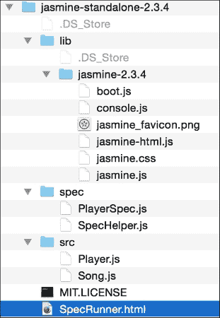

`lib`目录包含了你在项目中开始编写 Jasmine 测试用例所需的 JavaScript 文件。如果你打开`SpecRunner.html`，你会发现以下 JavaScript 文件包含在其中：

```js
<script src="img/jasmine.js"></script>
<script src="img/jasmine-html.js"></script>
<script src="img/boot.js"></script>    

<!-- include source files here... -->   
<script src="img/Player.js"></script>   
<script src="img/Song.js"></script>    
<!-- include spec files here... -->   
<script src="img/SpecHelper.js"></script>   
<script src="img/PlayerSpec.js"></script>
```

前三项是 Jasmine 自己的框架文件。下一部分包括我们要测试的源文件和实际的测试规格。

让我们用一个非常普通的例子来实验 Jasmine。创建一个`bigfatjavascriptcode.js`文件，并将其放在`src/`目录中。我们将测试以下函数：

```js
function capitalizeName(name){
  return name.toUpperCase();
}
```

这是一个只做一件事情的简单函数。它接收一个字符串并返回一个首字母大写的字符串。我们将围绕这个函数测试各种场景。这是我们之前讨论过的代码单元。

接下来，创建测试规格。创建一个 JavaScript 文件，`test.spec.js`，并将其放在`spec/`目录中。该文件应包含以下内容。您需要向`SpecRunner.html`中添加以下两行：

```js
<script src="img/bigfatjavascriptcode.js"></script> 
<script src="img/test.spec.js"></script> 
```

这个包含的顺序不影响。当我们运行`SpecRunner.html`时，你会看到如下内容：

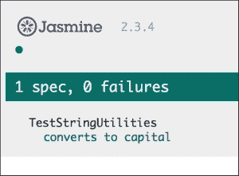

这是显示执行测试次数和失败和成功计数的 Jasmine 报告。现在，让我们让测试用例失败。我们想测试一个将未定义变量传递给函数的用例。再添加一个测试用例如下：

```js
it("can handle undefined", function() {
  var str= undefined;
  expect(capitalizeName(str)).toEqual(undefined);
});
```

现在，当你运行`SpecRunner.html`时，你会看到以下结果：

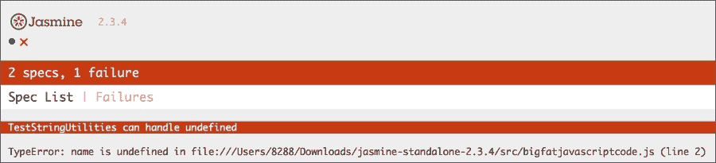

正如你所见，这个测试用例的失败以详细的错误堆栈显示出来。现在，我们来解决这个问题。在你原始的 JavaScript 代码中，我们可以这样处理一个未定义的条件：

```js
function capitalizeName(name){
  if(name){
    return name.toUpperCase();
  }
}
```

有了这个改变，你的测试用例将通过，你将在 Jasmine 报告中看到以下内容：

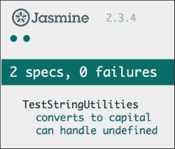

这和测试驱动开发非常相似。你编写测试用例，然后填充必要的代码以符合规格，然后重新运行测试套件。让我们了解 Jasmine 测试的结构。

我们的测试规格如下：

```js
describe("TestStringUtilities", function() {
  it("converts to capital", function() {
    var str = "albert";
    expect(capitalizeName(str)).toEqual("ALBERT");
  });
  it("can handle undefined", function() {
    var str= undefined;
    expect(capitalizeName(str)).toEqual(undefined);
  });
});
```

`describe("TestStringUtilities"`是一个测试套件。测试套件的名称应该描述我们正在测试的代码单元——这可以是一个函数或一组相关功能。在规格说明中，你调用全局 Jasmine `it`函数，并向其传递规格的标题和测试函数，该函数用于测试用例。这个函数是实际的测试用例。你可以使用`expect`函数捕获一个或多个断言或一般期望。当所有期望都是`true`时，你的规格说明通过。你可以在`describe`和`it`函数中编写任何有效的 JavaScript 代码。作为期望值的一部分，我们使用匹配器进行匹配。在我们示例中，`toEqual()`是匹配两个值相等的匹配器。Jasmine 包含一组丰富的匹配器，以适应大多数常见用例。Jasmine 支持的一些常见匹配器如下：

+   `toBe()`：这个匹配器检查两个比较对象是否相等。这和`===`比较一样，如下面的代码所示：

    ```js
    var a = { value: 1};
    var b = { value: 1 };

    expect(a).toEqual(b);  // success, same as == comparison
    expect(b).toBe(b);     // failure, same as === comparison
    expect(a).toBe(a);     // success, same as === comparison
    ```

+   `not`：你可以用`not`前缀来否定一个匹配器。例如，`expect(1).not.toEqual(2);`将否定`toEqual()`所建立的匹配。

+   `toContain()`：这检查一个元素是否是数组的一部分。这不同于`toBe()`的精确对象匹配。例如，看看以下代码：

    ```js
    expect([1, 2, 3]).toContain(3);
    expect("astronomy is a science").toContain("science");
    ```

+   `toBeDefined()`和`toBeUndefined()`：这两个匹配器很方便，用于检查变量是否未定义（或不是）。

+   `toBeNull()`：这检查变量的值是否为`null`。

+   `toBeGreaterThan()`和`toBeLessThan()`：这些匹配器执行数值比较（它们也可以用于字符串）：

    ```js
    expect(2).toBeGreaterThan(1);
    expect(1).toBeLessThan(2);
    expect("a").toBeLessThan("b");
    ```

Jasmine 的一个有趣特性是**间谍**功能。当你编写一个大型系统时，不可能确保所有系统始终可用且正确。同时，你不想因为一个可能已损坏或不可用的依赖而使单元测试失败。为了模拟一个所有依赖项对我们要测试的代码单元都可用的情况，我们模拟这些依赖项以总是给出我们期望的响应。模拟是测试的一个重要方面，大多数测试框架都提供对模拟的支持。Jasmine 通过一个称为间谍的特征允许模拟。Jasmine 间谍本质上是我们可能没有准备好的函数的桩；在编写测试用例时，我们需要跟踪我们正在执行这些依赖项，而不是忽略它们。请考虑以下示例：

```js
describe("mocking configurator", function() {
  var configurator = null;
  var responseJSON = {};

  beforeEach(function() {
    configurator = {
      submitPOSTRequest: function(payload) {
        //This is a mock service that will eventually be replaced 
        //by a real service
        console.log(payload);
        return {"status": "200"};
      }
    };
 spyOn(configurator, 'submitPOSTRequest').and.returnValue({"status": "200"});
    configurator.submitPOSTRequest({
      "port":"8000",
      "client-encoding":"UTF-8"
    });
  });

  it("the spy was called", function() {
    expect(configurator.submitPOSTRequest).toHaveBeenCalled();
  });

  it("the arguments of the spy's call are tracked", function() {
    expect(configurator.submitPOSTRequest).toHaveBeenCalledWith({"port":"8000","client-encoding":"UTF-8"});
  });
});
```

在这个例子中，当我们编写这个测试用例时，要么我们没有`configurator.submitPOSTRequest()`依赖的实际实现，要么有人正在修复这个特定的依赖。无论如何，我们目前没有可用。为了让我们的测试工作，我们需要模拟它。Jasmine 间谍允许我们用模拟函数替换一个函数并追踪其执行。

在这种情况下，我们需要确保我们调用了依赖。当实际的依赖准备就绪时，我们将重新审视这个测试用例，以确保它符合规格，但此时，我们只需要确保依赖被调用即可。Jasmine 的`toHaveBeenCalled()`函数让我们能够追踪函数的执行，该函数可能是一个模拟函数。我们可以使用`toHaveBeenCalledWith()`来确定 stub 函数是否用正确的参数被调用。使用 Jasmine 间谍，你可以创建几个其他有趣的场景。本章节的范围不允许我们涵盖它们所有，但我鼓励你自己去发现这些领域。

### 注意

你可以参考 Jasmine 用户手册，了解关于 Jasmine 间谍的更多信息，链接为：[`jasmine.github.io/2.0/introduction.html`](http://jasmine.github.io/2.0/introduction.html)。

### 提示

**Mocha，Chai 和 Sinon**

尽管 Jasmine 是最著名的 JavaScript 测试框架，但在 Node.js 环境中，**Mocha**和**Chai**越来越受到重视。Mocha 是用于描述和运行测试用例的测试框架。Chai 是支持 Mocha 的断言库。**Sinon.JS**在创建测试的模拟和 stub 时非常有用。本书不会讨论这些框架，但如果你想尝试这些框架，对 Jasmine 的了解将会有帮助。

# JavaScript 调试

如果你不是一个完全的新程序员，我相信你一定花了一些时间来调试自己的代码或别人的代码。调试几乎像一种艺术形式。每种语言都有不同的调试方法和挑战。JavaScript 传统上是一个难以调试的语言。我曾经为了使用`alert()`函数调试糟糕的 JavaScript 代码而痛苦不堪。幸运的是，现代浏览器如 Mozilla Firefox 和 Google Chrome 都有出色的开发者工具来帮助调试浏览器中的 JavaScript。还有像**IntelliJ WebStorm**这样的 IDE，为 JavaScript 和 Node.js 提供了出色的调试支持。在本章中，我们将重点介绍 Google Chrome 内置的开发者工具。Firefox 也支持 Firebug 扩展，并具有出色的内置开发者工具，但它们的行为与 Google Chrome 的**开发者工具**（**DevTools**）大致相同，因此我们将讨论这两种工具都适用的常见调试方法。

在我们讨论具体的调试技术之前，让我们先了解在尝试调试我们的代码时我们可能感兴趣的错误类型。

## 语法错误

当你的代码有不符合 JavaScript 语言语法的内容时，解释器会拒绝这部分代码。如果你的 IDE 支持语法检查，这些错误很容易被捕捉到。大多数现代 IDE 都能帮助检测这些错误。之前，我们讨论了像**JSLint**和**JSHint**这样的工具有助于捕捉代码中的语法问题。它们分析代码并在语法上标出错误。JSHint 的输出可能非常有启发性。例如，以下输出显示了代码中我们可以更改许多内容。以下片段来自我现有项目中的一个：

```js
temp git:(dev_branch) ✗ jshint test.js
test.js: line 1, col 1, Use the function form of "use strict".
test.js: line 4, col 1, 'destructuring expression' is available in ES6 (use esnext option) or Mozilla JS extensions (use moz).
test.js: line 44, col 70, 'arrow function syntax (=>)' is only available in ES6 (use esnext option).
test.js: line 61, col 33, 'arrow function syntax (=>)' is only available in ES6 (use esnext option).
test.js: line 200, col 29, Expected ')' to match '(' from line 200 and instead saw ':'.
test.js: line 200, col 29, 'function closure expressions' is only available in Mozilla JavaScript extensions (use moz option).
test.js: line 200, col 37, Expected '}' to match '{' from line 36 and instead saw ')'.
test.js: line 200, col 39, Expected ')' and instead saw '{'.
test.js: line 200, col 40, Missing semicolon.
```

## 使用严格模式

在早前的章节中，我们简要讨论了**严格模式**。JavaScript 中的严格模式可以标出或消除一些 JavaScript 的隐式错误。严格模式不会默默失败，而是让这些错误抛出异常。严格模式还能帮助将错误转化为实际的错误。强制严格模式有两种方法。如果你想让整个脚本都使用严格模式，你只需在 JavaScript 程序的第一行添加`use strict`声明。如果你想让某个特定函数遵循严格模式，你可以在函数的第一行添加指令：

```js
function strictFn(){ 
// This line makes EVERYTHING under this strict mode
'use strict'; 
…
function nestedStrictFn() { 
//Everything in this function is also nested
…
} 
}
```

## 运行时异常

这些错误出现在执行代码时，尝试引用一个未定义的变量或处理一个 null。当运行时异常发生时，导致异常的那一行之后的任何代码都不会被执行。在代码中正确处理这种异常情况至关重要。虽然异常处理可以帮助防止程序崩溃，但它也助于调试。你可以将可能遇到运行时异常的代码包裹在一个`try{ }`块中。当这个块中的任何代码引发运行时异常时，相应的处理程序会捕获它。这个处理程序由一个`catch(exception){}`块定义。让我们通过一个例子来澄清这一点：

```js
try {
  var a = doesnotexist; // throws a runtime exception
} catch(e) { 
  console.log(e.message);  //handle the exception
  //prints - "doesnotexist is not defined"
}
```

在这个例子中，`var a = doesnotexist;`行试图将一个未定义的变量`doesnotexist`赋值给另一个变量`a`。这会导致运行时异常。当我们把这段有问题的代码包裹在`try{} catch(){}`块中，当异常发生（或被抛出）时，执行会在`try{}`块中停止，并直接跳到`catch() {}`处理程序。`catch`处理程序负责处理异常情况。在这个例子中，我们在控制台上显示错误消息以供调试。你可以显式地抛出一个异常来触发代码中的一个未处理场景。考虑以下例子：

```js
function engageGear(gear){
  if(gear==="R"){ console.log ("Reversing");}
  if(gear==="D"){ console.log ("Driving");}
  if(gear==="N"){ console.log ("Neutral/Parking");}
 throw new Error("Invalid Gear State");
}
try
{
  engageGear("R");  //Reversing
  engageGear("P");  //Invalid Gear State
}
catch(e){
  console.log(e.message);
}
```

在这个例子中，我们处理了齿轮换挡的有效状态（`R`、`N`和`D`），但当我们收到一个无效状态时，我们明确地抛出一个异常，清楚地说明原因。当我们调用我们认为是可能抛出异常的函数时，我们将代码包裹在`try{}`块中，并附上一个`catch(){}`处理程序。当异常被`catch()`块捕获时，我们适当地处理异常条件。

### 控制台打印和断言

在控制台上显示执行状态在调试时非常有用。然而，现代开发者工具允许你在运行时设置断点并暂停执行以检查特定值。你可以在控制台上记录一些变量的状态，快速检测小问题。

有了这些概念，让我们看看如何使用 Chrome 开发者工具来调试 JavaScript 代码。

### Chrome DevTools

你可以通过导航到菜单 | **更多工具** | **开发者工具**来启动 Chrome DevTools：

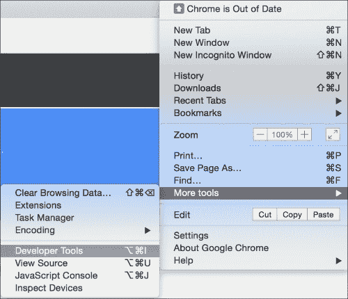

Chrome DevTools 在浏览器的下部面板中打开，并有一组非常有用的部分：

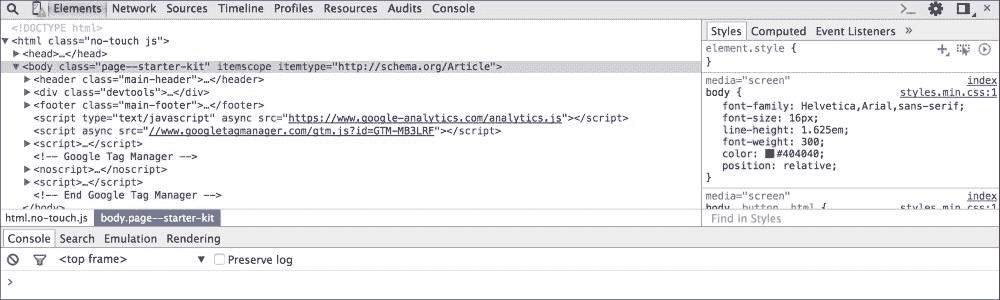

**元素**面板帮助你检查和监视每个组件的 DOM 树和相关样式表。

**网络**面板有助于了解网络活动。例如，你可以实时监视网络上下载的资源。

对我们来说最重要的面板是**源代码**面板。这个面板是显示 JavaScript 源代码和调试器的部分。让我们创建一个带有以下内容的示例 HTML：

```js
<!DOCTYPE html>
<html>
<head>
  <meta charset="utf-8">
  <title>This test</title>
  <script type="text/javascript">
  function engageGear(gear){
    if(gear==="R"){ console.log ("Reversing");}
    if(gear==="D"){ console.log ("Driving");}
    if(gear==="N"){ console.log ("Neutral/Parking");}
    throw new Error("Invalid Gear State");
  }
  try
  {
    engageGear("R");  //Reversing
    engageGear("P");  //Invalid Gear State
  }
  catch(e){
    console.log(e.message);
  }
  </script>
</head>
<body>
</body>
</html>
```

保存这个 HTML 文件并在 Google Chrome 中打开它。在浏览器中打开 DevTools，你会看到以下屏幕：

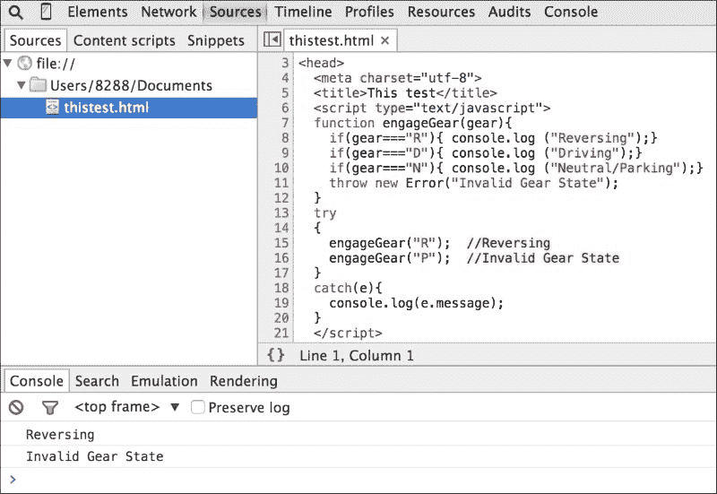

这是**源代码**面板的视图。你可以在这个面板中看到 HTML 和嵌入的 JavaScript 源代码。你也可以看到控制台窗口。你可以看到文件被执行并在**控制台**中显示输出。

在右侧，你会看到调试器窗口：

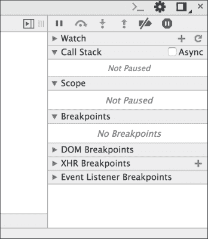

在**源代码**面板中，点击行号**8**和**15**来添加断点。断点允许你在指定的点停止脚本的执行：

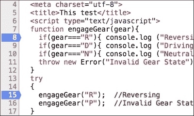

在调试面板中，你可以看到所有现有的断点：

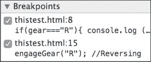

现在，当你再次运行同一页面时，你会看到执行停留在调试点。在调试阶段注入代码是一个非常实用的技术。当调试器正在运行时，你可以添加代码以帮助你更好地理解代码的状态：

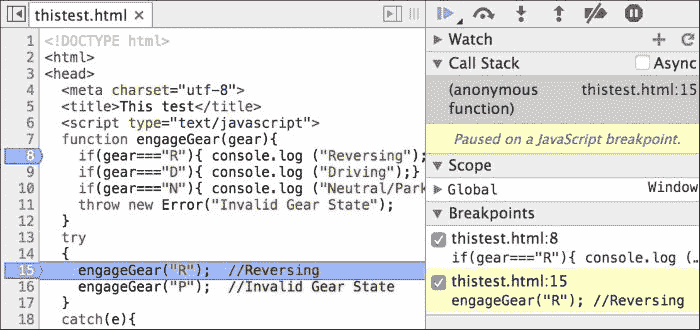

这个窗口现在有所有的动作。你可以看到执行停在**15**行。在调试窗口中，你可以看到哪个断点被触发。你也可以看到**调用栈**。你有几种方法可以继续执行。调试命令窗口有一组动作：


你可以通过点击按钮来继续执行（这将执行到下一个断点），当你这样做时，执行会继续直到遇到下一个断点。在我们的案例中，我们在第**8**行暂停：

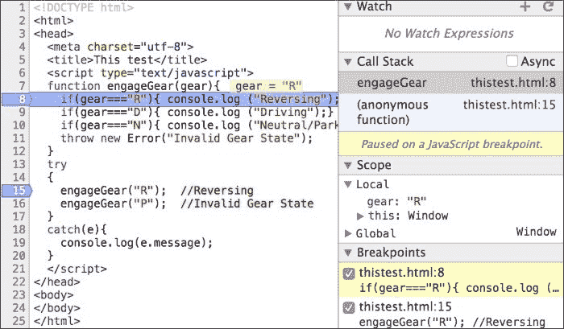

你可以观察到**调用栈**窗口显示了我们如何到达第**8**行。**作用域**面板显示了**局部**作用域，你可以看到在到达断点时的作用域中的变量。你还可以步入或跳过下一个函数。

使用 Chrome DevTools 还有其他非常实用的机制来调试和分析你的代码。我建议你去尝试这个工具，并使其成为你常规开发流程的一部分。

# 摘要

测试和调试阶段对于开发健壮的 JavaScript 代码都至关重要。TDD 和 BDD 是与敏捷方法论紧密相关的方法，并被 JavaScript 开发者社区广泛采用。在本章中，我们回顾了围绕 TDD 的最佳实践以及使用 Jasmine 作为测试框架的方法。我们看到了使用 Chrome DevTools 进行各种 JavaScript 调试的方法。在下一章中，我们将探索 ES6、DOM 操作和跨浏览器策略这个新奇的世界。
