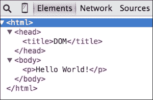
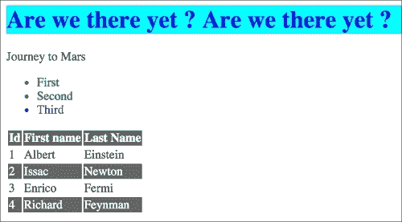
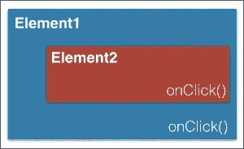

# 第八章：DOM 操作与事件

javascript 存在最重要的原因就是网络。JavaScript 是网络的语言，浏览器就是 JavaScript 存在的理由。JavaScript 为原本静态的网页赋予了动态性。在本章中，我们将深入探讨浏览器与语言之间的关系。我们将了解 JavaScript 与网页组件进行交互的方式。我们将查看**文档对象模型**（**DOM**）和 JavaScript 事件模型。

# DOM

在本章中，我们将探讨 JavaScript 与浏览器和 HTML 的各种方面。HTML，我相信您已经知道，是用于定义网页的标记语言。存在各种形式的标记用于不同的用途。流行的标记有**可扩展标记语言**（**XML**）和**标准通用标记语言**（**SGML**）。除了这些通用的标记语言之外，还有针对特定目的非常具体的标记语言，例如文本处理和图像元信息。**超文本标记语言**（**HTML**）是定义网页表示语义的标准标记语言。网页本质上是一个文档。DOM 为您提供了这个文档的表示。DOM 还为您提供了存储和操纵这个文档的手段。DOM 是 HTML 的编程接口，并允许使用脚本语言（如 JavaScript）进行结构操作。DOM 为文档提供了结构表示。该结构由节点和对象组成。节点有属性和方法，您可以对这些属性和方法进行操作以操纵节点本身。DOM 只是一个表示，并不是一个编程结构。DOM 作为 DOM 处理语言（如 JavaScript）的模型。

## 访问 DOM 元素

大多数时候，你将会想要访问 DOM 元素以检查它们的值，或者处理这些值以进行某些业务逻辑。我们将详细查看这个特定的用例。让我们创建一个带有以下内容的示例 HTML 文件：

```js
<html>
<head>
  <title>DOM</title> 
</head>
<body>
  <p>Hello World!</p>
</body>
</html>
```

您可以将此文件保存为`sample_dom.html`；当您在 Google Chrome 浏览器中打开此文件时，您将看到显示**Hello World**文本的网页。现在，打开 Google Chrome 开发者工具，通过转到选项 | **更多工具** | **开发者工具**（此路径可能因您的操作系统和浏览器版本而异）。在**开发者工具**窗口中，您将看到 DOM 结构：



接下来，我们将向这个 HTML 页面中插入一些 JavaScript。当网页加载时，我们将调用 JavaScript 函数。为此，我们将调用`window.onload`上的一个函数。您可以将您的脚本放在`<script>`标签下，该标签位于`<head>`标签下。您的页面应如下所示：

```js
<html>
  <head>
    <title>DOM</title>
    <script>
      // run this function when the document is loaded
      window.onload = function() {
        var doc = document.documentElement;
        var body = doc.body;
        var _head = doc.firstChild;
        var _body = doc.lastChild;
        var _head_ = doc.childNodes[0];
        var title = _head.firstChild;
        alert(_head.parentNode === doc); //true
      }
    </script>
  </head>
  <body>
    <p>Hello World!</p>
  </body>
</html>
```

匿名函数在浏览器加载页面时执行。在函数中，我们获取 DOM 节点的程序化方式。整个 HTML 文档可以通过`document.documentElement`函数访问。我们将文档存储在一个变量中。一旦访问了文档，我们就可以使用文档的几个辅助属性来遍历节点。我们使用`doc.body`访问`<body>`元素。可以通过`childNodes`数组遍历元素的子节点。节点的第一个和最后一个子节点可以通过额外的属性——`firstChild`和`lastChild`来访问。

### 注意

不建议在`<head>`标签中使用阻塞渲染的 JavaScript。这会显著减慢页面渲染速度。现代浏览器支持`async`和`defer`属性，以指示浏览器在下载脚本的同时可以继续渲染。你可以在`<head>`标签中使用这些标签，而不用担心性能下降。你可以在[`stackoverflow.com/questions/436411/where-is-the-best-place-to-put-script-tags-in-html-markup`](http://stackoverflow.com/questions/436411/where-is-the-best-place-to-put-script-tags-in-html-markup)获取更多信息。

## 访问特定节点

核心 DOM 定义了`getElementsByTagName()`方法，返回所有`tagName`属性等于特定值的元素对象`NodeList`。以下代码行返回一个文档中所有`<p>`元素的列表：

```js
var paragraphs = document.getElementsByTagName('p');
```

HTML DOM 定义了`getElementsByName()`方法来获取所有名称属性设置为特定值的元素。考虑以下片段：

```js
<html>
  <head>
    <title>DOM</title>
    <script>
 showFeelings = function() {
 var feelings = document.getElementsByName("feeling");
 alert(feelings[0].getAttribute("value"));
 alert(feelings[1].getAttribute("value"));
 }
    </script>
  </head>
  <body>
    <p>Hello World!</p>
    <form method="post" action="/post">
      <fieldset>
        <p>How are you feeling today?</p>
        <input type="radio" name="feeling" value="Happy" /> Happy<br />
        <input type="radio" name="feeling" value="Sad" />Sad<br />
      </fieldset>
      <input type="button" value="Submit" onClick="showFeelings()"/>
    </form>
  </body>
</html>
```

在这个例子中，我们创建了一组单选按钮，其`name`属性定义为`feeling`。在`showFeelings`函数中，我们获取所有`name`属性设置为`feeling`的元素，并对这些元素进行遍历。

HTML DOM 还定义了`getElementById()`方法。这是一个非常实用的方法，用于访问特定元素。该方法基于与元素相关联的`id`属性进行查找。`id`属性对每个元素都是唯一的，因此这种查找非常快速，应优先于`getElementsByName()`方法。然而，你应该注意到浏览器不保证`id`属性的唯一性。在以下示例中，我们使用 ID 访问一个特定元素。元素 ID 相对于标签或名称属性来说是唯一的：

```js
<html>
  <head>
    <title>DOM</title>
    <script>
      window.onload= function() {
 var greeting = document.getElementById("greeting");
 alert(greeting.innerHTML); //shows "Hello World" alert
      }
    </script>
  </head>
  <body>
    <p id="greeting">Hello World!</p>
    <p id="identify">Earthlings</p>
  </body>
</html>
```

迄今为止，我们讨论的是 DOM 遍历的基本知识。当 DOM 变得复杂且需要在 DOM 上进行复杂操作时，这些遍历和访问函数似乎有限。有了这些基本知识，是时候介绍一个用于 DOM 遍历（以及其他功能）的出色库——jQuery。

jQuery 是一个轻量级库，旨在使常见的浏览器操作更加容易。纯 JavaScript 中进行诸如 DOM 遍历和操作、事件处理、动画和 Ajax 等常见操作可能会很繁琐。jQuery 提供了易于使用且更短的助手机制，帮助你轻松快速地开发这些常见操作。jQuery 是一个功能丰富的库，但就本章而言，我们将主要关注 DOM 操作和事件。

你可以通过从**内容分发网络**（**CDN**）直接添加脚本来将 jQuery 添加到你的 HTML 中，或者手动下载文件并将其添加到脚本标签中。以下示例将指导你如何从谷歌的 CDN 下载 jQuery：

```js
<html>
  <head>
    <script src="img/jquery.min.js"></script>
  </head>
  <body>
  </body>
</html>
```

使用 CDN 下载的优势在于，谷歌的 CDN 会自动为你找到最近的下载服务器，并保持对 jQuery 库的更新稳定副本。如果你希望下载并手动托管 jQuery 以及你的网站，你可以按照以下方式添加脚本：

```js
<script src="img/jquery.js"></script>
```

在这个例子中，jQuery 库是在`lib`目录中手动下载的。在 HTML 页面中设置 jQuery 后，让我们探索操纵 DOM 元素的方法。考虑以下示例：

```js
<html>
  <head>
    <script src="img/jquery.min.js"></script>
    <script>
 $(document).ready(function() {
 $('#greeting').html('Hello World Martian');
 });
  </script>
  </head>
  <body>
    <p id="greeting">Hello World Earthling ! </p>
  </body>
</html>
```

在将 jQuery 添加到 HTML 页面后，我们编写自定义 JavaScript，选择具有`greeting` ID 的元素并更改其值。`$()`内的奇怪代码是 jQuery 在起作用。如果你阅读 jQuery 源代码（并且你应该阅读，它非常出色）你会看到最后一行：

```js
// Expose jQuery to the global object
window.jQuery = window.$ = jQuery;
```

`$`只是一个函数。它是调用名为 jQuery 的函数的别名。`$`是一种语法糖，使代码更加简洁。实际上，你可以交替使用`$`和`jQuery`。例如，`$('#greeting').html('Hello World Martian');`和`jQuery('#greeting').html('Hello World Martian');`是相同的。

在页面完全加载之前不能使用 jQuery。因为 jQuery 需要知道 DOM 结构的的所有节点，整个 DOM 必须保存在内存中。为了确保页面完全加载并处于可以被操纵的状态，我们可以使用`$(document).ready()`函数。在这里，IIFE 仅在整个文档*准备就绪*后执行：

```js
$(document).ready(function() {
  $('#greeting').html('Hello World Martian');
});
```

```js
.ready() function. This function will be executed once the document is ready. We are using $(document) to create a jQuery object from our page's document. We are calling the .ready() function on the jQuery object and passing it the function that we want to execute.
```

在使用 jQuery 时，这是一个非常常见的行为——以至于它有自己的快捷方式。你可以用一个短的`$()`调用替换整个`ready()`调用：

```js
$(function() {
  $('#greeting').html('Hello World Martian');
});
```

jQuery 中最重要的函数是`$()`。这个函数通常接受一个 CSS 选择器作为其唯一参数，并返回一个指向页面相应元素的新 jQuery 对象。三种主要的选择器是标签名、ID 和类。它们可以单独使用，也可以与其他元素组合使用。以下简单示例展示了这三种选择器在代码中的表现形式：

| **选择器** | CSS 选择器 | jQuery 选择器 | 选择器的输出 |
| --- | --- | --- | --- |
| **标签** | `p{}` | `$('p')` | 这选择了文档中的所有`p`标签。 |
| **ID** | `#div_1` | `$('#div_1')` | 这选择具有`div_1` ID 的单个元素。用来标识 ID 的符号是`#`。 |
| **类** | `.bold_fonts` | `$('.bold_fonts')` | 这选择文档中具有`bold_fonts` CSS 类的所有元素。用来标识类匹配的符号是"`.`"。 |

jQuery 工作在 CSS 选择器上。

### 注意

由于 CSS 选择器超出了本书的范围，我建议你前往[`www.w3.org/TR/CSS2/selector.html`](http://www.w3.org/TR/CSS2/selector.html)以了解这个概念。

我们假设你对 HTML 标签和语法也很熟悉。以下示例涵盖了 jQuery 选择器的基本工作原理：

```js
<html>
  <head>
    <script src="img/jquery.min.js"></script>
    <script>
 $(function() {
 $('h1').html(function(index, oldHTML){
 return oldHTML + "Finally?";
 });
 $('h1').addClass('highlight-blue');
 $('#header > h1 ').css('background-color', 'cyan');
 $('ul li:not(.highlight-blue)').addClass('highlight-green');
 $('tr:nth-child(odd)').addClass('zebra');
 });
    </script>
    <style>
      .highlight-blue {
        color: blue;
      }
      .highlight-green{
        color: green;
      }
      .zebra{
        background-color: #666666;
        color: white;
      }
    </style>
  </head>
  <body>
    <div id=header>
      <h1>Are we there yet ? </h1>
      <span class="highlight">
        <p>Journey to Mars</p>
        <ul>
          <li>First</li>
          <li>Second</li>
          <li class="highlight-blue">Third</li>
        </ul>
      </span>
      <table>
        <tr><th>Id</th><th>First name</th><th>Last Name</th></tr>
        <tr><td>1</td><td>Albert</td><td>Einstein</td></tr>
        <tr><td>2</td><td>Issac</td><td>Newton</td></tr>
        <tr><td>3</td><td>Enrico</td><td>Fermi</td></tr>
        <tr><td>4</td><td>Richard</td><td>Feynman</td></tr>
      </table>
    </div>
  </body>
</html>
```

在这个例子中，我们使用选择器在 HTML 页面上选择几个 DOM 元素。我们有一个文本为`Are we there yet ?`的 H1 头部；当页面加载时，我们的 jQuery 脚本访问所有的 H1 头部并将文本`Finally?`附加到它们：

```js
$('h1').html(function(index, oldHTML){
  return oldHTML + "Finally ?";
});
```

`$.html()`函数设置目标元素的 HTML——在这个例子中是一个 H1 头部。此外，我们选择所有的 H1 头部并为它们应用一个特定的 CSS 样式类，`highlight-blue`。`$('h1').addClass('highlight-blue')`语句选择所有的 H1 头部，并使用`$.addClass(<CSS 类>)`方法为使用选择器选择的所有的元素应用一个 CSS 类。

我们使用子组合符（`>`）和`$.css()`函数自定义 CSS 样式。实际上，`$()`函数中的选择器是在说：“找到每个`h1`头部元素（`#header`的子元素）。” 对每个这样的元素，我们应用一个自定义的 CSS。下一个用法是有趣的。考虑以下行：

```js
$('ul li:not(.highlight-blue)').addClass('highlight-green');

```

我们选择“对所有未应用`highlight-blue`类的`li`列表元素，应用`highlight-green` CSS 类。最后一行—`$('tr:nth-child(odd)').addClass('zebra')`—可以解释为：从所有表格行（`tr`）中，对每一行，应用`zebra` CSS 样式。第*n*个孩子选择器是 jQuery 提供的自定义选择器。最终输出类似于以下内容（虽然它展示了几个 jQuery 选择器类型，但非常清晰地表明了，了解 jQuery 并不是设计糟糕的替代品。）：



一旦你做出了一个选择，你可以在选定的元素上调用两种广泛的方法。这些方法是**获取器**和**设置器**。获取器从选择集中检索信息，设置器以某种方式更改选择集。

获取器通常只对选择集中的第一个元素进行操作，而设置器则对选择集中的所有元素进行操作。设置器通过隐式迭代来自动遍历选择集中的所有元素。

例如，我们想要给页面上的所有列表项应用一个 CSS 类。当我们对选择器调用 `addClass` 方法时，它自动应用于这个特定选择的所有元素。这就是隐式迭代在行动：

```js
$( 'li' ).addClass( highlighted' );
```

然而，有时你只是不想通过隐式迭代来遍历所有元素。你可能只想选择性地修改几个元素。你可以使用 `.each()` 方法显式地遍历元素。在以下代码中，我们选择性地处理元素并使用元素的 `index` 属性：

```js
$( 'li' ).each(function( index, element ) {
  if(index % 2 == 0)
    $(elem).prepend( '<b>' + STATUS + '</b>' );
});
```

# 链式操作

链式 jQuery 方法允许你在选择上调用一系列方法，而无需临时存储中间值。这是可能的，因为我们所调用的每个设置器方法都会返回它被调用的选择。这是一个非常强大的特性，你将会看到许多专业库在使用它。考虑以下示例：

```js
$( '#button_submit' )
  .click(function() {
    $( this ).addClass( 'submit_clicked' );
  })
  .find( '#notification' )
    .attr( 'title', 'Message Sent' );x
```

```js
click(), find(), and attr() methods on a selector. Here, the click() method is executed, and once the execution finishes, the find() method locates the element with the notification ID and changes its title attribute to a string.
```

# 遍历和操作

我们讨论了使用 jQuery 进行元素选择的各种方法。我们在本节中将讨论使用 jQuery 进行 DOM 遍历和操作的几个方法。这些任务如果使用原生的 DOM 操作来实现将会相当繁琐。jQuery 使它们变得直观和优雅。

在我们深入这些方法之前，让我们先熟悉一些我们接下来会使用的 HTML 术语。考虑以下 HTML：

```js
<ul> <-This is the parent of both 'li' and ancestor of everything in 
  <li> <-The first (li) is a child of the (ul)
    <span>  <-this is the descendent of the 'ul'
      <i>Hello</i>
    </span>
  </li>
  <li>World</li> <-both 'li' are siblings
</ul>
```

使用 jQuery 遍历方法，我们选择第一个元素并相对于这个元素遍历 DOM。在遍历 DOM 的过程中，我们改变了原始选择，我们或者是用新的选择替换原始选择，或者是修改原始选择。

例如，你可以过滤现有的选择，只包括符合某些标准的元素。考虑这个例子：

```js
var list = $( 'li' ); //select all list elements
// filter items that has a class 'highlight' associated
var highlighted = list.filter( '.highlight );
// filter items that doesn't have class 'highlight' associated 
var not_highlighted = list.not( '.highlight );
```

jQuery 允许你给元素添加和移除类。如果你想要切换元素的类值，你可以使用 `toggleClass()` 方法：

```js
$( '#usename' ).addClass( 'hidden' );
$( '#usename' ).removeClass( 'hidden' );
$( '#usename' ).toggleClass( 'hidden' );
```

大多数时候，你可能想更改元素的值。你可以使用 `val()` 方法来更改元素值的形式。例如，以下行更改了表单中所有 `text` 类型输入的值：

```js
$( 'input[type="text"]' ).val( 'Enter usename:' );
```

要修改元素属性，你可以如下使用 `attr()` 方法：

```js
$('a').attr( 'title', 'Click' );
```

jQuery 在 DOM 操作方面具有 incredible 的功能深度——本书的范围限制了对所有可能性的详细讨论。

# 处理浏览器事件

当你为浏览器开发时，你将不得不处理与它们相关的用户交互和事件，例如文本框中输入的文本、页面的滚动、鼠标按键按下等。当用户在页面上做些什么时，一个事件就会发生。有些事件不是由用户交互触发的，例如，`load` 事件不需要用户输入。

当你在浏览器中处理鼠标或键盘事件时，你无法预测这些事件何时以及以何种顺序发生。你必须不断寻找按键或鼠标移动事件的发生。这就像运行一个无尽的后台循环，监听某个键或鼠标事件的发生。在传统编程中，这被称为轮询。有许多变体，其中等待线程通过队列进行优化；然而，轮询通常仍然不是一个好主意。

浏览器提供了一种比轮询更好的替代方案。浏览器为您提供了在事件发生时做出反应的程序化手段。这些钩子通常称为监听器。您可以注册一个监听器，用于在特定事件发生时执行关联的回调函数。请参考这个例子：

```js
<script> 
  addEventListener("click", function() { 
    ... 
  }); 
</script>
```

`addEventListener` 函数将其第二个参数注册为回调函数。当第一个参数指定的事件触发时，执行此回调。

刚才我们看到的是一个通用的 `click` 事件监听器。同样，每个 DOM 元素都有自己的 `addEventListener` 方法，允许你在这个元素上特别监听：

```js
<button>Submit</button> 
<p>No handler here.</p> 
<script> 
  var button = document.getElementById("#Bigbutton");
  button.addEventListener("click", function() {
    console.log("Button clicked."); 
  }); 
</script>
```

在这个示例中，我们通过调用 `getElementById()` 使用特定元素的引用——一个具有 `Bigbutton` ID 的按钮。在按钮元素的引用上，我们调用 `addEventListener()` 为点击事件分配一个处理函数。在 Mozilla Firefox 或 Google Chrome 等现代浏览器中，这段代码完全合法且运行良好。然而，在 IE9 之前的 Internet Explorer 中，这段代码是无效的。这是因为微软在 Internet Explorer 9 之前实现了自己的自定义 `attachEvent()` 方法，而不是 W3C 标准的 `addEventListener()`。这非常不幸，因为你将不得不编写非常糟糕的快捷方式来处理浏览器特定的怪癖。

# 传播

在这个时候，我们应该问一个重要的问题——如果一个元素和它的一个祖先元素都有同一个事件处理程序，哪个处理程序将首先被触发？请参考以下图形：



例如，我们有一个 **Element2** 作为 **Element1** 的子元素，两者都具有 `onClick` 处理程序。当用户点击 Element2 时，Element2 和 Element1 的 `onClick` 都会被触发，但问题是哪个先被触发。事件顺序应该是怎样的？嗯，不幸的是，答案完全取决于浏览器。当浏览器首次出现时，自然会从 Netscape 和 Microsoft 出现两种观点。

Netscape 决定首先触发的是 Element1 的 `onClick` 事件。这种事件排序被称为事件捕获。

Microsoft 决定首先触发的是 Element2 的 `onClick` 事件。这种事件排序被称为事件冒泡。

这两种方法完全代表了浏览器处理事件的两种相反观点和实现。为了结束这种疯狂，**万维网联盟**（**W3C**）决定采取明智的中庸之道。在这个模型中，事件首先被捕获，直到它到达目标元素，然后再次冒泡。在这个标准行为中，你可以选择在哪个阶段注册你的事件处理程序——捕获阶段或冒泡阶段。如果在`addEventListener()`中的最后一个参数为 true，则事件处理程序设置为捕获阶段，如果为 false，则事件处理程序设置为冒泡阶段。

有时，如果你已经通过子元素触发了事件，你不想让父元素也触发事件。你可以在事件对象上调用`stopPropagation()`方法，以防止更高层次的处理程序接收事件。一些事件与它们关联的默认动作。例如，如果你点击一个 URL 链接，你会被带到链接的目标。在默认行为执行之前调用 JavaScript 事件处理程序。你可以在事件对象上调用`preventDefault()`方法，以阻止默认行为的触发。

当你在浏览器上使用纯 JavaScript 时，这些都是事件基础。这里有一个问题。浏览器在定义事件处理行为方面臭名昭著。我们将看看 jQuery 的事件处理。为了使管理更加容易，jQuery 总是为模型的冒泡阶段注册事件处理程序。这意味着最具体的元素将首先有机会对任何事件做出响应。

# jQuery 事件处理和传播

jQuery 事件处理可以解决浏览器许多怪癖。你可以专注于编写在大多数受支持的浏览器上运行的代码。jQuery 对浏览器事件的支持简单直观。例如，这段代码监听用户点击页面上的任何按钮元素：

```js
$('button').click(function(event) {
  console.log('Mouse button clicked');
});
```

就像`click()`方法一样，还有几个其他助手方法来涵盖几乎所有类型的浏览器事件。以下助手方法存在：

+   `blur`

+   `change`

+   `click`

+   `dblclick`

+   `error`

+   `focus`

+   `keydown`

+   `keypress`

+   `keyup`

+   `load`

+   `mousedown`

+   `mousemove`

+   `mouseout`

+   `mouseover`

+   `mouseup`

+   `resize`

+   `scroll`

+   `select`

+   `submit`

+   `unload`

另外，你可以使用`.on()`方法。使用`.on()`方法有几个优点，因为它为你提供了更多的灵活性。`.on()`方法允许你将处理程序绑定到多个事件。使用`.on()`方法，你也可以处理自定义事件。

事件名称作为`on()`方法的第一个参数传递，就像我们看到的其它方法一样：

```js
$('button').on( 'click', function( event ) {
  console.log(' Mouse button clicked');
});
```

一旦你向元素注册了一个事件处理程序，你可以按照以下方式触发这个事件：

```js
$('button').trigger( 'click' );
```

这个事件也可以按照以下方式触发：

```js
$('button').click();
```

你可以使用 jQuery 的`.off()`方法解除事件绑定。这将移除绑定到指定事件的任何事件处理程序：

```js
$('button').off( 'click' );
```

你可以向元素添加多个处理程序：

```js
$("#element")   
.on("click", firstHandler) 
.on("click", secondHandler);
```

当事件被触发时，两个处理器都会被调用。如果你只想删除第一个处理器，你可以使用带有第二个参数的`off()`方法，该参数指明你想删除的处理器：

```js
$("#element).off("click",firstHandler);
```

如果你有处理器的引用，这是可能的。如果你使用匿名函数作为处理器，你不能获取对它们的引用。在这种情况下，你可以使用命名空间事件。考虑以下示例：

```js
$("#element").on("click.firstclick",function() { 
  console.log("first click");
});
```

现在你已经为元素注册了一个命名空间事件处理器，你可以按照以下方式删除它：

```js
$("#element).off("click.firstclick");
```

使用`.on()`的一个主要优点是，你可以一次绑定多个事件。`.on()`方法允许你通过空格分隔的字符串传递多个事件。考虑以下示例：

```js
$('#inputBoxUserName').on('focus blur', function() {
  console.log( Handling Focus or blur event' );
});
```

你可以为多个事件添加多个事件处理器如下：

```js
$( "#heading" ).on({
  mouseenter: function() {
    console.log( "mouse entered on heading" );
  },
  mouseleave: function() {
    console.log( "mouse left heading" );
  },
  click: function() {
    console.log( "clicked on heading" );
  }
});
```

截至 jQuery 1.7，所有事件都是通过`on()`方法绑定的，即使你调用如`click()`的帮助方法。内部地，jQuery 将这些调用映射到`on()`方法。因此，通常建议使用`on()`方法以保持一致性和更快的执行。

# 事件委托

事件委托允许我们将一个事件监听器附加到父元素上。这个事件将会为所有匹配选择器的后代元素触发，即使这些后代元素是在监听器绑定后创建的（将来创建）。

我们之前讨论了*事件冒泡*。jQuery 中的事件委托主要归功于事件冒泡。每当页面上的事件发生时，事件会从它起源的元素开始冒泡，一直冒泡到它的父元素，然后冒泡到父元素的父元素，依此类推，直到它达到根元素（`window`）。考虑以下示例：

```js
<html>
  <body>
    <div id="container">
      <ul id="list">
        <li><a href="http://google.com">Google</a></li>
        <li><a href="http://myntra.com">Myntra</a></li>
        <li><a href="http://bing.com">Bing</a></li>
      </ul>
    </div>
  </body>
</html>
```

现在假设我们想要对任何 URL 的点击执行一些常见操作。我们可以如下向列表中的所有`a`元素添加事件处理器：

```js
$( "#list a" ).on( "click", function( event ) {
  console.log( $( this ).text() );
});
```

这完全没问题，但这段代码有一个小错误。如果由于某些动态操作在列表中添加了一个额外的 URL 会发生什么？比如说，我们有一个**添加**按钮，它将新的 URL 添加到这个列表中。所以，如果新列表项是通过一个新的 URL 添加的，那么早先的事件处理器将不会附加到它。例如，如果以下链接动态地添加到列表中，点击它将不会触发我们刚刚添加的处理器：

```js
<li><a href="http://yahoo.com">Yahoo</a></li>
```

这是因为这样的事件只有在调用`on()`方法时才注册。在这种情况下，由于这个新元素在调用`.on()`时不存在，所以它不会获得事件处理器。根据我们对事件冒泡的理解，我们可以想象事件将如何在 DOM 树中向上传播。当点击任何一个 URL 时，传播将如下进行：

```js
a(click)->li->ul#list->div#container->body->html->root
```

我们可以如下创建一个委托事件：

```js
$( "#list" ).on( "click", "a", function( event ) {
  console.log( $( this ).text() );
});
```

我们把`a`从原来的选择器移动到了`on()`方法的第二个参数。`on()`方法的第二个参数使得处理程序监听这个特定的事件，并检查触发元素是否为第二个参数（在我们这个案例中的`a`）。由于第二个参数匹配，处理函数将被执行。通过这种委派事件，我们为整个`ul#list`添加了一个处理程序。这个处理程序将监听`ul`元素的任何后代元素触发的点击事件。

# 事件对象

到目前为止，我们为匿名函数添加了事件处理程序。为了使我们的事件处理程序更具通用性和可用性，我们可以创建命名函数并将它们分配给事件。考虑以下几行：

```js
function handlesClicks(event){
  //Handle click event
}
$("#bigButton").on('click', handlesClicks);
```

这里，我们传递了一个命名函数而不是一个匿名函数给`on()`方法。现在让我们将注意力转移到我们传递给函数的`event`参数。jQuery 为所有事件回调传递了一个事件对象。事件对象包含了有关触发的事件的非常有用的信息。在不想让元素的默认行为发生的情况下，我们可以使用事件对象上的`preventDefault()`方法。例如，我们希望在提交完整表单之前发起一个 AJAX 请求，或者在点击 URL 锚点时阻止默认位置的打开。在这些情况下，您可能还希望阻止事件在 DOM 上冒泡。您可以通过调用事件对象的`stopPropagation()`方法来停止事件传播。考虑以下示例：

```js
$( "#loginform" ).on( "submit", function( event ) { 
  // Prevent the form's default submission.
  event.preventDefault();
  // Prevent event from bubbling up DOM tree, also stops any delegation
  event.stopPropagation();
});
```

除了事件对象，您还可以获得一个对触发事件的 DOM 对象的引用。这个元素可以通过`$(this)`来引用。考虑以下示例：

```js
$( "a" ).click(function( event ) {
  var anchor = $( this );
  if ( anchor.attr( "href" ).match( "google" ) ) {
    event.preventDefault();
  }
});
```

# 摘要

本章主要讲解的是 JavaScript 在其最重要的角色——浏览器语言中的使用。JavaScript 通过在浏览器上实现 DOM 操作和事件管理，引入了网页的动态性。我们讨论了有无 jQuery 的情况下这两种概念。随着现代网页需求的增加，使用如 jQuery 的库变得至关重要。这些库能显著提高代码质量和效率，同时让你有更多的自由去关注重要的事情。

我们将关注 JavaScript 的另一种化身——主要是服务器端。Node.js 已经成为一个流行的 JavaScript 框架，用于编写可扩展的服务器端应用程序。我们将详细探讨如何最佳地利用 Node.js 进行服务器应用程序的开发。
