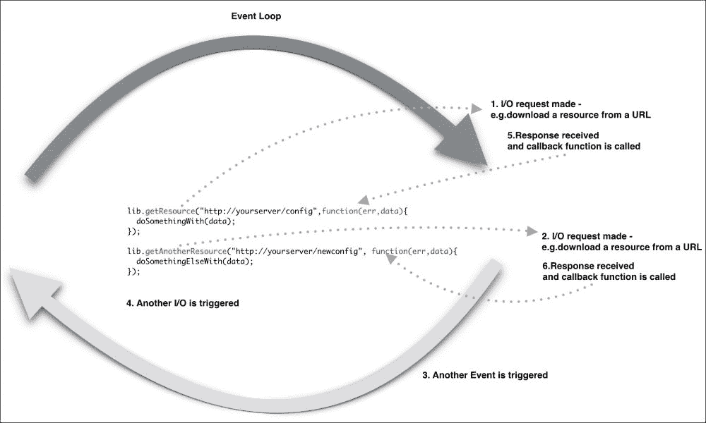
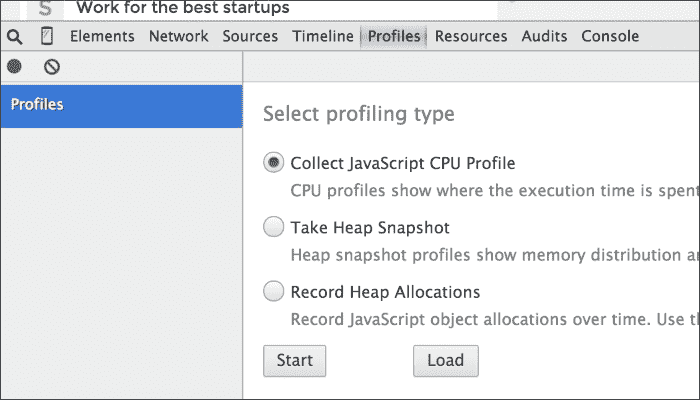
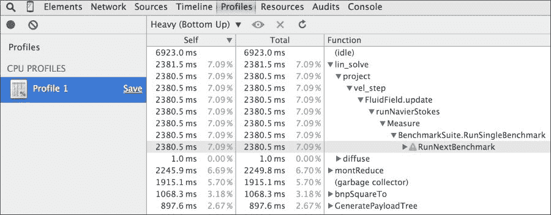
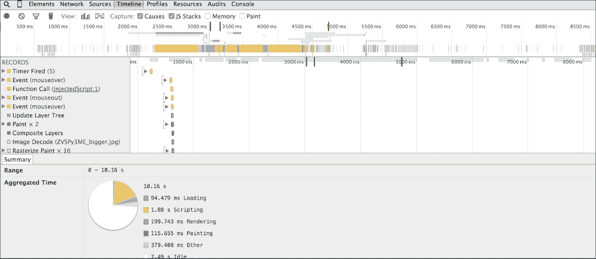
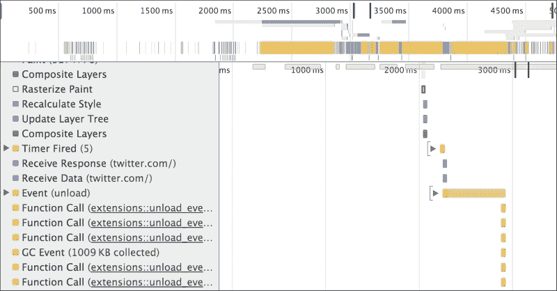
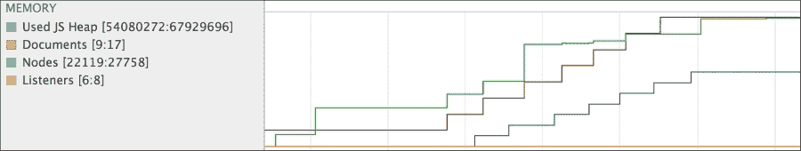

# 第九章．服务器端 JavaScript

到目前为止，我们一直在关注 JavaScript 作为浏览器语言的多样性。考虑到 JavaScript 已经作为一种可编程可扩展服务器系统的语言获得了显著的流行，这充分说明了这种语言的辉煌。在本章中，我们将介绍 Node.js。Node.js 是最受欢迎的 JavaScript 框架之一，用于服务器端编程。Node.js 也是 GitHub 上最受关注的项目之一，并且拥有非常出色的社区支持。

Node.js 使用 V8，这是为 Google Chrome 提供动力的虚拟机，来进行服务器端编程。V8 给 Node.js 带来了巨大的性能提升，因为它直接将 JavaScript 编译成本地机器代码，而不是执行字节码或使用解释器作为中间件。

V8 和 JavaScript 的多样性是一种美好的组合——性能、覆盖面以及 JavaScript 的整体流行度使得 Node.js 一夜之间取得了成功。在本章中，我们将涵盖以下主题：

+   浏览器和服务器端 Node.js 中的异步事件模型

+   回调

+   定时器

+   事件发射器

+   模块和 npm

# 浏览器中的异步事件模型

在我们尝试理解 Node.js 之前，让我们先来理解一下浏览器中的 JavaScript。

Node.js 依赖于事件驱动和异步的平台来进行服务器端 JavaScript 的编程。这与浏览器处理 JavaScript 的方式非常相似。当浏览器和 Node.js 在进行 I/O 操作时，都是事件驱动和非阻塞的。

为了更深入地了解 Node.js 的事件驱动和异步特性，让我们首先比较一下各种操作及其相关的成本：

| 从 L1 缓存读取 | 0.5 纳秒 |
| --- | --- |
| 从 L2 缓存读取 | 7 纳秒 |
| 读取 RAM | 100 纳秒 |
| 从 SSD 随机读取 4 KB | 150,000 纳秒 |
| 从 SSD 顺序读取 1 MB | 1,000,000 纳秒 |
| 从磁盘顺序读取 1 MB | 20,000,000 纳秒 |

这些数字来自[`gist.github.com/jboner/2841832`](https://gist.github.com/jboner/2841832)，展示了**输入/输出**（**I/O**）可能有多么昂贵。计算机程序中最耗时的操作就是 I/O 操作，如果程序一直在等待这些 I/O 操作完成，这些操作就会降低整个程序的执行效率。让我们来看一个这样的操作示例：

```js
console.log("1");
var log = fileSystemReader.read("./verybigfile.txt");
console.log("2");
```

当你调用`fileSystemReader.read()`时，你正在从文件系统中读取文件。正如我们刚才看到的，I/O 是这里的瓶颈，而且可能需要相当长的时间才能完成读取操作。根据硬件、文件系统、操作系统等不同，这个操作会很大程度上阻塞整个程序的执行。前面的代码执行了一些 I/O 操作，这是一个阻塞操作——进程将会一直阻塞，直到 I/O 操作完成并返回数据。这是传统的 I/O 模型，我们大多数人都很熟悉。然而，这种方法代价高昂，可能会导致可怕的延迟。每个进程都关联着内存和状态——在这两个方面，都会一直阻塞，直到 I/O 操作完成。

如果一个程序阻塞了 I/O，Node 服务器将拒绝新的请求。解决这个问题有几种方法。最传统的流行方法是使用多个线程来处理请求——这种技术被称为多线程。如果你熟悉像 Java 这样的语言，那么你很可能写过多线程代码。多种语言支持线程的不同形式——线程本质上保持自己的内存和状态。在大规模上编写多线程应用程序是困难的。当多个线程访问公共共享内存或值时，在这些线程之间维护正确的状态是非常困难的工作。线程在内存和 CPU 利用率方面也是昂贵的。用于同步资源的线程可能会最终被阻塞。

浏览器处理方式不同。浏览器中的 I/O 发生在主线程之外，当 I/O 完成时会发出一个事件。这个事件由与该事件关联的回调函数处理。这种 I/O 是非阻塞和异步的。因为 I/O 不阻塞主线程，所以浏览器可以继续处理其他事件，而无需等待任何 I/O。这是一个强大的想法。异步 I/O 允许浏览器响应多个事件，并实现高度的交互性。

Node 为异步处理使用了类似的想法。Node 的事件循环作为一个单线程运行。这意味着你编写的应用程序本质上是单线程的。这并不意味着 Node 本身是单线程的。Node 使用了**libuv**并且是多线程的——幸运的是，这些细节被隐藏在 Node 内部，你在开发应用程序时不需要了解它们。

每个涉及 I/O 调用的调用都需要你注册一个回调函数。注册回调函数也是异步的，并且会立即返回。一旦 I/O 操作完成，其回调函数就会被推送到事件循环中。当所有在其他事件循环中被推送到的事件回调执行完毕后，它才会被执行。所有的操作本质上都是线程安全的，这主要是因为事件循环中没有需要同步的并行执行路径。

本质上，只有一个线程在运行你的代码，并且没有并行执行；然而，除了你的代码之外的所有其他操作都是并行运行的。

Node.js 依赖于**libev**([`software.schmorp.de/pkg/libev.html`](http://software.schmorp.de/pkg/libev.html))来提供事件循环，并通过**libeio**([`software.schmorp.de/pkg/libeio.html`](http://software.schmorp.de/pkg/libeio.html))使用池化线程提供异步 I/O。要了解更多，请查看 libev 文档：[`pod.tst.eu/http://cvs.schmorp.de/libev/ev.pod`](http://pod.tst.eu/http://cvs.schmorp.de/libev/ev.pod)。

考虑以下 Node.js 中异步代码执行的示例：

```js
var fs = require('fs');
console.log('1');
fs.readFile('./response.json', function (error, data) {
  if(!error){
    console.log(data);
  });
console.log('2');
```

在这个程序中，我们从磁盘上读取`response.json`文件。当磁盘 I/O 完成后，回调函数会以包含任何错误发生的参数和文件数据的参数执行。你将在控制台看到的是`console.log('1')`和`console.log('2')`的输出连续出现：



Node.js 不需要任何额外的服务器组件，因为它创建了自己的服务器进程。Node 应用程序本质上是在指定端口上运行的服务器。在 Node 中，服务器和应用程序是相同的。

以下是一个 Node.js 服务器示例，当通过浏览器运行`http://localhost:3000/` URL 时，会返回**Hello Node**字符串：

```js
var http = require('http');
var server = http.createServer();
server.on('request', function (req, res) {
  res.writeHead(200, {'Content-Type': 'text/plain'});
  res.end('Hello Node\n');
});
server.listen(3000); 
```

在这个例子中，我们使用了一个`http`模块。如果你回想我们之前关于 JavaScript 模块的讨论，你就会意识到这是 CommonJS 模块的实现。Node 将几个模块编译到二进制文件中。核心模块在 Node 的源代码中定义。它们可以在`lib/`文件夹中找到。

如果传递了它们的标识符给`require()`，它们会首先被加载。例如，`require('http')`总是会返回内置的 HTTP 模块，即使存在同名的文件也是如此。

加载处理 HTTP 请求的模块后，我们创建一个`server`对象，并使用`server.on()`函数为`request`事件添加一个监听器。无论何时有请求到达端口`3000`上的此服务器，回调都会被调用。回调接收`request`和`response`参数。我们还在发送响应之前设置`Content-Type`头和 HTTP 响应代码。你可以复制上面的代码，将其保存为一个纯文本文件，并命名为`app.js`。你可以使用以下命令行节点 js 运行服务器：

```js
$ » node app.js
```

一旦服务器启动，你可以打开`http://localhost:3000` URL 在浏览器中，你会看到令人兴奋的文本：


如果你想要检查内部正在发生的事情，你可以发出如下`curl`命令：

```js
~ » curl -v http://localhost:3000 
* Rebuilt URL to: http://localhost:3000/
*   Trying ::1...
* Connected to localhost (::1) port 3000 (#0)
> GET / HTTP/1.1
> Host: localhost:3000
> User-Agent: curl/7.43.0
> Accept: */*
>
< HTTP/1.1 200 OK
< Content-Type: text/plain
< Date: Thu, 12 Nov 2015 05:31:44 GMT
< Connection: keep-alive
< Transfer-Encoding: chunked
<
Hello Node
* Connection #0 to host localhost left intact
```

Curl 显示了一个漂亮的请求（`>`）和响应（`<`）对话，包括请求和响应头。

# 回调

在 JavaScript 中的回调通常需要一段时间来适应。如果你来自其他一些非异步编程背景，你需要仔细理解回调是如何工作的；你可能会觉得你正在第一次学习编程。因为 Node 中一切都是异步的，所以你将不尝试仔细地结构它们而使用回调。Node.js 项目最重要的部分有时是代码组织和模块管理。

回调函数是在稍后异步执行的函数。而不是代码从上到下按程序顺序阅读，异步程序可能会根据早期函数（如 HTTP 请求或文件系统读取）的顺序和速度在不同时间执行不同的函数。

函数执行是顺序还是异步取决于它执行的上下文：

```js
var i=0;
function add(num){
  console.log(i);
  i=i+num;
}
add(100);
console.log(i);
```

如果你使用 Node 运行这个程序，你会看到以下输出（假设你的文件名为`app.js`）：

```js
~/Chapter9 » node app.js
0
100
```

我们都习惯了这种情况。这是传统的同步代码执行，每一行按顺序执行。这里的代码定义了一个函数，然后在下一行调用这个函数，而不等待任何东西。这是顺序控制流。

如果我们在这个序列中引入 I/O，情况将会不同。如果我们试图从文件中读取一些内容或调用远程端点，Node 将以异步方式执行这些操作。在下一个例子中，我们将使用一个名为`request`的 Node.js 模块。我们将使用这个模块来执行 HTTP 调用。你可以按照以下方式安装这个模块：

```js
npm install request
```

我们将在本章后面讨论 npm 的使用。考虑以下例子：

```js
var request = require('request');
var status = undefined;
request('http://google.com', function (error, response, body) {
  if (!error && response.statusCode == 200) {
    status_code = response.statusCode;
  }
});
console.log(status); 
```

当你执行这段代码时，你会看到`status`变量的值仍然是`undefined`。在这个例子中，我们正在执行一个 HTTP 调用——这是一个 I/O 操作。当我们进行 I/O 操作时，执行变得异步。在之前的例子中，我们在内存中完成所有事情，并且没有涉及 I/O，因此，执行是同步的。当我们运行这个程序时，所有函数都被立即定义，但它们并不都立即执行。`request()`函数被调用，执行继续到下一行。如果没有东西要执行，Node 将等待 I/O 完成，或者退出。当`request()`函数完成其工作时，它将执行回调函数（作为`request()`函数第二个参数的匿名函数）。我们在前面例子中得到`undefined`的原因是，在我们的代码中没有任何逻辑告诉`console.log()`语句等待`request()`函数从 HTTP 调用中获取响应。

回调函数是在稍后的时间执行的函数。这改变了你组织代码的方式。重新组织代码的想法如下：

+   将异步代码包裹在函数中

+   将回调函数传递给包装函数

我们将在考虑这两个想法的基础上组织我们之前的例子。考虑这个修改后的例子：

```js
var request = require('request');
var status = undefined;
function getSiteStatus(callback){
  request('http://google.com', function (error, response, body) {
    if (!error && response.statusCode == 200) {
      status_code = response.statusCode;
    }
    callback(status_code);
  });
}
function showStatusCode(status){
  console.log(status);
}
getSiteStatus(showStatusCode);
```

当你运行这个程序时，你会得到以下（正确）输出：

```js
$node app.js
200
```

我们所改变的是将异步代码包裹在`getSiteStatus()`函数中，将一个名为`callback()`的函数作为参数传递给这个函数，在`getSiteStatus()`的最后一行执行这个函数。`showStatusCode()`回调函数仅仅是围绕我们之前调用的`console.log()`。然而，异步执行的工作方式有所不同。在学习如何使用回调编程时，理解函数是一等对象，可以存储在变量中并以不同的名称传递是非常重要的。给你的变量取简单且描述性的名称，这对于让你的代码更容易被他人阅读很重要。现在，一旦 HTTP 调用完成，回调函数就会被调用，`status_code`变量的值将会有一个正确的值。在某些真实情况下，你可能希望一个异步任务在另一个异步任务完成后执行。考虑这个场景：

```js
http.createServer(function (req, res) {
  getURL(url, function (err, res) {
    getURLContent(res.data, function(err,res) {
      ...
    });
  });
});
```

正如你所看到的，我们在一个异步函数中嵌套另一个异步函数。这种嵌套可能导致代码难以阅读和管理。这种回调风格有时被称为**回调地狱**。为了避免这种情况，如果你有代码必须等待其他异步代码完成，那么你通过将你的代码放在作为回调传递的函数中来表达这种依赖关系。另一个重要的想法是给你的函数命名，而不是依赖匿名函数作为回调。我们可以将前面的示例重构为更易读的一个，如下所示：

```js
var urlContentProcessor = function(data){
  ...
}
var urlResponseProcessor = function(data){
  getURLContent(data,urlContentProcessor);
}
var createServer = function(req,res){
  getURL(url,urlResponseProcessor);
};
http.createServer(createServer);
```

这个片段使用了两个重要的概念。首先，我们使用了命名函数并将它们作为回调使用。其次，我们并没有嵌套这些异步函数。如果你在内部函数中访问闭包变量，之前的实现会有所不同。在这种情况下，使用内联匿名函数更是可取的。

回调在 Node 中最为常用。它们通常用于定义一次性响应的逻辑。当你需要对重复事件做出响应时，Node 提供了另一种机制。在进一步讲解之前，我们需要了解 Node 中的定时器和事件函数。

# 定时器

定时器用于在特定延迟后安排特定回调的执行。设置这种延迟执行有两种主要方法：`setTimeout`和`setInterval`。`setTimeout()`函数用于在延迟后安排特定回调的执行，而`setInterval`用于安排回调的重复执行。`setTimeout`函数适用于需要计划执行的任务，例如家务。考虑以下示例：

```js
setTimeout(function() {
  console.log("This is just one time delay");
},1000);
var count=0;
var t = setInterval(function() {
  count++;
  console.log(count);
  if (count> 5){
    clearInteval(t);
  }
}, 2000 );
```

首先，我们使用`setTimeout()`在 1,000 毫秒后执行回调（匿名函数）。这只是对这个回调的一次性计划。我们使用`setInterval()`来安排回调的重复执行。注意我们将`setInterval()`返回的值赋给变量`t`——我们可以在`clearInterval()`中使用这个引用来清除这个计划。

# 事件发射器

我们之前讨论过，回调对于执行一次性逻辑非常出色。**EventEmitter**在响应重复事件方面很有用。EventEmitter 触发事件，并在事件触发时处理这些事件。一些重要的 Node API 是基于 EventEmitter 构建的。

由 EventEmitter 引发的事件通过监听器处理。监听器是与事件关联的回调函数——当事件触发时，其关联的监听器也会被触发。`event.EventEmitter`是一个类，用于提供一致的接口来触发（触发）和绑定回调到事件。

作为一个常见的样式约定，事件名用驼峰命名法表示；然而，任何有效的字符串都可以作为事件名。

使用`require('events')`来访问`EventEmitter`类：

```js
var EventEmitter = require('events');
```

当 EventEmitter 实例遇到错误时，它会触发一个`error`事件。在 Node.js 中，错误事件被视为一个特殊案例。如果你不处理这些错误，程序将以异常堆栈退出。

所有 EventEmitter 在添加新监听器时都会触发`newListener`事件，并在移除监听器时触发`removeListener`。

为了理解 EventEmitter 的使用方法，我们将构建一个简化的 telnet 服务器，不同的客户端可以登录并输入某些命令。根据这些命令，我们的服务器将做出相应的响应：

```js
var _net = require('net');
var _events = require ('events');
var _emitter = new events.EventEmitter();
_emitter.on('join', function(id,caller){
  console.log(id+" - joined");
});
_emitter.on('quit', function(id,caller){
  console.log(id+" - left");
});

var _server = _net.createServer(function(caller) {
  var process_id = caller.remoteAddress + ':' + caller.remotePort;
  _emitter.emit('join',id,caller);
  caller.on('end', function() {
    console.log("disconnected");
    _emitter.emit('quit',id,caller);
  });
});
_server.listen(8124);
```

```js
net module from Node. The idea here is to create a server and let the client connect to it via a standard telnet command. When a client connects, the server displays the client address and port, and when the client quits, the server logs this too.
```

当一个客户端连接时，我们触发一个`join`事件，当客户端断开连接时，我们触发一个`quit`事件。我们对这两个事件都有监听器，它们在服务器上记录适当的消息。

你启动这个程序，并通过 telnet 连接到我们的服务器，如下所示：

```js
telnet 127.0.0.1 8124
```

在服务器控制台上，你会看到服务器记录哪个客户端加入了服务器：

```js
» node app.js
::ffff:127.0.0.1:51000 - joined
::ffff:127.0.0.1:51001 – joined
```

如果任何客户端退出会话，会出现一个适当的消息。

# 模块

当你写很多代码时，你很快就会达到一个需要开始思考如何组织代码的点。Node 模块是我们在讨论模块模式时提到的 CommonJS 模块。Node 模块可以发布到**Node 包管理器**（**npm**）仓库。npm 仓库是 Node 模块的在线集合。

## 创建模块

Node 模块可以是单个文件或包含一个或多个文件的目录。通常创建一个单独的模块目录是个好主意。模块目录中的文件通常命名为`index.js`。模块目录可能如下所示：

```js
node_project/src/nav
                --- >index.js
```

在你的项目目录中，`nav`模块目录包含了模块代码。通常，你的模块代码需要放在`index.js`文件中——如果你想要，你可以将其改放到另一个文件中。考虑这个叫做`geo.js`的简单模块：

```js
exports.area = function (r) {
  return 3.14 * r * r;
};
exports.circumference = function (r) {
  return 3.14 * 3.14 * r;
};
```

你通过`exports`导出了两个函数。你可以使用`require`函数来使用这个模块。这个函数接收模块的名称或者模块代码的系统路径。你可以像下面这样使用我们创建的模块：

```js
var geo = require('./geo.js');
console.log(geo.area(2));
```

因为我们只向外部导出两个函数，所以其他所有内容都保持私有。如果你还记得，我们详细讨论了模块模式——Node 使用 CommonJS 模块。创建模块还有一种替代语法。你可以使用`modules.exports`来导出你的模块。实际上，`exports`是为`modules.exports`创建的一个助手。当你使用`exports`时，它将一个模块导出的属性附加到`modules.exports`上。然而，如果`modules.exports`已经有一些属性附加到它上面，`exports`附加的属性将被忽略。

本节开头创建的`geo`模块可以改写，以返回一个`Geo`构造函数，而不是包含函数的对象。我们可以重写`geo`模块及其使用方式，如下：

```js
var Geo = function(PI) {
  this.PI = PI;
}
Geo.prototype.area = function (r) {
  return this.PI * r * r;
};
Geo.prototype.circumference = function (r) {
  return this.PI * this.PI * r;
};
module.exports = Geo;
```

考虑一个`config.js`模块：

```js
var db_config = {
  server: "0.0.0.0",
  port: "3306",
  user: "mysql",
  password: "mysql"
};
module.exports = db_config;
```

如果你想要从模块外部访问`db_config`，你可以使用`require()`来包含这个模块，并像下面这样引用这个对象：

```js
var config = require('./config.js');
console.log(config.user);
```

组织模块有三种方式：

+   使用相对路径，例如，`config = require('./lib/config.js')`

+   使用绝对路径，例如，`config = require('/nodeproject/lib/config.js')`

+   使用模块搜索，例如，`config = require('config')`

前两个选项是很容易理解的——它们允许 Node 在文件系统中特定位置查找模块。

当你使用第三种选项时，你是在要求 Node 使用标准的查找方法来定位模块。为了定位模块，Node 从当前目录开始，并附上`./node_modules/`。Node 然后尝试从这个位置加载模块。如果找不到模块，那么搜索从父目录开始，直到达到文件系统的根目录。

例如，如果`require('config')`在`/projects/node/`中被调用，Node 将会搜索以下位置，直到找到匹配项：

+   `/projects/node /node_modules/config.js`

+   `/projects/node_modules/config.js`

+   `/node_modules/config.js`

对于从 npm 下载的模块，使用这种方法相对简单。正如我们之前讨论的，只要为 Node 提供一个入口点，你就可以将你的模块组织在目录中。

实现这一点最简单的方法是创建一个`./node_modules/supermodule/`目录，并在该目录中插入一个`index.js`文件。这个`index.js`文件将会被默认加载。另外，你也可以在`mymodulename`文件夹中放一个`package.json`文件，指明模块的名称和主文件：

```js
{
  "name": "supermodule",
  "main": "./lib/config.js"
}
```

你必须明白 Node 将模块缓存为对象。如果你有两个（或更多）文件需要某个特定模块，第一个`require`将在内存中缓存该模块，这样第二个`require`就无需重新加载模块源代码。然而，第二个`require`可以更改模块的功能，如果它愿意的话。这通常被称为**猴子补丁**，用于修改模块的行为，而不真正修改或版本化原始模块。

# npm

npm 是 Node 用来分发模块的包管理器。npm 可以用来安装、更新和管理模块。包管理器在其他语言中也很流行，如 Python。npm 会自动为包解决和更新依赖，因此使你的生活变得轻松。

## 安装包

安装 npm 包有两种方法：本地安装或全局安装。如果你只想为特定的 Node 项目使用模块的功能，可以在项目相对路径下本地安装，这是`npm install`的默认行为。另外，有许多模块可以用作命令行工具；在这种情况下，你可以全局安装它们：

```js
npm install request
```

使用`npm`的`install`指令将安装一个特定的模块——`request`在这个例子中。为了确认`npm install`是否正确工作，检查是否存在一个`node_modules`目录，并验证它包含你安装的包的目录。

随着你向项目中添加模块，管理每个模块的版本/依赖变得困难。管理本地安装包的最佳方式是在你的项目中创建一个`package.json`文件。

`package.json`文件可以通过以下方式帮助你：

+   定义你想安装的每个模块的版本。有时你的项目依赖于模块的特定版本。在这种情况下，你的`package.json`帮助你下载和维护正确的版本依赖。

+   作为项目所需所有模块的文档。

+   部署和打包你的应用程序，而不用担心每次部署代码时都要管理依赖。

你可以通过以下命令创建`package.json`：

```js
npm init
```

在回答了关于你的项目的基本问题后，会创建一个空白的`package.json`，其内容与以下类似：

```js
{
  "name": "chapter9",
  "version": "1.0.0",
  "description": "chapter9 sample project",
  "main": "app.js",
  "dependencies": {
    "request": "².65.0"
  },
  "devDependencies": {},
  "scripts": {
    "test": "echo \"Error: no test specified\" && exit 1"
  },
  "keywords": [
    "Chapter9",
    "sample",
    "project"
  ],
  "author": "Ved Antani",
  "license": "MIT"
}
```

您可以在文本编辑器中手动编辑此文件。这个文件的一个重要部分是`dependencies`标签。为了指定你的项目依赖的包，你需要在你的`package.json`文件中列出你想要使用的包。你可以列出两种类型的包：

+   `dependencies`：这些包是应用程序在生产中所需的

+   `devDependencies`：这些包仅用于开发和测试（例如，使用**Jasmine node 包**）

在前面的示例中，你可以看到以下依赖关系：

```js
"dependencies": {
  "request": "².65.0"
},
```

这意味着项目依赖于`request`模块。

### 注意

模块的版本依赖于语义版本规则——[`docs.npmjs.com/getting-started/semantic-versioning`](https://docs.npmjs.com/getting-started/semantic-versioning)。

一旦你的 `package.json` 文件准备好了，你只需使用 `npm install` 命令就可以自动为你的项目安装所有模块。

有一个我很喜欢的酷炫技巧。在从命令行安装模块时，我们可以添加 `--save` 标志以自动将该模块的依赖项添加到 `package.json` 文件中：

```js
npm install async --save
npm WARN package.json chapter9@1.0.0 No repository field.
npm WARN package.json chapter9@1.0.0 No README data
async@1.5.0 node_modules/async
```

在前面的命令中，我们使用带有 `--save` 标志的正常 `npm` 命令安装了 `async` 模块。在 `package.json` 中自动创建了相应的条目：

```js
"dependencies": {
  "async": "¹.5.0",
  "request": "².65.0"
},
```

# JavaScript 性能

像任何其他语言一样，编写大规模正确的 JavaScript 代码是一项涉及的任务。随着语言的成熟，许多内在问题正在得到解决。有许多优秀的库可以帮助编写高质量的代码。对于大多数严肃的系统来说，*好的代码 = 正确的代码 + 高性能的代码*。新一代软件系统对性能的要求很高。在本节中，我们将讨论一些你可以使用来分析你的 JavaScript 代码并了解其性能指标的工具。

在本节中，我们将讨论以下两个想法：

+   剖析：在脚本剖析过程中计时各种函数和操作有助于识别你可以优化代码的区域。

+   网络性能：检查网络资源的加载，如图片、样式表和脚本。

## JavaScript 剖析

JavaScript 剖析对于理解代码各个部分的性能方面至关重要。你可以观察函数和操作的时间来了解哪个操作花费的时间更多。有了这些信息，你可以优化耗时函数的性能并调整代码的整体性能。我们将重点关注 Chrome 开发者工具提供的剖析选项。还有全面的分析工具，你可以使用它们来了解代码的性能指标。

### CPU 剖析

CPU 剖析显示了你的代码各个部分执行花费的时间。我们必须通知 DevTools 记录 CPU 剖析数据。让我们来试试剖析器。

你可以按照以下方式在 DevTools 中启用 CPU 剖析器：

1.  打开 Chrome DevTools 的**性能**面板。

1.  确认**收集 JavaScript CPU 剖析**已选中：

为此章节，我们将使用谷歌自己的基准页面，[`octane-benchmark.googlecode.com/svn/latest/index.html`](http://octane-benchmark.googlecode.com/svn/latest/index.html)。我们将使用这个页面，因为它包含示例函数，我们可以看到各种性能瓶颈和基准测试。要开始记录 CPU 配置文件，请在 Chrome 中打开开发者工具，在**配置文件**标签中，点击**开始**按钮或按*Cmd*/*Ctrl* + *E*。刷新**V8 基准套件**页面。当页面完成重新加载后，将显示基准测试的得分。返回**配置文件**面板，通过点击**停止**按钮或再次按*Cmd*/*Ctrl* + *E*来停止记录。

记录的 CPU 配置文件为您提供了函数及其执行时间的详细视图，以下图所示：



### 时间线视图

谷歌开发者工具**时间线**工具是您可以开始查看代码整体性能的第一站。它允许您记录并分析应用程序运行过程中的所有活动。

**时间线**为您提供了加载和使用您网站时时间花费的完整概述。时间线记录包括每个发生事件的记录，并以**瀑布**图的形式显示：



前一个屏幕展示了我们在浏览器中尝试渲染[`twitter.com/`](https://twitter.com/)时的时间线视图。时间线视图为您提供了执行中各个操作花费了多少时间的总体视图：



在前一个屏幕截图中，我们可以看到各种 JavaScript 函数、网络调用、资源下载和其他渲染 Twitter 主页的操作逐步执行。这个视图让我们对哪些操作可能需要更长时间有了很好的了解。一旦我们识别出这样的操作，我们就可以对其进行性能优化。**内存**视图是一个很好的工具，可以帮助您了解在浏览器中您的应用程序生命周期内内存的使用情况。**内存**视图向您展示了您的应用程序随时间使用的内存的图表，并维护了一个计数器，用于统计保存在内存中的文档数量、DOM 节点和事件监听器。**内存**视图可以帮助检测内存泄漏，并给出足够好的提示，让您了解需要进行哪些优化：



JavaScript 性能是一个迷人的主题，完全值得一本专著。我强烈建议您探索 Chrome 的开发者工具，了解如何最佳地使用这些工具来检测和诊断您代码中的性能问题。

# 概要

在本章中，我们查看了 JavaScript 的另一个化身——以 Node.js 形式的 server-side 框架。

Node 提供了一个异步事件模型，用 JavaScript 编写可扩展和高性能的服务器应用程序。我们深入探讨了 Node 的一些核心概念，例如事件循环、回调、模块和定时器。理解它们对于编写好的 Node 代码至关重要。我们还讨论了几种更好地组织 Node 代码和回调的技术。

至此，我们已经探索了一种出色的编程语言。JavaScript 之所以在万维网的演变中发挥了重要作用，是因为它的多样性。该语言继续扩大其视野，并在每次新迭代中得到改进。

我们的旅程始于理解语言的语法和语法的构建块。我们掌握了闭包和 JavaScript 的功能行为的基本思想。这些概念是如此基本，以至于大多数 JavaScript 模式都是基于它们的。我们探讨了如何利用这些模式用 JavaScript 写出更好的代码。我们研究了 JavaScript 如何操作 DOM 以及如何有效地使用 jQuery 操纵 DOM。最后，我们查看了 JavaScript 的服务器端化身 Node.js。

这本书应该已经让你在开始用 JavaScript 编程时思维方式有所不同。你不仅会在编码时考虑常见的模式，而且会欣赏并使用 ES6 带来的新语言特性。
