# 第一章：让我们从 Sencha Touch 开始

随着移动设备、手机和平板电脑的日益普及，消费者迅速转向接受触摸屏操作系统和应用程序。这种普及为开发者提供了丰富的平台选择：苹果的 iOS（包括 iPhone、iPod Touch 和 iPad）、谷歌的 Android、Windows 7 移动版以及更多。不幸的是，这种丰富的平台选择带来了同样丰富的编程语言选择。选择任何单一的语言往往让你锁定使用特定的平台或设备。

Sencha Touch 通过提供基于 JavaScript、HTML5 和 CSS 的框架消除了这一障碍。这些标准得到了大多数现代浏览器和移动设备的支持。使用基于这些标准的框架，你可以将应用部署到多个平台，而无需完全重写你的代码。

本书将帮助你熟悉 Sencha Touch，从基本设置到构建复杂应用。我们还将涵盖一些框架和触摸屏应用的基础知识，并提供如何设置你的开发环境和以多种不同方式部署应用的技巧。

在本章中，我们将介绍以下主题：

+   框架

+   移动应用框架

+   为 Sencha Touch 设计应用

+   开始使用 Sencha Touch

+   设置你的开发环境

+   使用 Sencha Touch 开发应用程序的其他工具

# 框架

框架是一组可重用的代码，提供一组对象和函数，你可以使用它们来为构建应用程序提供一个起点。框架的主要目标是让你在每次构建应用程序时避免重新发明轮子。

编写良好的框架通过提供一定程度的一致性并轻轻地推动你遵循标准实践，也有助于提高可重用性。这种一致性还使框架更容易学习。可重用性和易于学习的两个关键编程概念是**对象**和**继承**。

大多数像 Sencha Touch 这样的框架都是围绕**面向对象编程**风格（也称为**OOP**）构建的。OOP 背后的想法是，代码是围绕简单的基对象设计的。基对象将有一些它可以执行的属性和函数。

例如，假设我们有一个名为`wheeledVehicle`的对象。我们的`wheeledVehicle`对象有几个如下列出的属性：

+   一个或多个轮子

+   一个或多个座位

+   转向装置

它还有一些如下列出的功能：

+   `moveForward`

+   `moveBackward`

+   `moveLeft`

+   `moveRight`

+   `stop`

这是我们基本的对象。一旦创建了基本对象，我们就可以扩展它以添加更多功能和属性。这允许我们创建更复杂的对象，如自行车、摩托车、汽车、卡车、公共汽车等。这些复杂对象比我们的基本车轮对象多得多，但它们也继承了原始对象的属性和能力。

我们甚至可以覆盖原始函数，例如如果需要，可以让我们的`moveForward`函数比自行车更快地运行。这意味着我们可以构建许多不同的`wheeledVehicles`实例，而无需重新创建我们的原始工作。我们甚至可以构建更复杂的对象。例如，一旦我们有了一个通用的汽车，我们只需添加特定模型的新的属性和函数，就可以从大众汽车到法拉利汽车构建出各种车型。

Sencha Touch 也是基于**面向对象编程（OOP）**的概念。让我们以 Sencha Touch 中的一个例子来说明。在 Sencha Touch 中，我们有一个简单的对象叫做`container`。

`container`对象是 Sencha Touch 的基本构建模块之一，如其名称所示，它用于包含应用程序视觉区域中的其他项目。其他视觉类，如面板、工具栏和表单面板，都扩展了`container`类。组件类有许多配置项，用于控制简单事物，例如以下内容：

+   `height`

+   `width`

+   `padding`

+   `margin`

+   `border`

配置选项还可以定义更复杂的行为，例如以下内容：

+   `layout`: 此选项用于确定容器中项目的位置。

+   `listeners`: 此选项用于确定容器应该关注哪些事件以及听到事件时应该做什么。

`component`对象拥有一些用于控制其行为和配置的方法。一些简单方法的示例如下：

+   `show`

+   `hide`

+   `enable`

+   `disable`

+   `setHeight`

+   `setWidth`

它还支持更复杂的方法，例如以下内容：

+   `query`: 此操作用于在容器内搜索特定项目。

+   `update`: 此操作用于更新容器中的 HTML 或数据内容。

容器有一些属性和事件可供使用和监听。例如，您可以监听以下事件：

+   `show`

+   `hide`

+   `initialize`

+   `resize`

基本的`container`对象是 Sencha Touch 中的一个构建块，用于创建其他视觉对象，如面板、标签页、工具栏、表单面板和表单字段。这些子对象或**子**对象继承了容器对象（**父**对象）的所有属性和能力。它们将包括相同的高度、宽度等配置选项，并且知道如何执行容器可以执行的所有操作：显示、隐藏等。

这些子对象也将有额外的、独特的配置和方法。例如，按钮有一个额外的`text`属性，用于设置它们的标题，当用户轻触按钮时，按钮会发出通知。通过扩展原始对象，创建按钮的人只需要为这些额外的配置和方法编写代码。

从编程角度来看，对象和继承使得我们可以复用大量的工作。这也意味着当我们遇到一个新的框架，如 Sencha Touch 时，我们可以利用我们对基本代码对象的学习来快速理解更复杂的对象。

## 构建基础

除了提供可复用性，框架还为您提供了一组核心对象和函数，通常用于构建应用程序。这使得您不需要每次开始一个新应用程序时都从头开始。

这些代码对象通常处理用户输入、操作或查看数据的大部分方式。它们还涵盖了应用程序后台发生的常见任务，如管理数据、处理会话、处理不同的文件格式以及格式化或转换不同类型的数据。

框架的目的是预见常见的任务，并为程序员提供预先构建的函数来处理这些任务。一旦您熟悉了 Sencha Touch 等框架提供的广泛对象和函数，您就可以快速、更有效地开发应用程序。

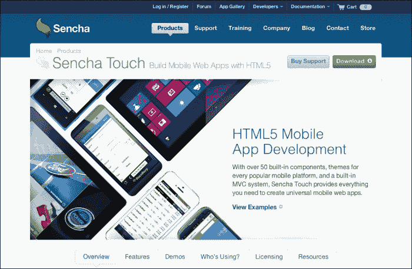

## 有计划地构建

在选择任何框架时，关键之一是要查看其文档。没有文档的框架，或者是文档质量差的框架，使用起来简直就是一种折磨。良好的文档提供了关于框架中每个对象、属性、方法和事件的低层次信息。它还应该提供更一般性的信息，例如代码在各种不同情况下是如何使用的示例。

提供良好的文档和示例是 Sencha Touch 作为框架的两个亮点。在 Sencha 的主网站上，[`docs.sencha.com`](http://docs.sencha.com)，可以找到关于**Sencha 文档资源** | **Touch**的广泛信息。有自 Sencha Touch 1.1.0 版本以来的每个版本的文档。在这本书中，我们使用的是 Version 2.2.1，所以点击**Touch 2.2.1**链接会带您到相关的文档。您还可以下载文档作为 ZIP 文件。

一个设计良好的框架还维护一套规范和实践。这些可以是很简单的事情，比如使用驼峰命名法为变量命名（例如，`myVariable`），或者更复杂的注释和文档化代码的做法。这些标准和实践的关键是保持一致性。

一致性使你能够快速学习语言，并直观地知道在哪里找到你问题的答案。这有点像有一个建筑计划；你很快就能理解事物的布局和如何到达你需要去的地方。

框架也会通过提供结构和编码一致性的示例帮助你理解如何构建自己的应用。

在这方面，Sencha 竭尽全力鼓励一致性，遵守标准，并为 Sencha Touch 框架提供广泛的文档。这使得 Sencha-Touch 成为初学者非常有效的首选语言。

## 构建社区

框架很少是孤立的存在的。开发人员群体往往会聚集在特定的框架周围，形成社区。这些社区是询问问题和学习新语言的绝佳场所。

就像所有社区一样，有许多不成文的规定和习俗。在发帖提问之前，总是花时间浏览一下论坛，以防问题已经被提出并回答过了。

Sencha Touch 拥有一个活跃的开发社区，有一个可以从主要 Sencha 网站 [`www.sencha.com/forum`](http://www.sencha.com/forum) 访问的论坛（在网站上向下滚动以找到 Sencha Touch 特定的论坛）。

# 移动应用框架

移动应用框架需要解决与标准框架不同的功能问题。与传统的桌面应用不同，移动设备处理触摸和滑动而不是鼠标点击。键盘是屏幕的一部分，这可能使得传统的键盘导航命令变得困难，甚至不可能。此外，移动设备中有各种屏幕尺寸和分辨率可供选择。因此，框架必须根据屏幕和设备类型调整自身。移动设备的计算能力不如桌面设备，资源也不多，所以移动框架应该考虑这些限制。为了理解这些限制，我们可以先看看不同类型的移动框架以及它们是如何工作的。

## 原生应用与网页应用

移动应用框架主要有两种基本类型：一种用于构建**原生应用**，另一种用于构建**基于网页的应用**，如 Sencha Touch。

原生应用是指直接安装在设备上的应用。它通常能更多地访问设备的硬件（如摄像头、GPS、定位硬件等）和其他设备上的程序，比如通讯录和相册。原生应用的更新通常需要每个用户下载更新后的程序的新副本。

基于 Web 的应用程序，如名字暗示的那样，需要一个公共 Web 服务器，用户需要通过这个服务器来访问应用程序。用户会使用他们移动设备上的浏览器导航到你的应用程序的网站。由于应用程序在 Web 浏览器中运行，它对本地文件系统的访问权限更少，对硬件的访问权限也更少，但它也不需要用户经历复杂的下载和安装过程。基于 Web 的应用程序的更新可以通过对公共 Web 服务器进行一次更新来完成。然后，任何访问该网站的人都会自动更新程序。

基于 Web 的应用程序也可以修改，使其表现得更像原生应用程序，甚至可以通过单独的程序编译，成为一个完整的原生应用程序。

大多数移动浏览器允许用户将应用程序保存到移动设备的桌面。这将创建一个在移动设备主屏幕上的图标。从那里，应用程序可以被启动，并且表现得非常像一个原生应用程序。当从主屏幕图标启动应用程序时，浏览器的导航将不可见。Web 应用程序还可以使用移动设备的内置存储能力，例如使用**HTML5 本地存储**在设备上存储数据，使应用程序在没有网络连接的情况下离线工作。

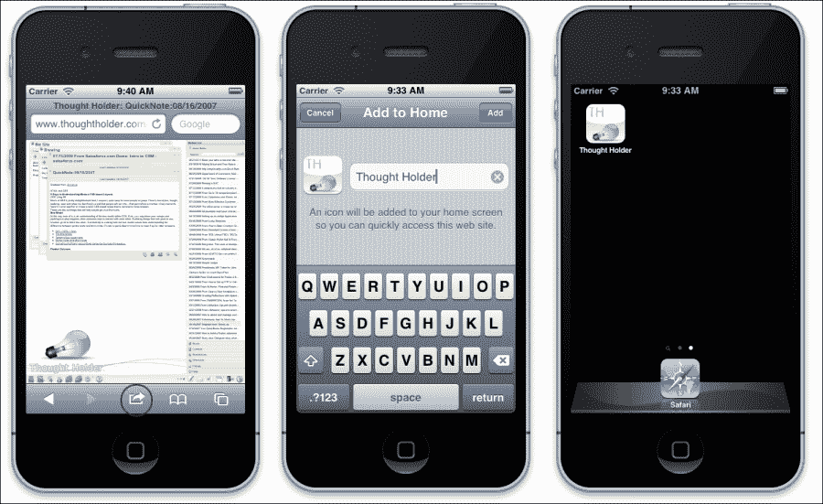

如果你发现自己需要原生应用程序的全部功能，你可以使用 Sencha Cmd 命令行工具或外部编译器，如 PhoneGap([`www.phonegap.com/`](http://www.phonegap.com/))，将你的基于 Web 的应用程序编译成一个完整的原生应用程序，然后你可以在苹果的 App Store 或谷歌 Play 商店上传并销售。我们将在书的后面更详细地讨论这些选项。

## 基于 Web 的移动框架

基于 Web 的移动框架依赖于运行应用程序的 Web 浏览器。这是一个关键的信息，原因有几个。

基于 Web 的应用程序首先需要考虑的是，Web 浏览器在移动平台之间需要保持一致。如果你之前有任何网站开发经验，你就会知道浏览器兼容性问题非常痛苦。一个网站在不同的浏览器中可能看起来完全不同。在某个浏览器中可以工作的 JavaScript 在另一个浏览器中可能无法工作。人们也倾向于保留不更新老旧的浏览器。幸运的是，对于大多数移动设备来说，这些问题影响不大，对于 iOS 和 Android 来说更不是问题。

苹果的 iOS 和谷歌的 Android 的 Web 浏览器都是基于**WebKit**引擎。WebKit 是一个开源引擎，它基本上控制着浏览器如何显示页面、处理 JavaScript 以及实现 Web 标准。这意味着你的应用程序应该在这两个平台上的工作方式相同。

然而，不使用 WebKit 的手机设备（如 Windows 手机）将无法使用您的应用程序。好消息是，随着更多浏览器采用 HTML5 标准，这个问题也可能开始消失。

对于基于网页的应用程序的第二个考虑因素是它存放在哪里。原生应用程序被安装在用户的设备上。基于网页的应用程序需要被安装在公共服务器上。用户应该能够将 URL 输入到他们的网页浏览器中，并导航到您的应用程序。如果应用程序只存在于您的电脑上，只有您一个人可以使用它。这对于测试来说很好，但是如果您想让其他人使用您的应用程序，您需要将其托管在公共服务器上。

第三个考虑因素是连通性。如果用户无法连接到互联网，他们将无法使用您的应用程序。然而，Sencha Touch 可以配置为存储您的应用程序及其所有数据在本地。乍一看，这个能力似乎完全解决了连通性问题，但实际上，当用户用多个设备连接到您的应用程序时，它实际上会导致问题。

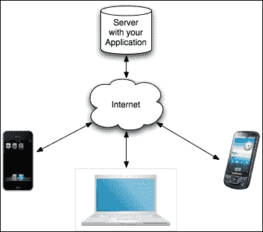

基于网页的应用程序存放在互联网上，因此它可以通过任何带有浏览器和网络连接的设备访问。同一个应用程序可以同时用于手机、个人电脑和移动设备。如果数据存储在中心服务器上，这是信息丰富应用的最大优势。这意味着在一个设备上输入的数据可以在另一个设备上访问。

但是，如果一个应用程序存储数据在本地，这将不可能实现，因为在一个移动设备上输入的数据无法在个人电脑上访问。如果用户使用个人电脑查看网站，应用程序将创建另一套本地数据。

幸运的是，Sencha Touch 可以设置为在服务器和其他各种设备之间同步数据。当您的应用程序连接到互联网时，它会同步任何现有的离线数据，并在在线时使用远程服务器存储任何数据。这确保了您的数据可以在所有设备上访问，同时允许您根据需要离线工作。

## 网页框架和触控技术

标准的网页应用程序框架已经被设计来与鼠标和键盘环境一起工作，但是，移动框架应该使用触控技术进行导航和数据输入。

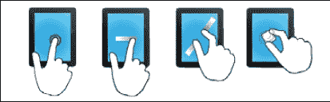

以下是一些常见的触控手势：

+   **Tap**: 屏幕上的一次点击

+   **双击**: 在屏幕上快速点击两次

+   **Tap Hold**: 在设备上点击一次，然后保持手指按压

+   **Swipe**: 用一根手指从左到右或从上到下在屏幕上移动

+   **捏合或展开**: 用两根手指触摸屏幕，然后捏合在一起或分开以撤销动作

+   **旋转**：将两个手指放在屏幕上并顺时针或逆时针旋转它们，通常是为了在屏幕上旋转一个对象

最初，这些交互仅在原生应用中得到支持，但 Sencha Touch 使它们在网页应用中也可用。

# 为移动设备和触控技术设计应用

移动应用需要一些思维上的改变。最大的考虑因素是比例问题。

如果你习惯在 21 英寸显示器上设计应用，处理 3.5 英寸手机屏幕可能会是一种痛苦的经历。手机和移动设备使用各种屏幕分辨率；以下是一些例子：

+   **iPhone 5 Retina 显示屏**: 1136 x 640

+   **iPhone 5**: 960 x 640

+   **iPhone 4** 和 **iPod Touch 4**: 960 x 640

+   **iPhone 4** 和 **iPod Touch 3**: 480 x 320

+   **Android 4 手机**: 这些支持四种通用尺寸：

    +   大屏幕至少为 960 x 720

    +   小屏幕至少为 640 x 480

    +   普通屏幕至少为 470 x 320

    +   小屏幕至少为 426 x 320

+   **HTC 手机**: 800 x 480

+   **三星 Galaxy S3**: 1280 x 720

+   **iPad**: 1024 x 768

+   **iPad Retina**: 2048 x 1536

此外，Android 平板电脑具有各种分辨率和尺寸。为这些不同屏幕尺寸设计应用可能需要一些额外的努力。

设计移动应用时，通常的一个好主意是制作设计草图，以更好地了解比例和应用各种元素将要去的位置。有许多好的布局程序可以帮助你做这件事，如下列出：

+   Omni Graffle for the Mac ([`www.omnigroup.com/products/omnigraffle/`](http://www.omnigroup.com/products/omnigraffle/))

+   Balsamiq Mockups for Mac, Windows, and Linux ([`balsamiq.com/`](http://balsamiq.com/))

+   DroidDraw for Mac, Windows, and Linux ([`www.droiddraw.org/`](http://www.droiddraw.org/))

+   iMockups for the iPad ([`www.endloop.ca/imockups/`](http://www.endloop.ca/imockups/))

触控应用还有一些你需要留意的考虑因素。如果你来自典型的网络开发背景，你可能会习惯使用如悬停等事件。

悬停通常用于网络应用中，以提示用户可以执行某个操作，或者提供工具提示；例如，当用户将鼠标光标悬停在图像或文本上时，通过改变其颜色来显示该图像或文本可以被点击。由于触控应用要求用户与屏幕接触，所以实际上并不存在悬停的概念。用户可以激活或与之交互的对象应该是显而易见的，图标应该清晰标记。

与基于鼠标的应用程序不同，触控应用程序通常也被设计来模仿现实世界的交互。例如，在触控应用程序中翻页通常是通过水平地用手指在页面上滑动来完成的，这与现实世界中的操作非常相似。这鼓励了应用程序的探索，但这也意味着程序员在处理任何潜在的破坏性操作时（如删除一个条目）必须特别小心。

## 为什么是触控？

在触屏出现之前，应用程序通常限于从外部键盘和鼠标接收输入。这两种方式在移动平台上都不是很理想。即使在全内置键盘的非触控设备中使用，它们也可能占用设备上大量的空间，从而限制了可用的屏幕尺寸。相比之下，基于触控的键盘在不需要时会消失，从而留出更大的屏幕区域用于显示。

移动设备上的滑出式键盘并没有 adverse 影响屏幕尺寸，但它们可能会占用空间并且使用起来不舒服。此外，触控屏键盘允许有特定于应用程序的键盘和按键，比如在网页浏览器中使用的*.com*键。

键盘和鼠标设备也可能对一些用户造成心理上的 disconnect。在桌面上使用鼠标来控制分离屏幕上的小指针往往会让用户有一种没有完全控制活动的感觉，而直接在屏幕上触摸并移动一个对象则让你成为活动的主体。因为我们通过触摸和用手移动物体与物理世界互动，所以基于触控的应用程序通常提供更直观的用户界面（UI）。

触控技术随着 Windows 8 的问世也开始在桌面电脑领域取得重大突破。随着这项技术的价格降低并变得更加普及，对基于触控的应用程序的需求将继续增长。

# 开始使用 Sencha Touch

当你开始接触任何新的编程框架时，了解所有可用的资源是个好主意。购买这本书是一个很好的开始，但还有其他一些对你探索 Sencha Touch 框架来说非常有价值的资源。

幸运的是，Sencha 网站为我们提供了丰富的信息，帮助你在开发的每个阶段。

## 应用程序编程接口（API）

Sencha Touch 应用程序编程接口（API）文档提供了关于 Sencha Touch 中可用的每个对象类的详细信息。API 中的每个类都包括对该类每个配置选项、属性、方法和事件的详细文档。API 通常还包括每个类的简短示例，带有实时预览和代码编辑器。

应用程序编程接口（API）文档可在 Sencha 网站[`docs.sencha.com/touch/2.2.1/`](http://docs.sencha.com/touch/2.2.1/)上找到。

如以下屏幕截图所示的副本，也作为 Sencha Touch 框架的一部分包含在内，您将下载此框架来创建您的应用程序：

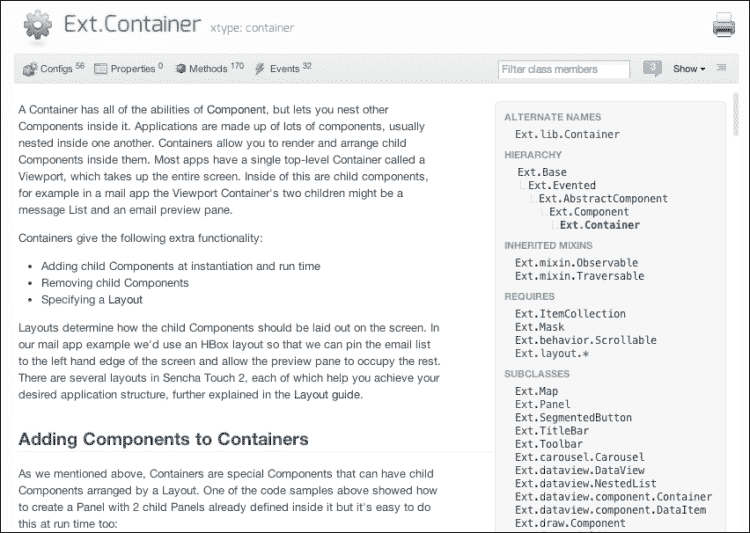

## 示例

Sencha 网站还包含了许多示例应用程序供您查看。其中最为有帮助的是厨房水槽（Kitchen Sink）应用程序。下面的屏幕截图展示了厨房水槽应用程序的外观：

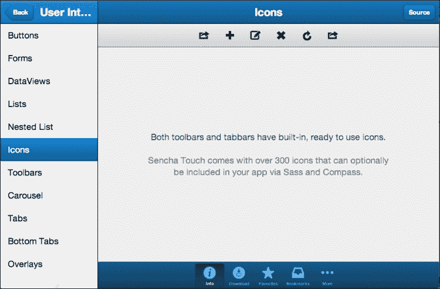

### 厨房水槽应用程序

厨房水槽应用程序提供了以下示例：

+   用户界面元素，如按钮、表单、工具栏、列表等

+   动作的动画，如翻页或滑动表单

+   触摸事件，如轻触、滑动和捏合

+   处理 JSON、YQL 和 AJAX 的数据

+   音频和视频的媒体处理

+   更改应用程序外观的主题

每个示例在上右角都有一个**源代码**按钮，将显示厨房水槽示例的代码。

厨房水槽应用程序还提供了**事件记录器**和**事件模拟器**。这些功能将允许您录制、存储并回放设备屏幕上执行的任何触摸事件。

这些模拟器演示了如何在您的应用程序中记录操作以作为现场演示或教程回放，它们还可以用于轻松重复测试功能。

您可以在任何移动设备上或使用苹果的 Safari 网络浏览器在常规计算机上与厨房水槽应用程序互动。厨房水槽应用程序可在 Sencha 网站[`docs.sencha.com/touch/2.2.1/touch-build/examples/kitchensink/`](http://docs.sencha.com/touch/2.2.1/touch-build/examples/kitchensink/)上找到。

厨房水槽应用程序的副本也作为 Sencha Touch 框架的一部分包含在内，您将下载此框架来创建您的应用程序。

## 学习

Sencha 在网站上还有一个部分，致力于讨论 Sencha Touch 框架的特定方面。这个部分被适当地命名为**学习**。它包含了许多教程、屏幕录像和指南供您使用。每个子部分都被标记为**简单**、**中等**或**困难**，这样您就对您将要进入的内容有一个大致的了解。

**学习**部分可在 Sencha 网站[`www.sencha.com/learn/touch/`](http://www.sencha.com/learn/touch/)上找到。

## 论坛

Sencha 论坛值得再次提及。这些社区讨论提供了基础知识、错误报告、问答环节、示例、竞赛等内容。论坛是找到日常使用框架的人提供的解决方案的好地方。

# 设置您的开发环境

现在您已经熟悉了可用的 Sencha Touch 资源，下一步是设置您的开发环境并安装 Sencha Touch 库。

为了开始使用 Sencha Touch 开发应用程序，强烈建议您有一个可以托管应用程序的网络服务器。虽然通过使用网络浏览器查看本地文件夹来开发 Sencha Touch 应用程序是可能的，但没有网络服务器，您将无法在任何移动设备上测试您的应用程序。

## 在 Mac OS X 上设置网络共享。

如果您正在使用 Mac OS X，您已经安装了一个网络服务器。要启用它，请启动系统偏好设置，选择**共享**，并启用**网络共享**。如果您还没有这么做，点击**创建个人网站文件夹**来为您的主目录设置一个网络文件夹。默认情况下，这个文件夹名为`Sites`，这是我们构建应用程序的地方：

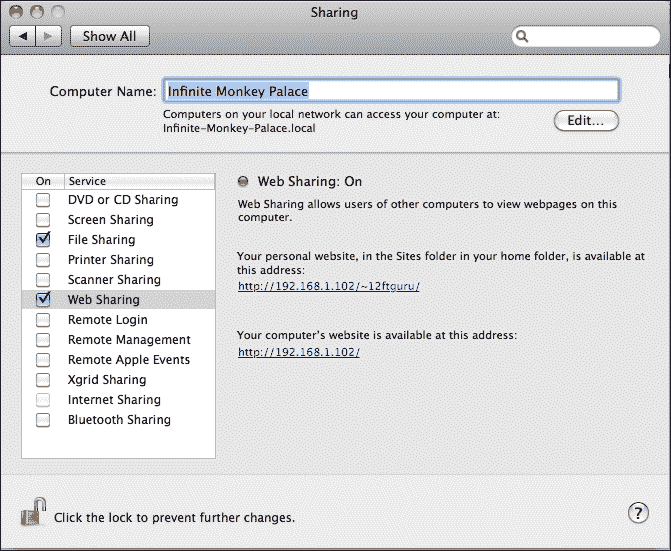

**共享**面板将告诉您您的网络服务器 URL。记住这个，稍后用得着。

## 在 Microsoft Windows 上安装网络服务器。

如果您正在运行 Microsoft Windows，您可能正在运行 Microsoft 的**互联网信息服务器**（**IIS**）。您可以进入控制面板，选择以下任一选项来查看：

+   **程序特性** | **开启或关闭 Windows 功能**（在 Vista 或 Windows 7 中）。详细说明请参阅[`www.howtogeek.com/howto/windows-vista/how-to-install-iis-on-windows-vista/`](http://www.howtogeek.com/howto/windows-vista/how-to-install-iis-on-windows-vista/)。

+   **添加/删除程序** | **添加/删除 Windows 组件**（在 Windows XP 中）。详细说明请参阅[`www.webwiz.co.uk/kb/asp-tutorials/installing-iis-winXP-pro.htm`](http://www.webwiz.co.uk/kb/asp-tutorials/installing-iis-winXP-pro.htm)。

如果您没有安装 IIS，或者不熟悉其操作，建议您安装 Apache 服务器，与本书配合使用。这将使我们能够在示例中为 Mac 和 PC 提供一致的指导。

安装 Apache 的最简单方法之一是下载并安装 XAMPP 软件包([`www.apachefriends.org/en/xampp-windows.html`](http://www.apachefriends.org/en/xampp-windows.html))。这个软件包包括 Apache 以及 PHP 和 MySQL。这些额外的程序在您的技能增长时会有帮助，让您能够创建更复杂的程序和数据存储选项。

下载并运行 XAMPP 后，系统会提示您运行 XAMPP 控制面板。您还可以从 Windows**开始**菜单运行 XAMPP 控制面板。您应该点击控制面板中的**开始**按钮来启动您的网络服务器。如果您从防火墙软件收到通知，您应该选择允许 Apache 连接到互联网的选项。

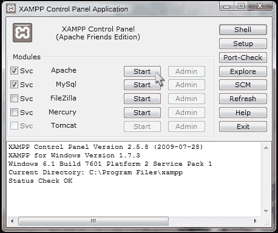

在您安装 XAMPP 的文件夹中，有一个名为`htdocs`的子目录。这是我们将要设置 Sencha Touch 的网页文件夹。完整路径通常是`C:\xampp\htdocs`。您的网页服务器 URL 将是`http://localhost/`；您想要记住这个步骤。

## 下载并安装 Sencha Touch 框架

在您的网页浏览器中，访问[`www.sencha.com/products/touch/`](http://www.sencha.com/products/touch/)，然后点击**下载**按钮。将 ZIP 文件保存到一个临时目录中。

### 注意

请注意，本书中的所有示例都是使用 Sencha Touch Version 2.1.1 编写的。

您下载的文件解压缩将创建一个名为`sencha-touch-version`的目录（在我们的案例中，它是`sencha-touch-2.1.1`）。将此目录复制到您的网页文件夹中并重命名它，删除版本号，只留下`sencha-touch`。

现在，打开您的网页浏览器并输入您的网页 URL，在末尾添加`sencha-touch/examples`。您应该看到以下 Sencha Touch 演示页面：

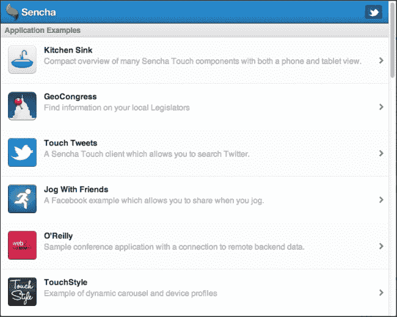

恭喜您！您已成功安装了 Sencha Touch。

这个演示页面包含了应用程序的示例以及组件的简单示例。

# 用于使用 Sencha Touch 开发的额外工具

除了配置网页服务器和安装 Sencha Touch 库之外，还有一些开发工具您可能在深入您的第一个 Sencha Touch 应用程序之前想要了解一下。Sencha 还拥有几款其他可能对您的 Sencha Touch 应用有用的产品，还有不少第三方工具可以帮助您开发和部署您的应用。我们不会详细介绍如何设置和使用它们，但这些工具绝对值得一探。

## Safari 和 Chrome 开发者工具

编写代码时，能够看到幕后发生的情况通常非常有帮助。与 Sencha Touch 一起工作的最关键工具是 Safari 和 Chrome 开发者工具。这些工具将以多种方式帮助您调试代码，我们将在书中进一步详细介绍它们。现在，让我们快速了解一下以下四个基本工具，它们将在以下章节中解释。

### 提示

对于 Safari 用户，您可以通过前往**编辑** | **偏好设置** | **高级**来启用 Safari 开发者菜单。在菜单栏中勾选**显示开发**复选框。一旦启用此菜单，您可以看到所有可用的开发者工具。对于 Chrome 用户，这些工具可以通过**查看** | **开发者** | **开发者工具**菜单访问。

### JavaScript 控制台

JavaScript 控制台显示错误和控制台日志，这为您提供了出错时的指示。

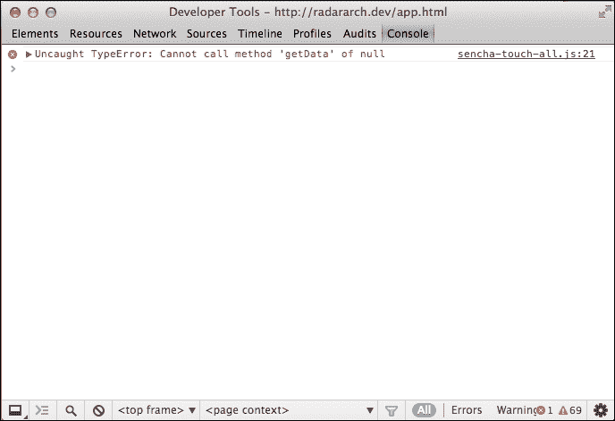

注意我们在这里得到两方面的信息：错误和错误发生的文件。你可以点击文件名查看错误发生的确切行。你应该花些时间熟悉 Chrome 或 Safari 中的控制台。你可能会在这里花很多时间。

### 网络标签页

第二个有用的工具是**网络**标签页。这个标签页会显示在网页浏览器中加载的所有文件，包括浏览器尝试加载但无法找到的任何文件的错误。

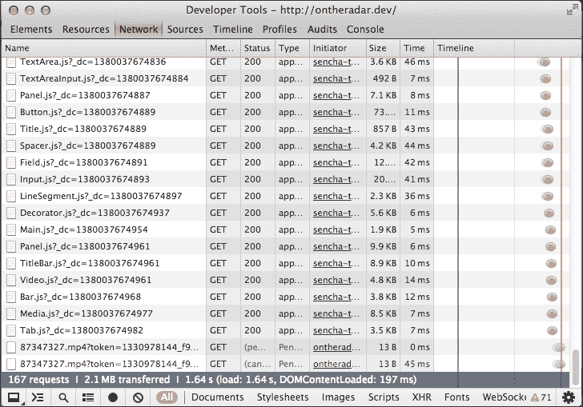

丢失的文件显示为红色。点击一个文件会显示更多详细信息，包括传递给文件的任何数据和返回的数据。

### 网络检查器

网络检查器允许你检查页面中显示的任何元素的底层 HTML 和 CSS。下面的屏幕截图展示了网络检查器：

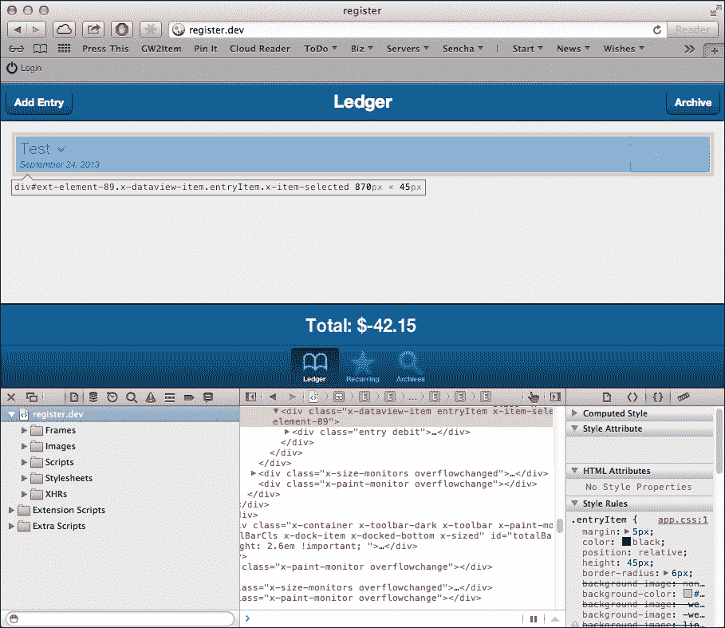

网络检查器在寻找应用程序中的显示和定位错误时特别有用。你可以在 Chrome 中点击放大镜或 Safari 中的指针来选择页面上的任何元素并查看显示逻辑。

### 资源标签页

**资源**标签页显示浏览器为我们应用程序存储的信息。这包括我们存储在本地任何数据的信息，以及我们为这个应用程序创建的任何饼干的详细信息，如下面的屏幕截图所示：

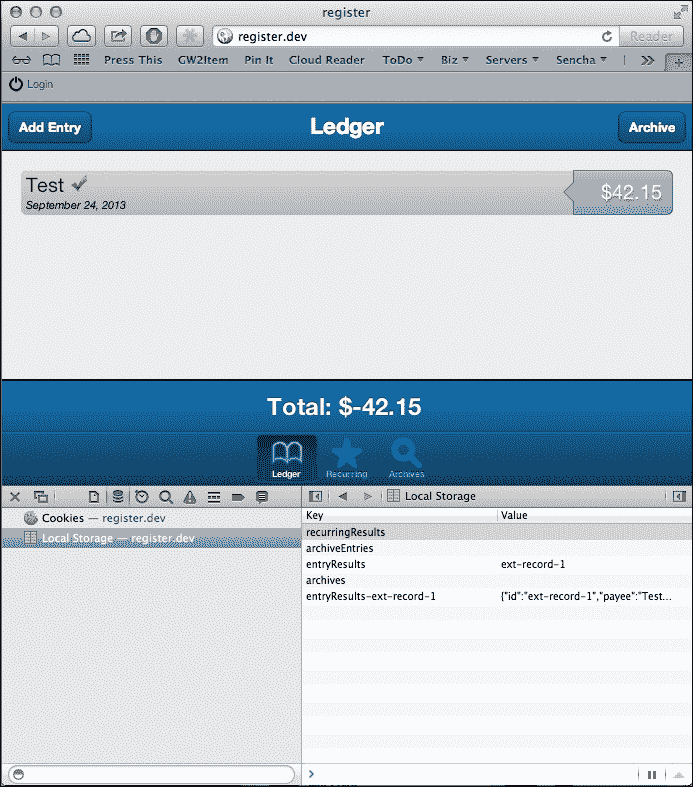

从这一标签页中，你可以双击一个项目来编辑它，或者右键点击删除它。

随着书籍的进展，我们将更详细地查看这些工具，并展示一些额外的用途和技巧。

Safari 开发者工具的完整讨论可以在[`developer.apple.com/technologies/safari/developer-tools.html`](https://developer.apple.com/technologies/safari/developer-tools.html)找到。

Chrome 开发者工具的介绍可以在[`developers.google.com/chrome-developer-tools/`](https://developers.google.com/chrome-developer-tools/)找到。

## 其他 Sencha 产品

Sencha 提供了几款可以加速代码开发甚至扩展 Sencha Touch 功能的产品。

### Sencha Cmd

Sencha Cmd 是一个命令行工具，允许你从命令行提示符生成基本的 Sencha Touch 文件。它还可以让你编译应用程序供 Web 使用，或者编译成二进制文件，你可以在各种应用程序商店中销售。

在本书中，我们将多次使用 Sencha Cmd。你可以从以下网站下载它：

[`www.sencha.com/products/sencha-cmd/download`](http://www.sencha.com/products/sencha-cmd/download)

### Sencha Architect

Sencha Architect 是 Sencha Touch 和 ExtJS 应用的**集成开发环境**（**IDE**）。Sencha Architect 允许您在一个图形化环境中构建应用程序，通过拖放控件到屏幕上。您可以以多种方式排列和操作这些组件，而 Sencha Architect 会为您编写底层代码。您可以从以下网站下载：

[Sencha Architect](http://www.sencha.com/products/architect)

### Sencha Animator

Sencha Touch 带有一些内置动画；但是，对于更复杂的动画，需要一个更强大的应用程序。使用 Sencha Animator 桌面应用程序，您可以创建与 Flash 动画相媲美的专业动画。然而，与 Flash 动画不同，Sencha Animator 动画可以在大多数移动浏览器上运行，使其成为为您的 Sencha Touch 应用程序添加额外魅力完美的选择。您可以在以下网站下载 Sencha Animator：

[Sencha Animator](http://www.sencha.com/products/animator/)

## 第三方开发者工具

您还可以选择多种开发者工具，这些工具在开发您的 Sencha Touch 应用时可能会有所帮助。

### Notepad++

Notepad++是一个代码编辑器，非常适合编写 JavaScript 代码。它具有某些有用功能，如语法高亮、语法折叠、多视图和多语言环境以及多文档。这是一个免费且开源的工具，可在[Notepad++](http://notepad-plus-plus.org/features.html)上获得。这只适用于 Windows 和 Linux 操作系统。

### WebStorm

WebStorm 是一个 IDE（代码编辑器），用于开发使用 JavaScript 等语言的网页应用程序。WebStorm 适用于 Windows、OS X 和 Linux。Webstorm 提供 30 天免费试用，并可选商业、个人和教育用途的许可选项。您可以在以下网站找到它：

[WebStorm](http://www.jetbrains.com/webstorm/)

### Xcode 5

**Xcode 5** 是苹果完整的开发环境，旨在为任何苹果平台（OS X、iPhone 或 iPad）的开发者提供支持。因此，它包含很多对于编写 Sencha Touch 应用程序来说实际上并不必要的组件。然而，Xcode 5 中包含的一个对于 Sencha Touch 开发者可能非常有用的工具是 iOS 模拟器。使用 iOS 模拟器，您可以在不实际拥有它们的情况下在各种 iOS 设备上测试您的应用程序。

大多数使用 Xcode 5 的用户需要加入苹果开发者计划（比如在应用商店销售应用程序）。然而，iOS 模拟器任何人都可以使用。您可以从以下网站下载 Xcode 5：

[Xcode](http://developer.apple.com/xcode/)

### Android 模拟器

Android 模拟器是 Xcode 5 中 iOS 模拟器的 Android 对应程序。Android 模拟器是免费下载的 Android SDK 的一部分，地址为[`developer.android.com/guide/developing/devices/emulator.html`](http://developer.android.com/guide/developing/devices/emulator.html)。Android 模拟器可以配置为模仿许多具体的 Android 移动设备，使你能够跨广泛的设备测试你的应用程序。

### YUI 测试

编程的任何一部分都包括测试。YUI 测试是雅虎的 YUI JavaScript 库的一部分，它允许你创建和自动化单元测试，就像 JUnit 对 Java 做的那样。单元测试为特定代码段设置测试用例。然后，如果将来这段代码发生了变化，可以重新运行单元测试，以确定代码是否仍然成功。这非常有用，不仅用于查找代码中的错误，而且用于在发布之前确保代码质量。YUI 测试可以在以下网址找到：

[`yuilibrary.com/yui/docs/test/`](http://yuilibrary.com/yui/docs/test/)

### Jasmine

Jasmine 是一个类似于 YUI 测试的测试框架，只不过它是基于**行为驱动设计**（**BDD**）。在 BDD 测试中，你从规格开始——关于你的应用程序在某些场景下应该做什么的故事——然后编写符合这些规格的代码。YUI 测试和 Jasmine 都达到了测试你代码的相同目标，它们只是以不同的方式做到这一点。你可以在以下网址下载 Jasmine：

[`pivotal.github.com/jasmine/`](http://pivotal.github.com/jasmine/)

### JSLint

可能是这个列表中最有用的 JavaScript 工具，**JSLint**将检查你的代码中的语法错误和代码质量。由 JavaScript 的两位之父之一 Douglas Crockford 编写，JSLint 将详细检查你的代码，这对于在部署代码之前找到错误非常有帮助。你可以在以下网址找到更多信息：

[`www.jslint.com/lint.html`](http://www.jslint.com/lint.html)

# 总结

在本章中，我们介绍了 web 应用程序框架的基础知识以及为什么应该使用 Sencha Touch。我们带你了解如何设置开发环境和安装 Sencha Touch 库。我们还简要了解了移动设备的限制以及如何克服它们。我们还简要了解了在开发移动应用程序时应该注意的事情。我们还探讨了在移动应用程序开发中有用的其他工具：

+   Sencha Touch 学习中心（[`www.sencha.com/learn/touch/`](http://www.sencha.com/learn/touch/)

+   Apple 的 iOS 人机界面指南（[`developer.apple.com/library/ios/#documentation/UserExperience/Conceptual/MobileHIG/Introduction/Introduction.html`](http://developer.apple.com/library/ios/#documentation/UserExperience/Conceptual/MobileHIG/Introduction/Introduction.html)）——深入介绍为 iOS 设备开发用户界面的指南。

+   Android 界面指南([`developer.android.com/guide/practices/ui_guidelines/index.html`](http://developer.android.com/guide/practices/ui_guidelines/index.html))

在下一章中，我们将创建第一个 Sencha Touch 应用程序，在这个过程中，我们将学习如何使用 Sencha Touch 开发和 MVC 框架的基本知识。
