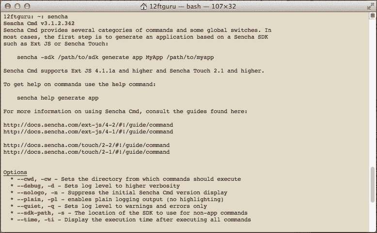
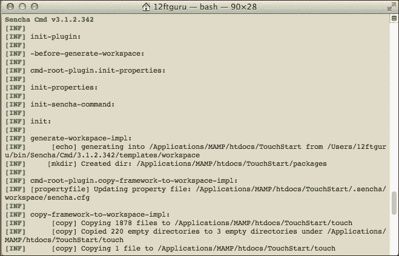
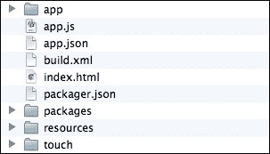
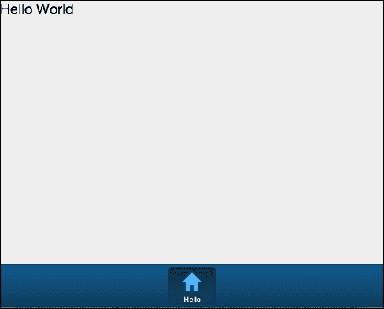
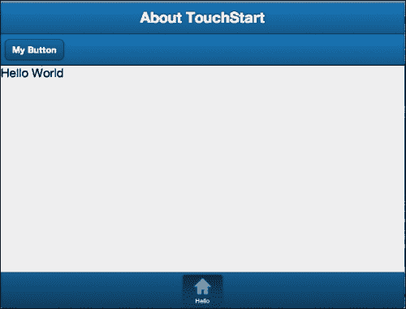
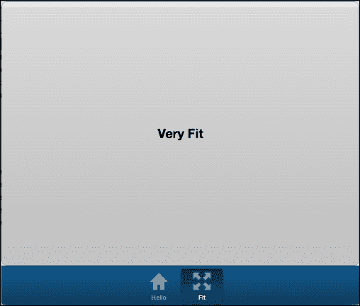
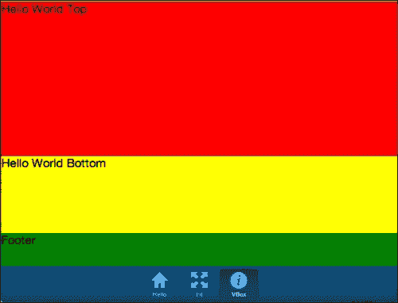
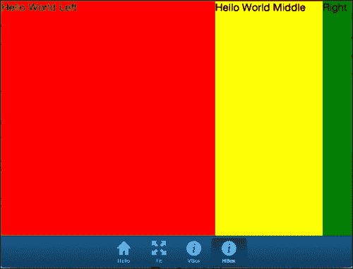
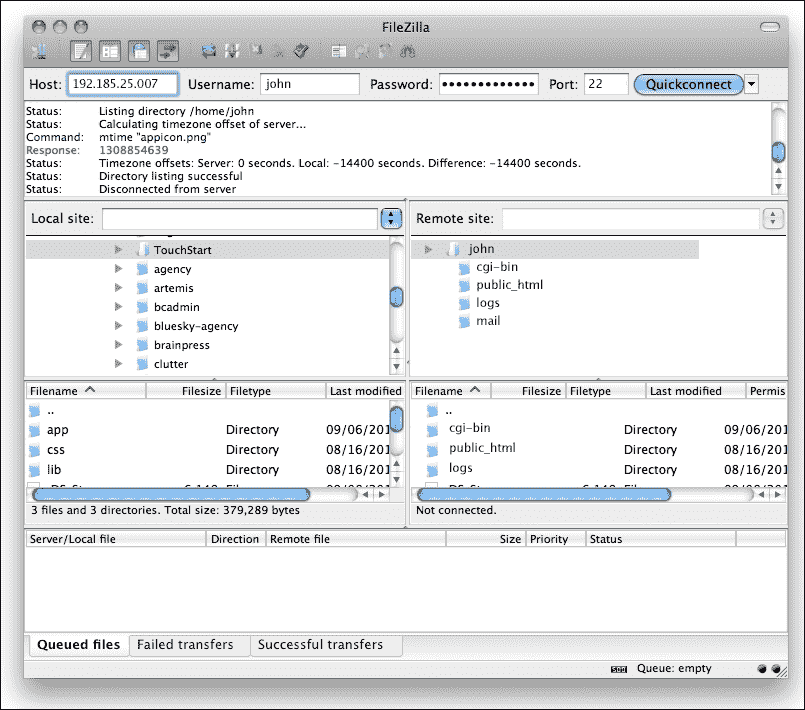

# 第二章：创建一个简单的应用

在本章中，我们将带领大家了解如何在 Sencha Touch 中创建一个简单应用的基础知识。我们将涵盖大多数 Sencha Touch 应用中使用的的基本元素，并查看你可能会在自己的应用中使用的更常见的组件：容器、面板、列表、工具栏和按钮。

本章将涵盖以下主题：

+   使用 Sencha Cmd 创建基本应用

+   理解应用的文件和文件夹

+   修改应用

+   控制应用的布局

+   测试和调试应用

+   更新生产环境中的应用

让我们学习如何设置一个基本的 Sencha Touch 应用。

# 设置应用

在开始之前，你需要确保你已经根据前章的概要正确地设置了你的开发环境。

### 注意

**根目录**

如前章所述，为了允许网络服务器找到它们，你需要将你的应用文件和文件夹放在你本地机器上正确的文件夹中。

在 Mac 机器上，如果你使用网络共享，这将是你家目录下的`Sites`文件夹。如果你使用 MAMP，位置是`/Applications/MAMP/htdocs`。

在 Windows 上，这将是在前章中描述的安装 XAMPP 后的`C:\xampp\htdocs`。

在本书的其余部分，我们将把这个文件夹称为根目录。

在 Sencha Touch 的先前版本中，你必须手动设置你的目录结构。为了使这个过程变得稍微容易一些并且更加一致，Sencha 现在建议使用 Sencha Cmd 来创建初始应用结构。

## 使用 Sencha Cmd 入门

正如前章所提到的，Sencha Cmd 是一个命令行工具，它允许你从命令行生成许多基本的 Sencha Touch 文件。

首先，你需要从以下链接下载一个 Sencha Cmd 的副本：[`www.sencha.com/products/sencha-cmd/download`](http://www.sencha.com/products/sencha-cmd/download)

在 Windows 或 Mac 上，下载安装程序后可以运行它，然后按照安装 Sencha Cmd 的提示操作。

一旦你安装了 Sencha Cmd，你可以以以下方式在你的电脑上打开命令行提示：

+   在 Mac OS X 上，前往`Applications/Utilities`并启动**终端**

+   在 Windows 上，点击**开始** | **运行**，然后输入`cmd`

一旦命令行可用，输入`sencha`，你应该会看到类似以下内容：



这告诉你命令是否成功，并提供了一些 Sencha Cmd 的基本`帮助`选项。实际上，我们将使用这个帮助部分列出的第一个命令来生成我们的新应用：

```js
sencha -sdk /path/to/sdk generate app MyApp /path/to/myapp

```

这个命令有七个部分，所以我们逐一来看看：

+   `sencha`：这告诉命令行将处理命令的应用程序名称；在这个例子中，`Sencha Cmd`，或者简称`sencha`。

+   `-sdk`：这告诉 Sencha Cmd 我们将指定我们 Sencha Touch 库的路径。我们也可以直接将目录更改为我们下载这些库的文件夹，从而省略`-sdk`部分以及随后的路径信息。

+   `/path/to/sdk`：这将被替换为我们下载的 Sencha Touch 库文件的实际路径（不是 Sencha Cmd，而是实际的 Sencha Touch 库）。

+   `generate`：这表明了我们接下来要做什么。

+   `app`：由于我们将要生成一些东西，那么我们将要生成什么？这一部分的命令回答了这个问题。在这个例子中，我们将要生成一个应用。

+   `MyApp`：你的应用将被称为这个名字。它还将用于我们稍后介绍的 JavaScript 命名空间。这是任意的，但必须是一个没有空格的单个单词。

+   `/path/to/myapp`：这将是你的新应用的路径。这个路径应该在我们之前提到的根目录中的一个新文件夹里。

在本章节，我们将要创建一个名为`TouchStart`的应用。你的路径信息需要反映你个人的设置，但命令应该看起来类似于这样：

```js
sencha -sdk /Users/12ftguru/Downloads/touch-2.2.1 generate app TouchStart /Applications/MAMP/htdocs/TouchStart

```

根据你的 Sencha Touch 库和根目录的位置调整你的路径。命令一旦执行，你将在终端中看到如下方式出现的一系列信息：



Sencha Cmd 复制它需要的文件并设置你的应用。一旦命令执行，你应该在根目录中有一个名为`TouchStart`的新文件夹。

打开那个文件夹，你会看到以下文件和目录：



我们将几乎完全与`app`目录中的文件一起工作，但了解这些文件和目录的每个部分还是值得的：

+   `app`：本章节我们将详细介绍这个目录，这是我们的所有应用文件所在的地方。

+   `app.js`：这个 JavaScript 文件设置我们的应用并在应用启动时处理初始化。我们将在下一节更详细地查看这个文件。

+   `build.xml`：这是一个编译应用程序的配置文件。你可能不需要更改这个文件。

+   `index.html`：这个文件与任何网站的`index.html`文件类似。它是浏览器加载的第一个文件。然而，与传统的网站不同，我们应用的`index.html`文件只加载我们的初始 JavaScript，然后什么都不做。你不需要更改这个文件。

+   `packager.json`：这个配置文件告诉我们应用如何设置文件以及它们的所在位置。大部分情况下，你可能不需要更改这个文件。

+   `packages`：`packages`目录是一个占位符，你可以在这里为你的应用程序安装额外的包。在这个阶段，它基本上是未被使用的。

+   `resources`：`resources`目录包含我们的 CSS 文件和启动屏幕及图标。我们将在下一章关于样式的内容中了解更多关于这个目录的信息。

+   `touch`：这个目录包含 Sencha Touch 库文件的副本。它绝不应该被修改。

我们也可以通过访问我们的网页目录，在网络浏览器中查看我们新的应用程序。对于 Windows 和 MAMP 用户，这将是在`http://localhost/TouchStart`，而对于启用了网络共享的 Mac 用户，则是在`http://localhost/~username/TouchStart`。

.jpg)

### 提示

值得一提的是，Sencha Cmd 本身就有一个内置的网络服务器，你可以用它来查看你的 Sencha Touch 应用程序。你可以使用以下命令启动 Sencha Cmd 网络服务器：

```js
sencha fs web -port 8000 start –map /path/to/your/appfolder 

```

然后，你可以通过访问`http://localhost:8000`来打开你的网络浏览器。

有关使用 Sencha Cmd 网络服务器的更多信息，请访问[`docs.sencha.com/cmd/3.1.2/#!/guide/command.`](http://docs.sencha.com/cmd/3.1.2/#!/guide/command.)

从已经创建的基本应用程序中，我们可以看到的是位于`app/view`的`Main.js`文件的内容。我们可以修改这个文件，并在重新加载页面时看到结果。

在我们开始修改`Main.js`文件之前，我们需要先查看一下为我们加载所有内容的文件，即`app.js`。

## 创建 app.js 文件

`app.js`文件负责设置我们的应用程序，虽然我们不需要经常修改它，但了解它做什么以及为什么这样做是个好主意。

在你的代码编辑器中打开`app.js`文件；在顶部，你会看到一大段注释（你应该阅读并熟悉它）。在注释下方，代码以：

```js
Ext.Loader.setPath({
    'Ext': 'touch/src'
});
```

这告诉应用程序我们的 Sencha Touch 库文件位于哪里。

接下来，我们用以下代码定义我们的应用程序：

```js
Ext.application({
    name: 'TouchStart',

    requires: [
        'Ext.MessageBox'
    ],

    views: [
        'Main'
    ],

    icon: {
        '57': 'resources/icons/Icon.png',
        '72': 'resources/icons/Icon~ipad.png',
        '114': 'resources/icons/Icon@2x.png',
        '144': 'resources/icons/Icon~ipad@2x.png'
    },
    isIconPrecomposed: true,

    startupImage: {
        '320x460': 'resources/startup/320x460.jpg',
        '640x920': 'resources/startup/640x920.png',
        '768x1004': 'resources/startup/768x1004.png',
        '748x1024': 'resources/startup/748x1024.png',
        '1536x2008': 'resources/startup/1536x2008.png',
        '1496x2048': 'resources/startup/1496x2048.png'
    },
    launch: function() {
        // Destroy the #appLoadingIndicator element
        Ext.fly('appLoadingIndicator').destroy();

        // Initialize the main view
        Ext.Viewport.add(Ext.create('TouchStart.view.Main'));
    }
});
```

一口气吃下这么多代码确实有些多，所以让我们一步一步来理解。

第一部分，`Ext.Application({…});`，为 Sencha Touch 创建了一个新的应用程序。大括号之间的所有内容都是这个新应用程序的配置选项。虽然一个应用程序有很多配置选项，但大多数至少包括应用程序的名称和启动函数。

### 注意

**命名空间**

使用他人代码时的一个最大问题就是命名问题。例如，如果你正在使用的框架有一个名为`Application`的对象，而你又创建了一个名为`Application`的自定义对象，这两个对象的功能将会发生冲突。Sencha Touch 使用命名空间的概念来防止这些冲突的发生。

在此案例中，Sencha Touch 使用了命名空间`Ext`。你会在本书的代码中看到这个命名空间被广泛使用。这只是一个消除框架对象和代码以及您自己的对象和代码之间潜在冲突的方式。

Sencha 将自动为您自己的代码设置命名空间，作为新`Ext.Application`对象的一部分。在此案例中，它将是`TouchStart`，我们用它来生成我们的应用程序。

`Ext`也是 Sencha 的 Web 应用程序框架`ExtJS`的名称之一。Sencha Touch 使用相同的命名空间约定，让开发者熟悉一个库，并容易理解另一个库。

当我们创建一个新应用程序时，我们需要向其传递一些配置选项。这将告诉应用程序如何外观以及要做什么。这些配置选项包含在花括号`{}`内，并用逗号分隔。第一个选项是：

```js
name: 'TouchStart'
```

这将我们应用程序的名称设置为引号之间的任何内容。`name`值不应包含空格，因为 Sencha 也使用这个值为您自己的代码对象创建命名空间。在此案例中，我们称之为应用程序`TouchStart`。

在`name`选项之后，我们有一个`requires`选项：

```js
requires: [
        'Ext.MessageBox'
    ]
```

这是我们列出任何文件的地方，这些文件在应用程序启动时就需要。由于我们实际上在文件的底部使用了`Ext.Msg.confirm`函数，所以我们不得不在这里包含`Ext.MessageBox`类。

接下来，我们有`views`部分：

```js
views: [
        'Main'
    ]
```

本节作为`app/view`文件夹中`Main.js`文件的参考。我们也可以在这里为`controllers`、`stores`或`models`列出清单，但目前，这个骨架应用中唯一的一个是`Main.js`视图文件。我们将在后面的章节中了解更多关于控制器、模型、存储器和视图的内容。

`icon`和`startupImage`部分提供了用于应用程序图标和启动屏幕的图像文件的链接。列出的大小确保了应用程序的图像能够在多种设备上正确显示。

下一个选项是事情开始变得有趣的地方：

```js
launch: function() {
  // Destroy the #appLoadingIndicator element
  Ext.fly('appLoadingIndicator').destroy();

  // Initialize the main view
  Ext.Viewport.add(Ext.create('TouchStart.view.Main'));
}
```

`launch`函数在所需的 JavaScript 文件（以及任何列出的视图、模型、存储器和控制器）加载完成后执行。这个函数首先销毁我们的加载指示器（因为我们已经完成加载文件）。然后创建我们的主视图并将其添加到视口。视口是我们向用户显示内容的地方。

在此情况下，`TouchStart.view.Main`指的是`app/view`文件夹中的`Main.js`文件。这就是 Sencha Touch 如何查找文件的方式：

+   `TouchStart`是我们应用程序的一部分。

+   `view`是`views`文件夹

+   `Main`是我们的`Main.js`文件。

让我们 closer 看看这个`Main.js`文件，看看它是如何创建我们目前看到的骨架应用程序中的所有视觉元素的。

## 创建 Main.js 文件

`Main.js`文件位于`app/view`文件夹中。`view`文件是我们应用程序的视觉组件。让我们打开这个文件，看看如何创建一个简单的标签面板。

```js
Ext.define('TouchStart.view.Main', {
    extend: 'Ext.tab.Panel',
    xtype: 'main',
    requires: [
        'Ext.TitleBar',
        'Ext.Video'
    ],
    config: {
        tabBarPosition: 'bottom',

        items: [
            …
        ]
    }
});
```

我们从我们的代码示例中删除了`items`部分的内容，以使这更容易阅读。

前代码的的第一行和第二行在您在 Sencha Touch 中创建的几乎每个组件中都是通用的。

```js
Ext.define('TouchStart.view.Main', {
    extend: 'Ext.tab.Panel'
```

第一行定义了组件的全名，格式如下：

+   应用程序名称（命名空间）。

+   文件夹名称。

+   文件名（无扩展名）。

接下来，我们列出我们要扩展的组件；在这个例子中，是一个标签面板。您会在本书中看到这个定义/扩展模式。

您还会注意到，标签面板被称为`Ext.tab.Panel`。这使得 Sencha Touch 知道该组件是一个本地组件（`Ext`），位于名为`tab`的文件夹中的一个名为`Panel.js`的文件中。这种模式允许 Sencha Touch 加载正确的文件，并使用我们新的配置选项对其进行扩展：

```js
xtype: 'main',
requires: [
   'Ext.TitleBar',
   'Ext.Video'
],
config: {
   tabBarPosition: 'bottom'
```

我们做的第一件事是为我们的新组件设置一个`xtype`值。`xtype`部分是一个简短的名字，允许我们轻松地引用和创建我们组件的副本，而不必使用完整名称。您稍后在本书中会看到一些这样的例子。

我们的骨架应用程序使用了一个`TitleBar`和一个`Video`组件，因此我们需要这两个文件。

接下来，我们设置了一个`config`部分。这个部分用于为我们新组件设置任何自定义设置。在这个例子中，我们将我们的标签栏定位在底部。

现在，我们想看看我们从代码示例中删除的`items`部分，并研究这个部分对我们的标签面板有什么影响。

## 探索标签面板。

`Ext.tab.Panel`被设计为自动为我们做几件事情。最重要的是，对于我们在`items`部分添加的每一个面板，都会自动为我们在标签面板中创建一个对应的标签。默认情况下，只显示第一个面板。然而，标签面板也会在我们点击面板的标签时自动切换这些面板。

如果您回过头来看我们在浏览器中的应用程序，您还会看到每个标签页都有一个标题和一个图标。这两个`config`选项是作为当前看起来类似于这样的个别项目设置的：

```js
items: [
   {
      title: 'Welcome',
      iconCls: 'home',
      styleHtmlContent: true,
      scrollable: true,
         items: {
            docked: 'top',
            xtype: 'titlebar',
            title: 'Welcome to Sencha Touch 2'
         },
      html: [
         "You've just generated a new Sencha Touch 2 project. What you're looking at right now is the ",
         "contents of <a target='_blank' href=\"app/view/Main.js\">app/view/Main.js</a> - edit that file ",
         "and refresh to change what's rendered here."
      ].join("")
   },
   {
      title: 'Get Started',
      iconCls: 'action',
      items: [
         {
            docked: 'top',
            xtype: 'titlebar',
            title: 'Getting Started'
         },
         {
            xtype: 'video',
            url: 'http://av.vimeo.com/64284/137/87347327.mp4?token=1330978144_f9b698fea38cd408d52a2393240c896c',
            posterUrl: 'http://b.vimeocdn.com/ts/261/062/261062119_640.jpg'
         }
      ]
   }
]
```

请注意，我们的`items`列表用括号括起来，列表中的各个组件用花括号包含。这种嵌套组件结构是 Sencha Touch 的关键部分，您会在本书的各个章节中看到它的使用。

`title`和`iconCls`属性控制了每个条目中标签的外观。我们的标题目前设置为`Welcome`和`Getting Started`。我们的`iconCls`配置决定了标签中使用的图标。在这种情况下，我们使用了两个默认图标：`home`和`action`。

我们的面板是`Welcome`面板，它有配置选项，允许我们使用带样式的 HTML 内容并使其可滚动（如果内容大于屏幕大小）。`html`配置选项里面的文本是我们看作是第一个面板的内容的。

你会注意到我们的面板也有它自己的项目。在这种情况下，有一个`titlebar`将会被`docked`在我们的面板的`top`上，标题是“**欢迎使用 Sencha Touch 2**”。

我们的第二个`Get Started`面板里面有 two `items`：一个像我们第一个面板一样的`titlebar`和一个`video`组件，它列出视频的 URL 和另一个`posterUrl`，这是在用户播放视频前会显示的图片。

正如我们第一个面板中的文本所提到的，我们可以更改这个文件的内容，当我们重新加载页面时，就能看到结果。让我们试一试，看看它是如何工作的。

### 添加一个面板

我们想要做的第一件事是删除我们标签面板中`items`括号`[ ]`之间的所有内容。接下来，我们将添加一个类似的新面板：

```js
items: [
  {
    title: 'Hello',
    iconCls: 'home',
    xtype: 'panel',
    html: 'Hello World'
  }
]
```

如果我们现在重新加载浏览器，我们看到这个：



由于我们现在只有一个面板，所以我们只有一个标签。我们还移除了标题栏，所以我们页面顶部没有什么东西。

### 小贴士

细心的读者还会注意到，我们在这个例子中明确为`panel`设置了一个`xtype`值。标签面板会自动假设，如果你没有为它的一个项目指定`xtype`值，那么它就是个面板。然而，设定组件使用的`xtype`值是一个好习惯。我们将在第四章，*组件和配置*中更多地讨论 xtype。

现在，我们的面板非常简单，只包含一行文本。在现实世界中，应用程序很少有这么简单。我们需要一种在我们面板内安排不同元素的方法，这样我们就可以创建现代、复杂的布局。幸运的是，Sencha Touch 有一个内置的配置叫做`layout`，这将帮助我们实现这一点。

# 用布局控制外观

布局为您提供了一系列在容器内安排内容的选择。Sencha Touch 为容器提供了五种基本布局：

+   `fit`：这是一个单一项目的布局，它会自动扩展以占据整个容器。

+   `hbox`：这使得项目在容器内水平排列。

+   `vbox`：这使得项目在容器内垂直排列。

+   `card`：这像是一叠卡片一样排列项目，最初只显示活动卡片。

+   `docked`：这使得项目在显示区域的顶部或底部或左侧或右侧。

在我们之前的例子中，我们没有声明布局。通常，你总是想要为任何容器声明一个布局。如果你不这么做，容器内的组件在出现时可能不会适当地调整大小。

我们已经看到了最后两种布局。标签面板使用`card`布局在它的`items`列表中切换不同的面板。

我们原始的`Main.js`文件中的标题栏有一个`docked`属性作为它们配置的一部分。这个配置将它们停靠到屏幕的特定部分。你甚至可以将多个项目停靠到一个面板的四个边之一。

例如，如果我们向我们的当前面板的`items`部分添加如下内容：

```js
items: [
  {
    xtype: 'titlebar',
    docked: 'top',
    title: 'About TouchStart'
  },
  {
    xtype: 'toolbar',
    docked: 'top',
    items: [
      {
        xtype: 'button',
        text: 'My Button'
      }
    ]
  }
]
```

这两个栏将以下方式堆叠在一起：



## 使用适合布局

让我们添加第二个面板来理解我们之前做了什么。在我们第一个面板的闭合花括号后，加上一个逗号，然后添加以下代码：

```js
{
  title: 'Fit',
  iconCls: 'expand',
  xtype: 'panel',
  layout: 'fit',
  items: [
    {
    xtype: 'button',
    text: 'Very Fit'
    }
  ]
}
```

对于这个面板，我们添加了一个`config`选项，`layout: 'fit'`，以及一个`items`部分，里面有一个按钮。



正如前一个屏幕截图所示，这给了我们第二个标签页，其中包含我们新添加的按钮。由于布局被设置为适合，按钮会扩展以占据所有可用的空间。虽然当你想要一个组件占据所有可用空间时这很有用，但如果你想要嵌套多个组件，它就不会表现得很好。

## 使用 vbox 布局

`vbox`布局从上到下堆叠组件。在这个例子中，多个组件将填满可用的屏幕空间。让我们添加另一个面板来看看这是什么样子。像之前一样，在我们最后一个面板的闭合花括号后，加上一个逗号，然后添加以下代码：

```js
{
  title: 'VBox',
  iconCls: 'info',
  xtype: 'panel',
  layout: 'vbox',
  items: [
    {
      xtype: 'container',
      flex: 2,
      html: '<div id="hello">Hello World Top</div>',
      style: 'background:red',
      border: 1
    }, {
      xtype: 'container',
      flex: 1,
      html: '<div id="hello">Hello World Bottom</div>',
      style: 'background:yellow',
      border: 1
    }, {
      xtype: 'container',
      height: 50,
      html: '<div id="footer">Footer</div>',
      style: 'background:green',
    }

  ]
}
```

正如你所看到的，这个面板有一个`layout: 'vbox'`的配置和一个三个`items`的列表。这些项目是我们想要包含在我们`panel`内的`container`组件的集合。

`container`组件是`panel`的简化版，它没有工具栏或标题栏等元素的选项。

我们的前两个容器有一个叫做`flex`的配置。`flex`配置是`vbox`和`hbox`布局所特有的（我们会在后面马上讲到`hbox`）。`flex`配置控制组件在整体布局中占用的比例空间。你也许还注意到最后一个容器没有`flex`配置。相反，它有`height: 50`。`vbox`布局会解释这些值来按以下方式布局容器：

1.  由于我们有一个高度为`50`的组件，`vbox`布局将把这个组件的高度留为 50 像素。

1.  `vbox`布局然后将其他两个组件的`flex`值作为比例。在这个例子中，2:1。

1.  最终结果是在屏幕底部的一个 50 像素高的容器。其他两个容器将占据剩余的可用空间。顶部容器也将是中间容器两倍高。

为了使这些大小更清晰，我们还给每个容器添加了一个样式，以颜色背景并使其稍微突出。结果如下：



这种布局在窗口大小调整时也会缩小和扩大，使其成为适应各种设备尺寸非常有效的布局。

## 使用 hbox 布局

`hbox`布局的运作方式几乎与`vbox`布局相同，不同之处在于`hbox`布局中的容器是从左到右排列的。

你可以通过复制我们之前的`vbox`示例并将其粘贴在我们`items`列表中的最后一个面板之后来添加一个具有`hbox`布局的面板（不要忘记在项目之间加上逗号）。

接下来，我们需要修改我们新面板中的几个配置：

+   将`title: 'VBox'`设置为`title: 'HBox'`

+   将`layout: 'vbox'`设置为`layout: 'hbox'`

+   在最后一个`container`中，将`height: 50`设置为`width: 50`

当你重新加载页面时，你应该能够点击**HBox**标签，并看到以下类似屏幕截图：



你可以嵌套这些基本布局以以任何方式安排你的组件。我们还将介绍一些在第三章中样式化用户界面的方法*样式化用户界面*。

# 测试和调试应用程序

在测试应用程序时，首先要查找错误控制台的地方。在 Safari 中，从**开发**菜单中选择**显示错误控制台**。在 Chrome 中，从**查看**菜单中选择**开发者**，然后选择**JavaScript 控制台**。


## 解析错误

前一个屏幕截图中的错误控制台告诉我们两件非常重要的事情。首先，我们有一个**语法错误：解析错误**。这意味着代码中的某个地方，我们做了浏览器无法理解的事情。通常，这可能是因为：

+   忘记关闭一个括号、方括号或花括号，或者添加了一个多余的

+   在配置选项之间没有逗号，或者添加了多余的逗号

+   在变量声明的末尾遗漏了一个分号

+   没有关闭引号或双引号（也没有在必要的地方转义引号）

第二个重要信息是 **/app/TouchStart-4.js: 39**。它告诉我们：

+   **/app/TouchStart-4.js** 是发生错误的文件

+   **39** 是发生错误的行

使用这些信息，我们应该能够快速追踪到错误并修复它。

## 区分大小写

JavaScript 是一种区分大小写的语言。这意味着如果你输入`xtype: 'Panel'`，你将在错误控制台中得到以下内容：

**尝试创建一个具有未注册 xtype 的组件：Panel**

这是因为 Sencha Touch 期望`panel`而不是`Panel`。

## 丢失文件

另一个常见的问题是丢失文件。如果你没有正确地将你的`index.html`文件指向你的`sencha-touch-debug.js`文件，你会得到两个不同的错误：

+   **加载资源失败：服务器响应状态为 404（未找到）**

+   **引用错误：找不到变量：Ext**

第一个错误是关键信息；浏览器找不到您尝试包含的文件之一。第二个错误是由缺少的文件引起的，它简单地抱怨找不到`Ext`变量。在这种情况下，是因为缺少的文件是`sencha-touch-debug.js`，它首先设置了`Ext`变量。

## 网络检查器控制台

另一个对于调试应用程序非常有用的 Safari 网络检查器功能是控制台。在您的`app.js`文件中，添加以下命令：

```js
console.log('Creating Application');
```

在这行`Ext.Application`之前添加它：

```js
Ext.Application({
```

您应该在网页检查器的控制台标签中看到**创建应用**的文本。您还可以向控制台发送变量，以查看它们的 contents:

```js
console.log('My viewport: %o', Ext.Viewport);
```

如果您在`app.js`中的这行`Ext.Viewport.add(Ext.create('TouchStart.view.Main'));`之后放置这个控制台日志，控制台将显示完整的视图和所有嵌套的子组件。如果您有组件显示不正常的原因，这很有用。将对象发送到控制台允许您以 JavaScript 的方式查看对象。

### 注意

有关 Chrome 开发者工具的更多信息，请访问[`developers.google.com/chrome-developer-tools/`](https://developers.google.com/chrome-developer-tools/)。

如果您想了解更多关于使用 Safari 网络检查器调试您应用程序的信息，请访问苹果公司的*调试您的网站*页面：[`developer.apple.com/library/safari/#documentation/AppleApplications/Conceptual/Safari_Developer_Guide/DebuggingYourWebsite/DebuggingYourWebsite.html`](http://developer.apple.com/library/safari/#documentation/AppleApplications/Conceptual/Safari_Developer_Guide/DebuggingYourWebsite/DebuggingYourWebsite.html)。

# 为生产更新应用程序

当一个应用程序准备好投入生产时，通常需要进行许多步骤来准备和优化您的代码。这个过程包括压缩 JavaScript 以加快加载速度，优化图像，以及删除代码库中实际上您的应用程序不需要的部分。这可能是一个相当繁琐的过程，但 Sencha Cmd 将实际上用一个命令为您完成这个任务。

当您准备好更新您的应用程序以用于生产时，您可以打开您的命令行，并使用`cd`命令将您的代码根目录移动到：

```js
cd /path/to/my/application

```

一旦您进入该目录，您可以输入以下命令：

```js
sencha app build

```

此命令将在其中创建一个`build`目录，里面有您应用程序的优化版本。您可以测试这个优化版本是否有任何错误。如果您需要更改应用程序，您可以对未优化的代码进行更改，然后再次运行`build`命令。

一旦您对代码构建感到满意，就可以将应用程序投入生产。

# 将应用程序投入生产

既然你已经编写了并测试了你的应用程序并为其生产做好了准备，我们需要弄清楚我们的代码将存放在哪里。由于将应用程序投入生产的方法将根据您的设置而有所不同，我们将非常一般性地介绍这个任务。

首先要熟悉将应用程序投入生产的三个基本部分：

+   网页托管

+   文件传输

+   文件夹结构

虽然在本地的 Web 服务器上开发应用程序是可以的，但如果您想让其他人看到它，您需要一个可以持续连接到互联网的公共可访问的 Web 服务器。有许多网页托管提供商，例如 GoDaddy、HostGator、Blue Host、HostMonster 和 RackSpace。

由于我们的应用程序是纯 HTML/JavaScript/CSS，您不需要任何花哨的插件，例如数据库或服务器端编程语言（PHP 或 Java），在您的网页托管账户中。任何能够提供 HTML 页面的账户都足够了。这个决定的关键应该是客户支持。在选择提供商之前，确保检查评论。

托管提供商还将提供有关设置您的域名并将您的文件上传到 Web 服务器的信息。确保为将来参考保留好您的用户名和密码。

为了将您的应用程序复制到您的网页托管账户，你可能需要熟悉一个**FTP**（**文件传输协议**）程序，例如**FileZilla**。与托管提供商一样，FTP 程序的选择非常多。它们中的大多数遵循一些基本规范。

一开始，您需要使用 FTP 程序连接到 Web 服务器。为此，您需要以下内容：

+   Web 服务器的名称或 IP 地址

+   您的网页托管用户名和密码

+   Web 服务器的连接端口

您的网页托管提供商应该在您注册时提供这些信息。



一旦您连接到服务器，您将看到您本地机器上的文件列表以及您远程 Web 服务器上的文件。您需要将**TouchStart**文件拖到远程服务器上以进行上传。您的托管提供商还将为您提供这些文件需要去的特定文件夹的名称。该文件夹通常称为`httpd`、`htdocs`、`html`或`public_html`。

这让我们考虑上传文件的最后一件事情：文件夹路径。

文件夹路径会影响应用程序定位其文件和资源的方式。当您将应用程序上传到远程 Web 服务器时，它可能会影响应用程序内部如何查看您的文件夹。如果您有从绝对路径引用的任何文件，例如`http://127.0.0.1/~12ftguru/TouchStart/myfile.js`，那么在您将东西移到 Web 服务器上时，文件将无法工作。

即使相对路径在将文件传输到远程服务器时也可能出现问题。例如，如果你有一个使用路径`/TouchStart/myFile.js`的文件，而你上传了`TouchStart`文件夹的内容而不是上传整个文件夹，文件路径将会错误。

如果你发现自己遇到图片缺失错误或其他错误，这是一个需要记住的事情。

再次强调，你的网页托管服务商是你获取信息最好的资源。一定要寻找*入门指南*文档，并且不要害怕在任何用户论坛寻求帮助，这些论坛你的托管服务商可能会有。

# 摘要

在这一章，我们使用 Sencha Cmd 创建了第一个简单应用。我们了解了一些 Sencha Touch 组件的基本知识，包括配置和组件之间的嵌套。我们向你介绍了`TabPanel`、`Panel`和`Container`组件。此外，我们解释了一些基本的调试方法，并为我们应用的生产准备好了。

在下一章，我们将通过使用 SASS 和 Sencha Touch 库的样式工具为我们的应用创建一个自定义主题。
