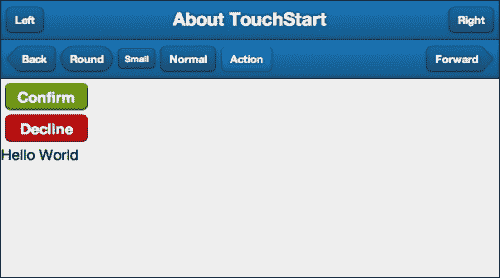
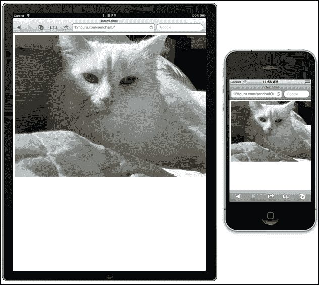

# 第三章：用户界面样式

现在我们已经了解了应用程序是如何组合在一起的，接下来我们将看看您可以使用的一些不同的视觉元素来定制您的应用程序。在本章中，我们将：

+   仔细观察工具栏和按钮，使用布局，以及其他样式和图标来提升用户界面的视觉吸引力

+   扩展我们之前关于图标的工作；这包括使用 Pictos 图标字体显示新图标

+   讨论与不同设备和屏幕尺寸一起工作时的一些考虑和捷径

+   使用 Sass 和 Compass 探索极其强大的 Sencha 主题引擎，以简单 CSS 样式命令创建复杂的视觉皮肤

# 样式组件与主题

在我们进入本章之前，了解样式化单个组件与创建主题之间的区别非常重要。

几乎 Sencha Touch 中的每一个显示组件都有设置自身样式的选项。例如，`panel`组件可以这样使用样式：

```js
{ 
 xtype: 'panel',
 style: 'border: none; font: 12px Arial black',
 html: 'Hello World'
}
```

样式也可以使用如下方式作为对象设置：

```js
{ 
 xtype: 'panel',
style : {
  'border' : 'none',
  'font' : '12px Arial black',
  'border-left': '1px solid black'
} 
html: 'Hello World'
}
```

### 提示

您会注意到在`style`块内部，我们对配置设置的两边都进行了引用。这仍然是 JavaScript 的正确语法，并且使用`style`块时这是一个非常好的习惯。这是因为许多标准 CSS 样式在其名称中使用连字符。如果我们不对`border-left`添加引号，JavaScript 会将此读作`border`减去`left`，并立即在错误堆中崩溃。

我们还可以为组件设置一个`style`类，并使用外部 CSS 文件如下定义该类：

```js
{ 
 xtype: 'panel',
 cls: 'myStyle',
 html: 'Hello World'
}
```

您的外部 CSS 文件可以以如下方式控制组件的样式：

```js
.myStyle {
 border: none;
 font: 12px Arial black;
}
```

这种基于类的显示控制被认为是最佳实践，因为它将样式逻辑与显示逻辑分开。这意味着当您需要更改边框颜色时，可以在一个文件中完成，而不是在多个文件中寻找单独的`style`设置。

这些样式选项对于控制个别组件的显示非常有用。还有一些样式元素，如边框、内边距和外边距，可以直接在组件的配置中设置：

```js
{ 
 xtype: 'panel',
 bodyMargin: '10 5 5 5',
 bodyBorder: '1px solid black',
 bodyPadding: 5,
 html: 'Hello World'
}
```

这些配置可以接受一个数字以应用于所有边，或者是一个 CSS 字符串值，如`1px solid black`或`10 5 5 5`。数字应不带引号输入，但 CSS 字符串值需要在引号内。

这些小的更改在样式化您的应用程序时可能会有所帮助，但如果您需要做一些更大的事情呢？如果您想要更改整个应用程序的颜色或外观呢？如果想要为按钮创建自己的默认样式呢？

这就是主题和 UI 样式发挥作用的地方。

# 工具栏和按钮的 UI 样式

让我们快速回顾一下在第二章，*创建一个简单应用程序*中创建的基本 MVC 应用程序，并使用它开始探索带有工具栏和按钮的样式。

首先，我们将向第一个面板添加一些内容，该面板包含我们的`titlebar`、`toolbar`和**你好世界**文本。

## 添加工具栏

在`app/views`中，你会发现`Main.js`。打开编辑器中的这个文件，看看我们项目列表中的第一个面板：

```js
items: [
  {
      title: 'Hello',
      iconCls: 'home',
      xtype: 'panel',
      html: 'Hello World',
      items: [
         {
            xtype: 'titlebar',
            docked: 'top',
            title: 'About TouchStart'
         }
     ]
  }...
```

我们将在现有工具栏的顶部添加第二个工具栏。定位`items`部分，在第一个工具栏的花括号后添加第二个工具栏，如下所示：

```js
{

 xtype: 'titlebar', 
 docked: 'top',
 title: 'About TouchStart'
}, {
 docked: 'top',
 xtype: 'toolbar',
 items: [
  {text: 'My Button'}
 ]}
```

不要忘记在两个工具栏之间加上逗号。

### 提示

**多余或缺少的逗号**

在 Sencha Touch 中工作时，导致解析错误的最常见原因之一是多余或缺少逗号。当你移动代码时，请确保你已经考虑到了任何散落或丢失的逗号。幸运的是，对于这些类型的解析错误，Safari 错误控制台通常会给我们一个关于查看哪一行的好主意。一个更详细的常见错误列表可以在以下网址找到：

[`javascript.about.com/od/reference/a/error.htm`](http://javascript.about.com/od/reference/a/error.htm)

现在当你查看第一个标签页时，你应该看到我们新的工具栏，以及左侧的新按钮。由于两个工具栏都有相同的背景，它们有点难以区分。所以，我们将使用`ui`配置选项更改底栏的外观：

```js
{
 docked: 'top',
 xtype: 'toolbar',
 ui: 'light',
 items: [
  {text: 'My Button'}
 ]
}
```

`ui`配置是 Sencha Touch 中特定样式集的简写。Sencha Touch 包含几个`ui`样式，我们将在本章后面向您展示如何创建自己的样式。


## 样式按钮

按钮也可以使用`ui`配置设置，为此它们提供了几个不同的选项：

+   `normal`：这是默认按钮

+   `back`：这是一个左侧缩成一点的按钮

+   `round`：这是一个更急剧圆角的按钮

+   `small`：这是一个更小的按钮

+   `action`：这是一个默认按钮的更亮版本（颜色根据主题的活跃颜色而变化，我们稍后会看到）

+   `forward`：这是一个右侧缩成一点的按钮

按钮还内置了一些`ui`选项的颜色。这些颜色选项是`confirm`和`decline`。这些选项与前面的形状选项结合使用连字符；例如，`confirm-small`或`decline-round`。

让我们添加一些新按钮，看看这些按钮在我们的屏幕上看起来如何。在第二个工具栏中找到带有按钮的`items`列表：

```js
items: [
  {text: 'My Button'}
]
```

用以下新的`items`列表替换那个旧的`items`列表：

```js
items: [
 {
  text: 'Back',
  ui: 'back'
 }, {
  text: 'Round',
  ui: 'round'
 }, {
  text: 'Small',
  ui: 'small'
 }, {
  text: 'Normal',
  ui: 'normal'
 }, {
  text: 'Action',
  ui: 'action'
 }, {
  text: 'Forward',
  ui: 'forward'
 }
]
```

这将在工具栏顶部产生一系列按钮。正如您所注意到的，我们的所有按钮都靠左对齐。您可以通过在您想要推向右边的按钮前面添加一个`spacer` xtype 来将按钮移到右边。尝试通过在我们`Forward`和`Action`按钮之间添加以下内容来实现：

```js
{ xtype: 'spacer'},
```

这将使`Forward`按钮移动到工具栏的右侧：


由于按钮实际上可以任何地方使用，我们可以在我们的标题栏添加一些按钮，并使用`align`属性来控制它们出现的位置。修改我们第一个`panel`的`titlebar`，并添加一个`items`部分，如下面的代码所示：

```js
{
  xtype: 'titlebar',
  docked: 'top',
  title: 'About TouchStart',
  items: [
    {
      xtype: 'button',
      text: 'Left',
      align: 'left'
    },
    {
      xtype: 'button',
      text: 'Right',
      align: 'right'
    }
  ]
}
```

现在我们标题栏应该有两个按钮，一个在标题的每一边：


我们还在`panel`容器中添加一些按钮，以便我们可以看到`ui`选项`confirm`和`decline`的样子。

在我们`HelloPanel`容器的`items`部分末尾，位于第二个工具栏后面添加以下内容：

```js
{
 xtype: 'button',
 text: 'Confirm',
 ui: 'confirm',
 width: 100
}, {
 xtype: 'button',
 text: 'Decline',
 ui: 'decline',
 width: 100
}
```

您可能会注意到，我们的面板按钮和工具栏按钮之间有两个不同之处。第一个是我们在我们面板中声明了`xtype:'button'`，但在我们的工具栏中没有声明。这是因为工具栏假设它将包含按钮，而`xtype`只有在您使用除按钮之外的内容时才需要声明。面板没有设置默认的`xtype`属性，所以面板中的每个项目都必须声明一个。

第二个区别是我们为按钮声明了`width`。如果我们不在面板中使用按钮时声明`width`，它将扩展到面板的整个宽度。在工具栏上，按钮会自动调整大小以适应文本。



您还会注意到我们面板中的两个按钮粘在一起。您可以通过为每个按钮配置部分添加`margin: 5`来将它们分开。

这些简单的样式选项可以帮助使您的应用程序更易于导航，并为用户提供了关于重要或潜在破坏性操作的视觉提示。

## 标签栏

底部的标签栏也理解`ui`配置选项。在这种情况下，可用的选项是`light`和`dark`。标签栏还根据`ui`选项改变图标的外观；`light`工具栏将具有深色图标，而`dark`工具栏将具有浅色图标。

这些图标实际上是名为**Pictos**的特殊字体的一部分。Sencha Touch 从版本 2.2 开始使用 Pictos 字体，以解决某些移动设备上的兼容性问题，而不是使用图像图标。

### 注意

来自 Sencha Touch 先前版本的图标遮罩可用，但已在 2.2 版本中被弃用。

您可以在`Ext.Button`组件的文档中看到一些可用的图标：

[`docs.sencha.com/touch/2.2.0/#!/api/Ext.Button`](http://docs.sencha.com/touch/2.2.0/#!/api/Ext.Button)

如果你对 Pictos 字体感到好奇，你可以通过访问[`pictos.cc/`](http://pictos.cc/)了解更多相关信息。

# Sencha Touch 主题

有时候你希望不仅仅改变一个单个的面板或按钮的外观。Sencha Touch 主题是快速改变应用程序整体外观和感觉的强大方式。我们将在本章后面覆盖主题化过程，但在开始之前我们需要做一些基础工作。需要覆盖的概念信息很多，但你所获得的灵活性将是值得努力的。

我们需要覆盖的第一个工具是 Sencha Touch 中用于使应用程序主题化可能的工具：Sass 和 Compass。

### 注意

如果你已经熟悉 Sass 和 Compass，你将会更舒适地先安装然后再覆盖概念。你可以跳到*设置 Sass 和 Compass*部分。

## 介绍 Sass 和 Compass

**Syntactically Awesome Stylesheets** (**Sass**)用于扩展标准 CSS，允许变量、嵌套、混合函数、内置函数和选择器继承。这意味着你的所有常规 CSS 声明都会正常工作，但你也会得到一些额外的福利。

### 在 Sass 中的变量

变量允许你定义具体的值，然后在样式表中使用它们。变量名称是任意的，以`$`开始。例如，我们可以使用 Sass 定义以下内容：

```js
$blue: #4D74C1;
$red: #800000;
$baseMargin: 10px;
$basePadding: 5px;
```

我们可以在 Sass 文件中的标准 CSS 声明中使用以下变量：

```js
.box1 {
border: 1px solid $blue;
padding: $basePadding;
margin: $baseMargin;
}
```

我们还可以按照以下方式使用基本数学函数：

```js
.box2 {
border: 1px solid $blue;
padding: $basePadding * 2;
margin: $baseMargin / 2;
}
```

这将创建一个具有两倍内边距和原始盒子一半外边距的盒子。这对于创建灵活、可扩展的布局非常不错。通过更改你的基本值，你可以快速扩展你的应用程序以应对具有多种分辨率和屏幕尺寸的多台设备。

另外，当你决定要更改你使用的蓝色阴影时，你只需要在一个地方更改。Sass 还有许多内置函数用于调整颜色，例如：

+   `darken`: 这个函数通过百分比使颜色变暗

+   `lighten`: 这个函数通过百分比使颜色变亮

+   `complement`: 这个函数返回互补色

+   `invert`: 这个函数返回反色

+   `saturate`: 这个函数通过数值来饱和颜色

+   `desaturate`: 这个函数通过数值来去色

这些函数允许你执行操作，例如：

```js
.pullQuote {
border: 1px solid blue;
color: darken($blue, 15%);
}
```

还有针对数字、列表、字符串和基本 if-then 语句的函数。这些函数可以帮助你的样式表像你的编程代码一样灵活。

### 小贴士

**Sass 函数**

Sass 函数的完整列表可以在[`sass-lang.com/docs/yardoc/Sass/Script/Functions.html`](http://sass-lang.com/docs/yardoc/Sass/Script/Functions.html)找到。

### Sass 中的混合函数

**混合函数**是 Sass 变量标准的一种变体。避免简单地声明一个一对一的变量，例如以下内容：

```js
$margin: 10px;
```

相反，你可以使用混合（mixin）来声明一个整个 CSS 类作为变量：

```js
@mixin baseDiv {
 border: 1px solid #f00;
 color: #333;
 width: 200px;
} 
```

然后你可以把这个混合（mixin）用在 Sass 文件中：

```js
#specificDiv {
 padding: 10px;
 margin: 10px;
 float: right;
 @include baseDiv;
}
```

这给了你 `baseDiv` 混合（mixin）组件的所有属性和在 `#specificDiv` 类中声明的具体样式。

你还可以让你的混合（mixin）使用参数来使其更加灵活。让我们看看我们之前看到的内容的一个替代版本：

```js
@mixin baseDiv($width, $margin, $float) {
 border: 1px solid #f00;
 color: #333;
 width: $width;
 margin: $margin;
 float: $float;
}
```

这意味着我们可以在 Sass 代码中为 `width`、`margin` 和 `float` 设置值，如下所示：

```js
#divLeftSmall {
 @include baseDiv(100px, 10px, left);
}
#divLeftBig{
 @include baseDiv(300px, 10px, left);
}
#divRightBig {
 @include baseDiv(300px, 10px, right);
}
#divRightAlert {
 @include baseDiv(100px, 10px, right);
 color: #F00;
 font-weight: bold;
}
```

这给了我们四个带有稍有不同的属性的 `div` 标签。它们都共享与混合（mixin） `baseDiv` 类相同的基属性，但它们的 `width` 和 `float` 值是不同的。我们也可以通过在我们包含混合（mixin）时像在我们的 `#divRightAlert` 示例中添加它们来覆盖混合（mixin） `baseDiv` 的值。

### Sass 中的嵌套

Sass 也允许嵌套 CSS 声明。这不仅能让你写出的样式更紧密地反映你的 HTML 结构，而且还能写出更清晰、更容易维护的代码。

在 HTML 中，我们经常嵌套彼此之间的元素以给文档结构。这种的一个常见例子是一个无序列表包含几个列表项，如下所示：

```js
<ul>
 <li>Main List Item 1</li>
 <li>Main List Item 2</li>
</ul>
```

通常，通过 CSS 样式这个列表，你会分别写 `ul` 元素的规则和 `li` 元素的规则。这两个规则在你的 CSS 文件中可能相隔很远，使得调试或修改样式更加困难。

在 Sass 中，我们可以写如下内容：

```js
ul {
 width: 150px;
 border: 1px solid red;

 li {
  margin: 1px;
  border: 1px solid blue;
 }

}
```

看看我们是怎样在 `ul` 的样式声明内嵌套 `li` 元素的样式声明的？嵌套不仅匹配 HTML 文档的结构，而且还能让你知道当需要更新 `li` 元素时，它是在 `ul` 元素内的。

当你用 Sass 编译这个时，生成的 CSS 为 `ul` 和 `li` 元素有分开的规则：

```js
ul {
 width: 150px;
 border: 1px solid red;
}
ul li {
 margin: 1px;
 border: 1px solid blue;
}
```

如果你在浏览器中查看这个列表，你会看到一个有红色边框的列表，每个单独的列表项周围还有蓝色边框。


使用和号（`&`）字符引用嵌套层级中的一级也是可能的。这在给嵌套元素添加悬停状态等事物时很有用，或者更一般地说，将你的规则的异常分组在一起。

假设我们想要在鼠标悬停在 `li` 元素上时改变背景色。我们可以在 `li` 样式声明内添加 `&:hover`：

```js
ul {
 width: 150px;
 border: 1px solid red;

 li {
  margin: 1px;
  border: 1px solid blue;

  &:hover {
   background-color: #B3C6FF;
  }

 }

}
```

Sass 编译器将 `&:hover` 转换为 `li:hover`：

```js
ul li:hover {
 background-color: #B3C6FF;
}
```

和号（`&`）特殊字符不必用在规则的开始处。比如说你的设计师有元素 `li`，当它们位于特殊的 `#sidebardiv` 组件内时，使用更大的边框。你可以在 `ul`/`li` 规则之后写一个单独的规则，或者使用特殊的 `&` 字符在 `li` 规则集中添加这个异常：

```js
ul {
 li {
  margin: 1px;
  border: 1px solid blue;

  &:hover {
   background-color: #B3C6FF;
  }
  div#sidebar& {
   border-width: 3px;
  }
 }
}
```

前面的代码将被翻译成以下规则：

```js
div#sidebar ul li { border-width: 3px; }
```

你也可以嵌套 CSS 命名空间。在 CSS 中，如果属性全部以相同的前缀开始，比如`font-`，那么你也可以嵌套它们：

```js
li {
 font: {
  family: Verdana;
  size: 18px;
  weight: bold;
 }
}
```

一定要记得在命名空间后面加上冒号。编译后，这将变为以下内容：

```js
li {
 font-family: Verdana;
 font-size: 18px;
 font-weight: bold;
}
```

这个方法适用于任何命名空间 CSS 属性，如`border-`或`background-`。

### Sass 中的选择器继承

Sass 中的选择器继承与 JavaScript 中的对象继承类似。同样，一个`panel`组件扩展了`container`对象，这意味着一个`panel`具有`container`的所有属性和功能，还有一些别的。Sass 让您拥有继承其他对象样式的对象。

假设我们想要为我们的应用程序创建一些消息框元素，一个用于信息性消息，一个用于错误。首先，我们需要定义一个通用框：

```js
.messageBox {
  margin: 10px;
  width: 150px;
  border: 1px solid;
  font: {
   size: 24px;
   weight: bold;
  }
}
```

现在，在任何我们想要包含`.messageBox`样式的类中，我们只需使用`@extend`指令`@extend .messageBox;`（单独一行）：

```js
.errorBox {
 @extend .messageBox;
 border-color: red;
 color: red;
}

.infoBox {
 @extend .messageBox;
 border-color: blue;
 color: blue;
}
```

然后，在 HTML 中，我们只需使用`.errorBox`和`.infoBox`类即可：

```js
<div class="infoBox">Here's some information you may like to have.</div>
<div class="errorBox">An unspecified error has occurred.</div>
```

把所有内容放在一起，你就会看到左边的盒子有一个蓝色的边框和蓝色的文本，右边的盒子有一个红色的边框和红色的文本：


### 指南针

正如 Sencha Touch 是建立在 JavaScript、CSS 和 HTML 这些低级语言之上的框架一样，Compass 也是建立在 Sass 和 CSS 之上的框架。Compass 为您应用程序的样式提供了一系列可重用的组件。这些包括：

+   **CSS 重置**：这能强制大多数 HTML 在所有主流网络浏览器中具有一致的外观。

+   **混合**：这些允许你为你的 CSS 声明复杂的程序化函数。

+   **布局和网格**：这些强制执行宽度和高度标准，以帮助保持跨所有页面的一致布局。

+   **图像雪碧**：这允许您自动从多个小图像生成单个图像（这对于浏览器下载来说更快）。CSS 将自动显示您需要的图像部分，隐藏其余部分。

+   **文本替换**：这允许您自动交换文档中特定文本片段。

+   **排版**：这为在您的网页中使用字体提供了高级选项。

Compass 还将其组件中融入最新的 CSS 最佳实践，这意味着你的样式表将会更简洁、更高效。

### Sass + Compass = 主题

Sencha Touch 主题通过提供变量和混合器，其功能性特定于 Sencha Touch，将 Sass 和 Compass 推进了一步。Sencha Touch 的 JavaScript 部分生成大量非常复杂的 HTML，以显示各种组件，如工具栏和面板。而不是学习所有 Sencha Touch 使用的复杂类和 HTML 技巧，你可以简单地使用适当的混合器来改变应用程序的外观。

# 设置 Sass 和 Compass

如果您决定要创建自己的 Sencha Touch 主题，则不需要安装 Sass 或 Compass，因为它们都包含在 Sencha Cmd 中。

然而，Windows 用户首先需要安装 Ruby。Ruby 用于将 Sass/Compass 文件编译成可用的主题。Linux 和 OS X 用户应该已经在他们的计算机上安装了 Ruby。

## 在 Windo

从[`rubyinstaller.org/`](http://rubyinstaller.org/)下载 Ruby 安装程序。

### 提示

我们建议下载版本 1.9.2，因为 Sencha Cmd 可能会与 Ruby 的新版本发生问题。

运行安装程序，并按照屏幕上的说明安装 Ruby。确保检查名为**将 Ruby 可执行文件添加到您的 PATH 中**的框。这将在以后命令行中为您节省很多输入。

安装完成后，打开 Windows 中的命令行，通过前往**开始** | **运行**，输入`cmd`，并按*Enter*键。这应该会打开命令行。

现在，尝试输入**ruby -v**。您应该会看到如下内容：

```js
C:\Ruby192>ruby -v
ruby 1.9.2p180 (2011-02-18) [i386-mingw32]

```

这意味着 Ruby 已经正确安装。

# 创建自定义主题

接下来我们需要做的是创建我们自己的主题 SCSS 文件。在`TouchStart/resources/sass`中找到`app.scss`文件，并复制该文件。将新复制的文件重命名为`myTheme.scss`。

更改文件名后，您需要将主题编译成应用程序可以读取的实际 CSS 文件。为此，我们需要回到命令行，移动到我们的`TouchStart/resources/sass`目录：

```js
cd /path/to/TouchStart/resources/sass

```

一旦进入目录，您可以输入以下命令：

```js
compass compile

```

这将编译我们新的主题，并在`resources/css`目录下创建一个名为`myTheme.css`的新文件。

### 提示

使用`compass compile`将目录中的任何`.scss`文件编译。每次更改`.scss`文件时，您都需要运行此命令。不过，您也可以使用命令`compass watch`来监视当前文件夹的任何更改，并自动编译它们。

既然我们已经有了新的 CSS 主题文件，接下来需要让应用程序加载它。在 Sencha Touch 的早期版本中，CSS 文件是从`index.html`文件中加载的。然而，由 Sencha Cmd 生成的应用程序实际上是从我们主`TouchStart`目录中的`app.json`文件中加载 CSS 文件的。

打开`app.json`，查找如下部分：

```js
"css": [
  {
     "path": "resources/css/app.css",
     "update": "delta"
  }
]
```

将此部分更改为：

```js
"css": [
  {
    "path": "resources/css/myTheme.css",
    "update": "delta"
  }
]
```

### 提示

**SCSS 和 CSS**

请注意，我们目前从`css`文件夹中包含了一个名为`sencha-touch.css`的样式表，并且在`scss`文件夹中有一个匹配的文件，名为`sencha-touch.scss`。当编译 SCSS 文件时，它们将在您的`css`文件夹中创建一个新文件。这个新文件将具有`.css`后缀，而不是`.scss`。

`.scss`是 Sass 文件的文件扩展名。

如果您在网页浏览器中重新加载应用程序，您将看不到任何变化，因为我们只是为我们的主题复制了文件。让我们看看我们如何改变这一点。打开您的`myTheme.scss`文件。您应该看到以下内容：

```js
@import 'sencha-touch/default';
@import 'sencha-touch/default/all';
```

这段代码抓取了所有默认的 Sencha Touch 主题信息。当我们运行`compass compile`或`compass watch`时，它会被编译并压缩成一个 CSS 文件，我们的应用程序可以阅读。

最好的部分是我们现在可以用一条代码就改变应用程序的整体颜色方案。

## 基本颜色

Sencha Touch 主题中的一个关键变量是`$base_color`。这个颜色及其变体在整个主题中都有使用。为了了解我们的意思，让我们将主题的颜色改为漂亮的森林绿，方法是在我们的`myTheme.scss`文件的顶部添加以下内容（在所有其他文本之上）：

```js
$base_color: #546346;
```

接下来，我们需要重新编译 Sass 文件以创建我们的`myTheme.css`文件。如果您正在运行`compass watch`，当您保存 Sass 文件时这将自动发生。如果没有，您需要像以前一样运行`compass compile`来更新 CSS（请记住，您需要从`resources/sass`目录中运行此命令）。

### 提示

**Compass 编译与 Compass 监控**

Compass 使用`compile`命令根据您的 SCSS 文件创建新的样式表。然而，您还可以设置 Compass 监控特定文件的更改，并在添加任何新内容时自动编译文件。这个命令在命令行中如下输入：

```js
compass watch filename

```

这个命令将一直保持活动状态，直到您的终端关闭。一旦您关闭终端窗口，您需要再次运行该命令，以便让 Compass 监控更改。

在 Safari 中重新加载页面，您应该看到我们应用程序的新森林绿色外观。

请注意，这一行代码为我们的深色和浅色工具栏创建了变体。更改基本颜色还改变了底部的标签栏图标。

这很酷，但如果我们要调整主题的个别部分呢？Sencha Touch 主题通过混合和`ui`配置选项为我们提供了 exactly 需要。

## 混合与 UI 配置

如我们之前提到的，Sencha 主题系统是一组预定义的混合和变量，它们被编译成 CSS 样式表。每个组件都有自己的混合和变量来控制样式。这意味着您可以覆盖这些变量或使用混合来定制您自己的主题。

您还可以使用混合（mixins）为`ui`配置选项创建额外选项（超出我们之前见过的简单的`light`和`dark`值）。例如，我们可以在`myTheme.sass`文件中添加一个新的混合来修改我们工具栏的颜色。

在我们的`myTheme.sass`文件中，找到如下行：

```js
@import 'sencha-touch/default/all';
```

在此行之后，添加以下行：

```js
@include sencha-toolbar-ui('subnav', #625546, 'matte');
```

这行代码告诉 Sass 为工具栏创建一个新的`ui`选项。我们新的选项将被称为`subnav`，它将具有`#625546`的基础颜色。最后一个选项设置了渐变的样式。可用的样式有：

+   `flat`：无渐变

+   `matte`：一个细微的渐变

+   `bevel`：一个中等渐变

+   `glossy`：一个玻璃样式渐变

+   `recessed`：一个反转的渐变

你可以在 Sencha Touch 文档的每个组件顶部找到有关这些变量（和任何可用的混合剂）的额外信息：[`docs.sencha.com/touch/2.2.0/`](http://docs.sencha.com/touch/2.2.0/)。


保存文件后，你需要在命令行使用`compass compile`命令重新编译样式表。

我们还需要更改 JavaScript 文件中的`ui`配置选项。在`app/view`文件夹中找到我们的`Main.js`文件并打开它。找到我们应用程序中的第二个工具栏，就在我们添加按钮的上方。它应该如下所示：

```js
dock: 'top',
xtype: 'toolbar',
ui: 'light'
```

你需要将`ui:'light'`改为`ui:'subnav'`并保存文件。

然后你可以重新加载页面以查看你的更改。


你还会注意到，工具栏内的按钮也调整了它们的颜色以匹配新工具栏的`ui`配置。

## 添加新图标

如我们在本章开头提到的，Sencha Touch 的早期版本使用图标遮罩来创建应用程序中的图标。这导致了一些与浏览器兼容性问题，所以新图标实际上是从 Pictos 图标字体生成的。默认情况下，包含这 26 个图标，但你可以使用`icon`混合剂添加更多。

### 注意

Sencha Touch 中可用的默认图标列表可以在[`docs.sencha.com/touch/2.2.0/#!/api/Ext.Button`](http://docs.sencha.com/touch/2.2.0/#!/api/Ext.Button)找到。

Pictos 图标的完整列表可以在[`pictos.cc/font/`](http://pictos.cc/font/)找到。

在你的`myTheme.sass`文件中，找到写着以下内容的行：

```js
@import 'sencha-touch/default/all';
```

此行之后，请添加以下内容：

```js
@include icon('camera', 'v'); 
```

`icon`混合剂有两个参数：你想要引用图标的名称（这是任意的）以及 Pictos 字体中图标的相应字母。第二个参数可以在前面提示中提到的 Pictos 网站上查找。

样式表重新编译后，我们可以在面板中更改`iconCls`值以使用新图像。

在`app/Main.js`文件中，找到我们的`HBox`面板的`iconCls`，目前显示为：

```js
iconCls: 'info',
```

用以下内容替换该行：

```js
iconCls: 'camera',
```

保存你的更改并重新加载页面以查看你的新图标。不要忘记在命令行使用`compass compile`重新编译 Sass 文件。

## 变量

变量也适用于大多数组件，并用于控制特定的颜色、大小和外观选项。与混合剂不同，变量针对组件的单一设置。例如，`button`组件包括以下变量的变量：

+   `$button-gradient`：所有按钮的默认渐变

+   `$button-height`：所有按钮的默认高度

+   `$button-radius`：所有按钮的默认边框半径

+   `$button-stroke-weight`：所有按钮的默认边框厚度

如前所述，您可以在每个组件的顶部找到这些变量（和任何可用的混合）的列表，在 Sencha Touch 文档中[`docs.sencha.com/touch/2.2.0/`](http://docs.sencha.com/touch/2.2.0/)。

例如，如果我们向我们的`myTheme.scss`文件添加`$button-height: 2em;`，然后我们可以重新编译并看到我们工具栏中的按钮现在比之前要大。


您还会注意到我们的**小型**按钮大小没有改变。这是因为它的 UI 配置（`small`）已经单独定义，并包括了一个特定的高度。如果您想更改这个按钮的大小，您需要在`Main.js`文件中删除它的`ui`配置。

## 更多 Sass 资源

使用 Sencha Touch 主题中包含的混合和变量，您可以几乎改变界面的任何方面，使其完全按照您想要的方式显示。有许多在线资源可以帮助您深入了解 Sass 和 Compass 的所有可能性。

### 注意

**更多资源**

Sencha Touch 主题混合和变量的完整列表可在[`dev.sencha.com/deploy/touch/docs/theme/`](http://dev.sencha.com/deploy/touch/docs/theme/)找到。

详细了解 Sass，请访问[`sass-lang.com/`](http://sass-lang.com/)。

Compass 官网提供了使用 Compass 的网站示例、教程、帮助等内容；您可以访问[`compass-style.org/`](http://compass-style.org/)。

# 默认主题和主题切换

随着 Sencha Touch 2.2 的推出，现在支持 Blackberry 10 和 Windows Phone 平台。为了帮助您为这些平台样式化您的应用程序，Sencha Touch 2.2 包括两个平台的默认主题。让我们通过创建几个新的主题文件来了解这是如何工作的。

首先，将我们的原始`resources/sass/app.scss`文件复制两份，并将它们重命名为`windows.scss`和`blackberry.scss`。

在两个文件中，找到以下行：

```js
@import 'sencha-touch/default';
@import 'sencha-touch/default/all';
```

在`windows.scss`中，将行更改为：

```js
@import 'sencha-touch/windows';
@import 'sencha-touch/windows/all';
```

在`blackberry.scss`中，将行更改为：

```js
@import 'sencha-touch/bb10';
@import 'sencha-touch/bb10/all';
```

接下来，您需要运行`compass compile`以创建新的 CSS 文件。

现在我们可以使用我们的`app.json`文件根据应用程序运行的平台来切换这些主题。打开`app.json`文件，再次查找我们的`css`部分。它应该如下所示：

```js
"css": [
        {
            "path": "resources/css/myTheme.css",
            "update": "delta"
        }
    ]
```

让我们将其更改为如下所示：

```js
"css": [
 {
  "path": "resources/css/myTheme.css",
  "platform": ["chrome", "safari", "ios", "android", "firefox"],
  "theme": "Default",
  "update": "delta"
 },
 {
  "path": "resources/css/windows.css",
  "platform": ["ie10"],
  "theme": "Windows",
  "update": "delta"
 },
 {
  "path": "resources/css/blackberry.css",
  "platform": ["blackberry"],
  "theme": "Blackberry",
  "update": "delta"
 }
   ]
```

由于我们大多数人并不富有，我们可能没有每种类型的设备来测试。然而，我们可以在我们应用程序 URL 的末尾添加一个参数，以测试我们的每个主题。例如：

[`myapplication.com?platform=ie10`](http://myapplication.com?platform=ie10)

这将会在应用程序中自动处理，但我们可以通过向 URL 添加这个参数来测试我们的应用程序。我们应该现在有了基于平台的三种不同的主题。


我们可以根据这些三个选项之外的条件来制作这些条件主题。可用的平台有：

+   电话、平板电脑和桌面

+   iOS、Android 和 Blackberry

+   Safari、Chrome、IE 10 和 Firefox

这意味着我们可以根据前面列表中提到的任何平台来更改样式。只需生成新的 Sass/CSS 样式表，并在`app.json`中包含适当的配置行，就像之前的示例一样。

这类条件样式的微调将帮助您的应用程序在多种设备上保持可读性和易用性。

# 使用 Sencha.io Src 在不同设备上的图片

如果您的应用程序使用图片，那么您可能需要比前面部分使用的条件样式更健壮的东西。为每个设备创建单独的图片集将是一场噩梦。幸运的是，Sencha 的团队对这个问题的解决办法是一个名为`Sencha.io Src`的基于 Web 的服务。

`Sencha.io Src`是 Sencha 的一个独立服务，可以用于任何基于 Web 的应用程序。该服务通过获取原始图片并实时调整大小以适应当前设备和屏幕大小来工作。这些图片也被服务缓存并优化，以便快速、重复交付。要使用`Sencha.io Src`服务，您需要更改的只是图片的 URL。

例如，一个基本的 HTML 图片标签看起来像这样：

```js

```

使用`Sencha.io Src`服务的同一个图片标签看起来像这样：

```js

```

这个过程会将您图片的实际 URL 传递给系统进行处理。

### 注意

**Sencha.io Src 中的图片 URL**

正如您在示例中看到的，我们使用了一个完整的图片 URL（带有[`www.mydomain.com/`](http://www.mydomain.com/)），而不是一个更短的相对 URL（例如`/images/my-big-image.jpg`）。由于`Sencha.io Src`服务需要能够直接从主`Sencha.io`服务器获取文件，所以相对 URL 不起作用。图片文件需要放在一个可以向公众公开的 Web 服务器上，才能正确工作。



使用这个服务，我们的大图片将根据我们使用的设备屏幕大小调整到全宽，无论设备的大小如何。`Sencha.io Src`还能保持图片的比例正确，不会出现压缩或拉伸的情况。

## 使用 Sencha.io Src 指定大小

我们并不总是在我们应用程序中使用全屏图片。我们经常用它们来作为应用程序中的图标和强调元素。`Sencha.io Src`还允许我们为图片指定特定的高度和/或宽度：

```js

```

在这种情况下，我们已经将需要调整大小的图片宽度设置为`320`像素，高度设置为`200`像素。我们还可以只限制宽度；高度将自动设置为正确的比例：

```js

```

### 提示

需要注意的是`Sencha.io Src`只会缩小图片；它不会放大它们。如果你输入的值大于实际图片的尺寸，它将 simply display at the full image size. 你的全尺寸图片应始终是你用于展示所需的最大尺寸。

### 通过公式确定大小

我们还可以使用公式根据设备屏幕大小进行更改。例如，我们可以使用以下代码使我们的照片比屏幕的全宽窄 20 像素：

```js

```

如果你想要在图片周围留出一点边框，这个选项很有用。

### 通过百分比确定大小

我们还可以使用百分比宽度来设置图片大小：

```js

```

我们 URL 中的`x50`部分将图片大小设置为屏幕宽度的 50%。

我们甚至可以将这两个元素结合起来创建一个可伸缩的图片库：

```js


```

使用公式`-20x50-5`，我们取原始图片，为边距去掉 20 像素，将其缩小到 50%，然后去掉额外的五像素，以允许两张图片之间有空间。


## 更改文件类型

`Sencha.io Src`提供了一些可能很有用的额外选项。首先，它让你可以实时更改图片的文件类型。例如，以下代码会将你的 JPG 文件转换为 PNG：

```js

```

当向应用程序用户提供多个图片下载选项时，这个选项很有用。

此选项还可以与调整大小选项结合使用：

```js

```

这将把文件转换为 PNG 格式并将其缩放到 50%。

使用`Sencha.io Src`中可用的功能，您可以自动调整应用程序中的图片大小，并在多种设备上提供一致的外观和感觉。

### 注意

Sencha.io 是一个免费服务。要获取使用`Sencha.io Src`的所有功能的完整列表，请访问：

[`www.sencha.com/learn/how-to-use-src-sencha-io/`](http://www.sencha.com/learn/how-to-use-src-sencha-io/)

# 总结

在这一章中，我们学习了如何使用`ui`配置选项来样式化工具栏。我们还讨论了 Sencha Touch 如何使用 Sass 和 Compass 创建一个健壮的主题系统。我们包括了 Sass 和 Compass 的安装说明，并解释了混合模式、变量、嵌套和选择器继承。最后，我们提到了为多种设备设计界面以及使用`Sencha.io Src`处理自动调整图片大小的方法。

在下一章中，我们将重新深入研究 Sencha Touch 框架。我们将回顾一下我们之前学过的关于组件层次结构的知识。然后，我们将介绍一些更专业的组件。最后，我们会给你一些在 Sencha Touch API 文档中找到所需信息的技巧。
