# 第四章：组件和配置

在本章中，我们将更深入地查看 Sencha Touch 中可用的各个组件。我们将检查布局配置选项以及它们如何影响每个组件。

在本章中，我们将使用简单的基组件作为学习更复杂组件的起点。我们还会稍微谈谈如何在组件创建后访问它们。

最后，我们将总结如何使用 Sencha Touch API 文档来查找每个组件的详细配置、属性、方法和事件信息。

本章将涵盖以下主题：

+   基组件类

+   布局重新审视

+   标签面板和轮播组件

+   表单面板组件

+   消息框和弹幕

+   地图组件

+   列表和嵌套列表组件

+   在哪里查找有关组件的更多信息

# 基组件类

当我们谈论 Sencha Touch 中的组件时，我们通常是指按钮、面板、滑块、工具栏、表单字段和其他我们可以在屏幕上看到的实际项目。然而，所有这些组件都继承自一个具有惊人原创名称的单一基础组件`component`。这显然可能会导致一些混淆，所以我们将把这个称为`Ext.Component`。

理解最重要的一点是，你并不总是直接使用`Ext.Component`。它更常作为 Sencha Touch 中所有其他组件的构建块。然而，熟悉基组件类是很重要的，因为只要它能做，所有其他组件都能做。学习这个类可以让你在所有其他事情上有一个巨大的优势。`Ext.Component`一些最有用的配置选项如下：

+   `border`

+   `cls`

+   `disabled`

+   `height`/`width`

+   `hidden`

+   `html`

+   `margin`

+   `padding`

+   `scroll`

+   `style`

+   `ui`

像我们将在本章后面覆盖的其他组件一样，继承自基组件类，它们都会有这些相同的配置选项。这些配置中最关键的是`layout`。

# 再次审视布局

当你开始创建自己的应用程序时，你需要充分理解不同的布局如何影响你在屏幕上看到的内容。为此，我们将从演示应用程序开始，展示不同的布局是如何工作的。

### 注意

为了这个演示应用程序的目的，我们将一次创建不同的组件，作为单独的变量。这样做是为了可读性，不应被视为最佳编程风格。记住，以这种方式创建的任何项目都会占用内存，即使用户从未查看组件：

```js
var myPanel = Ext.create('Ext.Panel', { …
```

始终创建你的组件，使用`xtype`属性，在你的主容器内，如下面的代码片段所示，是一个更好的做法：

```js
items: [{ xtype: 'panel', …
```

这允许 Sencha Touch 在需要时渲染组件，而不是在页面加载时一次性渲染所有组件。

## 创建一个卡片布局

首先，我们将创建一个简单的应用程序，其包含一个配置为使用`card`布局的容器：

```js
var myApp = Ext.create('Ext.Application', {
    name:'TouchStart',
    launch:function () {
        var mainPanel = Ext.create('Ext.Container', {
            fullscreen:true,
            layout:'card',
            cardSwitchAnimation:'slide',
            items:[hboxTest]
        });

        Ext.Viewport.add(mainPanel);
    }
});
```

这设置了一个名为`mainPanel`的单一容器，具有`card`布局。这个`mainPanel`容器是我们将在本节中添加我们布局示例容器的剩余部分的地方。

`card`布局将其项目安排得类似于卡片堆叠。这些卡片中只有一张是激活的并一次显示。`card`布局将任何额外的卡片保留在后台，并在面板接收到`setActiveItem()`命令时仅创建它们。

列表中的每个项目可以通过使用`setActiveItem(n)`激活，其中*n*是项目编号。这可能会有些令人困惑，因为项目的编号是基于零的，这意味着你从 0 开始计数，而不是从 1 开始。例如，如果你想要激活列表中的第四个项目，你会使用：

```js
mainPanel.setActiveItem(3);
```

在此案例中，我们起初只有一个名为`hboxTest`的单一卡片/项目。我们需要添加这个容器以使我们的程序运行。

## 创建一个 hbox 布局

在前面的部分的代码中，在`var mainPanel = Ext.create('Ext.Container', {`行上方，添加以下代码：

```js
var hboxTest = Ext.create('Ext.Container', {
    layout:{
        type:'hbox',
        align:'stretch'
    },
    items:[
        {
            xtype:'container',
            flex:1,
            html:'My flex is 1',
            margin:5,
            style:'background-color: #7FADCF'
        },
        {
            xtype:'container',
            flex:2,
            html:'My flex is 2',
            margin:5,
            style:'background-color: #7FADCF'
        },
        {
            xtype:'container',
            width:80,
            html:'My width is 80',
            margin:5,
            style:'background-color: #7FADCF'
        }
    ]
});
```

这给了我们一个具有`hbox`布局和三个子项目的容器。

### 提示

**子项与父项**

在 Sencha Touch 中，我们经常发现自己处理非常大量的项目，这些项目被嵌套在容器中，而这些容器又被嵌套在其他容器中。通常，将容器称为其包含的任何项目的父容器是有帮助的。这些项目被称为容器的子项目。

`hbox`布局将其项目横向堆叠，并使用`width`和`flex`值来确定其每个子项目将占据多少横向空间。`align: 'stretch'`配置导致项目拉伸以填充所有可用的垂直空间。

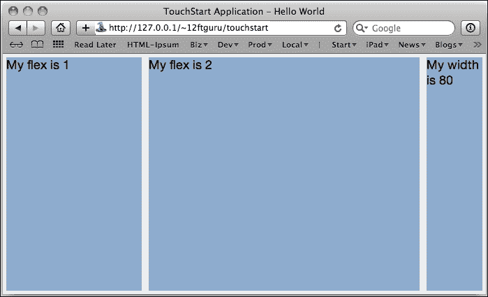

你应该尝试调整`flex`和`width`值，看看它们如何影响子容器的尺寸。你还可以更改`align`（`center`、`end`、`start`和`stretch`）的可选配置选项，以查看可用的不同选项。完成之后，让我们继续向我们的卡片布局添加更多项目。

## 创建一个 vbox 布局

在我们的`var hboxTest = Ext.create('Ext.Container',{`行上方，添加以下代码：

```js
var vboxTest = Ext.create('Ext.Container', {
    layout:{
        type:'vbox',
        align:'stretch'
    },
    items:[
        {
            xtype:'container',
            flex:1,
            html:'My flex is 1',
            margin:5,
            style:'background-color: #7FADCF'
        },
        {
            xtype:'container',
            flex:2,
            html:'My flex is 2',
            margin:5,
            style:'background-color: #7FADCF'
        },
        {
            xtype:'container',
            height:80,
            html:'My height is 80',
            margin:5,
            style:'background-color: #7FADCF'
        }
    ]
});
```

这代码与我们的之前的`hbox`代码几乎一模一样，一个具有三个子容器的容器。然而，这个父容器使用`layout: vbox`，`items`列表中的第三个子容器使用`height`而不是`width`。这是因为`vbox`布局是垂直堆叠其项目，并使用`height`和`flex`的值来确定子项目将占据多少空间。在这个布局中，`align: 'stretch'`配置导致项目伸展以填满水平空间。

现在我们已经有了我们的`vbox`容器，我们需要将其添加到我们主`layoutContainer`中的项目。将`layoutContainer`中的`items`列表更改为以下内容：

```js
items: [hboxTest, vboxTest]
```

如果我们现在运行代码，它看起来会和之前一模一样。这是因为我们的卡片布局`layoutContainer`中只能有一个活动项目。您可以通过向我们的`layoutContainer`添加以下配置来设置`layoutContainer`显示我们的新`vbox`：

```js
activeItem: 1,
```

记住我们的项目是从零开始编号的，所以项目`1`是我们列表中的第二个项目：`items: [hboxTest, vboxTest]`。

现在您应该能够看到我们应用程序的`vbox`布局：

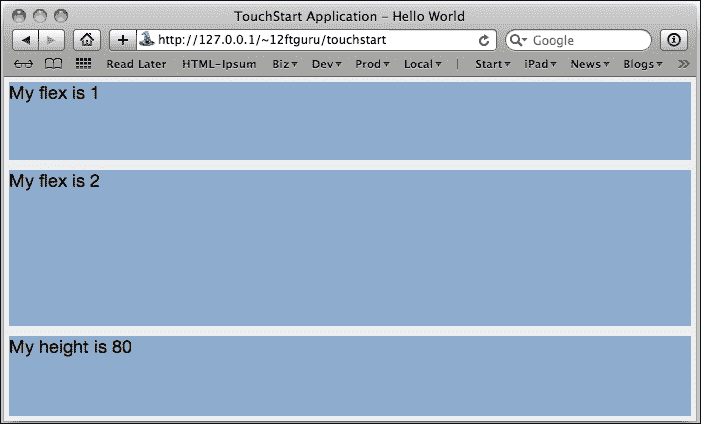

与`hbox`一样，您应该花点时间调整`flex`和`width`值，看看它们如何影响容器的大小。您还可以更改`align`（`center`、`end`、`start`和`stretch`）的可选配置选项，以查看不同的选项。完成后，让我们继续向我们的`card`布局添加更多项目。

## 创建合适的布局

`fit`布局是最基本的布局，它只是使任何子项目填满父容器。虽然这看起来相当基础，但它也可能有一些 unintended consequences，正如我们在例子中所见。

在我们之前的`var vboxTest = Ext.create(`'`Ext.Container', {`行上，添加以下代码：

```js
var fitTest = Ext.create('Ext.Container', {
    layout:'fit',
    items:[
        {
            xtype:'button',
            ui:'decline',
            text:'Do Not Press'
        }
    ]
});
```

这是一个具有`fit`布局的单容器和按钮。现在，我们只需要在我们的主`layoutContainer`组件上设置`activeItem`配置，将`activeItem: 1`更改为`activeItem: 2`。

如果您现在重新加载页面，您将看到我们所说的 unintended consequences：

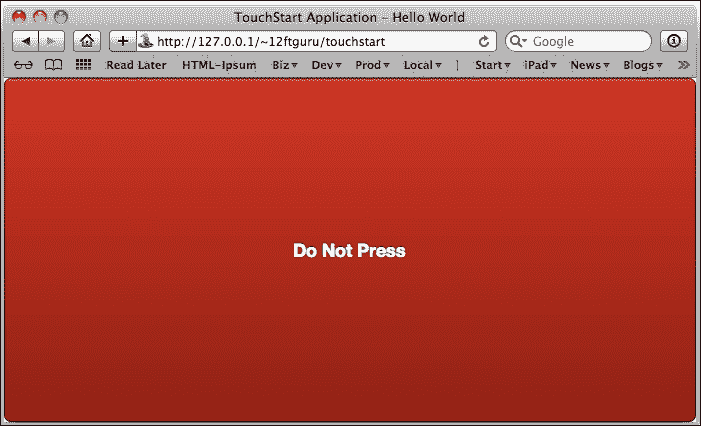

正如您所看到的，我们的按钮已经扩展到填满整个屏幕。我们可以通过为按钮（以及我们放置在这个容器中的任何其他项目）声明一个特定的高度和宽度来更改此情况。然而，适合布局通常最适合单个项目，该项目旨在占据整个容器。这使得它们成为子容器的一个很好的布局，在这种情况下，父容器控制整体大小和位置。

让我们看看这可能如何工作。

## 增加复杂度

在这个例子中，我们将创建一个嵌套容器并添加到我们的卡片堆叠中。我们还将添加一些按钮，以便更容易切换卡片堆叠。

我们两个新容器是我们当前应用程序中已经拥有的变体。第一个是我们`hbox`布局的副本，有几个小的变化：

```js
var complexTest = Ext.create('Ext.Container', {
    layout:{
        type:'vbox',
        align:'stretch'
    },
    style:'background-color: #FFFFFF',
    items:[
        {
            xtype:'container',
            flex:1,
            html:'My flex is 1',
            margin:5,
            style:'background-color: #7FADCF'
        },
        hboxTest2,
        {
            xtype:'container',
            height:80,
            html:'My height is 80',
            margin:5,
            style:'background-color: #7FADCF'
        }
    ]
});
```

你可以复制并粘贴我们旧的`vboxTest`代码，并将第一行更改为说`complexTest`而不是`vboxTest`。你还需要删除我们`items`列表中的第二个容器（包括所有括号）并用`hboxTest2`替换它。这是我们将在其中嵌套具有自己布局的另一个容器的位置。

现在，我们需要通过复制我们之前的`hboxTest`代码来定义`hboxTest2`，并进行一些小的修改。你需要将这段新代码粘贴到你放置`complexTest`代码的地方；否则，在我们实际定义它之前尝试使用`hboxTest2`时，你会得到错误：

```js
var hboxTest2 = Ext.create('Ext.Container', {
    layout:{
        type:'hbox',
        align:'stretch'
    },
    flex:2,
    style:'background-color: #FFFFFF',
    items:[
        {
            xtype:'container',
            flex:1,
            html:'My flex is 1',
            margin:5,
            style:'background-color: #7FADCF'
        },
        {
            xtype:'container',
            flex:2,
            html:'My flex is 2',
            margin:5,
            style:'background-color: #7FADCF'
        },
        {
            xtype:'container',
            width:80,
            html:'My width is 80',
            margin:5,
            style:'background-color: #7FADCF'
        }
    ]
});
```

粘贴代码后，你需要将变量名更改为`hboxTest2`，并且我们需要为主父容器添加一个`flex`配置。由于这个容器嵌套在我们的`vbox`容器中，`flex`配置需要定义`hboxTest2`将占据多少空间。

在我们查看这个新的复杂布局之前，让我们通过添加一些按钮来简化我们的工作，以便在各种布局卡之间切换。

定位`mainPanel`，在它下面，定义`items`列表的地方，在`items`列表的最上面添加以下代码：

```js
{
    xtype:'toolbar',
    docked:'top',
    defaults:{
        xtype:'button'
    },
    items:[
        {
            text:'hbox',
            handler:function () {
                mainPanel.setActiveItem(0);
            }
            text:'vbox',
            handler:function () {
                mainPanel.setActiveItem(1);
            }
        },
        {
            text:'fit',
            handler:function () {
                mainPanel.setActiveItem(2);
            }
        },
        {
            text:'complex',
            handler:function () {
                mainPanel.setActiveItem(3);
            }
        }
    ]
}
```

这段代码在`mainPanel`的顶部添加了一个工具栏，每个布局卡片都有一个按钮。

### 提示

在 Sencha Touch 的早期版本中，`toolbar`项是独立于其他项定义的，并使用一个名为`dock`的配置来控制其位置。在当前版本中，`toolbar`组件与其他项一起内联定义，而工具栏的位置则由`docked`配置控制。

每个按钮都有一个文本配置，作为按钮的标题，还有一个`handler`配置。`handler`配置定义了按钮被点击时会发生什么。对于我们每个按钮，我们在代码中使用之前设置的`mainPanel`变量：

```js
var mainPanel = Ext.create('Ext.Container', {…
```

这让我们可以使用容器及其`card`布局可用的任何方法。在每按钮的代码中，我们通过使用以下代码行来设置活动项（哪个标签页是可见的）：

```js
mainPanel.setActiveItem(x);
```

在此情况下，`x`值将被替换为我们想要激活的项的索引（记住这些是按顺序排列的，从 0 开始，而不是 1）。

注意我们还在`mainPanel`组件的`activeItem`初始配置选项中留下了空位。这将控制我们的应用程序启动时显示哪个项。

如果你刷新页面，你应该能够点击按钮并看到我们的各种布局，包括新的复杂布局。

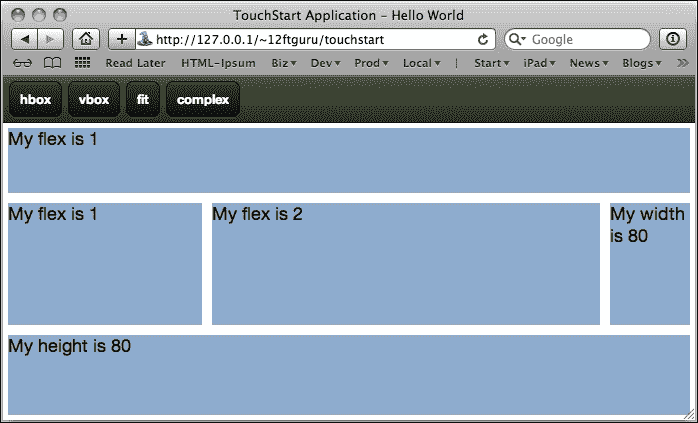

从这个例子中，您可以看到我们的`vbox`布局将窗口分为三行。第二行的`hbox`布局将其分为三列。使用这些嵌套布局类型可以非常容易地创建传统布局，例如电子邮件或社交网络应用程序中使用的布局。

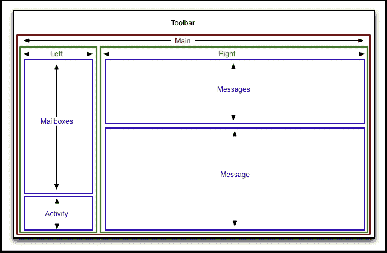

在这个例子中，我们有一个典型电子邮件应用程序的布局。这个布局可以从概念上分解为以下几个部分：

+   具有**工具栏**菜单的应用程序容器和一个称为**主**的单个容器，具有适合布局。

+   **主**容器将有一个`hbox`布局和两个子容器，分别称为**左侧**和**右侧**。

+   **左侧**容器将有一个`flex`值为`1`和一个`vbox`布局。它将有两个子容器，分别称为**邮箱**（具有`flex`为`3`）和**活动**（具有`flex`为`1`）。

+   **右侧**容器将有一个`flex`值为`3`和一个`vbox`布局。它还将有两个子容器，分别称为**消息**（具有`flex`为`1`）和**消息**（具有`flex`为`2`）。

构建此类容器布局是一种良好的实践。要查看此容器布局的示例代码，请查看代码包中的`TouchStart2b.js`文件。创建这些基本布局作为模板以快速启动构建您未来的应用程序也是一个好主意。

现在我们已经更好地了解了布局，让我们来看看我们可以在布局中使用的某些组件。

# 标签面板和轮播组件

在我们最后一个应用程序中，我们使用按钮和`card`布局创建了一个可以在不同的子项之间切换的应用程序。虽然应用程序经常需要以这种方式（使用您自己的按钮和代码）进行编程，但您也可以选择让 Sencha Touch 自动设置此操作，使用`TabPanel`或`Carousel`。

## 创建标签面板组件

当您需要让用户在多个视图之间切换时，`TabPanel`组件非常有用，例如联系人、任务和设置。`TabPanel`组件自动生成布局的导航，这使其成为应用程序主要容器的非常有用功能。

在我们第二章的早期示例应用程序中，*创建一个简单应用程序*，使用了一个简单的`TabPanel`来形成我们应用程序的基础。以下是一个类似的代码示例：

```js
Ext.application({
    name:'TouchStart',
    launch:function () {
        var myTabPanel = Ext.create('Ext.tab.Panel', {
            fullscreen:true,
            tabBarPosition:'bottom',
            items:[
                {
                    xtype:'container',
                    title:'Item 1',
                    fullscreen:false,
                    html:'TouchStart container 1',
                    iconCls:'info'
                },
                {
                    xtype:'container',
                    html:'TouchStart container 2',
                    iconCls:'home',
                    title:'Item 2'
                },
                {
                    xtype:'container',
                    html:'TouchStart container 3',
                    iconCls:'favorites',
                    title:'Item 3'
                }
            ]
        });
        Ext.Viewport.add(myTabPanel);
    }
});
```

在这段代码中，`Ext.tab.Panel`会自动生成一个卡片布局；您不需要声明一个布局。您可能希望为组件声明一个`tabBarPosition`值。这是您的标签将自动出现的地方；默认情况下在屏幕的顶部。

这将为`items`列表中的每个子项生成一个大的正方形按钮。按钮还将使用`iconCls`值分配一个图标给按钮。`title`配置用于给按钮命名。

### 提示

有关可用的图标和样式信息，请参阅上一章关于`tab panel`的更多信息。还应注意的是，这些图标只在`tabBarPosition`值设置为`bottom`时使用。

如果你将`tabBarPosition`值设置为顶部（或者留空），它会使按钮变小且变圆。它还会消除图标，即使你在子项目中声明了`iconCls`值。

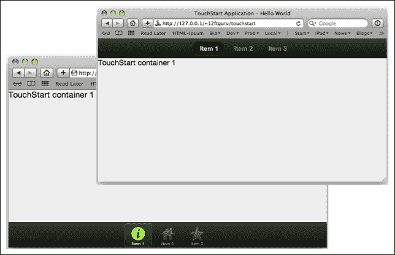

## 创建一个 Carousel 组件

`Carousel`组件与`tabpanel`类似，但它生成的导航更适合于幻灯片展示等事物。它可能不会像应用程序的主界面那样出色，但它确实作为在一个可滑动的容器中显示多个项目的方式表现良好。

与`tabpanel`类似，`Carousel`收集其子项目，并自动将它们安排在一个`card`布局中。实际上，我们实际上可以对我们之前的代码进行一些简单的修改，使其成为一个`Carousel`组件：

```js
Ext.application({
    name:'TouchStart',
    launch:function () {
        var myCarousel = Ext.create('Ext.carousel.Carousel', {
            fullscreen:true,
            direction:'horizontal',
            items:[
                {
                    html:'TouchStart container 1'
                },
                {
                    html:'TouchStart container 2'
                },
                {
                    html:'TouchStart container 3'
                }
            ]
        });
        Ext.Viewport.add(myCarousel);
    }
});
```

我们首先使用`Ext.create`创建了一个新的`Ext.carousel.Carousel`类，而不是一个新的`Ext.tab.Panel`类。我们还添加了一个`direction`配置，可以是`horizontal`（从左到右滚动）或`vertical`（向上或向下滚动）。

我们移除了停靠工具栏，因为正如我们将看到的，`Carousel`不需要它。我们还将每个子项目的图标类和标题移除，原因相同。最后，我们移除了`xtype`配置，因为`Carousel`组件会为每个子项目自动创建一个`Ext.Container`类。

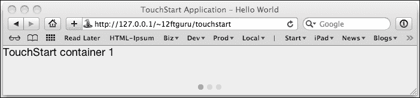

与`tabpanel`不同，`carousel`没有按钮，只在底部有一系列圆点，每个子项目都有一个圆点。虽然使用圆点进行导航是可能的，但`carousel`组件会自动设置以响应触摸屏上的滑动。你可以在浏览器中通过点击并按住鼠标指针，同时水平移动它来复制这个手势。如果你在`carousel`中声明了一个`direction: vertical`配置，你还可以垂直滑动以在子项目之间移动。

与章节开头我们的示例中的卡片布局类似，`tabpanel`和`carousel`组件都理解`activeItem`配置。

这让你可以设置应用程序首次加载时显示哪个项目。此外，它们都理解`setActiveItem()`方法，该方法允许你在应用程序加载后更改选中的子项目。

`Carousel`组件还有`next()`和`previous()`方法，允许你按顺序遍历项目。

需要注意的是，由于`tabpanel`和`carousel`都继承自`Ext.Container`，它们也理解容器理解的所有方法和配置。

与容器一样，`tabpanel`和`carousel`将是大多数应用程序的主要起点。然而，在某个时候，你可能还想使用另一种容器：`FormPanel`组件。

# 创建 FormPanel 组件

`FormPanel`组件是`Ext.Container`组件的一个非常特殊的版本，正如名称暗示的那样，它被设计用来处理表单元素。与面板和容器不同，您不需要为`formpanel`指定布局。它自动使用自己的特殊表单布局。

创建`formpanel`组件的基本示例如下：

```js
var form = Ext.create('Ext.form.FormPanel', {
 items: [
  {
   xtype: 'textfield',
   name : 'first',
   label: 'First name'
  },
  {
   xtype: 'textfield',
   name : 'last',
   label: 'Last name'
  },
  {
   xtype: 'emailfield',
   name : 'email',
   label: 'Email'
  }
 ]
});
```

在这个例子中，我们只是创建了一个面板，并为表单中的每个字段添加了项目。我们的`xtype`告诉表单要创建什么类型的字段。我们可以将此添加到我们的`carousel`中，替换我们的第一个容器，如下所示：

```js
Ext.application({
    name:'TouchStart',
    launch:function () {
        var myCarousel = Ext.create('Ext.carousel.Carousel', {
            fullscreen:true,
            direction:'horizontal',
            items:[
                form, {
                    html:'TouchStart container 2'
                }, {
                    html:'TouchStart container 3'
                }]
        });
        Ext.Viewport.add(myCarousel);
    }
});
```

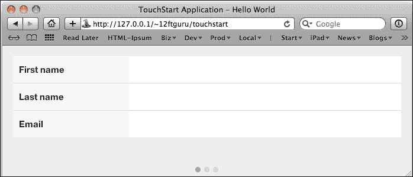

任何曾经在 HTML 中处理表单的人都应该熟悉所有标准的字段类型，因此熟悉标准 HTML 表单的人都会理解以下的`xtype`属性名称：

+   `checkboxfield`

+   `fieldset`

+   `hiddenfield`

+   `passwordfield`

+   `radiofield`

+   `selectfield`

+   `textfield`

+   `textareafield`

这些字段类型在很大程度上与它们的 HTML 同类相匹配。Sencha Touch 还提供了一些特殊的文本字段，可以帮助验证用户输入：

+   `emailfield`：此字段只接受有效的电子邮件地址，在 iOS 设备上，它会弹出另一个电子邮件地址和 URL 友好型键盘

+   `numberfield`：此字段只接受数字

+   `urlfield`：此字段只接受有效的网络 URL，并且还会弹出特殊键盘

这些特殊字段只有在输入有效时才会允许提交操作。

所有这些基本表单字段都继承自主容器类，因此它们具有所有标准的`height`、`width`、`cls`、`style`和其他容器配置选项。

它们还有一些字段特定的选项：

+   `label`：这是与字段一起使用的文本标签

+   `labelAlign`：这是标签出现的位置；可以是顶部或左侧，默认为左侧

+   `labelWidth`：这告诉我们标签应该有多宽

+   `name`：这对应于 HTML 的 name 属性，这是字段值提交的方式

+   `maxLength`：这告诉我们字段中可以使用多少个字符

+   `required`：这告诉我们字段是否为必须的，以便表单能够提交

### 小贴士

**表单字段位置**

虽然`FormPanel`通常是在显示表单元素时使用的容器，但它理解`submit()`方法，该方法将通过 AJAX 请求或`POST`提交表单值。

如果您在不是`FormPanel`组件的东西中包含一个表单字段，您将需要使用您自己的自定义 JavaScript 方法来获取和设置字段的值。

除了标准的 HTML 字段外，Sencha Touch 中还提供了一些特殊字段，包括`DatePicker`、`slider`、`spinner`和`toggle`字段。

## 添加日期选择器组件

`datepickerfield`组件（这个名称正确吗？）在表单中放置一个可点击的字段，字段右侧有一个小三角形。

你可以在`emailfield`项之后添加以下代码来向我们的表单中添加一个日期选择器：

```js
{
 xtype: 'datepickerfield',
 name : 'date',
 label: 'Date'
}
```

当用户点击字段时，将出现一个`DatePicker`组件，用户可以通过旋转月份、日期和年份轮盘，或通过向上或向下滑动来选择日期。

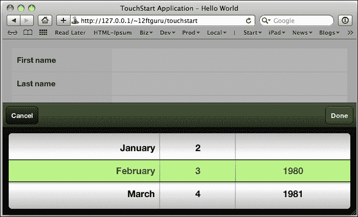

`datepickerfield`还具有`configs`选项，如下所示：

+   `yearFrom`：日期选择器的开始年份。

+   `yearTo`：日期选择器的结束年份。

+   `slotOrder`：使用字符串数组来设置插槽顺序。默认值为`['month', 'day', 'year']`。

## 添加滑块、微调器和切换按钮

滑块允许从指定的数值范围内选择一个值。`sliderfield`值显示一个带有指示器的条，可以通过水平滑动来选择值。这可以用于设置音量、颜色值和其他范围选项。

与滑块类似，微调器允许从指定的数值范围内选择一个值。`spinnerfield`值显示一个带有数字值和**+**和**-**按钮的表单字段。

切换按钮允许在 1 和 0 之间进行简单选择（开和关），并在表单上显示一个切换风格的按钮。

在以下组件列表的末尾添加以下新组件：

```js
{
 xtype: 'sliderfield',
 label: 'Volume',
 value: 5,
 minValue: 0,
 maxValue: 10
},
{
 xtype: 'togglefield',
 name : 'turbo',
 label: 'Turbo'
},
{
 xtype: 'spinnerfield',
 minValue: 0,
 maxValue: 100,
 incrementValue: 2,
 cycle: true
}
```

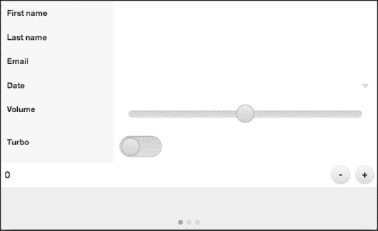

我们的`sliderfield`和`spinnerfield`具有`minValue`和`maxValue`配置选项。我们还向`spinnerfield`添加了一个`incrementValue`属性，当点击**+**或**-**按钮时，它将按`2`的增量移动。

### 注意

我们将在第六章中介绍表单的发送和接收数据，获取数据。

# 消息框和表单组件

在某些时候，您的应用程序可能需要向用户反馈、询问用户问题或提醒用户事件。这就是`MessageBox`和`Sheet`组件发挥作用的地方。

## 创建消息框组件

`MessageBox`组件在页面上创建一个窗口，可用于显示警告、收集信息或向用户展示选项。`MessageBox`可以通过三种不同的方式调用：

+   `Ext.Msg.alert`接受一个标题、一些消息文本，以及一个可选的回调函数，当点击警告框的**确定**按钮时调用。

+   `Ext.Msg.prompt`带有标题、一些消息文本和一个当按下**OK**按钮时调用的回调函数。该`prompt`命令创建一个文本字段并自动添加到窗口中。在此例中，函数接收字段的文本进行处理。

+   `Ext.Msg.confirm`带有标题、一些消息文本和一个当任一按钮被按下时调用的回调函数。

### 提示

**回调函数**

回调函数是一个在用户或代码采取特定行动时自动调用的函数。这是程序员让代码说“当你完成这个，回调我并告诉我你做了什么”的基本方式。这个回调允许程序员根据函数中发生的事情做出额外的决定。

让我们尝试一些例子，从一个简单的消息框开始：

```js
Ext.application({
    name:'TouchStart',
    launch:function () {
        var main = Ext.create('Ext.Container', {
            fullscreen:true,
            items:[
                {
                    docked:'top',
                    xtype:'toolbar',
                    ui:'light',
                    items:[
                        {
                            text:'Panic',
                            handler:function () {
                                Ext.Msg.alert('Don\'t Panic!', 'Keep Calm. Carry On.');
                            }
                        }
                    ]
                }
            ]
        });

        Ext.Viewport.add(main);
    }
});
```

这段代码设置了一个带有工具栏和单个按钮的简单面板。按钮有一个处理程序，使用`Ext.Msg.alert()`来显示我们的消息框。

### 提示

**转义引号**

在我们的上一个示例中，我们使用字符串`Don\'t Panic`作为消息框的标题。`\`告诉 JavaScript 我们的第二个单引号是字符串的一部分，而不是字符串的结束。正如在示例中看到的那样，`\`在我们的消息框中消失了。

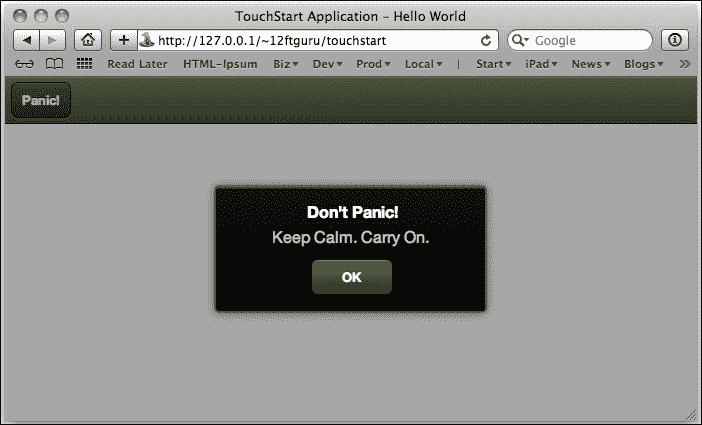

现在，让我们在我们的`toolbar`组件中的`items`中添加一个第二个按钮，以`Ext.Msg.prompt`样式的消息框：

```js
{
    text:'Greetings',
    handler:function () {
        Ext.Msg.prompt('Greetings!', 'What is your name?', function (btn, text) {
            Ext.Msg.alert('Howdy', 'Pleased to meet you ' + text);
        });
    }
}
```

这个消息框有点更复杂。我们创建了一个带有标题、信息和函数的`Ext.Msg.prompt`类。提示将自动创建我们的文本字段，但我们需要使用函数来确定用户在字段中输入的文本要做什么。

该函数接收按钮的值和文本的值。我们的函数抓取文本并创建一个新的警告框来响应，还包括用户在字段中输入的名称。

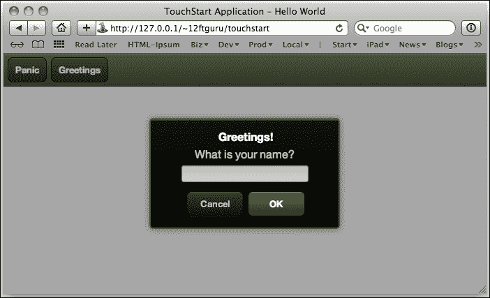

`MessageBox`的`Ext.Msg.confirm`类用于用户需要做出决定，或确认系统将要采取的特定行动。

让我们把我们下面的组件添加到`toolbar`组件的`items`列表中：

```js
{
 text: 'Decide',
 handler: function() {
  Ext.Msg.confirm('It\'s Your Choice...', 'Would you like to proceed?', function(btn) {
   Ext.Msg.alert('So be it!', 'You chose '+btn);
  });
 }
}
```

与`Ext.Msg`组件的提示函数类似，确认版本也带有标题、信息和回调函数。回调函数接收用户按下的按钮（作为值`btn`），然后可以用来确定系统接下来应该采取哪些步骤。

在这种情况下，我们只是弹出一个警告框来显示用户所做的选择。你也可以使用`if...then`语句来根据点击哪个按钮采取不同的行动。

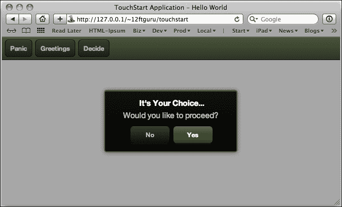

## 创建一个 Sheet 组件

`Sheet`组件与`Ext.Msg`组件类似，通常用于在屏幕上弹出新的信息或选项。它也通过出现在现有屏幕之上来展示这些新信息。与`MessageBox`一样，在`Sheet`关闭或以某种方式响应之前，无法进行进一步的操作。

让我们在我们的`toolbar`组件的`items`部分添加另一个按钮。这个按钮将弹出一个新的`Sheet`组件：

```js
{
    text:'Sheet',
    handler:function () {
        var mySheet = Ext.create('Ext.Sheet', {
            height:250,
            layout:'vbox',
            stretchX:true,
            enter:'top',
            exit:'top',
            items:[
                {
                    xtype:'container',
                    layout:'fit',
                    flex:1,
                    padding:10,
                    style:'color: #FFFFFF',
                    html:'A sheet is also a panel. It can do anything the panel does.'
                },
                {
                    xtype:'button',
                    height:20,
                    text:'Close Me',
                    handler:function () {
                        this.up('sheet').hide();
                    }
                }
            ],
            listeners:{
                hide:function () {
                    this.destroy();
                }
            }
        });
    }
}
Ext.Viewport.add(mySheet);
mySheet.show();
```

这里有很多新东西，但有些应该看起来很熟悉。我们的按钮从按钮要显示的`text`值开始，然后创建了一个`handler`值，告诉按钮在点击时应该做什么。

然后我们创建了一个新的`Ext.Sheet`类。由于`Sheet`继承自面板，我们有一些熟悉的配置选项，如`height`和`layout`，但我们还有一些新的选项。`stretchX`和`stretchY`配置将导致`Sheet`组件扩展到屏幕的整个宽度（`stretchX`）或高度（`stretchY`）。

`enter`和`exit`的值控制了`Sheet`组件如何在屏幕上滑动到位。你可以使用`top`、`bottom`、`left`和`right`。

我们的表单使用`vbox`布局，包含两个项目，一个用于我们的文本的`container`对象和一个用于用户阅读完毕后隐藏`Sheet`组件的`button`对象。`button`组件本身包含了一段有趣的代码：

```js
this.up('sheet').hide();
```

当我们提到`this`关键字时，我们是指`button`对象，因为函数发生在`button`本身内部。然而，我们实际上需要到达包含按钮的`Sheet`，以便在按钮被点击时关闭它。为了做到这一点，我们使用了一个巧妙的小方法，叫做`up`。

`up`方法基本上会向上遍历代码结构，寻找所需的项。在这种情况下，我们通过`xtype`进行搜索，并请求搜索中遇到的第一个表单。然后我们可以使用`hide()`方法隐藏表单。

### 提示

**Ext.ComponentQuery**

当你想要获取一个组件，并且已经给它指定了一个 ID，你可以使用`Ext.getCmp()`，正如我们之前讨论的那样。如果你想要获取多个组件，或者根据它相对于另一个组件的位置来获取一个组件，你可以使用`query()`、`up()`和`down()`。要隐藏一个位于面板内的工具栏，你可以使用以下代码：

```js
panel.down('toolbar').hide();
```

此外，要获取您应用程序中所有的工具栏，您可以使用以下命令：

```js
var toolbars = Ext.ComponentQuery.query('toolbar');
```

一旦我们隐藏了`Sheet`组件，我们仍然有一个问题。现在`Sheet`组件是隐藏的，但它仍然存在于页面中。如果我们返回并再次点击按钮，而不销毁`Sheet`，我们就会不断创建越来越多的新的表单。这意味着越来越多的内存使用，这也意味着你的应用程序最终会走向死亡螺旋。

我们需要做的是确保我们清理好自己的东西，这样表格就不会堆积起来。这让我们来到了我们代码的最后部分和最后的`listeners`配置：

```js
listeners: {
 hide: {
  fn: function(){ this.destroy(); }
 }
}
```

监听器监听特定事件，在这个例子中，是`hide`事件。当`hide`事件发生时，监听器然后运行`fn`配置中列出的附加代码。在这个例子中，我们使用`this.destroy();`来销毁`Sheet`组件。

在下一章，我们将详细介绍监听器和事件。

### 提示

**关于 this 变量的一点说明**

当我们在程序中使用变量`this`时，它总是指的是当前项目。在前面的例子中，我们在两个不同的地方使用了`this`，它指的是两个不同的对象。在我们最初的用法中，我们在按钮的配置选项中，所以`this`指的是按钮。当我们后来将`this`作为监听器的一部分时，我们在表格的配置中，所以`this`指的是表格。

如果您发现自己感到困惑，使用`console.log(this);`可以非常有帮助，以确保您正在 addressing 正确的组件。

你现在应该能够点击**表格**按钮并查看我们新的表格了。

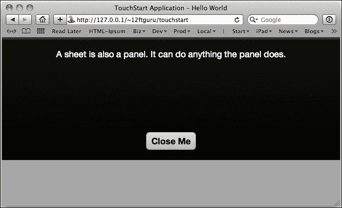

## 创建行动表格组件

`ActionSheet`是标准表格的一种变体，设计用于显示一系列按钮。当您只需要用户做出快速决策，有明显的选择且不需要过多解释时，这是一个很好的选择。例如，删除确认屏幕就是行动表格的一个很好的用途。

让我们在我们的布局中添加一个新的按钮，用于弹出一个用于删除确认的`ActionSheet`组件：

```js
{
 text: 'ActionSheet',
 handler: function() {
  var actionSheet = Ext.create('Ext.ActionSheet', {
   items: [
   {
    text: 'Delete',
    ui  : 'decline'
   },
   {
    text: 'Save',
    ui  : 'confirm'
   },
   {
    text: 'Cancel',
    handler: function() {
     this.up('actionsheet').hide();
    }
   }
   ],
   listeners: {
    hide: {
     fn: function(){ this.destroy(); }
    }
   }
  });
  Ext.Viewport.add(actionSheet);
   actionSheet.show();
  }
}
```

`ActionSheet`对象以与我们的上一个表格示例非常相似的方式创建。然而，行动表格假设其所有项目都是按钮，除非您指定了不同的`xtype`值。

我们的例子有三个简单的按钮：**删除**、**保存**和**取消**。**取消**按钮将隐藏`ActionSheet`组件，其他两个按钮只是装饰。

与我们的上一个示例一样，我们希望在隐藏它时也销毁`ActionSheet`组件。这可以防止`ActionSheet`组件的副本在后台堆积并造成问题。

点击我们应用程序中的**行动表格**按钮现在应该会显示我们创建的行动表格：

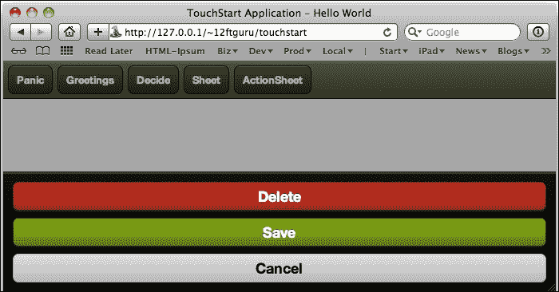

# 创建一个 Map 组件

`Map`组件是一个非常特殊的容器，旨在与 Google Maps API 一起使用。该容器可用于显示 Google Maps 显示的大部分信息。

我们将为这个部分创建一个`Map`容器的非常基础的例子，但我们将在此返回第九章，*高级主题*，并介绍一些更高级的技巧。

为了这个例子，让我们创建一个新的 JavaScript 文件：

```js
Ext.application({
 name: 'TouchStart',
 launch: function() {
  var map = Ext.create('Ext.Container', {
  fullscreen: true,
  layout: 'fit',
  items: [
   {
    xtype: 'map',
    useCurrentLocation: true
   }
  ]
  });
  this.viewport = map;
 }
});
```

在这个例子中，我们只是创建了一个带有单个项目的`Container`组件。这个项目是一个地图，并且配置了`useCurrentLocation: true`。这意味着浏览器将尝试使用我们的当前位置作为地图显示的中心。当这种情况发生时，用户总是会被警告，并且会被提供拒绝的选项。

在我们了解这是如何工作的之前，我们需要对我们的标准`index.html`文件进行一项更改。在包含我们其他 JavaScript 文件的行下面，我们需要包含来自 Google 的一个新文件：

```js
  <!-- Google Maps API -->
  <script type="text/javascript" src="img/js?sensor=true"></script>
```

这将包括我们使用 Google Maps API 所需的所有函数。

如果您重新加载页面，系统会询问您是否允许当前位置被应用程序使用。一旦您接受，您应该会看到一个新的地图，您的当前位置在中心。

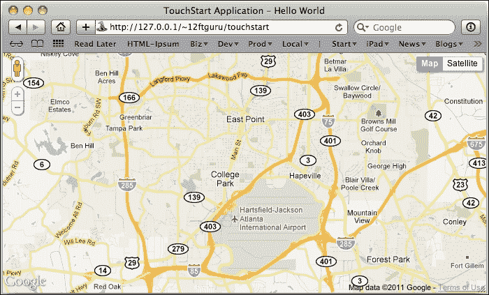

您还可以使用`map`属性以及`mapOptions`配置选项来访问 Google Maps 的其他功能。我们将在第九章*高级主题*中探索一些这些选项，并且进行更详细的讲解。

### 提示

**Google Maps API** **文档**

完整的 Google Maps API 文档可以在[`code.google.com/apis/maps/documentation/v3/reference.html`](http://code.google.com/apis/maps/documentation/v3/reference.html)找到。

# 创建列表

Sencha Touch 提供了几种不同的`list`组件。每个这些`list`组件都由三个基本部分组成：

+   **列表面板**：它负责收集其配置选项中的其他项目。

+   **XTemplate**：这决定了列表中每一行的显示方式。

+   **数据存储**：这里包含将在列表中使用的所有数据。

### 注意

还应该注意的是，一个存储区可以（并且通常会）与一个模型相关联，以定义存储区的数据记录。然而，也可以简单地将字段作为存储区的一部分定义，这在接下来的例子中我们会这样做。我们将在本书关于数据的章节中介绍模型和存储区。

在我们第一个例子中，我们创建了一个与这个类似的列表对象：

```js
Ext.application({
name: 'TouchStart',
launch: function() {

var myDudeList = Ext.create('Ext.Container', {
 fullscreen: true,
 layout: 'fit',
 items: [
 {
   xtype: 'list',
   itemTpl: '{last}, {first}',
   store: Ext.create('Ext.data.Store', {
    fields: [
     {name: 'first', type: 'string'},
     {name: 'last', type: 'string'}
    ],
    data: [
     {first: 'Aaron', last: 'Karp'},
     {first: 'Baron', last: 'Chandler'},
     {first: 'Bryan', last: 'Johnson'},
     {first: 'David', last: 'Evans'},
     {first: 'John', last: 'Clark'},
     {first: 'Norbert', last: 'Taylor'}
    ]
   })
 }]
});
Ext.Viewport.add(myDudeList);
}
});
```

我们首先像以前一样创建我们的应用程序。然后我们创建了一个带有列表项目的单个容器。列表项目需要一个数据存储，而数据存储需要一组字段或数据模型。在这个例子中，我们将使用一组字段以简化操作。

```js
fields: [
 {name: 'first', type: 'string'},
 {name: 'last', type: 'string'}
]
```

这段代码为我们每个数据记录提供了两个潜在的值：`first`和`last`。它还告诉我们每个值的`type`；在这个例子中，两个都是`strings`。这使得数据存储知道如何处理数据的排序，并且让 XTemplate 知道数据如何被使用。

在这个示例中，我们设置了`itemTpl: '{last}, {first}'`。这个`itemTpl`值作为模板或 Sencha Touch 中的 XTemplate。XTemplate 从存储中的每个记录中获取数据，并告诉列表显示每个数据记录：姓氏，后面跟着一个逗号，然后是名字。我们将在第七章，*获取数据外*中详细介绍 XTemplates。

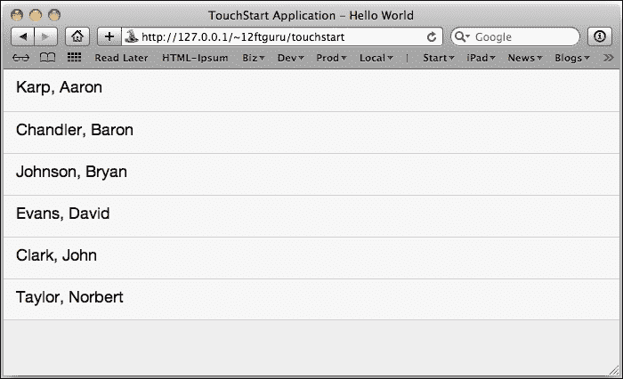

请注意，目前我们的列表没有按字母顺序排序。我们需要在模型的配置选项下方添加一个排序器到存储中：

```js
sorters: 'last'
```

这将按`last`（人的姓氏）值对我们的列表进行排序。

## 添加分组列表

分组列表也常见于许多应用程序中。通常，分组用于人员或其他字母顺序的物品列表。电话簿或长字母顺序数据列表是分组列表的好地方。分组列表在屏幕上放置一个`indexBar`组件，允许用户跳转到列表中的特定点。

为了对我们的当前列表进行分组，我们需要向我们的`list`组件添加两个配置设置。在声明`xtype: 'list'`下方添加以下代码：

```js
grouped: true,
indexBar: true,
```

我们还需要向我们的存储添加一个函数，以获取显示我们字母`indexBar`的字符串。在`store`组件的`sorters`配置处替换以下代码：

```js
grouper: {
  groupFn : function(record) {
    return record.get('last').substr(0, 1);
  },
  sortProperty: 'last'
}
```

这段代码使用`record.get('last').substr(0,1)`来获取我们联系人的姓氏的第一个字母。这让列表知道当点击`indexBar`组件上的字母时应该滚动到哪里。

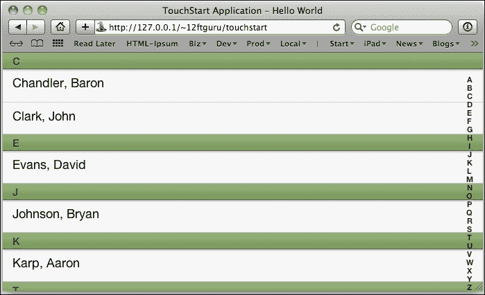

## 添加嵌套列表

`NestedList`组件自动化嵌套数据集的布局和导航。这对于您有一个项目列表和列表中每个项目的详细信息的情况非常有用。例如，假设我们有一个办公室列表，每个办公室都有一组部门，每个部门都由一些人组成。

我们可以首先将此显示为办公室列表。点击一个办公室会带你到该办公室内的部门列表。点击一个部门会带你到该部门的人员列表。

我们需要做的第一件事是一组用于此列表的数据：

```js
var data = {
    text:'Offices',
    items:[
        {
            text:'Atlanta Office',
            items:[
                {
                    text:'Marketing',
                    items:[
                        {
                            text:'David Smith',
                            leaf:true
                        },
                        {
                            text:'Alex Wallace',
                            leaf:true
                        }
                    ]
                },
                {
                    text:'Sales',
                    items:[
                        {
                            text:'Jane West',
                            leaf:true
                        },
                        {
                            text:'Mike White',
                            leaf:true
                        }
                    ]
                }
            ]
        },
        {
            text:'Athens Office',
            items:[
                {
                    text:'IT',
                    items:[
                        {
                            text:'Baron Chandler',
                            leaf:true
                        },
                        {
                            text:'Aaron Karp',
                            leaf:true
                        }
                    ]
                },
                {
                    text:'Executive',
                    items:[
                        {
                            text:'Bryan Johnson',
                            leaf:true
                        },
                        {
                            text:'John Clark',
                            leaf:true
                        }
                    ]
                }
            ]
        }
    ]
};
```

这是一个相当庞大且看起来很丑的数据数组，但它可以分解为几个简单的部分：

+   我们有一个名为`Offices`的主要项目。

+   `Offices`有一个包含两个项目的列表，`Atlanta Office`和`Athens Office`。

+   这两项各有两个部门。

+   每个部门有两个人。

这个列表中的每个人都有一个特殊的属性叫做`leaf`。`leaf`属性告诉我们的程序已经到达嵌套数据的末端。此外，我们列表中的每个项目都有一个名为`text`的属性。这个`text`属性是我们`store`中的`fields`列表的一部分。

然后我们可以创建我们的存储并将其数据添加到其中：

```js
var store = Ext.create('Ext.data.TreeStore', {
 root: data,
 fields: [{name: 'text', type: 'string'}],
 defaultRootProperty: 'items',
 autoLoad: true
});
```

对于`NestedList`组件，我们需要使用`TreeStore`类，并将`root`配置指向我们之前定义的`data`数组变量。这将告诉存储器在我们数据的第一组项目中最开始查找的位置。

最后，我们需要创建我们的`NestedList`：

```js
var nestedList = Ext.create('Ext.NestedList', {
    fullscreen: true,
    title: 'Minions',
    displayField: 'text',
    store: store
});
```

我们将`NestedList`组件设置为`全屏`，同时也设置了`title`值，告诉它要显示哪个字段，最后，我们将其指向我们的存储，以便它可以获取我们创建的数据。

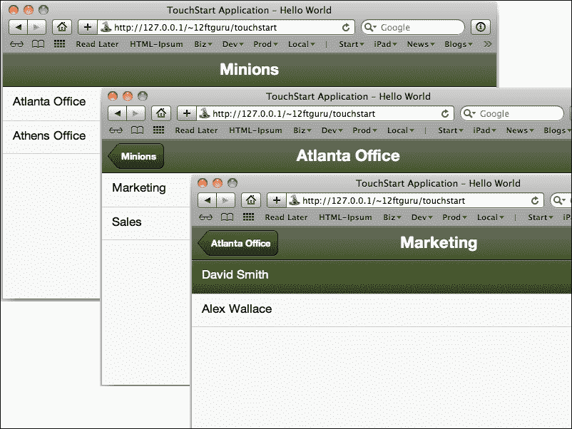

如果你点击嵌套列表，你会注意到点击动作已经被自动添加。这同样适用于上导航和标题。

`NestedList`组件为在小型屏幕上快速有效地显示层次化数据提供了一个很好的起点。

# 使用 Sencha Docs 查找更多信息

在本章中，我们覆盖了很多信息，但它只是 Sencha Touch API 文档中可用信息的一小部分。

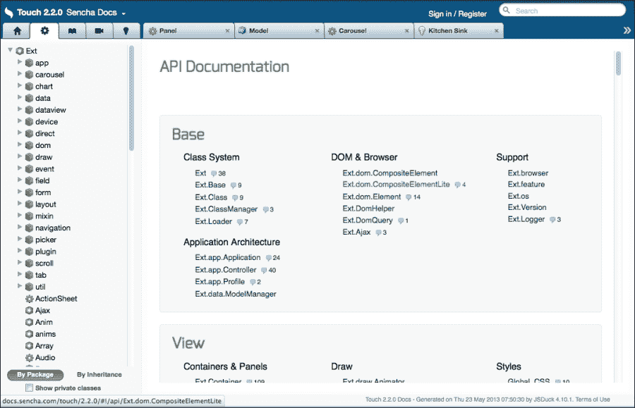

起初，API 可能会让人感到有些不知所措，但如果你理解了其组织结构，你就可以快速找到所需的信息。这里有一些帮你入门的小贴士。

## 查找组件

API 的左侧包含五个标签页，内容如下：

+   主屏幕包含 Sencha Touch 的一般营销信息。

+   带有列表中每个可用组件的 API 文档。

+   **指南**部分，其中包含有关各种组件及其用途的更详细文章。

+   **视频**部分，其中包含多个视频演讲，详细介绍布局和 MVC 等主题。

+   **示例**部分，其中包含许多 Sencha Touch 组件及其功能的多项示例。

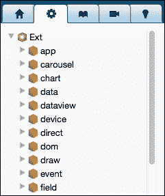

如果你点击 API 标签，可以浏览一个组件列表。你还可以在文档页面上方右侧的搜索框中快速查找组件。

当你点击 API 列表中的项目时，标签页将打开屏幕的主要部分，并详细介绍组件的信息。

## 理解组件页面

单个组件页面顶部的信息为理解组件的工作提供了巨大的跳板。

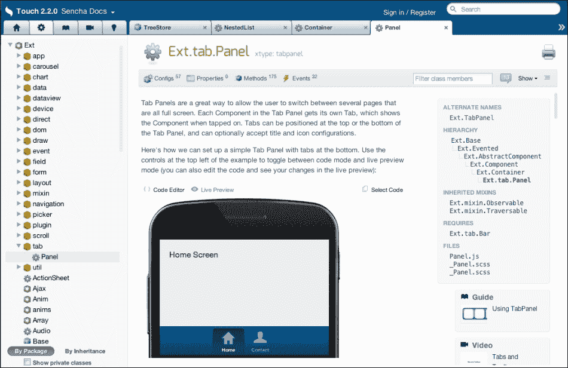

快速扫描右侧的组件层次结构，会告诉你组件继承了哪些其他项目。如果你理解了基本组件，如容器和面板，你可以迅速利用这些知识来指导你使用新组件。

顶部标题还列出了组件的`xtype`值。

在标题下方，有一系列菜单，包括：

+   **Config**：组件创建时使用的初始选项。

+   **属性**：创建组件后您可以从组件中获取的信息

+   **方法**：组件创建后知道如何执行的操作

+   **事件**：组件创建后关注的事情

+   **CSS 变量**：可用于样式化组件（仅在某些组件上）的可用的 CSS 变量列表

+   **CSS 混合**：组件可用的混合列表（仅在某些组件上）

还有一个文本框用于过滤类成员，一个菜单用于控制列表中出现的类成员类型，以及一个按钮用于展开页面上的所有项。

大多数常见组件在页面的顶部都包含示例。当在 WebKit 浏览器（Safari 或 Chrome）中查看时，这些示例包括一个**实时预览** / **代码编辑器**选项，可以切换。这将显示用户看到的组件，或者是创建组件的实际代码。

正如名称所暗示的，**代码编辑器**选项实际上可以编辑以测试不同的配置选项。还有一个**选择代码**选项，它将允许你复制代码并将其粘贴到自己的应用程序中。

这些信息应该为您学习 API 中的任何组件提供了一个起点。

# 总结

在本章中，我们首先查看了一个基本组件，名为`Ext.Component`。我们还研究了组件是如何创建的。然后我们详细探讨了容器的布局，展示了它是如何影响容器内部的子项的。

本章还描述了 Sencha Touch 中一些更常见且实用的组件，包括：容器、面板、TabPanel、Carousel、FormPanel、FormItem、MessageBox、Sheet、列表和嵌套列表。我们在章节的最后提供了一些使用 Sencha Touch API 的建议。

在下一章中，我们将介绍 Sencha Touch 中事件的使用。
