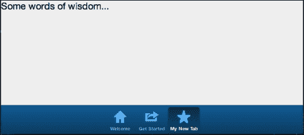

# 第五章：事件和控制器

在上一章中，我们详细查看了 Sencha Touch 中可用的组件。然而，仅仅创建组件还不足以构建一个应用程序。组件仍然需要彼此通信，以便我们的应用程序做些真正有用的事情。事件和控制器就在这里发挥作用。

在本章中，我们将探讨 Sencha Touch 中的事件和控制器：它们是什么，为什么我们需要它们，以及它们是如何工作的。我们将讨论如何使用监听器和处理程序使您的应用程序对用户的触摸以及后台发生的事件做出反应。我们还将介绍一些有用的概念，例如可观察的捕获和事件代理。最后，我们将通过查看触摸特定事件和如何从 Sencha Touch API 获取更多信息来完成本章。

本章将涵盖以下内容：

+   事件

+   监听器和处理程序

+   控制器

+   监听器选项

+   作用域

+   移除事件

+   处理程序和按钮

+   常见事件

+   关于事件的其他信息

# 探索事件

作为程序员，我们倾向于将代码视为一个有序的指令序列，逐行执行。很容易忽视的事实是，我们的代码实际上花费了很多时间坐着等待用户做些什么。它正在等待用户点击一个按钮，打开一个窗口，或者从列表中选择。代码正在等待一个事件的发生。

通常，事件发生在组件执行特定任务之前或立即之后。当任务执行时，事件被广播到系统其余部分，在那里它可以触发特定的代码，或者可以被其他组件用来触发新的动作。

例如，在 Sencha Touch 中，每当点击按钮时，按钮就会触发一个事件。这个点击可以执行按钮内的代码，创建一个新的对话框，或者一个面板组件可以“监听”按钮正在做什么，并在听到按钮触发`tap`事件时改变其颜色。

由于大多数应用程序都是为了人机交互而设计的，所以说程序的大部分功能都来自于对事件的响应是安全的。从用户的角度来看，事件是使程序实际“做”事情的东西。程序正在响应用户的请求。

除了响应请求外，事件在确保事情按正确顺序发生方面也起着重要的作用。

## 异步与同步操作

爱因斯坦曾经说过：

> 时间存在的唯一原因是让一切不同时发生。

虽然这可能看起来像是一个随意的评论，但实际上在编写代码时与之有很大的关联。

在 Sencha Touch 中编写代码时，我们正在指导网络浏览器在用户的屏幕上创建和销毁组件。这个过程的明显限制是，我们既不能在组件创建之前操纵它，也不能在它被销毁之后操纵它。

这看起来在第一眼似乎相当直接。你永远不会在实际创建组件之前写一行试图与组件交谈的代码，那么问题是什么？

这个问题与代码中的异步动作有关。尽管我们的大部分代码将按顺序或以同步方式执行，但有许多情况我们需要发出一个请求并得到回应才能继续。这在基于 web 的应用程序中尤为正确。

例如，假设我们有一行代码，它使用来自 Google 地图的请求来构建一个地图。我们需要等待我们从 Google 那里得到回应并渲染我们的地图，然后我们才能开始在地图上工作。然而，我们不想让我们的应用程序的其他部分在我们等待回应时冻结。因此我们发起一个异步请求，这个请求在后台进行，而我们的应用程序的其他部分继续它的业务。

这种异步请求称为 Ajax 请求。"**Ajax**"代表**异步 JavaScript 和 XML**。如果我们配置我们其中一个按钮发出一个 AJAX 请求，用户在应用程序等待回应时仍然可以执行其他操作。

在界面方面，你可能想要让用户知道我们已经发出了请求，并正在等待回应。在大多数情况下，这意味着显示一个加载信息或一个动画图形。

在 Sencha Touch 中使用事件，我们可以通过绑定到 Ajax 组件的`beforerequest`事件来显示加载图形。由于我们需要知道何时让加载信息消失，因此我们的组件将等待来自 Ajax 请求的`requestcomplete`事件。一旦这个事件触发，我们就可以执行一些代码来告诉加载信息消失。我们还可以使用`requestexception`事件来告知用户在请求过程中是否出现错误。

使用这种事件驱动的设计允许你快速响应用户的操作，而不需要让他们等待你的代码需要执行的一些更耗时的请求。你还可以用事件来告知用户关于错误的信息。事件的关键在于让你的其他组件“监听”到这个事件，然后告诉他们如何处理收到的信息。

# 添加监听器和处理程序

**每个 Sencha Touch 组件都能生成一大串事件。** 鉴于你应用中可能会有大量的组件，你可以预期会有很多交互。

想象一个有 100 个人的聚会，每个人都在进行着许多不同的对话。现在想象一下，试图从每个对话中提取所有有用的信息。这是不可能的。你必须专注于某个特定的对话，才能收集到有用的信息。

同样的，组件也需要被告知要监听什么，否则我们可怜的聚会参与者很快就会感到不知所措。幸运的是，我们有针对这一点的配置。

`listeners`配置告诉组件需要关注哪些事件。监听器可以像 Sencha Touch 中的任何其他配置选项一样添加。例如，面板的配置选项可能如下所示：

```js
listeners: {
 singletap: {
  element: 'element',
  fn: function(){ Ext.Msg.alert('Single Tap'); }
 }
}
```

这个配置选项告诉面板在用户在面板内部元素上单击一次时监听`singletap`事件。当`singletap`事件发生时，我们执行`fn`配置选项中列出的函数（这通常被称为处理程序）。在这种情况下，我们弹出一个带有消息警告`Single Tap`的消息框。

请注意，我们`listeners`配置中的项目总是作为一个对象的一部分（无论是否只有一个事件我们正在监听），即使我们只监听一个事件也是如此。如果我们添加第二个事件，它将如下所示：

```js
listeners: {
 singletap: {
  element: 'element',
  fn: function(){ Ext.Msg.alert('Single Tap'); }
 },
 hide: {
  fn: function(){ this.destroy(); }
 }
}
```

### 注意

如果事件没有其他属性，你也可以像这样缩短事件声明：`hide: function(){ this.destroy(); }`

我们还可以从监听器中获取信息并用在我们的处理函数中。例如，`singletap`事件会返回`event`对象，被点击的 DOM 元素以及我们如果在面板上有以下监听器的话，还会返回`listener`对象本身：

```js
listeners: {
  singletap: {
    element: 'element',
    fn: function(event, div, listener) {
      console.log(event, div, listener);
    }
  }
}
```

当用户在面板内单击时，我们将在控制台上获得一个视图，类似于以下内容：


### 提示

**事件参数**

您会注意到某些默认值会被传递到我们的事件中。这些默认值可以在每个组件的[`docs.sencha.com/touch/2.2.1/`](http://docs.sencha.com/touch/2.2.1/)中找到。

每个事件都将有它自己的默认值。选择一个组件从 Sencha API 文档，然后点击页面顶部的`Events`查看组件的所有事件。每个事件的描述将包括其默认参数。

从控制台可以看出，我们的`event`对象包含了一个在单击发生时的 Unix`timeStamp`，以及单击本身`pageX`和`pageY`坐标，还有被单击的`div`标签的整个内容。您可能还注意到我们的`tap`事件在我们的调试输出中被称为`mouseup`事件。在 Sencha Touch 中，`singletap`和`mouseup`事件是彼此的别名。这保留了与桌面浏览器传统的`mouseup`事件和移动浏览器`singletap`事件之间的兼容性。

我们可以在我们函数内部使用所有这些信息。

为了这个例子，我们将创建一个带有红色容器的简单面板。我们的`singletap`监听器将改变红色盒子的尺寸以匹配我们屏幕上的单击位置，如下代码片段所示：

```js
Ext.application({
 name: 'TouchStart',
 launch: function() {
  var eventPanel = Ext.create('Ext.Panel', {
   fullscreen: true,
   layout: 'auto',
   items: [{
    xtype: 'container',
    width: 40,
    height: 40,
    id: 'tapTarget',
    style: 'background-color: #800000;'
   }],
   listeners: {
    singletap: {
     element: 'element',
     fn: function(event, div, listener) {
      var cmp = Ext.getCmp('tapTarget');
      cmp.setWidth(event.pageX);
      cmp.setHeight(event.pageY);
      console.log(event.pageX, event.pageY);
     }
    }
   }
  });
  Ext.Viewport.add(eventPanel);
 }
});
```

如果我们打开控制台运行这段代码，我们可以看到我们单击的位置的 x 和 y 坐标会在控制台出现。我们的盒子也会根据这些值来匹配大小。


正如您在前面代码中看到的，我们监听了`tap`事件。然后我们使用`Ext.getCmp('tapTarget');`获取`container`组件，并根据从`tap`事件返回的值改变红色盒子的尺寸：

```js
singletap: {
 element: 'element',
 fn: function(event, div, listener) {
  var cmp = Ext.getCmp('tapTarget');
  cmp.setWidth(event.pageX);
  cmp.setHeight(event.pageY);
 }
} 
```

这是一个使用 Sencha Touch 事件的基本示例。然而，我们的大多数应用程序通常会做不止一件简单的事情。我们还可以使用 ID 和`Ext.getCmp()`获取它们。在大型应用程序中，不小心创建具有相同 ID 的组件或在已由 Sencha Touch 使用的 ID 创建组件是非常容易的。这通常会导致应用程序的螺旋死亡和大量扯头发。

### 提示

作为一种最佳实践，避免为 addressing components 使用 ID 是个好主意。在接下来的几节中，我们将开始向您展示更可靠的方法来引用我们各个组件。

如果我们打算构建比这种“单招马”更复杂的应用程序，我们可能想要开始考虑将我们的事件和动作分离到适当的控制器中，并找到一种更好地引用我们不同组件的方法。

# 控制器

在第三章 *用户界面样式*中，我们稍微谈到了**模型视图控制器**（**MVC**）架构。这种架构将我们的文件划分为数据文件（`Models`和`Stores`）、界面文件（`Views`）以及处理功能（`Controllers`）的文件。在本节中，我们将重点关注 MVC 的控制器部分。

在最基本层面上，控制器在应用程序中分配监听器和动作。与我们的前一个示例不同，在那里单个组件负责处理事件，控制器将处理我们应用程序中每个组件的事件。

这种劳动分工在创建应用程序时提供了几个不同的优势，如下所述：

+   当我们知道我们的函数都在控制器中，并且与显示逻辑分离时，代码更容易导航。

+   控制器为应用程序中各个显示组件提供了一个更简单的通信层。

+   控制器可以根据功能划分为不同的文件。例如，我们可以有一个用户控制器，它处理用户数据的事件和监听器，还有一个单独的公司控制器，它处理公司数据的事件和监听器。这意味着如果一个用于保存新用户的表单不能正确工作，我们知道要查看哪个文件来尝试找出问题所在。

让我们通过一个例子来看看我们在谈论什么。我们将从使用 Sencha Cmd 生成的基本启动应用程序开始，使用以下命令行：

```js
sencha generate app TouchStart /Path/to/Save/Application

```


路径将根据您的设置而变化，但这将给我们提供我们将添加控制器的基本应用程序。

### 注意

想回顾一下 Sencha Cmd 和 MVC 的基础知识，请参见第三章，*用户界面样式*。

如果我们查看我们新创建的应用程序的`app`/`controller`文件夹，我们会发现它是空的。让我们先在这里创建一个`Main.js`文件。在新文件中，我们将添加：

```js
Ext.define('TouchStart.controller.Main', {
 extend: 'Ext.app.Controller',

});
```

这扩展了基本的`Ext.app.Controller`组件，但其他什么也没做。我们的控制器需要理解一些基本的东西，以便正确地工作；它们如下：

+   控制器控制了应用程序的哪些部分？

+   它应该监听哪些组件事件？

+   当其中一个事件被触发时，它应该做什么？

这个谜题的第一部分是由引用（`refs`）处理的。

## Refs and control

`refs`部分使用`ComponentQuery`语法来创建对应用程序中组件的内部引用。`ComponentQuery`语法允许我们根据 ID、xtype 和其他任何配置选项来查找组件。

例如，在我们的`app/view`目录中有一个`Main.js`文件（它是由 Sencha Cmd 自动生成的）。`view`组件有一个`xtype`值为`main`。我们可以像以下这样将这个视图文件添加到我们的控制器中：

```js
Ext.define('TouchStart.controller.Main', {
 extend: 'Ext.app.Controller',
 views: ['TouchStart.views.Main'],
 config: {
  refs: {
   mainView: 'main'
  }
 }
});
```

这告诉我们的控制器，它控制着`TouchStart.views.Main`视图文件，并且我们将用一个简写 m（这是我们的选择）来引用这个特定的组件。通过创建这个引用，我们自动为该组件创建了一个 getter 函数。这意味着当我们在控制器中需要引用这个组件的其他地方时，例如如果我们需要向我们的标签面板添加一个新的标签，我们只需使用`this.getMainView()`来获取组件。

### Tip

这里又是大小写可以悄无声息地攻击你的另一个地方。你会注意到，尽管我们用小写的`m`给我们的引用命名，但 get 函数使用的是大写的`M`。如果我们给我们的引用命名为`mainPanel`，get 函数将是`this.getMainPanel()`。第一个字母总是是大写的。

让我们向我们的基本应用程序添加一些元素，以确切了解这是如何工作的。首先我们需要在`Main.js`视图文件中添加一个按钮。在我们第一个面板（带有标题的那个）中，将项目部分修改如下以添加一个按钮：

```js
items: [{
 docked: 'top',
 xtype: 'titlebar',
 title: 'Welcome to Sencha Touch 2',
 items: [
  { 
   text: 'Add Tab',
   action: 'addtab',
  }
 ]
}] 
```

请注意，这次我们没有在这里添加处理程序，但我们确实有一个`action`的`addtab`，我们将用它来在我们的控制器中引用按钮：


回到我们位于`app/controller/`的`Main.js`文件，我们将添加一个`refs`和`control`部分如下：

```js
Ext.define('TouchStart.controller.Main', {
 extend: 'Ext.app.Controller',
 config: {
 views: ['TouchStart.view.Main'],
  refs: {
   m: 'main',
   addBtn: 'button[action=addtab]'
  },
  control: {
   addBtn: {
    tap: 'addNewTab'
   }
  }
 }
});
```

现在我们有了按钮的新引用：

```js
addBtn: 'button[action=addtab]'
```

### Tip

需要注意的是，我们按钮上的`action`配置完全是任意的。我们可以称它为`myPurposeInLife: 'addtab'`，这对组件本身没有任何影响。在这种情况下，我们只是将按钮引用为`addBtn: 'button[myPurposeInLife = addtab]'`。术语`action`通常是按惯例使用的，但它不是按钮的默认配置选项。它只是我们稍后将在控制器中使用`ComponentQuery`查找按钮的值。

现在我们已经有了引用，我们可以在设置控制时使用`addBtn`。这个`control`部分是我们为这个特定按钮设置监听器的地方：

```js
 control: {
   addBtn: {
    tap: 'addNewTab'
   }
  }
```

这个`control`部分表示我们希望我们的控制器监听`addBtn`按钮的轻触事件，并在用户轻触按钮时触发`addNewTab`函数。接下来，我们需要将这个`addNewTab`函数添加到我们控制器的底部，位于`config`部分之后（不要忘记在`config`部分的末尾和新的函数之间加上逗号），如下面的代码片段所示：

```js
addNewTab: function() {
  this.getMainView().add({
   title: 'My New Tab',
   iconCls: 'star',
   html: 'Some words of wisdom...'
  });
 }
```

这个函数使用我们的`this.getMainView()`函数来获取我们的主标签面板，并向其添加一个新的标签。现在我们点击按钮，我们应该会看到一个带有星形图标和我们 HTML 文本的新标签：



每个控制器文件可以包含任意数量的视图、引用和函数。然而，通常最好将您的控制器根据它们处理的数据类型分成单独的文件（一个用于用户，一个用于公司，另一个用于消息，等等）。这种代码组织完全取决于程序员，但它有助于大大减少寻找问题的难度。

## 使用 ComponentQuery 引用多个项目

正如我们之前的示例所看到的，`refs`部分为我们组件提供了简写式的引用名称，而`control`部分允许我们将监听器和函数分配给我们的组件。尽管我们可以使用`control`部分将单个函数分配给多个组件，但我们在`refs`部分包含的项目只能是单数的。我们无法在`refs`部分为多个组件创建一个单一的引用。

然而，我们可以通过使用`Ext.ComponentQuery`来解决这个问题。

为了演示这一点，让我们来看一个真实世界的例子：一个带有添加、编辑和删除按钮的条目列表。**添加**按钮应该始终是可用的，而**编辑**和**删除**按钮只有在列表中选择了某个项目时才应该是活动的。


我们将创建一个名为`PersonList.js`的列表，位于`view`文件夹中，如下面的代码片段所示：

```js
Ext.define('TouchStart.view.PersonList', {
    extend: 'Ext.dataview.List',
    xtype: 'personlist',
    config: {
        itemTpl: '{last}, {first}',
        store: Ext.create('Ext.data.Store', {
            sorters: 'last',
            autoLoad: true,
            fields: [
                {name: 'first', type: 'string'},
                {name: 'last', type: 'string'}
            ],
            data: [
                {first: 'Aaron', last: 'Karp'},
                {first: 'Baron', last: 'Chandler'},
                {first: 'Bryan', last: 'Johnson'},
                {first: 'David', last: 'Evans'},
                {first: 'John', last: 'Clark'},
                {first: 'Norbert', last: 'Taylor'},
                {first: 'Jane', last: 'West'}
            ]
        })
    }
});
```

这类似于我们在第五章，*事件和控制器*中创建的列表，只不过我们通过使用`Ext.define`并扩展`Ext.dataview.List`对象，将其变成了一个独立的`view`组件。我们本可以将它简单地作为我们的`Main.js`视图文件的一部分，但将其分离出来允许我们定义一个自定义的`xtype`为`personlist`，这将使我们在控制器中引用它变得更容易。

### 注意

为了简化，我们将`store`作为我们视图的一部分，而不是将其分离到`store`目录中的单独文件中。我们将在第七章，*获取数据*和第八章，*创建 Flickr 查找器应用程序*中讨论如何实现，其中我们将介绍存储和模型。

现在我们已经有了`personlist`视图，我们需要将其添加到我们的`Main.js`视图文件中。让我们替换`Main.js`文件中的第二个面板（其中包含视频链接的那个）。新面板将看起来像这样：

```js
{
    title: 'Advanced',
    iconCls: 'action',
    layout: 'fit',
    items: [{
        docked: 'top',
        xtype: 'toolbar',
        items: [
            {
                text: 'Add',
                action: 'additem'
            },
            {
                text: 'Edit',
                action: 'edititem',
                enableOnSelection: true,
                disabled: true
            },
            {
                text: 'Delete',
                action: 'deleteitem',
                enableOnSelection: true,
                disabled: true
            }
        ]
    },
        { xtype: 'personlist'}
    ]
}
```

这段代码创建了一个带有`fit`布局和两个项目的新面板。第一个项目是一个工具栏，固定在面板的顶部。第二个项目（在非常底部）是我们的`personlist`组件。

工具栏有自己的项目，包括三个带有文本`添加`、`编辑`和`删除`的按钮。每个按钮都有自己的独立`action`配置，而`编辑`和`删除`按钮有一个额外的配置：

```js
enableOnSelection: true
```

### 注意

请注意，与`action`一样，`enableOnSelection`配置是任意值，而不是按钮组件的默认配置。

单个`action`配置将允许我们将函数分配给每个按钮。共享的`enableOnSelection`配置将允许我们用一个引用抓取`编辑`和`删除`按钮。让我们回到我们的`Main.js`控制器看看这是如何工作的。

我们首先想要做的是让`Main.js`控制器知道它负责我们的新`personlist`视图。我们通过将其添加到控制器中的`views`列表来实现，如下面的代码片段所示：

```js
views: ['TouchStart.view.Main', 'TouchStart.view.PersonList']
```

接下来，我们需要在`refs`部分创建我们的引用，如下面的代码片段所示：

```js
refs: {
    mainView: 'main',
    addBtn: 'button[action=addtab]',
    addItem: 'button[action=additem]',
    editItem: 'button[action=edititem]',
    deleteItem: 'button[action=deleteitem]',
    personList: 'personlist'
}
```

然后，我们将修改我们的`control`部分，使其如下所示：

```js
control:{
    addBtn:{
        tap:'addNewTab'
    },
    personList:{
        select:'enableItemButtons'
    },
    addItem:{
        tap: 'tempFunction'
    },
    editItem:{
        tap: 'tempFunction'
    },
    deleteItem:{
        tap: 'tempFunction'
    }
}
```

在这里，我们将我们的`personList`组件设置为监听`select`事件，并在事件发生时触发`enableItemButtons`函数。我们还为我们的三个按钮的`tap`事件分配了一个单独的`tempFunction`函数。

我们的`tempFunction`在现有的`addNewTab`函数之后添加，如下所示：

```js
tempFunction:function () {
    console.log(arguments);
}
```

这只是为了演示目的而暂时使用的函数（我们将在第七章，*获取数据*和第八章，*创建 Flickr 查找器应用程序*中更详细地介绍添加、编辑和删除操作）。现在，这个临时函数只是记录发送给它的参数。

### 提示

在 JavaScript 中，`arguments`是一个特殊的变量，它包含了传递给函数的许多变量。这对于使用控制台日志来说非常棒，因为你可能不清楚你的函数接收到的变量，它们的顺序，或者它们的格式。

第二个函数将处理我们的列表选择：

```js
enableItemButtons:function () {
     var disabledItemButtons =   Ext.ComponentQuery.query('button[enableOnSelection]');
     Ext.each(disabledItemButtons, function(button) {
        button.enable();
     });
}
```

正如我们之前所提到的，我们不能简单地为我们的两个禁用按钮创建一个`refs`列表。如果我们尝试在我们的`refs`部分使用`myButtons: 'button[enableOnSelection]'`，我们只能得到第一个按钮。

然而，我们可以使用完全相同的选择器`Ext.ComponentQuery.query('button[enableOnSelection]');`，得到两个按钮作为一个按钮对象的数组。然后我们可以使用`Ext.each`逐一遍历每个按钮，并在它们上面运行一个函数。

在这种情况下，我们只是在每个按钮上运行`button.enable();`。现在当列表中选择一个项目时，我们的两个按钮都将被启用。


通过使用`Ext.ComponentQuery`，一个事件可以轻松地根据它们的属性影响多个组件。

# 从事件中获取更多内容

既然我们已经了解了事件和控制器是如何结合在一起的，我们需要看看事件的其他用途和可用选项。

## 自定义事件

虽然 Sencha Touch 组件响应大量的事件，但有时在应用程序内部触发自定义事件可能会有所帮助。

例如，你可以触发一个名为`vikinginvasion`的自定义事件，这可能会触发你应用程序中的其他操作。在这个例子中，我们将假设我们有一个名为`cmp`的组件。我们可以通过调用这个组件来触发事件：

```js
cmp.fireEvent('vikinginvasion');
```

然后，你可以在控制器的`control`部分为`vikinginvasion`添加一个监听器，以及一个处理事件的函数。如果我们想为自定义事件添加监听器到名为`trebuchet`的组件，它可能如下所示：

```js
control: {
 trebuchet: {
  vikinginvasion: 'fireAtWill'
 }
}
```

你还可以检查一个组件是否具有特定的监听器，使用`hasListener()`方法：

```js
if(this.getTrebuchet.hasListener('vikinginvasion') {
  console.log('Component is alert for invasion');
} else {
  console.log('Component is asleep at its post');
}
```

还有许多有用的选项，你可以使用它们来控制监听器如何检查事件。

## 探索监听器选项

在大多数情况下，监听器可以通过事件名称、处理程序和作用域来配置，但有时你需要更多的控制。Sencha Touch 提供了一系列有用的选项来修改监听器的工作方式；它们包括：

+   `delay`：这将延迟事件触发后处理程序的执行。它以毫秒为单位给出。

+   `single`: 这提供了一个一次性处理器，在下一个事件触发后执行，然后将自己移除。

+   `buffer`：这会导致处理器作为`Ext.util.DelayedTask`组件的一部分被调度运行。这意味着如果一个事件被触发，我们在执行处理器之前等待一段时间。如果在我们的延迟时间内再次触发相同的事件，我们在执行处理器之前重置计时器（只执行一次）。这在对文本字段的变化事件进行监控时可能很有用——在用户最后一次更改后等待 300 毫秒才触发事件的功能。

+   `element`：这允许我们在组件内指定一个特定的元素。例如，我们可以在面板的`tap`事件上指定一个正文。这将忽略附着项的点击，只监听面板正文的点击。

+   `target`：这将限制监听器仅接收来自目标的事件，并忽略来自其子元素的同类事件。

使用不同的监听器选项，代码可能看起来像以下这样：

```js
this.getTrebuchet.on('vikinginvasion', this.handleInvasion, this, {
 single: true,
 delay: 100
});
```

这个示例将为`vikinginvasion`添加一个监听器，并在本作用域中执行一个名为`handleInvasion`的函数。处理器只会执行一次，在 100 毫秒的延迟后。然后将自己从组件中移除。

如果你在一个控制器内，你可以这样在`control`部分完成同样的事情：

```js
control:{
 Trebuchet:{
  vikinginvasion: {
   fn: this.handleInvasion,
   single: true,
   delay: 100
  }
 }
}
```

由于我们在`vikinginvasion`的事件监听器上设置选项，它变成了自己的配置对象。反过来，我们的`handleInvasion`函数变成了一个名为`fn`的配置选项。

这些基本的配置选项在添加监听器时给你带来了相当大的灵活性。然而，在监听器中还有一个可用的附加配置选项，需要稍作解释。它叫做`scope`。

## 仔细查看作用域

在你的处理函数中有一个特殊的变量叫做`this`。通常，`this`指的是触发事件的组件，在这种情况下，`scope`通常设置为`scope: this`。然而，在监听器配置中指定`scope`的不同值是可能的：

```js
Ext.application({
 name: 'TouchStart',
 launch: function() {
  var btn = Ext.create('Ext.Button', {
   xtype: 'button',
   centered: true,
   text: 'Click me'
  });
  var Mainpanel = Ext.create('Ext.Panel', {
   html: 'Panel HTML'
  });
  btn.on({ 
   painted: {
    fn: function() {
     console.log('This should show our button %o', this)
    }
   },
   tap: {
    scope: Mainpanel,
    fn: function() {
     console.log('This should show our main panel %o', this)
    }
   }
  });
  Ext.Viewport.add(btn);
  Ext.Viewport.add(Mainpanel);
 }
});
```

在此我们创建了一个名为`btn`的按钮和一个名为`Mainpanel`的面板。然后附上两个监听器。第一个是在按钮的`painted`事件上。这个事件在按钮“绘制”（出现在）屏幕上时立即触发。在这种情况下，函数的作用域是`button`，这是我们可以预期的默认情况。

第二个是在`button`的`tap`事件上。`tap`事件的`scope`是`Mainpanel`。这意味着，尽管监听器附着在按钮上，但函数将`this`视为`Mainpanel`组件，而不是按钮。

虽然`scope`这个概念可能难以理解，但它是监听器配置中的一个非常实用的部分。

## 移除监听器

通常，当组件被销毁时，监听器会自动移除。然而，有时您会在组件被销毁之前想要移除监听器。为此，你需要一个你创建监听器时创建的处理函数的引用。

到目前为止，我们一直使用匿名函数来创建我们的监听器，但如果我们想要移除监听器，我们需要稍有不同的方法：

```js
var myPanel = Ext.create('Ext.Panel', {…});

var myHandler = function() {
  console.log('myHandler called.');
};

myPanel.on('click', myHandler);
```

这是一个好习惯，因为它允许你一次性定义处理函数，并在需要的地方重复使用它们。它还允许你稍后移除处理程序：

```js
myPanel.removeListener('click', myHandler);
```

### 提示

在 Sencha 的术语中，`on()`是`addListener()`的别名，而`un()`是`removeListener()`的别名，这意味着它们做完全相同的事情。在处理事件时，你可以自由选择使用你喜欢的方法。

还应注意的是，作为控制器`control`部分添加的监听器永远不会被移除。

## 使用处理程序和按钮

正如您可能从我们之前的某些代码中注意到的，按钮有一个默认配置称为`handler`。这是因为按钮的一般目的是被点击或轻触。`handler`配置只是添加`tap`监听器的有用简写。因此，下面的两段代码完全相同：

```js
var button = Ext.create('Ext.Button', {
  text: 'press me',
  handler: function() {
    this.setText('Pressed');
  }
})
var button = Ext.create('Ext.Button', {
  text: 'press me',
  listener: {
   tap: {
      fn: function() {
        this.setText('Pressed');
     }
    }
  }
});
```

接下来，我们将查看一些常见事件。

## 探索常见事件

让我们看看我们的老朋友`Ext.Component`，并了解一些我们可以使用的一些常见事件。记住，由于我们的大多数组件将继承自`Ext.Component`，这些事件将贯穿我们使用的大多数组件。这些事件中的第一个与组件的创建有关。

当 Web 浏览器执行你的 Sencha Touch 代码时，它将组件写入网页作为一系列`div`、`span`和其他标准 HTML 标签。这些元素还与 Sencha Touch 中的代码链接在一起，以标准化所有支持 Web 浏览器的组件的外观和功能。这个过程通常被称为渲染组件。在 Sencha Touch 中控制这个渲染的事件称为`painted`。

其他一些常见事件包括：

+   `show`：当在组件上使用`show`方法时触发

+   `hide`：当在组件上使用`hide`方法时触发

+   `destroy`：当组件被销毁时触发

+   `disabledchange`：当通过`setDisabled`更改`disabled`配置时触发

+   `widthchange`：当在组件上调用`setWidth`时触发

+   `heightchange`：当在组件上调用`setHeight`时触发

这些事件为您提供了一种基于组件正在执行或对组件执行的操作来编写代码的方法。

### 提示

名称以`changed`结尾的每个事件都是由于`config`选项已更改而触发的；例如，`setWidth`、`setHeight`和`setTop`。虽然监听这些事件与监听任何其他事件类似，但了解这个约定是有用的。

每个组件还将有一些与之关联的特定事件。有关这些事件的列表，请参阅可用的文档[`docs.sencha.com/touch/2.2.1`](http://docs.sencha.com/touch/2.2.1)。在左侧列表中选择一个组件，然后点击页面顶部的**事件**按钮。

# 更多信息

关于事件的信息可以在 Sencha Docs 中找到[`docs.sencha.com/touch/2.2.1`](http://docs.sencha.com/touch/2.2.1)。在左侧列表中选择一个组件，然后在顶部寻找**事件**按钮。您可以点击**事件**以跳转到该部分的开始，或者将鼠标悬停在上面以查看完整的事件列表并从中选择特定事件。

点击事件旁边的向下箭头将显示事件的参数列表以及关于如何使用事件的任何可用示例。

另一个了解触摸特定事件的好地方是 Kitchen Sink 示例应用程序([`dev.sencha.com/deploy/touch/examples/kitchensink/`](http://dev.sencha.com/deploy/touch/examples/kitchensink/))。在应用程序中有一个**触摸事件**部分。这个部分允许您轻触或点击屏幕以查看不同轻触和手势生成的哪些事件。

Sencha Touch 的 WebKit 团队还创建了一个用于 Android 的事件记录器。您可以在[`www.sencha.com/blog/event-recorder-for-android-web-applications/`](http://www.sencha.com/blog/event-recorder-for-android-web-applications/)找到更多信息。

# 总结

在本章中，我们介绍了事件的基本概述，以及如何使用监听器和处理程序使程序对这些事件做出响应。我们深入探讨了控制器及其如何使用引用和`control`部分来附加监听器到组件。我们介绍了`Ext.ComponentQuery()`，用于在事件处理程序中获取组件。我们谈论了自定义事件、按钮中的处理程序，并列出了一些常见事件。

在下一章中，我们将介绍如何在 Sencha Touch 中获取和存储数据，使用 JSON、数据存储、模型和表单。
