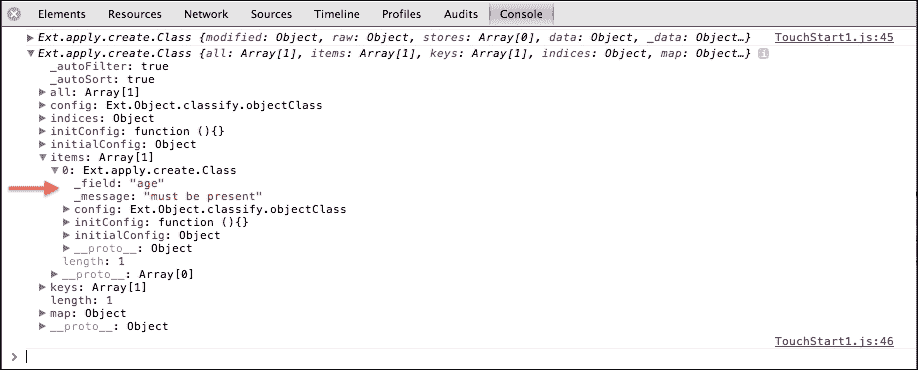
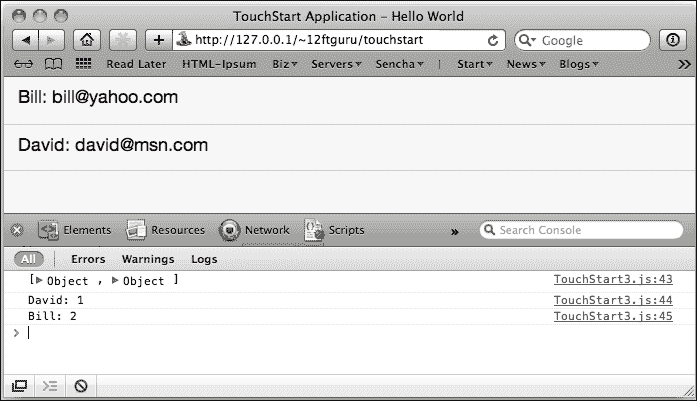
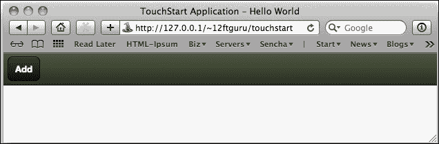
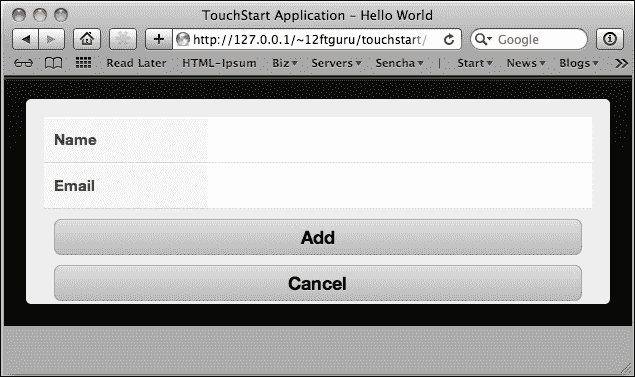
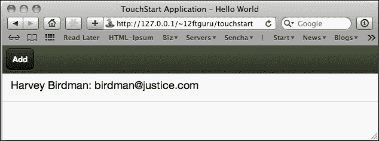
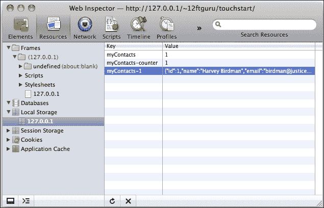
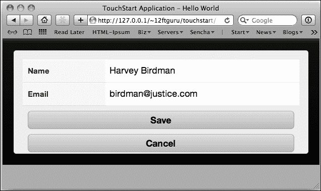
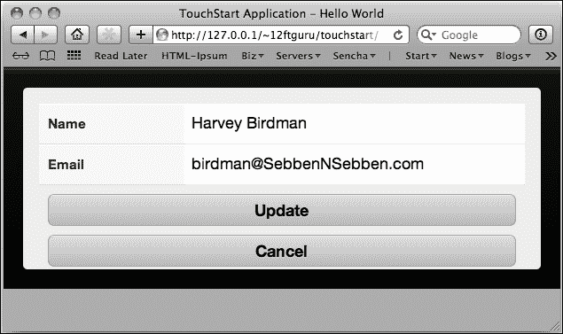

# 第六章：获取数据

任何应用程序的关键方面之一是处理数据——将数据输入应用程序，以便您可以操作和存储它，然后再次获取以供显示。我们将用接下来的两章来讨论 Sencha Touch 中的数据处理。本章将重点介绍如何将数据输入您的应用程序。

我们将从讨论用于描述您数据的模型开始。然后，我们将讨论收集数据的读取器以及用于在应用程序中保存数据的存储。一旦我们了解了数据去了哪里，我们将介绍如何使用表单来获取数据。我们将查看如何验证您的数据，并为您提供一些表单提交示例。最后，我们将介绍如何将数据回填到表单中以进行编辑。这将是下一章关于数据的起点，该章节将涵盖如何获取数据以供显示。

本章涵盖了以下主题：

+   数据模型

+   数据格式

+   数据存储

+   使用表单和数据存储

# 模型

在 Sencha Touch 应用程序中处理数据的第一步是创建数据的模型。如果您习惯于数据库驱动的应用程序，将模型视为数据库架构会有所帮助；这是一个定义我们将要存储的数据的构造，包括数据类型、验证和结构。这为我们的应用程序的其余部分提供了一个共同的映射，用于理解来回传递的数据。

在 Sencha Touch 2 中，模型还可以用于保存单个数据记录的信息。这意味着我们可以使用已经内置到 Sencha Touch `Ext.data.Model`组件中的函数来创建、读取、更新和删除单个记录。

## 基本模型

在最基本的情况下，模型使用`Ext.define()`描述数据字段，如下所示：

```js
Ext.define('User', {
extend: 'Ext.data.Model',
config: {
  fields: [
    {name: 'firstname', type: 'string'},
    {name: 'lastname', type: 'string'},
    {name: 'username', type: 'string'},
    {name: 'age', type: 'int'},
    {name: 'email', type: 'string'},
    {name: 'active', type: 'boolean', defaultValue: true},
  ]
 }
}
```

第一行声明我们已经将新模型命名为`User`，并且我们正在扩展默认的`Ext.data.Model`。我们在`config`部分内设置模型的配置选项。

### 提示

在版本 2 中，模型设置有所变化。我们现在使用`Ext.define`和扩展，而不是通过旧的模型管理器创建事物。我们还将模型的选项包裹在一个`config`部分内。在`extend`设置外，您的模型选项的其余部分应该用这个`config`部分包裹起来。

在`config`部分内，我们将描述我们的数据字段作为一个`fields`数组，包括`name`、`type`和可选的`defaultValue`字段。`name`字段就是我们希望在代码中引用数据的方式。`type`的有效值是：

+   `auto`：这是一个默认值，它接受原始数据而不进行转换

+   `string`：这将数据转换为字符串

+   `int`：这将数据转换为整数

+   `float`：这将数据转换为浮点整数

+   `boolean`：这将数据转换为真或假的布尔值

+   `date`：这将数据转换为 JavaScript `Date`对象

`defaultValue`字段可以用来设置一个标准值，如果该字段没有收到数据，就可以使用这个值。在我们的例子中，我们将`active`的值设置为`true`。我们可以在使用`Ext.create()`创建新的用户实例时使用这个值：

```js
var newUser = Ext.create('User', {
  firstname: 'Nigel',
  lastname: 'Tufnel',
  username: 'goes211',
  age: 39,
  email: 'nigel@spinaltap.com'
});
```

请注意，我们在新的用户实例中没有为`active`提供值，所以它只是使用了我们的模型定义中的`defaultValue`字段。这也可以在用户忘记输入值时帮助用户。我们还可以通过使用`validations`来验证用户输入的信息。

## 模型验证

模型验证确保我们得到我们认为得到的数据。这些验证有两个功能。第一个是提供数据输入的指导方针。例如，我们通常希望用户名只包含字母和数字；验证可以强制这个约束，并在用户使用错误字符时通知用户。

第二个是安全性；恶意用户也可以通过表单字段发送可能对我们数据库有害的信息。例如，如果数据库没有得到适当保护，将`DELETE * FROM users;`作为用户名发送可能会造成问题。始终验证数据是个好主意。

我们可以将`validations`作为数据模型的一部分来声明，就像我们声明字段一样。例如，我们可以在我们的`User`模型中添加以下代码：

```js
Ext.define('User', { 
extend: 'Ext.data.Model',
 config: {
  fields: [
    {name: 'firstname', type: 'string'},
    {name: 'lastname', type: 'string'},
    {name: 'age', type: 'int'},
    {name: 'username', type: 'string'},
    {name: 'email', type: 'string'},
    {name: 'active', type: 'boolean', defaultValue: true},
  ],
  validations: [
    {type: 'presence',  field: 'age'},
    {type: 'exclusion', field: 'username', list: ['Admin', 'Root']},
     {type: 'length', field: 'username', min: 3},
    {type: 'format', field: 'username', matcher: /([a-z]+)[0-9]{2,3}/}
  ]
 }
}
```

在我们的例子中，我们增加了四个验证。第一个测试`age`值的存在。如果没有`age`的值，我们会得到一个错误。第二个验证器`exclusion`测试我们不希望在此字段中看到的值。在这个例子中，我们有一个用户名的列表，我们不希望看到的是`Admin`和`Root`。第三个验证器确保我们的用户名至少有三个字符长。最后一个验证器使用正则表达式检查我们的用户名格式。

### 提示

**正则表达式**

**正则表达式**，也称为**正则表达式**或**正则表达式**，是匹配字符串结构的极其强大的工具。您可以使用正则表达式在字符串中搜索特定的字符、单词或模式。正则表达式的讨论需要一本自己的书，但网上有许多好的资源。

好的教程可以在以下位置找到：

[`www.zytrax.com/tech/web/regex.htm`](http://www.zytrax.com/tech/web/regex.htm)。

一个可搜索的正则表达式数据库可以在以下位置找到：

[`regexlib.com`](http://regexlib.com)。

一个出色的正则表达式测试器也在此处提供：

[`www.rexv.org/`](http://www.rexv.org/)。

我们可以通过使用我们新`User`实例的`validate`方法来测试我们的验证：

```js
var newUser = Ext.create('User', {
  firstname: 'Nigel',
  lastname: 'Tufnel',
  username: 'goes211',
  email: 'nigel@spinaltap.com'
});

var errors = newUser.validate();
console.log(errors);
```

请注意，我们故意这次省略了`age`字段，以给我们一个错误。如果我们查看我们的控制台，我们可以看到我们返回的`Ext.data.Errors`对象，如下面的屏幕截图所示：



这是我们`errors`对象的控制台输出。`errors`对象包括一个名为`isValid()`的方法，它将返回一个`true`或`false`值。我们可以使用这个方法来测试错误并向用户返回消息，例如：

```js
  if(!errors.isValid()) {
    alert("The field: "+errors.items[0].getField()+ " returned an error: "+errors.items[0].getMessage());
  }
```

这里，我们测试`errors`是否有效，如果不有效，则显示第一个错误的信息。然后我们使用`getField()`和`getMessage()`在用户的警报中显示信息。这些详细的错误信息包含在`errors`对象的`items`列表中。在实际使用中可能会有多个错误，因此我们需要遍历`items`列表以获取所有错误。

我们还可以通过在验证上设置额外的配置选项来更改默认错误消息：

+   `exclusionMessage`：当我们在字段中得到一个被排除的值时使用。

+   `formatMessage`：当我们在字段中得到格式不正确的值时使用。

+   `inclusionMessage`：当我们在字段中没有得到包含的值时使用。

+   `lengthMessage`：当字段的值不符合我们所需的长度时使用此功能。

+   `presenceMessage`：当我们在字段中没有保留所需的值时使用。

定制这些错误将帮助用户了解到底出现了什么问题以及需要采取什么措施来解决问题。

## 模型方法

我们的模型还可以包含可以对模型实例调用的方法。例如，我们可以在`User`模型的`fields`列表之后添加一个名为`deactivate`的方法。

```js
deactivate: function() {
 if(this.get('active')) {
  this.set('active', false);
 }
}
```

这个函数检查我们当前的`active`值是否为`true`。如果是，我们将其设置为`false`。一旦我们像以前那样创建了`newUser`，我们可以像以下方式调用该函数：

```js
newUser.deactivate();
```

这些模型方法为在模型中实现常见功能提供了很好的方式。

### 提示

**CRUD**

尽管模型方法可能看起来是一个添加函数以保存我们模型的不错选择，但实际上你真的不需要这样做。这些类型的函数—`Create`、`Read`、`Update`和`Destroy`—通常被称为不吸引人的缩写**CRUD**，它们由 Sencha Touch 自动处理。我们将在本章后面稍后再讨论这些功能。

现在我们已经定义了模型的字段、验证和函数，我们需要一种方法来在模型之间传递数据以存储和检索我们的用户。这时代理和读取器就派上用场了。

## 代理和读取器

在该模型中，代理和读取器合作存储和检索模型要使用的数据。代理告诉模型其数据将存储在哪里，读取器告诉模型正在使用哪种格式来存储数据。

代理主要有两种类型：本地和远程。本地代理在其设备上以两种代理类型之一存储其数据：

+   `LocalStorageProxy`：通过浏览器将数据保存到本地存储。除非用户删除，否则这些数据在会话之间是持久的。

+   `MemoryProxy`：本地内存中保存数据。页面刷新时，数据会被删除。

远程代理有两个基本类型：

+   `AjaxProxy`：将请求发送到当前域内的服务器。

+   `JsonP`：这会将请求发送到不同域上的服务器（在先前版本中这被称为`scripttag`代理）。

此外，还有一些特殊化的代理，包括：

+   `Direct`：这是一种专有的 Sencha 技术，与 Ajax 一样，允许与远程服务器进行异步通信。然而，与 Ajax 不同，`Direct`不需要保持一个到远程服务器的套接字打开，等待响应。这使得它非常适合任何可能需要服务器长时间响应延迟的过程。有关`Direct`的更多信息，请访问：

    [Ext.direct.Manager api](http://docs.sencha.com/touch/2.2.0/#!/api/Ext.direct.Manager).

+   `Rest`：`Rest`代理采用基本代理功能（`Create`、`Read`、`Edit`和`Delete`），并将这些映射到 HTTP 请求类型（分别是`POST`、`GET`、`PUT`和`DELETE`）。这种通信方式在商业 API 中非常常见。有关其他代理的更多信息，请访问：

    [Ext.data.proxy.Rest api](http://docs.sencha.com/touch/2.2.0/#!/api/Ext.data.proxy.Rest)。

    有关 REST 协议本身的更多信息，请访问：

    [HTTP 和 REST 的初学者介绍](http://net.tutsplus.com/tutorials/other/a-beginners-introduction-to-http-and-rest/)。

+   `Sql`：此代理允许您在本地 SQL 数据库中存储数据。这不应与实际的 SQL 服务器混淆。Sencha Touch SQL 代理将模型数据输出到 HTML5 本地数据库中，使用 WebSQL。

在本章及下一章中，我们将主要处理本地代理。我们将在第九章高级主题中覆盖远程代理和数据同步，*高级主题*。

代理可以作为模型的一部分声明，如下所示：

```js
proxy: {
  type: 'localstorage'
  id: 'userProxy'
}
```

所有代理都需要一个类型（本地存储、会话存储等）；然而，一些代理将需要附加信息，例如`localstorage`代理所需的唯一 ID。

我们还可以向此代理配置中添加一个读者。读者的任务是告诉我们的代理发送和接收数据时应使用哪种格式。读者理解以下格式：

+   `array`：一个简单的 JavaScript 数组

+   `xml`：可扩展标记语言格式

+   `json`：一种 JavaScript 对象表示法格式

读者作为代理的一部分被声明：

```js
proxy: {
  type: 'localstorage',
  id: 'userProxy',
  reader: {
    type: 'json'
  }
}
```

### 小贴士

**声明代理和读者**

代理和读取器也可以作为数据存储和模型的一部分声明。如果为存储和模型声明了不同的代理，那么调用`store.sync()`将使用存储的代理，而调用`model.save()`将使用模型的代理。通常只有在复杂情况下才需要在模型和存储上使用不同的代理。这也可以是令人困惑的，所以最好只在模型中定义代理，除非你确切知道你在做什么。

# 介绍数据格式

在我们将数据存储前进之前，我们需要简要地查看一下数据格式。Sencha Touch 目前支持的三种数据格式是数组、XML 和 JSON。对于每个示例，我们将查看一个简单的`contact`模型，其中包含三个字段：ID、姓名和电子邮件 ID，数据将如何显示。

## 数组

`ArrayStore`数据格式使用标准的 JavaScript 数组，对于我们这个`contact`示例，它看起来像这样：

```js
[ 
  [1, 'David', 'david@gmail.com'],
  [2, 'Nancy', 'nancy@skynet.com'],
  [3, 'Henry', 'henry8@yahoo.com']
]
```

这种数组的一个首要特点是没有字段名包括在 JavaScript 数组中。这意味着如果我们想通过名称在我们的模板中引用字段，我们必须通过使用`mapping`配置选项来设置我们的模型，使其理解这些字段应该映射到数据数组的哪个位置：

```js
Ext.define('Contact', {
 extend: 'Ext.data.Model',
  config: {
   fields: [
        'id',
        {name: 'name', mapping: 1},
        {name: 'email', mapping: 2}
    ],
    proxy: {
      type: 'memory',
      reader: {
        type: 'array'
      }
    }
   }
});
```

这设置我们的`id`字段为数据索引`0`，这是默认值。然后我们使用`mapping`配置将`name`和`email`分别设置为数据数组索引`1`和`2`，然后我们可以使用配置设置模板值：

```js
itemTpl: '{name}: {email}'
```

尽管数组通常用于简单的数据集，但对于更大的或嵌套的数据集，使用简单的 JavaScript 数组结构可能会变得非常难以管理。这就是我们的其他格式发挥作用的地方。

## XML

**可扩展标记语言**（**XML**）对于那些过去曾与 HTML 网页一起工作的人来说，应该是一个熟悉的格式。XML 由一系列嵌套在标签中的数据组成，这些标签标识数据集的每个部分的名字。如果我们把之前的例子转换成 XML 格式，它将如下所示：

```js
<?xml version="1.0" encoding="UTF-8"?>
<contact>
  <id>1</id>
  <name>David</name>
  <email>david@gmail.com</email>
</contact>
<contact>
  <id>2</id>
  <name>Nancy</name>
  <email>nancy@skynet.com</email>
</contact>
<contact>
  <id>3</id>
  <name>Henry</name>
  <email>henry8@yahoo.com</email>
</contact>
```

注意，XML 总是以版本和编码行开始。如果没有设置这一行，浏览器将无法正确解释 XML，请求将会失败。

我们还包括用于定义各个联系人的标签。这种格式的一个优点是我们现在可以嵌套数据，如下面的代码所示：

```js
<?xml version="1.0" encoding="UTF-8"?>
<total>25</total>
<success>true</success>
<contacts>
  <contact>
    <id>1</id>
    <name>David</name>
    <email>david@gmail.com</email>
  </contact>
  <contact>
    <id>2</id>
    <name>Nancy</name>
    <email>nancy@skynet.com</email>
  </contact>
  <contact>
    <id>3</id>
    <name>Henry</name>
    <email>henry8@yahoo.com</email>
  </contact>
</contacts>
```

在这个嵌套示例中，我们每个单独的`contact`标签都嵌套在一个`contacts`标签内。我们还为我们的`total`和`success`值设置了标签。

由于我们有一个嵌套数据结构，我们也需要让读取器知道去哪里寻找我们需要的片段。

```js
reader: {
    type: 'xml',
    root: 'contacts',
    totalProperty  : 'total',
    successProperty: 'success'
}
```

`root`属性告诉读取器从哪里开始查找我们的单个联系人。我们在`contacts`列表之外也设置了一个`totalProperty`值。这告诉存储器总共有 25 个联系人，尽管存储器只接收前三个。`totalProperty`属性用于分页数据（即显示 25 个中的 3 个）。

我们`contacts`列表之外的另一个属性是`successProperty`。这告诉存储器在哪里检查请求是否成功。

XML 的唯一缺点是它不是原生 JavaScript 格式，因此当系统解析它时会有一些开销。通常，只有在非常庞大或深度嵌套的数组中才会注意到这一点，但对于某些应用程序来说可能是个问题。

幸运的是，我们也可以使用 JSON。

## JSON

**JavaScript 对象表示法**（**JSON**）具有 XML 的所有优点，但由于它是原生 JavaScript 结构，因此与解析 XML 相比，它具有更少的开销。如果我们把我们的数据集看作是 JSON，我们会看到以下内容：

```js
[
  {
    "id": 1,
    "name": "David",
    "email": "david@gmail.com"
  },
  {
    "id": 2,
    "name": "Nancy",
    "email": "nancy@skynet.com"
  },
  {
    "id": 3,
    "name": "Henry",
    "email": "henry8@yahoo.com"
  }
]
```

我们也可以以与处理 XML 相同的方式嵌套 JSON：

```js
{ 
  "total": 25,
  "success": true,
  "contacts": [
   {
    "id": 1,
    "name": "David",
    "email": "david@gmail.com"
   },
   {
    "id": 2,
    "name": "Nancy",
    "email": "nancy@skynet.com"
   },
   {
    "id": 3,
    "name": "Henry",
    "email": "henry8@yahoo.com"
   }
  ]
}
```

然后，读取器会像我们的 XML 读取器一样设置，但将类型列为 JSON：

```js
reader: {
    type: 'json',
    root: 'contacts',
    totalProperty  : 'total',
    successProperty: 'success'
}
```

与之前一样，我们为`totalProperty`和`successProperty`设置了属性。我们还为读取器提供了一个开始查找我们的`contacts`列表的地方。

### 提示

还应注意的是，`totalProperty`和`successProperty`的默认值分别是`total`和`success`。如果你在自己的 JSON 返回值中使用了`total`和`success`，你实际上不需要在`reader`上设置这些配置选项。

## JSONP

JSON 还有一种替代格式，称为 JSONP，即带填充的 JSON。这种格式用于你需要从远程服务器获取数据时。我们需要这个选项，因为大多数浏览器在处理 JavaScript 请求时遵循严格的同源策略。

同源策略意味着 web 浏览器只允许 JavaScript 在与 web 页面相同的服务器上运行，只要 JavaScript 在运行。这将防止许多潜在的 JavaScript 安全问题。

然而，有时你会出于正当理由从远程服务器发起请求，例如查询 Flickr web service 的 API。因为你的应用可能不会在[flickr.com](http://flickr.com)上运行，你需要使用 JSONP，它简单地告诉远程服务器将 JSON 响应封装在一个函数调用中。

幸运的是，Sencha Touch 为我们处理所有这些事情。当你设置你的代理和读取器时，将代理类型设置为`jsonp`，并像设置常规 JSON 读取器一样设置你的读取器。这告诉 Sencha Touch 使用`Ext.data.proxy.JsonP`来执行跨域请求，而 Sencha Touch 处理其余部分。

### 注释

如果您想看看 JSONP 和`Ext.data.proxy.JsonP`的实际应用，我们在第八章，*创建 Flickr Finder 应用程序*中使用两者来构建**Flickr Finder**应用程序。

虽然我们有多种格式可供选择，但本章余下的例子我们将使用 JSON 格式。

# 介绍存储

顾名思义，存储用于存储数据。正如我们在前几章所看到的，列表组件需要一个存储来显示数据，但我们也可以使用存储从表单中获取信息并将其保存在我们应用程序的任何地方。

存储、模型和代理一起工作，与传统数据库非常相似。模型为我们数据提供结构（如传统数据库中的架构），代理提供通信层，以便将数据进出存储。存储本身持有数据，并为排序、筛选、保存和编辑数据提供强大的组件接口。

存储还可以绑定到许多组件，如列表、嵌套列表、选择字段和面板，以提供显示数据。

我们将在第七章，*获取数据外*中覆盖显示、排序和筛选内容，但目前，我们将着手查看使用存储来保存和编辑数据。

## 简单的存储

由于本章关注的是将数据导入存储，我们将从一个非常简单的本地存储示例开始：

```js
var contactStore = Ext.create('Ext.data.Store', {
  model: 'Contact',
  autoLoad: true
});
```

这个示例告诉存储使用哪个模型，这反过来定义了存储知道的字段以及存储应该使用的代理，因为存储将采用字段列表和代理从其模型中。我们还设置存储为`autoLoad`，这意味着一旦创建存储，它就会加载数据。

### 注意

如果您在存储配置中声明了一个代理，那么将使用该代理而不是模型的代理。在某些情况下这很有用，例如您想要存储关于记录集合的信息，如一组管理员用户。在这种情况下，模型用于存储用户详细信息，但存储用于收集特定类型（管理员用户）的多个用户。

我们还需要确保我们的模型设置正确，以便使用此存储。由于我们在存储中没有列出代理，我们需要确保模型有一个，如果我们想要保存我们的数据：

```js
Ext.define('Contact', {
 extend: 'Ext.data.Model',
  config: { 
   fields: [
        {name: 'id', type:'int'},
        {name: 'name', type: 'string'},
        {name: 'email',  type: 'string'}
    ],
    proxy: {
        type: 'localstorage',
        id: 'myContacts',
        reader: {
          type: 'json'
        }
    }
  }
});
```

这是一个包含三个项目的简单模型：一个 ID、一个名称和一个电子邮件地址。我们然后像以前一样创建一个新的联系人：

```js
  var newContact = Ext.create('Contact', {
    name: 'David',
    email: 'david@msn.com'
  });
```

请注意，这次我们没有设置 ID。我们希望存储为我们设置 ID（这与典型数据库中的自动递增类似）。然后我们可以将这个新联系人添加到存储中并保存它：

```js
var addedUser = contactStore.add(newContact);
contactStore.sync();
```

第一行将用户添加到商店，第二行保存商店的内容。通过将 `add` 和 `sync` 功能分开，你可以向商店添加多个用户，然后执行一次保存，如下面的代码所示：

```js
  var newContact1 = Ext.create('Contact', {
    name: 'David',
    email: 'david@msn.com'
  });

  var newContact2 = Ext.create('Contact',
    name: 'Bill',
    email: 'bill@yahoo.com'
  });

var addedContacts = contactStore.add(newContact1, newContact2);
contactStore.sync();
```

在这两种情况下，当我们向商店添加联系人时，我们设置一个返回变量来获取 `add` 方法的返回值。这个方法返回一个联系人数组，现在每个 `contact` 对象都将有一个唯一的 ID。我们可以在我们的同步之后添加几个控制台日志来查看这些值：

```js
console.log(addedContacts);
console.log(addedContacts[0].data.name+': '+addedContacts[0].data.id);
console.log(addedContacts[1].data.name+': '+addedContacts[1].data.id);
```

这将显示返回两个 `contact` 对象的数组。它还显示了如何通过使用数组中特定联系人的索引号来获取我们需要的数据。然后我们可以深入到数据中，获取姓名和我们在同步时分配的新 ID。



既然我们已经大致了解了如何将数据输入商店的方法，那么让我们来看看如何使用表单来完成它。

## 表单和商店

在这个例子中，我们将使用与上一个例子相同的商店和模型，但我们将添加一个列表和一个表单，这样我们就可以添加新的联系人并查看我们添加了什么。让我们从列表开始：

```js
this.viewport = Ext.create('Ext.Panel', {
    fullscreen: true,
    layout: 'fit',
    items: [
  {
        xtype: 'toolbar',
        docked: 'top',
        items: [{
            text: 'Add',
            handler: function() {
              Ext.Viewport.add(addNewContact);
              addNewContact.show()
            }
        }]
    },
    {
      xtype: 'list',
      itemTpl: '{name}: {email}',
      store: contactStore
    }]
});
```

你会得到类似于以下屏幕截图的东西：



这里的大部分代码与之前的例子非常相似。我们有一个带有 `list` 组件的单个子面板。我们的列表有一个使用与我们的 `contact` 模型相同的字段名的模板 `itemTpl`，它决定了它们将如何显示。我们还添加了一个带有我们新 **添加** 按钮的固定工具栏。

### 提示

`toolbar` 组件也发生了变化，与 Sencha Touch 的以前版本不同。在版本 2 中，`toolbar` 是 `items` 列表的一部分，而不是作为一个单独的 `dockedItem`。此外，`toolbar` 的位置以前是通过 `dock` 配置选项来设置的。在 Sencha Touch 2 中，这被改为了 `docked`。还应该注意的是，如果你尝试使用旧的 `dockedItem` 和 `dock` 配置，你不会得到任何错误。你也不会得到工具栏。这可能会导致你扯掉很多头发并说出粗糙的语言。

按钮有一个非常简单的函数，它将一个名为 `addNewContact` 的 Ext.Sheet 添加到我们的视口，然后显示该表单。现在我们需要实际创建这个表单：

```js
var addNewContact = Ext.create('Ext.Sheet', {
  height: 250,
  layout: 'fit',
  stretchX: true,
  enter: 'top',
  exit: 'top',
  items: […]
});
```

这给了我们一个新表单，当我们点击 **添加** 按钮时会出现。现在，我们需要将我们的表单字段添加到我们刚刚创建的表单的 `items` 部分：

```js
{
  xtype: 'formpanel',
  padding: 10,
  items: [
    {
     xtype: 'textfield',
     name : 'name',
     label: 'Full Name'
    },
    {
     xtype: 'emailfield',
     name : 'email',
     label: 'Email Address'
   }
  ]
}
```

我们首先创建一个 `formpanel` 组件，然后将 `textfield` 和 `emailfield` 添加到 `formpanel` 的 `items` 列表中。

### 专业文本字段

Sencha Touch 使用了如 `emailfield`、`urlfield` 和 `numberfield` 等专业文本字段，以控制移动设备使用哪种键盘，如下面的 iPhone 示例所示：


前述图表中所示的键盘类型如下解释：

+   **URL 键盘**用点（`.`）、斜杠（`/**`）和`.com`的键替换了传统的空格键。

+   **电子邮件键盘**缩短了空格键，并为`@`和点（`.`）腾出了空间。

+   **数字键盘**最初显示数字键盘，而不是标准的 QWERTY 键盘。

这些特殊字段不会自动验证用户输入的数据。那些验证是通过模型验证处理的。

### 提示

**特殊键盘**

安卓和 iOS 拥有略微不同的特殊键盘，因此你可能会在这两者之间找到一些变化。通常，运行你的应用程序通过安卓和 iOS 模拟器，以确保正确使用键盘类型。

## 将字段映射到模型

你还会注意到我们表单中的每个字段名称与我们`contact`模型的名称相匹配；这将允许我们轻松创建联系信息并将它们添加到商店中。然而，在我们到达那里之前，我们需要添加两个按钮（**保存**和**取消**），以告诉表单要做什么。

在我们表单中的`emailfield`对象之后，我们需要添加以下内容：

```js
{
  xtype: 'button',
  height: 20,
  text: 'Save',
  margin: 10,
  handler: function() {
    this.up('sheet').hide();
  }
  }, {
  xtype: 'button',
  height: 20,
  margin: 10,
  text: 'Cancel',
  handler: function() {
    this.up('sheet').hide();
  }
}
```

这给了我们在表单底部两个按钮。现在，我们的**保存**和**取消**按钮做相同的事情：它们调用一个函数来隐藏包含我们表单的弹出窗口。这是一个很好的起点，但我们还需要更多功能来让**保存**按钮保存我们的数据。



由于我们是很棒的程序员，并且给我们的字段命名以匹配我们的模型，我们只需要在我们按钮处理程序中使用以下代码就可以将我们的表单添加到我们的商店中：

```js
handler: function() {
  var form = this.up('formpanel');
  var record = Ext.create('Contact', form.getValues());
  contactStore.add(record);
  contactStore.sync();
  form.reset();
  this.up('sheet').hide();
 }
```

第一行使用`up`方法获取围绕按钮的表单。第二行使用`form.getValues()`，并将输出直接传递到一个新`Contact`模型中，使用我们之前示例中的`create()`方法。然后我们可以将新联系信息添加到商店并同步，就像我们之前做的那样。

我们需要做的最后一点清理工作是通过使用`form.reset()`来清除所有表单值，然后像之前一样隐藏表单。如果我们不清除字段，下次我们显示表单时数据仍然会存在。

当我们同步商店时，与商店关联的列表将会刷新，我们的新联系信息会出现。



由于这个商店使用本地存储来保存数据，我们的列表在我们退出 Safari 浏览器后仍然会保持原位。当你测试应用程序时，这可能会让你感到有些烦恼，所以让我们来看看如何清除商店中的数据。

## 清除商店数据

本地存储和会话存储在我们本地计算机上保存信息。由于我们计划在编码时进行大量测试，知道如何清除这类数据而又不删除可能仍然需要的其他数据是个好主意。要清除您本地或会话存储中的数据，请按照以下步骤操作：

1.  从**开发**菜单中打开**网络检查器**，并选择**资源**标签。

1.  在**本地存储**或**会话存储**部分（取决于您使用的方法），您应该看到您应用程序的数据库。一旦您选择了数据库，您可以删除特定的记录或完全清空数据库。只需在屏幕右侧选择记录，然后点击底部的**X**以删除记录。

1.  您还可以通过双击它并更改数字来重置计数器的值。小心不要创建具有相同数字的多个记录。这将造成大问题。

1.  在**资源**部分完成后，让我们继续使用我们的表单编辑数据。

## 使用表单编辑

现在我们已经了解了将数据传入存储的基本知识，让我们来看看如何使用对我们当前表单进行一些修改来编辑这些数据。

我们想要添加的第一个是一个`itemsingletap`监听器到我们的列表上。这将让我们点击列表中的一个项目并弹出包含所选条目的表单，以便我们进行编辑。监听器如下所示：

```js
listeners: {
 itemsingletap: {
  fn: function(list, index, target, record){
   addNewContact.down('form').setRecord(record);
   Ext.Viewport.add(addNewContact);
   addNewContact.show();
  }
 }
} 
```

我们的`itemsingletap`监听器将自动返回`list`的副本、项目的`index`属性、`target`元素以及被点击项背后的`record`。然后我们可以获取我们表单内的表单并在其中设置记录。

经常以这种方式链接函数很有用，特别是如果你需要用到的部分只需使用一次。例如，我们可以这样做：

```js
var form = addNewContact.down('form');
form.setRecord(record);
```

这样也可以让我们在函数的许多地方使用那个`form`变量。由于我们只需要用它来设置记录，我们可以将这两行合并为一行：

```js
addNewContact.down('form').setRecord(record);
```

以下方式将数据加载到我们的表单中：



还有一个问题需要解决：我们的**保存**按钮硬编码到向存储中添加新记录。如果我们现在点击**保存**，我们最终会得到同一个联系人的多个副本。我们需要对我们的表单进行更改，以便让我们可以根据我们是在编辑还是创建新联系人来切换**保存**按钮的行为。

### 切换处理程序

为了更改处理程序，按钮触发保存我们的联系人；我们需要将代码的主体与按钮本身分开。首先，找到我们的**保存**按钮的处理程序，并将当前函数复制到剪贴板。接下来，我们想要用外部函数的名称替换那个函数：

```js
handler: addContact
```

我们还将以以下方式向我们的按钮添加一个额外的`config`选项：

```js
action: 'saveContact'
```

这将使我们稍后用组件查询更容易地获取我们的按钮。

### 小贴士

`action`配置选项是一个完全任意的名称。您不受限于 Sencha 定义的选项。您可以为组件定义任何其他选项，并在处理程序和控制器中像其他任何配置选项一样引用它们。

现在，我们需要为这个处理程序创建一个新的`addContact`函数。在我们创建`addNewContact`表单的 JavaScript 文件中，在创建`addNewContact`表单之前，添加一个名为`addContact`的新函数，并粘贴我们旧`handler`函数的代码。它应该如下所示：

```js
var addContact = function() {
  var form = this.up('formpanel');
  var record = Ext.create('Contact', form.getValues());
  contactStore.add(record);
  contactStore.sync();
  form.reset();
  this.up('sheet').hide();
};
```

这是我们之前在按钮上使用过的表单保存函数，它添加新联系人正好合适。现在，我们需要创建一个类似的函数，当我们在列表中点击它们时更新我们的联系人。

在我们的`addContact`函数顶部，添加以下代码：

```js
var updateContact = function() {
  var form = this.up('formpanel');
  var rec = form.getRecord();
  var values = form.getValues();
  rec.set(values);
  contactStore.sync();
  form.reset();
  this.up('sheet').hide();
};
```

这个函数几乎做了我们另一个函数的所有事情。然而，不同的是，它不是获取表单字段并创建一个新的记录，而是使用`form.getRecord()`从表单本身获取记录。这个记录是我们需要用新信息更新的记录。

然后，我们使用`form.getValues()`获取表单的当前值。

我们的`rec`变量现在设置为数据存储中的旧记录。然后，我们可以使用`rec.set(values)`将该记录传递给新数据，这将用我们当前表单值覆盖存储记录中的旧信息。由于我们没有传递新值，ID 将保持不变。

更新记录后，我们只需执行以下早期所做的操作：

+   `sync`

+   `reset`

+   `hide`

现在我们的两个函数的代码已经就位，我们需要根据用户是否点击了我们列表顶部的**添加**按钮或选择了列表中的项目来切换**保存**按钮的处理程序。

让我们从**添加**按钮开始。在`list`对象的顶部找到**添加**按钮的处理程序。我们需要向这个按钮添加一些代码，以更改**保存**按钮的处理程序：

```js
handler: function() {
  var button = addNewContact.down('button[action=saveContact]');
  button.setHandler(addContact);
  button.setText('Add');
  Ext.Viewport.add(addNewContact);
  addNewContact.show();
}
```

由于我们的`addNewContact`表单已经在代码的其他地方定义为一个变量，我们可以使用`down()`方法获取`button`并做一些更改。首先，更新处理程序以查看我们的新`addContact`函数，第二个更改是将按钮的文本更改为`创建`。然后，我们可以在视口中添加我们的`addNewContact`表单并调用`addNewContact.show()`，就像以前一样。

我们的**添加**按钮现在设置为显示表单并更改按钮的文本和处理程序。

现在，我们需要对列表中的`itemsingletap`处理程序做类似的事情：

```js
itemsingletap: {
  fn: function(list,index, target, record){
    addNewContact.down('formpanel').setRecord(record);
    var button = addNewContact.down('button[action=saveContact]');
    button.setHandler(updateContact);
    button.setText('Update');
    Ext.Viewport.add(addNewContact);
    addNewContact.show();
  }
}
```

在这里，我们仍然获取记录并将其加载到表单中，但我们要获取`button`带有`action`值为`saveContact`的元素，并更改处理程序和文本。更改将**保存**按钮指向我们的`updateContact`函数，并将文本更改为`更新`。



# 从数据存储中删除

如果你还记得之前我们讨论 CRUD 功能的时候，你会发现我们已经成功覆盖了`Create`（创建）、`Read`（读取）和`Update`（更新）。这些操作都是由存储自动完成的，几乎不需要编写任何代码。那么`Delete`（删除）呢？

结果表明，`Delete`（删除）与其他存储方法一样简单。我们可以使用两个方法中的任意一个：第一个是`remove()`—它需要一个记录作为参数—第二个是`removeAt`，它需要一个索引来确定要删除的记录。我们可以将其中任何一个作为我们编辑表单的一部分，通过在表单底部添加一个新按钮来实现，如下所示：

```js
{
  xtype: 'button',
  height: 20,
  margin: 10,
  text: 'Delete',
  ui: 'decline',
  handler: function() {
    var form = this.up('formpanel');
    contactStore.remove(form.getRecord());
    contactStore.sync();
    form.reset();
    this.up('sheet').hide();
  }
}
```

使用`remove`需要存储记录，因此我们从表单面板中获取记录：

```js
contactStore.remove(form.getRecord());
```

这样就处理了所有基本的`Create`（创建）、`Read`（读取）、`Edit`（编辑）和`Delete`（删除）功能。只要你记得设置你的模型并匹配你的字段名，存储会自动处理大多数基本操作。

### 注意

**更多信息**

Sencha 提供了许多关于使用表单、模型和存储的优秀教程，请访问[`docs.sencha.com/touch/2.2.1/#!/guide`](http://docs.sencha.com/touch/2.2.1/#!/guide)。

# 总结

在本书的第四章，我们介绍了在 Sencha Touch 中构成所有数据基本结构的数据模型。我们查看了代理和读取器，它们处理数据存储与其他组件之间的通信。我们还讨论了在 Sencha Touch 中持有所有数据的存储。最后，我们查看了如何使用表单将数据进出存储，以及如何在数据不再需要时删除数据。

在下一章中，我们将查看一旦我们把数据从存储中取出后可以做的所有其他事情。
