# 第七章：获取数据

在上一章中，我们了解了如何将数据导入 Sencha Touch 数据存储。一旦我们有了数据，下一步就是弄清楚如何从存储中获取数据并在我们的应用程序中使用它。幸运的是，Sencha Touch 有几种内置方法可以帮助我们完成这项任务。在这里，我们将探讨如何使用单个数据记录以及数据存储的完整内容来在我们的应用程序中显示信息。

在本章中，我们将探讨：

+   使用数据存储进行显示

+   绑定、排序、过滤、分页和加载数据存储

+   使用 XTemplates

+   在 XTemplate 中遍历数据

+   XTemplates 中的条件显示和内联函数

+   在 XTemplates 中的内联 JavaScript 和成员函数

+   使用 Sencha Touch 图表显示存储数据

# 使用数据存储进行显示

能够在应用程序中存储数据只是战斗的一半。您需要能够轻松地将数据重新取出并以有意义的方式呈现给用户。Sencha Touch 中的列表、面板和其他具有数据功能的组件提供三种配置选项来帮助您完成这项任务：`store`、`data`和`tpl`。

## 直接绑定存储

数据视图、列表、嵌套列表、表单选择字段和索引栏都旨在显示多个数据记录。这些组件中的每一个都可以配置一个数据存储，从中提取这些记录。我们在书中的早些时候介绍了这种做法：

```js
Ext.application({
    name: 'TouchStart',
    launch: function () {
        Ext.define('Contact', {
            extend: 'Ext.data.Model',
            config: {
                fields: [
                    {name: 'id'},
                    {name: 'first', type: 'string'},
                    {name: 'last', type: 'string'},
                    {name: 'email', type: 'string'}
                ],
                proxy: {
                    type: 'localstorage',
                    id: 'myContacts',
                    reader: {
                        type: 'json'
                    }
                }
            }
        });

        var main = Ext.create('Ext.Panel', {
            fullscreen: true,
            layout: 'fit',
            items: [
                {
                    xtype: 'list',
                    itemTpl: '{last}, {first}',
                    store: Ext.create('Ext.data.Store', {
                        model: 'Contact',
                        autoLoad: true
                    })
                }
            ]
        });

        Ext.Viewport.add(main);

    }
});
```

存储配置在设置时包括`model`和`autoLoad`属性。这将获取存储的所有数据（使用`model`参数中的代理）并将其拉入列表以供显示。我们现在对此很熟悉，但如果我们只想获取一些数据，或者需要以特定顺序获取数据呢？

结果证明，Sencha Touch 存储可以在首次创建时以及我们需要根据用户更改过滤或排序时进行排序和过滤。

## 排序器和过滤器

排序器和过滤器可以用多种方式使用。第一种方式是在创建存储时设置默认配置。

```js
var myStore = Ext.create('Ext.data.Store', {
    model: 'Contact',
    sorters: [
        {
            property: 'lastLogin',
            direction: 'DESC'
        },
        {
            property: 'first',
            direction: 'ASC'
        }
    ],
    filters: [
        {
            property: 'admin',
            value: true
        }
    ]
});
```

我们的`sorters`组件被设置为一个属性值和方向值的数组。这些按顺序执行，因此我们的示例首先按`lastLogin`（最新）排序。在`lastLogin`内，我们按名称（按字母顺序递增）排序。

我们的过滤器列为`property`和`value`对。在示例中，我们希望商店只显示`admin`给我们。商店实际上可能包含非管理员，但在这里我们要求首先过滤掉那些人。

排序器和过滤器可以通过使用以下方法之一在初始加载后进行修改：

+   `clearFilter`：此方法清除存储上的所有过滤器，给您商店的完整内容。

+   `filter`：此方法接受一个过滤器对象，与我们在早期配置示例中的对象类似，并使用它来限制所需的数据。

+   `filterBy`：这个方法允许你声明一个在每个存储项上运行的函数。如果你的函数返回`true`，该项目将被包含在内。如果它返回`false`，那么该项目将被过滤掉。

+   `sort`：这个方法接收一个`sort`对象，就像我们配置示例中的那些，并使用它来按请求的顺序排序数据。

如果我们使用先前的存储示例，改变`sort`顺序将如下所示：

```js
myStore.sort( {
    property : 'last',
    direction: 'ASC'
});
```

筛选必须考虑存储上任何先前的筛选。在我们的当前存储示例中，我们设置为筛选出`admin`值为`false`的人。如果我们尝试以下代码，我们将列表中什么也得不到，因为我们实际上告诉存储同时根据新（`admin` = `false`）和先前（`admin` = `true`）的筛选进行筛选：

```js
myStore.filter( {
    property : 'admin',
    value: false
});
```

因为`admin`是一个布尔值，所以我们什么也得不到。我们首先必须清除旧的筛选器：

```js
myStore.clearFilter();
myStore.filter( {
    property : 'admin',
    value: false
});
```

这个示例将清除存储中的旧`'admin'`筛选器，并返回一个不是管理员的每个人的列表。

排序和筛选为在数据存储中操作数据提供了强大的工具。然而，还有其他几种情况我们也应该考虑。当你有太多数据时你应该做什么，当你需要重新加载数据存储时你应该做什么？

## 页面数据存储

在某些情况下，你可能会得到比你的应用程序一次能舒适处理更多的数据。例如，如果你有一个带有 300 个联系人的应用程序，初始加载时间可能会比你真正想要的要长。处理这种情况的一种方法是分页数据存储。分页允许我们按块获取数据，并在用户需要时发送下一个或前一个数据块。

我们可以使用`pageSize`配置来设置分页：

```js
var myStore = Ext.create('Ext.data.Store', {
    model: 'Contact',
    pageSize: 40,
    proxy: {
        type: 'localstorage',
        id: 'myContacts',
        reader: {
            type: 'json'
        }
    },
    autoLoad: true
});
```

然后我们可以使用分页功能遍历数据：

```js
myStore.nextPage();
myStore.previousPage();
myStore.loadPage(5);
```

这段代码先前进一页，再后退一页，然后跳转到第五页。

### 注意

请注意，页面索引是基于 1 的（也就是说，编号为 1、2、3 等），而不是基于 0 的（也就是说，编号为 0、1、2、3 等，就像数组一样）。

如果我们跳转到第五页并且它不存在，我们的应用程序可能会出现问题（也就是说，它会爆炸！），这意味着我们需要一种好的方法来确定我们实际上有多少页。为此，我们需要知道数据存储中的记录总数。

我们可以尝试使用数据存储的`getCount()`方法，但这个方法返回的只是存储中当前缓存的记录数。由于我们在分页数据，这意味着我们并没有加载所有可用的数据。如果我们最大页面数为 40，但我们的数据库中有 60 条记录，那么`getCount()`方法在第一页将返回 40，在加载第二页时将返回 20。

另外，如果您过滤商店的数据，`getCount()`返回的数字将是匹配过滤器的记录数，而不是商店中记录的总数。我们需要设置商店的读取器以从我们的系统中获取实际的总数。我们还需要告诉商店当数据返回时这些记录将在哪里。

我们可以在`reader`上为`totalProperty`和`rootProperty`设置一个配置，例如以下内容：

```js
var myStore = new Ext.data.Store({
 model: 'Contact',
 pageSize: 40,
 proxy: {
  type: 'localstorage',
  id: 'myContacts',
  reader: {
   type: 'json',
   totalProperty: 'totalContacts',
   rootProperty: 'contacts'
  }
 },
 autoLoad: true
});
```

这告诉我们的读者在收集的数据中寻找两个额外的属性，分别叫做`totalContacts`和`rootProperty`。我们从商店拉入的数据也必须设置为在数据字符串中包括这个新属性。如何实现这一点在很大程度上取决于您的数据是如何创建和存储的，但在 JSON 数据数组中，格式将类似于以下内容：

```js
{
"totalContacts: 300,
  "contacts":[…]
}
```

`totalContacts`属性告诉我们有多少联系人，`rootProperty`告诉读者从哪里开始寻找这些联系人。

一旦我们的数据以这种方式设置好，我们可以如下获取总联系人：

```js
var total = myStore.getProxy().getReader().getTotalCount()
```

然后我们可以除以`myStore.getPageSize()`，以确定我们数据中的总页数。我们还可以通过`myStore.currentPage`获取当前页。这两条信息将允许我们显示用户在页面中的当前位置（例如，**第 5 页/共 8 页**）。现在，我们需要考虑当商店背后的数据发生变化时会发生什么。

## 在商店中加载更改

当我们使用数据存储从外部源（如文件、网站或数据库）拉取信息时，数据总是有可能在外部源处发生变化。这将导致我们在商店中留下陈旧的数据。

幸运的是，有一个简单的方法可以处理这个问题，即使用商店上的`load()`函数。`load()`函数的工作方式如下：

```js
myStore.load({
 scope: this,
 callback: function(records, operation, success) {
  console.log(records);
 }
});
```

`scope`和`callback`函数都是可选的。然而，`callback`为我们提供了做一些有趣事情的机会，比如比较我们的旧记录和新记录，或者在新技术记录加载后通过视觉方式向用户发出警报。

### 提示

您还可以在商店中为`load`事件设置监听器。这将使得商店在任何时候调用基本`store.load()`函数时都使用这个回调。另外，还有一个名为`beforeLoad`的事件，顾名思义，在商店加载之前每次都会触发。如果`beforeLoad`事件返回`false`，则不会触发`load`事件。

在加载数据存储时，还需要考虑是否要自动加载（`autoLoad`）商店作为其创建的一部分，或者稍后加载。一个好的经验法则是只自动加载您知道最初将显示的数据存储。任何后续的数据存储都可以设置在它们所绑定的组件显示时加载。

例如，假设我们有一个系统用户列表，在程序中只偶尔访问。我们可以以如下方式向组件列表本身添加一个监听器：

```js
listeners: {
 show: {
  fn: function(){ this.getStore().load(); }
 }
}
```

这段代码只有在`list`组件实际显示时才会加载存储。这种加载存储的方式可以在启动我们的应用程序时节省时间，同时也可以节省内存。然而，需要注意的是，代码也会在组件显示时每次加载存储。如果你预计存储背后的数据会频繁更新，这是可取的；否则，最好手动加载存储。

我们还可以通过使用存储来为多个组件提供数据，例如数据列表和详细面板，从而节省时间和内存。与前面的示例一样，这种策略也有一些注意事项。如果一个组件对存储应用了过滤器、排序或数据加载，它也会影响与此存储绑定的任何其他组件。

## 数据存储和面板

与列表不同，面板通常显示单个记录，但是我们可以以与列表相同的方式从我们的数据存储中获取这些信息。

让我们从一个章节的开始部分的联系人示例开始；我们将使用`first`和`last`构建一个名字列表，然后添加一个详细面板，显示所选名字的全名、电子邮件地址和电话号码。

我们首先从我们的模型和存储开始：

```js
Ext.define('Contact', {
 extend:'Ext.data.Model',
 config:{
  fields:[
   {name:'first', type:'string'},
   {name:'last', type:'string'},
   {name:'address', type:'string'},
   {name:'city', type:'string'},
   {name:'state', type:'string'},
   {name:'zip', type:'int'},
   {name:'email', type:'string'},
   {name:'birthday', type:'date'}
  ],
  proxy:{
   type:'ajax',
   url:'api/contacts.json',
   reader:{
    type:'json',
    rootProperty:'children'
   }
  }
 }
});
var contactStore = Ext.create('Ext.data.Store', {
 model:'Contact',
 autoLoad:true
});
```

这给我们`first`和`last`的值，我们将用于初始列表，以及`email`、`birthday`和`address`的信息，我们将用于详细信息。

细心的读者可能已经注意到，我们将模型更改为使用 Ajax 作为`api/contacts.json` URL 的代理（记住，我们的存储将自动使用这个代理）。这意味着当存储加载时，它将在`api`文件夹中寻找一个名为`contacts.json`的本地文件。这个文件作为本书可下载代码文件的一部分提供，其中包含我们整理的一些测试数据。如果你不想下载它，而是想创建自己的文件，该文件的格式如下所示：

```js
{
  "children":[
    {
        "first":"Ila",
        "last":"Noel",
        "email":"ante.ipsum@Sedmalesuada.ca",
        "address":"754-6686 Elit, Rd.",
        "city":"Hunstanton",
        "state":"NY",
        "zip":34897,
        "birthday":"Tue, 16 Oct 1979 04:27:45 -0700"
    }, ...
  ]
}
```

通过将此存储设置为查看本地文本文件，我们可以通过向文本文件添加新的`children`来快速添加测试数据。

### 提示

**测试数据是你朋友**

无论何时你组装一个应用程序并测试它，你可能需要一些数据以确保事情正常运行。通常，手动将此信息输入文本文件或一遍又一遍地输入数据表单是非常繁琐的。幸运的是，[`www.generatedata.com/`](http://www.generatedata.com/) 是一个网站，可以以多种格式生成随机数据。只需提供字段名称和类型，然后告诉网站你需要多少条记录。点击按钮，你就可以得到准备测试的随机数据。最重要的是，它是免费的！

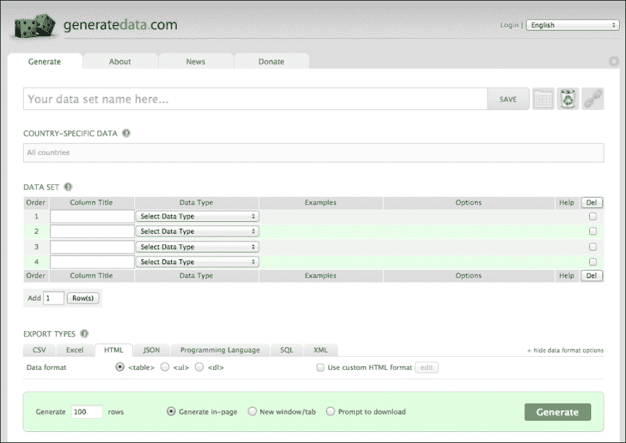

我们的`list`组件基本上与之前保持不变。由于`list`使用模板`itemTpl: '{last}, {first}'`对列表中的每个项目进行格式化，它简单地忽略了`address`、`city`、`state`、`zip`、`email`和`birthday`的值。然而，由于这些值仍然是数据记录的一部分，我们仍然可以获取它们并在我们的面板上使用它们来显示详情。

在我们能够添加详情面板之前，我们需要创建一个`main`面板并将其设置为使用`card`布局。这将让我们通过一次轻触就能在列表和详情之间切换：

```js
var main = Ext.create('Ext.Panel', {
 fullscreen:true,
 layout:'card',
 activeItem:0,
 items:[
  {
   xtype:'list',
   itemTpl:'{last}, {first}',
   store:contactStore
  }
 ]
});
```

我们已经将`main`面板设置为使用`card`布局，`activeItem`组件为`0`。在这种情况下，项目`0`是我们的`list`，它被内置到`main`面板中。

确保所有组件都包裹在一个应用程序启动函数内，就像我们前几章的例子一样：

```js
Ext.application({
    name:'TouchStart',
    launch:function () {
     //components go here
    Ext.Viewport.add(main);
  }
});
```

在底部，在`launch`函数内，我们向`Viewport`添加了`main`面板。

一旦你有了数据和`main`面板，加载页面以确保到目前为止我们所做的一切都是正确的。

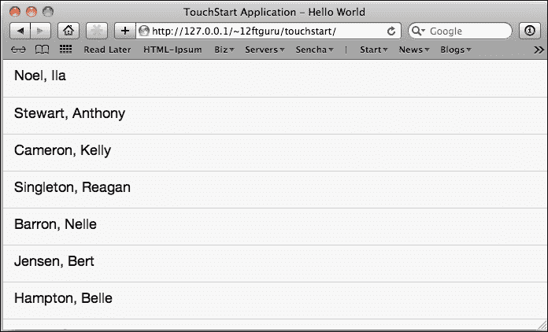

现在，我们需要添加我们的`detailsPanel`组件。我们首先在这个第一部分保持简单，并在我们的列表后添加一个新的`panel`项：

```js
var detailsPanel = Ext.create('Ext.Panel', {
    tpl: '{first} {last}<br>'+
        '{address}<br>'+
        '{city}, {state} {zip}<br>'+
        '{email}<br>{birthday}',
    items: [
        {
            xtype: 'toolbar',
            docked: 'top',
            items: [
                {
                    text: 'Back',
                    ui: 'back',
                    handler: function () {
                        main.setActiveItem(0);
                    }
                }
            ]
        }
    ]
});
```

我们首先添加一个简单的模板。我们包含一些 HTML 换行符，以更好地布局数据。我们还把模板分成多行以提高可读性，并使用`+`运算符将字符串连接在一起。然后我们添加一个`返回`按钮，它将带我们回到主列表。

### 小贴士

由于我们已经在代码中将`main`定义为一个变量，我们可以在`handler`函数内使用它。由于`main`面板也是我们视口中的第一个面板，我们可以这样获取它：`console.log(this.up('viewport').down('panel'));`

一旦我们的`detailsPanel`被定义，我们需要在我们的列表中添加一个`listeners`部分，以将数据加载到面板中：

```js
listeners:{
 itemtap:{
  fn: function (list, index, target, record) {
   detailsPanel.setRecord(record);
   main.setActiveItem(1);
  }
 }
}
```

好处是我们实际上并不需要加载任何新东西。列表已经可以访问数据存储中存在的所有额外数据。我们还在`itemTap`事件中接收记录作为一部分。我们可以获取这个记录，并使用`setRecord()`函数将其设置在面板上。最后，我们将活动项目设置为我们的`detailsPanel`组件。当我们轻触列表中的一个项目时，结果如下所示：

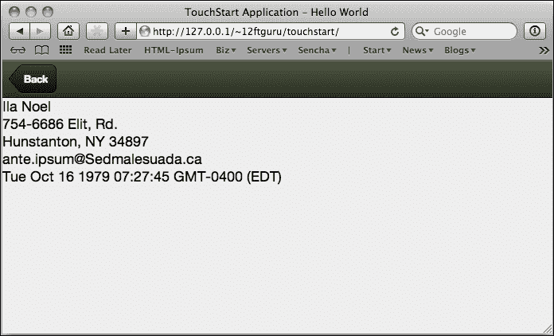

`detailsPanel`组件不仅包括我们从列表中的第一个和最后一个名字，还包括地址、电子邮件和出生日期数据。所有这些数据都来自同一个数据存储；我们只是使用模板来选择显示哪些数据。

说到模板，我们的看起来有点单调，而且`birthday`值比我们真正需要的要具体得多。我们必须想办法让这看起来更好一点。

# XTemplates

正如我们从之前的许多例子中看到的那样，**XTemplate**是一个包含 HTML 布局信息和用于我们数据的占位符的结构。

到目前为止，我们只创建了用于我们的列表和面板的非常基本的模板，这些模板使用了数据值和一些 HTML。在我们的第一个例子中，我们学会了如何使用`+`运算符，使我们能够将一个非常长的字符串拆分成更小的字符串，以提高可读性。另一种这样做的方法是将这些模板设置为独立的组件：

```js
var myTemplate = new Ext.XTemplate(
  '{first} {last}<br>',
  '{address}<br>',
  '{city}, {state} {zip}<br>',
  '{email}<br>',
  '{birthday}'
);
```

这将创建一个与之前完全相同的模板。这是 Sencha Touch 网站上大多数示例的编写方式，所以知道这两种方法都是好的。

一旦我们有了组件模板，我们就可以将其添加到我们的面板中，并与`tpl: myTemplate`一起使用。

以下两个方法在处理复杂模板时为您提供更好的可读性：

```js
tpl: new Ext.XTemplate(
    '<div style="padding:10px;"><b>{first} {last}</b><br>',
    '{address}<br>',
    '{city}, {state} {zip}<br>',
    '<a href="mailto:{email}">{email}</a><br>',
    '{birthday}</div>'
);
```

或者：

```js
tpl: '<div style="padding:10px;"><b>{first} {last}</b><br>'+
    '{address}<br>'+
    '{city}, {state} {zip}<br>'+
    '<a href="mailto:{email}">{email}</a><br>'+
    '{birthday}</div>'
```

这两种方法提供相同的结果。

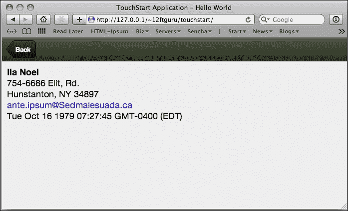

我们也可以使用相同类型的 XTemplates 给我们的主列表添加一些样式。例如，将以下代码作为我们列表的`itemTpl`组件将会在列表中的每个名字旁边放置一个可爱的猫图片：

```js
var listTemplate = new Ext.XTemplate(
    '<div class="contact-wrap" id="{first}-{last}">',
    '<div class="thumb" style= "float: left;"></div>',
    '<span class="contact-name">{first} {last}</span></div>'
);
```

在这个例子中，我们只是添加了一个 HTML 组件来布局每行数据，然后使用一个随机图像生成服务（在这个例子中，[placekitten.com](http://placekitten.com)）放置任何 36x36 的猫图片，它将位于左侧我们的名字旁边（你也可以用它来显示联系人的照片）。

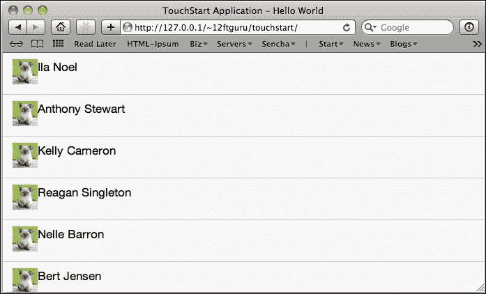

到目前为止，我们仍然只是在使用基本的 HTML；然而，XTemplates 的功能要比这强大得多。

## 操作数据

XTemplates 还允许我们在模板中以多种方式直接操作数据。我们首先可以做的事情就是清理那个丑陋的生日值！

由于在我们的模型中`birthday`值被列为一个`date`对象，因此我们可以在模板中将其当作一个对象来处理。我们可以用以下内容替换我们模板中的当前生日行：

```js
  'Birthday: {birthday:date("n/j/Y")}</div>'
```

这将使用我们的`birthday`值，以及格式化函数`date`。`date`函数使用字符串`"n/j/Y"`将`birthday`转换为更易读的格式。这些格式化字符串可以在 Sencha Touch API 的日期页面上找到。

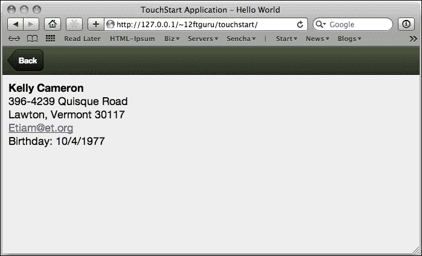

Sencha Touch 包括许多可以以这种方式使用的格式化函数。这些函数包括：

+   `date`：这个函数使用指定的格式化字符串对`date`对象进行格式化（格式化字符串可以在 Sencha Touch API 的日期页面上找到）。

+   `ellipsis`：这个函数将字符串截断到指定长度，并在末尾添加`…`（注意`…`被认为是总长度的部分）。

+   `htmlEncode`和`htmlDecode`：这两个函数将 HTML 字符（`&`、`<`、`>`和`'`）转换为 HTML 或从 HTML 转换回来。

+   `leftPad`：这个函数用指定的字符填充字符串的左侧（适用于用前导零填充数字）。

+   `toggle`：这个实用函数会在两个交替的值之间切换。

+   `trim`：这个函数会删除字符串开头和结尾的空格。它会保留字符串中的空格。

基本的函数可以被用在我们的 XTemplate 的 HTML 内部来格式化我们的数据。然而，XTemplate 还有一些额外的小技巧。

## 循环数据

在列表视图中，`itemTpl` 组件的 XTemplate 会自动应用到列表中的每个项目上。然而，你也可以使用下面的语法手动地循环你的数据：

```js
'<tpl for=".">',
'{name}</br>',
'</tpl>' 
```

当你使用 `<tpl>` 标签时，它告诉 XTemplate 我们正在退出 HTML 的领域，在模板内部做一些决策。在这个例子中，`<tpl for=".">` 告诉代码开始一个循环，并使用我们数据的根节点。闭合的 `</tpl>` 标签告诉循环停止。

由于我们可以拥有既包含 XML 又包含 JSON 的复杂嵌套数据，因此除了根节点之外，在其他的地点循环数据也会很有帮助。比如说，假设我们有一个包含州的数据数组，而每个州又包含一个城市数据数组。我们可以像下面这样循环这个数据：

```js
'<tpl for=".">',
'{name}</br>',

'<tpl for="cities">',
'{name}</br>',
'</tpl>' 

'</tpl>' 
```

我们的第一个 `<tpl>` 标签开始循环我们的州数据，打印出名称。在打印出名称之后，它会寻找个体州内部的名为 `cities` 的子数组。这次，当我们使用变量 `{name}` 时，它处于我们的子循环中，所以它会打印出州内的每个城市的名称，然后继续循环到下一个循环中的下一个州。

### 注意

注意，当我们在 `<tpl>` 标签内部使用字段名称时，我们不会像这样使用花括号：`{cities}`。由于我们处于模板的 HTML 部分之外，Sencha Touch 假定 `"cities"` 是一个变量。

我们甚至可以通过添加另一个循环来访问每个城市中嵌套的数组，例如 `postal codes`：

```js
'<tpl for=".">',
'{name}</br>',

'<tpl for="cities">', 
'{name}</br>',

'<tpl for="cities.postal">',
'{code}</br>',
'</tpl>' 

'</tpl>' 

'</tpl>' 
```

在这个例子中，我们使用了 `<tpl for="cities.postal">` 来表示我们将会在 `cities` 数据数组内部的 `postal codes` 数据数组中循环。我们的其他数组循环像以前一样执行。

### 循环内的编号

当你在循环内部工作时，能够计算循环的次数通常很有帮助。你可以通过在你的 XTemplate 中使用 `{#}` 来做到这一点：

```js
'<tpl for=".">',
'{#} {name}</br>',
'</tpl>' 
```

这将会在循环中的每个名字旁边打印当前的循环次数。这对于嵌套数据也会以类似的方式工作：

```js
'<tpl for=".">',
'{#} {name}</br>',

'<tpl for="cities">',
'{#} {name}</br>',
'</tpl>' 

'</tpl>' 
```

第一个 `{#}` 会在主循环中显示我们的位置，第二个 `{#}` 会在 `cities` 循环中显示我们的位置。

### 循环中的父数据

当我们在嵌套数据的情况下，能够从子循环内部访问父级属性也会很有帮助。你可以通过使用 `parent` 对象来实现这一点。在我们的包含州、城市和国家的嵌套示例中，这看起来像这样：

```js
'<tpl for=".">',
'{name}</br>',

'<tpl for="cities">',
'{parent.name} - {name}</br>',

'<tpl for="cities.postal">',
'{parent.name} - {code}</br>',
'</tpl>' 

'</tpl>' 

'</tpl>' 
```

当我们在`cities`循环中时，`{parent.name}`将显示该城市的州名。当我们我们在`cities.postal`循环中时，`{parent.name}`将显示与那个邮政编码相关联的城市名称。使用这种`{parent.fieldname}`语法，我们可以从当前子项中访问父项的任何值。

## 条件显示

除了循环，XTemplates 还为您模板中提供了一些有限的条件逻辑。在 Sencha Touch 的 2.x 版本中，我们现在可以访问完整的`if...then...else...`功能。例如，我们可以在我们的州和城市中使用`if`语句，只显示人口超过 2,000 的城市：

```js
'<tpl for=".">',
  '{name}</br>',
  '<tpl for="cities">',
    '<tpl if="population &gt; 2000">',
      '{name}</br>',
    '</tpl>',
  '</tpl>',
'</tpl>'
```

如果我们想要根据多个人口目标对城市进行颜色编码，那么我们可以像这样使用`if...then...else`：

```js
'<tpl for=".">',
  '{name}</br>',
  '<tpl for="cities">',
    '<tpl if="population &gt; 2000">',
      '<div class="blue">{name}</div>',
    '<tpl elseif="population &gt; 1000">',
      '<div class="red">{name}</div>', 
    '<tpl else>', 
      '<div>{name}</div>',
    '</tpl>',
  '</tpl>',
'</tpl>'
```

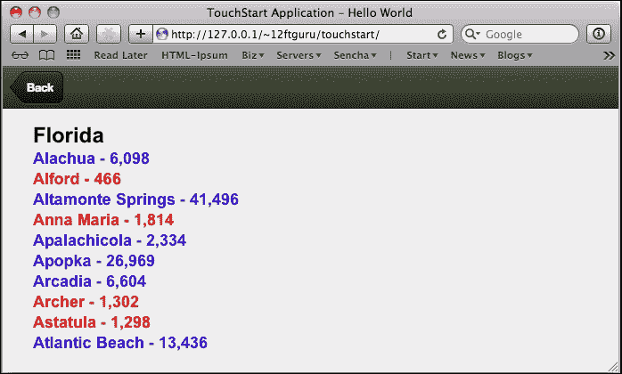

现在，你可能已经自己在问自己为什么我们使用`&gt;`和`&lt;`而不是`>`和`<`。原因是我们的条件语句中的任何东西都需要进行 HTML 编码，以便 XTemplate 正确解析它。这可能一开始有点令人困惑，但需要记住的关键事情如下：

+   使用`&gt;`而不是`>`。

+   使用`&lt;`而不是`<`。

+   使用`==`作为等于符号。然而，如果你要比较一个字符串值，你必须转义单引号，例如这样：`'<tpl if="state == 'PA'">'`。

+   如果您想将`"`编码为条件语句的一部分，那么您需要将其编码为`&quot;spam&quot;`。

## 算术功能

除了条件逻辑，XTemplates 还支持以下基本算术功能：

+   加法（`+`）

+   减法（`-`）

+   乘法（`*`）

+   除法（`/`）

+   模数——一个数除以另一个数的余数（`%`）

例如：

```js
'<tpl for=".">',
  '{name}</br>',
  '<tpl for="cities">',
      '{name}</br>',
  'Population: {population}</br>',
  'Projected Population for next year: {population * 1.15}</br>',
  '</tpl>',
'</tpl>'
```

这给我们初始的人口值，接着是当前人口的 1.15 倍的预测人口。数学函数包含在我们变量的花括号中。

## 内联 JavaScript

我们还可以通过将代码放在括号和花括号组合中来执行任意的内联代码作为 XTemplate 的一部分：`{[…]}`。在此代码中还可以访问一些特殊属性：

+   `values`：此属性保留当前作用域中的值

+   `parent`：此属性保留当前父对象的价值

+   `xindex`：此属性保留您当前所在的循环索引

+   `xcount`：此属性保留当前循环中的项目总数

让我们通过一个例子来阐述这些属性。我们可以确保我们的州和城市名称是大写的，并且列表中城市的颜色交替，通过使用以下的 XTemplate：

```js
'<tpl for=".">',
  '{[values.name.toUpperCase()]}</br>',
  '<tpl for="cities">',
  '<div class="{[xindex % 2 === 0 ? "even" : "odd"]}">',
      '{[values.name.toUpperCase()]}</br>',
  '</div>',
  '</tpl>',
'</tpl>'
```

在这个例子中，我们使用`{[values.name.toUpperCase()]}`将州和城市的名称强制为大写。我们还使用`{[xindex % 2 === 0 ? "even" : "odd"]}`根据当前计数除以 2 的余数（取模运算符）交替行颜色。

即使有了编写内联 JavaScript 的能力，有许多情况下你可能需要更加健壮的东西。这就是 XTemplate 成员函数发挥作用的地方。

## XTemplate 成员函数

一个 XTemplate 成员函数允许你将一个 JavaScript 函数附加到你的 XTemplate 上，然后通过调用`this.function_name`在模板内部执行它。

这些函数添加到模板的末尾，一个模板可以包含多个成员函数。这些成员函数被一对花括号括起来，这与监听器的风格类似：

```js
{
myTemplateFunction: function(myVariable) {
  ...
 },
myOtherTemplateFunction: function() {
  ...
 }
}
```

我们可以使用这些成员函数向我们的模板返回附加数据。让我们使用我们之前的州和城市示例，看看我们如何根据我们数据的多个量在较大的城市旁边放置一个特殊图标。

```js
'<tpl for=".">',
  '{name}</br>',
  '<tpl for="cities">',
      '<div>{name} <tpl if="this.isLargeCity(values)"></tpl></div>',
    '</tpl>',
  '</tpl>',
'</tpl>',
{
isLargeCity: function(values) {
  if(values.population >= 5000 && values.hasAirport && values.hasHospital) {
   return true;
  } else {
   return false;
  }
 }
}
```

在这个例子中，我们创建了一个名为`isLargeCity`的成员函数，在其中传递我们的数据。由于我们的函数可以执行任何我们想要的 JavaScript，我们可以使用结果来控制模板。然后我们可以在模板中调用函数`{[this.isLargeCity(values)]}`，根据数据记录中的值打印我们的`bigCity.png`图片。

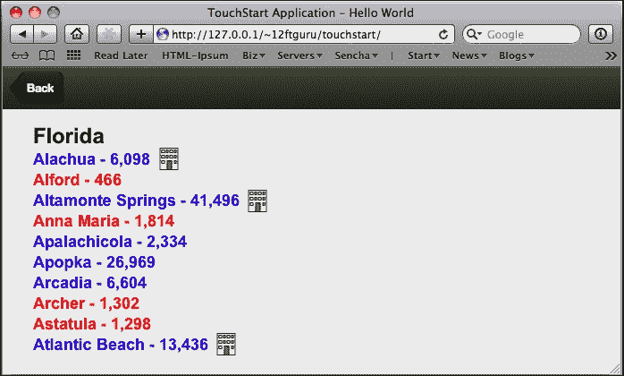

我们还可以使用成员函数来帮助我们检查数据是否存在或不存在。这在控制我们的模板时非常有用。例如，让我们从一个包含姓名、地址和电子邮件的联系人模板开始，类似于以下内容：

```js
var myTemplate = new Ext.XTemplate(
  '<div style="padding:10px;"><b>{first} {last}</b><br>',
  '{address}<br>',
  '{city}, {state} {zip}<br>',
  '<a href="mailto:{email}">{email}</a><br>',
  'Birthday: {birthday:date("n/j/Y")}</div>'
);
```

如果我们没有`address`、`city`和`state`的数据，我们最终会有一些空行和一个多余的逗号。由于根据我们的模型，`zip`变量是一个`integer`，如果我们没有为它存储值，它将显示为**0**。

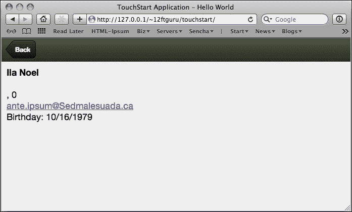

我们需要一种方法来检查在将这些项目打印到屏幕之前我们是否有这些项目的数据。

### 空函数

结果证明，原生 JavaScript 在检测空值方面非常有问题。根据函数的不同，JavaScript 可能会返回以下内容：

+   空值

+   未定义

+   空数组

+   空字符串

对于我们大多数人来说，这些都是差不多一样的东西；我们没有得到任何东西。然而，对于 JavaScript 来说，这些返回值是非常不同的。如果我们尝试用`if(myVar == '')`来测试数据，并且我们得到`null`、`undefined`或空数组，JavaScript 将返回`false`。

幸运的是，Sencha Touch 有一个方便的小函数叫做`isEmpty()`。这个函数将测试 null、undefined、空数组和空字符串，所有这些都在一个函数中。然而，Sencha Touch 没有一个相反的函数来测试`有数据`，这是我们真正想要测试的。多亏了模板成员函数，我们可以编写自己的函数。

```js
var myTemplate = new Ext.XTemplate(
  '<div style="padding:10px;"><b>{first} {last}</b><br>',
  '<tpl if="!Ext.isEmpty(address)">',
    '{address}<br>',
    '{city}, {state} {zip}<br>',
  '</tpl>',
  '<a href="mailto:{email}">{email}</a><br>',
  'Birthday: {birthday:date("n/j/Y")}</div>'
```

甚至不需要为这个数据检查编写成员函数。我们可以在我们的模板中添加`<tpl if="!Ext.isEmpty(address)">`，并与我们的模板并列检查地址。`Ext.isEmpty`函数类获取地址数据，确定它是空的还是包含数据，分别返回`true`或`false`。如果`address`不为空，我们打印出地址，如果为空，我们什么都不做。

## 使用 XTemplate.overwrite 更改面板内容

在我们之前的示例中，我们已经将 XTemplate 作为我们面板或列表的一部分声明，使用`tpl`或`itemtpl`。然而，在列表或面板显示之后，编程地覆盖一个模板也可能很有帮助。您可以通过声明一个新的模板，然后使用面板或列表的`overwrite`命令将模板和数据结合，覆盖面板或列表的内容区域来实现。

```js
var myTemplate = new Ext.XTemplate(
'<tpl for=".">',
  '{name}</br>',
  '<tpl for="cities">',
      '- {name}<br>',
    '</tpl>',
  '</tpl>',
'</tpl>'
);

myTemplate.overwrite(panel.body, data);
```

我们的`overwrite`函数将一个元素（`Ext`或`HTML`）作为第一个参数。所以，我们不仅需要使用面板，还需要使用面板的`body`元素作为`panel.body`。然后，我们可以为新的模板提供来自数据存储的一个记录或一个值数组作为第二个参数。

虽然 XTemplates 对于显示我们的数据非常强大，但它们仍然非常文本化。如果我们想以更有色彩的方式显示数据会怎样？让我们来看看 Sencha Touch Charts，了解我们如何做到这一点。

# Sencha Touch Charts

到目前为止，我们只是查看了数据存储和记录作为显示文本数据的方式，但随着 Sencha Touch Charts 的发布，我们现在能够以图形数据的形式在我们的应用程序中显示复杂的数据。

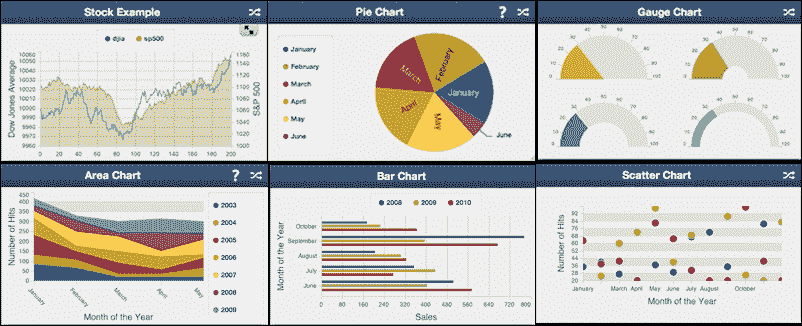

这些新组件使用数据存储来显示各种图表和图类型，包括以下类型：

+   饼图

+   柱状图

+   折线图

+   散点图

+   蜡烛图

+   OHLC（开盘价、最高价、最低价、收盘价）

+   气泡图

虽然对图表组件的全面探索值得一本单独的书，但我们将提供一个这些组件如何与数据存储交互的概述，并希望激发你的好奇心。

## 安装 Sencha Touch Charts

截至版本 2.1，Sencha Touch Charts 已集成到 Sencha Touch 中，不再需要单独下载。在撰写本文时，图表包许可作为开源 GPLv3 许可的一部分提供，或作为 Sencha Complete 或 Sencha Touch Bundle 的一部分提供。

## 一个简单的饼图

让我们从一个简单的 JavaScript 文件开始，用于我们的图表示例，从数据存储开始：

```js
Ext.application({
 name: 'TouchStart',
 launch: function() { 
  var mystore = Ext.create('Ext.data.JsonStore', {
   fields: ['month', 'sales'],
   data: [
    {'month': 'June', 'sales': 500},
    {'month': 'July', 'sales': 350},
    {'month': 'August', 'sales': 200},
    {'month': 'September', 'sales': 770},
    {'month': 'October', 'sales': 170}
   ]
  });
 }
});
```

我们的存储声明了两个字段类型，`month`和`sales`，我们的数据数组持有五组`month`和`sales`值。这将输入到极坐标图中，在本例中，是一个饼图。在存储定义之后，我们添加如下内容：

```js
Ext.create('Ext.chart.PolarChart', {
  background: 'white',
  store: mystore,
  fullscreen: true,
  innerPadding: 35,
  interactions: ['rotate'],
  colors: ["#115fa6", "#94ae0a", "#a61120", "#ff8809", "#ffd13e"],
  legend: {
   position: 'right',
   width: 125,
   margin: 10
  },
  series: [
   {
    type: 'pie',
    xField: 'sales',
    labelField: 'month',
    donut: 25,
     style: {
      miterLimit: 10,
      lineCap: 'miter',
      lineWidth: 2
     }
   }
  ]
});
```

就像我们的其他面板组件一样，`Ext.chart.PolarChart`类需要一些标准的配置，如`height`、`width`和`fullscreen`。它还有一些特殊的配置，如`innerPadding`，这是坐标轴和系列之间的填充，以及`background`，这是图表背后的背景颜色。`chart`组件还需要一个`store`配置选项，我们将将其设置为我们之前创建的`mystore`组件。

`interactions`部分允许我们指定一些视觉工具，使用户能够与图表互动。每种图表都有它自己的一组交互。当前的交互包括：

+   `panzoom`：此交互允许我们在坐标轴之间平移和缩放

+   `itemhighlight`：此交互允许我们突出显示系列数据点

+   `iteminfo`：此交互允许我们在弹出面板中显示数据点的详细信息

+   `rotate`：此交互允许旋转饼图和雷达系列

接下来是我们图表的`legend`配置。这为我们的所有图表值提供了颜色编码的参考。我们可以使用一个位置配置来指定图例在纵向和横向模式下应如何显示。

最后的部分是我们的`series`配置。在我们的示例中，我们设置了：

+   我们将看到的**类型**的图表

+   图表将使用哪个**xfield**来确定饼图扇区的大小

+   要用于饼图扇区的**labelField**的值

+   饼图中心孔洞的**大小**

+   图表的**整体风格**

当我们加载所有内容时，我们的图表如下所示：

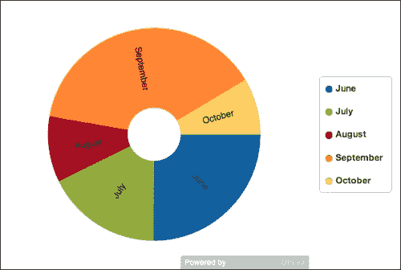

如果您点击图例上的任何月份，您可以将其在图表中打开或关闭。这个功能无需任何额外代码即可自动发生。我们的交互设置还允许我们点击并拖动以旋转图表。

这种饼图非常适合非常简单的单系列数据，但如果我们有几年的数据呢？让我们看看柱状图可能如何显示这种数据。

## 柱状图

对于我们的柱状图，让我们用以下内容替换我们的图表数据存储：

```js
var mystore = Ext.create('Ext.data.JsonStore', {
 fields: ['month', '2008', '2009', '2010'],
 data: [
   {'month': 'June', '2008': 500, '2009': 400, '2010': 570},
   {'month': 'July', '2008': 350, '2009': 430, '2010': 270},
   {'month': 'August', '2008': 200, '2009': 300, '2010': 320},
   {'month': 'September', '2008': 770, '2009': 390, '2010': 670},
   {'month': 'October', '2008': 170, '2009': 220, '2010': 360}
 ]
});
```

这个数据集有我们需要显示的多系列数据（五个月，每个月有三年的数据）。一个有效的柱状图需要为每个月显示一行，并在同一个月内为每个年份显示不同的柱状图。

接下来，我们需要将我们的`PolarChart`更改为`CartesianChart`，如下所示：

```js
Ext.create("Ext.chart.CartesianChart", {
 fullscreen: true,
 background: 'white',
 flipXY: true,
 store: mystore,
 interactions: ['panzoom'],
 legend: {
  position: 'right',
  width: 80,
  margin: 10
 },
 axes: [
  {
   type: 'numeric',
   position: 'bottom',
   grid: true,
   minimum: 0
  },
  {
   type: 'category',
   position: 'left'
  }
 ],
 series: [
  {
   type: 'bar',
   xField: 'month',
   yField: ['2008', '2009', '2010'],
   axis: 'bottom',
   highlight: true,
   showInLegend: true,
   style: {
    stroke: 'rgb(40,40,40)',
    maxBarWidth: 30
   },
   subStyle: {
    fill: ["#115fa6", "#94ae0a", "#a61120"]
   }
  }
 ]
}); 
```

就像我们的饼图一样，柱状图组件也需要`background`、`fullscreen`、数据`store`以及`panzoom`交互的配置选项。这个选项使我们能够在坐标轴之间进行平移和缩放。

然后是我们之前的图例，后面跟着一个新配置选项叫做`axes`。由于柱状图沿着 x 轴和 y 轴进行操作，我们需要指定每个轴输入的是什么类型的数据（在这个例子中，是`bottom`和`left`轴）。

首先是我们每年的销售数据。这些数据是数值型的，位于底部，并命名为`sales`。我们还指定了我们的最小值应该是多少（这个数字将出现在柱状图的最左端，通常会是`0`）。

下一个轴是我们的分类数据（也将用于我们的图例）。在这个例子中，我们的`position`是`left`，我们的`title`是`一年的月份`。有了这个，我们就完成了`axes`配置。

最后是我们的`series`配置，将其设置为柱状图。与我们之前的饼图示例不同，后者只跟踪单个点的销售数据，而柱状图跟踪两个不同点的销售数据（`month`和`year`），因此我们需要分配我们的`xField`和`yField`变量，并声明一个轴位置。这个位置应该与您显示数值数据所在的轴匹配（在我们的案例中，数据在 y 轴上，位于底部）。我们最后使用`showInLegend`来显示我们的图例。

最终的图表应该如下所示：

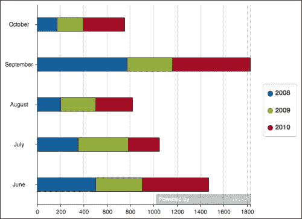

### 注意

图表是使用存储显示数据的一种非常灵活的方式。我们在这里实在没有时间一一讲解，但你可以通过[`docs.sencha.com/touch/2.2.0/#!/guide/drawing_and_charting`](http://docs.sencha.com/touch/2.2.0/#!/guide/drawing_and_charting)探索 Sencha Touch Charts 的所有功能。

# 总结

在本章中，我们探讨了数据存储可以用来显示简单和复杂数据的方式。我们谈论了绑定、排序、分页和加载数据存储。然后我们通过使用数据存储与列表和面板结合的方式进行讲解。

我们还讲解了如何使用 XTemplates 来控制存储和记录中的数据布局。我们探讨了如何在 XTemplate 中操作和遍历我们的数据，以及如何使用条件逻辑、算术和内联 JavaScript。我们在讨论 XTemplates 时，通过讨论成员函数及其用途来结束。我们通过查看如何使用 Sencha Touch Charts 包以图形化的方式显示我们的存储数据来结束本章。

在下一章中，我们将探讨如何将我们前几章的所有信息整合到一个完整的应用程序中。
