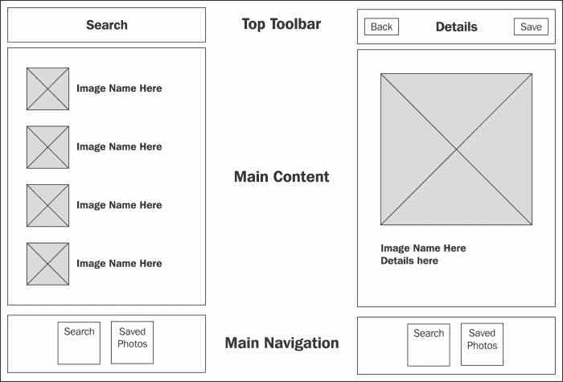
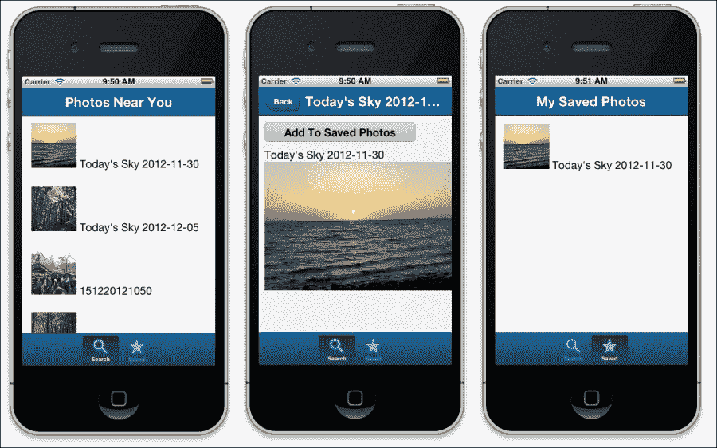
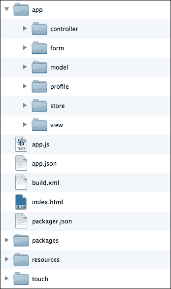
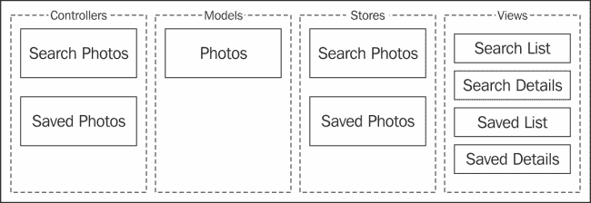
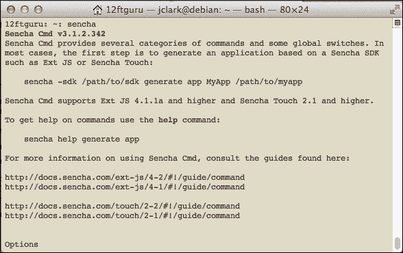
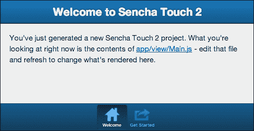
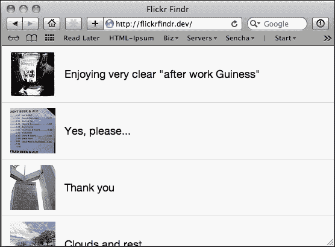
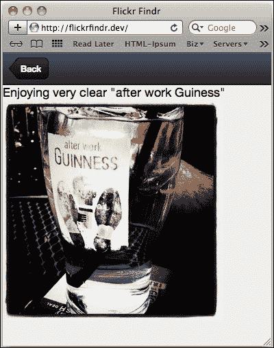
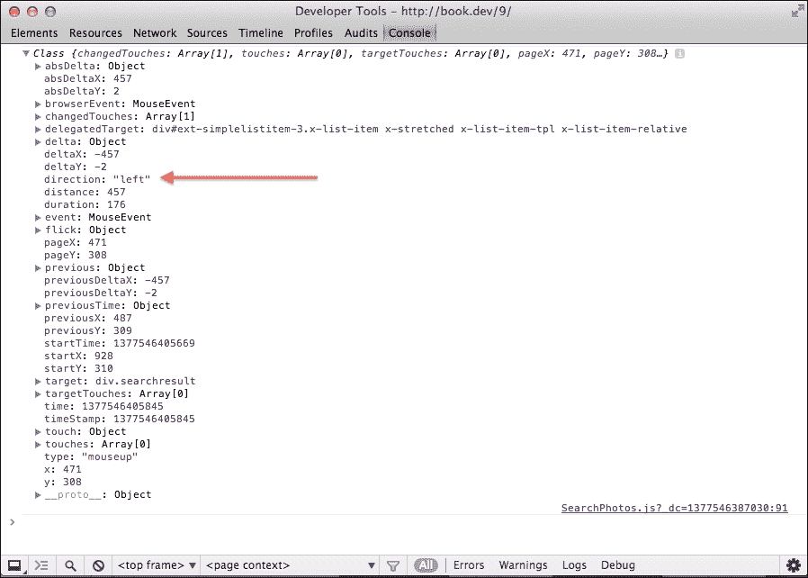
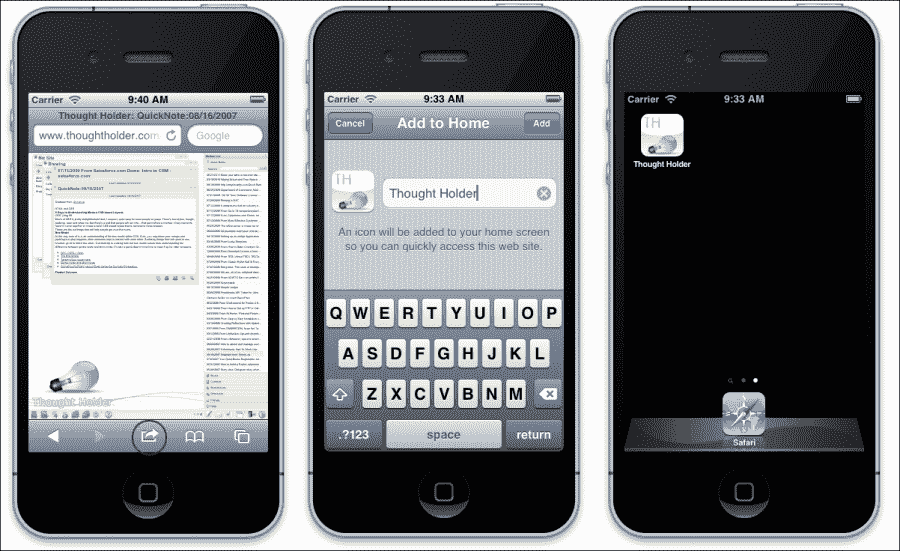

# 第八章：创建 Flickr Finder 应用

到目前为止，我们已经单独或在小型的简单应用中查看了 Sencha Touch 组件。在本章中，我们将使用 Sencha Touch 创建一个结构良好且更详细的应用。我们将尝试利用我们前几章的所有技能来创建一个允许我们搜索靠近我们位置的照片的应用。本章将包括：

+   介绍**模型视图控制器**（**MVC**）设计模式

+   设置更健壮的文件夹结构

+   设置主要应用文件

+   使用 Flickr API

+   注册组件

+   设置`SearchPhotos`组件

+   设置`SavedPhotos`组件

+   给应用添加最后的润色以发布

# 生成基本应用

这个应用的基本想法是使用 Flickr API 来发现靠近我们位置的照片。我们还将增加保存有趣照片的功能，以便我们以后想看时能够找到。

当你第一次创建一个应用时，最好先勾勒出界面草图。这让你对需要构建的各个部分有一个大致的了解，同时也允许你像用户一样遍历各种屏幕。它不需要很漂亮；它只需要给你一个创建应用的所有部分的基本概念。

目标应该是非常基础的，比如这样：



接下来，你希望通过纸质界面点击你的方式，就像你会在一个真实应用中那样，思考每次点击会将用户带到哪里，可能缺少什么，以及可能对用户造成困惑的地方。

我们的基本应用需要能够显示照片列表以及单张照片的特写。当我们点击列表中的照片时，我们需要显示更大的特写照片。我们还需要一种在查看完照片后返回列表的方法。

当我们看到喜欢照片时，我们需要能够保存它，这意味着我们需要一个保存照片的按钮，以及一个保存照片的单独列表和一个保存照片的特写视图。

一旦我们对草图感到满意，我们就可以开始编写代码，将我们的纸质原型转变为类似这样的东西：



# 介绍模型视图控制器

在我们开始构建应用之前，我们应该花些时间谈论一下结构和组织。虽然这可能看起来像是应用哲学的乏味偏离，但实际上，这是你应用中最关键的考虑因素之一。

首先，考虑一下单片应用程序，所有内容都集中在一个巨大的文件中。这似乎很疯狂，但你会遇到成百上千个以这种方式编写的应用程序。试图调试这种东西是一场噩梦。想象一下在一个 750 行长的组件数组中找到缺失的闭合花括号。糟糕！

那么问题变成了如何逻辑地分割文件。

如本书前面所讨论的，模型-视图-控制器（MVC）架构根据代码的功能组织应用程序文件：

+   模型描述你的数据。

+   视图控制数据如何显示。

+   控制器通过从用户那里获取输入并告诉视图和模型根据用户的输入如何响应来处理用户交互。

Sencha Touch 还使用存储库，描述组件之间数据存储和传输的情况。当我们把应用程序的这些部分分开时，意味着你应用程序的每个部分都将有这些部分的单独文件。让我们来看看这个结构是怎样的：



这是一个基本的应用程序骨架，由 Sencha Cmd 输出，我们将用它来开发我们的`FlickrFindr`项目。在根目录中，我们有文件夹：

+   **app**：这个文件夹包含我们的主要应用程序文件。

+   **包**：这个文件夹用于存放我们可能需要的任何外部库。

+   **资源**：这个文件夹包含我们的 CSS、SASS、图标和各种图片文件。

+   **触摸**：这个文件夹包含 Sencha Touch 库的副本。

在我们的**app**目录中，我们有自己的文件：

+   **控制器**：我们的控制器将包含我们应用程序的功能。

+   **表单**：我们的表单将控制我们使用的任何表单的外观。

+   **模型**：我们的模型将描述我们使用的数据。

+   **配置文件**：我们的配置文件将包含不同类型设备的显示信息。本书不涉及这部分内容，但详细解释可以在 Sencha 网站上的[`docs.sencha.com/touch/2.2.1/#!/guide/profiles`](http://docs.sencha.com/touch/2.2.1/#!/guide/profiles)找到。

+   **存储库**：我们的存储库决定应用程序数据如何存储。

+   **视图**：我们的视图控制应用程序的外观。

通过这种方式分割文件，跨应用程序重用代码要容易得多。例如，假设你构建了一个具有模型、存储库、控制器以及用户视图的应用程序。如果你想创建另一个需要处理用户的新应用程序，你只需将模型、存储库、视图和控制器的单个文件复制到你的新应用程序中即可。如果所有文件都被复制过去，那么用户代码应该和在前一个应用程序中一样正常工作。

如果我们构建一个单体应用程序，您必须浏览代码，提取出片段，并将它们重新组装到新应用程序中。这将是一个缓慢且痛苦的过程。通过按功能分离我们的组件，项目间复用代码要容易得多。

## 分割组件

我们需要考虑的下一件事是应用程序如何被拆分成独立的 MVC 部分。例如，如果您的应用程序跟踪人和他们拥有的汽车，您可能会为人和汽车分别有一个模型和控制器。您还可能为汽车和人都有多个视图，如`添加`、`编辑`、`列表`和`详情`。

在我们的应用程序中，我们将处理两种不同类型的数据。第一种是照片的搜索数据，第二种是我们保存的照片。

如果我们把这个分解成模型、存储、视图和控制器，我们得到类似于以下的内容：



我们的控制器通过功能分为**保存照片**和**搜索照片**。

由于它们处理相同类型的数据，我们的每个控制器都可以使用相同的**照片**模型，但它们将需要不同的存储（**搜索照片**和**保存照片**），因为它们各自使用不同的实际数据集。

对于视图，我们的搜索需要一个**搜索列表**的列表视图和一个**搜索详情**视图。保存的照片也需要一个**保存列表**视图和一个用于编辑/添加**保存详情**的视图。

现在我们已经清楚地了解了我们需要的文件，是时候开始构建我们的应用程序了。

# 使用 Sencha Cmd 建立基础

在 Sencha Touch 的 1.0 版本中，应用程序的设置过程非常手动且耗时。然而，Sencha Cmd 的引入允许我们用一条命令生成大多数核心应用程序文件。

Sencha Cmd 是一组命令行工具，在 Sencha Touch 中执行许多基本任务，例如：

+   生成一个可以用作应用程序基础的应用程序骨架

+   生成控制器、表单和模型

+   构建您的应用程序以“最小化”和压缩 JavaScript 和图片以供生产应用程序使用

+   将您的应用程序作为可以在 App Store 中销售的独立二进制文件构建

Sencha Cmd 有许多其他用途和配置选项。有关这些信息，请参阅[`docs.sencha.com/touch/2.2.1/#!/guide/command`](http://docs.sencha.com/touch/2.2.1/#!/
guide/command)。

对于这个项目，我们将主要使用`generate`命令来构建我们的基本应用程序、控制器和模型。然而，首先我们需要安装所有内容。

## 安装 Sencha Cmd

Sencha Cmd 是我们从 Sencha Touch 代码下载的独立文件，可以在以下网址找到：[`www.sencha.com/products/sencha-cmd/download`](http://www.sencha.com/products/sencha-cmd/download)。这个下载文件支持 Windows、OS X 和 Linux（32 位和 64 位）。解压缩下载的文件后，你可以双击它来安装 Sencha Cmd。

### 注意

对于这本书，我们使用的是 Sencha Cmd 版本 3（至少需要版本 3.1.2 或更高版本）。详细的安装说明可以在[这里](http://docs.sencha.com/touch/2.2.1/#!/guide/command)找到。

一旦你安装了 Sencha Cmd，你可以按照以下方式打开计算机上的命令行：

+   在 Mac OS X 上，前往**应用程序**并启动**终端**

+   在 Windows 上，前往**开始** | **运行** 并输入`cmd`

一旦你的终端打开，输入`sencha`。你应该会在终端中看到如下截图：



现在我们已经安装了 Sencha Cmd，是时候为我们的应用程序生成骨架了。

首先，你需要切换到你的 Sencha Touch 文件安装的目录（不是我们刚刚下载的 Sencha Cmd 文件，而是你原始的 Sencha Touch 2.1 文件）：

```js
cd /path/to/Sencha-touch-directory/

```

Sencha Cmd 将使用来自这个 Sencha Touch 目录的文件来生成我们的应用程序。从这里，我们使用`generate`命令如下：

```js
sencha generate app FlickrFindr /path/to/www/flickrfindr

```

当然，你需要根据你自己的开发环境调整前面的路径，以创建我们在*介绍模型视图控制器*部分展示的目录结构的基本应用程序。

除了我们之前提到的文件夹，你还会看到许多已经创建的文件。你可以查阅 Sencha Cmd 文档，了解所有文件的详细信息，但现在我们只需要关注一个名为`app.js`的文件。

`app.js`文件在我们应用程序启动时加载，并处理我们的基本设置。如果你查看文件顶部的注释，你应该会看到类似这样的内容：

```js
Ext.Loader.setPath({
    'Ext': 'touch/src'
});
```

这为我们的 Sencha Touch 框架副本设置了路径，Sencha Cmd 在我们执行`generate app`命令时，将其复制到了一个`touch`目录中。

接下来的几行设置了我们的应用程序命名空间（`name`）和处理我们需要的文件：

```js
Ext.application({
    name: 'FlickrFinder',
    requires: [
        'Ext.MessageBox'
    ],
    views: [
        'Main'
    ],
```

`requires`部分列出了我们应用程序需要的任何内部或外部库。`Ext.MessageBox`组件是默认包含在内的。我们还有一个`views`部分，可以列出我们应用程序需要的任何视图。还可以为模型、存储和控制器添加单独的部分。我们稍后会涉及到这些。

接下来的几部分将涉及到我们的应用程序图标和启动屏幕（`startupImage`）。这些图像可以通过替换现有图像或更改 URL 来指向新的图像文件进行修改。

我们`app.js`文件的最后一部分是`launch`函数。所有组件加载完毕后会被调用：

```js
    launch: function() {
        // Destroy the #appLoadingIndicator element
        Ext.fly('appLoadingIndicator').destroy();

        // Initialize the main view
        Ext.Viewport.add(Ext.create('FlickrFindr.view.Main'));
    }
```

这个函数移除了加载指示器并显示我们的主窗口。`FlickrFindr.view.Main`文件在我们的`views`文件夹中；我们很快就会修改它。

### 提示

请注意，我们示例中的文件名是`FlickrFindr.view.Main`，这告诉应用程序这个文件叫做`Main.js`，并且它位于我们的`app/view`文件夹中。

如果我们有很多视图，我们可以将它们分成`views`文件夹内的目录。例如，我们可以为我们的应用程序创建`search`和`saved`文件夹。在这种情况下，我们`search`文件夹的`Details.js`视图将是`FlickrFindr.view.search.Details`，而我们的`saved`文件夹的`Details.js`视图将是`FlickrFindr.view.saved.Details`。

我们稍后会回到这个文件，但现在，只需熟悉一下内容。

既然我们已经知道我们的应用程序应该如何布局，那么在真正开始之前我们还有一项任务要完成。我们需要从 Flickr 获取一个 API 密钥。

## 使用 Flickr API

大多数流行的网络应用程序都为其他应用程序提供了一个**API**（**应用程序编程接口**）。这个 API 的工作方式与我们的 Sencha Touch 框架几乎相同。API 提供了一系列可以用来从远程服务器读取，甚至写入数据的方法。

这些 API 通常需要一个密钥才能使用。这使得服务能够跟踪谁在使用服务并限制对系统的任何滥用。API 密钥通常是免费且容易获得的。

访问 Flickr API 网站[`www.flickr.com/services/api/`](http://www.flickr.com/services/api/)，寻找**API 密钥**这个短语。点击链接，使用提供的表单申请 API 密钥。当您收到 API 密钥时，它将是一个由数字和小型字母组成的 32 个字符长的字符串。

每次您向 Flickr API 服务器发送请求时，您都需要传输这个密钥。我们稍后会谈到这部分。

Flickr API 涵盖了超过 250 个方法。其中一些需要您使用 Flickr 账户登录，但其他方法只需要 API 密钥。

出于我们的目的，我们将使用一个单一的 API 方法，称为`flickr.photos.search`，该方法无需登录。此方法根据某些标准寻找照片。我们将使用设备的当前纬度和经度来获取距离我们当前位置指定距离内的照片。

我们的搜索结果以一大堆 JSON 格式返回，我们需要对其进行解码以显示。

一旦我们有了 API 密钥，我们就可以开始设置我们的模型、存储、视图和控制器。

# 向基本应用程序添加内容

首先，让我们看看我们生成的原始应用程序。目前，如果您将应用程序加载到您的网络浏览器中，您应该会看到类似这样的内容：



我们正在查看的这个视图来自`app/view/Main.js`文件，这是一个带有两个子面板的标签面板。我们将用一个更简单的标签面板替换这段代码：

```js
Ext.define('FlickrFinder.view.Main', {
    extend: 'Ext.tab.Panel',
    xtype: 'main',
    requires: [
        'FlickrFinder.view.SearchPanel',
        'FlickrFinder.view.SavedPanel'
    ],
    config: {
        tabBarPosition: 'bottom',
        items: [
           { xtype: 'searchpanel'},
           { xtype: 'savedpanel'}
        ]
    }
});
```

就像我们正在替换的代码一样，这个组件扩展了一个标签面板并设置了一个`xtype`为`main`。

在这个上下文中，`xtype`可能会有些令人困惑，因为`Ext.tab.Panel`已经有了`xtype`为`tabpanel`。然而，由于我们正在扩展标签面板，我们实际上是在创建一个新的组件，这意味着我们可以为这个组件设置`xtype`。`xtype`完全是任意的，但必须在所有组件（包括 Sencha 自己的组件）中唯一。使用`main`作为`xtype`是您应用程序开始容器的一般约定。通过设置自定义`xtype`，我们可以很容易地从我们稍后创建的控制器中找到容器。

在我们的`requires`部分，我们列出了两个新的视图，一个是`FlickrFinder.view.SearchPanel`，另一个是`FlickrFinder.view.SavedPanel`。在这个代码块的稍下方，你将看到在`items`部分列出的两个`xtype`值，`searchpanel`和`savedpanel`，它们对应于这两个必需的文件。我们接下来需要创建这些文件。

在你的文本编辑器中，你需要在你的`app/view`文件夹中创建两个新的面板文件。第一个叫做`SearchPanel.js`，代码将如下所示：

```js
Ext.define('FlickrFinder.view.SearchPanel', {
    extend: 'Ext.Panel',
    xtype: 'searchpanel',
    config: {
        title: 'Search', 
        iconCls: 'search',
        html: 'Search Panel'

    }
});
```

就像我们的`Main.js`文件一样，我们首先将文件名设置在命名空间内为`FlickrFinder.view.SearchPanel`。然而，这次我们扩展了`Ext.Panel`组件而不是标签面板。

我们还设置了`xtype`为`searchpanel`，这应该与我们在`app/view/Main.js`的`items`部分中的值相匹配。

最后，我们用`title`、`iconCls`和`html`设置了我们的`config`部分。

接下来，我们在`app/view`中创建了一个名为`SavedPanel.js`的第二个面板。这个面板的代码几乎与我们的上一个面板一样：

```js
Ext.define('FlickrFinder.view.SavedPanel', {
    extend: 'Ext.Panel',
    xtype: 'savedpanel',
    config: {
        title: 'Saved',
        iconCls: 'favorites',
        html: 'Saved Panel'
    }
});
```

正如你所看到的，我们只是将单词`search`替换为单词`saved`。一旦这个第二个面板保存完毕，你可以重新加载页面来看这个：


我们现在有了一个带有两个基本面板的标签面板，我们可以在这两个面板之间相互切换。

目前，我们的应用程序还做不了太多事情，但我们可以解决这个问题。让我们先为我们的应用程序添加一对控制器。

## 使用 Sencha Cmd 生成控制器

就像我们的入门应用程序一样，我们也可以使用 Sencha Cmd 生成控制器。为此，你需要回到你的终端程序，并从那里切换到你的应用程序目录（而不是 Sencha 目录，就像我们生成应用程序时那样）。切换到这个目录让 Sencha Cmd 知道在哪里创建控制器文件：

```js
cd /path/to/www/myapp
sencha generate controller SearchPhotos
sencha generate controller SavedPhotos

```

这将为我们的控制器创建两个启动文件，并在`app.js`中添加对这些文件的引用。如果您在运行这些命令后打开`app.js`，现在应该看到一个`controllers`部分，如下所示：

```js
    controllers: [
        'SearchPhotos',
        'SavedPhotos'
    ]
```

如果你打开其中一个新控制器文件，你应该看到类似这样的内容：

```js
Ext.define('FlickrFinder.controller.SearchPhotos', {
    extend: 'Ext.app.Controller',
    config: {
        // refs: {
        //     TODO: add refs here
        // },
        // control: {
        //     TODO: add event handlers here    
        // }
    },

    // Called when the Application is launched, remove if not needed
    launch: function(app) {

    }
});
```

通过首先创建这两个空的控制器，我们然后可以将任何模型、视图和存储区添加到我们的两个`controller`文件中，并保持`app.js`不变（因为它已经包括了我们的控制器）。

### 注解

在某些 Sencha Cmd 的旧版本中，使用`generate controller`命令会创建文件，但不会向`app.js`添加`controllers`部分。最好检查并确保`controllers`部分被添加，否则您的文件将无法加载。这将导致错误和很多扯头发的情况。

## 关于包含文件的一些简要说明

当你把代码分离到单独的文件中时，框架需要具备基本的理解，了解需要包含哪些文件才能使应用程序运行。

`app.js`和我们`controller`文件都可以包括模型、视图和存储区段。这些部分可以在任意一组文件中指定，但最佳实践是在`app.js`中包括`controllers`，并让各个控制器包括模型、存储和视图。

其他组件可以包含一个`required`部分来包含文件。例如，在我们的`main.js`视图中，我们要求两个面板视图（`savedPanel`和`searchPanel`），这些视图在我们的`main.js`文件中的`items`部分使用。`requires`部分用于任何直接在组件中使用的依赖项。

我们在创建我们的模型和存储时将看到这个例子。

## 创建 Photo 数据模型

我们的搜索和保存的照片都将处理相同的信息集。这意味着我们可以创建一个单一共享的模型，称为 Photo。

我们的照片数据将在一定程度上受到我们从 Flickr API 能够获取的数据的限制。然而，我们还希望将图片作为搜索结果的一部分显示出来。这意味着我们需要查看 Flickr API，并了解在应用程序中显示 Flickr 图片需要什么。

如果我们查看[`www.flickr.com/services/api/misc.urls.html`](http://www.flickr.com/services/api/misc.urls.html)，我们会发现 Flickr 中的**Photo Source URLs**具有以下结构：

```js
http://farm{farm-id}.static.flickr.com/{server-id}/{id}_{secret}.jpg
```

这意味着，为了显示每张照片，我们需要以下内容：

+   `farm-id`：这个变量指示图片所在的服务器群组

+   `server-id`：这个变量指示图片所在的特定服务器

+   `id`：这个变量指示图片的唯一 ID

+   `secret`：这个变量指示 Flickr API 用于路由请求的代码

这些都是我们作为`flickr.photos.search`请求的一部分收到的所有变量。我们还收到照片的标题，我们可以将其作为显示部分使用。现在，我们将使用这些信息来创建我们的模型。

在模型目录中，创建一个名为`Photo.js`的新文件：

```js
Ext.define('FlickrFindr.model.Photo', {
    extend: 'Ext.data.Model',
    config: {
        fields: [
            { name: 'id', type: 'int' },
            { name: 'owner', type: 'string' },
            { name: 'secret', type: 'string' },
            { name: 'server', type: 'int' },
            { name: 'farm', type: 'int' },
            { name: 'title', type: 'string' }
        ]
    }
});
```

我们首先定义我们新的模型并扩展`Ext.data.Model`。接下来，我们提供字段定义的一系列`name type`值。如果您留空类型，Sencha Touch 会试图自己找出答案，但尽可能指定类型是个好主意。

既然我们已经定义了一个共享的`Photo`模型，接下来我们需要从我们的`SearchPhotos`组件开始设置个体组件。

# 制作 SearchPhotos 组件

为了搜索照片，我们将需要一个存储和两个视图（列表和详细信息）。当我们的应用程序启动时，`SearchPhotos.js`控制器将确定用户的当前位置。控制器然后根据该位置加载存储并在我们的列表组件中显示照片。当用户在列表中点击一个项目时，控制器将抓取我们的详细视图并使用它来显示有关照片的更多信息。

让我们先创建我们的数据存储。

## 创建 SearchPhotos 存储

数据存储负责与 Flickr API 联系并获取我们的列表中的照片。我们还需要包括一些基本的分页信息和对我们共享模型文件的引用。

在`app/store`中创建一个名为`SearchPhotos.js`的新文件，并添加以下代码：

```js
Ext.define('FlickrFindr.store.SearchPhotosStore', {
    extend: 'Ext.data.Store',requires: 'FlickrFindr.model.Photo',config: {model: 'FlickrFindr.model.Photo',autoLoad: false,pageSize: 25,proxy: {type: 'jsonp',url: 'http://ycpi.api.flickr.com/services/rest/',callbackKey: 'jsoncallback',limitParam: 'per_page',reader: {type: 'json',root: 'photos.photo',totalProperty: 'photos.total'}}}
});
```

在这里，我们定义了`FlickrFindr.store.SearchPhotos`存储，并扩展了标准的`Ext.data.Store`存储。由于我们正在使用我们之前创建的`Photo`模型，我们还需要将其添加到我们的`requires`部分。我们将使用一个`jsonp`代理来进行此存储。

如果您记得从第六章，*获取数据*，这个代理类型用于处理对不同服务器的请求，这与 JSONP 类似。这些跨站请求需要回调函数来处理服务器返回的数据。然而，与 JSONP 不同，`jsonp`代理将几乎自动处理回调功能为我们。

我们说几乎是因为 Flickr 的 API 期望回调变量作为：

```js
jsoncallback = a_really_long_callback_function_name
```

默认情况下，存储将此变量作为：

```js
callback = a_really_long_callback_function_name
```

幸运的是，我们可以通过设置以下配置选项来改变这一点：

```js
callbackParam: 'jsoncallback'
```

在前面的代码片段中的下一部分设置了用于与 Flickr API 联系的 URL，即`url: '`[`api.flickr.com/services/rest/`](http://api.flickr.com/services/rest/)`'`。这个 URL 对 Flickr API 的任何请求都相同。

我们需要向 Flickr API 发送许多其他参数以获取我们需要的内容，但我们会稍后在控制器中处理。

一旦我们返回数据，我们就将其传递给读取器：

```js
reader: {
 type: 'json',
 root: 'photos.photo' ,
 totalProperty: 'photos.total'
}
```

由于我们从 Flickr API 得到的响应是 JSON 格式，我们需要在`reader`函数中设置`type: 'json'`。我们还需要告诉`reader`函数在从 Flickr 返回的`json`数组中寻找照片的开始位置。在这个例子中，`root: 'photos.photo'`是正确的值。我们需要的最后一件事是`totalProperty`，它告诉读者我们从 Flickr 返回的总照片数。我们将使用这个值进行分页。

现在我们已经设置了数据模型和存储，我们还需要两个视图：`SearchPhotoList`视图和`SearchPhotoDetails`视图。

## 创建 SearchPhotos 列表

我们需要为应用程序中的`SearchPhotos`部分创建两个视图：一个列表组件和一个用于详细信息的面板。我们将从创建列表组件开始。

在我们的`views`文件夹中创建一个`SearchPhotoList.js`文件。这将是我们的两个`SearchPhotos`视图中的第一个。每个视图代表一个 Sencha Touch 显示组件。在这个例子中，我们将使用`Ext.dataview.List`类进行显示和 XTemplate 来控制列表的布局。

在文件顶部，我们的 XTemplate 看起来如下：

```js
var SearchResultTpl = new Ext.XTemplate(
    '<div class="searchresult">',
    '',
    ' {title}</div>',
    {
    getPhotoURL: function(size, values) { /* Form a URL based on Flickr's URL specification: http://www.flickr.com/services/api/misc.urls.html */
        size = size || 's';
        var url = 'http://farm' + values.farm + '.static.flickr.com/' + values.server + '/' + values.id + '_' + values.secret + '_' + size + '.jpg';
        return url;
    }
});
```

我们的 XTemplate 的第一部分为我们提供了将要填充日期的 HTML。我们首先声明一个带类`searchresult`的`div`标签。这给了我们一个类，我们可以稍后用来指定哪个照片结果被点击。

接下来，我们有一个图片标签，需要包含我们要在列表中的 Flickr 图片的 URL。我们可以在 XTemplate 的 HTML 中组装这个字符串，但我们打算通过将其变成 XTemplate 上的一个函数来增加一些灵活性。

Flickr 在使用照片时为我们提供了多种尺寸选项。我们可以作为我们 Flickr 图片 URL 的一部分传递以下任何一个选项：

+   `s`：这指的是小尺寸的正方形，75 x 75 像素

+   `t`：这指的是缩略图，最长边为 100 像素

+   `m`：这指的是小尺寸的图片，最长边为 240 像素

+   `-`：这指的是中等尺寸的图片，最长边为 500 像素

+   `z`：这指的是更大尺寸的图片，最长边为 640 像素

+   `b`：这指的是大尺寸图片，最长边为 1024 像素

+   `o`：这指的是原始图片，根据源格式是 JPG、GIF 还是 PNG

我们想要设置我们的函数，接收这些选项之一以及我们的模板值，并创建 Flickr 图片 URL。我们的函数首先查看是否传递了尺寸的值，如果没有，我们将其设置为默认的`s`，即`size = size || 's';`。

接下来，我们使用我们的 XTemplate 值和相应的尺寸组装 URL，最后返回 URL 供我们的 XTemplate HTML 使用。这将让我们为我们的每张图片创建一个缩略图。

现在，我们需要定义我们的列表，并向其传递我们之前创建的 XTemplate 和存储。在我们 XTemplate 的定义之后，添加以下代码：

```js
Ext.define('FlickrFindr.view.SearchPhotoList', {
    extend: 'Ext.dataview.List',
    alias: 'widget.searchphotolist',
    requires: [
        'FlickrFindr.store.SearchPhotosStore'
    ],
    config: {
        store: 'SearchPhotosStore',
        itemTpl: SearchResultTpl
    }
});
```

这里我们定义并扩展，就像我们对待其他组件一样。

由于我们使用`SearchPhotosStore`来填充我们的列表，我们还需要在`requires`部分中包含它。在`config`部分，我们有我们的`list`组件的基本`store`和`itemTpl`配置。

## 创建导航视图

现在我们已经有了`SearchPhotoList`，我们需要将其添加到`SearchPhotos`面板上，但在我们这样做之前，我们需要谈谈我们的功能。

列表和详情视图的应用程序非常普遍：这包括一个带有有限信息的条目列表，用户可以选择查看关于该项目的更详细页面。详情页通常包括一个回到主列表的按钮或链接。实际上，这种功能如此普遍，以至于 Sencha 有一个内置组件来处理它，称为**导航视图**。

导航视图的运作方式类似于卡片布局，其中容器内的只有一个项目是可见的。然而，导航布局有两个特殊功能：

+   **push**：此函数将新组件添加到导航视图中，并通过动画过渡显示新组件

+   **pop**：此函数从导航视图中删除组件，并通过动画过渡显示上一个组件

导航视图还会每次向其添加新容器时添加一个**返回**按钮。这允许您深入嵌套数据，并使布局本身控制您的导航。我们将使用这种视图来控制列表和详情视图之间的流程，这意味着我们需要对我们的`SearchPanel.js`文件进行一些更改。

首先，找到如下行：

```js
extend: 'Ext.Panel',
```

然后将其更改为：

```js
extend: 'Ext.navigation.View',
```

这个单一的更改把我们现有的面板变成了一个导航视图。

接下来，我们需要将我们的 HTML 从旧的面板中移除，并添加我们的`ShowPhoto`列表。通过直接将其添加到导航视图中，它将成为面板加载时我们首先看到的内容。为此，更改该行：

```js
html: 'Search Panel'
```

为：

```js
items: {
 xtype: 'searchphotolist',
 title: 'Photos Near You'
}
```

稍后在我们控制器中，我们将了解如何将详情面板添加到导航视图中，但首先我们需要创建一个详情视图。

## 创建 SearchPhotoDetails 视图

如我们之前所说，当用户在列表中点击一个照片时，我们希望能够显示照片的大图，并给用户提供将此照片添加到照片收藏列表的机会。

我们将从一个非常基础的面板开始：

```js
Ext.define('FlickrFinder.view.SearchPhotoDetails', {
 extend: 'Ext.Panel',
 xtype: 'searchphotodetails',
 config: {
  tpl: '<div class="photoDetails"><h1>{title}</h1></div>',
  padding: 10,
  scrollable: {
   direction: 'vertical',
   directionLock: true
  },  
  items: [
   {
     xtype: 'button',
     action: 'savephoto',
     text: 'Add To Saved Photos',
     width: 250,
     margin: '0 0 10 0'
    }
  ]
 }
});
```

现在我们已经有了我们的两个视图，我们需要编辑我们的控制器以使视图真正工作。

## 创建 SearchPhotos 控制器

我们的`SearchPhotos`控制器需要实现以下功能：

+   获取用户的位置

+   从 Flickr 加载接近该位置的照片

+   允许用户翻页查看照片

+   允许用户从列表中选择照片并查看大图

前两个部分将在控制器`launch`函数内完成，以便在应用程序启动时自动执行。其他部分将由我们附加到组件事件的单独函数处理。

在那之前，我们想要包括我们的存储和视图文件，并设置一些引用，以便更容易地从控制器内部引用组件。

打开`controller`文件夹中的`SearchPhotos.js`文件。如果你跟随我们一起使用 Sencha Cmd 生成控制器文件，你会看到`refs`和`controls`的占位符。在这些占位符上方并在`config`部分内，我们需要添加我们的视图和我们的存储：

```js
Ext.define('FlickrFindr.controller.SearchPhotos', {
    extend: 'Ext.app.Controller',
    config: {
        views: [
            'FlickrFindr.view.SearchPhotoList',
            'FlickrFindr.view.SearchPhotoDetails',
            'FlickrFindr.view.SearchPanel',
            'FlickrFindr.view.Main'
        ],
        stores: [
            'FlickrFindr.store.SearchPhotosStore'
        ]
```

`views`和`stores`部分列出了我们应用程序中此控制器将进行通信的部分。接下来，我们将添加一些引用，以便更容易从控制器内部访问这些部分。在`refs`部分（在我们的`stores`部分之后），添加以下内容：

```js
refs: {
 SearchPhotoList:'searchphotolist',
 Main: 'main',
 SearchPanel: 'searchpanel'
}
```

`refs`部分由一系列名称：目标对组成。名称是任意的，目标可以是`xtype`或者一个有效的`Ext.ComponentQuery()`字符串。

### 注意

`Ext.ComponentQuery`让你使用类似于标准 CSS 选择器的语言来搜索特定的组件。有关详细信息，请参阅[`docs.sencha.com/touch/2.2.0/#!/api/Ext.ComponentQuery`](http://docs.sencha.com/touch/2.2.0/#!/api/Ext.ComponentQuery)。

这些`refs`将允许我们从控制器内的任何地方抓取组件，使用`this.getName()`。例如，如果我们需要从控制器内部向我们的`searchpanel`添加一个组件，我们可以简单地使用以下代码：

```js
var panel = this.getSearchPanel();
panel.add(myComponent); 
```

### 注意

需要注意的是，在使用`this.getName()`时，名称总是大写的。所以如果我们设置我们的引用为`searchPhotoList:'searchphotolist'`（有一个小写的"s"），我们仍然需要使用`this.getSearchPhotoList()`（有一个大写的"S"）来返回组件。

现在我们已经有了我们的引用，我们将跳过当前的`controls`部分，并设置我们的`launch`函数。

### 设置 launch 函数

我们的`launch`函数是我们查找用户位置并与 Flickr API 联系以获取我们的照片的地方。我们需要做的第一件事是设置一些默认值——以防用户拒绝分享他们的位置，或者我们可以确定他们的位置。

```js
launch: function() {
 var dt = Ext.Date.add(new Date(), Ext.Date.YEAR, -1);

 // Set some defaults.
 var easyparams = {
  "min_upload_date": Ext.Date.format(dt, "Y-m-d H:i:s"),
  "lat": 40.759017,
  "lon": -73.984059,
  "accuracy": 16,
  "radius": 10,
  "radius_units": "km" ,
  "method": "flickr.photos.search",
  "api_key": Your_API_Key_Goes_Here,
  "format": "json"
 };
```

前一个代码片段的第一部分通过使用当前日期并从中减去一年来创建一个新的日期。这给了我们正好是一年前的日期。我们将使用这个日期来获取仅在过去一年内发布的照片。

我们的`easyparams`变量是一组默认参数，如果我们无法获取有效的用户位置，我们将发送给 Flickr 的 API。这些包括我们的最小上传日期、纬度和经度（我们的默认值是纽约，位于时代广场中央）。我们还包括准确度、半径和半径单位的值，以定义我们的搜索应该有多宽。

最后，我们有一个方法（这是我们将会使用的 API 方法），你的 Flickr API 密钥，以及返回数据的格式（在这个例子中，是 JSON）。如在*使用 Flickr API*部分 previously noted 所提到的，你需要获取你自己的 API 密钥并在这里使用它。

既然我们已经有一些默认值，让我们看看是否可以用`Ext.util.Geolocation`获取用户的地理位置。

### 使用 Ext.util.Geolocation

`Ext.util.Geolocation`组件允许我们使用网络浏览器检索用户的地理位置。这个类是基于大多数现代浏览器内置的 Geolocation API 规范。当这个组件被调用时，用户会被提示并询问他们是否愿意与应用程序分享他们的位置。如果他们确认，组件将返回用户当前位置的纬度和经度。

在我们的默认`easyparams`定义之后，添加以下代码以访问 Geolocation 组件：

```js
var me = this;
 var geo = Ext.create('Ext.util.Geolocation',{
  autoUpdate: false,
  timeout: 10000,
  // 10 second timeout
  listeners: {
   locationupdate: function(geo) {
    // Use our coordinates.
    easyparams = {
    "min_upload_date": Ext.Date.format(dt, "Y-m-d H:i:s"),
    "lat": geo.getLatitude(),
    "lon": geo.getLongitude(),
    "accuracy": 16,
    "radius": 10,
    "radius_units": "km",
    "method": "flickr.photos.search",
    "api_key": me.getApplication().api_key,
    "format": "json"
    };

    var store = me.getSearchPhotoList().getStore();
    store.getProxy().setExtraParams(easyparams);
    store.load();
  },
  locationerror: function(geo, bTimeout, bPermissionDenied, bLocationUnavailable, message) {
   Ext.Msg.alert('Unable to set location.');
   var store = me.getSearchPhotoList().getStore();
   store.getProxy().setExtraParams(easyparams);
   store.load();
  }
 }
});

geo.updateLocation();
```

这部分有点长，所以我们一次看一部分。

我们首先创建一个`Ext.util.Geolocation`组件的新实例。我们将`autoUpdate`设置为`false`，这使得组件不会试图不断更新我们的位置。想法是组件会在应用程序打开时仅触发一次（这也让我们不会过度消耗用户的电池寿命）。接下来，我们将`timeout value`设置为 10000 毫秒（10 秒）。这意味着一旦用户确认我们被允许访问他们的位置，组件将在 10 秒内尝试获取位置信息，然后在超时并报告错误。

对于`Ext.util.Geolocation`的配置就这样了，但现在我们需要为处理组件返回的数据设置监听器。

我们从`Ext.util.Geolocation`中获得了事件反馈的两个基本可能性：

+   `locationupdate`: 如果我们为用户返回了一个有效的地理位置，就会得到这个。

+   `locationerror`: 如果发生了一些事情，我们无法为用户获取有效的地理位置，就会得到这个。

这两个事件都返回我们的`Geolocation`对象，附带了一些新数据。在`locationUpdate`的情况下，我们返回：

+   `accuracy`: 这给出了最后检索到的纬度和经度坐标的准确度级别。

+   `altitude`: 这给出了指定位置上椭圆体以上的最后检索到的米高度。

+   `altitudeAccuracy`: 这给出了高度坐标的最后检索到的准确度级别，以米为单位。

+   `heading`: 这给出了托管设备的最后检索到的旅行方向，以 0 到 359 之间的非负度数表示，相对于真北顺时针计数（如果速度为零，则报告`NAN`）

+   `latitude`: 这给出了最后检索到的地理坐标，以度为单位。

+   `longitude`: 这给出了最后检索到的经度坐标，以度为单位。

+   `speed`: 这给出了设备最后检索到的当前地面速度，以每秒米为单位。

对于这个应用程序，我们只对我们将传递给我们的`easyparams`对象的纬度和经度感兴趣。从前面的示例代码：

```js
easyparams = {
    "min_upload_date": Ext.Date.format(dt, "Y-m-d H:i:s"),
    "lat": geo.getLatitude(),
    "lon": geo.getLongitude(),
    "accuracy": 16,
    "radius": 10,
    "radius_units": "km",
    "method": "flickr.photos.search",
    "api_key": me.getApplication().api_key,
    "format": "json"
    };
```

这和我们的默认对象一样，但我们的位置有了准确的坐标。然后我们可以获取我们的数据`store`，添加`easyparams`对象，以便它随我们的请求发送，并调用商店的`load`函数来获取照片。

```js
var store = me.getSearchPhotoList().getStore();
store.getProxy().setExtraParams(easyparams);
store.load();
```

这会导致照片出现在我们的`SearchPhotoList`组件中。

如果无法为用户获取位置，`locationError`监听器将会触发。它 simply 提示用户我们无法获取位置，然后加载我们的默认`easyparams`设置，以纽约的位置为准。

我们`launch`函数做的最后一件事是使用`geo.updateLocation();`调用我们的`Geolocation`对象的`updateLocation`函数。

此时，你应该能够启动应用程序并看到靠近你位置的一组照片。



现在我们已经有了基本的列表，我们可以上下滑动来滚动。然而，在完成我们的控制器之前，我们需要添加一些更多功能。

正如你可能已经注意到的，我们可以滚动，但还不能查看任何详细信息。此外，我们从搜索结果中只加载了前 25 张照片。我们需要有一种方法来告诉列表，我们想要点击一个项目来查看详细信息，滑动一个项目来浏览我们的照片列表。然而，结果证明，我们并不想告诉列表任何东西。我们实际上想要监听它。

### 监听列表

我们的列表在响应用户互动时会发送许多有用的活动。我们最关心的是`itemswipe`和`itemtap`这两个事件。我们需要在我们的控制器中监听这些事件，并编写在事件发生时执行的函数。让我们从`itemtap`事件开始。

为了监听一个事件，我们需要将其添加到`controller`的`controls`部分，如下面的代码片段所示：

```js
SearchPhotoList: {
 itemtap: 'showSearchPhotoDetails'
}
```

因为我们之前在`controller`中提到了`SearchPhotoList:'searchphotolist'`，我们可以使用缩写`SearchPhotoList`来表示我们正在为我们的列表添加监听器。

在这里，我们指定当我们的列表触发`itemtap`事件时，我们想要执行一个名为`showSearchPhotoDetails`的函数。接下来，我们需要将该函数添加到我们的`controller`中。

在`controller`中的`launch`函数后加一个逗号，然后添加以下内容：

```js
showSearchPhotoDetails: function(list, index, target, record) {
  var panel = Ext.create('FlickrFindr.view.SearchPhotoDetails', {
    title: record.get('title'),
    record: record
  });
  this.getSearchPanel().push(panel);
}
```

这个函数创建了我们`SearchPhotoDetails`面板的新实例，并根据被点击的列表项设置了它的`title`和`record`（记录作为项点击事件的一部分传递）。

### 提示

Sencha Touch 文档可在此处找到：[`docs.sencha.com/touch/2.2.0/`](http://docs.sencha.com/touch/2.2.0/)，它将显示给定事件传递的任何值列表。找到您的组件，然后从**事件**列表中选择一个事件。事件的右侧将显示传递给事件的值列表。点击蓝色的展开三角形，将提供有关这些事件值的详细信息。

通过设置记录，我们也设置了将被我们的详情模板用于显示的数据。

最后，我们将新面板推送到我们的`SearchPanel`导航视图组件。记住，由于我们在`controller`中为此添加了`ref`，我们可以使用`this.getSearchPanel()`来获取它。一旦我们将新面板推送到我们的导航视图，列表将被隐藏，而带有**返回**按钮的新面板将显示出来。试试看。



如果你点击**返回**按钮，详情面板会自动从堆栈中移除，列表会再次显示。

接下来，我们需要处理`itemswipe`函数，以便它加载项目的下一页或上一页。在这种情况下，我们还需要做一点数学运算，以确保我们不会尝试翻页到列表的开始或结束。我们还需要探索一下，以获取我们从事件中需要的信息。

首先，让我们通过修改`controls`部分，将我们的监听器添加到`controller`中，使其看起来像这样：

```js
control: {
 SearchPhotoList: {
  itemtap: 'showSearchPhotoDetails',
  itemswipe: 'pageChange'
 }
}
```

接下来，我们需要在我们的`showSearchPhotoDetails`函数之后添加我们的`pageChange`函数。我们将使用这个函数来确定用户滑过的方向，这样我们才知道是否应该在我们的分页中向前或向后。

从 Sencha 文档中，我们可以看到`itemswipe`事件返回以下内容：

+   `this`：这是我们列表组件

+   `index`：这是被滑过的项目的索引

+   `target`：这是被滑过的元素或`DataItem`。

+   `record`：这是与项目相关的记录

+   `e`：这是事件对象

+   `eOpts`：这是传递给`Ext.util.Observable.addListener`的`options`对象

用户滑动的方向存储在事件对象`e`中。我们可以通过将`event`对象输出到控制台日志来获取我们需要的值。所以首先，让我们让我们的`pageChange`函数看起来像这样：

```js
pageChange: function(list, index, target, record, e, eOpts) {
 console.log(e);
}
```

如果我们重新加载我们的应用程序并滑动我们列表中的一个项目，我们应该在控制台看到`e`的列表。点击列表旁边的展开三角形，查看以下所有详细信息：



从前面屏幕截图的详情中，我们可以看到我们从事件中获得了很多信息，但我们需要的只是**方向**。这意味着我们可以在我们的函数中测试`e.direction`，以查看我们需要翻页列表照片的方向。

```js
pageChange: function(list, index, target, record, e, eOpts) {
 console.log(e);
 var store = this.getSearchPhotoList().getStore();
 if(e.direction == 'right') {
  if(store.currentPage != 1) {
   store.previousPage();
  }
 } else {
  var total = store.getTotalCount();
  var page = store.getPageSize();
  if(store.currentPage <= Math.floor(total/page)) {
   store.nextPage()
  ;}
 }
}
```

首先，通过获取列表并调用`getStore()`来获取我们的商店。接下来，我们测试我们的滑动方向是否是向`左`。如果滑动方向是向左，我们是在翻页回退。如果我们的当前页面是`1`，我们不想后退。如果我们的页面大于`1`，我们使用`store.previousPage();`进行后退翻页。

如果我们向右滑动，我们需要确保在尝试翻到下一页之前，我们不在最后一页。我们通过获取商店中的`total`照片数量和`pageSize`来实现。通过将照片总数除以页数并四舍五入（`Math.floor`），我们可以得到最后一页的编号。然后，我们将该编号与`currentPage`进行比较，以决定是否需要翻到下一页。现在，您应该能够通过在项目之间左右滑动来导航列表的页面。

现在我们已经可以查看我们的照片的全尺寸，让我们设置一个`savedphoto`组件，允许我们保存任何我们喜欢的照片的链接。

# 构建 SavedPhotos 组件

我们的`SavedPhotos`组件将需要存储我们搜索结果中单张照片的信息。我们还需要一个用于保存照片的列表视图和一个详细视图，就像我们之前的`SearchPhotosList`和`SearchPhotoDetails`模型一样。

## 创建 SavedPhotos 商店

由于我们的`SavedPhotos`和`SearchPhotos`组件存储的是相同类型的数据，我们不需要创建一个新的模型。我们只需使用我们的`Photo.js`模型。然而，我们确实需要一个单独的数据存储，一个可以本地存储我们的`Photo`模型的存储。

让我们在我们的`app/store`文件夹中创建一个名为`SavedPhotosStore.js`的新文件，并添加以下代码：

```js
Ext.define('FlickrFindr.store.SavedPhotosStore', {
    extend: 'Ext.data.Store',
    requires: 'FlickrFindr.model.Photo',
    config: {
        model: 'FlickrFindr.model.Photo',
        autoLoad: true, 
        pageSize: 25,
        storeId: 'SavedPhotosStore',
        proxy: {
            type: 'localstorage',
            id: 'flickr-saved'
        }
    }
});
```

在这里，我们只需创建一个`FlickrFindr.store.SavedPhotosStore`类，并扩展`Ext.data.store`。我们还重用了我们的`FlickrFindr.model.Photo`模型，并将其设置为我们所需文件的一部分。我们还希望这个商店在应用程序启动时加载（`autoLoad: true`），并将其页面大小设置为`25`。由于它正在获取本地数据，这对应用程序的加载不会造成很大的负担。

对于这个商店，我们将包含一个`storeId`，这样我们可以在稍后的控制器中获取商店。我们将我们的代理设置为本地存储数据，并为代理分配一个`id`组件，`flickr-saved`，用于存储我们的数据。

当我们完成`SavedPhotosStore.js`文件后，我们需要将其添加到我们的`SavedPhotos.js`控制器中。打开`controller`文件，在`config`部分添加以下内容：

```js
stores: [
 'FlickrFindr.store.SavedPhotosStore'
]
```

这将确保我们的商店被加载。接下来，我们需要为列表和详细信息设置两个视图。

## 创建 SavedPhoto 视图

对于`SavedPhoto`视图，我们需要一个列表和一个详细视图。这些视图将非常类似于我们为`SearchPhotosList`和`SearchPhotoDetails`模型已经拥有的视图。实际上，我们可以先复制这两个文件，并稍微调整一下我们的布局。

在`views`文件夹中，复制`SearchPhotoList.js`文件，并将其重命名为`SavedPhotoList.js`。你还需要将所有出现的`SearchPhoto`和`searchphoto`替换为`SavedPhoto`和`savedphoto`（记住 JavaScript 是大小写敏感的）。你的代码应如下所示：

```js
var SavedResultTpl = new Ext.XTemplate(
 '<div class="savedresult">',
 '',
 ' {title}</div>',
 {
  getPhotoURL: function(size, values) { 
  size = size || 's';
  var url = 'http://farm' + values.farm + '.static.flickr.com/' + values.server + '/' + values.id + '_' + values.secret + '_' + size + '.jpg';
  return url;
 }
    });

Ext.define('FlickrFindr.view.SavedPhotoList', {
 extend: 'Ext.dataview.List',
 alias: 'widget.savedphotolist',
 requires: [
  'FlickrFindr.store.SavedPhotosStore'
 ],
 config: {
  store: 'SavedPhotosStore',
  itemTpl: SavedResultTpl
 }
}); 
```

你会注意到我们在这个文件中创建了原始`SearchResultTpl`模板的副本。如果我们愿意，我们完全可以重用`SearchPhotos.js`文件中的`FlickrFindr.view.SearchResultTpl`类。重用模板是可以的，但这允许我们选择更改保存照片列表的外观。

除了这些，文件与我们的`SearchPhotosList.js`文件基本相同。

### 注意

虽然可能看起来有点冗余，拥有两个如此相似的文件，但应该注意的是，它们都从不同的数据存储中读取，并且需要被控制器以不同的方式处理。这也给了我们稍后调整不同视图外观的机会。

对于我们的`SavedPhotoDetails`视图，我们将采取类似的步骤。将`SearchPhotoDetails.js`文件复制到你的`views`文件夹中，并将其重命名为`SavedPhotoDetails.js`。这个文件将显示一张保存的照片。然而，与我们的搜索照片详情不同，这个保存的照片详情面板将获得一个**Remove**按钮而不是**Save**按钮。

你需要修改文件，将**Save**按钮更改为以下内容：

```js
Ext.define('FlickrFindr.view.SavedPhotoDetails', {
 extend: 'Ext.Panel',
 xtype: 'savedphotodetails',
 config: {
  tpl: '<div class="photoDetails"><h1>{title}</h1></div>',
  padding: 10,
  scrollable: {
  direction: 'vertical',
  directionLock: true
 },
 items: [
  {
   xtype: 'button',
   action: 'removephoto',
   text: 'Remove From Saved Photos',
   width: 250,
   margin: '0 0 10 0'
  }
 ]
 }
});
```

这与我们之前创建的`SearchPhotoDetails`文件非常相似；我们只是交换了名称并将我们的**Add**按钮更改为**Remove**按钮。我们将在控制器中为这些按钮添加功能。

首先，像我们对待`SearchPhotosList`一样，我们需要在`SavedPanel.js`文件中添加`SavedPhotosList`，并将其更改为扩展`Ext.navigation.View`而不是`Ext.Panel`。

打开`SavedPanel.js`并修改代码，使其看起来像这样：

```js
Ext.define('FlickrFindr.view.SavedPanel', {
    extend: 'Ext.navigation.View',
    xtype: 'savedpanel',
    config: {
        title: 'Saved',
        iconCls: 'favorites',
        items: {
            xtype: 'searchphotolist',
            title: 'My Saved Photos'
        }
    }
});
```

一旦我们有了这两个视图，我们还需要将它们添加到我们的`SavedPhotos.js`控制器中。打开`app/controller/SavedPhotos.js`文件，在`config`部分添加以下代码：

```js
views: [
 'FlickrFindr.view.SavedPhotoList',
 'FlickrFindr.view.SavedPhotoDetails'
]
```

现在我们可以开始连接其他的控制器。我们将首先回到我们的`SearchPhotos.js`控制器来连接**Add**按钮。

## 完成 SearchPhotos 中的 Add 按钮

打开`controller`文件夹中的`SearchPhotos.js`；让我们给我们的**Save**按钮添加一个控制。在`control`部分，在我们的`SearchPhotoList`控制下方，我们添加按钮的控制如下：

```js
'button[action=savephoto]': {
  tap: 'savePhoto'
 }
```

接下来，我们需要在我们的上一个函数定义之后添加我们的`savePhoto`函数：

```js
savePhoto: function(btn) {
 var rec = btn.up('searchphotodetails').getRecord();
 var store = Ext.data.StoreManager.lookup('SavedPhotosStore');
 rec.save({
  callback: function() {
  store.load();
  this.getMain().setActiveItem(1);
  }
 }, this);
}
```

我们需要两件东西来让这个功能工作：来自我们的详情面板的记录和 Saved Photos 存储，这样我们就可以在记录保存后加载`SavedPhotoList`。

我们通过使用按钮上的`up`函数查找我们的`searchphotodetails`面板，然后使用`getRecord();`获取记录。我们使用`StoreManager`通过其唯一 ID`lookup`了商店。

接下来，我们使用了模型的`save()`函数来使用模型的代理（而不是商店的代理）保存模型。然后我们使用回调函数在模型成功保存后加载商店并切换我们的视图。

### 提示

你会注意到我们还在`save`函数的末尾设置了一个选项`this`。作为`save`函数的一部分，我们可以设置我们`callback`函数的作用域，这可能会让你想起书早先的部分。通过将作用域设置为`this`，当我们在函数内部引用`this`（`this.getMain()`）时，我们是在谈论控制器，而不是函数本身。

现在既然你已经设置了我们的函数，你应该能够重新加载应用程序并保存照片。我们还需要能够访问已保存照片的详细信息，并删除我们不再想要的照片。

## 更新`SavedPhotos`控制器

在我们`SavedPhotos`控制器内部，我们需要添加一些引用和控件，就像我们在`SearchPhotos`控制器中做的那样。

打开`SavedPhotos.js`文件，像这样修改`refs`和`controls`部分：

```js
refs: {
 SavedPhotoList:'savedphotolist',
 SavedPanel: 'savedpanel'
},
control: {
 SavedPhotoList: {
  itemtap: 'showSavedPhotoDetails',
  itemswipe: 'pageChange'
 },
 'button[action=removephoto]': {
   tap: 'removePhoto'
 }
}
```

这给了我们列表和面板的`refs`（我们不需要`main`的），以及三个将几乎以与我们的`SearchPhotos`函数相同方式工作的`controls`。

让我们从`showSavedPhotoDetails`函数开始，在`config`部分后添加以下内容：

```js
showSavedPhotoDetails: function(list, index, target, record) {
 var panel = Ext.create('FlickrFindr.view.SavedPhotoDetails', {
  title: record.get('title'),
  record: record
 });
 this.getSavedPanel().push(panel);
}
```

与我们的上一个`showSearchPhotosDetails`函数非常相似，这个创建了我们`SavedPhotoDetails`视图的新副本，分配了一个标题和记录，然后将其推到我们的`SavedPanel`中。

接下来，我们有我们的`pageChange`函数。你可以从我们的`SearchPhotos.js`控制器中复制并粘贴这个函数：

```js
pageChange: function(list, index, target, record, e, eOpts) {
        console.log(e);
        var store = this.getSavedPhotoList().getStore();
        if(e.direction == 'right') {
            if(store.currentPage != 1) {
                store.previousPage();
            }
        } else {
            var total = store.getTotalCount();
            var page = store.getPageSize();
            if(store.currentPage <= Math.floor(total/page)) {
                store.nextPage();
            }
        }
    }
```

我们之前代码片段中需要更改的只有一行，即第三行，我们在那里获取我们的`SavedPhotoList`的`store`。除此之外，这个函数实现了与我们的另一个控制器相同的结果；它检测用户的滑动，并在结果之间前后翻页。

我们需要的最后一片是我们的`removePhoto`函数。这个会有些不同。当我们从我们的已保存照片列表中删除一张照片时，我们需要从我们的`SavedPanel`导航视图中`pop`掉详细信息视图，而不是更改视图：

```js
removePhoto: function(btn) {
 var rec = btn.up('savedphotodetails').getRecord();
 var store = Ext.data.StoreManager.lookup('SavedPhotosStore');
 rec.erase({
  callback: function() {
   store.load();
   this.getSavedPanel().pop();
  }
 }, this);
}
```

对于这个函数，我们使用了`erase()`方法从我们的本地存储中删除记录。然后像以前一样加载商店，并使用`pop()`函数删除我们的详细信息视图。当这个视图被删除时，我们的`SavedPanel`导航视图将自动切换回`SavedPhotosList`。

# 打磨你的应用程序

现在既然我们已经完成了我们的应用程序，我们将会想要添加一些最后的润色，真正让我们的应用程序焕发光彩，并给完成的产品增加一层专业性。好消息是，所有这些都可以很容易地快速实施。

## 添加应用程序图标和启动屏幕

如我们在第一章中提到的*Let's Begin with Sencha Touch*，用户可以导航到你的网络应用程序，然后选择将其保存到他们移动设备的桌面。



在我们当前的应用程序中，当某人以此方式安装它时，默认的 Sencha 图标会被显示。然而，你可以修改在主屏幕上显示的默认图标。

`references`文件夹包含你的应用程序将用于各种设备的所有图标。它还包括一个启动文件夹，其中包含应用程序在各种设备上使用的启动屏幕图像。

这些图片都可以编辑以自定义应用程序的外观。只需确保你将它们保存为相同的格式、大小和名称。

# 改进应用程序

我们的应用程序仍有很大的改进空间，但我们将这一点留给读者作为额外的加分项。你可能想要尝试的一些事情如下：

+   允许用户在保存时重新命名照片

+   添加一个专家搜索功能，你可以手动设置你的位置或扩大搜索半径

+   更改主题并使 XTemplates 更具吸引力

+   添加保存位置以及照片的能力

尝试使用我们在本章中介绍的 MVC 组织技巧来扩展应用程序并提高你的技能。

# 总结

在本章中，我们向你介绍了 MVC 设计模式。我们谈论了建立一个更健壮的文件夹结构，并创建了你的主要应用程序文件。我们以 Flickr API 的概览开始了我们的应用程序，并探讨了如何注册我们的各种模型、视图和控制器组件。然后我们为`SearchPhotos`和`SavedPhotos`组件设置了我们的组件。我们最后给出了几点关于为你的应用程序添加收尾工作的建议，并谈论了几件你可能想要添加到应用程序中的额外内容。

在下一章中，我们将介绍一些高级主题，例如构建你自己的 API、使用清单系统创建离线应用程序，以及使用 PhoneGap 等程序编译应用程序。
