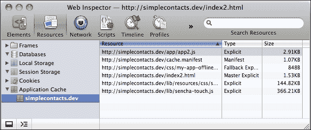
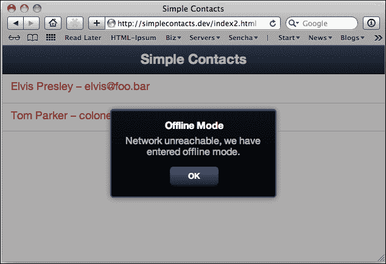
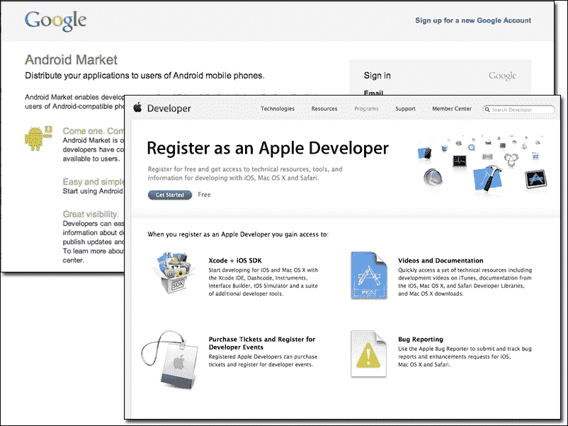

# 第九章：高级主题

在本章中，我们将探讨几个高级主题，旨在为构建 Sencha Touch 应用程序指出正确的方向，例如以下内容：

+   与你的服务器通信

+   离线工作

+   编译你的应用程序

+   进入市场

# 与你的服务器通信

到目前为止，我们一直使用本地存储作为在运行我们程序的设备上直接创建数据库的方法。虽然这非常有用，但在某些方面它也可能是有局限的，如下所述：

+   如果设备上存储了任何数据，你无法从另一台设备查看它

+   如果设备被盗窃/损坏/丢失或无法使用，你也会丢失其数据

+   分享选项限于传输数据的副本

+   数据协同编辑不可用

每一个这些问题都可以通过将数据存储在外部数据库中得到解决，比如 MySQL、PostgreSQL 或 Oracle。这些数据库可以运行在与我们的应用程序相同的服务器上，并处理来自不同设备的多个连接。由于所有设备都联系同一个中央数据库，跨设备共享数据变得更容易实现。

不幸的是，Sencha Touch 框架不能直接与这些类型的外部数据库进行通信。为了使用 Sencha Touch 应用程序与外部数据库，我们需要使用第三方 API 或创建我们自己的。积极的一面是，这意味着我们可以使用任何我们想要的数据库来存储我们的数据。然而，这也意味着我们将需要编写一些代码以便将 Sencha 与外部数据库连接起来。

## 使用你自己的 API

在之前的章节中，我们已经学习了如何使用外部 API 来处理来自如 Flickr 和 Google 服务等数据。外部 API 使得获取存储在这些各种服务数据库中的数据成为可能，但当你需要将数据传入和传出你自己的数据库服务器时该怎么办呢？

结果表明，使用 Sencha Touch 最好的方式是创建你自己的 API。为了做到这一点，我们需要退一步，更多关于 API 是什么以及它做什么的话题进行讨论。

在最为基础的层面上，API 充当了应用程序的存储部分与界面部分之间的翻译者。前端向 API 请求数据（比如说，联系人的列表），API 从数据库中提取信息。API 然后将那些数据翻译成 JSON 或 XML，并将其发送回前端进行展示。

虽然这对于一个应用程序来说可能看起来是一种不必要的分离，但实际上它有许多好处。首先，它允许后端和前端用不同的编程语言编写。这对我们来说很重要，因为尽管 JavaScript 是一种创建界面的好语言，但它并不是与更强大的数据库系统（如 MySQL、PostgreSQL、Microsoft SQL Server 和 Oracle）通信的好工具。API 的代码可以用一种对数据库友好的语言，如 PHP、RUBY 或 PERL 来创建。

### 注意

我们将使用 PHP 作为我们的示例，但 API 语言的选择完全取决于你。当我们覆盖 PHP 方面的事情时，我们也会非常一般化。我们的目标是传达概念，而不是提供特定的 PHP 代码。

第二个好处是，多个应用程序可以使用 API 来访问数据。这使得在用户之间共享数据变得容易得多，也使得向完全不同的应用程序提供相同的数据集成为可能（正如 Flickr API 所做的那样）。我们甚至不需要关心前端是用哪种编程语言编写的，因为 API 处理翻译。

让我们重新审视一下我们的`FlickrFindr`存储器，探索这是如何工作的：

```js
Ext.define('FlickrFindr.store.SearchPhotosStore', {
    extend: 'Ext.data.Store',
    requires: 'FlickrFindr.model.Photo',
    config: {
        model: 'FlickrFindr.model.Photo',
        autoLoad: false,
        pageSize: 25,
        proxy: {
            type: 'jsonp',
            url: 'http://api.flickr.com/services/rest/',
            callbackKey: 'jsoncallback',
            limitParam: 'per_page',
            reader: {
                type: 'json',
                root: 'photos.photo',
                totalProperty: 'photos.total'
            }
        }
    }
});
```

我们将这个存储器指向一个特定的 URL（[`api.flickr.com/services/rest/`](http://api.flickr.com/services/rest/)），现在，在我们控制器的监听部分，我们还发送我们的位置、半径和准确性设置：

```js
listeners: {
   locationupdate: function(geo) {
      // Use our coordinates.
      easyparams = {
        "min_upload_date": Ext.Date.format(dt, "Y-m-d H:i:s"),
        "lat": geo.getLatitude(),
        "lon": geo.getLongitude(),
        "accuracy": 16,
        "radius": 10,
        "radius_units": "km",
        "method": "flickr.photos.search",
        "api_key": me.getApplication().api_key,
        "format": "json"
      };
      var store = me.getSearchPhotoList().getStore();
        store.getProxy().setExtraParams(easyparams);
        store.load();
      },
}
```

每个这些参数都作为一组`POST`变量发送到 Flickr API URL。Flickr 然后使用我们在前面的代码中提供的变量执行`flickr.photos.search`功能。API 然后将这些结果组装成 JSON 格式并传递给我们。这被称为 REST 请求。

## REST

**REST**代表**代表性状态转移**，这是一个过于复杂的说法，意思是我们要使用已经内置到 HTTP 中的标准方法来进行通信。这些方法允许 HTTP 通过`POST`、`PUT`、`DELETE`和`GET`传输数据。

Sencha Touch Version 2.1 代理`Ext.data.proxy.Rest`是一个严格的 REST 实现，使用这四个单独的方法来处理 CRUD 功能：

+   `POST`处理新记录的创建

+   `GET`处理记录的读取

+   `PUT`处理现有记录的更新

+   `DELETE`处理记录的删除

### 提示

`Ext.data.proxy.Ajax`代理与`Ext.data.proxy.Rest`代理类似，但只使用`POST`和`GET`。如果你正在使用的 API 需要更严格的 REST 符合性，请确保使用 REST 代理。

如果你曾经在 Web 上处理过表单，你可能对`GET`和`POST`很熟悉。两者都是向网页传递额外变量的方法。例如，`GET`使用 URL 传递其变量，如下所示：

```js
http://www.my-application.com/users.php?userID=5&access=admin

```

这会将`userID=5`和`access=admin`发送到网页进行处理。

`POST`、`PUT` 和 `DELETE` 变量作为 HTTP 请求的一部分发送，并不出现在 URL 中。然而，它们传输的数据与键值对相同。

## 设计你的 API

在你开始编码之前，先考虑一下你希望你的 API 如何工作是一个好主意。API 可能会很快变得复杂，花些时间弄清楚你的 API 将会和不会做什么可以帮助你在构建应用程序时节省大量时间。

不同的程序员对于如何构建 API 有不同的哲学观点，所以我们这里提出的方法只是可能的方法之一。

Sencha Touch 的模型和代理带有几个方法，特别是 CRUD 函数（创建、读取、更新和删除），它们与 API 调用非常相符。这使它们成为一个很好的起点。首先，列出你认为需要的每个模型的方法。对于每个模型，你需要创建、读取、更新和删除函数。

然后，你应该仔细查看模型，看看哪些可能需要额外的 API 方法。一个好的例子是 `user` 模型。你肯定需要基本的 CRUD 方法，但也许还需要一个认证方法来让用户登录，以及可能一个检查权限的额外方法。

随着你的进展，你可能会发现你需要为特定的模型添加额外的 API 方法，但标准的 CRUD 函数应该会在你设计你的 API 时给你一个很好的起点。

## 创建模型和 store

在这个例子中，我们将使用 `Bookmarks` 模型的一个变种和我们上一章的 `FlickrFindr` 应用程序中的 store。

由于我们的 `Bookmarks` 组件现在将从数据库中获取，模型中需要一些额外的选项。我们不再像以前那样使用 `SearchResults` 模型，而是使用一个新的模型，例如以下的一个：

```js
Ext.define('FlickrFindr.model.Bookmark', {
  extend: 'Ext.data.Model',
  fields: [
    {
    name: 'id',
    type: 'int'
  },
    {
    name: 'owner',
    type: 'string'
  },
    {
    name: 'secret',
    type: 'string'
  },
    {
    name: 'server',
    type: 'int'
  },
    {
    name: 'farm',
    type: 'int'
  },
    {
    name: 'title',
    type: 'string'
  }
  ],
  proxy: {
        type: 'rest',
        url : '/api/bookmarks.php'
    }
});
```

在这里，我们在我们的模型中添加了一个 `rest` 代理和 `url` 值。这将允许我们直接从模型中保存、编辑和删除。

例如，要保存一个新的书签，我们可以在 Sencha Touch 中调用以下代码：

```js
var bookmark = Ext.create('FlickrFindr.model.Bookmark', {id: 6162315674, owner: 15638, secret:'d94d1629f4', server:6161, farm:7, title:'Night Sky'});
bookmark.save();
```

这段代码将执行一个 HTTP `POST` 请求到 `/api/bookmarks.php`，使用我们的所有 `bookmark` 变量作为键值对。

同样，我们可以取一个现有的书签，修改一些它的信息，然后调用 `bookmark.save()`。如果我们这样做在一个现有的书签上，模型会将变量作为 `PUT` 请求的一部分发送到 `/api/bookmarks.php`。

正如你所预期的，调用 `bookmark.destroy()` 会将我们的变量作为 `DELETE` 请求的一部分发送到 `/api/bookmarks.php`。

我们还需要以类似的方式修改我们的已保存照片 store：

```js
Ext.define('FlickrFindr.store.SavedPhotosStore', {
  extend: 'Ext.data.Store',
  requires: 'FlickrFindr.model.Bookmark',
  config: {
    model: 'FlickrFindr.model.Bookmark',
    storeID: 'BookmarkStore',
    autoload: true,
    proxy: {
      type: 'rest',
      url: '/api/bookmarks.php',
      reader: {
        type: 'json',
        root: 'children'
      }
    }
  }
});
```

与本章前面讨论的 store 相比，这个 store 的主要区别是代理配置。我们使用相同的 `/api/bookmarks.php` 文件来处理我们的请求。在这种情况下，store 在联系 `/api/bookmarks.php` 文件时将使用 `GET` 请求方法。

我们的`reader`有一个名为`children`的根属性。这表示接收到的数据应该如下所示：

```js
{
"total": 2,
  "children":[
    {
        "id":"6162315674",
        "owner":"Noel",
        "secret":"d94d1629f4",
        "server":"6161",
        "farm":7,
        "title":"Night Sky"
    },
    {
        "id":"6162337597",
        "owner":"Noel",
        "secret":"f496834m347",
        "server":"6161",
        "farm":7,
        "title":"Ring of Fire"
    }
  ]
}
```

我们的存储将开始在`children`数组内寻找记录，并使用默认变量`total`来获取记录总数。

## 发起请求

一旦我们的模型和存储理解了如何发起这些请求，我们的基于 PHP 的 API 文件就必须决定如何处理它们。这意味着我们必须将我们的`bookmarks.php`文件设置为处理这些请求。在很高的层次上，这意味着执行类似于以下代码的操作：

```js
<?PHP
$action = $_SERVER['REQUEST_METHOD'];

if($action == 'GET') {
  // read - return a list of bookmarks as JSON
} else if($action == 'POST') {
  // add a new user
} else if($action == 'PUT') {
  // save the edit of an existing user
} else if($action == 'DELETE') {
  // delete an existing user
}
?>
```

`<?PHP`和`?>`标签 simply denote the beginning and end of PHP code.

`$action = $_SERVER['REQUEST_METHOD'];`行获取了`request`方法，然后根据该结果决定我们的代码决策（`add`、`edit`、`read`或`delete`）。

### 注意

我们不想深入到代码特定的例子中，因为代码将根据您希望用于 API 的语言和数据库而有很大的不同。您需要查阅特定于 API 编程语言的指南，以学习如何适当地与您选择的数据库进行交互。

在执行`add`、`edit`和`delete`功能时要注意的一点是，传递给这些功能的数据将作为记录数组的形式到来，例如以下内容：

```js
{"records":[{"id":6162315674,"owner":"46992422@N08","secret":"d94d1629f4","server":6161,"farm":7,"title":"foo"}]}
```

这表明对于任何`add`、`edit`和`delete`选项，您将需要遍历每个记录的值并对每个记录进行数据库更改。虽然您可以通过`records[0].id`直接访问记录，但遍历值可以让您利用数据存储一次性同步多个更改的能力。

当您的 API 返回操作结果时，Sencha Touch 期望您返回最初发送到 API 中的完整记录（或记录）。例如，如果您创建了一个新记录，API 在成功保存后应该将该记录作为结果的一部分返回。如果您修改了几个记录并保存它们，如果它们正确地被保存了，API 应该返回所有被修改的记录。这是因为您的 API 可能会对记录进行额外的更改，这些更改应该在您的 JavaScript 代码中反映出来。返回完整记录确保了您的 JavaScript 应用程序与 API 所做的任何更改保持最新。

例如，我们可以向存储中添加多个书签，而不是像我们代码中早期那样直接使用模型创建它们。当我们在存储中调用`sync()`函数时，它将把数据作为书签数组发送到我们的 API：

```js
{"records":[
 {"id":6162315674 
  "owner":"46992422@N08",
  "secret":" your_secret_here ",
  "server":6161,
  "farm":7,
  "title":"foo"},
 {"id":"6162337597",
  "owner":"Noel",
  "secret":"your_secret_here",
  "server":"6161",
  "farm":7,
  "title":"Ring of Fire"}
]}
```

这样，如果我们允许 API 中循环，我们就不用担心请求来自模型还是存储。从接收角度来看，API 只需要担心请求是`POST`（`add`）、`PUT`（`edit`）、`GET`（`read`）还是`DELETE`（`delete`）。

然而，有时我们需要直接与 API 通信，也许还需要得到更完整的响应。这时 Ajax 请求就能派上用场。

## API 中的 Ajax 请求

在与外部数据库合作时，我们经常需要对其他模型进行数据更改。我们可能还需要接收比当前版本 Sencha Touch 数据存储更复杂的响应。在这些情况下，我们可以使用 Ajax 请求对象直接将数据发送到我们的后端进行处理。

例如：

```js
Ext.Ajax.request({
    url: '/api/bookmarks.php',
    method: 'GET',
    params: {
        id: '6162337597'
    },
    success: function(result, request) {
        var json = Ext.decode(result.responseText);
console.log(json.bookmark);
    },
failure: function(response, opts) {
        console.log('server-side failure with status code ' + response.status);
   } 
});
```

之前的代码向`/api/bookmarks.php`发送了一个直接的`GET`请求，并将`id 6162337597`值作为请求的一部分。API 然后可以使用这些信息抓取一个特定的书签，并以 JSON 格式将其返回给 Ajax 请求。

成功或失败由返回适当的 HTTP 状态码来表示。如果你返回一个成功的消息，简单地输出 JSON 将返回一个可接受的状态码。要表示失败，你会返回一个 400 或 500 范围内的错误代码；在 PHP 中，它可能如下所示：

```js
<?PHP
header("Status: 400 Bad Request – Invalid Username");
?>
```

你需要查阅你喜欢的 API 编程语言的文档，了解如何发送 HTTP 响应头。

### 注意

要查看 HTTP 状态码的列表，请访问[`restpatterns.org/HTTP_Status_Codes`](http://restpatterns.org/HTTP_Status_Codes)。

# 离线工作

不可避免地，使用你应用程序的人会发现他们没有互联网接入。在传统的网络应用程序中，这通常意味着应用程序无法访问和使用。但是，通过一些周密的计划，你可以使你的移动应用程序能够在离线状态下使用。

## 同步本地和远程数据

首先需要考虑的是你的数据：用户即使在离线状态下也需要哪些数据？让我们用一个简单的通讯录例子来说明。你可能会有一个用于联系人的模型和一个查询远程通讯录服务器的存储，也许还有一个列表视图来显示联系人：

```js
Ext.define('Contact', {
  extend: 'Ext.data.Model',
  config: {
    fields: [
      {name: 'id', type: 'int'},
      {name: 'firstname', type: 'string'},
      {name: 'lastname', type: 'string'},
      {name: 'email', type: 'string'}
      ]
  }
});

Ext.define('ContactStore', {
  extend: 'Ext.data.Store',
  config: {
    model: 'Contact',
    proxy: {
        type: 'jsonp',
      url: 'http://mycontactserver.com/api',
    },
    autoLoad: true
  }
});

Ext.define('ContactView', {
  extend: 'Ext.dataview.List',
  xtype: 'contactview',
  config: {
    store: 'ContactStore',
    itemTpl: '{firstname} {lastname} – {email}'
  }
});
```

### 注意

这是一个非常简单的例子，我们省略了创建`index.html`文件或把列表添加到视口中，即使这两个行动都是使这个应用程序真正工作的必要条件。

你会注意到我们的应用程序使用了`jsonp`代理，如果我们只是想从远程服务器加载其数据，这是可以的。如果我们想让我们的应用程序离线工作，我们必须提供一些本地存储。另外，当用户重新上线时，我们想让他们能够从远程服务器检索到更新的联系人信息。

这意味着我们需要两个存储：我们当前的存储，它使用一个`jsonp`代理，以及一个新的存储，用于在本地存储中保持数据的副本，以便我们在离线时使用。新的存储如下所示：

```js
Ext.define('OfflineContactStore', {
  extend: 'Ext.data.Store',
  config: {
    model: 'Contact',
    proxy: {
        type: 'localstorage',
      id: 'contacts'
   },
    autoLoad: true
  }
});
```

我们接下来的任务是确保离线商店拥有在线商店的最新数据。我们通过给在线商店的 `load` 事件添加一个监听器来实现。每次在线商店加载新数据时，我们将更新离线商店。离线商店作为在线数据的缓存以如下方式工作：

```js
Ext.define('ContactStore', {
    extend: 'Ext.data.Store',
    config: {
        model: 'Contact',
        proxy: {
            type: 'jsonp',
            url: 'http://mycontactserver.com/api',
            reader: {
                type: 'json'
            }
        },
        autoLoad: true,
        listeners: {
            load: function() {
                var offlineContacts = Ext.StoreMgr.get('OfflineContactStore');

                offlineContacts.each(function(record) {
                    offlineContacts.remove(record);
                });
                offlineContacts.sync();

                this.each(function(record) {
                    offlineContacts.add(record.data);
                });

                offlineContacts.sync();

            }
        }
    }
});
```

`load` 事件在在线商店成功加载新数据时被调用。在我们的处理程序中，我们首先检索离线商店并清空它（否则，每次加载在线商店时我们都会复制数据）。然后，我们使用在线商店的 `.each()` 函数遍历每一条记录，将该记录的数据添加到离线商店。

### 提示

**`.each()` 函数**

`.each()` 函数是 store 提供的，它允许你为 store 中的每一条记录调用一个函数。这个函数将单独的记录作为一个参数。这允许你逐条而不是单独查询所有记录执行操作。

现在，每当在线商店更新时，离线商店也会更新。更重要的是，当在线商店无法更新时，离线商店中仍然会有数据。由于即使在线商店没有数据，离线商店总是有数据可以显示，因此我们应该将离线商店作为列表的商店使用，这样我们总是向用户显示一些内容。所以，我们将 `ContactView` 更改为如下内容：

```js
Ext.define('ContactView', {
  extend: 'Ext.dataview.List',
  config: {
    store: 'OfflineContactStore',
    tpl: '{firstname} {lastname} – {email}'
  }
});
```

我们的在线商店在应用启动时仍然会自动加载，尽管它不再绑定到我们的列表了。如果用户在线，两个商店中的所有数据都将更新。

当然，还有其他实现同一目标的方法。你可以使用 `Ext.List` 组件的 `bindStore` 函数在两个商店之间切换，或者使用在线商店的 `jsonp` 代理 `exception` 事件来发现你何时离线。或者，你可以查看 `window.navigator.onLine` 变量的值来确定你的在线状态并相应地设置你的商店。我们将在本章后面讨论 `jsonp` 代理的 `exception` 事件和 `window.navigator.onLine` 变量。

## 清单

既然我们已经确保了数据可以离线使用，我们还需要确保应用的其他部分也可以离线使用。这包括我们所有的 JavaScript 代码、HTML、样式和图片。如果用户已经离线，除非他们有本地副本可以从中工作，否则他们将无法加载我们的应用。Application Cache 就在这时发挥作用。

HTML5 为指示 web 浏览器将应用的哪些部分存储为离线使用提供了一个机制。这不是 Sencha Touch 提供的功能，但无论如何你都应该熟悉这个概念。

### 注意

如果你正在使用 Sencha Cmd 来管理你的应用开发过程，`cache.manifest` 文件将会自动为你创建。

manifest 文件是一种你指定要缓存的文件的方式。让我们为我们的简单地址簿应用程序创建一个。打开一个空文本文件并添加以下代码：

```js
CACHE MANIFEST
# Simple Address Book v1.0

CACHE:
index.html
app/app.js
css/my-app.css
lib/resources/css/sencha-touch.css
lib/sencha-touch.js

# Everything else requires us to be online.
NETWORK:
*
```

然后，将文件保存为 `cache.manifest`。所有以井号（`#`）开头的行都是注释，将被忽略。

在前面的代码片段中，`CACHE:` 术语之后的第一个部分是移动设备应该为离线使用保存的文件列表。如果你有任何图片或其他文件，你也应该在这里列出。

`NETWORK:` 部分列出了所有只能在线访问的文件。星号（`*`）表示 `CACHE:` 部分未列出的所有内容都应仅在线可用。

### 注意

大多数浏览器将离线存储限制在 5 MB。这包括你在 manifest 中列出的文件以及任何在本地存储存储中的数据。因此，如果你有一个特别大的应用程序，你可能需要选择性地允许你的应用程序离线执行。

为了让浏览器了解你的 manifest 文件，你必须在你 的 `index.html` 文件中添加对它的引用。然而，这并不是我们链接 CSS 或 JavaScript 文件的方式。相反，我们给 `html` 标签的开启标签添加一个属性，如下所示：

```js
<html manifest="cache.manifest">
```

现在，当你启动你的浏览器时，你应该在开发者控制台的**应用缓存**中看到你的文件列表（点击**资源**标签，然后点击**应用缓存**），如下图所示：



## 设置你的网页服务器

最初，你可能会发现你的 manifest 文件没有正常工作。通常，这意味着你的网页服务器没有配置好以按照移动浏览器期望的方式来提供 manifest 文件。

网页服务器使用**MIME 类型**来告诉浏览器如何处理某些文件。MIME 类型可能相当复杂，但对于 manifest 文件，你只需要在你的服务器中添加 MIME 类型。你应该查阅你的网页服务器的文档以获取指导，但我们将以 Apache 网页服务器为例。

对于 Apache，你应该在你的 `httpd.conf` 文件中添加以下 MIME 类型：

```js
AddType text/cache-manifest .manifest
```

然后，重启你的网页服务器以使更改生效。

对于 IIS，你将需要使用管理界面来添加 MIME 类型。

### 注意

查看以下链接以设置你的网页服务器：

关于设置 Apache 的更多信息：[`httpd.apache.org/docs/current/mod/mod_mime.html`](http://httpd.apache.org/docs/current/mod/mod_mime.html)。

关于设置 IIS 的更多信息：[`technet.microsoft.com/en-us/library/cc753281(WS.10).aspx`](http://technet.microsoft.com/en-us/library/cc753281(WS.10).aspx)。

### 更新你的缓存应用程序

一旦你的应用程序被本地缓存，移动设备就不再向你的服务器查询以下载你的应用程序文件。这意味着，当你发布你的应用程序的更新或新版本时，那些已经缓存了你应用程序的用户将不会收到更新。

强制用户下载代码新版本的方法的唯一途径是更新本身 manifest 文件。这就是为什么我们在前面的代码片段顶部添加了以下几行：

```js
CACHE MANIFEST
# Simple Address Book v1.0
```

只需更新版本号并保存文件如下：

```js
CACHE MANIFEST
# Simple Address Book v1.1
```

这将更改 manifest 文件，强制所有缓存副本重新下载 manifest 中`CACHE:`部分的所有文件。

### 注意

如果你想要了解更多关于应用缓存和 manifest 文件的信息，请查看在[`www.html5rocks.com/en/tutorials/appcache/beginner/`](http://www.html5rocks.com/en/tutorials/appcache/beginner/)的*应用缓存初学者指南*。

## 界面考虑

让用户知道他们在线工作也很重要。大多数设备在状态栏中有一个在线图标，但即便如此，用户下线时也不总是显而易见的。你可能希望在将应用程序置于离线模式时让他们知道。

### 警告你的用户

在我们的通讯录示例中，我们有一个在线商店，它更新了一个离线商店的数据。离线商店持有用户在`Ext.List`类中看到的数据。然而，我们从不明确地告诉用户他们何时下线。在我们第一个例子中，我们不自己跟踪在线或离线状态，因为应用程序在任何模式下都能工作。

如果我们想要告诉用户应用程序何时下线，最可靠的方法是等待在线商店的请求超时。在代理中，让我们添加一个`timeout`组件和一个在`timeout`发生时调用的函数：

```js
proxy: {
        type: 'jsonp',
        url: 'http://mycontactserver.com/api',

 timeout: 2000,
 listeners: {
 exception:function (this, response, operation, eOpts)  {
 if(operation.error == 'timeout')  {
Ext.Msg.alert('Offline Mode', 'Network unreachable, we have entered offline mode.');
 }

 }
 }
}
```

`exception`函数只有在超时发生后才会被调用。Sencha Touch 中的超时以毫秒为单位列出，因此在这个例子中，`2000`意味着两秒钟。如果商店在两秒钟内没有从服务器获得响应，用户将看到一个警告，通知他们应用程序已经下线。

这里是一个添加其他离线逻辑的好地方：

+   如果你在你的商店中设置了轮询，以便它每隔一段时间自动刷新一次，你可能希望关闭它。

+   如果有特殊的离线 UI 元素，你可以在這裡启用它们。

+   如果你有很多离线逻辑，你可能会想要把代码放在一个单独的函数里，这样你就不必在代理配置中寻找它了。

如果你在使用前一章讨论的 MVC 结构，控制器将是这种逻辑的好地方。

### 提示

如果你通过 Sencha Cmd 或其他方法编译你的应用程序，而不是作为网络应用程序运行，你可能可以访问由`Ext.device.Connection`对象引发的`onlinechange`事件。查看 API 文档以了解关于使用`Ext.device.Connection`对象更多信息。

### 更新你的 UI

让用户视觉上知道他们处于离线模式的一种方法是改变应用的颜色或样式。虽然为离线模式设置一个完全不同的主题可能过于夸张，但有一种方便的方法可以指定一个离线样式表。

让我们创建一个名为`my-app-offline.css`的文件，并将其保存在我们的`css`文件夹中。在文件中，放置以下代码：

```js
.x-list .x-list-item {
  color: #f00;
}
```

这将把`contact-list`文本变成红色。现在，我们需要在离线时加载它。

应用缓存清单文件（`cache.manifest`）可以有一个名为`FALLBACK:`的部分，用于当某个特定文件无法访问时替代另一个文件。让我们在`cache.manifest`文件的底部添加以下内容：

```js
FALLBACK:
css/my-app.css css/my-app-offline.css
```

你还需要将`CACHE:`部分中的`css/my-app.css`行更改为引用`css/my-app-offline.css`，如下所示：

```js
CACHE MANIFEST
# Simple Address Book v1.2

CACHE:
index.html
app/app.js
css/my-app-offline.css
lib/resources/css/sencha-touch.css
lib/sencha-touch.js

# Everything else requires us to be online.
NETWORK:
*

FALLBACK:
css/my-app.css css/my-app-offline.css
```

在`index.html`文件中，你应该保留`css/my-app.css`在`style`标签中，因为当我们在线时，这个文件会被加载。然而，当我们在离线时，清单告诉我们的移动浏览器隐式地使用`css/my-app-offline.css`。



正如我们在之前的截图中看到的，现在，当你的应用处于离线状态时，它会自动使用`my-app-offline.css`而不是`my-app.css`。你也可以用这个方法来提供一个离线版本的图片，甚至是 JavaScript 文件，如果你想完全隔离在线和离线功能的话。需要注意的是，这个方法如果有人在使用你的应用时在线然后离线是行不通的，比如说，他们穿过一个隧道失去了信号。在这种情况下，你希望使用事件监听方法将用户切换到离线模式。

## 检测离线模式的其他方法

如本章前面所提到的，有两种检测离线模式的备用方法：`navigator.onLine`和`online`/`offline`浏览器事件。

变量`navigator.onLine`如果浏览器在线则为`true`，如果浏览器不在线则为`false`。在前面章节中讨论的`exception`函数中，我们可以添加以下代码来检查它并相应地更改我们的消息：

```js
exception:function () {
  if (navigator.onLine) {
 Ext.Msg.alert('Network Error', 'We have an Internet connection, but there is a problem communicating with the server.');
  } else {
    Ext.Msg.alert('Offline Mode', 'No Internet Connection, we have entered offline mode.');
  }
}
```

另外，我们可以为浏览器的`online`和`offline`事件设置监听器，如下所示：

```js
window.addEventListener("offline", function(e) {
alert("Application is offline.");
});
window.addEventListener("online", function(e) {
alert("Application is online.");
});
```

你会注意到我们这里没有使用 Sencha Touch 的事件管理概念。这是因为 Sencha Touch 没有为`online`和`offline`事件提供自定义事件，所以我们不得不使用浏览器的事件监听函数。

### 注意

并非所有桌面浏览器都支持`navigator.onLine`或`online`/`offline`事件，所以如果你也让桌面用户可以使用你的应用，你应该使用超时异常和清单缓存技术。

# 进入市场

Sencha Touch 应用程序为开发者提供了一种使用现有网络技术触达广大用户的方法。用户可以通过网络访问应用程序，甚至可以将它们保存到设备上以供离线使用。尽管这种灵活性非常有价值，但你也许还希望通过苹果和 Android 上可用的各种应用程序商店分发你的应用程序。

在本节中，我们将看看一些可用的选项和发布编译应用程序可能遇到的潜在障碍。

## 编译你的应用程序

编译后的应用程序是指在所述设备上本地运行的应用程序。对于苹果的 iOS 产品，这意味着 Objective C，对于谷歌的 Android 操作系统，这意味着 Java。iOS 和 Android 都使用自己的**软件开发工具包**（**SDK**）来创建这些本地应用程序。

一个 SDK 在功能上类似于 Sencha Touch 的框架，但它更加复杂且与特定平台（iOS 或 Android）紧密相关。由于本地应用程序是唯一可以在 Android 和 iOS 的各种应用程序商店中销售的类型，我们需要一种将我们的 Sencha Touch JavaScript 翻译成 SDK 可以使用的 JavaScript 的方法。幸运的是，Sencha Touch 开发者有几个选项可以将他们的基于 JavaScript 的应用程序翻译成这两种语言并创建编译后的应用程序。最受欢迎的两个翻译程序是 Sencha Cmd 和 PhoneGap。

Sencha Cmd 和 PhoneGap 都使用专门的命令行工具，允许你将现有代码放入 iOS 或 Android 的 SDK 中。这两个工具都广泛使用 Xcode 和 Android SDK 库将你的代码翻译成编译后的应用程序。我们在*注册开发者账号*部分看看如何获取这些 SDK。

除了将你的 Sencha Touch 应用程序翻译成本地应用程序之外，Sencha Cmd 和 PhoneGap 还允许你访问设备的一些本地功能。这些功能包括访问文件系统、摄像头以及设备上的声音和振动选项。

让我们来看看 Sencha Cmd 和 PhoneGap 翻译程序。

### Sencha Cmd

如果你一直在用这本书和 Sencha Cmd 一起工作，那么它很可能是编译应用程序的最佳选择。通过编译应用程序，你可以访问 iOS 或 Android 设备上的更多功能。这些功能包括以下几点：

+   **摄像头**：此功能允许你使用摄像头拍照或访问之前拍摄的照片。

+   **连接**：此功能允许你查看设备是否在线以及正在使用哪种类型的连接。

+   **联系人**：此功能允许访问搜索、排序和过滤设备上的联系人。

+   **地理定位**：此功能允许访问设备的地理定位 API（这是浏览器地理定位功能的更健壮实现）。

+   **通知**：此功能在设备上显示简单通知。这些通知出现在操作系统级别，而不仅仅是应用程序级别。

+   **方向**：此功能收集设备的朝向反馈。

+   **推送**：此功能向设备发送推送通知（仅限 iOS）。

这些功能通过一个名为`Ext.device`的对象访问。例如，`Ext.device.Camera.capture(...)`方法允许您从相机或相册中抓取图片，并将其用于您的应用程序。

有关本地打包的逐步指南，请参阅[`docs.sencha.com/cmd/3.1.2/#!/guide/native_packaging`](http://docs.sencha.com/cmd/3.1.2/#!/guide/native_packaging)。

### **PhoneGap**

与 Sencha Cmd 类似，PhoneGap 通过一个名为`navigator`的全局对象提供广泛的本地功能。这个对象允许您使用 JavaScript 调用您的 JavaScript 中的命令，例如以下命令：

```js
navigator.camera.getPicture(...)
navigator.compass.getCurrentHeading(…)
```

第一个命令在设备上打开相机，并允许您的应用程序拍照。照片作为数据字符串返回给您的应用程序，您可以在 JavaScript 中对其进行操作。

第二个函数返回设备的方向，以度为单位。这在游戏中有时候非常有用，因为游戏可以通过倾斜设备来操作。

PhoneGap 还提供了以下功能：

+   **加速度计**：此功能获取设备运动传感器的信息。

+   **相机**：此功能使用设备的相机拍照。

+   **捕获**：此功能捕获音频和视频。

+   **指南针**：此功能确定设备所指的方向。

+   **连接**：此功能检查网络状态并获取蜂窝网络信息。

+   **联系人**：此功能与内置的联系人数据库一起使用。

+   **设备**：此功能收集设备特定信息。

+   **事件**：此功能监听设备上的原生事件。

+   **文件**：此功能读写本地文件系统。

+   **地理定位**：此功能收集更详细的地理位置信息。

+   **媒体**：此功能回放音频文件。

+   **通知**：此功能创建设备通知。

+   **存储**：此功能直接在设备上存储数据。

PhoneGap 还为您提供了在 Blackberry、WebOS 和 Symbian 平台编译应用程序的选项。

### 注意

以下链接有更多关于 PhoneGap 的资源，请查看：[链接](https://example.org)

[`docs.phonegap.com/en/edge/`](http://docs.phonegap.com/en/edge/)

### 其他选项

PhoneGap 还推出了一项基于云的服务，用于编译应用程序，名为**PhoneGap Build**([`build.phonegap.com/`](https://build.phonegap.com/)). 这个独特的服务消除了为每个希望编译的平台下载 SDK 的必要性。文件只需上传到构建服务，系统就会为您指定的平台生成应用程序。

**Sencha Architect**是 Sencha Touch 和 ExtJS 的图形应用程序构建器。Architect 现在具有直接在应用程序中编译 iOS 和 Android 应用程序的功能。更多信息可以在[`docs.sencha.com/architect/2/#!/guide/deploy`](http://docs.sencha.com/architect/2/#!/guide/deploy)找到。

像这些选项中的任何一个一样，您需要成为您想要编译的平台上的授权开发者。这可能是一个相当漫长的过程，所以让我们看看涉及哪些内容。

## 注册开发者账户

为了将您的应用程序发布到 Apple Store 或 Google Play，您必须注册它们的相应开发者账户。这两个商店都会向您收取成为开发者的费用，并要求您提供大量的个人信息。它们需要这些信息有几个原因。首先，它们需要知道您是谁，这样您才能收到在它们的商店中销售的应用程序的付款。其次，如果您的应用程序出现问题，它们需要知道如何联系您。最后，如果有人试图用您的应用程序做坏事，它们需要能够找到您。当然，您不会这么做！



您还需要下载并安装适合该商店的适当 SDK，以便能够适当地打包您的应用程序。

### 成为 Apple 开发者

要成为 Apple 开发者，首先您必须前往[`developer.apple.com/programs/register/`](http://developer.apple.com/programs/register/)。

您需要提供您的现有 Apple ID，或者注册一个新的 ID，填写一些详尽的个人资料信息，同意一些法律文件，然后进行电子邮件验证。从那时起，您将能够访问 Apple 开发者中心。对我们这些移动开发者来说，最感兴趣的两个点是**iOS 开发者中心**和**iOS 配置门户**。

**iOS 开发者中心**是您可以下载 iOS SDK（称为**Xcode**）、阅读文档、查看示例代码和教学视频以及关于 iOS 开发的一些地方。

**iOS 配置门户**是您将应用程序添加到 Apple Store 或发布应用程序测试版本的地方。

### 小贴士

为了使用 Xcode 或将在 Apple Store 上发布您的应用程序，您的计算机必须运行 OS X。Windows 和 Linux 计算机无法运行 Xcode 或发布到 Apple Store。

### 成为 Android 开发者

注册 Android Market 的过程非常相似。首先，前往[`market.android.com/publish/signup`](https://market.android.com/publish/signup)。

在那里，您会被要求填写更多的个人资料信息并支付开发者注册费用。您还应该下载 Android SDK，位于[`developer.android.com/sdk/index.html`](http://developer.android.com/sdk/index.html)，尽管与 Apple 的 SDK 不同，Android 的 SDK 可以在 Windows、OS X 和 Linux 上运行。

安卓开发者仪表板还包含指南、参考资料和教学视频的链接。

# 总结

在本章中，我们向有抱负的 Sencha Touch 开发者介绍了一些高级主题。我们首先讨论了如何创建自己的 API 以与数据库服务器进行通信。我们介绍了与服务器发送和接收数据的 REST 通信方法，并讨论了构建自己的 API 的一些选项。

### 注意

更多关于创建 API 的资源如下：

如何创建 API：[`www.webresourcesdepot.com/how-to-create-an-api-10-tutorials/`](http://www.webresourcesdepot.com/how-to-create-an-api-10-tutorials/)

创建以 API 为中心的 Web 应用程序：[`net.tutsplus.com/tutorials/php/creating-an-api-centric-web-application/`](http://net.tutsplus.com/tutorials/php/creating-an-api-centric-web-application/)

然后我们讨论了如何使用清单和应用程序缓存将您的应用程序离线。我们谈论了在应用程序离线时警告用户的最佳实践以及如何使用 Sencha Touch 和设备的 Web 浏览器检测 Internet 连接的可用性。

### 注意

更多关于如何使应用程序离线的资源如下：

让 Sencha Touch 应用程序离线：

[`www.sencha.com/learn/taking-sencha-touch-apps-offline/`](http://www.sencha.com/learn/taking-sencha-touch-apps-offline/)

HTML 清单属性：

[`www.w3schools.com/tags/att_html_manifest.asp`](http://www.w3schools.com/tags/att_html_manifest.asp)

我们以使用 Sencha Cmd 和 PhoneGap 编译您的应用程序来进入应用程序市场的方式结束了本章。我们还讨论了成为苹果或安卓开发者以便您可以在市场上销售应用程序的过程。

### 注意

更多关于构建 Sencha Touch 应用程序的资源：

使用 Sencha Cmd 增强 iOS Sencha Touch 应用程序：

[`docs.sencha.com/cmd/3.1.2/`](http://docs.sencha.com/cmd/3.1.2/)

使用 PhoneGap 构建 Sencha Touch 应用程序：

[`docs.phonegap.com/en/edge/`](http://docs.phonegap.com/en/edge/)
