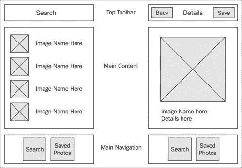
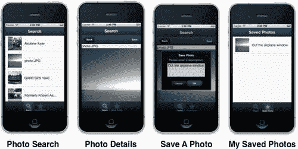
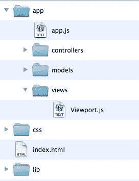
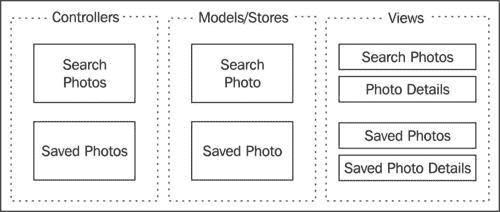
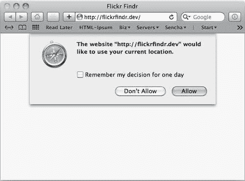
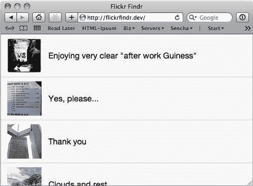
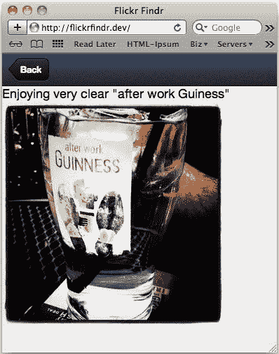
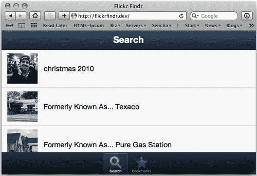

# 八、Flickr Finder 应用

到目前为止，我们已经单独或在小型、简单的应用中研究了 Sencha Touch 组件。在本章中，我们将使用 Sencha Touch 创建一个结构良好、更详细的应用。这将包括：

*   **模型视图控制器**（MVC）设计模式介绍
*   设置更健壮的文件夹结构
*   设置主应用文件
*   使用 flickrapi
*   注册组件
*   设置 SearchPhotos 组件
*   设置 SavedPhotos 组件
*   添加收尾工作以发布应用

# 基本应用

这个应用的基本思想是使用 FlickrAPI 来发现在我们位置附近拍摄的照片。我们还将添加保存感兴趣的照片的功能，我们可能希望稍后查看这些照片。

当您第一次创建应用时，勾画出接口总是一个好主意。这使您对需要构建的部分有了一个很好的了解，还允许您以用户的方式浏览各种屏幕。它不需要漂亮；它只需要让您对创建应用所涉及的所有部分有一个基本的了解。

目标是一些非常基本的东西，例如：



下一步，您将需要点击纸质界面，就像在实际应用中一样，并思考每次点击会将用户带到哪里，可能会遗漏什么，以及用户可能会混淆什么。

我们的基本应用需要能够显示照片列表以及单个照片的特写。当我们点击列表中的照片时，我们需要显示较大的特写照片。我们还需要一种方法，当我们完成时回到我们的列表。

当我们看到我们喜欢的照片时，我们需要能够保存它，这意味着我们需要一个按钮来保存照片，以及一个单独的保存照片列表和一个保存照片的特写单视图。

一旦我们对图纸感到满意，我们就可以开始编写代码，使我们的纸质模型变成这样：



# 模型视图控制器（MVC）简介

在开始构建应用之前，我们应该花一些时间讨论结构和组织。虽然这看起来像是一个无聊的应用哲学的迂回，但它实际上是应用最关键的考虑因素之一。

首先考虑单片应用，所有的东西都在一个巨大的文件中。这似乎很疯狂，但您将遇到数百个以这种方式编写的应用。试图调试这样的东西是一场噩梦。想象一下，在一个 750 行长的组件数组中找到丢失的闭合大括号。讨厌！

然后，问题变成了如何以逻辑方式分解文件。

模型视图控制器（MVC）根据代码的功能组织应用文件：

*   模型描述您的数据及其存储
*   视图控制数据的显示方式
*   控制器通过从用户获取输入，并根据用户的输入告诉视图和模型如何响应来处理用户交互

这意味着您的应用的每个部分都有单独的文件。让我们来看看这是如何构造的：



我们的**css**文件夹包含我们的本地样式表，我们的**lib**文件夹包含我们的 Sencha Touch 库文件，与之前一样，但我们的**app**文件夹中有一些新文件夹，名为**模型、控制器**和**视图**。

我们的**模型**文件将包含用于创建模型的代码以及包含数据的存储。每个不同的数据类型都有一个模型文件（我们将在下一节讨论如何划分数据类型）。

我们的**控制器**文件将包含应用的大部分功能：将数据加载到存储中，将数据取回显示，以及监听用户的任何输入。对于我们处理的每种类型的数据，这些控制器文件也将被拆分为单独的文件。

**视图**文件夹将包含我们每个数据块的所有显示信息。由于每个数据类型（例如，一个表单和一个列表）可能有多个视图，因此我们可能会将这些视图拆分为单独的子文件夹，每个数据类型一个。

通过以这种方式拆分文件，跨应用重用代码就容易多了。例如，假设您构建了一个具有模型、控制器和用户视图的应用。如果要创建另一个需要与用户打交道的应用，只需将模型、视图和控制器的各个文件复制到新应用中即可。如果复制了所有文件，那么用户代码的工作方式应该与前一个应用中的相同。

如果我们构建一个单片应用，您将不得不查找代码并提取一些片段，然后在新的应用中重新组装它们。这将是一个缓慢而痛苦的过程。通过按功能分离我们的组件，在项目之间重用代码就容易多了。

# 建立基础

在构建应用之前，我们需要设置 HTML 文件，该文件将链接到其他文件，并作为应用的整体容器：

```js
<!doctype html>
<html>
<head>
<meta http-equiv="Content-Type" content="text/html; charset=utf-8">
<title>Flickr Findr</title>
<meta name="viewport" content="width=device-width, user-scalable=no, initial-scale=1.0; maximum-scale=1.0; user-scalable=0;" />
<meta name="apple-mobile-web-app-capable" content="yes" />
<link rel="apple-touch-icon" href="apple-touch-icon.png" />
<link rel="stylesheet" href="lib/resources/css/sencha-touch.css" type="text/css">
<link rel="stylesheet" href="css/flickrfindr.css" type="text/css">
</head>
<body>
<script type="text/javascript" src="lib/sencha-touch-debug.js"></script>
<div id="sencha-app">
<script type="text/javascript" src="app/app.js"></script>
<!-- Place your view files here -->
<div id="sencha-views">
</div>
<!-- Place your model files here -->
<div id="sencha-models">
</div>
<!-- Place your controller files here -->
<div id="sencha-controllers">
</div>
</div>
</body>
</html>

```

这个基本的 HTML 文件设置链接到我们所有的各种 JavaScript 文件和 Sencha Touch 框架。在 `index.html`文件主体中，我们还为模型、视图和控制器文件创建了三个部分。创建每个文件时，需要在索引文件的相应部分添加指向该文件的链接。

### 提示

**在页面主体**中放置模型、视图和控制器

在典型的 HTML 页面中，JavaScript 被放置在`<head></head>`标记中。当浏览器加载该页面时，必须先加载 `head`标记中的所有内容，然后再加载页面的其余部分。一旦 `head`标记完全加载，`<body></body>`标记中的任何 HTML 都会被呈现， `body`标记中的任何文件都会被连续加载。通过将我们的组件移动到`<body></body>`标签中，我们可以加载用户将首先看到的位于列表顶部的组件。从用户的角度来看，这会导致加载时间稍微加快。

接下来，我们需要一种启动初始应用的方法，以及一种可以放置不同数据视图以供显示的基本结构。

这个基础从两个文件开始：一个称为“OutT0}”，在 OrthT1r 文件夹中，另一个称为“OutT2”，在主目录 T3 文件夹中。让我们看看这些文件。

我们的 `app.js`文件的代码非常简单：

```js
FlickrFindr = new Ext.Application({
defaultTarget: "viewport",
name: "FlickrFindr",
launch: function() {
this.viewport = new FlickrFindr.Viewport();
}
});
Ext.namespace('FlickrFindr.view', 'FlickrFindr.model', 'FlickrFindr.store', 'FlickrFindr.controller');

```

这是最初声明 `viewport`方法并启动应用的文件。我们还为模型、视图和控制器创建初始名称空间。正如我们在[第 2 章](2.html "Chapter 2. Creating a Simple Application")中提到的，*创建一个简单的应用*，名称空间确保当我调用 `FlickrFinder.Viewport()`时，我不会得到泛型 `Ext.Viewport`。

### 提示

**名称空间错误**

在 `Ext.Application`设置中，Sencha Touch 1.1 当前存在名称空间错误。目前，如文档中所述，当创建应用时， `Ext`调用 `ns`函数来创建我们的应用所需的名称空间。不幸的是，Sencha Touch 的 1.1 版中实际上不存在函数 `ns`，因此名称空间不是自动创建的。结果是，我们必须手动创建它们（不管 Sencha Touch 1.1 文档会告诉您什么）。

`launch`函数创建了新的 `FlickrFindr.Viewport()`方法，我们将在 `viewport.js`文件中定义该方法。

与之前一样，我们的视口只是标准 `Ext.Panel`组件的扩展。在 `viewport.js`文件中，添加以下内容：

```js
FlickrFindr.Viewport = Ext.extend(Ext.Panel, {
layout : 'card',
fullscreen: true,
initComponent: function() {
Ext.apply(this, {
items: [
{ xtype: searchphotos }
]
});
FlickrFindr.Viewport.superclass.initComponent.apply(this, arguments);
}
});

```

这个视口将是我们应用的框架，它将容纳我们的其他组件。但是，与前面的示例不同，我们的单个组件代码的大部分将存在于单独的文件中。我们的 `items`部分列出了一个具有 `xtype`属性 `searchphotos`的单个组件。我们将在*SearchPhotos 组件*部分中创建此组件。

## 分块

接下来我们需要考虑的是如何将我们的应用分割成单独的 MVC 组件。例如，如果您的应用跟踪人员及其拥有的汽车，您可能会为人员提供一个模型和控制器，为汽车提供一个单独的模型和控制器。您还可能同时拥有多个汽车和人的视图，例如 `add, edit, list, details`，等等。

在我们的应用中，我们将处理两种不同类型的数据。第一个是我们的照片搜索数据，第二个是我们保存的照片。

如果我们将其分解为模型、视图和控制器，则会得到如下结果：



我们的控制器通过保存照片和搜索照片的功能分开。

由于它们处理的是相同类型的数据，我们的每个控制器都可以使用相同的模型，但它们需要不同的存储，因为它们各自使用不同的实际数据集。我们的数据存储将是模型文件的一部分，因此我们将两个模型作为单独的块保留在图表中（因为它们仍然是单独的文件）。

对于视图，我们的搜索需要**搜索照片**的列表视图和**照片详细信息**视图。保存的照片还需要保存照片列表的视图和编辑/添加保存照片的视图。

### 提示

**命名约定**

使用 MVC 结构时有一些命名约定。虽然它们不是必需的，但强烈建议使用。这些约定将使其他必须使用您的代码的人更容易理解。控制器通常是一个或多个单词。模型是控制器名称的单数版本。最后，控制器的默认视图应命名为相同的（请记住，模型、视图和控制器位于单独的文件夹中）。这将明确哪些部分属于代码中的一部分。

既然我们已经了解了应用需要如何布局，那么在开始之前，我们还有最后一项任务要执行。我们需要从 Flickr 获取 API 密钥。

## 使用 Flickr API

大多数流行的 web 应用都提供了**API****（应用编程接口）**供其他应用使用。此 API 的工作方式与我们的 Sencha Touch 框架基本相同。API 提供了一个方法列表，这些方法可用于从远程服务器读取数据，甚至向远程服务器写入数据。

这些 API 通常需要密钥才能使用它们。这使得该服务能够跟踪谁在使用该服务，并减少对该系统的任何滥用。API 密钥通常是免费的，并且易于获取。

转到 Flickr API 站点[http://www.flickr.com/services/api/](http://www.flickr.com/services/api/) ，并查找短语**API 键**。按照链接，使用提供的表单申请 API 密钥。当您收到 API 密钥时，它将是一个 32 个字符长的字符串，由数字和小写字母组成。

每次向 Flickr API 服务器发送请求时，都需要传输此密钥。我们稍后再讨论这一部分。

FlickrAPI 涵盖了 250 多个方法。其中一些要求您使用 Flickr 帐户登录，而其他则只需要 API 密钥。

出于我们的目的，我们将使用一个名为 `flickr.photos.search`的 API 方法，它不需要登录。此方法根据某些条件查找照片。我们将使用设备的当前纬度和经度从当前位置的指定距离内获取照片。

我们的搜索结果作为一大捆 JSON 返回给我们，我们需要对其进行解码以显示。

一旦您拥有 API 密钥，我们就可以开始设置模型、视图和控制器。

# SearchPhotos 组件

我们将从 `search`组件开始构建。首先，我们需要在主 `index.html`中添加链接到我们将要创建的文件。如果您还记得从本章开始，我们为自己留下了一些占位符，用于添加模型、视图和控制器。在创建实际文件之前，让我们现在添加这些文件：

```js
<!-- Place your view files here -->
<div id="sencha-views">
<script type="text/javascript" src="app/views/Viewport.js"></script>
<script type="text/javascript" src="app/views/SearchPhotos.js"></script>
<script type="text/javascript" src="app/views/PhotoDetails.js"></script>
</div>
<!-- Place your model files here -->
<div id="sencha-models">
<script type="text/javascript" src="app/models/SearchPhoto.js"></script>
</div>
<!-- Place your controller files here -->
<div id="sencha-controllers">
<script type="text/javascript" src="app/controllers/SearchPhotos.js"></script>
</div>

```

`sencha-views`部分有我们的主视口、 `SearchPhotos`（列表）视图和 `PhotoDetails`视图。

我们的 `sencha-models`部分包含所有视图都将使用的 `SearchPhoto`模型。

`sencha-controllers`部分包含一个 `SearchPhoto`控制器，用于处理视图和模型之间的通信。

现在这些链接已经就位，我们可以开始构建实际的文件了。

从新组件开始的最佳位置是模型。通常，如果我们了解需要存储和显示的数据，我们可以使用这些数据来确定应用的其余部分应该如何构建。

## SearchPhotos 模型

我们的搜索结果将在一定程度上受到我们可以从 FlickrAPI 获取的数据的限制。但是，我们也希望将图像显示为搜索结果的一部分。这意味着我们需要查看 Flickr API，看看在应用中显示 Flickr 图像需要什么。

如果我们看一下[http://www.flickr.com/services/api/misc.urls.html](http://www.flickr.com/services/api/misc.urls.html) ，我们看到 Flickr 中的**照片源 URL**有如下结构：

```js
http://farm{farm-id}.static.flickr.com/{server-id}/{id}_{secret}.jpg

```

这意味着，为了显示每张照片，我们需要：

*   `farm-id:`映像所在的服务器组
*   `server-id:`图像所在的特定服务器
*   `id:`图像的唯一 ID
*   `secret:`Flickr API 用于路由请求的代码

这些都是我们作为 `flickr.photos.search`请求的一部分得到的东西。我们还可以取回照片的标题，作为展示的一部分。

根据这些标准，我们需要在 `models`文件夹中有一个 `SearchPhotos.js`文件，代码如下：

```js
Ext.regModel('FlickrFindr.model.SearchPhoto', {
fields: [
{
name: 'id',
type: 'int'
},
{
name: 'owner',
type: 'string'
},
{
name: 'secret',
type: 'string'
},
{
name: 'server',
type: 'int'
},
{
name: 'farm',
type: 'int'
},
{
name: 'title',
type: 'string'
}
]
});

```

我们注册我们的模型，就像以前一样，然后声明我们使用的字段。

### 提示

**远程加载**

养成使用完整名称空间 `FlickrFindr.model.SearchPhoto`的习惯是个好主意。Sencha Touch 的下一个版本将支持组件的远程加载。这意味着您不需要将所有文件都包含在索引中。Sencha Touch 将抓取组件文件并仅在需要时加载它们。它将根据全名来做这件事；该模型是我们主要的 Flickr Finder 应用的一部分，位于 `models`文件夹中，名为 `SearchPhoto.js`。

接下来，我们需要在 `model`文件夹中的 `SearchPhoto.js`文件中添加一些代码。在 `model`属性下面，我们需要添加以下内容：

```js
Ext.regStore('FlickrFindr.store.SearchPhotos', {
model: 'FlickrFindr.model.SearchPhoto',
autoLoad: false,
proxy: {
type: 'scripttag',
callbackParam: 'jsoncallback',
url: 'http://api.flickr.com/services/rest/',
extraParams: {
'method': 'flickr.photos.search',
'api_key': '783f66a1146d0be1ee5975785e6eb7a7',
'format': 'json',
'per_page': 25
},
reader: {
type: 'json',
root: 'photos.photo'
}
}
});

```

在这里，我们注册 `FlickrFindr.store.SearchPhotos`商店，就像注册模型一样。我们正在使用 `scripttag`代理。

如果您还记得[第 6 章](6.html "Chapter 6. Getting Data In")中提到的*在*中获取数据，那么这种代理类型用于处理对单独服务器的请求，非常类似于 JSONP。这些跨站点请求需要回调函数来处理服务器返回的数据。然而，与 JSONP 不同， `scripttag`代理将几乎自动为我们处理回调功能。

我们说几乎是，因为 Flickr 的 API 希望以如下方式接收回调变量：

```js
jsoncallback =a_really_long_callback_function_name

```

默认情况下，存储以以下方式发送此变量：

```js
callback =a_really_long_callback_function_name

```

幸运的是，我们可以通过设置此配置选项来改变这一点：

```js
callbackParam: 'jsoncallback'

```

下一节设置联系 Flickr API 的 URL，即 `url: 'http://api.flickr.com/services/rest/'`。此 URL 与对 Flickr API 的任何请求相同。 `extraParams`设置实际上是告诉 API 做什么的部分。让我们更仔细地看一看：

```js
extraParams: {
'method': 'flickr.photos.search',
'api_key': 'your-api-key-goes-here',
'format': 'json',
'per_page': 25
}

```

`extraParams`是发布到 URL 的一组键和值。请注意，与配置选项不同， `extraParams`在 `:`的两侧都有引号。如果你忘了，这会把你绊倒的。

在这种情况下，Flickr 的 API 需要以下信息：

*   `method:`我们正在调用的方法
*   `api_key:`我们自己的个人 API 密钥（示例中的密钥是假的；您需要提供自己的 API 密钥才能工作）
*   `format:`这就是我们想要找回信息的方式
*   `per_page:`这设置了我们希望从请求中获得多少图像

一旦我们找回数据，我们就会将其传递给读者：

```js
reader: {
type: 'json',
root: 'photos.photo'
}

```

既然我们设置了`'format': 'json'`，我们需要在 `reader`函数中设置 `type: 'json'`，我们还需要告诉 `reader`函数从哪里开始查找 Flickr 返回的 `json`数组中的照片。在这种情况下， `root: 'photos.photo'`是正确的值。

现在我们已经建立了数据模型和存储，我们需要两个视图： `SearchPhotos`视图和 `PhotoDetails`视图。

## 搜索照片视图

在我们的 `views`文件夹中创建一个 `SearchPhotos.js`文件。这将是我们两种观点中的第一种。每个视图表示一个 Sencha 触摸显示屏组件。在本例中，我们将使用 `Ext.Panel`类进行显示，并使用 XTemplate 来布置面板。

我们的 XTemplate 如下所示：

```js
FlickrFindr.view.SearchPhotoTpl = new Ext.XTemplate(
'<div class="searchresult">',
'',
' {title}</div>',
{
getPhotoURL: function(size, values) {
size = size || 's';
var url = 'http://farm' + values.farm + '.static.flickr.com/' + values.server + '/' + values.id + '_' + values.secret + '_' + size + '.jpg';
return url;
}
});

```

XTemplate 的第一部分提供了我们将用日期填充的 HTML。我们首先声明一个类为 `searchresult`的 `div`标记。这为我们提供了一个类，我们可以稍后使用它来指定正在点击哪个照片结果。

接下来，我们有一个图像标签，它需要包含一个 Flickr 图像 URL，用于列表中我们想要的照片。我们可以将此字符串作为 XTemplate 的 HTML 的一部分进行组装，但我们将借此机会增加一些灵活性，将其变成 XTemplate 上的函数。

以这种方式使用照片时，Flickr 为我们提供了许多大小选择。我们可以将以下任何选项作为 Flickr 图像 URL 的一部分传递：

*   `s:`小广场，75x75
*   `t:`缩略图，最长侧 100
*   `m:`小，长边 240
*   `-:`中等，最长侧 500
*   `z:`中等，最长侧 640
*   `b:`大，长边 1024
*   `o:`原始图像，JPG、GIF 或 PNG，取决于源格式

我们希望将函数设置为将这些选项之一与模板值一起使用，并创建 Flickr 图像 URL。我们的函数首先查看是否为大小传递了一个值，如果没有，我们将默认情况下使用 `size = size || 's'`将其设置为 `s`；。

接下来，我们使用 XTemplate 值和大小来组装 URL。最后，我们返回 URL 以在 XTemplate HTML 中使用。这将让我们为每个图像创建一个缩略图。

现在，我们需要一个地方来放置模板和图片：

```js
FlickrFindr.view.SearchPhotos = Ext.extend(Ext.Panel, {
id: 'searchphotos',
layout: 'card',
fullscreen: true,
initComponent: function() {
Ext.apply(this, {
dockedItems: [],
items: [
{
xtype: 'list',
store: 'FlickrFindr.store.SearchPhotos',
itemTpl: FlickrFindr.view.SearchPhotoTpl
}
]
});
FlickrFindr.view.SearchPhotos.superclass.initComponent.apply(this, arguments);
}
});
Ext.reg('searchphotos', FlickrFindr.view.SearchPhotos);

```

我们通过扩展 `Ext.Panel`类来创建 `FlickrFindr.view.SearchPhotos`模型。此面板将具有 `card`布局，因此我们可以在照片缩略图列表和详细信息页面之间切换。

`initComponent`配置将为面板设置我们的 `dockedItems`和 `items`组件。首先，我们只有一个 `list`组件，它使用我们之前创建的 `store`和 `itemTpl`对象。

最后两行初始化组件，然后注册 `searchphotos`组件的新 `xtype`属性。

在这一点上，我们的应用没有做很多事情，因为商店没有加载任何东西。我们还必须告诉商店我们的当前位置，以便在附近获得照片。如果应用在启动时这样做也会很好。

为了实现这些目标，我们需要在 `list`组件上添加一个侦听器（在 `items`部分之后）：

```js
listeners: {
render: function() {
var dt = new Date().add(Date.YEAR, -1);
var geo = new Ext.util.GeoLocation({
autoUpdate: false
});
geo.updateLocation(function(geo) {
var easyparams = {
"min_upload_date": dt.format("Y-m-d H:i:s"),
"lat": geo.latitude,
"lon": geo.longitude,
"accuracy": 16,
"radius": 10,
"radius_units": "km"
};
this.getStore().load({
params: easyparams
});
}, this);
}
}

```

在这里，我们为 `render`函数添加了一个侦听器。这将在应用启动时触发一次。

为了确保我们只获取最近的照片，我们创建了一个新的 `date`对象，该对象将保存一年前的日期， `(new Date().add(Date.YEAR, -1)`；，供我们以后使用。

我们还使用以下内容设置了一个新的 `GeoLocation`对象：

```js
var geo = new Ext.util.GeoLocation({
autoUpdate: false
});

```

通过设置 `autoUpdate: false`，我们只获取一次位置数据。这将通过不断更新我们的位置来防止我们将用户的电池打得死去活来。

由于我们已经关闭了 `autoUpdate`，我们需要使用 `geo.updateLocation()`手动触发和更新，并将一个函数传递给它运行。我们的函数所做的第一件事是设置 Flickr API 参数数组，然后我们可以将这些参数传递到我们的存储：

```js
var easyparams = {
"min_upload_date": dt.format("Y-m-d H:i:s"),
"lat": geo.latitude,
"lon": geo.longitude,
"accuracy": 16,
"radius": 10,
"radius_units": "km"
};

```

存储接受我们定义为 `params`的任何内容，并将其作为一组 `POST`变量传输，作为加载请求的一部分。在本例中，我们将参数发送到 Flickr 的 API，Flickr 将根据这些变量返回照片。

第一个参数设置我们感兴趣的照片的最短日期。其他参数通过 `GeoLocation`对象的纬度和经度设置当前位置。

`accuracy`参数使用的范围为 1（世界级）到 16（街道级），我们已将其设置为 `16`。我们也在为我们的搜索设置一个 `radius`的 `10 km`。我们将在稍后的高级搜索中使用这些元素。

一旦我们所有的参数都设置好了，我们还有最后一件事要添加， `SearchPhotos`控制器。

## 搜索控制器

控制器是我们大部分动作代码的归宿。制作一个名为 `SearchPhotos.js`的新文件，并将其放入 `controllers`文件夹中。将以下代码添加到文件：

```js
Ext.regController('searchphotos', {
showResults: function() {
var results = Ext.getCmp('searchphotos');
results.setActiveItem(0);
}
});

```

此代码注册我们的控制器，第一个函数将 `searchphotos`容器上的活动项设置为我们的列表（项 0）。此函数将在代码后面的**后退**按钮中使用。让我们在狩猎中试一试。

如果我们在 Safari 中加载应用，我们将首先收到一个警报，询问 Safari 是否可以使用我们当前的位置：



此警报允许用户拒绝应用对其当前位置的访问，并确保用户隐私。

如果您点击**允许**，我们的列表将呈现并开始加载照片。



现在，您应该可以看到您所在位置附近的照片列表。

### 提示

**Flickr API 浏览器**

如果没有得到任何结果，您可能希望尝试 Flickr API tester 网页。此页面将允许您在 web 表单中输入参数，并查看您从 `flickr.photos.search`API 请求[中得到的信息 http://www.flickr.com/services/api/explore/flickr.photos.search](http://www.flickr.com/services/api/explore/flickr.photos.search) 。这将让你知道你是否只是有一个代码问题，或者如果没有人在你的地区实际拍照。

现在我们已经有了我们的照片，如果能以更大的格式看到它们会很好，所以让我们添加我们的详细信息视图。

## 添加光电探测器视图

首先，我们需要将 tap 处理程序添加到 `views/SearchPhotos.js`文件中的当前列表中。当点击列表中的一个项目时，该处理程序将把我们的 `card`布局切换到详细视图。

在 `render`事件的侦听器下面，让我们添加一个用于点击处理的侦听器：

```js
itemtap: function(list, item) {
var photo = list.getStore().getAt(item);
Ext.dispatch({
controller: 'searchphotos',
action: 'showDetails',
args: [photo]
});
}

```

作为我们功能的一部分，我们将获得被点击照片的项目编号。我们需要存储中的实际数据记录来显示详细信息。我们用 `var photo = list.getStore().getAt(item)`来做这件事。

接下来，我们使用一个名为 `Ext.Dispatch().`的方法，该方法允许我们将命令和参数发送回控制器。在这种情况下，我们正在呼叫 `showDetails`并从商店传递照片记录。

在这个文件中，我们需要做的最后一件事是将详细信息组件添加到项目列表中。在 `list`组件后，添加以下内容：

```js
{
xtype: 'photodetails'
}

```

这将添加一个具有 `xtype`属性 `photodetails`的新组件。我们将在向控制器添加 `showDetails`代码后创建此视图。我们现在应该处理好 `views/SearchPhotos.js`文件了。让我们回到控制器文件。

在 `controller/SearchPhotos.js`文件中，我们需要添加代码以在 `PhotoDetails`视图中显示我们的照片（别担心，我们将在下一步创建）。我们可以在 `showResults`函数之后添加以下新函数：

```js
showDetails: function(interaction) {
var photo = interaction.args[0];
var results = Ext.getCmp('searchphotos');
results.down('photodetails').update(photo.data);
results.setActiveItem(1);
}

```

对于这个函数，已经将照片记录作为参数数组的一部分传递给了我们，因此我们使用 `var photo = interaction.args[0]`获取它。接下来，我们得到我们的 `searchphotos`组件，并使用 `down`方法找到我们的 `photodetails`项目（它是 `searchphotos`组件中项目列表的一部分）。然后我们将照片数据加载到 `photoDetails`。现在，我们可以使用 `results.setActiveItem(1).`切换 `card`布局以显示我们的详细信息

现在，我们的控制器了解了如何处理从 `tap`事件接收到的照片，我们需要创建实际显示照片的 `PhotoDetails`视图。此文件应放在 `views`文件夹中。

我们的 `PhotoDetails`观点如下：

```js
FlickrFindr.view.PhotoDetails = Ext.extend(Ext.Panel, {
id: 'photodetails',
fullscreen: true,
tpl: '<h1>{title}</h1></img>',
dockedItems: [
{
xtype: 'toolbar',
items: [
{
text: 'Back',
ui: 'back',
handler: function() {
Ext.dispatch({
controller: 'searchphotos',
action: 'showResults'
});
}
}
]
}
],
initComponent: function() {
FlickrFindr.view.PhotoDetails.superclass.initComponent.apply(this, arguments);
}
});
Ext.reg('photodetails', FlickrFindr.view.PhotoDetails);

```

我们开始这个文件时非常像我们的 `SearchPhotos`视图。我们扩展了 `panel`并给它一个 `id`和一个 `tpl`组件。

我们将创建图像链接作为模板的一部分，而不是像在前面的 `SearchPhotostpl`模型中那样将其作为函数添加。这只是为了表明，任何一种方法都可以很好地发挥作用。在此 `tpl`组件中，我们还添加了对 `Sencha.io`的引用，以根据设备调整图像大小：

```js
http://src.sencha.io/x100/x100/http://farm{farm}.static.flickr.com/{server}/{id}_{secret}_b.jpg

```

通过使用 `x100/x100`，我们可以自动将图像大小调整为运行它的任何设备的全屏大小。

接下来，我们使用**返回**按钮设置 `dockedItems`组件，这样我们就可以返回到照片列表。此按钮使用 `Ext.Dispatch`调用我们之前为控制器添加的 `showResults`函数（将 `card`布局设置回列表视图的函数）。

最后，我们初始化组件并注册新的 `xtype`属性，方法与 `SearchPhotos`视图相同。

一旦我们有了视图的代码，我们应该能够通过单击列表中的文件来查看详细信息。



现在我们可以查看全尺寸的照片了，让我们设置一个 `savedphoto`组件，它允许我们保存到任何我们喜欢的照片的链接。

# 保存的照片组件

我们的 `savedphoto`组件需要存储搜索结果中一张照片的信息。我们还需要保存照片的列表视图和详细信息视图，就像我们以前的 `SearchPhotos`和 `PhotoDetails`型号一样。

由于我们的 `savedphoto`模型只是显示我们所有照片的一个子集，因此我们可以为应用的这一部分重用大量代码。

## 保存的照片模型

由于我们的 `SavedPhotos`和 `SearchPhotos`模型存储的数据类型完全相同，因此我们不需要创建新模型。然而，我们确实需要一个单独的数据存储，它将本地存储我们的 `SavedPhotos`模型。

让我们在 `models`文件夹中添加一个 `SavedPhotos.js`文件：

```js
Ext.regStore('FlickrFindr.store.SavedPhotos', {
model: 'FlickrFindr.model.SearchPhoto',
autoLoad: true,
proxy: {
type: 'localstorage',
id: 'flickr-bookmarks'
}
});

```

在这里，我们只需注册我们的 `FlickrFindr.store.SavedPhotos`类并重用 `FlickrFindr.model.SearchPhoto`中的模型。我们还希望在应用启动时加载此存储。因为它是在获取本地数据，所以这不会给应用带来巨大的负载。

我们将代理设置为本地存储数据，并为存储分配一个 `id`组件 `flickr-bookmarks`，以便稍后获取它。

完成 `models/SavedPhotos.js`文件后，请确保在索引文件中链接到该文件。

## 保存的照片视图

对于 `SavedPhoto`视图，我们需要一个列表和一个详细视图。这些视图将非常接近我们的 `SearchPhotos`和 `PhotoDetails`模型。事实上，我们可以先复制这两个文件，然后稍微调整一下布局。

在 `views`文件夹中复制 `SearchPhotos.js`并将其重命名为 `SavedPhotos.js`。您还需要将所有出现的 `SearchPhotos`和 `searchphotos`分别替换为 `SavedPhotos`和 `savedphotos`（记住 JavaScript 区分大小写）。您的代码应该如下所示：

```js
FlickrFindr.view.SavedPhotos = Ext.extend(Ext.Panel, {
id: 'savedphotos',
layout: 'card',
fullscreen: true,
initComponent: function() {
Ext.apply(this, {
dockedItems: [{
xtype: 'toolbar',
dock: 'top',
title: 'Saved Photos',
items: []
}],
items: [
{
xtype: 'list',
store: 'FlickrFindr.store.SavedPhotos',
itemTpl: FlickrFindr.view.SearchPhotoTpl,
listeners: {
itemtap: function(list, item) {
var photo = list.getStore().getAt(item);
Ext.dispatch({
controller: 'savedphotos',
action: 'showDetails',
args: [photo]
});
}
}
},
{
xtype: 'savedphotodetails'
}
]
});
FlickrFindr.view.SavedPhotos.superclass.initComponent.apply(this, arguments);
}
});
Ext.reg('savedphotos', FlickrFindr.view.SavedPhotos);

```

您会注意到，我们在此文件中没有包含模板；我们只是在重用 `SearchPhotos.js`文件中的 `FlickrFindr.view.SearchPhotoTpl`类。创建一个单独的模板是很好的，但是重用可以节省一些内存和时间。

除此之外，该文件与我们的 `SearchPhotos.js`文件基本相同：我们创建了一个具有 `card`布局的面板，并添加了一个工具栏。我们在 `card`布局中有两个项目：一个列表和一个详细信息面板（我们将在下一步创建）。我们设置了 `itemTap`事件来联系控制器并启动 `showDetails`功能。最后，我们初始化组件并为组件注册一个 `xtype`属性 `savedphotos`。

### 注

虽然有两个如此相似的文件似乎有点多余，但应该注意的是，它们都从不同的数据存储中读取，控制器需要对它们进行不同的寻址。在一切结束之前，我们还将对不同视图的外观进行一些调整。

对于我们的 `SavedPhotoDetails`模型，我们将采取类似的方法。将 `PhotoDetails.js`文件复制到您的 `views`文件夹中，并将其重命名为 `SavedPhotoDetails.js`。此文件将显示一张保存的照片。但是，与搜索照片的详细信息不同，此保存的照片详细信息面板不需要**保存**按钮。

您需要修改文件以删除**保存**按钮：

```js
FlickrFindr.view.SavedPhotoDetails = Ext.extend(Ext.Panel, {
id: 'savedphotodetails',
fullscreen: true,
tpl: '<h1>{title}</h1></img>',
dockedItems: [
{
xtype: 'toolbar',
items: [
{
text: 'Back',
ui: 'back',
handler: function() {
Ext.dispatch({
controller: 'savedphotos',
action: 'showSavedPhotos'
});
}
}
]
}
],
initComponent: function() {
FlickrFindr.view.SavedPhotoDetails.superclass.initComponent.apply(this, arguments);
}
});
Ext.reg('savedphotodetails', FlickrFindr.view.SavedPhotoDetails);

```

与之前一样，这与我们之前创建的 `PhotoDetails`文件基本相同；我们已经切换了名称，并更改了我们的**后退**按钮，以显示我们的 `SavedPhotos`列表，而不是主照片列表。

完成这两个视图后，将它们添加到我们的 `index.html`的 `sencha-views`类中，因此：

```js
<div id="sencha-views">
<script type="text/javascript" src="app/views/Viewport.js"></script>
<script type="text/javascript" src="app/views/SearchPhotos.js"></script>
<script type="text/javascript" src="app/views/PhotoDetails.js"></script>
<script type="text/javascript" src="app/views/SavedPhotos.js"></script>
<script type="text/javascript" src="app/views/SavedPhotoDetails.js"></script>
</div>

```

现在，我们可以转到 `savedphotos`组件的控制器。

## 保存的照片控制器

在我们的 `controller`文件夹中创建一个名为 `SavedPhotos.js`的新文件。该文件的结构与我们的其他控制器文件类似；首先注册控制器，然后添加函数：

```js
Ext.regController('savedphotos', {
showDetails: function(interaction) {
var photo = interaction.args[0];
var savedPhotos = Ext.getCmp('savedPhotos');
savedphotos.down('savedphotodetails').update(photo.data);
savedphotos.setActiveItem(1, 'slide');
},
showSavedPhotos: function() {
var savedPhotos = Ext.getCmp('savedPhotos');
savedPhotos.setActiveItem(0, {
type: 'slide',
direction: 'right'
});
}
});

```

第一个函数 `showDetails`通过 `tap`事件传递一个名为 `interaction`的数组（即使用户只点击一项，它仍然作为数组的一部分传递）。然后我们抓取我们的 `savedphotodetails`组件，使用 `down`方法通过 `id`进行搜索，并使用照片中的数据更新内容区域。最后，我们将活动项设置为 `1`，这是我们的 `savedphotodetails`组件，并使用 `slide`动画设置更改的动画。

如果您还记得，我们的 `showSavedPhotos`功能与 `savedphotodetails`组件上的**后退**按钮相关联。此功能为我们的主 `savedphotos`面板选择 `card`布局（使用 `Ext.getCmp('savedphotos'))`并将活动项设置回 `0`，将其返回 `savedphotos`列表。

现在，我们需要在控制器上再添加一个函数。这将允许我们在用户保存照片时弹出警报，并要求他们命名照片。因为我们只需要一个文本字段，所以可能不需要创建单独的表单视图；我们可以使用 `Ext.Msg`组件。

在 `showDetails`函数上方，我们需要添加以下代码：

```js
addSavedPhoto: function() {
var panel = Ext.getCmp('photodetails');
Ext.Msg.prompt('Save Photo', 'Please enter a description:', function(btn, value) {
if (btn == 'ok') {
var savedPhotoStore = Ext.StoreMgr.get('FlickrFindr.store.SavedPhotos');
var savedPhoto = Ext.ModelMgr.create(panel.data, 'FlickrFindr.model.SearchPhoto');
savedPhoto.set('title', value);
savedPhotoStore.loadRecords([savedphoto], true);
savedPhotoStore.sync();
var tabPanel = Ext.getCmp('viewport');
tabPanel.setActiveItem(1); //switch to the savedphoto view.
}
}, this, true, //multiline
panel.data.title, // value
{
focus: true,
autocorrect: true,
maxlength: 255
});
}

```

我们的 `addSavedPhoto`功能首先获取当前的照片详细信息面板。这使我们能够访问当前存储在面板中的所有数据。

然后，该函数显示了简单的 `Ext.Msg`组件的一些功能。我们先把这里的东西列出来，然后再进去仔细看看。首先，通过声明 `Ext.Msg.prompt`，我们告诉消息框，我们正在提示用户在文本字段中提供一些信息。然后， `Ext.Msg`组件设置以下内容：

*   弹出窗口的标题
*   弹出窗口的文本
*   接收被按下按钮的函数，以及文本字段的值
*   功能`(this)` 的范围
*   值 `true`（范围后面的右键设置为 `this)`，这使得文本字段可以有多行
*   要设置为文本字段默认值的值
*   `focus, autocorrect`和 `maxlength`，这是提示配置的三个配置选项

标题和文本很简单，但是让我们仔细看看这个函数。当用户单击消息对话框上的任何按钮时，将调用该函数。函数被传递被按下按钮的名称，如果出现提示，则传递文本字段的值。

要处理这些信息并将其放入我们的数据存储，我们首先使用以下方法获取存储：

```js
var savedPhotoStore = Ext.StoreMgr.get('FlickrFindr.store.SavedPhotos');

```

接下来，我们使用模型管理器创建一个新的 `savedphoto`组件`(FlickrFindr.model.SearchPhoto)` ，并用我们当前的面板数据（这是我们当前的照片数据）填充数据。我们还将标题设置为与用户在消息字段中输入的值相匹配：

```js
var savedPhoto = Ext.ModelMgr.create(panel.data, 'FlickrFindr.model.SearchPhoto');
savedphoto.set('title', value);

```

完成后，我们加载新的 `savedphoto`组件并同步存储以保存数据：

```js
savedPhotoStore.loadRecords([savedphoto], true);
savedPhotoStore.sync();

```

完成后，我们抓取主视口并切换回 `savedphotos`列表：

```js
var tabPanel = Ext.getCmp('viewport');
tabPanel.setActiveItem(1);

```

我们的 `Ext.Msg.prompt`代码的其余部分设置消息框的配置选项，提供功能 `scope`，将文本字段设置为多行，为文本区域提供默认值，并添加一些额外的配置选项。

最后一组值称为 `promptConfig`，它是消息框文本区域的一组可选配置。我们将焦点设置在文本区域（框出现时），启用“自动更正”，并将最大文本长度设置为 255 个字符。

### 提示

**多行错误**

如果 multiline 设置为 `true`，则 Sencha Touch 1.1 当前存在一个 bug。如果您使用 Safari 或 Chrome 浏览器，该错误会导致字段的最大长度默认为 `0`。解决方法是在提示符配置中将 `maxlength`设置为实际数字。

完成控制器代码后，记得在 `index.html`文件中链接到它：

```js
<div id="sencha-controllers">
<script type="text/javascript" src="app/controllers/SearchPhotos.js"></script>
<script type="text/javascript" src="app/controllers/SavedPhotos.js"></script>
</div>

```

现在我们已经使用了 `savedphotos`控制器，我们可以将 `savedphotos`组件添加到视口中。

## 将保存的照片添加到视口

当我们的视口开始时，我们只有一个项目， `SearchPhotos`组件。现在我们有了两个单独的列表，一个选项卡面板将更有意义。让我们将 viewport.js 代码更改为如下所示：

```js
FlickrFindr.Viewport = Ext.extend(Ext.TabPanel, {
id: 'viewport',
fullscreen: true,
cardSwitchAnimation: 'slide',
tabBar: {
dock: 'bottom',
layout: {
pack: 'center'
}
},
initComponent: function() {
Ext.apply(this, {
items: [{
xtype: 'searchphotos',
title: 'Search',
iconCls: 'search'
},
{
xtype: 'savedPhotos',
title: 'Saved Photos',
iconCls: 'favorites'
}]
});
FlickrFindr.Viewport.superclass.initComponent.apply(this, arguments);
}
});

```

我们所做的第一个改变是在我们的 `extend`功能中将 `Ext.Panel`替换为 `Ext.TabPanel`。

由于 `TabPanel`需要一个 `cardSwitchAnimation`组件来切换选项卡，以及一个 `tabBar`组件来显示选项卡，因此我们也添加了这些组件。

接下来，我们为 `searchphotos`和 `savedphotos`添加了面板，以及标题和 `iconCls`属性。这将显示为应用底部选项卡的一部分。

我们需要做的最后一件事是添加我们的**保存**按钮，以便用户可以保存特定的照片。

## 添加保存按钮

当用户查看特定照片时，需要显示**保存**按钮。这意味着我们需要将其添加到 `PhotoDetails.js`视图中。

在 `views`文件夹中，打开 `PhotoDetails.js`文件。目前，我们的 `dockedItems`组件只有一个**后退**按钮。我们想在工具栏右侧添加一个**保存**按钮：

```js
dockedItems: [
{
xtype: 'toolbar',
items: [
{
text: 'Back',
ui: 'back',
handler: function() {
Ext.dispatch({
controller: 'searchphotos',
action: 'showResults'
});
}
}, {
xtype: 'spacer'
},
{
text: 'Save',
ui: 'action',
handler: function() {
Ext.dispatch({
controller: 'savedPhotos',
action: 'addSavedPhoto'
});
}
}
]
}
]

```

实际上，我们已经在工具栏中添加了两个项目；第一个是一个 `spacer`组件。 `spacer`组件是一个特殊的工具栏组件，它将间隔符之后的每个项目移动到工具栏的右侧。

第二项是我们的**保存**按钮。此按钮的处理程序使用 `dispatch`函数通知我们的控制器运行 `addSavedPhoto`函数。

一旦添加并保存了这些代码，我们的应用就可以使用了。



# 完善你的申请

现在我们已经完成了我们的应用，我们将要添加一些收尾工作，以真正使我们的应用发光，并为完成的产品添加一个专业水平。好消息是，所有这些都可以轻松快速地实现。

## 动画过渡

您会注意到，当我们从 `SearchPhotos`列表视图转到 `PhotoDetails`视图时，我们只是通过 `setActiveItem()`从一个视图跳到另一个视图。这可能有点刺耳。然而，在我们的 `SavedPhotos`视图中，我们偷偷地在一些动画中作为 `setActiveItem()`调用的第二个参数。回过头来，将这些相同的动画添加到我们的 `SearchPhotos`控制器中，不仅可以使行为更加一致，还可以使界面更干净。

在 `controllers/SearchPhotos.js`文件中，找到 `showDetails`函数并更改以下行：

```js
results.setActiveItem(1);

```

将其更改为：

```js
results.setActiveItem(1, 'slide');

```

`'slide'`动画将从右侧滑入 `PhotoDetails`卡，同时将 `SearchPhotos`列表滑出至左侧。当我们从 `PhotoDetails`视图返回 `SearchPhotos`列表时，我们希望向另一个方向滑动。这需要更多的配置。在同一控制器文件中找到 `showResults`功能，并更改以下行：

```js
results.setActiveItem(0);

```

将其更改为：

```js
results.setActiveItem(0, {
type: 'slide',
direction: 'right'
});

```

这会将所有东西从右边滑出，从左边滑入，与我们第一次进入 `PhotoDetails`视图时的方向相反。文档中的 `Ext.Anim`下列出了更多设置和动画类型。

当您从一个网页转到另一个网页时，新网页只是替换旧网页。但是，在大多数移动应用中，从一个视图移动到另一个视图需要动画。这些类型的动画转换很容易添加，而且很重要，因为它们有助于区分应用，并使其感觉比普通网页更有机。

## 应用图标

正如[第一章](1.html "Chapter 1. Let's Begin with Sencha Touch!")中提到的，*让我们从 Sencha Touch 开始！*，用户可以导航到您的 web 应用，然后选择将其保存到其移动设备的桌面上。当有人以这种方式安装您的应用时，您可以指定哪个图标显示在他或她的主屏幕上。


我们已经在 `index.html`文件中找到了此代码：

```js
<link rel="apple-touch-icon" href="apple-touch-icon.png" />

```

尽管上面写着 `"apple-touch-icon`“，大多数移动设备，包括 Android 设备，都能识别标签。对于某些设备，苹果建议您的应用图标为 57 x 57 px；对于较新的设备，建议您的应用图标为 114 x 114 px。创建更大尺寸的图标是最安全的，因为如果需要，图标会自动缩小。此外，在 Apple iOS 设备上，角落将自动变圆，并添加光泽效果。

如果希望图标保持原样，可以使用以下标记：

```js
<link rel="apple-touch-icon-precomposed" href="apple-touch-icon.png" />

```

拐角仍将自动圆角，但不会应用光泽度效果。另外，请注意，较旧的 Android 版本（1.5 和 1.6）将只识别 `precomposed`标记。

### 注

移动设备主屏幕上显示的文本，在您的图标下，将是您的 `index.html`文件中`<title></title>`标签中的任何内容。

您还可以为不同的设备类型指定不同大小的应用图标：

```js
<link rel="apple-touch-icon" href="apple-touch-icon.png" />
<link rel="apple-touch-icon" sizes="72x72" href="ipad-apple-touch-icon.png" />
<link rel="apple-touch-icon" sizes="114x114" href="iphone4-apple-touch-icon.png" />

```

这将允许您为不同的设备自定义图标中的详细信息。

Apple iOS 设备还允许您指定应用加载时显示的启动屏幕图像：

```js
<link rel="apple-touch-startup-image" href="startup-image.png">

```

对于 iPhone，此图像应为 320 x 460 像素，且为纵向。不过，iPad 可以有不同大小的启动映像，具体取决于它们是横向还是纵向—纵向为 748 x 1024 px，横向为 1004 x 768 kpx。

您可以使用媒体查询指定不同的启动映像大小：

```js
<link rel="apple-touch-startup-image" href="ipad-landscape-startup-image.png" media="screen and (min-device-width: 481px) and (max-device-width: 1024px) and (orientation:landscape)" />
<link rel="apple-touch-startup-image" href="ipad-portrait-startup-image.png" media="screen and (min-device-width: 481px) and (max-device-width: 1024px) and (orientation:portrait)" />
<link rel="apple-touch-startup-image" href="iphone-startup-image.png" media="screen and (max-device-width: 320px)" />

```

媒体查询是一个功能强大的工具，用于指定配置，它不是基于实际设备，而是基于其物理特性，如屏幕大小或像素深度。

### 注

如果您想了解有关媒体查询的更多信息，请从以下文章开始：[http://thinkvitamin.com/design/getting-started-and-gotchas-of-css-media-queries/](http://thinkvitamin.com/design/getting-started-and-gotchas-of-css-media-queries/) 。

# 你自己试试看

在我们的应用中仍然有很大的改进空间，但我们将把它作为额外的学分留给读者。一些您可能想尝试的事情：

*   添加分页，这样您可以加载超过第一页的 25 张照片
*   添加专家搜索，您可以手动设置位置或扩大搜索半径
*   更改主题并使模板更具吸引力
*   添加保存位置和照片的功能

尝试使用我们在本章中介绍的 MVC 组织技术来扩展应用并提高您的技能。

# 总结

在本章中，我们向您介绍了**模型视图控制器（MVC）**设计模式。我们讨论了设置一个更健壮的文件夹结构，并创建了主应用文件。我们从 FlickrAPI 的概述开始应用，并探讨了如何注册各种模型、视图和控制器组件。然后我们为 `SearchPhotos`和 `SavedPhotos`模型设置组件。在这一章的结尾，我们给出了一些提示，帮助您完成应用的收尾工作，并讨论了一些您可能希望添加到应用中的额外内容。

在下一章中，我们将介绍一些高级主题，如构建自己的 API、使用清单系统创建脱机应用，以及使用 PhoneGap 之类的程序编译应用。