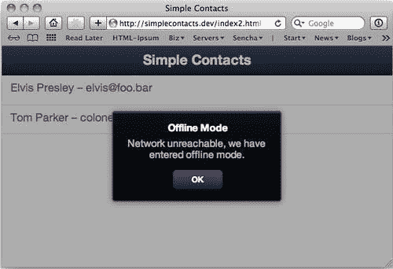
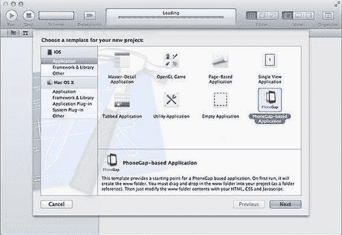

# 九、高级主题

在本章中，我们将探讨一些高级主题，旨在为您在构建 Sencha Touch 应用时指明正确的方向，例如：

*   与您自己的服务器交谈
*   下线
*   编译应用
*   进入市场

# 与自己的服务器对话

到目前为止，我们已经使用本地存储作为一种直接在运行程序的设备上创建数据库的方法。虽然这是非常有用的，但它也可以在几个方面进行限制：

*   如果任何数据绑定到设备，则无法查看来自两个不同设备的数据
*   如果设备被盗/损坏/丢失或不可用，您也会丢失数据
*   共享选项仅限于传输数据副本
*   无法协同编辑数据

可以通过将数据存储在外部数据库（如 MySQL、PostgreSQL 或 Oracle）中来解决这些问题。这些数据库可以与我们的应用运行在同一台服务器上，并且可以处理来自不同设备的多个连接。由于所有设备都与单个中央数据库联系，因此跨设备共享数据变得更容易实现。

不幸的是，Sencha Touch 框架不能直接与这些类型的外部数据库通信。为了将 Sencha Touch 应用与外部数据库一起使用，我们需要使用第三方 API，或者创建自己的 API。

## 使用自己的 API

在前面的章节中，我们学习了如何使用外部 API 处理来自 Flickr 和 Google 等服务的数据。这些 API 使得为这些不同的服务获取存储在数据库中的数据成为可能，但是当您需要从自己的数据库服务器中获取数据时，该怎么办呢？

事实证明，使用 Sencha Touch 实现这一点的最佳方法是创建自己的 API。为了做到这一点，我们需要退一步，多谈一点 API 是什么以及它的功能。

最基本的是，API 充当应用存储部分和应用接口部分之间的转换器。前端向 API 发出数据请求（比如联系人列表），API 从数据库中提取信息。然后 API 将数据转换为 JSON 或 XML，并将其发送回前端显示。

虽然这对应用来说似乎是一种不必要的分离，但实际上它有很多好处。

首先，它允许后端和前端用不同的编程语言编写。这对我们来说很重要，因为 JavaScript 虽然是一种创建界面的优秀语言，但它不是一种与更健壮的数据库系统（如 MySQL、PostgreSQL、Microsoft SQL Server 或 Oracle）对话的好方法。API 的代码可以用数据库友好的语言创建，如 PHP、RUBY 或 PERL。

### 注

我们将在示例中使用 PHP，但 API 语言的选择完全取决于您。在介绍 PHP 方面的内容时，我们也将非常笼统。我们的目标是传达这个概念，而不是提供特定的 PHP 代码。

第二个好处是多个应用可以使用 API 访问数据。这使得在用户之间共享数据变得更加容易，也使得使用相同的数据集提供完全不同的应用成为可能（正如 Flickr API 所做的那样）。我们甚至不必关心用于构建前端的编程语言，因为 API 可以处理转换。

让我们重新审视一下我们的 `FlickrFindr`商店，探索它是如何运作的：

```js
Ext.regStore('FlickrFindr.store.SearchResults', {
model: 'FlickrFindr.model.SearchResult',
autoLoad: false,
proxy: {
type: 'scripttag',
callbackParam: 'jsoncallback',
 url: 'http://api.flickr.com/services/rest/',
extraParams: {
'method': 'flickr.photos.search',
'api_key': '783f66a1146d0be1ee5975785e6eb7a7',
'format': 'json',
'per_page': 25 
},
reader: {
type: 'json',
root: 'photos.photo'
}
}
});

```

我们将此存储指向特定的 URL（[http://api.flickr.com/services/rest/](http://api.flickr.com/services/rest/) ），并将一组参数传递为 `extraParams`。我们还在控制器的侦听器部分传递了位置、半径和精度设置：

```js
listeners: {
render: function() {
var dt = new Date().add(Date.YEAR, -1);
var geo = new Ext.util.GeoLocation({
autoUpdate: false
});
 geo.updateLocation(function(geo) {
var easyparams = {
"min_upload_date": dt.format("Y-m-d H:i:s"),
"lat": geo.latitude,
"lon": geo.longitude,
"accuracy": 16,
"radius": 10,
"radius_units": "km"
};
this.getStore().load({
params: easyparams
});
}, this); 
}
}

```

每个参数都作为一组 post 变量发送到 Flickr API URL。Flickr 然后使用我们提供的变量执行函数 `flickr.photos.search`。然后 API 将结果汇编成 JSON 格式并将其传递给我们。

这就是所谓的 REST 请求。

## 休息

**REST**代表**代表性状态转移**，这是一种过于复杂的方式，表示我们希望使用 HTTP 中已经内置的标准方法进行通信。这些方法允许 HTTP 通过 `POST, PUT, DELETE`和 `GET`发送数据。

Sencha Touch 版本 1.1 是一个严格的 REST 实现，它使用以下四种不同的方法来处理 CRUD 函数： `POST`处理新记录的创建， `GET`处理记录的读取， `PUT`处理现有记录的更新， `DELETE`处理记录的删除。（这可能会随着下一个版本而改变，但就目前而言，这是它的工作方式。）

如果您使用过 web 上的表单，您可能会熟悉 `GET`和 `POST`。两者都用作将额外变量传递到网页进行处理的方式。例如， `GET`使用 URL 传递其变量，例如：

```js
http://www.my-application.com/users.php?userID=5&access=admin

```

这会将 `userID=5`和 `access=admin`发送到网页进行处理。

`POST, PUT`和 `DELETE`变量作为 HTTP 请求的一部分发送，不会出现在 URL 中。但是，它们传输的数据类型与键值对相同。

## 设计你的 API

在开始编码之前，考虑一下您希望 API 如何工作是一个好主意。API 可能会很快变得复杂，花一些时间弄清楚它会做什么和不会做什么可以在您构建应用时大大帮助您。

不同的程序员在如何构建 API 上有不同的理念，所以我们在这里介绍的只是一种可能的方法。

Sencha Touch 的模型和代理提供了几种方法，特别是**CRUD**函数**（创建、读取、更新**和**删除】**，这些方法与 API 调用非常匹配。这使他们成为一个良好的起点。首先，列出你认为需要的型号。对于每个模型，都需要创建、读取、更新和删除。

然后，您应该仔细查看模型，看看哪些可能需要额外的 API 方法。 `user`模型就是一个很好的例子。您肯定需要基本的 CRUD 方法，但您可能还需要一个身份验证方法来登录用户，也许还需要一个额外的方法来检查权限。

您可能会发现，您需要向特定模型添加额外的 API 方法，但标准 CRUD 函数应该为您设计 API 提供一个良好的开端。

## 创建模型并存储

在本例中，我们将在最后一章中使用 `Bookmarks`模型的变体并存储 `FlickrFindr`应用中的数据。

由于我们的 `Bookmarks`组件现在将从数据库中提取，因此我们需要模型上的一些额外选项。我们不再像以前那样使用 `SearchResults`模型，而是使用如下新模型：

```js
Ext.regModel('FlickrFindr.model.Bookmark', {
fields: [
{
name: 'id',
type: 'int'
},
{
name: 'owner',
type: 'string'
},
{
name: 'secret',
type: 'string'
},
{
name: 'server',
type: 'int'
},
{
name: 'farm',
type: 'int'
},
{
name: 'title',
type: 'string'
}
],
proxy: {
type: 'rest',
url : '/api/bookmarks.php'
}
});

```

在这里，我们在模型中添加了一个 `rest`代理和 `url`值。这将允许我们直接从模型中保存、编辑和删除。

例如，要保存新书签，我们可以在 Sencha Touch 中调用以下代码：

```js
var bookmark = Ext.ModelMgr.create({id: 6162315674, owner: 15638, secret:'d94d1629f4', server:6161, farm:7, title:'Night Sky'}, 'FlickrFindr.model.Bookmark');
bookmark.save();

```

此代码将执行 `POST`到 `/api/bookmarks.php`，所有的 `bookmark`变量都作为键值对。

类似地，我们可以使用现有书签，更改一些信息，然后调用 `bookmark.save()`。如果我们在现有书签上执行此操作，模型将把变量作为 `PUT`请求的一部分发送到 `/api/bookmarks.php`。

正如您所料，调用 `user.destroy()`将把我们的变量发送到 `/api/bookmarks.php`，作为 `DELETE`请求的一部分。

我们还必须以类似的方式修改书签存储：

```js
Ext.regStore('FlickrFindr.store.Bookmarks', {
model: 'FlickrFindr.model.Bookmark',
storeID: 'BookmarkStore',
emptyText: 'No Bookmarks To List',
autoload: true,
proxy: {
type: 'rest',
url: '/api/bookmarks.php',
reader: {
type: 'json',
root: 'children'
}
}
});

```

与以前一样，此存储的最大区别在于代理配置。我们使用相同的 `/api/bookmarks.php`文件来处理我们的请求。在这种情况下，商店在联系 `/api/bookmarks.php`文件时将使用 `GET`请求方法。

我们的读者有一个根属性 `children`。这意味着返回的数据应如下所示：

```js
{
"total": 2,
"children":[
{
"id":"6162315674",
"owner":"Noel",
"secret":"d94d1629f4",
"server":"6161",
"farm":7,
"title":"Night Sky"
},
{
"id":"6162337597",
"owner":"Noel",
"secret":"f496834m347",
"server":"6161",
"farm":7,
"title":"Ring of Fire"
}
]
}

```

我们的存储将开始在 `children`数组中查找记录，并使用默认变量 `total`获取记录总数。

## 提出请求

一旦我们的模型和存储理解了如何发出这些请求，我们基于 PHP 的 API 文件就必须决定如何处理它们。这意味着我们必须设置 `bookmarks.php`文件来处理请求。在一个非常高的层次上，这意味着做如下事情：

```js
<?PHP
$action = $_SERVER['REQUEST_METHOD'];
if($action == 'GET') {
// read - return a list of bookmarks as JSON
} else if($action == 'POST') {
// add a new user
} else if($action == 'PUT') {
// save the edit of an existing user
} else if($action == 'DELETE') {
// delete an existing user
}
?>

```

`<?PHP`和 `?>`标记只是表示 PHP 代码的开始和结束。

`$action = $_SERVER['REQUEST_METHOD']`；行获取 `request`方法，然后我们根据该结果做出代码决策（添加、 `edit, read`或 `delete)`。

### 注

我们不想深入讨论特定于代码的示例，因为这些示例会有很大的差异，这取决于您希望用于 API 的语言和数据库。您需要参考特定 API 编程语言的指南，以了解如何与所选数据库进行适当的交互。

在执行 `add, edit`和 `delete`函数时，需要注意的一点是，函数中的数据将以如下记录数组的形式到达：

```js
{"records":[{"id":6162315674,"owner":"46992422@N08","secret":"d94d1629f4","server":6161,"farm":7,"title":"foo"}]}

```

这意味着，对于任何 `add, edit`和 `delete`选项，您都需要遍历每个记录的值，并对每个记录进行数据库更改。可以想象，您可以使用类似于 `records[0].id`的东西直接访问记录，但通过值循环可以利用数据存储一次同步多个更改的能力。

当 API 发回操作结果时，Sencha Touch 希望您首先返回发送给 API 的完整记录。例如，如果您创建了一条新记录，API 应该在成功保存后将该记录作为结果的一部分返回。如果您修改了多条记录并保存了它们，那么如果它们保存正确，API 应该返回所有修改过的记录。这样做的原因是，您的 API 可能会对应反映在 JavaScript 代码中的记录进行其他更改。返回完整记录可确保 JavaScript 应用与 API 所做的任何更改保持同步。

例如，我们可以向存储中添加一些书签，而不是像以前那样直接通过模型创建它们。当我们在 store 上调用 `sync()`函数时，它会将数据作为书签数组发送到我们的 API：

```js
{"records":[{"id":6162315674
"owner":"46992422@N08",
"secret":"d94d1629f4",
"server":6161,
"farm":7,
"title":"foo"},
{"id":"6162337597",
"owner":"Noel",
"secret":"f496834m347",
"server":"6161",
"farm":7,
"title":"Ring of Fire"}]}

```

这样，如果我们允许在 API 中循环，我们就不必担心请求是否来自模型或存储。从接收的角度来看，API 只需担心请求是否为 `POST`（添加）、 `PUT`（编辑）、 `GET`（读取）或 `DELETE`（删除）。

然而，有时我们还需要直接与 API 通信，也许还需要得到更完整的响应。这就是 AJAX 请求可以派上用场的地方。

## API 中的 AJAX 请求

在使用外部数据库时，经常需要在特定模型之外进行数据更改。我们可能还需要接收比 Sencha Touch 当前版本中的数据存储更复杂的响应。在这些情况下，我们可以使用 AJAX 请求对象将数据直接发送到后端进行处理。

例如：

```js
Ext.Ajax.request({
url: '/api/bookmarks.php',
method: 'GET',
params: {
id: '6162337597'
},
success: function(result, request) {
var json = Ext.decode(result.responseText);
console.log(json.bookmark);
},
failure: function(response, opts) {
console.log('server-side failure with status code ' + response.status);
}
});

```

此代码直接向 `/api/bookmarks.php`发出 `GET`请求，并将 `6162337597`id 作为请求的一部分传递。然后，API 可以使用此信息获取特定书签，并将其作为 JSON 返回到 AJAX 请求。

通过返回适当的 HTTP 状态代码来指示成功或失败。如果返回成功消息，只需输出 JSON 即可返回可接受的状态代码。要指示失败，您将返回 400 或 500 范围内的错误代码。在 PHP 中，这可能如下所示：

```js
<?PHP
header("Status: 400 Bad Request Invalid Username");
?>

```

您需要在首选 API 编程语言的文档中查找如何发送 HTTP 响应头。

### 注

有关 HTTP 状态代码的列表，请访问[http://restpatterns.org/HTTP_Status_Codes.](http://restpatterns.org/HTTP_Status_Codes.)

# 下线

使用您的应用的用户不可避免地会发现自己无法访问 Internet。对于传统的 web 应用，这通常意味着应用无法访问且无法使用。但是，通过一些仔细的计划，您可以使您的移动应用离线可用。

## 同步本地和远程数据

首先要考虑的是您的数据：即使您的用户处于脱机状态，他们还需要哪些数据？让我们使用一个简单的地址簿示例。您可能有一个联系人模型，一个查询远程通讯簿服务器的商店，可能有一个列表视图来显示联系人：

```js
Ext.regModel('Contact', {
fields: [
{name: 'id', type: 'int'},
{name: 'firstname', type: 'string'},
{name: 'lastname', type: 'string'},
{name: 'email', type: 'string'}
]
});
Ext.regStore('ContactStore', {
model: 'Contact',
proxy: {
type: 'scripttag',
url: 'http://mycontactserver.com/api',
},
autoLoad: true
});
var ContactView = Ext.extend(Ext.List, {
store: 'ContactStore',
itemTpl: '{firstname} {lastname} {email}'
});
Ext.reg('contactview', ContactView);

```

### 注

这是一个非常简单的示例，我们忽略了创建 `index.html`文件或将列表添加到视口中，即使这两者都是使该应用实际工作所必需的。

您会注意到，我们的应用使用了一个 `scripttag`代理，如果我们只想从远程服务器加载它的数据，这很好。如果我们想让应用离线工作，我们必须提供一些本地存储。此外，当用户重新联机时，我们希望他们能够从远程服务器检索更新的联系信息。

这意味着我们需要两个存储区，我们当前的存储区（使用 `scripttag`代理）和一个新的存储区，以便在脱机时在本地存储区保留数据副本。新店的外观如下：

```js
Ext.regStore('OfflineContactStore', {
model: 'Contact',
proxy: {
type: 'localstorage',
id: 'contacts'
},
autoLoad: true
});

```

我们的下一个任务是确保离线商店拥有来自在线商店的最新数据。我们通过向在线商店的 `load`事件添加一个侦听器来实现这一点。每次在线商店加载新数据时，我们都会更新离线商店。通过这种方式，脱机存储充当联机数据的缓存：

```js
Ext.regStore('ContactStore', {
model: 'Contact',
proxy: {
type: 'scripttag',
url: 'http://mycontactserver.com/api',
reader: {
type: 'json'
}
},
autoLoad: true,
 listeners: {
load: function() {
var offlineContacts = Ext.StoreMgr.get('OfflineContactStore');
offlineContacts.each(function(record) {
offlineContacts.remove(record);
});
offlineContacts.sync();
this.each(function(record) {
offlineContacts.add(record.data);
});
offlineContacts.sync();
}
} 
});

```

只要在线商店成功加载新数据，就会调用 `load`事件。在我们的处理程序中，我们首先检索离线商店并清除它（否则，每次加载在线商店时，我们都会复制数据）。然后，我们使用在线商店的 `.each()`函数迭代每个记录，将该记录的数据添加到离线商店。

### 提示

**.each（）函数**

`.each()`是存储提供的一个函数，允许您为该存储中的每条记录调用一个函数。该函数将单个记录作为单个参数。这允许您对所有记录执行操作，一次一个，而不是单独查询它们。

现在，每次在线商店更新，离线商店也会更新。但是，更重要的是，当在线商店无法更新时，离线商店中仍然会有数据。因为离线商店总是有数据要显示，即使在线商店没有，我们也应该使用离线商店作为列表的商店，这样我们总是向用户显示一些东西。因此，我们将 `ContactView`变量更改如下：

```js
var ContactView = Ext.extend(Ext.List, {
store: 'OfflineContactStore',
tpl: '{firstname} {lastname} {email}'
});

```

当应用启动时，我们的在线商店仍将自动加载，即使它不再绑定到我们的列表，并且如果用户在线，两个商店中的所有数据都将更新。

当然，还有其他方法可以实现同样的目标。您可以使用 `Ext.List`组件的 `bindStore`功能在两个商店之间切换，并使用在线商店的 `scripttag`代理异常事件来发现您何时离线。

或者，您可以查看 `window.navigator.onLine`变量的值来确定您的在线状态，并相应地设置店铺。我们将在本章后面讨论 `scripttag`代理的 `exception`事件和 `window.navigator.onLine`变量。

## 舱单

既然我们已经确保了数据可以脱机使用，那么我们需要确保应用的其余部分也可以脱机使用。这包括我们所有的 JavaScript 代码、HTML、样式和图像。如果我们的用户离线，他们将无法加载我们的应用，除非他们有本地副本。这就是应用缓存的作用。

HTML5 提供了一种机制，告诉 web 浏览器应用的哪些部分要存储以供脱机使用。这不是 Sencha Touch 提供的功能，但是您应该熟悉它。

指定要缓存哪些文件的方式是通过清单。让我们为我们的简单地址簿应用创建一个。打开一个空文本文件并添加以下内容：

```js
CACHE MANIFEST
# Simple Address Book v1.0
CACHE:
index.html
app/app.js
css/my-app.css
lib/resources/css/sencha-touch.css
lib/sencha-touch.js
# Everything else requires us to be online.
NETWORK:
*

```

然后，将文件保存为 `cache.manifest`。所有以散列（#）开头的行都是注释，将被忽略。

术语 `CACHE:`后面的第一部分是移动设备应保存以供脱机使用的文件列表。如果您有任何使用的图像或其他文件，也应在此处列出。

`NETWORK:`部分列出了所有只能在线获取的文件。星号（*）表示 `CACHE:`部分中未列出的所有内容只能在线获取。

### 注

大多数浏览器将脱机存储限制为 5MB。这包括清单中列出的文件以及本地存储中的任何数据。因此，如果您有一个非常大的应用，您可能需要选择允许您的应用离线执行的操作。

为了让浏览器知道您的清单，您必须在 `index.html`文件中添加对清单的引用。但是，这与我们链接 CSS 或 JavaScript 文件的方式不同。相反，我们为开始 `html`标记添加了一个属性：

```js
<html manifest="cache.manifest">

```

现在，当您启动浏览器时，您应该会看到我们的文件列在开发者控制台的**应用缓存**中（点击**资源**选项卡，然后点击**应用缓存）：**


## 设置您的 web 服务器

最初，您可能会发现清单工作不正常。通常，这意味着您的 web 服务器没有按照移动浏览器所期望的方式配置为提供清单文件。

Web 服务器使用被称为**MIME 类型**的东西来告诉浏览器如何处理某些文件。MIME 类型可能会变得非常复杂，但对于清单，您所要做的就是将以下 MIME 类型添加到服务器中。您应该参考 web 服务器的文档以获取说明，但我们将以 ApacheWeb 服务器为例。

对于 Apache，您应该将以下内容添加到您的 `httpd.conf`文件中：

```js
AddType text/cache-manifest .manifest

```

然后，重新启动 web 服务器，使更改生效。

对于 IIS，您需要使用管理 UI 添加 MIME 类型。

### 注

**请查看以下设置 web 服务器的链接：**

*   有关设置 Apache 的详细信息：[http://httpd.apache.org/docs/current/mod/mod_mime.html](http://httpd.apache.org/docs/current/mod/mod_mime.html) 。
*   有关设置 IIS 的详细信息：[http://technet.microsoft.com/en-us/library/cc753281（WS.10）.aspx](http://technet.microsoft.com/en-us/library/cc753281(WS.10).aspx)。

### 更新缓存的应用

在本地缓存应用后，移动设备将不再查询服务器以下载应用文件。这意味着，当您发布应用的更新或新版本时，已缓存应用的用户将无法获取您的更新。

强制用户下载新版本代码的唯一方法是更新清单文件本身。这就是我们在顶部添加这些行的原因：

```js
CACHE MANIFEST
# Simple Address Book v1.0

```

只需更新版本号并保存文件：

```js
CACHE MANIFEST
# Simple Address Book v1.1

```

这将更改清单文件，这将导致任何具有缓存副本的人重新下载清单的 `CACHE:`部分中的所有文件。

### 提示

如果您想了解有关应用缓存和清单文件的更多信息，请查阅*应用缓存使用入门指南*，网址为[http://www.html5rocks.com/en/tutorials/appcache/beginner/.](http://www.html5rocks.com/en/tutorials/appcache/beginner/.)

## 接口注意事项

当用户在脱机模式下工作时，让他们知道这一点也很重要。大多数设备在状态栏中都有一个在线图标，但即便如此，当用户离线时，它并不总是对用户明显可见。这意味着您可能希望在将应用置于脱机模式时让他们知道。

### 提醒您的用户

在我们的地址簿示例中，我们有一个在线商店，用于更新第二个离线商店。离线存储保存用户在 `Ext.List`类中看到的数据。但是，我们从未明确告诉用户何时离线。在我们的第一个示例中，我们自己甚至不跟踪在线或离线状态，因为应用将在任何一种模式下工作。

如果我们想告诉用户应用何时离线，最可靠的方法是等待在线商店的请求超时。在代理中，我们添加一个 `timeout`组件和一个在 `timeout`发生时调用的函数：

```js
proxy: {
type: 'scripttag',
url: 'http://mycontactserver.com/api',
 timeout: 2000,
listeners: {
exception:function () {
Ext.Msg.alert('Offline Mode', 'Network unreachable, we have entered offline mode.');
}
} 
}

```

`exception`函数只有在超时时间过后才会被调用。Sencha Touch 中的超时以毫秒为单位，因此在本例中， `2000`表示两秒。如果商店在两秒钟内没有收到服务器的响应，则会向用户显示一个警报，通知他们应用已脱机。

这是添加其他脱机逻辑的好地方：

*   如果您已经在商店中设置了轮询，以便它每隔一段时间自动刷新一次，您可能希望将其关闭
*   如果有特殊的脱机 UI 元素，可以在此处启用它们
*   如果你有很多离线逻辑，你可能会想把代码放在一个单独的函数中，这样你就不必在代理配置中寻找它了

如果您使用的是上一章中讨论的 MVC 结构，那么控制器将是这种逻辑的好地方。

### 更新用户界面

另一种直观地通知用户他们处于脱机模式的方法是更改应用的颜色或样式。虽然为脱机模式设置一个完全不同的主题可能有些过分，但有一种简便的方法可以指定脱机样式表。

让我们创建一个名为 `my-app-offline.css`的文件，并将其保存到 `css`文件夹中。在文件中，放置以下内容：

```js
.x-list .x-list-item {
color: #f00;
}

```

这将使联系人列表文本变为红色。现在，我们需要在离线时加载它。

应用缓存清单文件可以有一个名为 `FALLBACK:`的部分，用于在无法访问特定文件时替换备用文件。让我们将此添加到 `cache.manifest`文件的底部：

```js
FALLBACK:
css/my-app.css css/my-app-offline.css

```

您还应将 `css/my-app.css`行从 `CACHE:`部分改为参考 `css/my-app-offline.css`：

```js
CACHE MANIFEST
# Simple Address Book v1.2
CACHE:
index.html
app/app.js
css/my-app-offline.css
lib/resources/css/sencha-touch.css
lib/sencha-touch.js
# Everything else requires us to be online.
NETWORK:
*
FALLBACK:
css/my-app.css css/my-app-offline.css

```

在 `index.html`文件中，您应该在 `style`标记中保留 `css/my-app.css`，因为这将是我们联机时加载的文件。然而，当我们离线时，清单告诉我们的移动浏览器以静默方式使用 `css/my-app-offline.css`。



现在，当您的应用脱机时，它将自动使用 `my-app-offline.css`而不是 `my-app.css`。如果您想完全分离在线和离线功能，还可以使用它来提供脱机版本的图像，甚至 JavaScript 文件。应该注意的是，如果有人在线，然后在使用应用时离线，例如他们通过隧道并丢失信号，则此方法不起作用。在这种情况下，您可能希望使用事件侦听器方法将用户切换到脱机模式。

## 检测离线模式的替代方法

如前所述，检测离线模式有两种可选方法， `navigator.onLine`和 `online/offline`浏览器事件。

如果浏览器在线，变量 `navigator.onLine`将为 true；如果浏览器未在线，变量 `navigator.onLine`将为 false。在我们之前的 `exception`函数中，我们可以添加代码来检查它，并相应地更改我们的消息：

```js
exception:function () {
if (navigator.onLine) {
Ext.Msg.alert('Network Error', 'We have an Internet connection, but there is a problem communicating with the server.');
} else {
Ext.Msg.alert('Offline Mode', 'No Internet Connection, we have entered offline mode.');
}
}

```

或者，我们可以为浏览器的 `online`和 `offline`事件设置侦听器：

```js
window.addEventListener("offline", function(e) {
alert("Application is offline.");
});
window.addEventListener("online", function(e) {
alert("Application is online.");
});

```

您会注意到，我们在这里没有使用 Sencha Touch 的事件管理。这是因为 Sencha Touch 没有为 `online`和 `offline`事件提供自定义事件，因此我们必须使用浏览器的事件侦听器功能。

### 注

并非所有桌面浏览器都支持 `navigator.onLine`或 `online/offline`事件，因此，如果您要让桌面用户也可以使用您的应用，那么您应该使用超时异常和清单缓存等技术。

# 进入市场

Sencha Touch 应用为开发人员提供了一种使用现有 web 技术接触广泛受众的方法。用户可以通过 web 访问应用，甚至可以将其保存到设备以供脱机使用。虽然这种灵活性非常有价值，但您也可能希望通过苹果和安卓的各种应用商店分发应用。

在本节中，我们将了解一些可用的选项以及发布已编译应用的潜在障碍。

## 编写您的应用

编译后的应用是在相关设备上本机运行的应用。对于苹果的 iOS 产品，这意味着 Objective C，对于谷歌的 Android 操作系统，这意味着 Java。iOS 和 Android 都使用自己的**软件开发工具包（SDK）**来创建这些本机应用。

SDK 在功能上类似于 Sencha Touch 的框架，但它们更复杂，并且与特定平台（iOS 或 Android）相关联。由于本机应用是 Android 和 iOS 应用商店中唯一可以出售的类型，因此我们需要一种方法将 Sencha Touch JavaScript 转换为 SDK 可以使用的内容。

幸运的是，Sencha Touch 开发人员可以选择将基于 JavaScript 的应用翻译成这两种语言中的任何一种，并创建编译后的应用。

两个最流行的翻译程序是 PhoneGap 和 NimbleKit。

PhoneGap 和 NimbleKit 都使用专门的模板，允许您获取现有代码并将其拉入 iOS 或 Android SDK。模板创建特殊文件夹和翻译文件，允许 SDK 使用 Sencha Touch 代码创建本机应用。我们将在*注册开发者账户*部分了解如何获得这些 SDK。



除了将 Sencha Touch 应用转换为本机应用外，PhoneGap 和 NimbleKit 还允许您访问设备的一些本机功能。这些功能包括访问设备上的文件系统、访问摄像头以及访问设备上的声音和振动选项。

让我们来看看这两种选择。

### 电话缺口

PhoneGap 通过一个名为 `navigator`的全局对象提供了广泛的本机函数。此对象允许您使用 JavaScript 中的命令进行 JavaScript 调用，例如：

```js
navigator.camera.getPicture(...)
navigator.compass.getCurrentHeading(...)

```

第一个命令打开设备上的摄像头，让应用拍照。图片将作为数据字符串返回到应用中，您可以在 JavaScript 中对其进行操作。

第二个函数以度为单位返回设备的方向。这在游戏中非常有用，游戏可以通过设备的倾斜来驱动。

PhoneGap 还提供以下内容：

*   `Accelerometer:`从设备的运动传感器获取信息
*   `Camera:`使用设备摄像头拍照
*   `Capture:`捕获音频或视频
*   `Compass:`获取设备指向的方向
*   `Connection:`检查网络状态，获取蜂窝网络信息
*   `Contacts:`与车载联系人数据库配合使用
*   `Device:`收集设备特定信息
*   `Events:`侦听设备上的本机事件
*   `File:`读写本机文件系统
*   `Geolocation:`收集更详细的位置信息
*   `Media:`播放音频文件
*   `Notification:`创建设备通知
*   `Storage:`直接在设备上存储数据

PhoneGap 还提供为 Blackberry、WebOS 和 Symbian 平台编译应用的选项。

### 注

**请查看以下链接，以获取有关 PhoneGap 的更多资源：**

*   下载：[http://phonegap.com/download/](http://phonegap.com/download/)
*   安装：[http://phonegap.com/start/](http://phonegap.com/start/)
*   完整的 API 文档：[http://docs.phonegap.com/en/1.2.0/index.html](http://docs.phonegap.com/en/1.2.0/index.html)
*   分步教程：[http://www.sencha.com/learn/a-sencha-touch-mvc-application-with-phonegap/](http://www.sencha.com/learn/a-sencha-touch-mvc-application-with-phonegap/)

### 灵巧套件

NimbleKit 的工作方式与 PhoneGap 大致相同，它为现有的 iOS 开发工具包提供了一个模板插件。该模板允许您将代码移动到专用文件夹中，然后 SDK 可以将其转换为编译的本机应用。


与 PhoneGap 一样，NimbleKit 还提供对本机文件、系统、音频、视频、联系人、数据库、邮件和其他设备功能的访问。然而，NimbleKit 是针对 iOS 应用的，标价为 99 美元。

### 注

**查看以下链接以获取更多关于 NimbleKit 的资源：**

*   下载：[http://nimblekit.com/](http://nimblekit.com/)
*   文件：[http://nimblekit.com/documentation.php](http://nimblekit.com/documentation.php)
*   分步教程：[http://www.sencha.com/learn/enhancing-ios-sencha-touch-apps-with-nimblekit/](http://www.sencha.com/learn/enhancing-ios-sencha-touch-apps-with-nimblekit/)

### 其他选择

最近，PhoneGap 推出了一项基于云的应用编译服务，名为**PhoneGap:Build**（[https://build.phonegap.com/](https://build.phonegap.com/) ）。这种独特的服务不需要为您希望编译的每个平台下载 SDK。文件只需上传到构建服务，系统就会为您指定的平台生成应用。这项服务仍处于开发阶段，但看起来很有希望。

此外，Sencha Touch 2 已经发布，它能够编译框架中内置的 iOS 和 Android 应用。更多信息请参见[http://docs.sencha.com/touch/2-0/#](http://docs.sencha.com/touch/2-0/#) 。

与这些选项中的任何一个一样，您需要成为您要编译的平台上的许可开发人员。这可能是一个漫长的过程，所以让我们来看看所涉及的内容。

# 注册开发者账户

为了将您的应用发布到苹果商店或 Android Marketplace，您必须注册各自的开发者帐户。这两家商店都会向你收取费用，让你成为一名开发人员，并要求你提供大量关于你的信息。他们需要这些信息有几个原因。首先，他们必须知道你是谁，这样你就可以在他们的商店里销售应用并获得报酬。其次，如果你的应用出现问题，他们需要知道如何与你联系。最后，如果你试图对你的应用做坏事，他们需要能够追踪到你。当然，你不会的！


要将应用发布到任一应用商店，您需要是该商店的注册开发人员。您还需要为该应用商店下载并安装适当的 SDK，以便能够适当地打包您的应用。

## 成为苹果开发者

要成为一名苹果开发者，首先你必须进入[http://developer.apple.com/programs/register/](http://developer.apple.com/programs/register/) 。

您需要提供现有的 Apple ID 或注册一个新的 Apple ID，填写一些冗长的个人资料信息，同意一些法律文件，然后执行电子邮件验证。从那里，您将可以访问苹果开发者中心。作为移动开发者，我们最感兴趣的两点是**iOSDev 中心**和**iOS 资源调配门户。**

在 iOSDev 中心，您可以下载 iOS SDK（称为**Xcode】**以及阅读文档、查看示例代码和 how-tos，以及观看一些有关 iOS 开发的视频。

iOS 资源调配门户是您将应用添加到 Apple Store 或发布应用测试版本的地方。

### 提示

要使用 Xcode 或将应用发布到 Apple Store，您必须有一台运行 OSX 的计算机。Windows 和 Linux 计算机无法运行 Xcode 或发布到苹果商店。

## 成为安卓开发者

注册安卓市场也是一个非常类似的过程。首先，进入[https://market.android.com/publish/signup](http://https://market.android.com/publish/signup) 。

在那里，你将被要求填写更多的个人资料信息，并支付开发者注册费。您还需要在[下载 Android SDKhttp://developer.android.com/sdk/index.html](http://developer.android.com/sdk/index.html) 尽管与苹果的 SDK 不同，Android SDK 将在 Windows、OSX 或 Linux 上运行。

Android 开发者面板还提供了指南、参考资料和教学视频的链接。

# 总结

在本章中，我们为有抱负的 Sencha Touch 开发人员介绍了一些高级主题。我们首先讨论了创建自己的 API 以与数据库服务器通信。我们介绍了从服务器发送和接收数据的其余通信方法，并讨论了构建自己的 API 的一些选项。

### 注

**关于创建 API 的更多资源：**

*   如何创建 API:[http://www.webresourcesdepot.com/how-to-create-an-api-10-tutorials/](http://www.webresourcesdepot.com/how-to-create-an-api-10-tutorials/)
*   创建以 API 为中心的 web 应用：[http://net.tutsplus.com/tutorials/php/creating-an-api-centric-web-application/](http://net.tutsplus.com/tutorials/php/creating-an-api-centric-web-application/)

然后，我们介绍了如何使用清单和应用缓存使应用脱机。我们讨论了提醒用户应用处于脱机状态的最佳实践，以及如何使用 Sencha Touch 和设备的 web 浏览器检测 Internet 连接的可用性。

### 注

**更多关于如何使应用离线的资源：**

*   将 Sencha Touch 应用脱机：[http://www.sencha.com/learn/taking-sencha-touch-apps-offline/](http://www.sencha.com/learn/taking-sencha-touch-apps-offline/)
*   HTML 清单属性：[http://www.w3schools.com/html5/att_html_manifest.asp](http://www.w3schools.com/html5/att_html_manifest.asp)

在本章结束时，我们介绍了如何使用 PhoneGap 或 NimbleKit 编译应用，从而进入应用市场。我们还讨论了成为苹果或安卓开发者的过程，这样你就可以在市场上销售你的应用。

### 注

有关构建 Sencha Touch 应用的更多资源：

*   使用 PhoneGap:[构建 Sencha Touch 应用 http://www.sencha.com/learn/a-sencha-touch-mvc-application-with-phonegap/](http://www.sencha.com/learn/a-sencha-touch-mvc-application-with-phonegap/)
*   使用 NimbleKit:[增强 iOS Sencha Touch 应用 http://www.sencha.com/learn/enhancing-ios-sencha-touch-apps-with-nimblekit/](http://www.sencha.com/learn/enhancing-ios-sencha-touch-apps-with-nimblekit/)