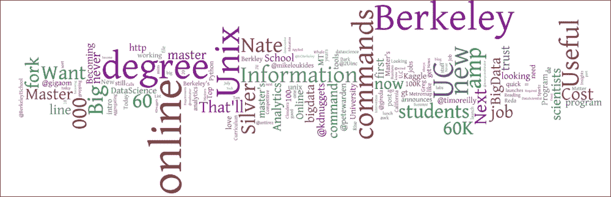
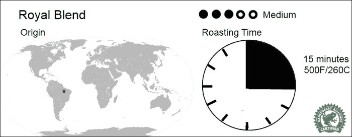

# 第一章：可视化数据

就在几年前，这本书还不可能完成。社交媒体、数据处理和网络技术的快速发展实现了一个不同领域的融合。从这个融合中，我们可以创造出关于奇异话题的数据迷人展示。数据中继承的美可以通过一种大众可以接触的方式暴露出来。如下面的词图可视化([`gigaom.com/2013/07/19/the-week-in-big-data-on-twitter-visualized/`](http://gigaom.com/2013/07/19/the-week-in-big-data-on-twitter-visualized/)), 可以在解锁隐藏信息的同时，用非凡的体验取悦用户：

这幅可视化中单词的大小给出了它们使用频率的线索。单词的位置是通过设计创造愉悦可视化的算法计算得出的。

在本章中，我们将探讨数据增长如此之大，以至于我们需要改变观察它的工具。

# 外面有很多数据

对任何人来说，人类记录的数据量以惊人的速度增长这一点都不应该感到惊讶。每隔几年，数据存储公司 EMC 就会发布一份关于保存了多少数据的报告([`www.emc.com/collateral/analyst-reports/idc-the-digital-universe-in-2020.pdf`](http://www.emc.com/collateral/analyst-reports/idc-the-digital-universe-in-2020.pdf))。2012 年，估计从 2005 年到 2020 年，全球存储的数据量将从 130 艾字节增长到 40,000 艾字节。这意味着地球上每个人的数据量为 5.2 太字节。这是一个令人震惊的信息量，了解其中有多少信息存在是困难的。到 2020 年，这相当于每个人 11 个 DVD 的容量。如果我们改用容量为 50GB 的蓝光盘，堆叠起来存储全部 40,000 艾字节的数据，仍然会超出月球轨道。

随着人们将更多的生活内容搬到线上，数据的增长是不可避免的。智能手机的普及使每个人都成为了摄影师。**Instagram**，一个流行的图片分享网站，每天收集大约 4000 万张照片。人们不禁想知道世界上真的需要多少张人们的餐食照片。在过去的几个月里，视频片段分享网站如 Vine 和 Instagram 的数量激增，产生了大量的数据。为了扩大智能手机在收集摄影数据方面的应用，正在创建大量的新设备。最新一代的智能手机除了常见的 GPS、陀螺仪、地磁和加速度传感器外，还包括温度、湿度和压力传感器。这些使得能够记录用户周围世界的准确表示。

传感器数量的增加并不仅仅局限于智能手机领域。传感器和无线电的价格已经达到一个临界点，使得创建能够记录并传输关于世界数据的独立设备变得经济可行。曾经有一段时间，构建一个能够向中心设备报告温度的传感器阵列，只是大型 SCADA 系统（监控和控制应用程序）的领域。我第一份工作之一就是在一个炼油厂测试一系列 IP 兼容的监控设备。当时，网络硬件本身的成本就高达数百万美元。而现在，同样的系统可以用几百美元就搭建起来。访问如 Kickstarter 或 Indiegogo 等众包网站，你会发现无数蓝牙或 Wi-Fi 功能的传感器设备。这些设备可能会帮你找到丢失的钥匙，告诉你给番茄浇水的时间。大量这样的设备存在，表明我们正进入一个自主设备报告世界的时代。一种物联网正在兴起。

与此同时，存储数据的每千兆字节的成本正在下降。更便宜的存储使得跟踪之前可能会被丢弃的数据变得经济可行。20 世纪 70 年代，英国广播公司（BBC）有一个政策，一旦电视节目达到一定年龄，就销毁其录像。这导致经典电视剧《神秘博士》（Doctor Who）超过一百集的丢失。20 世纪 60 年代存储介质的低数据密度意味着保留完整的档案是成本高昂的。现在这样的删除是不可想象的，因为存储视频的成本已经大幅下降。在亚马逊服务器上存储一 GB 信息的成本大约是一个月一角钱，如果内部有合适的专业知识，成本甚至可能更低。帕金森定律陈述如下：

> 工作会扩展以填满完成它所需的时间。

在这个定律的重新表述中，对我们来说，“数据量将增长到填满可用空间。”

数据的增长使我们的生活变得更加困难。虽然数据量一直在增长，但我们理解它们的能力大体上停滞不前。处理和精炼大量数据可用的工具并没有跟上步伐。对数 GB 数据运行简单的查询是一个耗时的过程。比如“列出所有包含单词'百事'的推文”这样的查询，除了并行工作的机器集群，实际上无法在任何其他设备上完成。即使结果返回，匹配记录的数量也太大了，无法由一个人甚至一个团队的人处理。

术语“大数据”通常用来描述越来越常见的非常大的数据集。像大多数已经成为市场营销术语的术语一样，大数据由不同的人和公司定义不同。在这本书中，我们认为大数据是指任何数量，在消费者级别的硬件上使用传统数据库工具运行简单查询因计算、存储或检索限制而变得困难。

理解大数据的世界是一个复杂的提议。以有意义的方式可视化数据将是未来十年面临的巨大问题之一。更重要的是，这个问题需要在传统上数据并不丰富的领域得到解决。

考虑一个咖啡店；这不是一个会产生大量数据的公司。然而，渴望数据的消费者开始要求知道他们最爱的咖啡豆来自哪里，烘焙了多久，以及是如何冲泡的。一个名为**ThisFish**的类似计划已经存在，允许消费者追踪他们海鲜的来源([`thisfish.info`](http://thisfish.info))一直追溯到捕获时。以一种易于访问的形式提供关于咖啡的数据成为咖啡店的卖点。下面的屏幕截图显示了一个咖啡店典型的标签，显示了豆子的来源、烘焙时间和有机认证：

人们对数据非常感兴趣，尤其是关于他们习惯的数据。但是，尽管人们对数据很感兴趣，没有人愿意浏览 Excel 文件。他们希望以一种易于访问和有趣的方式展示数据。

# 对数据感到兴奋

事实是数据很有趣！它令人惊叹地有趣，因为它讲述了一个故事。问题是，大多数时候这个故事都隐藏在一堆看似无趣的数字后面。提取关键数据并将其以有意义的方式展示给人们需要一些技巧。人类是视觉生物，相比于数字表格，他们更能轻易地处理图像。

最佳的数据可视化源于对可视化主题的激情。难道我们不是在工作中如果主题是我们真正感兴趣的事情时会做得更好吗？伟大的可视化不仅仅是教育他们的观众，它们还让用户感到愉悦。它们以一种新颖的方式呈现数据，仍然容易被观众理解。伟大的可视化剥离了多余的信息，揭示了一个信息核心。与此同时，伟大的可视化具有一定的美感。不要被误导，认为这种美感没有目的。在一个注意力持续时间越来越短的世界里，仍然有美丽的位置。当以审美上令人愉悦的可视化呈现时，我们仍然会停下来片刻。美丽所购买的额外几秒钟可能正是让人们感兴趣并吸收你的意思的时间。

即使是最无害的数据也有值得讲述的故事。对大多数人来说，税收收入统计数据似乎是最不有趣的。然而，在那大量数据中找到了一些非常吸引人的故事。数据讲述了一些公司避免支付税收的故事。它还讲述了哪些城市的人均收入最高的故事。在这些无聊的数据中，可以通过热情地应用数据可视化提取出无数有趣的的故事。

数据有很多种含义，但它永远不会无聊。你也可以对数据感到兴奋，并发现任何数据集中隐藏的故事。在每一个数据集中，都有一个有趣结论等待像你这样的数据侦探揭露。你应该以数据可视化的形式与他人分享你的兴奋。

## Excel 之外的数据

到目前为止，世界上最受欢迎的数据操作和可视化工具是微软的 Excel。Excel 已经存在了近三十年，在此期间，它已经发展成为企业进行数据分析事实上的工具。Excel 具备对数据进行排序和分组的能力，并能为结果信息创建图表。

正如我们之前所看到的，世界上的数据量是巨大的。大多数数据可视化的第一步通常是筛选和汇总数据，将其缩小到包含您想与用户分享的关键洞察的数据集。这听起来像是提取，意味着这是一个有观点的过程，这是因为它确实如此。呈现一个无偏见的可视化几乎是不可能的。不过，这也没关系。并不是每个人都精通您的数据，引导他人得出您的结论是有价值的。

你会发现，你从哪里获得的数据，从中提取可视化的数据几乎从来不是你直接可以使用的格式。你需要操纵数据，使其达到你可以使用的形式。如果你的源数据集足够小，你的操作足够简单，你也许可以在 Microsoft Excel 中进行预处理。Excel 提供了一系列用于排序、筛选和总结数据的工具。关于如何在 Excel 中处理数据以及如何创建图表的书籍和文章有很多，但我们在这里不会深入探讨。

Excel 的问题是它已经过时了。每个人都见过 Excel 出来的那些相当平淡的图表。除了一两个特例，这些图表和 Excel 95 产生的图表是一样的。数据的兴奋在哪里？似乎 missing 了。如果你完全在 Excel 中创建你的可视化，你的用户将错过你对数据的热爱。

瑞士军刀因其拥有十几种不同的功能而闻名。你可以用同样的工具打开一瓶葡萄酒，也可以用它去除马蹄上的石头（这在大多数地方都是一个更常见的用途）。当你制造一个多功能工具时，你最终会得到一个什么都不擅长的工具。仅仅看看微软 Excel 的帮助索引的长度就应该告诉你，Excel 稳稳地落在多功能工具的范畴里。你可以用 Excel 做会计，或者跟踪你跑 5 公里的速度；你甚至可以用那数据建立图表。但你能做的就是制作真正好的图表。为此，你需要一些有数据可视化更狭窄焦点的专用工具。

## 社交媒体数据

我们谈了很多关于可视化和数据，但这本书标题的另一个部分是关于社交媒体的。除非你一直住在没有互联网的山洞里，否则你对过去十年席卷全球的社交媒体浪潮至少会有一点了解。真的只是十年吗？Facebook 成立于 2004 年。虽然我们可以在 2004 年之前找到例子，但我认为 Facebook 是第一个进入大众意识的社交媒体网站。

定义一个网站究竟是什么使它成为一个社交媒体网站是困难的。网站上必须有一些社交互动的方面，以及用户之间某种形式的联系。为了避免将任何带有评论区的网站都称为社交媒体网站，该网站的主要目的是为了启用用户之间的互动。这些网站上的内容通常是用户生成的，而不是由网站所有者创建的。社交媒体网站使用户之间可以进行互动，有相似兴趣的用户可以交流。

### 我为什么要关心？

社会媒体在我们世界中扮演的角色不容小觑。即使你避免加入所有社交媒体网站，并认为社交媒体对你的生活没有影响，它实际上确实有。社交媒体在现实世界中的影响的很好例子就是新闻媒体对社会媒体的依赖程度。今年早些时候，美联社的推特账户被黑客攻击，发送了几条消息，暗示白宫遭到恐怖分子袭击。虽然这一消息很快被驳斥，但股市在消息传出后大幅下跌。如果这种欺诈行为没有被迅速发现，真实世界的后果可能会更糟。

社交媒体的数据为世界各地发生的事件提供了背景。只需查看 Twitter 上的趋势，就可以挑选出当天的重大新闻故事。随着报纸订阅量的下降，Twitter、Facebook 和其他网站上的人数增长。传统新闻机构已经开始在它们的故事中整合通过社交媒体的评论和分享功能。故事下的评论往往成为故事本身，而不仅仅是提供一个元故事。许多评论员指出，Twitter 在阿拉伯之春甚至在美 国抗议中的重要性。社交媒体正在迅速超越更传统的新闻来源，成为社会发展的驱动力。

社交媒体不仅限于人与人之间的互动。越来越多的企业使用社交媒体与客户建立联系。通常，从一家无脸的公司获得服务最好的方式是在他们的 Facebook 页面上发消息或给他们发推文。我确实有过这样的经历， tweet 关于一家公司或一项服务，然后他们的社交媒体人员会联系我。任何赋予公司开发更好客户关系权力的工具都可能拥有长久的生命力。

从可视化的角度来看，社交媒体是有趣数据的一个巨大来源。我想象不出有什么数据源比人与人之间的社交互动更有吸引力。人类进化成社交动物，所以我们天生对发生在我们的社交圈内的事情感兴趣。除了它们的网站，许多社交媒体网站还有 API，促进构建使用它们数据的应用程序。理论上是，如果它们能为它们有价值的数据启用一个生态系统，人们会更频繁地访问它们的网站，第三方应用程序甚至可能会吸引新用户。

社交媒体是大数据的定义。Facebook 有大约十亿用户，每个用户可能每天产生十几条数据。Twitter、LinkedIn 和 Facebook 在发现他们需要处理的数据量太大，超出了传统数据库的承载能力后，都创建了自己的数据库技术。幸运的是，很少需要处理社交媒体的全部数据。通过各种数据访问 API，可以访问更窄的数据集。关键是尽可能将筛选和聚合工作转移到社交媒体网站上。通过探索可用的信息，可以得出有趣的结论，并通过可视化手段揭示用户通常不易察觉的信息。

# HTML 可视化

这个拼图的最后一片是 HTML5。当我年轻的时候，HTML 的新版本意味着来自万维网联盟的另一个冗长的规格说明。HTML 新版本的规格过程需要数年时间，由来自微软和 IBM 等大型技术组织的成员组成的委员会来规划。虽然有一个 HTML5 的规格说明，但它没有以前版本那么正式。HTML5 这个术语已经用来描述可以用来创建强大网络应用程序的一系列面向未来的技术。

HTML5 包括以下多样化的功能的规格说明：

+   网络工作者（多线程 JavaScript）

+   触摸屏设备的触摸事件

+   微数据格式

+   画布

+   可缩放矢量图形

+   摄像头 API

+   地理定位 API

+   离线数据

通过这些新的 API 和功能，HTML5 不仅在浏览器上，而且在移动设备和桌面上都成为了一个重要的角色。通过像 PhoneGap([`phonegap.com/`](http://phonegap.com/))这样的工具包，HTML 和微软的 WinJS JavaScript 可以作为 iPhone、Android、Windows Phone 甚至黑莓手机的主要开发语言。原生 API 被绑定到 JavaScript 等效物上，使得 JavaScript 应用程序能够打开摄像头、GPS 和文件系统。HTML5 还可以用作 Windows 8 风格应用程序（以前称为 Metro）的开发平台。在非 Windows 平台上，可以使用类似于 Adobe Air([`www.adobe.com/products/air.html`](http://www.adobe.com/products/air.html))的工具包来用 HTML5 开发桌面应用程序。HTML5 提供了一个多平台开发环境，允许将 Web 技能带到平板电脑和桌面上。

离线数据工具消除了对 web 服务器来提供内容的依赖。直接在客户端机器上嵌入数据，而不是反复从服务器拉取，使得应用程序能够真正地移动化——网络变得不再至关重要。

HTML5 对可视化开发者来说非常有益。Canvas 和 SVG 都提供了诱人的功能。CSS3 也允许在样式上具有更大的灵活性。在 HTML5 出现之前，要在浏览器中实现交互式数据可视化，最好的方法是使用 Java Applets 或 Adobe Flash 等第三方工具。尽管这些技术的采用率很高，但仍然排除了一大批用户。即使采用率高，这些工具在野外的版本也往往是过时的。Java Applets 或 Adobe Flash 都不支持越来越受欢迎的移动平台。另一方面，HTML5 在大多数智能手机上以某种形式得到支持。

在 HTML 中开发可视化的最佳特性之一是，它允许用户与可视化互动。著名的可视化，如 *伦敦地铁地图*，因为画在静态的纸上而变得残废。交互提供了一个前所未有的用户参与度新层次。如果用户找到操纵可视化以得出全新结论的方法，你也不会感到惊讶。

业界对 HTML 和 JavaScript 技术的支持令人印象深刻。所有技术巨头都投入巨资开发基于 HTML5 和 JavaScript 的浏览器和发展工具。网页开发领域的变化速度令人惊叹。几乎每周我都会听说一个创新的新 JavaScript 库或一个新的开发平台。云托管的便捷性使得初创公司在网上蓬勃发展。

在选择一个用于开发可视化的工具时，HTML 是一个出色的选择。广泛的支持、良好的工具和众所周知的 API 确保了开发将是一种乐趣。好吧，也许不是乐趣，但至少相对无痛。HTML 和 JavaScript 是所有网页开发者的通用语言。无论开发是用 Ruby on Rails、ASP.NET 还是甚至是 Wordpress 作为后端，前端总是用 HTML 和 JavaScript 编写。这为选拔人才提供了一个大的人才库。

# 总结

向用户传达信息是一项棘手的工作。问题在于，现在可用的巨量数据使得这一问题变得更加复杂。作为一名可视化开发者，你的任务是从无关紧要的数据云中筛选出你感兴趣的部分，然后以一种有趣的方式将这些数据展示给用户。人们对数据感兴趣，但他们很少愿意花时间整理大量的表格数据。可视化通常是向用户展示这些数据的最佳工具。

社交媒体网站易于获取的高质量社交数据与新的可视化工具的结合，为我们创造有趣的可视化提供了前所未有的机会。通过能够超越标准微软 Excel 图表和表格的开发者们的热情，不仅有静态可视化的未来，还有交互式、有趣的可视化，这些可视化将在用户探索数据的 previously invisible aspects 时令他们感到愉悦。

在下一章中，我们将探讨一些使用现代网络开发工具创建可视化的方法。
