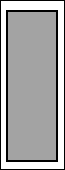

# 第二章：JavaScript 和 HTML5 用于可视化

在上一章中，我提到了 HTML5 的一些发展使可视化变得更容易。这一章将探讨其中的一些，具体如下：

+   画布（Canvas）

+   可扩展矢量图形（SVG）

如果您熟悉这两个工具的功能，您可能想跳过这一章节。

# 画布

Canvas 是 HTML5 的一个功能，在技术文章和演示中经常被提及。Canvas 所能实现的功能非常令人印象深刻，因此它频繁出现并不令人意外。Canvas 提供了一个低级的位图接口用于绘图。您可以把它想象成浏览器中的 Microsoft Paint。画布上生成的所有图像都是光栅图像，这意味着图像是由像素网格而不是几何对象集合构建的，这与矢量图像的情况不同。与画布上绘制的元素交互必须通过过滤器和全局转换；精确控制如果可能的话会遇到问题。

在您的页面上创建一个画布元素很简单。您只需要添加一个如下所示的 HTML 元素：

```js
<canvas width="200" height="200">Alternate text here</canvas>
```

### 提示

**下载示例代码**

您可以在 Packt 出版社网站上购买的图书的示例代码文件可以从您的账户[`www.packtpub.com`](http://www.packtpub.com)下载。如果您在其他地方购买了这本书，您可以访问[`www.packtpub.com/support`](http://www.packtpub.com/support)并注册，以便将文件直接通过电子邮件发送给您。

您还可以在这本书的所有代码示例中找到[`github.com/stimms/SocialDataVisualizations`](https://github.com/stimms/SocialDataVisualizations)。

这将创建一个 200 x 200 像素的方形画布。如果使用的浏览器不支持画布元素，将显示替代文本。幸运的是，您看到这个警告的情况相当罕见，因为画布得到了广泛支持。到 2013 年中，87% 的互联网用户可以使用画布。要获取最新的数字，请查看[`caniuse.com/#feat=canvas`](http://caniuse.com/#feat=canvas)。这个网站还提供了其他 HTML5 功能的浏览器支持信息。在 iOS、Android、BlackBerry 和 Windows Phone 上，移动浏览器也有支持。唯一不支持画布的常用浏览器是 Internet Explorer 的版本 prior to Version 9。

如果您处于目标受众广泛使用较旧的 Internet Explorer 版本的情况，不必过于担忧。有一个方便的 JavaScript **polyfill**；一段可下载的代码，为较旧的 Internet Explorer 版本提供画布功能。这个库可以在[`code.google.com/p/explorercanvas`](https://code.google.com/p/explorercanvas)找到。要使用它，可以使用条件包含，如下面的代码片段所示：

```js
<head>
<!--[if lt IE 9]><script src="img/excanvas.js"></script><![endif]-->
…
</head>
```

这只有在运行的浏览器是较旧的 Internet Explorer 版本时，才会包含 `excanvas.js`。

**Excanvas**并不完全支持画布，缺少阴影和 3D 等特性，但大部分功能都是可用的。使用 JavaScript 版本的画布也会有性能损失，所以，如果你使用动画，它们可能不会像现代浏览器上那样流畅。这是为了触及剩下的一小部分用户而付出的小小代价。随着浏览器的更新，这个问题会变得越来越不重要。

在画布上绘制简单形状是容易的，但也有能力绘制一些非常复杂的对象，包括绘制 3D。我们将限制讨论一些更简单的形状和函数，这些函数在创建可视化时会有用。

在我们开始绘制之前，我们介绍一下画布的坐标系统。坐标系统的原点位于左上角，向右下方增长。要在画布上绘制，如以下所示，使用 JavaScript：


绘制的第一步是获取一个画布实例的句柄，你想要在其中绘制。当然，你可以在页面上拥有尽可能多的画布元素。在这里，我们将创建一个 ID 为`demo`的画布：

```js
<canvas height="200" width="200" id="demo"></canvas>
```

我们现在可以使用标准的 JavaScript 方法选择该元素：

```js
var demoCanvas = document.getElementById("demo");
```

或者，如果你正在使用一个 CSS 选择器库，如 jQuery，你可以使用那个来选择元素：

```js
var demoCanvas = $("#demo")[0];
```

下一步是获取对绘制上下文本身的引用。上下文包含了一组用于绘制的函数，我们将用它进行所有的画布操作：

```js
var context = demoCanvas.getContext("2d");
```

画布支持多种基本形状，从中可以构建复杂的对象。最简单的形状就是矩形。可以通过调用`strokeRect()`函数来创建这个矩形：

```js
context.strokeRect(20, 30, 100, 50);
```

这将创建一个从坐标(20,30)开始的矩形，宽度为 100 像素，高度为 50 像素。实际上，这将绘制一个之前显示的矩形，但向右移动了 20 像素，向下移动了 30 像素。所以，这个方法的签名是给出矩形的 x，y 起始坐标，然后是宽度和高度。除了`strokeRect()`函数外，还有`fillRect`和`clearRect`。在画布上绘制时，可以画一个线条，画一个填充结构，或者清除一个区域的 content。

如果矩形不是你的风格，也许你会更感兴趣地画一个圆？画布实际上认为圆是弧的一个特殊情况。因此，要画一个半径为 50px 的圆，你需要指定的不仅仅是中心点和半径，还有起始角度和结束角度。这样一个圆的代码如下：

```js
context.arc(75, 75, 50, 0, 2*Math.PI);context.fill();
```

在这里，中心点被指定为(75, 75)，半径为 50。第四个术语是起始角度，我们给出为 0，而`2*Math.PI`是结束角度——整个圆周。一个可选的最终参数确定是否按逆时针方向绘制弧。它默认为`false`或`顺时针`。

警告最终参数会给出不同的弧，如下面的屏幕截图所示：


正如你所看到的，画布中使用的所有角度都是以弧度表示的。要将角度（以度为单位）转换为弧度，你可以乘以`Pi/180`。

对于更复杂的形状，画布支持直线或路径。要绘制一条线，你需要设置一个起始坐标，然后指定一个结束点，最后调用`stroke()`函数。画布会推断出在哪里绘制线条，如下面的代码片段所示：

```js
context.beginPath();
context.moveTo(0,0);
context.lineTo(50,120);
context.closePath();
context.stroke();
```

在这里我们开始一个新的路径；笔移动到(0, 0)，然后绘制到(50, 120)的直线，然后结束路径。开始和结束路径很重要，否则后续调用`stroke()`函数将从最后一个点继续绘制。你可以把它想象成使用一支笔；`beginPath`把笔放在纸上，`moveTo`暂时抬起笔移动，`lineTo`把笔移动到目的地并绘制线条，最后`closePath`把笔从纸上拿起来。不拿起笔，下次你绘制到某个地方的线条时，笔已经在纸上了，你会得到多余的一条线。

如果你认为绘制线条的语法有些复杂，你并不孤单。多次调用使你可以构建具有多个段的更复杂线条。通过使用循环，我们可以构建相对复杂的形状，如下面的代码片段所示：

```js
var width = 200;
var height = 200;
context.moveTo(0, 0);
for(i = 0; i> 100; I += 4)
{
   context.lineTo(i, height-i);
   context.lineTo(width - 1-i, height - 1 -i);
   context.lineTo(width - 2-i, i+2);
   context.lineTo(i+3, i+3);
}
context.stroke();

```

这段代码将生成一个螺旋。循环的每次迭代，我们向图像中心移动 4 个像素，每个边缘一个像素。结果如下面的屏幕截图所示：


画布在调用之间保持状态，所以，如果你使用`context.fillStyle`设置填充颜色，所有后续的填充形状都将采用相同的填充样式。正如你所想象的，这在使用画布构建可视化时是一个常见的 bug 来源。特别是在调用操作画布的函数时，这个问题尤为严重。

幸运的是，有一个简单的解决方案：上下文状态可以在进入和退出函数时保存和恢复。保持你的函数不干扰全局状态是一种礼貌，这肯定会减少 bug 的数量：

```js
function fillCircle(context, x, y, radius){
   context.save();
   context.fillStyle = "orange";
   context.beginPath();
   context.arc(x, y, radius, 0, 2* Math.PI);
   context.fill();
   context.restore();
}
```

在函数的第一行，当前的绘图上下文被推入一个堆栈，然后在函数的最后一行恢复。通过这样做，我们可以在方法内部对上下文进行尽可能多的更改，并确信调用者的上下文不会被破坏。

Canvas 支持完整的颜色调色板，还允许透明度和甚至渐变。到目前为止，示例中使用的是颜色名称。这些名称可以追溯到 1990 年代中期，实际上源自 X11 窗口系统。然而，还有两种其他方法可以为 canvas 指定颜色。第一种是使用十六进制字符串，指定红色、绿色和蓝色的两个十六进制数字值。值越大，该颜色的强度越高，如下面的图所示：


最后一种，也是我更喜欢的，是使用十进制 RGB 值，如下面的图所示，我认为这要清晰得多，而且编程时也更容易构建：


在十进制格式上有一个轻微的变体，即使用 `rgba` 函数而不是 `rgb`。这增加了一个额外的参数，这是一个介于 0 和 1 之间的十进制数，表示不透明度。1 表示完全不透明，0 表示完全透明。

由于 canvas 是一个基于栅格的绘图系统，因此可以在其中包含大多数其他栅格文件。栅格文件格式包括 JPEG、PNG、GIF 和 BMP。能够导入现有图像对于可视化来说是一个非常方便的工具。

然而，在 canvas 上使用图像有一些注意事项。当你包含一个图像时，你不能直接从 URL 加载它。首先，需要创建一个 JavaScript Image 对象，并将该图像的来源设置为 URL。这个 Image 对象然后可以用于画布上：

```js
Var image = new Image();
image.src = "logo.png";
```

从其他域请求图像可能会有点棘手。为了保持浏览器在请求数据时的安全性，其他域受到限制。对于图像，可以通过设置图像的 `crossOrigin` 属性来请求托管域的使用权限：

```js
Var image = new Image();
image.crossOrigin = "anonymous";
image.src = "http://codinghorror.typepad.com/.a/6a0120a85dcdae970b0128776ff992970c-pi";
```

在这里，`crossOrigin` 策略的值被设置为 `anonymous`。这意味着浏览器不会将任何身份验证信息传递给托管图像的服务器。如果您确实希望传递身份验证信息，也可以设置一个值为 user-credentials。对图像的支持相对较新，所以您最好将图像托管在与 canvas 相同的域上。

因为加载图像可能需要一些时间，所以不建议在 image 对象的 `src` 上设置值，并立即尝试在画布上绘制它。相反，你应该连接到图像的 `onload` 事件：

```js
function drawImage()
{
   var img = new Image();
   img.src = 'worksonmymachine.png';
   img.onload = function(){
      var context = document.getElementById('example').getContext('2d');
      context.drawImage(img, 0, 0);
   }
}
```

使用 `onload` 函数可以防止将空图像渲染到 canvas 上。如果您正在加载多个图像，它们被加载的顺序是不确定的。您可能希望检查所有图像是否已加载再继续。复杂的依赖链可以使用 jQuery 的 `Deferred` 功能进行管理。`drawImage` 的第二和第三个参数，不出所料，是指定绘制图像坐标的。`drawImage` 还有更高级的版本，允许在将图像绘制到画布之前对图像进行缩放和裁剪。

我们最后要看的画布特性是转换。当组合更复杂的场景或可视化时，通常更容易以不同的比例、位置或方向构建对象。转换提供了一种改变画布上绘制形状的机制。

在这个上下文中的函数，即缩放函数，将把每个坐标乘以 x 或 y 的缩放因子。画布为独立缩放 x 和 y 值提供了支持。这意味着很容易只在一个方向上拉伸形状：

```js
var colours = ["rgba(255,0,0,.5)", "rgba(0,255,0,.5)", "rgba(0,0,255,.5)"];
for(var i = 0; i< 3; i++)
{
    context.fillStyle = colours[i];
    context.scale(i+1,i+1);
    context.fillRect(10, 10, 50, 50);
}
```

前面的代码，仅仅绘制了一系列三个矩形，将产生如下屏幕截图所示的输出：


你会注意到我们的缩放不仅仅是生成了更大的图像，它还放大了矩形的坐标。另外要注意的是，尺寸的增加似乎并不是均匀的。这是因为画布是状态 ful 的。如果你在系列中应用了几个缩放函数而没有重置缩放，每个都会建立在前一个缩放的基础上。你可以跟踪你的转换并应用一个逆转换函数。例如，如果你按 2 倍缩放，你可以按 2 的乘法逆，即 1/2，来回到原始缩放。更可能的是，保存上下文并使用我们之前提到的`save`和`restore`函数恢复它要容易些。

如果我们修改我们的函数，你可以看到结果图像非常不同，如下面的屏幕截图所示：


经常在应用缩放转换时，你会想应用一个平移转换来将起始坐标移动到你期望的位置。你可以通过使用平移转换来实现：

```js
var x = y =10;
var width = height = 100;
for(var i = 2; i><= 0; i--)
{
   var scalingFactor = i+1;
   context.save();
   context.fillStyle = colours[i];
   context.translate(x * -i, y *-i);
   context.scale(scalingFactor, scalingFactor);
   context.fillRect(x, y, width, height);
   context.restore();
}

```

在突出显示的行上，我们将画布向右移动，使其好像矩形在原点处绘制。转换应用的顺序很重要，如下面的屏幕截图所示：


在左侧，你可以看到我们代码的输出，在右侧，交换`translate`和`scale`操作的结果。

画布还有很多其他很棒的特性。一一介绍实在太多，对于这么长的书来说；这很可能是一本自己的书。

# 可缩放矢量图形

可缩放矢量图形，或者如人们更常见的称呼，SVG，是 HTML 中相对较新的特性。它们执行的角色与画布类似，但不同之处在于它们是基于矢量而非位图的。这意味着每个图像都由一系列基本形状组成。这听起来可能有点像画布，毕竟，我们是用基本形状创建了所有的画布图像。不同的是，在 SVG 中，基本形状在绘制后仍然是独立的对象。而在画布上，创建图像的源命令在渲染后就会丢失。关于像素源的信息在画布命令的混乱中丢失。

方便的是，SVG 作为 XML 文件存储。虽然我通常连保险箱的组合锁都不会考虑存储，但这种难以访问的文件格式与 HTML 结合得很好。位图图像通常与 HTML 在单独的文件中链接。SVG 可以直接嵌入到 HTML 文档中。这种技术可以减少在用户代理上渲染页面所需的服务器请求次数。然而，真正的优势在于它允许 SVG 集成到 HTML **文档对象模型**（**DOM**）中，让你可以使用与操作任何其他元素相同的技巧来操作 SVG。

一个简单 SVG 的源代码可能如下所示：

```js
<svg  version="1.1">
  <rect width="50" height="150" x="20" y="20" stroke="black"stroke-width="2" fill="#a3a3a3" />
</svg>
```

你可以将这复制到任何 HTML 文档中，你会得到一个如下截图所示的简单矩形：



代码相当容易理解，其语法对于任何构建过网站的人来说都应该很熟悉。我们首先打开一个新的 SVG 元素。由于没有显式的尺寸信息，SVG 会填满其容器。在 SVG 内部，我们创建了一个宽度为 50px、高度为 150px 的新矩形。矩形的轮廓是黑色的，宽度为 2px，而内部则填充了灰色。

你可以用来构建图像的基本元素应该对你来说现在有些熟悉，既然你已经看到了画布的实际应用。`rect`和`path`从画布继承而来，没有发生变化。然而，SVG 在处理圆形方面有所不同，它提供了实际的`<circle>`标签，以及用于具有两个焦点的圆形形状的`<elipse>`标签。`<polygon>`和`<polyline>`标签用于绘制具有自由直边的形状，其中多边形是填充形状，而多段线只是一条线。如果你想要更弯曲的形状，SVG 提供了一个`path`元素，允许定义复杂的曲线和弧。手工构建曲线路径非常棘手。通常，对于曲线路径，你会想使用一个编辑器或 SVG 库。最后，SVG 支持使用恰当地命名为`<text>`的元素编写文本。

在 SVG 中构建多个元素就像向 SVG 中添加另一个子元素一样简单，如下面的代码片段所示：

```js
>svg  version="1.1"<
  >rect width="50" height="150" x="20" y="20" stroke="black" stroke-width="2" fill="#a3a3a3" /<
  >rect width="50" height="120" x="75" y="50" stroke="black" stroke-width="2" fill="#a3a3a3"/<
  >rect width="50" height="90" x="130" y="80" stroke="black" stroke-width="2" fill="#a3a3a3"/<
  >rect width="50" height="60" x="185" y="110" stroke="black" stroke-width="2" fill="#a3a3a3"/<
>/svg<

```

这会导致图像看起来像下面这样：


正如你所看到的，代码相当重复。在每一个矩形上，我们都指定了`stroke`和`fill`信息。这种重复可以通过两种方式消除。第一种是使用一组元素来定义样式信息。SVG 提供了一个通用的分组容器，由`<g>`标签表示。样式信息可以应用于该容器，而不是个别元素：

```js
>g stroke="black" stroke-width="2" fill="#a3a3a3"<
  >rect width="50" height="150" x="20" y="20"  /<
  >rect width="50" height="120" x="75" y="50" /<
  >rect width="50" height="90" x="130" y="80" /<
  >rect width="50" height="60" x="185" y="110" /<
>/g<
```

一个替代方法是使用 CSS 为你完成样式设计：

```js
>style<
  rect {
    fill: #f3f3f3;
    stroke: black; 
    stroke-width: 2;
  }
>/style<
>svg  version="1.1" id="graph1"<
  >rect width="50" height="150" x="20" y="20" /<
  >rect width="50" height="120" x="75" y="50" /<
  >rect width="50" height="90" x="130" y="80" /<
  >rect width="50" height="60" x="185" y="110" /<
>/svg<
```

在前面的代码中，样式信息直接附加到所有类型为`rect`的元素上。通常，你希望避免使用像这样的广泛选择器，因为它们将应用于页面上的所有 SVG 元素。最好通过使它们仅适用于那个一个 SVG，或者更佳，通过为希望样式的 SVG 元素分配一个类来缩小选择器。通常，建议使用 CSS 样式化你的元素，即使它们是 SVG 的一部分。你的 SVG 很可能包含多个你不想采用相同样式的矩形。

在 CSS 中使用的样式属性（`fill,` `stroke`等）与 SVG 标记中使用的并无不同。还有更先进的 CSS 选择器可用，如`nth-child`，它仅选择匹配特定模式的子元素。考虑以下代码片段：

```js
rect:nth-child(even)
{
   fill:#878787;
}
```

在我们的示例中添加前面的代码将非常简单地创建我们图形的斑马条纹效果，如下面的屏幕截图所示：


我们甚至可以更花哨地使用 CSS 通过在 CSS 中指定`:hover`伪选择器并改变光标下的颜色来为我们的图形添加一些交互：

```js
rect:hover
{
   fill: rbg(87,152,176);
}
```

下面的屏幕截图展示了结果图形：


当然，将 SVG 作为 DOM 的一部分打开了除了样式以外的其他门。还可以使用 JavaScript 操作 SVG 的元素。你甚至可以为 SVG 元素分配事件监听器。

通过使用出色的 jQuery 库，我们可以轻松地为到目前为止我们构建的图 SVG 中的节点添加事件监听器：

```js
$("rect").click(function(){
    alert($(this).attr("height"));
});
```

如果你以前从未见过 jQuery，那么在这里发生的事情是，我们选择了页面上的所有`rect`元素，当点击事件触发时，它会打开一个带有我们点击的列的高度的警告框。

在这本书中，我们将广泛使用 jQuery 库和这种基于 lambda 的编程风格。如果你不熟悉 jQuery，建议暂时停下来阅读一些教程，比如[`try.jquery.com/`](http://try.jquery.com/)。

我们已经涵盖了 SVG 的所有基本功能，但我想提一下的一个高级功能是：滤镜。**滤镜**是可以应用于 SVG 元素的转换。这些滤镜超越了我们在画布上看到的缩放和平移转换，尽管`scale`和`translate`在 SVG 中都是支持的。大约有 20 种这样的滤镜，每一种都执行不同的转换。我们不可能一个个深入讲解，但我们会看其中几个。

可视化中最常见的需求之一就是给物体赋予立体感。完美的 3D 效果可能很难实现，但我们可以通过使用阴影来欺骗眼睛。这些阴影可以通过三种不同滤镜的组合来创建：偏移、高斯模糊和混合。

要使用滤镜，我们首先需要定义它。`filter`元素可以定义为一系列依次应用的滤镜。为了弄清楚给阴影需要哪些滤镜，我们可以从阴影的属性反向工作。首先要注意到的是，阴影是从 casting 它们的东西上偏离的。为此，我们可以使用一个偏移滤镜，使元素向一个方向或另一个方向移动。你要将元素移动到哪里取决于你的光源位置。为了我们的目的，假设光源在 SVG 的上方和左侧。这将使阴影向下和向右投射：

```js
>defs<
    >filter id="shadowFilter" width="175%" height="175%"<
     >feOffset result="offsetImage" in="SourceAlpha" dx="5" dy="5"/<
    >/filter<
>/defs<
```

在滤镜属性行中，我们需要为被过滤的元素指定一个高度，这个高度要大于原高度。如果不这样做，我们的阴影会在超出源对象边界时被大量剪切掉。在这里，我们给滤镜指定了一个 ID，以便以后容易应用。你还会注意到，我们为`feOffset`指定了`in`和`out`属性。这允许我们将滤镜串联起来。在我们的案例中，我们使用`SourceAlpha`，这只是原图的 alpha，或者说是原图的`透明度`属性。

让我们将这个滤镜应用到我们图表中的一个元素上，看看它会发生什么变化。我已经移除了其他样式，以免混淆。滤镜通过使用`filter`属性并给出先前创建的滤镜的 ID 来应用：

```js
<rect width="50" height="60" x="185" y="110" filter="url(#shadowFilter)"/>
```

以下将是结果：


阴影也比原图更模糊。这可以通过使用高斯模糊滤镜来实现：

```js
<feGaussianBlur result="blurredOffset" in="offsetImage" stdDeviation="8" />
```

高斯滤镜会根据正态分布函数在图像内部随机移动点。你可能想尝试不同的模糊效果，我发现在 8-12 范围内的标准差对于阴影来说很不错：

```js
<feBlend in="SourceGraphic" in2="blurOut" mode="normal" />
```

最后，我们想要创建的模糊黑色盒子与原图结合：

```js
<feBlend in="SourceGraphic" in2="blurredOffset" mode="normal" />
```

在悬停时应用这个滤镜可以产生非常逼真的弹出效果，如图所示：


SVG 提供了通过你已经熟悉的 CSS 样式工具轻松操作图像部分的方法。同时，能够为图像附加事件允许创建令人印象深刻用户交互。

## 用哪个？

决定是使用画布还是 SVG 可能是一个难题。这主要取决于哪一个更让人感到舒适。有计算机图形或动画背景的人可能会更满意画布，因为画布的`redraw`循环会更熟悉。画布更适合重新绘制整个场景，甚至如果你计划使用 3D 元素。如果你的可视化利用了纹理或渲染的图像，画布能够直接将它们绘制到画布上，这几乎肯定会是有优势的。对于那些对保持快速帧率有依赖的可视化，画布通常表现良好。

另一方面，SVG 可以使用得更简单。SVG 中的每个元素都可以单独操作，这使得小动画变得容易得多。与 DOM 的集成允许在与 SVG 的单个元素交互时触发事件。在画布上实现这一点，你必须手动跟踪在该位置正在绘制的内容。SVG 也可以使用 CSS 进行样式设计，这使得组件更容易在具有不同主题的网站上重复使用。

为了本书的目的，我们将关注 SVG。SVG 的分辨率独立性，加上易用性和出色的支持库，使其成为一个合理的选择。我不相信有任何可视化是我们不能用画布创造的，但努力要大得多。尤其是对于交互式可视化来说，更是如此。

# 总结

你现在应该能够做出明智的决定，在 SVG 和画布之间构建简单的静态图像。在下一章，我们将暂时离开视觉方面，谈谈 OAuth 协议，该协议被许多社交媒体网站用来保护他们的数据。
