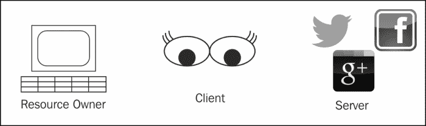
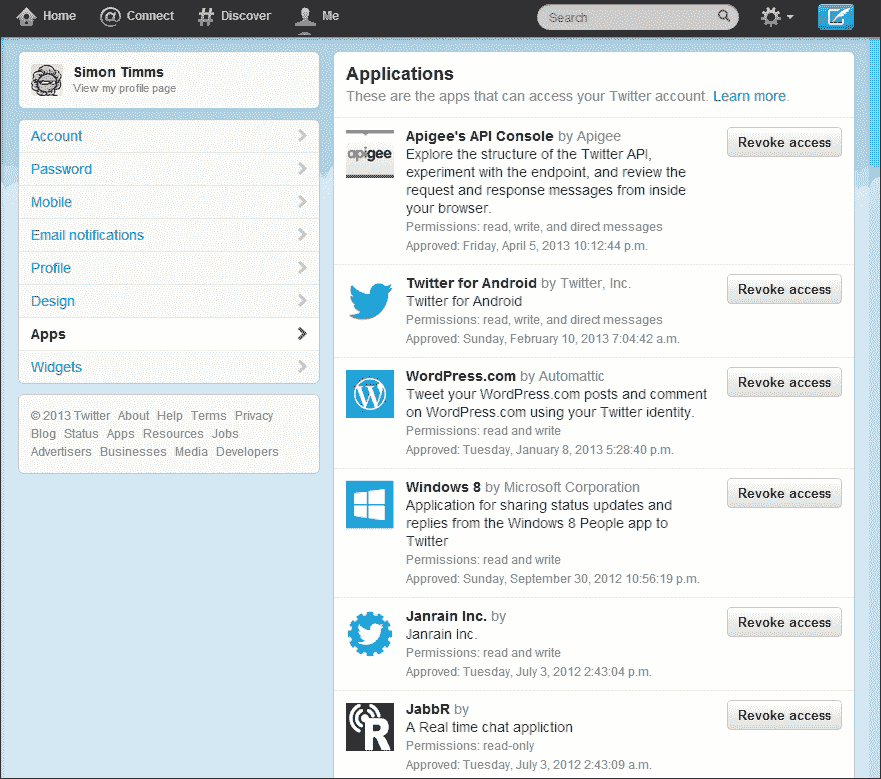
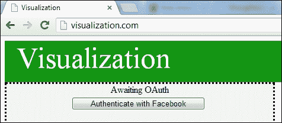
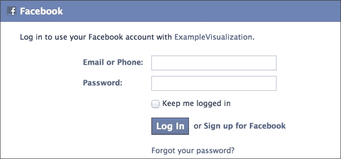
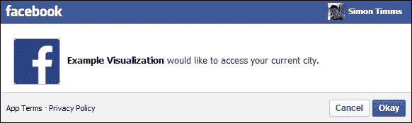
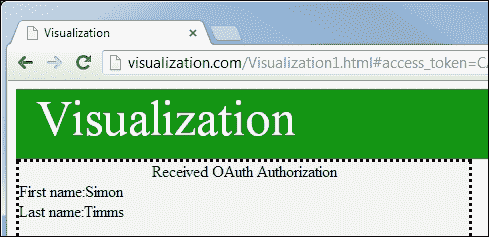
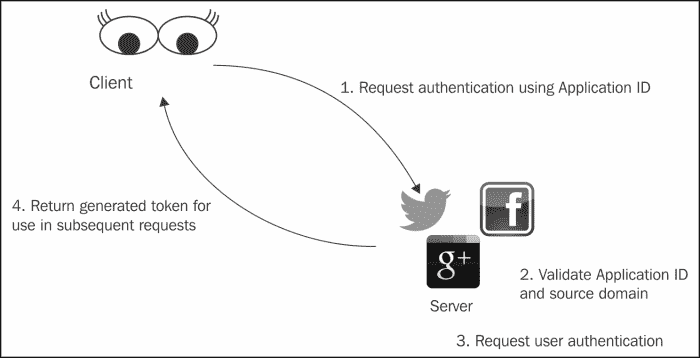

# 第三章：OAuth

创建可视化只是战斗的一半；另一半是获取高质量的数据来驱动可视化。你可能希望利用许多潜在的数据来源。几乎每个国家都有一个负责收集和分析经济和社会统计的国家统计组织。在过去的几年里，许多政府开始采用开放数据计划。许多企业也以提供可用数据为中心；想想各个股票交易所提供的数据量。你可能甚至可以访问公司内部数据来推动你的可视化，或者你的可视化可能是更大应用程序的一部分，该应用程序将为你提供数据。

另一个来源，也是本书关注的来源，是社交媒体。社交媒体网站为其用户提供大量数据。绝大多数社交媒体网站提供 API 以编程方式访问数据。通常，这些数据是为你的用户账户定制的。例如，Twitter 根据你关注的用户过滤你看到的推文，Facebook similarly shows you updates from your friends. 有些数据是受限的，只有特定的人群可以看到它。你可能不希望全世界都看到你的 Facebook 更新，所以你设置了权限，只允许朋友看到它。为了定制数据，大多数社交网络网站要求对其 API 进行身份验证和授权。

通常，你想展示给用户的数据与他们自己的社交媒体账户有关。在大多数情况下，你的可视化不会托管在与你要使用的数据相同的系统上，如下面的图所示。更重要的是，你的可视化的消费者，即最终用户，可能还在另一个系统上：


这意味着需要有一种方法将从社交媒体网站获取社交媒体数据，然后发送给最终用户。从表面上看，似乎有以下两个选项：

+   要求用户提供他们的社交媒体密码，并使用该密码进行身份验证，并向社交媒体 API 检查认证。

+   要求用户获取用于可视化的数据，并将这些数据发送到你的可视化系统中。

这两个选项都不是特别理想。用户可能不愿意将密码告诉别人，尤其是像他们的社交网站这样重要的事情。你也不太想掌握他们的密码，因为这会给你带来额外的安全问题。大多数用户技术水平不足，无法从他们的社交网站提取所需数据并发送到你的应用程序。即使那些有技术技能的人也不会对这涉及的工作量印象深刻。当然，可以建立和优化标准导出机制，以使用户更容易操作，但在我们开发这个系统之前，也许还有第三种方法？

这个技巧似乎在于找到一种方法，从终端用户那里获取凭证信息，而不必向中介可视化网站透露太多细节。正如许多计算机问题一样，可能需要在计算世界之外找到一个平行的问题和解决方案。

许多电子车库门开启器和家庭安全系统提供访客代码。这些代码可能有一定的限制，比如只在工作日的某些时间或者一定次数内有效。这些账户的目的是为了提供有限访问你家中的权限，比如清洁工或工匠。一种类似的概念据称存在于高端汽车中：一种行李箱钥匙使汽车 operate in a restricted mode。可以使用类似的机制，向你可视化应用授予访问社交网站受限部分的权限。

OAuth 协议提供了一种机制，通过这种机制，应用程序可以在不知道你的密码的情况下，使用你的社交媒体数据和功能进行身份验证。

在本章中，我们将从高层次上了解 OAuth 是如何工作的，然后尝试使用我们现有的凭证对几个社交网络进行身份验证。

# 认证与授权

经常有人对认证和授权的概念感到困惑。**认证**是确保某人是他们所说的本人的行为，而**授权**是确保该人员有执行某动作的权利。这两个概念是相关的，并且经常是同一个步骤的一部分。OAuth 打破了两者之间的关系。尽管通常有一个认证步骤，需要登录到服务器，但认证的方式并没有规定。如果用户已经登录到服务器网站，授权步骤可能对用户是透明的。服务器可以使用任何方法进行认证。这为允许多因素认证甚至额外的认证委托打开了大门。例如，您的可视化可能需要从使用 OpenID 进行认证的 Stack Overflow 获取信息。因此，当用户请求访问 Stack Overflow 数据时，用户可能实际上需要使用他们的 Google 账户登录，该账户会将认证细节传递给 Stack Overflow，Stack Overflow 再将授权凭据传递给您的可视化。

在获取用于可视化的数据时，记住认证与授权之间的区别是很重要的。

# OAuth 协议

在 OAuth 的引入和广泛更新之前，每个你需要与之交互的服务都提供了自己的授权协议。这些方法有很大的不同。每次你想利用一个新的 API 时，都必须学习并实现一个新的授权方案。这使得与大量服务的交互变得非常困难。

OAuth 的创建是为了解决与不同站点围绕授权缺乏标准化的问题。1.0 版本的创建花了大约两年时间，由多家主要行业参与者和一些较小感兴趣的方贡献而成。

## OAuth 版本

目前 OAuth 在野生的两个主要版本：1.0a 和 2.0。版本 1.0a 是对 1.0 规范的安全更新，它修正了会话固定攻击。2.0 规范与 1.0a 有显著的不同，不幸的是，野生的服务中仍然混合使用了不同的协议。关于 2.0 规范的安全性存在一些政治辩论，这导致一些公司仍然停留在 1.0a 版本。最大的区别是 OAuth 1.0 旨在通过未加密的连接使用。当 OAuth 1.0 被创建时，SSL 证书对许多小提供商来说是非常昂贵的。因此，指定了一系列复杂的签名请求，即使是不安全的连接也可以表现得像安全的连接一样。

现在 SSL 证书已经变得便宜，硬件也足够快，以至于即使是最小的初创公司也负担得起 SSL 证书。因此，OAuth 2.0 版本依赖于 SSL 为其提供大部分安全性。在未加密的链接上使用 OAuth 2.0 是不安全的。对我们来说，我们可以 largely 忽略 OAuth 版本之间的其他差异。然而，你应该意识到，你为一家社交网站编写的授权和身份验证工具可能不会在其他的网站上工作。由于实现差异，你的授权方法甚至可能不会在两个完全支持 OAuth 2.0 的不同网站上工作。

OAuth 为我们在本章中看到的玩家定义了一些不同的名称，让我们使用这些术语。前一个图的更新视图如下：



**资源所有者**是拥有数据的人。例如，你在 Facebook 上的更新“属于”你。**客户端**是请求访问数据的网站，**服务器**拥有资源所有者的数据和凭证信息。拥有的数据通常被称为**受保护的资源**，因为这是 OAuth 层所保护的。为了清晰起见，我保留了之前的位置中的图标，但客户端不必是可视化，服务器也不必是社交网站。

你可能已经使用了 OAuth 协议，即使你不知道它。如果你曾经授予一个应用程序使用你的 Twitter 账户的权限，你就使用了 OAuth。官方的 Twitter 应用程序，如**TweetDeck**，使用 OAuth 进行授权。每个应用程序请求从 Twitter 获取特定功能。如果你是 Twitter 用户，你可以在**设置**面板中查看你已经授权使用你的 Twitter 账户的应用程序。每一个这样的应用程序都被授权以你的身份与 Twitter 互动，如下面的截图所示：



在之前的截图中，你会注意到每个应用程序旁边都有一个按钮，允许撤销该应用程序的访问权限。这是 OAuth 的一大优点——应用程序永远不会知道你的密码，因此你可以移除它们代表你行动的能力，而无需更改你的密码。如果你确实希望更改你的 Twitter 密码，你只需要通过 Twitter 更改，而不需要更改所有你已经授权代表你行动的服务。

如果 Twitter 意识到，比如说[www.wordpress.com](http://www.wordpress.com)已经被攻陷，他们可以一次性为所有用户撤销该应用程序的访问权限。保管凭证是一个困难的问题，并不是许多开发者愿意承担的问题。如果凭证可以被像 Twitter 这样的可靠公司保留，那么这就移除了一个常见的失败点。

让我们更深入地了解一下 OAuth 实际是如何工作的。为了理解正在发生的事情，走一遍示例是有用的。在这个示例中，我们的可视化将使用其 Graph API 从 Facebook 请求一些信息。**Graph** API 是 Facebook 提供给开发者的接口，用于访问社交图谱，这其实只是一个关于用户的属性集合。Facebook 是一个 OAuth 2.0 网站，所以这个示例将使用 OAuth 2.0 描述的工作流程。

我们的可视化希望访问 Facebook 的信息。我们第一次加载可视化时，会看到一个屏幕，用户可以通过点击按钮来获取 Facebook 的信息，如下面的屏幕截图所示：



当我们第一次设置可视化网站时，我们将从 Facebook 请求一个认证令牌。这个令牌是 Facebook 唯一授权给我们的网站的。在向 Facebook 注册应用程序的过程中，我们将输入一个域名，该域名可以用来使用令牌。这为防止其他人使用我们的令牌提供了一定的安全性。服务器可能执行广泛的检查，以验证应用程序是否有权访问其保护的数据。

我们的网站将向 Facebook OAuth 端点生成一个请求，该请求将包括生成的令牌。一个典型的 URL 可能如下所示：

```js
https://www.facebook.com/dialog/oauth?client_id= 591498037422486&redirect_uri=http://visualization.com/&response_type=token
```

### 小贴士

关于如何通过 Facebook 认证的更详细示例可以在第七章*Facebook*中找到。

可视化现在直接重定向到 Facebook 登录页面，该页面会要求你输入登录信息，如下面的屏幕截图所示：



一旦你输入了相关信息并通过 Facebook 正确认证，你将被重定向到你 在`redirect_uri`参数中指定的页面。这通常会是你的原始页面。URL 后面将附加一个由 Facebook 生成的非常长的令牌，用于与他们的 API 进行后续通信：

```js
http://localhost:8080/Visualization1.html#access_d8Ava9mMBALMG0FQp22SEn5La7mtC27evICrZB5ToVHdJRZC2FYdFmnIsveVKhcikSeVZAEAZAHBliKEeGvrKHnb5FnU5VoCooy49FIoJuzca3oHeYuNUZAatdgjUEr2tDzZBB8CJGmPkHdmNe3RyS1l9XAcTKwGGVAy6FB0gZDZD&expires_in=6667
```

根据你的可视化请求的权限，Facebook 可能会提示你明确地为可视化授予这些权限。向应用程序授予权限是 OAuth 的核心功能。Facebook 有大约 50 种不同的权限，你的应用程序可以请求。这包括以下内容：

+   `email`

+   `user_likes`

+   `user_location`

授予应用程序访问你 Facebook 信息的提示如下面的屏幕截图所示：



在这个示例中，**示例可视化**请求访问我的位置，该位置受到`user_location`权限的保护。在 Facebook 的情况下，授予的权限被编码在要使用的令牌中，但这在 OAuth 协议中并没有明确说明。

一旦分配了权限，Facebook 会将用户重定向回你的`redirect_uri,`，让你利用令牌查询 Facebook API，如下面的屏幕截图所示：



对于某些 OAuth 网站，在此阶段建议执行额外的调用，以确保返回的令牌与当前应用程序匹配。通过发送我们应用程序的 ID 和认证步骤返回的令牌，我们可以获得一些用于确认登录是否被劫持的验证详细信息。并非每个网站都需要这一步；这只是 Facebook 建议增加的一个安全措施。有了凭据，我们可以调用 Graph API。在此例中，可视化非常简单地向获取认证用户的姓和名的请求。您可以在第七章 *Facebook* 中看到请求是如何构成的。

就这样！所以 OAuth 将授权和认证步骤委托给第三方，无需复杂工具。OAuth 只使用正常的 HTTP 和 SSL。OAuth 的工作流程在以下图中几乎完全表示出来：



OAuth 的各种方言和要求可能难以理解。找到与不同网站正确认证的令牌的正确组合几乎和 OAuth 之前的混乱技术一样困难。OAuth 以其难以理解和不一致而闻名。这可以归因于 OAuth 标准并非像 HTTP 那样的标准。通过 HTTP，如果你遵守标准，你可以确信你的服务能够与其他所有服务进行交互。OAuth 不提供那种级别的互动保证。

如果您要使用很多不同的数据源，也许您正在创建一个 mashup，那么建议您使用第三方服务与 OAuth 服务器通信。即使您只使用一个数据源，您可能也不希望将 OAuth 的复杂性引入您的开发过程。DailyCred 和 OAuth.io 等公司提供了一个服务，消除了处理 OAuth 的困难。他们通过一致的 API 允许与多个不同的 OAuth 提供者进行认证。适应各种 OAuth API 的艰苦工作由他们完成，让您能够专注于构建可视化。

使用 OAuth.io 对 Facebook 进行认证只需运行以下几行代码那么简单。

```js
OAuth.initialize('<Your Public key>');
OAuth.redirect('facebook', "callback/url");
```

本章中使用的示例可视化代码接近 70 行。

当然，这些服务具有一定的货币成本，并且还提供了一个额外的失败点。和所有事情一样，要确保选择一个适合 OAuth 的好解决方案。

# 摘要

虽然并非每个社交媒体网站都使用 OAuth，但了解 OAuth 的工作原理以及如何用它来简化 API 使用，很可能会提升你在开发可视化过程中的体验。你现在应该能够解释 OAuth 是如何工作的。在下一章，我们将探讨可视化的库。
