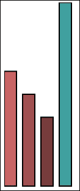
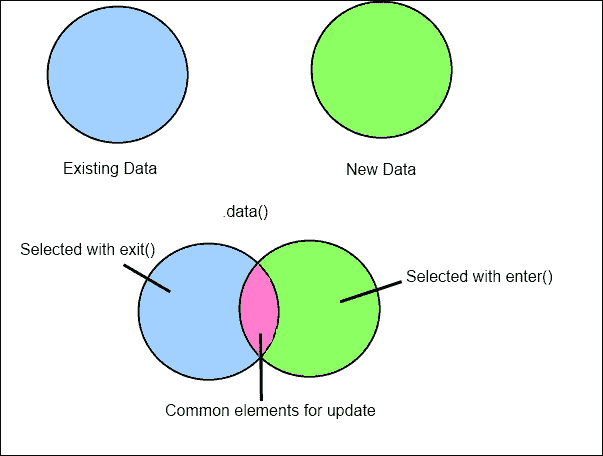
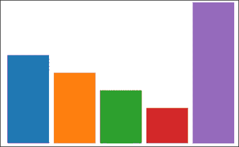
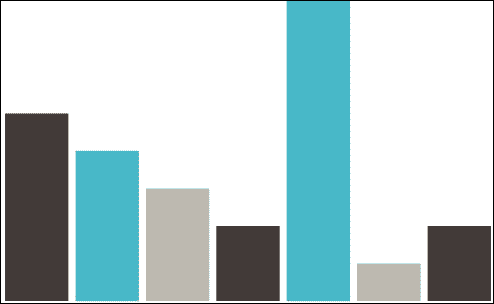
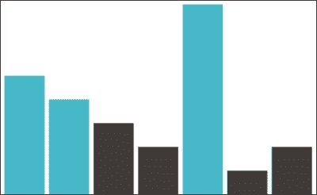
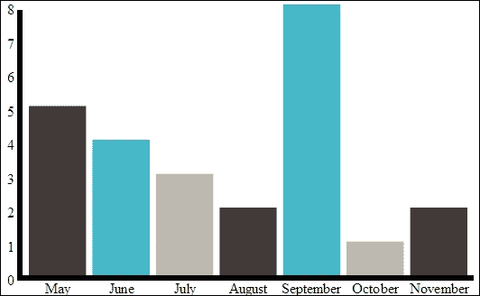

# 第四章．用于可视化的 JavaScript

在第二章《JavaScript 和 HTML5 用于可视化》中，我们探讨了使用可缩放矢量图形构建我们可视化所带来的优势。然而，构建 SVG 通过操作底层的 XML 是一个令人沮丧且耗时的练习，尽管有许多 XML 操作工具，但利用专门为构建 SVG 设计的 API 而不是更一般的语言会更好。

有许多 JavaScript 库是为了操作 SVG 而创建的。svg.js（[`www.svgjs.com/`](http://www.svgjs.com/)）和 Raphaël（[`raphaeljs.com/`](http://raphaeljs.com/)），都值得提及，因为它们是绘制 svg 图形的优秀工具。Raphaël 网站上的演示特别令人印象深刻。d3.js 提供了专门为可视化设计的功能，我们也会看看那个。

# Raphaël

利用**Raphaël**绘制简单的矩形比用 XML 构建相同的矩形要方便得多。这个库可以从硬盘或者像 CloudFlare 这样的 CDN 中包含，如下面的代码所示：

```js
<html>
  <body>…</body>
  <script src="img/raphael-min.js"></script>
</html>
```

我们可以用以下方法绘制任何形状：

```js
function drawRectangle()
{
  var paper = Raphael("visualization", 320, 200);
  paper.rect(50, 20, 50, 150);
}
```

这段代码找到 ID 为`visualization`的元素，并向其添加一个 320x200 像素的 SVG。然后，它在`(50, 20)`处插入一个新的矩形，宽度为`50`，高度为`150`。

如果我们想用 Raphaël 创建一个简单的柱状图，那将不会很难。让我们试一试。我们现在需要的第一件事是些数据。我们可以先用 JavaScript 数组，但在现实世界中，这些信息可以从 Web 服务中以 JSON 或 XML 的形式获取。在这个例子中，我们将选择一些月份及其相关值，如下面的代码所示：

```js
var data = [{month: "May", value: 5},
  {month: "June", value: 4},
…
  {month: "September", value: 8}];
```

现在，让我们更新上面使用的用于绘制矩形的函数来处理数据值。首先，我们将更改方法签名，如下面的代码所示：

```js
function drawGraphColumn(paper, item, currentColumn, maximumValue)
{…}
```

这个函数接收要绘制的 SVG、当前项目和一个用于计算适当高度的最大值。在函数体中，我们将首先计算条形图的高度，如下面的代码所示：

```js
var barHeight = (500 * (item.value/maximumValue));
```

我们硬编码了最大高度为 500 像素，每个条形图仅仅是该高度的百分比，等于项目的值占最大值的百分比。我们将使用这个值来绘制条形图，如下面的代码所示：

```js
var rectangle = paper.rect(currentColumn*30, 500 - barHeight, 20, barHeight);
rectangle.attr("fill", "rgb("+ (item.value * 40) + " ," + (item.value * 20) + "," + item.value * 20 + ")");
rectangle.attr("stroke-width", 2);
```

矩形根据它所在的列来偏移，以避免重叠的矩形。我们将颜色设置为项目值的函数，以便颜色随高度变化。

这个函数通过将我们每一个数据元素依次传递给它来调用：

```js
var maximumValue = 0;
$.each(data, function(index, item)
{
  if(item.value > maximumValue) maximumValue = item.value;
});
$.each(data, function(index, item){
  drawGraphColumn(paper, item, index, maximumValue);
});
```

在这里，我们首先从数组中计算最大值。然后，为数组中的每个元素调用我们上面定义的`drawGraphColumn()`函数。通过 jQuery 的`each`操作符遍历数据数组，该操作符将给定的函数应用于数组中的每个元素。生成的图表如下所示：



Raphaël 是一个通用 SVG 库。这意味着除了适合构建可视化，它还可以用来创建更通用的绘图。正如我们寻找一个比手动操作 XML 更合适的 SVG 操作 API 一样，拥有一个针对构建可视化而设计的库会很好。d3.js 是一个专门设计用来简化 SVG 构建可视化的库。

# d3.js

**d3.js**带来了一系列函数和编程风格，使得即使是上面的那种简单图表的创建也变得更简单。让我们用 d3 重新创建上面的图表，看看它们的区别。首先需要做的是在页面中引入一个 SVG 元素。在 Raphaël 中，我们使用构造函数来完成这个操作；在 d3 中，我们将显式地添加一个 SVG 元素，如下面的代码所示：

```js
var graph = d3.select("#visualization")
  .append("svg")
  .attr("width", 500)
  .attr("height", 500);
```

立即，你会发现使用的 JavaScript 风格与 Raphaël 有很大的不同。d3 非常依赖方法链的使用。如果你对这个概念还比较陌生，很快就能掌握。每个方法调用执行一些操作，然后返回一个对象，下一个方法调用在这个对象上执行。所以，在这个例子中，`select`方法返回了 ID 为`visualization`的`div`。在选定的`div`上调用`append`方法添加一个 SVG 元素，然后返回它。最后，`attr`方法在对象内部设置一个属性，然后返回该对象。

起初，方法链可能看起来很奇怪，但随着我们的进展，你会发现它是一个非常强大的技术，能显著清理代码。如果没有方法链，我们将产生很多临时变量。

接下来，我们需要在数据数组中找到最大的元素。在之前的示例中，我们使用了 jQuery 的`each`循环来找到这个元素。d3 拥有内置的数组函数，使得这个过程变得更为简洁，如下面的代码所示：

```js
var maximumValue = d3.max(data, function(item){ return item.value;});
```

寻找最小值和平均值也有类似的功能。这些函数没有任何是你在使用 JavaScript 工具库，如 underscore.js 或 lodash 时得不到的。然而，使用内置版本是很方便的。

我们接下来要使用的是 d3 的缩放函数，如下面的代码所示：

```js
var yScale = d3.scale.linear()
  .domain([maximumValue, 0])
  .range([0, 300]);
```

缩放函数用于将一个数据集映射到另一个数据集。在我们的案例中，我们将从我们数据数组中的值映射到我们的 SVG 中的坐标。我们在这里使用了两种不同的比例尺：线性和序数。线性比例尺用于将连续域映射到连续范围。映射将线性完成，所以如果我们的域包含`0`到`10`之间的值，而我们的范围值在`0`到`100`之间，那么值`6`将映射到`60`，值`3`将映射到`30`，依此类推。这看起来很简单，但是在更复杂的域和范围中，比例尺非常有帮助。除了线性比例尺之外，还有幂和对数比例尺，这些可能更适合您的数据。

在我们示例数据中，我们的`y`值不是连续的，甚至不是数字。在这种情况下，我们可以使用序数比例尺，如下面的代码所示：

```js
var xScale = d3.scale.ordinal()
  .domain(data.map(function(item){return item.month;}))
  .rangeBands([0,500], .1);
```

序数比例尺将离散域映射到连续范围。在这里，`domain`是月份列表，范围是我们 SVG 的宽度。你会注意到我们没有使用`range`，而是使用了`rangeBands`。范围带将范围分成块，每个块分配一个范围项目。所以，如果我们的域是`{五月，六月}`，范围是`0`到`100`，那么五月起我们将收到从`0`到`49`的带，六月从`50`到`100`的带将是`june`。你还会注意到`rangeBands`有一个额外的参数；在我们的例子中是`0.1`。这是一个填充值，生成每块之间的某种无人区。这对于创建柱状图或柱状图来说很理想，因为可能不希望柱子接触。填充参数可以取`0`到`1`之间的值，作为十进制表示保留多少范围用于填充。值为`0.25`将保留 25％的范围用于填充。

还有一些内置的比例尺用于提供颜色。为您的可视化选择颜色可能具有挑战性，因为颜色必须相隔足够远以被人辨认。如果你像我一样对颜色有挑战，那么比例尺`category10`、`category20`、`category20b`和`category20c`可能适合你。您可以声明一个颜色比例尺，如下面的代码所示：

```js
var colorScale = d3.scale.category10()
  .domain(data.map(function(item){return item.month;}));
```

之前的代码将为 10 种预计算的可能颜色中的每一个月分配一个不同的颜色。

最后，我们实际上需要绘制我们的图表，如下面的代码所示：

```js
var graphData = graph.selectAll(".bar")
  .data(data);
```

我们使用`selectAll`选择图表内的所有`.bar`元素。等等！图表内没有与`.bar`选择器匹配的元素。通常，`selectAll`将返回与选择器匹配的元素集合，就像 jQuery 中的`$`函数一样。在这种情况下，我们使用`selectAll`作为创建一个空的 d3 集合的简写方法，该集合有一个`data`方法并且可以被链式调用。

接下来，我们需要指定一组数据与现有元素的数据集合进行联合。d3 操作集合对象，不使用循环技术。这使得编程风格更加声明式，但可能一下子不容易掌握。实际上，我们正在创建两个数据集的并集，现有数据（通过`selectAll`找到）和新数据（由`data`函数提供）。这种处理数据的方法使得数据元素的更新变得容易，如果后来又增加了或移除了元素。

当新的数据元素被添加时，你可以通过使用`enter`()只选择那些元素。这可以防止对现有数据执行重复操作。你不需要重新绘制整个图像，只需要绘制用新数据更新过的部分。同样，如果新数据集中有在旧数据集中没有出现的元素，它们可以通过`exit()`被选择。通常，你只需要移除那些元素，如下面的代码所示：

```js
graphData.exit().remove()
```

当我们使用新生成的数据集创建元素时，数据元素实际上会被附加到新创建的 DOM 元素上。创建元素的过程涉及到调用`append`，如下面的代码所示：

```js
graphData.enter()
  .append("rect")
  .attr("x", function(item){ return xScale(item.month);})
  .attr("y", function(item){ return yScale(item.value);})
  .attr("height", function(item){ return 300 - yScale(item.value);})
  .attr("width", xScale.rangeBand())
  .attr("fill", function(item, index){return colorScale(item.month);});
```

下面的图表展示了`data()`如何与新旧数据集一起工作：



你可以在之前的代码中看到方法链变得多么有用。它使得代码变得更短，比分配一系列临时变量或把结果传给独立方法更易读。比例在这里也显示出了其独特之处。x 坐标简单地通过使用序数比例缩放我们拥有的月份来找到。因为这种比例考虑了元素的个数以及填充，所以不需要更复杂的东西。

它们的坐标同样是通过之前定义的`yScale`找到的。因为 SVG 的原点在左上角，我们必须取比例的逆来计算高度。再次强调，这个地方我们通常不会使用常数，除非是为了我们例子的简洁。柱状图的宽度是通过询问`xScale`带宽得到的。最后，我们根据颜色比例设置颜色，使其看起来像下面的图表：



这个 d3 版本的图表实际上比 Raphaël 版本的功能要强大得多。我们通过使用比例消除了 Raphaël 中存在的大量魔法数字。

让我们继续增强我们的图表，并探索 d3.js 的其他一些功能。

## 自定义颜色比例

我们上面生成的 d3 图表颜色非常丰富，因为我们利用了内置的颜色比例之一。然而，大多数时候你的视觉化图表必须有一定的主题连贯性。你可以通过利用自定义比例来实现这种连贯性。

让我们从一个简单的例子开始：交替颜色刻度。为了创建我们新的颜色刻度，作为现有`category10`刻度的替换，我们需要使用一点 JavaScript 乐趣来向 d3 中注入一个新的刻度函数。我们首先将函数附加到 d3 的刻度命名空间，如下面的代码所示：

```js
d3.scale.alternatingColorScale = function()
{

```

JavaScript 允许对对象进行猴子补丁（monkey patching），所以这个函数实际上会显示为是 d3 的一部分。我们将通过设置域和范围开始实现函数。我们定义了`domain`和`range`函数，它们作为域和范围的获取器和设置器：

```js
var domain, range;
  scale.domain = function(x){
    if(!arguments.length) return domain;
    domain = x;
    return scale;
  }
  scale.range = function(x){
    if(!arguments.length) return range;
    range = x;
    return scale;
  }

```

最后，我们将设置一个映射函数，该函数在使用刻度时被调用，如下面的代码所示：

```js
  function scale(x){
    return range[domain.indexOf(x)%range.length];
  }
  return scale;
}
```

这个刻度是通过以下代码应用的：

```js
var colorScale = d3.scale.alternatingColor()
  .domain(data.map(function(item){return item.month;}))
  .range(["#423A38", "#47B8C8", "#BDB9B1"]);
```

这导致了一个看起来更一致的图表，如下面的图表所示：



我选择了最简单的条件来定制我们的刻度，但可以使用更复杂和信息量更大的刻度。一个使用阈值的刻度在以下图表中显示：



这可以通过更改`scale`函数，并将值（而不是键（月份））传递给函数来轻松完成。

## 标签和坐标轴

到目前为止，我们构建图表时并没有太关注我们正在绘制的数据。如果在图表上加上一些标签，人们就可以轻松地解读我们的数据，那就太好了。幸运的是，d3 提供了一个`axis()`函数，使得添加坐标轴变得非常简单。

我们将从 x 轴开始，如下面的代码所示：

```js
var xAxis = d3.svg.axis().scale(xScale).orient("bottom");
  graph.append("g")
  .attr("transform", "translate(20,300)")
  .attr("text-anchor", "middle")
  .call(xAxis);
```

我们首先使用`axis`函数创建一个坐标轴。我们将`xScale`传递给它，给它一个提示，关于刻度上的刻度应该放置在哪里。接下来，我们在图表中添加一个`g`元素。`g`是一个 SVG 元素，它作为一个容器来持有其他元素。你可以在`g`元素内放置任何其他形状，然后作为一个整体对它们进行变换。我们接下来就是这样做。默认情况下，坐标轴位于图表的顶部，所以我们把它向下和稍微向右移动，以更好地对齐。`text-anchor`属性设置了文本的 x 坐标应该固定的位置。默认情况下它是左边的，但由于我们每个条形的中间位置，我们设置`text-align:middle`。最后，我们传递了`xAxis`。

`yAxis`通过以下代码添加起来也同样简单：

```js
var yAxis = d3.svg.axis().scale(yScale).orient("left");
  graph.append("g")
  .attr("transform", "translate(20,6)")
  .call(yAxis);
```

这里的翻译要复杂一些，我们只是说明了我们给刻度提供了左方向，这使得它被绘制在最小刻度值的左侧。因为我们的最小刻度值是`0`，所以它被绘制在屏幕外，如下面的图表所示：



我们设法在几行代码内添加了坐标轴和标签。使用更通用的 SVG 库，这将需要大量的工作。坐标轴函数也有许多配置选项。您可以设置刻度的数量、标签以及刻度的格式。

# 摘要

虽然我们已经接触了不少 d3 的内容，但我们对 d3.js 能做的很多事情还只是略知一二。它是一个庞大而强大的库。关于 d3 的主题有很多书，所以我们不可能全部覆盖。关于 d3 的一个很好的资源是 Swizec Teller 的书籍《*使用 d3.js 进行数据可视化，Packt 出版社*》。在我们开发书中剩余部分的一些可视化时，我们会发现许多额外的功能。我们还将访问本章中介绍的一些函数的进一步应用。
