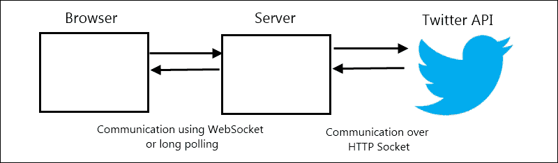
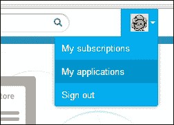
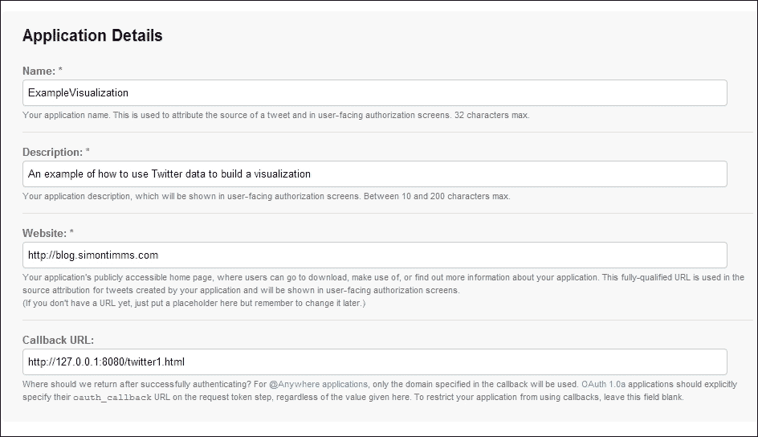
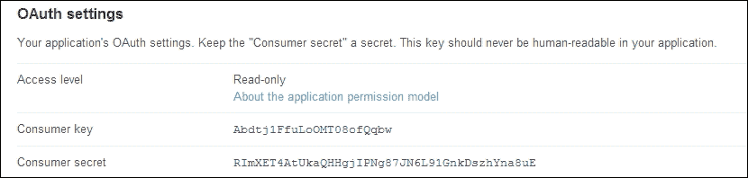
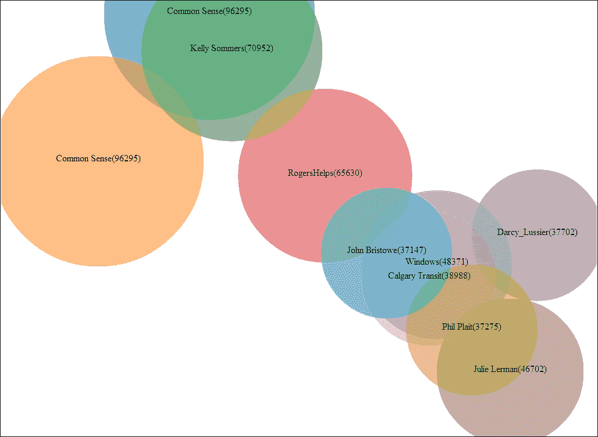

# 第五章：Twitter

Twitter 是一个真正在开放和可用的 API 上成长起来的服务。最初，没有 Twitter 客户端。与 Twitter 的通信限于 SMS，后来是网站。在 Twitter 的开发过程中，开发者显然累积了数百美元的 SMS 费用，用于测试和构建系统。Twitter 在数百名开发者的支持下变得流行，这些开发者使用开放的 Twitter API 或 Twitter RSS 源构建了工具，如**TweetDeck**和**Tweetree**。因此，Twitter 提供了一个丰富的 API，可以用来构建应用程序，在我们这个案例中，是可视化。

在我们开始构建可视化之前，让我们来看看 Twitter API，以及我们如何使用它。在[`dev.twitter.com`](https://dev.twitter.com)上有大量的 API 文档可供查阅。如果你需要更多信息，这应该是你进行额外研究的第一个停靠点。

对于我们的目的，Twitter 提供了两种不同的数据获取模型。第一种是典型的 RESTful 模型，其中客户端向 Twitter 请求特定资源，这些资源通过 HTTP 以 JSON 格式返回。这个 API 可能与你之前见过的其他 API 相似。它是无状态的，意味着在请求之间不会在服务器端保留任何信息，并遵循 HTTP 的最佳实践。如果你试图在网页浏览器中消费 Twitter 数据，那么这个选项适合你。第二种选择是流式 API。这种方法利用一个持久的 HTTP 连接，Twitter 会在消息发生时向该连接发送消息。通常不建议从浏览器使用流式 API，所以你需要一个浏览器和 API 之间的中介服务器，如下面的图所示：



不幸的是，拥有服务器是使用 Twitter 的所有可视化的要求，即使是 RESTful API，因为 Twitter 不支持使用纯基于浏览器的解决方案进行身份验证。我们稍后会深入讨论所有这些，但首先我们需要在 Twitter 上设置一个开发者账号。

# 获取 API 访问权限

如果你记得在第三章中，*OAuth*，其中一个要求是为我们想要与之通信的每个网站获取一个应用程序密钥。这适用于 Twitter，所以我们去这样做。

打开浏览器，前往[`dev.twitter.com`](https://dev.twitter.com)，然后点击**登录**链接。如果你已经有一个 Twitter 账号，那么你可以在这里使用它来登录。如果没有，你可以注册一个新的 Twitter 账号。别担心，这些都是免费的。

登录后，然后在右上角应该有一个链接到**我的应用**，如下面的屏幕截图所示：



点击那个链接会带你到一个页面，你可以在那里设置你的第一个应用程序。你需要为应用程序输入一些信息。对于大多数字段，你可以输入你选择的任何内容，但回调 URL 应该是[`127.0.0.1:8080/twitter1.html`](http://127.0.0.1:8080/twitter1.html)。这是 Twitter 完成 OAuth 阶段后将要引导你访问的 URL。在这里我们使用 localhost 值，但在生产环境中，你希望使用你可视化的公共面向 URL。下面的屏幕快照显示了**应用程序详情**窗口：



### 提示

在这里你不能使用 localhost 域名，但如果你不想看到 IP 地址，那么你可以使用一个 URL 缩短服务为你的 localhost URL 创建一个别名。确保你的 URL 缩短器保留查询参数，否则你将无法正确登录。

一旦你的应用程序创建完成，你将能够从我们之前使用的同一个**我的应用程序**选项中看到各种设置。对我们目的来说，关键信息是`OAuth 设置`，如下面的图所示：



这些密钥将用于用户对我们应用程序的授权。如果密钥泄露了—例如，你可能把它粘贴到你正在写的书里—你可以通过**重置密钥**链接来重新设置。这样做可以防止你的书的读者假装是你，并在你不知情的情况下为你做出不可描述的坏事。

# 设置服务器

如我所说，Twitter 不允许从浏览器直接访问其认证结构，我们需要使用一个服务器。幸运的是，我们可以在自己电脑上的服务器上进行开发——不需要外部服务器。这本书中使用了大量的 JavaScript，所以让我们继续这个主题，使用 node.js 在本地托管我们的网站。任何其他的 HTTP 服务器也可以工作。

安装 node.js 相当简单。如果你使用的是 Windows，那么可以从[`nodejs.org`](http://nodejs.org)下载安装程序。在 OS X 上，可以在同一个网站上下载基于`.pkg`的安装器，或者使用 Homebrew 进行安装。如果你使用的是 Linux，最好是从源代码编译。然而，如果你使用的是带有内置包管理系统的发行版，例如**apt**或**yum**，那么可以使用这两个命令中的任何一个来安装 node.js 包：

```js
sudo yum install nodejs            #Fedora or RedHat
sudo apt-get install nodejs        #Debian or Ubunt

```

node.js 是一个设计为异步执行所有 I/O 任务的服务器端软件。这意味着像写入磁盘这样的操作是在不阻塞主线程的情况下处理的。当 I/O 完成后，主线程会被通知。最常用的应用之一是将其用作 HTTP 服务器。这个功能以 HTTP 模块的形式包含在盒子里，但该模块提供的接口相当轻量级。相反，我们将使用 Express 框架。Express 是一个轻量级框架，提供了一些围绕路由、会话和内容服务的基础设施，以及模板。它可以通过 node 包管理器`npm`安装，如下所示命令：

```js
npm install express

```

接下来，我们将使用 Express。

# OAuth

OAuth 当然可以手动配置和控制，但我们站在巨人的肩膀上有充分的理由。对我们来说，使用一个已经建立的 OAuth 库要容易得多。幸运的是，node 有一个这样的库，创造性地称为**OAuth**。即使有了这个库，你也会看到与 OAuth 1.0a 端点的交互是复杂的。要安装它，再次切换到命令行并使用 node 包管理器：

```js
npm install oauth

```

这个库可以执行 OAuth 1.0a 和 OAuth 2.0 操作。由于 Twitter 是一个 OAuth 1.0a 端点，我们将使用它。

首先，我们需要设置我们的 Express 应用程序。Express 提供了应用程序模板，但对于本章中的简单应用程序来说，这些模板过于复杂。如果你计划在将来创建一个更复杂的应用程序，那么你可能需要更深入地了解应用程序生成和目录结构。我们从以下代码中要求`express`并使用加载的模块创建一个新应用程序：

```js
var express = require("express");
var app = express();
var oAuth = require('oauth');
```

Require 是一个库，它允许动态加载 JavaScript 库。这是在 node 应用程序中引入外部模块的最常见方式。接下来，我们在`express`中配置了一些设置，如下所示代码：

```js
app.configure(function() {
  app.use(express.bodyParser());
  app.use(express.cookieParser() );
  app.use(express.session({ secret: "a secret key"}));
  app.use(app.router);
  app.use(express.static(__dirname + '/public'));
});
```

`bodyParser` 允许 `express` 对发送到服务器的请求体进行简单的解析。下一行，设置了 `cookieParser`。与 `bodyParser` 类似，这允许解析 cookies 并将从 cookies 中检索到的值填充到请求对象中，在我们的案例中，是会话信息。接下来，我们设置了会话功能。这允许我们从一个请求到另一个请求共享信息。在其默认配置中，它使用内存存储来持有会话信息。这意味着重新启动您的应用程序将清除会话信息。如果您在一批机器上托管您的可视化，您将需要使用外部数据存储机制，如**MongoDB** 或 **Redis**。我们传递了一个密钥，该密钥用于生成 `session` 哈希。它应该是一个随机字符串。使用 `app.router` 将指示 express 监听路由请求，我们将在一秒钟内定义这些请求。最后，我们的 `.html` 和 `.js` 文件将位于一个名为 `public` 的目录中，因此我们将指示 `express` 作为静态资源提供该目录的内容。

现在我们想使用 OAuth 库。这可以通过以下代码中的函数完成：

```js
function getOAuth(){
  var twitterOauth = new oAuth.OAuth(
  'https://api.twitter.com/oauth/request_token',
  'https://api.twitter.com/oauth/access_token',
  consumerKey,
  consumerSecretKey,
  '1.0A',
  null,
  'HMAC-SHA1');
  return twitterOAuth;
}
```

我们创建了一个与 Twitter 关联的 OAuth 对象。我们给出了两个端点，然后是之前从 Twitter 收到的消费者密钥和消费者密钥。OAuth 1.0a 需要嵌入消费者密钥这就是为什么不能使用客户端代码从 Twitter 检索信息的原因。消费者密钥不能泄露给外人，因为它会被发送到客户端。`1.0A` 作为 OAuth 的版本；不需要授权回调，所以第六个参数为 `null`。最后一个参数是签名方法：Twitter 使用 `HMAC-SHA1`。

接下来，我们在 Express 应用程序中设置一个请求 Twitter OAuth 令牌的路由：

```js
app.get('/requestOAuth', function(req, res){
  function recieveOAuthRequestTokens(error, oauth_token, oauth_token_secret,results) {
    if (!error){
      req.session.oAuthVars = { oauth_token: oauth_token,oauth_token_secret: oauth_token_secret}; res.redirect('https://api.twitter.com/oauth/authorize?oauth_token=' + oauth_token);
    }
  requestOAuthRequestTokens(recieveOAuthRequestTokens);
});
function requestOAuthRequestTokens(onComplete){
  getOAuth().getOAuthRequestToken(onComplete);
}
```

在这里，我们将 `/requestOAuth` 路由首先请求一个 OAuth 令牌，然后使用该令牌将用户重定向到 Twitter 的登录页面。我们构建了一个匿名函数并将其传递给 OAuth，因为 node 是非常异步的。回调模型允许主线程在等待 Twitter 回复 OAuth 令牌的同时服务于另一个请求。一旦我们有了 OAuth 令牌，我们将其保存在会话状态中以供下一步使用，并将用户重定向到 Twitter 授权页面。

Twitter 将在用户完成认证后重定向到我们设置应用程序时定义的 URL。在我们的案例中，这将由路由 `/receiveOAuth` 服务，如下面的代码所示：

```js
app.get('/receiveOAuth', function(req, res){
  if(!req.session.oAuthVars){
    res.redirect("/requestOAuth");
    return;
  }
  if(!req.session.oAuthVars.oauth_access_token){
    var oa = getOAuth();
    oa.getOAuthAccessToken( req.session.oAuthVars.oauth_token, req.session.oAuthVars.oauth_token_secret, req.param('oauth_verifier'),
    function(error, oauth_access_token, oauth_access_token_secret,tweetRes) {
      req.session.oAuthVars.oauth_access_token = oauth_access_token;
      req.session.oAuthVars.oauth_access_token_secret = oauth_access_token_secret;
      GetRetweets(res, req.session.oAuthVars.oauth_access_token, req.session.oAuthVars.oauth_access_token_secret);
    });
  }
  else
    GetRetweets(res, req.session.oAuthVars.oauth_access_token, req.session.oAuthVars.oauth_access_token_secret);
});
```

这段代码获取了 Twitter 的 `redirect` 返回的 OAuth 令牌，并执行了最后一步，即查找访问令牌。一旦我们有了这些访问令牌，它们就可以用来调用 API——在这里在 `GetRetweets` 函数中完成。我们将会在会话中保存生成的所有令牌，这样用户就不用不断地授权给 Twitter API。

是否对令牌感到厌倦了呢？你应该感到厌倦！设置 OAuth 1.0a 的这次交换使用了很多令牌。幸运的是，我们已经完成了令牌和 OAuth 的设置。现在我们可以开始用 Twitter 数据构建可视化了！

# 可视化

Twitter 向我们提供了一系列 API。我们应该或许先发明一些我们想要可视化的东西，然后决定数据是否可用以及我们如何展示它。我对我所关注的哪些人发推文最多感到好奇。一些账户，比如`@kellabyte`，似乎总是在发推文，而像@ericevans 的其他账户几乎不发推文。

## 服务器端

让我们先从服务器端获取数据开始。在 node.js 中，我使用以下代码设置了一个新路由：

```js
app.get('/friends', function(req, res){
  if(!req.session.oAuthVars || !req.session.oAuthVars.oauth_access_token){
    res.redirect('/requestOAuth');
    return;
  }
  var cursor = -1;
  receiveUserListPage(res, req.session.twitterVars.user_id, req.session.oAuthVars.oauth_access_token, req.session.oAuthVars.oauth_access_token_secret, cursor, new Array());
});
```

首先，我们检查确保在会话中拥有合适的令牌。如果没有，则重定向回`requestOAuth`页面，这将启动整个 OAuth 工作流程。接下来，我们设置一个初始的游标值。Twitter 限制从其服务中返回的结果数量。这避免了向消费者推送一百万条记录，这双方都不太可能想要。对于 API 调用，我们将使用设置为 20 的限制。然而，Twitter 还提供了一个他们称之为游标继续令牌。通过使用这个令牌再次调用服务，将返回下一页的结果。初始值为`-1`，表示第一页。游标以及所有必需的令牌传递给`receiveUserListPage`，该方法将执行实际的查找操作。

### 提示

**速率限制**

Twitter 限制了您可以发送到他们服务的请求数量。在开发可视化时，您可能会遇到这些限制。等待 15 分钟，然后再次尝试。在生产环境中，尝试缓存您的数据，这样您就不必频繁地查询 Twitter。

`receiveUserListPage`看起来像以下代码：

```js
function receiveUserListPage(res, user_id, oauth_access_token, oauth_access_token_secret, currentCursor, fullResults){
  var oauth = getOAuth();
  oauth.get( 'https://api.twitter.com/1.1/friends/list.json?skip_status=true&user_id=' + user_id + "&cursor=" + currentCursor,
  oauth_access_token, 
  oauth_access_token_secret,
  function (e, data, oaRes){
  var jsonData = JSON.parse(data);
  if(jsonData.errors){
    projectResults(res, fullResults);
    return;
  }
  fullResults = _.union(fullResults, 
  _.map(jsonData.users, 
  function(item){return { name: item.name, 
    count: item.statuses_count
  }}));
  if(jsonData.next_cursor == 0){
    projectResults(res, fullResults);
  }
  else
    ReceiveUserListPage(res, user_id, oauth_access_token, oauth_access_token_secret, jsonData.next_cursor, fullResults);
  }
});
}

function projectResults(res, fullResults)
{
  var selectedResults = _.first(_.sortBy(fullResults, function(item){return item.count;}).reverse(), 10);
  res.end(JSON.stringify(selectedResults));
}
```

我们首先获取 OAuth 库的引用，然后使用当前的游标和当前的`user_id`来查询 Twitter。我们使用的 API 调用返回了我关注的名单上的一组 20 个用户。结果以字符串形式返回，因此我们使用`JSON.parse`将它们解析为对象。如果结果对象包含一个名为`errors`的字段，那么我们很可能遇到了速率限制，因此我们返回到目前为止我们所获取的所有内容。因为对于这个 API 调用，速率限制只有`15`，如果你关注超过 300 人，你将遇到限制。

如果我们有结果，我们将把它们添加到我们当前的数据集中。我们使用 Underscore 的`map`函数只选择两个字段。这节省了带宽，使调试更容易，因为从 Twitter 返回的对象带有几十个无用的字段，非常沉重。如果`next_cursor`等于`0`，那么这意味着我们已经到达列表的末尾，可以返回当前的名字和计数集合。否则我们重新进入函数，给它新的游标，名字集合和项目。一旦我们遇到可以返回的情况，我们调用`projectResults`，将拥有最多推文的 10 个用户以 JSON 格式发送给客户端。

### 顶端

**Underscore.js**

Underscore JavaScript 库是一个小型库，它使处理数组变得更容易。它添加了集合函数如`union`和`intersect`，以及映射和减少等功能编程概念。它可以从[`underscorejs.org/`](http://http://underscorejs.org/)下载。

## 客户端

客户端可视化代码可以放在我们之前指导 Express 作为静态内容服务的公共目录中。

我想要直观地展示最活跃的推文者。一种很好的方法是使用气泡图，气泡越大，他们的推文就越多。让我们逐步构建代码：

```js
function visualize(data){
  var graph = d3.select(".visualization")
  .append("svg")
  .attr("width", 1024)
  .attr("height", 768);
  var colorScale = d3.scale.category10();
  calculateBubbles(data, 1024, 768);
  var currentX = 0;
  graph.selectAll(".bubble")
  data(data)
  enter()
  append("circle")
  .style("fill", function(x,y){return colorScale(y);})
  .attr("cx",  function(d){return d.cx;})
  .attr("cy", function(d){ return d.cy;})
  .attr("r", 0)
  .attr("opacity", .5)
  .transition()
  .duration(750)
  .attr("r", function(d){return d.radius;});
  graph.selectAll(".label")
  .data(data)
  .enter()
  .append("text")
  .text(function(d){return d.name + "(" + d.count + ")";})
  .attr("x", function(d){return d.cx;})
  .attr("y", function(d){return d.cy;})
  .attr("text-anchor", "middle");
}
```

如今当你对 d3 有所了解后，这些代码看起来会很熟悉。传入的数据数组是我们从节点服务中检索到的。首先，我们在页面上创建一个任意的 SVG 元素。然后，我们设置一个颜色比例尺，以便我们的可视化效果颜色悦目。`calculateBubbles`函数是一个辅助函数，将计算气泡的位置。它用圆的 x 和 y 坐标以及半径增强我们的数据数组。我们在这里不会深入讲解那个，但代码可以在 GitHub 上找到。我们对每个顶级推文者创建一个气泡。我们使用颜色比例尺为其着色，并使用数据数组中预计算的值设置位置。最初，我们设置半径为`0`，然后我们使用过渡效果使圆形在加载效果中逐渐变大。

对于每个圆形，我们想要标识圆形代表的内容。这是通过在圆的中心添加文本元素来实现的。

根据我所关注的 10 个最活跃的人生成的图表如下所示：



这些人中的每一个人都发过超过 35,000 条推文。

# 摘要

现在你应该能够设置一个新的应用程序来查询 Twitter，使用 node.js 上的 OAuth 库创建正确的 OAuth 令牌，并建立一个气泡图。Twitter API 丰富且具有许多潜在的可视化效果。我相信我们可以提出几十个潜在的可视化效果。没有比通过实验 API 更好的学习方法了，所以不要害怕弄脏。

在下一章，我们将查看一个流行的问答网站 Stack Overflow 上的数据可视化。该 API 对大多数查询是开放的，并不需要身份验证，因此我们可能暂时不需要使用 OAuth 甚至 node.js。
