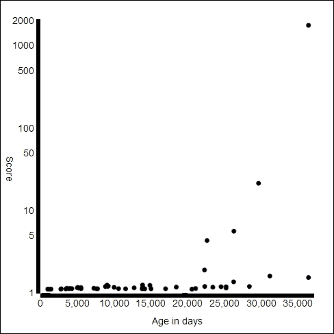
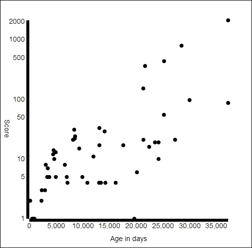
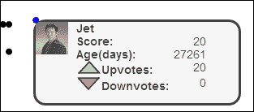
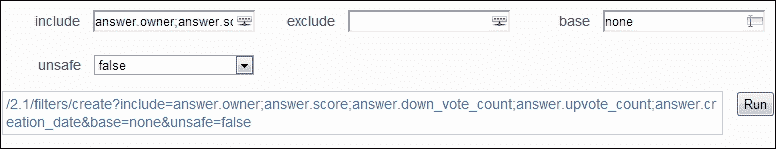

# 第六章：Stack Overflow

2008 年，互联网上的编程问题市场被一个名为 Experts Exchange 的公司所主导。许多人对网站上文化和要求人们注册才能查看答案的规定表示不满。程序员 Jeff Atwood 和 Joel Spolsky 推出了“问答”网站 Stack Overflow。自那时以来，该网站迅速起飞，快速发展成为互联网上前 100 个网站之一。用户可以在网站上关于各种编程主题提问和回答问题。回答一个问题很好或者提出一个经过深思熟虑的问题可以赢得声誉点，这些点数突出显示。尽管 Stack Overflow 不是一个像 Facebook 和 Twitter 那样的社交媒体网站，但该网站的内容全部由用户创建和用户审核。Stack Overflow 提供了一个 API，你可以通过该 API 查询各种有趣的信息。

# 身份验证

查询 API 的大部分功能不需要进行身份验证。然而，如果你想要关于用户的私人信息或者想要向网站写入内容，那么你就需要进行身份验证。对于经过身份验证的应用程序，也有一个请求限制的请求限制。没有进行身份验证的情况下，一个 IP 地址每天只能限制 300 个请求。有了经过身份验证的应用程序，这个限制提高到 10,000 个请求。

### 提示

**速率限制**

许多社交媒体网站在其 API 中使用速率限制。这些限制是为了防止你使网站过载，也是为了让你不要获取太多数据。Twitter 每秒处理超过 4,000 条推文。如果你要处理它们所有人，而没有做特殊的准备，你的基础设施很快就会被压垮。

再次说明，这个网站利用**OAuth**来授权用户。然而，他们使用的是 OAuth 2.0，这比我们上一章使用的 OAuth 1.0a 要简单得多。我们将限制自己只使用公共信息来避免身份验证。如果你希望进行身份验证，我保证这比 Twitter 容易。你可以在[`api.stackexchange.com/docs/authentication.`](https://api.stackexchange.com/docs/authentication.)找到说明。Stack Overflow 使用与 Facebook 相同的授权系统，所以上一章的 OAuth 示例应该完全适用。

# 创建可视化

许多在 Stack Overflow 上的问题都有很多答案。该网站并没有优化显示最新的答案；答案是按照被接受最多的答案然后随机排序的。这样做是为了让所有的答案都有机会出现在顶部，理论上应该能鼓励人们为最好的答案投票，而不仅仅是第一个显示的答案。

对于这个可视化，我希望能展示一个问题是如何随时间被回答的。最近的答案得分更高吗？第一个答案总是最好的吗？

让我们先拉取一个有大量答案的单个问题的数据。为此，我们将使用问题 API。所有 API 端点都托管在[`api.stackexchange.com`](https://api.stackexchange.com)。我们将使用最新的 API，即版本 2.1。这也编码在 URI 中，以及特定的端点和 ID。在问题 API 中，我们感兴趣的是答案，因此我们可以针对它们进行查询，得到一个 URI：[`api.stackexchange.com/2.1/questions/{id}/answers`](https://api.stackexchange.com/2.1/questions/{id}/answers)。

在查询字符串中，我们将指定我们要查询的站点。Stack Exchange 托管了数十个模仿 Stack Overflow 的问题和答案站点，所有这些站点都使用相同的 API 端点，因此有必要通过传递`site=stackoverflow`来过滤出 Stack Overflow。

```js
function retrieveQuestionAnswers(id){
  var page = 1;
  var has_more = true;
  var results = [];
  while(has_more) {
    $.ajax(https://api.stackexchange.com/2.1/questions/ + id + "/answers?site=stackoverflow&page=" + page,{ 
        success: function(json){
          has_more = json.has_more;
          results = results.concat(json.items);},
        failure: function() { 
          has_more = false;},
          async: false
        });
        page++;
    }
  return results;
}
```

Twitter 为我们提供了继续令牌，我们可以将其回传给 Twitter 以请求下一页的数据。Stack Overflow 采取了不同的方法，分配了页码，使我们能够轻松地浏览结果。每个 API 调用响应中嵌入了一个名为`has_more`的令牌，当有符合当前查询的更多数据页时，该令牌为真。

在这个代码中，我们利用继续令牌和页码执行尽可能多的查询，以获取所有答案。我们使用了 jQuery 函数`ajax`，而不是更常见的`getJson`函数，因为我们希望同步获取数据。我们这样做是因为我们希望一次性获取整个数据集。如果您的可视化允许动态添加数据，那么您可以放宽`async:false`的要求。

返回的是一个对象数组，每个对象都代表一个问题的答案。如果我们给`retrieveQuestionAnswers`方法一个 ID，比如`901115`，那么我们会得到一个包含 50 个答案的数组。这些答案在两个请求中返回，上述代码将它们合并到结果数组中并返回。

每个`Answer`包含多个字段。返回默认字段的列表可以在[`api.stackexchange.com/docs/types/answer`](https://api.stackexchange.com/docs/types/answer)找到。对于我们的人来说，我们最感兴趣的是答案最初是在什么时候提出的，它的得分，以及它是否被选为接受的答案。这些信息可以在字段`creation_date`、`score`和`is_accepted`中找到。现在我们忽略其他字段。

现在我们已经有一些基本数据，可以开始考虑可视化了。我们试图传达问题的年龄和其得分之间的关系。这听起来像是一个散点图的用途。数据点本身就可以放置在日期和分数的两个轴上。在我开始这项工作之前，我的理论是：越老的问题往往会得分更高，因为它们存在的时间更长，有更多的时间积累分数。人们倾向于认为上升的数字是积极的，所以让我们利用这一点，将分数对年龄绘制成图表，如果我的理论成立，那么右侧的值将会更高。

当然，散点图很无聊，我们完全可以在 Excel 之外生成它。我们将添加一些交互性，但首先，我们仍然需要一个简单的散点图。

这可以通过几个刻度和一些圆圈轻松实现，如下面的代码所示：

```js
var graph = d3.select("#graph");
var axisWidth = 50;
var graphWidth = graph.attr("width");
var graphHeight = graph.attr("height");
var xScale = d3.scale.linear()
  .domain([0, d3.max(data, function(item){ return item.age;})])
  .range([axisWidth,graphWidth-axisWidth]);
var yScale = d3.scale.log()
  .domain([d3.max(data, function(item){return item.score;}),1])
  .range([axisWidth,graphHeight-axisWidth]);
```

这会生成一个非常平缓的图表，其中大部分数据接近于零，而刻度则被一个得分超过 2000 的高异常值所扭曲，如图所示：



这可以通过使用对数刻度来改善。每次使用像对数这样的非标准刻度时，您都会想要添加轴标签，以防止引起混淆或误导可视化的消费者。

```js
var yAxis = d3.svg.axis()
  .scale(yScale)
  .orient('left')
  .tickValues([1,5,10,50,100,500,1000,2000])
  .tickFormat(function(item){return item;});
graph.append("g")
  .attr("transform", "translate(" + axisWidth +",0)")
  .call(yAxis);
graph.append("text")
  .attr("x", "0")
  .attr("y", graphHeight/2)
  .attr("transform", "rotate(90, 0, " + graphHeight/2 + ")")
  .text("Score");
```

这个图表中的标签是手动分配的，以给出最好的分散效果。您可以自动分配标签，但我发现它们被声明在奇怪的地方。我还定义了一个函数来格式化标签，否则它们倾向于使用科学记数法(*2 * 10³*)。最后，我附加了一些文本作为轴标签。我还添加了一个年龄轴，列出了答案的年龄（以天为单位）。

```js
var xAxis = d3.svg.axis().scale(xScale).orient('bottom');
graph.append("g")
  .attr("transform", "translate(0," + (graph.attr("height") - axisWidth)  +")")
  .call(xAxis);
graph.append("text")
  .attr("x", graphWidth/2)
  .attr("y", graphHeight-5)
  .style("text-anchor", "middle")
  .text("Age in days");
```

这段代码中唯一值得注意的特殊之处在于，标签是通过变换旋转的，因为它沿着垂直轴出现。结果图表看起来像这个图：



现在我们已经有了基本的可视化，可以开始通过一些交互来使其更加完善。

我们可以添加的最简单的交互是将一个标签在有人将鼠标指针悬停在一个点上时弹出。

这可以通过使用`d3`的`on()`函数来实现。这个函数可以将事件监听器绑定到 SVG 中创建的元素上。首先，我们在上面的圆圈附加代码的末尾添加如下代码：

```js
//append circle
.on("mouseover", function(item){
  showTip(item);
});
```

在这里，每当用户将鼠标悬停在上面的图表中的一个圆圈上时，`showTip()`函数就会被调用。事件处理程序中传递的`item`参数是附着在悬停圆圈上的数据集合中的项目。如果您需要关于事件的额外信息，我们需要，那么可以在全局变量`d3.event`中找到。

在事件处理程序中，我们首先通过确保所有其他圆圈都是黑色并把选中的圆圈变成蓝色来突出选中的圆圈：

```js
function showTip(item){
  d3.selectAll(".score").attr("fill", "black");
  d3.select(d3.event.srcElement).attr("fill", "blue");
```

更改圆的大小也可能很有用，以吸引更多的注意力。这可以通过简单地更新其属性来实现。接下来，我们隐藏先前的提示，并将提示内的内容设置为从选中的数据元素中获取值：

```js
  d3.select("#tip").style("opacity", 0);
  d3.select("#count").text(item.score);
  d3.select("#age").text(Math.floor(item.age));
  d3.select("#profileImage").attr("src",
  item.owner.profile_image);
  d3.select("#profileName").text(item.owner.display_name);
```

最后，我们将工具提示移动到圆旁边，并让它渐显：

```js
  d3.select("#tip").style("left", d3.event.x + "px");
  d3.select("#tip").style("top", d3.event.y + "px");
  d3.select("#tip").transition().duration(400).style("opacity", .75);
}

```

以下是类似以下的图表结果：



将交互性添加到您的可视化中，可以使您呈现比正常情况下更多的数据。隐藏数据，以便只有在移动鼠标或单击它时才能看到，可以防止让您的用户感到不知所措，同时仍提供最多的信息。

# 过滤器

我们的查询返回的数据并不是我们想要的确切数据。例如，我们不在乎`last_edit_date`甚至是`last_activity_date`，但我们关心的是赞成和反对票的数量。通过拉回额外的数据，我们正在浪费带宽，并减慢用户的可视化速度。幸运的是，Stack Overflow 有一个解决方案，那就是过滤器。

### 提示

**深度查询**

如果您发现需要比 API 提供的更深入地探索 Stack Overflow 数据，您可以从[`www.clearbits.net/creators/146-stack-exchange-data-dump`](http://www.clearbits.net/creators/146-stack-exchange-data-dump)下载整个网站的数据转储。这个转储每三个月提供一次，目前压缩后为 13.4 GB。有了这个转储，您可以在不担心达到速率限制的情况下运行更复杂的查询。

过滤器控制从 API 返回的数据，可以用来添加或删除字段。它们是静态创建的，所以您只需要创建一次，您不需要在每次查询网站时，甚至每次应用程序启动时都创建一个新的过滤器。实际上，我实际上利用了 Stack Exchange 提供的 API 浏览器来提前创建我的过滤器。创建过滤器的 URL 是[`api.stackexchange.com/docs/create-filter`](https://api.stackexchange.com/docs/create-filter)。

在**包括**字段中，您可以放置一个分号来包括由分隔符指定的名称系列。属于答案对象的所有内容都以前缀 answer，所以答案所有者被称为`answer.owner`。默认过滤器非常包容，因此作为基本过滤器，我使用了特殊的`none`过滤器。这个过滤器除非明确包括，否则不包含任何字段。将`none`过滤器作为基础是减少过量查询的最佳实践，如图所示：



如果你从`none`过滤器开始，请确保在包含列表中添加令牌`.items`和`.has_more`。没有项目，项目集合（根据查询持有问题、答案或用户）不包括在内，并且需要`has_more`来判断是否有其他页面。对我们来说，以下过滤器是完美的：

```js
answer.answer_id;answer.owner;answer.score;answer.down_vote_count;answer.upvote_count;answer.creation_date;shallow_user.profile_image;shallow_user.display_name;.items;.has_more
```

`create`过滤器返回一个字母数字字符串，然后可以在我们的查询中使用以适当地过滤它。我们查询的 URL 如下：

```js
"https://api.stackexchange.com/2.1/questions/" + id + "/answers?site=stackoverflow&filter=!2BjddbKa0El(rE-eV_QT8)5M&page=" + page
```

通过使用过滤器，我能够将 API 返回的负载从 22kB 减少到 3kB。这对于低带宽连接尤其节省大量数据。

# 摘要

现在你应该能够使用 Stack Exchange API 不仅查询 Stack Overflow，还可以查询所有 Stack Exchange 网站。你也应该对如何使用`d3`为你的可视化添加交互性有一些了解。在下一章，我们将探讨如何使用 Facebook 作为数据来源进行可视化。
