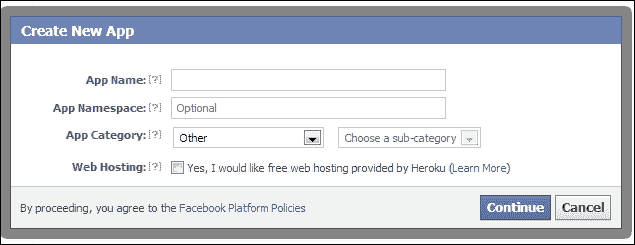
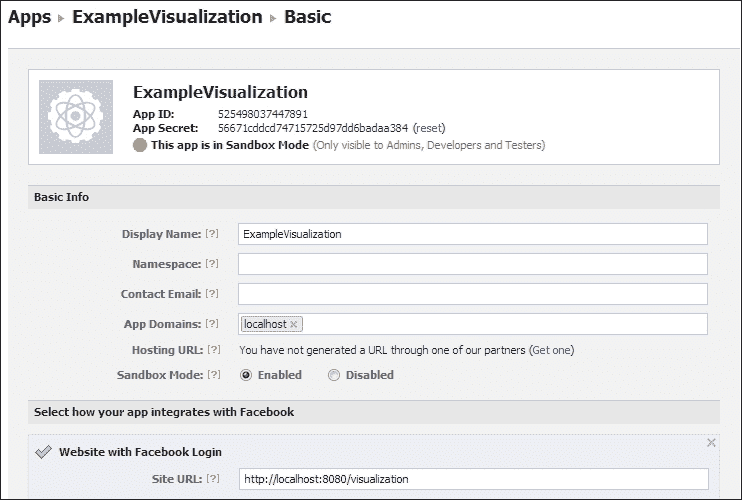
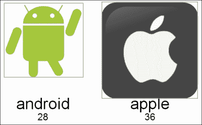

# 第七章：Facebook

Facebook 是社交媒体世界的“重量级”选手，字面上是在大学宿舍里创建的，如今已经增长到拥有 11 亿活跃用户。地球上每七个人中就有一个。其影响力不言而喻。关于使用社交媒体 API 的任何书籍，如果没有调查如何使用 Facebook 的 API，那就称不上完整。

# 创建应用程序

正如你可能预料到的，对于这样一个大型的网站，有许多 API 可供构建与 Facebook 相关的应用程序使用。最简单的涉及到在网站或移动应用中集成“发布到 Facebook”按钮，而最复杂的则允许你实际上在 Facebook 的服务器上运行代码作为应用程序。我们将使用 Graph API。

Graph API 提供了一种基于 HTTP 的方法来访问信息，Facebook 称之为社交图谱。这个图谱实际上就是各种用户及其数据之间的关系。它是一个图，也是一系列节点和边的集合，而不是条形图式的图表。

为了开始，我们将向 Facebook 注册一个应用程序，就像我们之前用 Twitter 做的那样，如果我们想使用认证，还必须与 Stack Overflow 这样做。为此，我们将前往[`developers.facebook.com`](http://developers.facebook.com)，并在顶部菜单栏中点击**Apps**链接。从那里，点击**创建新应用**。接下来，你会看到**创建新应用**对话框，如下面的截图所示：



应用程序名称可以是任何你喜欢的东西，应用程序命名空间用于在 Facebook 上为你的应用程序提供一个位置，比如[apps.facebook.com/NiftyVisualization](http://apps.facebook.com/NiftyVisualization)。对于我们来说，这基本上是不必要的。应用程序类别完全由你决定，应该根据你要可视化的是什么来确定。**Heroku**是与 Facebook 合作的基于云的主机提供商，为 Facebook 应用程序提供主机空间。如果你还没有主机，Heroku 是一个合理的替代品，并且支持 node.js；然而，使用它超出了本书的范围。

一旦你填写了应用程序的详细信息，你将被要求通过解决一个 CAPTCHA 谜题来确认你是一个人。然后你会被带到编辑页面，在那里你可以填写最后几个细节然后再测试一下你对 API 的访问。它看起来如下面的截图所示：



在此处，你需要至少填写一个应用域名。这个值在你登录时由 API 检查，以确保你的应用是从一个授权的域名中使用的。不幸的是，你不能从不是从域名中服务的文件访问 Facebook 的 Graph API。这意味着仅仅访问`file://c:/code/visualization.html`并不能让你访问 Facebook 的 API。幸运的是，并非一切都失去了，使用`localhost`是被允许的，但这意味着我们必须运行一个 HTTP 服务器。我们可以利用在前几章中使用过的相同的`Node.js`安装。

带有 Facebook 登录的网站 URL 应设置为你的 OAuth 密钥交换的返回 URL。实际上我们可以将其设置为任何内容，因为我们打算使用 AJAX 进行身份验证，我们的用户实际上永远不会离开我们的初始页面。

# 使用 API

完全可以通过手动执行 OAuth 来与 Facebook 认证和授权你的可视化。然而，Facebook 慷慨地提供了一个非常易用的 JavaScript SDK。API 将登录过程抽象为函数调用。为了使用 API，我们首先需要在我们的可视化中包含它。为此，只需在你的一个`script`标签内包含以下脚本：

```js
(function(d){
  var js;
  var id = 'facebook-jssdk';
  var ref = d.getElementsByTagName('script')[0];
  if (d.getElementById(id)) {return;}
  js = d.createElement('script'); js.id = id; js.async = true;
  js.src = "//connect.facebook.net/en_US/all.js";
  ref.parentNode.insertBefore(js, ref);
}(document));
```

这段代码将在你的文档中创建一个新的`script`标签，并将其源设置为 Facebook 网站上的一文件。添加这样的`script`标签将导致浏览器加载该脚本文件的内容并执行它。因为我们以异步方式加载脚本，我们需要等待它加载完毕才能使用它。SDK 在初始化后调用一个钩子，`fbAsyncInit`。我们只需要将一个函数与该钩子相关联，如下面的代码所示：

```js
window.fbAsyncInit = function() {
  FB.init({
  appId      : '525498574499442', 
  channelUrl : '//localhost:8080/channel', 
  status     : true, 
  cookie     : true, 
  xfbml      : true  // parse XFBML
  });
};
```

这将为 SDK 提供从开发者网页上可用的 App ID。另外，在这里我提供了`channelUrl`，它用于解决某些浏览器上出现的跨域问题。设置状态将使`init`方法获取`status`的值。`cookie`将启用 cookie 支持。最后，`xfbml`启用了 Facebook 标记语言。那是什么？它是由 Facebook SDK 控制的特殊格式的 HTML 元素的集合。

例如，如果我们想要显示一个登录按钮（多么方便，我们确实想要显示一个登录按钮）那么我们可以简单地添加以下代码：

```js
<fb:login-button show-faces="true" width="200" max-rows="1"scope="user_birthday,email,friends_birthday">
</fb:login-button>
```

当未认证的用户打开页面时，会显示一个登录按钮。当认证用户访问页面时，会显示他们自己的登录信息。你会注意到`scope`属性；这个属性用于向 Facebook 提供一个权限列表，你请求这些权限。在这里，我们请求了登录用户的生日、电子邮件 ID 以及他们朋友的生日。在登录时，用户会被 Facebook 提示允许你的可视化访问这些权限。大约有三十多种不同的权限可以从 Facebook 请求，这些权限涵盖了从获取登录用户的信息，到他们的朋友、事件和回复确认单的一切。在这里仔细查看以发现有趣的可视化方面是非常值得的。

认证拼图的最后一步是提供一个函数，让登录按钮在登录用户后调用：

```js
FB.Event.subscribe('auth.authResponseChange', function(response) {
  if (response.status === 'connected') {
    //use SDK here
  } else if (response.status === 'not_authorized') {//not authorized
    FB.login({scope: "user_birthday,email,friends_birthday"});
  } else { //not logged in
    FB.login({scope: "user_birthday,email,friends_birthday"});
  }
});
```

此事件在授权响应发生更改时触发，例如当我们从登录按钮获得认证时。

# 获取数据

在我们获取数据之前，我们可能应该决定我们想可视化哪些数据。关于登录用户的数据并不多（至少对我来说是这样，但我几乎不使用 Facebook）。这让我们转向了查看我们的朋友。我发现我的朋友们使用来访问 Facebook 的设备非常有趣。他们是更多的安卓用户还是 iOS 用户？这些信息作为朋友集合的一部分是可用的。为了获取这些信息，我们可以使用`FB.api()`方法：

```js
FB.api('/me?fields=friends.fields(devices)', function(response){
  for(i = 0; len = response.friends.data.length; i< len; i++){
    var friend = response.friends.data[i];
    if(friend.devices)
      for(j = 0; j< friend.devices.length; j++)
    if(friend.devices[j].hardware != "iPad")
      operatingSystems[friend.devices[j].os]++;
  }
});
```

我们将一个要检索的 URL 传递给`api()`方法。在这个例子中，我们请求特殊的 URL`/me`，它指的是当前登录的用户。我们还提供一个过滤器，以便只检索朋友集合，实际上，只为每个朋友检索设备的集合。在回调中，我们只是在计算安卓和 iOS 设备的数量。Facebook 将 iPad 和 iPhone 视为不同的设备，但我们不想将 iOS 作为一种访问方法重复计算，所以忽略任何 iPad。一旦执行此代码，我们最终会得到一个设备计数集合。对于我的朋友们，我得到了以下结果：

```js
{Android: 28, iOS: 36}
```

# 可视化

一种有效的可视化技术是通过显示不同类别的相对强度来显示一个缩放图像。我们在使用气泡的 Twitter 章节中看到了这种技术的应用。我们可以通过使用图像而不是仅仅使用圆形来进一步发挥这种技术。

第一步是找到已经是 SVG 的 Android 和 iOS 标志。结果证明，维基百科是这一的好来源，他们的图片都根据创意共享许可发布，这意味着我们可以在我们的可视化中使用它们。SVG 的一个非常出色的功能是，你可以很容易地通过使用定义将两张图片合并在一起。如果你打开一个像[`upload.wikimedia.org/wikipedia/commons/e/e1/Android_dance.svg`](http://upload.wikimedia.org/wikipedia/commons/e/e1/Android_dance.svg)这样的安卓标志的 SVG，你可以复制另一个图片下的`<defs>`标签下的所有标记。我将安卓和苹果标志移动到我的源标记中。如果我想要显示它们，我可以使用`<use>`标签并参考通过 ID 定义的引用。代码如下：

```js
<defs>
  <g id="appleLogo">
    <!--various shapes needed to build the Apple logo-->
  </g>
  <g id="androidLogo">
    <!--various shapes needed to build the Android logo-->
  </g>

</defs>
<use x="0" y="10" xlink:href="#appleLogo"/>
<use x="512" y="10" xlink:href="#androidLogo" />
```

这将在我们的 SVG 中创建一个苹果标志旁边的一个安卓标志。我们知道我们可以利用`d3`来构建和缩放标志，运气好的是，我们有的两个 SVG 都是 256px 正方形，所以在我们将它们翻译之前，它们看起来大小大致相同。`d3`相对简单，如下面的代码所示：

```js
var visualization = d3.select("#visualization");
visualization.selectAll(".logo").data(operatingSystems)
.enter().append("use")
.attr("xlink:href", function(item){ return "#" + item.os + "Logo";})
.attr("transform", function(item, index){
  return "translate("  + 300 * index + " 0),scale(" + (item.users / operatingSystems[0].users) + ")";
});
```

我们首先选择 SVG，然后不是附加形状，而是使用声明进行附加。`xlink:href`属性取定义的值以包括在内。接下来，我们将标志缩放和移动，使它们紧挨在一起并具有适当的尺寸。我们将第一个标志设置为基线尺寸，此后每个标志都以该尺寸的百分比绘制。这之所以有效，是因为我们的数字相当接近。如果数字差异很大，就需要更健壮的策略。添加一些额外的文本元素后，结果是以下图表：



# 摘要

您现在应该已经掌握了如何使用 Facebook API 检索数据的方法。此数据然后可以使用任何技术进行可视化。在下一章中，我们将查看新兴的 Google+社交网络，并了解我们如何可以利用那里存在的数据进行可视化。
