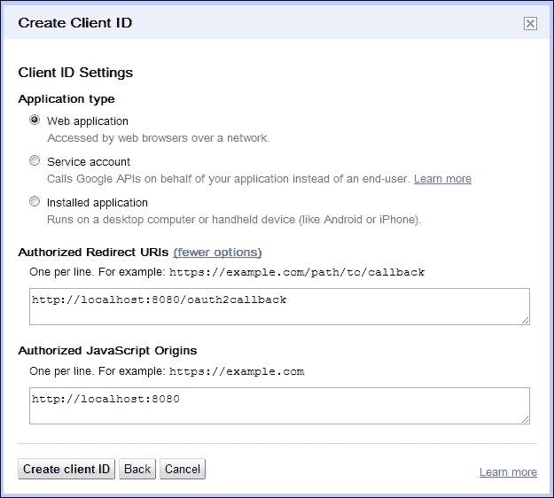
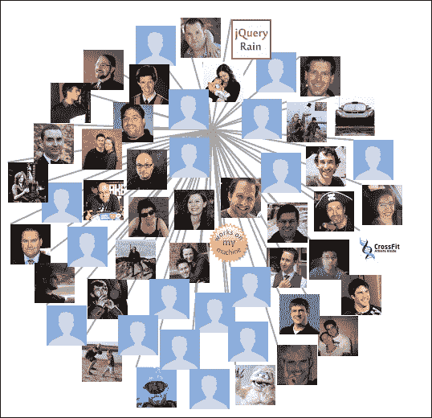

# 第八章：Google+

在主要的社交网站中，Google+是最新的成员。虽然是个新手，但它确实拥有庞大的用户基础，声称拥有超过 3.5 亿活跃账户（[`ca.ign.com/articles/2013/05/02/report-google-bigger-than-twitter-with-359-million-active-users`](http://ca.ign.com/articles/2013/05/02/report-google-bigger-than-twitter-with-359-million-active-users)）。这并非 Google 首次尝试打入价值十亿美元的社会媒体市场。他们过去曾创建过 Google Buzz、Google Friend Connect 和 Orkut，试图获得大量用户基础。除 Orkut 外都已停止使用，其用户基础几乎全部位于巴西。Google 故意没有创建写入 API，希望这能消除自动发布的垃圾信息。Google+提供了一个只读 API，我们可以利用它来创建可视化；然而，与其他此类 API 相比，该 API 非常有限——在本书撰写时，你甚至不能列出一个圈子的成员。

# 创建一个应用

Google+是另一个 OAuth 2.0 网站，因此我们当然需要获取一个应用程序密钥作为创建任何可视化的第一步。这也意味着我们将需要一个返回 URL，因此我们再次需要设置一个 HTTP 服务器来运行可视化。

第一步是使用你的 Google 账户登录[`code.google.com/apis/console`](https://code.google.com/apis/console)。如果你没有这样的账户，你也可以从那个页面创建一个。一旦到达该网站，你将看到一个巨大的按钮，允许你创建一个应用程序项目。这个控制台实际上管理着 Google 所有 API 的访问权限，而且有很多。

接下来，你将看到一个各种 API 的巨大列表。如果你向下滚动很久，最终会找到 Google+（使用搜索功能，这将节省你数小时的滚动时间）。将开关切换到“开启”位置。你可能需要同意几个用户协议。确保像往常一样阅读整个协议。

下一步是请求一个新的密钥，如下面的截图所示。这可以在**API 访问**标签中完成，在此标签中你应该点击**创建 OAuth 2.0 客户端 ID…**。在打开的对话框中，你需要填写一个应用程序名称和一个 URL。这不是 OAuth 交换的 URL；那在下一个标签里。在这个标签中，输入一个 URL，OAuth 请求可能从中发起并返回。对于我们来说，`http://localhost:8080`将是域名：



然后我们将收到几个供我们应用程序使用的密钥。客户端 ID 是你想在脚本中使用的字段。

# 检索数据

和 Facebook 一样，我们可以针对 OAuth 2.0 端点进行手动认证，但让我们使用 Google 提供的 API。连接起来非常简单：

```js
document.addEventListener("DOMContentLoaded",
 function() {
    var po = document.createElement('script');
    po.type = 'text/javascript'; po.async = true;
    po.src = 'https://plus.google.com/js/client:plusone.js';
    var s = document.getElementsByTagName('script')[0];
    s.parentNode.insertBefore(po, s);
  });
```

当文档准备就绪时，这将运行并从 Google 服务器加载 API 脚本，通过在页面中插入一个新的`script`标签，该标签位于包含 jQuery 的标签之前。加载的文档包含一组可以与 Google API 交互的 JavaScript 函数，但不是特定于 Google+ API——这发生在登录之后。

要添加一个登录按钮，我们添加以下 HTML 代码：

```js
<button class="g-signin"
   data-scope="https://www.googleapis.com/auth/plus.login"
   data-requestvisibleactions="http://schemas.google.com/AddActivity"
   data-clientId="988552574579.apps.googleusercontent.com"
   data-callback="onSignInCallback"
   data-theme="dark"
   data-cookiepolicy="single_host_origin">
</button>
```

这将生成登录按钮。这个按钮上附着的各种`data-`属性由我们从 Google 加载的脚本处理。登录是对 Google+而不是其他 Google API 的。客户端 ID 应设置为创建应用时获取的 ID。最重要的是，指派了一个回调函数，当登录请求成功时将被激活。回调将动态加载 Google+ API：

```js
function onSignInCallback(authResult) {
      gapi.client.load('plus','v1', function(){
        if (authResult['access_token']) {
          $('#gConnect').hide();
 retrieveFriends();
        } else if (authResult['error']) {
          console.log('There was an error: ' + authResult['error']);
          $('#gConnect').show();
        }
        console.log('authResult', authResult);
      });
    }
```

一旦加载了 Google+的 API，我们就可以利用它，正如我们在高亮行所做的那样。这个函数还隐藏了登录按钮，所以用户不会尝试多次登录。`retreiveFriends`简单且只会发送一个请求以获取朋友列表：

```js
retrieveFriends: function(){
      var request = gapi.client.plus.people.list({
        'userId': 'me',
        'collection': 'visible'
      });
      request.execute(retrieveFriendsCallback);
    }
```

现在我们有了朋友列表，我们可以开始使用它们来构建一个简单的可视化。

# 可视化

`d3`故意避开了提供具体的可视化。没有一个函数你可以调用以得到条形图或散点图。相反，它提供了创建可视化的工具；这些工具进而提供高度的灵活性，并赋予创建独特可视化的能力。其中较为强大的工具之一是布局机制。布局提供了一些必须编写以实现某种可视化的样板代码。

我们将使用**力导向图**布局。力导向图提供了一种可视化相互连接数据的方法。节点之间联系的强度通常是一个关于节点之间关系密切程度的函数。

我们的第一步是将我们的数据转换为节点和边的列表。由于 API 返回的数据非常有限，我们只能建立你和你朋友之间的关系。这些关系将构成边或链接，而朋友则是节点：

```js
var nodes = [];
 var links = [];
var centerNode = { name: "Me"};
nodes.push(centerNode);
for(i = 0; i< data.items.length; i++){
   var node = { name: data.items[i].displayName, image: data.items[i].image.url};
   nodes.push(node);
   links.push({source: centerNode, target: node});
}
```

现在我们有了节点和链接，我们可以使用它们来创建一个力布局：

```js
var graph = d3.select("#graph");
var force = d3.layout.force().charge(-120).linkDistance(100).size([500,500]).nodes(nodes).start();
```

`charge`和`linkDistance`函数控制节点分散自己的范围。对于链接，我们绘制一条简单的线来表示它们：

```js
var link = graph.selectAll(".link").data(links).enter().append("line").attr("class", "link");
```

节点有点复杂，因为对于每一个我们需要从 Google+数据中设置一个图片，初始位置以及大小。我们还需要给节点附加一个事件处理程序，这样当拖动时，`force.drag`动作会被触发：

```js
var node = graph.selectAll(".node").data(nodes)
           .enter()
            .append("image")
             .attr("xlink:href", function(d){ return d.image;})
            .attr("class", "node")
            .attr("r", 15)
            .attr("x", 250)
            .attr("y", 250)
            .attr("width", 50)
            .attr("height", 50)
            .call(force.drag);
```

最后，我们需要指示`d3`在动画化图形时对每个刻度采取什么行动：

```js
force.on("tick", function () {calculatePosition(link, node);});
```

这将生成一个图表，显示我在 Google+上与朋友的链接，如下面的屏幕截图所示。如果你点击并拖动一个节点，它将会移动，所有节点都会重新平衡自己以适应这种移动：



# 摘要

Google+的`limited` API 确实限制了我们可以创建的一些可视化。多年来一直有传言称 Google 将在 Google+中提供额外的功能，但到目前为止我还没有看到任何真正的行动。你现在应该能够对 Google+进行身份验证并从中获取数据。你也应该能够使用`d3`提供的图形美观的力导向布局以及其他可用的布局。
