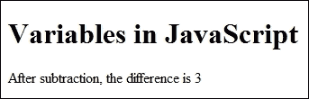
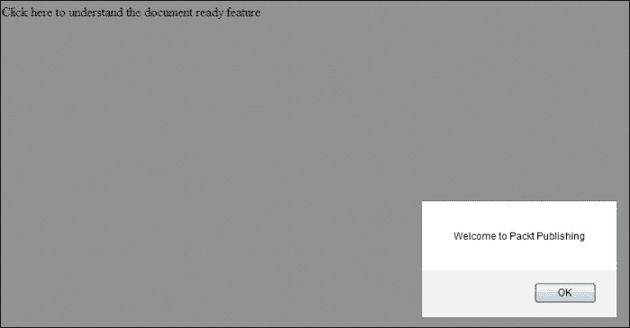

# 第一章： JavaScript 思维方式

JavaScript 是一种用于 Web 的脚本语言。在深入研究 JavaScript 的复杂性之前，我们需要知道它为何被使用。尽管 HTML 能告诉您的浏览器页面将呈现何种外观，但 JavaScript 将用于动态内容以及增加功能。

开始学习 JavaScript 的先决条件如下：

+   对 HTML 的先前知识

+   一个文本编辑器，例如记事本

+   您的网页浏览器上已启用 JavaScript

JavaScript 不需要编译器来执行代码。JavaScript 可以嵌入 HTML 代码中。当页面加载时，网络浏览器解释 JavaScript。

在本书中，我们将采用一种实用方法，以便我们能对 JavaScript 有更深入的了解。到本书结束时，我们应该能够理解 JavaScript 的概念，以便我们能够在现实生活中的应用程序中实现它。

# 应用 JavaScript

与其拐弯抹角，迷失在大量的理论中，不如直接开始一个简单的代码。

让我们来看一下以下代码，以了解 JavaScript 是如何应用于网页的：

```js
<!DOCTYPE html>
<html>
<head>
<title> Introduction to JavaScript </title>
<script type="text/javascript">
  alert(" Welcome to Packt ");
</script>
</head>
</html>
```

当我们查看此代码时，我们可以看到在`<head>`部分包含了一行：`script type="text/javascript"`。`script`标签及其`type 属性`告诉浏览器我们在 HTML 代码中引入了 JavaScript。我们还可以看到代码中有一个`alert`命令。我们将在本书的后面章节中讨论`alert`命令。执行代码后，我们可以在屏幕上看到以下输出：


我们可以看到，JavaScript 代码必须插入到`<script>`和`</script>`标签之间。

我们的 JavaScript 代码可以放在`<head>`或`<body>`标签中。这是取决于网页的选择问题。如果有很多样式和视频，最好将 JavaScript 代码放在`<body>`标签中。这确保了在 JavaScript 发挥作用之前，网页及其资源已经完全加载。另一个原因是，除了 JavaScript 文件以外的任何资源都是异步加载的。然而，当加载 JavaScript 文件时，它是逐个加载的。这会影响性能。

我们必须明白，如果有很多代码要编写，总是系统地将 JavaScript 代码与 HTML 代码分开是很有系统的。在本书中，为了方便起见，我们将把 JavaScript 代码嵌入到 HTML 代码之间的`<script>`标签中。然而，在现实情况下，将 JavaScript 代码作为独立的文件是一个好的实践。为此，我们需要创建一个独立的 JavaScript 文件并将其保存为`.js`扩展名。JavaScript 代码必须写在这个单独的`.js`文件中。假设我们创建了一个名为`main.js`的 JavaScript 文件。然后在我们的 HTML 代码中调用`main.js`文件。让我们来看一个代码示例，以查看该过程：

```js
<!DOCTYPE html>
<html>
<head>
<title> Introduction to JavaScript </title>

<script type="text/javascript" src="img/main.js"></script>

</head>
</html>
```

在`.js`文件中，我们需要编写以下代码片段：

```js
alert(" Welcome to Packt ");
```

当我们执行代码时，我们将得到与前面示例相同的输出。正如我们所见，我们通过在 HTML 文件中使用以下代码调用了 `main.js` 文件：

```js
<script type="text/javascript" src="img/main.js"></script>
```

在这里，`main.js` 文件应该与 HTML 文件在同一目录下。如果它在不同的文件夹中，我们需要指定整个路径。

因此，我们已经了解了如何在代码中应用 JavaScript 的过程。

# 变量

在 JavaScript 中，我们需要容器来存储用于处理的数据和值。因此，我们在 JavaScript 中使用变量。我们可以将数字或字符串值赋给变量。字符串需要用引号括起来。我们还有常量的概念。**常量** 被分配一个在脚本中永久的值，与变量不同，变量的值可以被改变。

让我们来看看在 JavaScript 中我们是如何声明变量和常量的：

```js
var amount;
var amount=5;
const a;
```

很明显，变量应该由 `var` 关键字前缀，而常量必须由 `const` 关键字前缀。我们还可以看到，在声明时可以将值赋给变量。

### 注意

`const` 兼容所有现代浏览器版本，除了 Internet Explorer。

变量可以是局部的或全局的。让我们看看如何区分局部变量和全局变量。

### 注意

请记住，JavaScript 是大小写敏感的。因此 "myAttribute" 与 "myattribute" 是 *不同的*。还需要注意的一点是，每条语句都以分号结束。引号内的空格将在输出中反映出来。

## 全局变量和局部变量

**全局变量** 可以从脚本中的任何位置访问，而 **局部变量** 只能在函数内部访问。

让我们来看一下以下代码以更好地理解它：

```js
<!DOCTYPE html>
<html>
<head>
<title> Introduction to JavaScript </title>
</head>
<body>
<h1> Variables in JavaScript </h1>
<script type="text/javascript">
  function subtraction(a, b)
    {
      var c;
      c = a-b;
      return c;
    }
  var z = subtraction(10, 7);
  document.write("After subtraction, the difference is " + z);
</script>
</body>
</html>
```

在代码中，`a` 以及 `b` 被作为参数传递给函数。`a` 和 `b` 是局部变量，只能在函数内部访问，因为它们存在于函数中。然而，`z` 是在函数外部声明的，因此是一个全局变量。

我们可以看到以下屏幕截图中执行代码的输出：



函数将在本书的“函数”一节中解释，所以目前让我们专注于变量。

为了更好地理解变量的作用域和概念，让我们来看一下以下代码：

```js
<html>
<head>
<title> Scope of variables </title>
</head>
<body>
<script type="text/javascript">
  var a = "Packt publishes Books on Technology";
  var b = "Welcome to Packt";
  function Packt()
    {
      var a = "Packt Publishing has an online book library";
      alert(a);
      alert(b);
    }  
  Packt();
  alert(a);
</script>
</body>
</html>
```

执行后，我们按照以下顺序看到三个警告：

+   Packt Publishing 有一个在线图书图书馆

+   欢迎来到 Packt

+   Packt 出版科技书籍

从输出中可以看出，函数可以访问局部变量（因此第一个警告）以及全局变量（因此第二个警告）。然而，任何特定函数之外的代码无法访问该函数内的变量（因此第三个警告）。这清楚地解释了全局变量和局部变量的概念。

# 操作符

JavaScript 中常用的三种操作符如下：

+   算术操作符

+   逻辑操作符

+   比较操作符

## 算术操作符

以下表格显示了各种算术操作符：


表中提到的操作符用于算术运算。

**加法**、**减法**、**乘法**和**除法**操作符是容易理解的。**取模**操作符（%）用于除法后的余数（我们称之为模数）。递增操作符用于将值增加 1，递减操作符用于将值减少 1。

例如，`x=x+1` 也可以写成 `x++`，而 `y=y-1` 可以写成 `y--`。

## 逻辑操作符

以下表格显示了不同类型的逻辑操作符：


**AND** 操作符用于当所有条件都必须满足时。例如，`X>5 && y=5` 的意思是 `x` 应该大于 5 且 `y` 必须等于 5 条件才为真。

**OR** 操作符用于当一个条件为真时。例如，`x=5 || y<3` 的意思是当 `x` 等于 5 或 `y` 小于 3 时条件为真。

**NOT** 操作符用于当反面为真时。例如，`!(x>5)` 当 `x` 等于或小于 5 时为真。

# 条件和循环

JavaScript 的主要目的是添加动态功能。为了执行许多动作和迭代，JavaScript 中有条件和循环的概念。`if-else` 语句主要用于各种条件。`If-else` 语句的结构如下：

```js
if (condition)
  {
    JavaScript statements to be executed
  }
else
  {
    JavaScript statements to be executed
  }
```

例如，考虑以下代码片段：

```js
If (i>5)
  {
    x=50;
  }
else
  {
    x=100;
  }
```

这段代码的解释很简单。如果 `i` 的值大于 5，`x` 的值将是 `50`。如果 `i` 的值不大于 `5`，那么 `x` 的值将是 `100`。

有时，我们知道要执行的迭代次数。比如说，我们需要执行代码并得到输出，比如 10 次。在这种情况下，我们使用循环来执行多次迭代，因为我们知道循环将重复的次数。在本章中，我们将看到 `for` 循环的一个例子。

`for` 循环的结构如下：

```js
for (initialization;condition;increment)
  {
    JavaScript statements
  }
```

让我们来看一个代码片段：

```js
<!DOCTYPE html>
<html>
<body>
<script type="text/javascript">
  for (i=0;i<5;i++)
    {
      document.write(i+ "<br>");
    }
</script>
<p>Hi</p>
<p>This is an example of the execution of the for loop</p>
</body>
</html>
```

代码执行后的输出将如下所示：


# 函数

函数是 JavaScript 的重要组成部分。让我们来理解一下函数的概念。我们知道 JavaScript 的命令目的是为了给网页添加功能。比如说，我们想在 JavaScript 中添加某些功能。假设我们需要在网站的不同页面或同一网页的不同地方实现它。我们不是每次都添加功能，而是可以利用函数的概念，一次性声明函数。从那时起，我们可以在多个网页或网站上不同的地方多次使用它。

JavaScript 中有很多内建函数。我们也可以在 JavaScript 中编写自己的函数，并根据需要进行定制。让我们看看下面的代码，了解函数是如何工作的：

```js
<!DOCTYPE html>
<html>
<head>
<title> Java Script in a nutshell </title>
<h1> Functions in JavaScript </h1>
<p> Click on "Click Here" to execute the code in the function </p>
<script type="text/javascript">
  function PacktPub()
    {
      var x = prompt("Hey", "");
      alert("Welcome to Packt, " + x);
    }
</script>
</head>
<body>
<a href="javascript:PacktPub()">Click Here</a>
</body>
</html>
```

代码的执行将给我们以下输出：


点击**点击这里**链接，我们可以看到以下输出：


我们得到一个请求输入的提示框。比如说我们输入了名字`Joe`并点击了`OK`。我们将得到以下定义在代码中的警告框。


现在让我们了解代码是如何工作的。我们在代码中使用了两个内建函数：

+   `alert`

+   `prompt`

`alert`和`prompt`是 JavaScript 的内建函数。

### 注意

JavaScript 是大小写敏感的；因此，我们必须使用小写字母`alert`和`prompt`，否则代码将无法工作。

`alert`和`prompt`函数在 JavaScript 中经常使用。当我们需要通知用户某些发展时，使用警告框。它也用于在用户点击链接或浏览网站之前给用户一些信息。同样，当我们在用户访问页面之前需要用户输入时，使用提示框。

如果你观察代码，可以明显看出`PacktPub()`函数在调用之前被声明了。在`PacktPub()`函数中，我们使用了`prompt`和`alert`函数。执行`prompt`命令时，将提示用户输入。`Hey`后面的双引号（`""`）是作为默认输入的字符串。在代码中，`x`是一个变量，被分配了一个`prompt`函数。再次，`x`在接下来的同一行`alert`命令中使用。

一旦我们输入了名字`Joe`，我们就会得到一个警告：`欢迎来到 Packt，Joe`。

到现在为止，函数的概念应该是清晰的。函数在 JavaScript 中广泛使用，并在实际编程中广泛用于返回值。因此，函数是 JavaScript 的重要组成部分。

# 对象及其在 JavaScript 中的作用

JavaScript 是一种面向对象的语言。我们有如`Math`、`Date`和`Document`等内建对象，提及几个。然而，我们也可以创建自己的对象，并定制它们以满足我们的需求。

对象有属性和方法来定义它。这些属性使 JavaScript 中的面向对象概念具有意义。**属性**是定义对象值的属性。方法定义可以在对象上实现的动作。

让我们看一下以下代码，了解属性是如何为对象定义值的：

```js
<!DOCTYPE html>
<html>
<body>
<script>
  var animal=new Object();
  animal.species="Dog";
  animal.nickname="Monster";
  animal.age=10;
  animal.eyecolor="brown"; 
  document.write(animal.nickname + " is a dog that has " + animal.eyecolor + " eyes");
</script>
</body>
</html>
```

代码的输出将如下所示：


因此，我们为一只名叫 Monster 的狗定义了属性。如果你观察代码和输出，我们可以看到我们使用连接符将属性连接起来，这个连接符被称为连接操作符。连接操作符用于将几个文本片段连接在一起。需要记住的一点是，字符串中的空格会被考虑进去。看看我们在" is a dog that has "字符串前后的空格，以及它在输出中的反映。回到对象，我们通过指定狗的名字、年龄和眼睛颜色来定义狗的属性。

在 JavaScript 中，所有的用户定义的对象和内置对象都属于一个名为`Object`的对象。让我们来了解一下`new`操作符和构造函数的概念。在之前的代码中，有一行代码`var animal=new Object();`。因此，很明显`new`操作符是用来创建对象实例的。这里使用的构造函数是`Object()`。`new`操作符总是后面跟着一个构造方法。这解释了创建新对象代码的结构。

我们不仅可以使用内置函数，还可以使用用户自定义的函数。让我们看看下面的代码来了解它是如何工作的：

```js
<html>
<head>
<script type="text/javascript">
  function rate(cost){
    this.sellingPrice = cost;
  }
  function prose(name, company){
    this.name= name; 
    this.company  = company;
    this.rate = rate; 
  }
</script>
</head>
<body>
<script type="text/javascript">
  var y = new prose("JavaScript", "Packt Publishing");
  y.rate(50);
  document.write("The name of the book is " + y.name+ "<br>");
  document.write("The name of the publishing company is : " + y.company + "<br>");
  document.write("The cost of the book is $" + y.sellingPrice+ "<br>");
</script>
</body>
</html>
```

代码的输出如下：


我们需要理解函数和方法是非常相似的。唯一的区别是，**函数**是一组独立的语句，而**方法**属于一个对象，可以通过`this`关键字来引用。在代码中，我们定义了`rate`函数作为方法；然后我们将`rate`方法作为函数属性赋值。因此，我们在 JavaScript 对象中看到了属性和方法的概念。

正如我们提到的，JavaScript 是一种面向对象的语言。和任何面向对象的语言一样，OOP 概念也适用于 JavaScript。**封装**、**继承**、**抽象**和**多态**是 OOP 可以应用于 JavaScript 的特性。

# 数组

像 C++、Java 和 PHP 这样的许多编程语言都使用数组的概念。同样，我们在 JavaScript 中也使用数组的概念。JavaScript 中的对象用于存储和操作数据。到目前为止，我们看到的变量都只限于单一的数据。然而，在数组中，我们可以存储多个项目，并且轻松地检索它们。

数组可以通过不同的方式创建。让我们看看以下代码片段来更好地理解：

```js
var animals = new Array();
animals[0]="cat";
animals[1]="dog";
animals[2]="mouse";
```

我们也可以通过直接在`new Array`构造函数中输入项目来创建数组。以下代码片段将展示它是如何工作的：

```js
var animals = new Array("cat", "dog", "mouse");
```

我们也可以不使用`new Array`构造函数来定义数组。

```js
var animals = ["cat", "dog", "mouse"];
```

数组的索引位置从 0 开始。索引功能帮助我们访问数组中存储的数据。假设我们按照以下方式定义数组：

```js
var animals = ["cat", "dog", "mouse"];
```

如果我们想要检索数组中的第三个项目，我们需要指定其索引位置。

让我们看看以下代码，了解它是如何工作的：

```js
<html>
<head>
<title> Index in Arrays </title>
</head>
<body>
<script type= "text/javascript">
var animals = ["cat", "dog", "mouse"];
var x = animals[2];
document.write(x);
</script>
</body>
</html>
```

以下代码的输出将如下所示：


数组有内置的属性和方法。例如，`length`是数组的属性。让我们看看以下代码，了解它是如何工作的：

```js
<html>
<head>
<title> Index in Arrays </title>
</head>
<body>
<script type= "text/javascript">
var animals = ["cat", "dog", "mouse"];
y=animals.length
document.write(y);
</script>
</body>
</html>
```

代码的输出将是`3`。

简要地，让我们看看数组的各种属性和方法：

+   **push** ：在数组的末尾添加一个项

+   **pop** ：删除数组末尾的项

+   **reverse** ：反转数组中元素的顺序

+   **toString** ：将数组转换为字符串

+   **sort** ：按字母或数字顺序对项目进行升序或降序排序

# jQuery 概述——当务之急

jQuery 是一个多浏览器 JavaScript 库，由 John Resig 发明。它是一个开源库。运用 jQuery 可以轻松地开发带有大量动画和导航的现代复杂网站。**jQuery 移动**（**JQM**）也是 jQuery 的一个分支。随着智能手机和平板电脑的出现，响应式网页设计成为当今的趋势。利用 jQuery 可以实现响应式网页设计。

## 将 jQuery 添加到网页

以下是一些将 jQuery 添加到网站的方法：

+   通过下载库的一个副本来在本地包含 jQuery

+   包含托管的 jQuery 副本

让我们看看下面的两个程序。

### 通过下载库的一个副本在本地包含 jQuery

当我们访问[`jquery.com/`](http://jquery.com/)下载库的副本时，我们可以看到两个不同的版本。下载部分中的第一个版本是 Minified Production jQuery 版本，而第二个版本是 Uncompressed Development 版本。这两个版本之间有区别。

Uncompressed Development 版本可读性强，有很多空格和注释，以便更好地理解代码。因此，建议你在学习 jQuery 或开发阶段使用 Uncompressed Development 版本。

Minified Production 版本精确，不像 Uncompressed Development 版本那样有空白。此外，变量被赋予简短的名字，注释被移除，以及其他压缩技巧，以尽可能减少文件的大小。因此，在部署时，建议使用 Minified 版本，因为较短的文件在加载页面时需要下载。让我们看看我们是如何将 jQuery 文件本地添加的。

当我们访问网站时，我们可以查看 Minified Production 和 Uncompressed Development 版本。点击你选择的版本，它将像下面的 figure 所示在浏览器中加载。

在我们的案例中，我们将下载压缩版：


复制文件内容并将其保存为文本文件，给它一个`.js`扩展名。在我们的案例中，我们将将其保存为`latestjquery.js`。确保您将文件保存在与您的项目相同的目录中，这样我们就可以直接调用它。以下代码片段显示了我们如何在网站上包含 jQuery：

```js
<!DOCTYPE html>
<html>
<head>
<title>Including jQuery</title>
<script type="text/javascript" src="img/latestjquery.js"></script>
<script type="text/javascript" src="img/ourjavascriptpage.js"></script>
</head>
<body>
<p>jQuery: an amazing JavaScript library</p>
</body>
</html>
```

在前面的代码中，我们在任何 JavaScript 代码（例如`ourjavascriptpage.js`）之前调用了`latestjquery.js`（我们的 jQuery 文件）。因此，很明显我们需要首先包含 jQuery，因为我们的代码需要在使用它之前找到完全加载的 jQuery。将 jQuery 文件包含在我们的`<head>`部分是一个良好的实践，因为它必须完全加载。现在让我们来看看将 jQuery 包含在我们网站上的第二种方法。

### 包含 jQuery 的托管副本

我们可以使用 Google 或 Microsoft 的**内容交付网络**（**CDN**）来托管 jQuery 文件。让我们来看看以下代码片段，了解它是如何工作的。

如果我们访问 Google CDN，我们可以看到以下代码片段，必须包含在 jQuery 使用中：

```js
<script src="img/jquery.min.js"></script>
```

如果我们访问 Microsoft CDN，我们可以看到以下代码片段，必须包含在 jQuery 使用中：

```js
<script src="img/jquery-1.9.0.js"></script>
```

我们也有一个压缩版可以使用：

```js
<script src="img/jquery-1.9.0.min.js"></script>
```

记住，我们需要在 JavaScript 文件之前包含这个代码片段，因为如果我们需要使用它，jQuery 必须完全加载。

## 使用文档就绪功能

在我们理解文档就绪功能之前，让我们看看以下代码：

```js
<html>
<head>
<title>Understanding the document ready function</title>
<script src="img/jquery-1.9.0.js"></script>
<script type="text/javascript">
$("p").click(function() {
  alert("Welcome to Packt Publishing");
});
</script>
</head>
<body>
<p>Click here to understand the document ready feature</p>
</body>
</html>
```

执行后，我们可以看到以下输出：


根据代码，当我们点击文本时，会显示一个阅读“欢迎来到 Packt 出版社”的警告对话框。

然而，我们并没有看到任何警告框。这是因为事件必须在页面加载之前触发，或执行期望的动作。如果你观察代码，警告框没有显示，因为方法在`click`事件发生之前没有调用。通过使用文档就绪功能，我们可以解决此问题。让我们稍微修改代码，并包含文档就绪功能。

```js
<html>
<head>
<title>Understanding the document ready function</title>
<script src="img/jquery-1.9.0.js"></script>
<script type="text/javascript">
$(document).ready(function() {
  $("p").click(function() {
      alert("Welcome to Packt Publishing");
    });
});
</script>
</head>
<body>
<p>Click here to understand the document ready feature</p>
</body>
</html>
```

执行代码后将显示以下输出：


然而，这里的区别是，在输出的文本上点击后，将显示以下警告框：



因此，在 jQuery 中包含文档就绪功能是一个良好的实践。我们必须使用以下语法来实现文档就绪功能：

```js
$(document).ready(function()
```

如果我们观察代码片段，函数是必须在文档准备好后执行的回调函数。我们还可以看到一个`$`符号。`$`符号是`jQuery()`函数的同义词。在标签名、标签 ID 或类之前，我们可以使用`$`而不是`jQuery`。它简化了，并显示它是一个 jQuery 代码片段。使用适当的语法可以使代码更简洁、更短；当页面加载时，这是非常重要的。

## 使用 jQuery 访问 DOM 元素

与 CSS 类似，我们可以在 jQuery 中使用**文档对象模型**（**DOM**）访问元素。在 JavaScript 中，我们使用`getElementByID`函数通过使用它们的 ID 来访问 DOM 中的元素。然而，我们可以在 jQuery 中用更短的代码做到这一点。

### 使用 ID

让我们看看以下代码片段，了解我们如何通过 ID 访问元素：

```js
$(document).ready(function()
  {
    var x = $("#packt");
  });
```

对于具有 ID `packt`的元素，我们可以使用`#`操作符来引用，这与在 CSS 中进行的方式相似。我们需要记住，ID 前面必须有一个`#`，并且应该用双引号括起来。

### 使用类

让我们看看以下代码片段，了解我们如何通过类名访问元素：

```js
$(document).ready(function()
  {
    var y = $(".pubman");
  });
```

对于定义了类`pubman`的元素，我们可以使用点（`.`）操作符来引用。类前面必须有一个点（`.`）操作符，这与在 CSS 中进行的方式相似。然而，类必须用双引号括起来。

### 使用标签

让我们看看以下代码片段，了解我们如何通过标签名访问元素：

```js
$(document).ready(function)
  {
    var links = $("a");
  });
```

在 jQuery 中，可以通过引用由双引号括起来的标签名来访问元素。

## 匿名函数

让我们看看在 jQuery 中如何使用匿名函数。

以下代码将让我们了解其功能：

```js
$(document).ready(function()
  {
    $('#packt').click(function()
      {
        $('div').remove();
      });
  });
```

让我们理解代码的含义。

文档准备功能已经解释过。然后我们查询具有 ID `packt`的 DOM 元素，并为它分配一个`click`事件。在函数内部，我们包括了`remove`方法，这将删除所有`<div>`元素。

### 注意

对于 jQuery 中使用的各种方法，我们可以查看诸如《jQuery 设计师：初学者指南》之类的书籍，这些书籍在 Packt 网站上有售，网址为[www.packtpub.com](http://www.packtpub.com) 。另外，我们还可以参考 Packt 在线图书馆，网址为[`packtlib.packtpub.com/`](http://packtlib.packtpub.com/) 。

jQuery 广泛用于动画。现在让我们看看以下代码，了解我们如何在网页上隐藏和显示元素：

```js
<html>
<head>
<title>jQuery Animation</title>

<script src="img/jquery-1.9.0.js"></script>
<script type="text/javascript">

  $(document).ready(function() {
    $("#packt").click(function () {
      $(".pubman").show( 2000);
    });

     $("#packtpub").click(function () {
       $(".pubman").hide( 3500 );
     });

  });
</script>
<style>
.pubman{ margin:5px;padding:7px;
    border:3px dashed navy;
    color:lime;
    width:110px;
    height:40px;
    display:inline;
        }
</style>
</head>
<body>
<br>
<div class="pubman">
Packt Publishing
</div>

<input id="packtpub" type="button" value="Click here to Hide" />
<input id="packt" type="button" value="Click here to Display" />

</body>
</html>
```

让我们看看代码执行后的输出：


当我们点击**点击这里隐藏**时，包含文本**Packt Publishing**的盒子消失。当我们点击**点击这里显示**时，盒子再次出现。我们在 jQuery 代码中使用了`show()`方法以及`hide()`方法。我们还指定了过渡所需的时间（以毫秒为单位）。

因此，我们可以看到使用 jQuery 创建动画是多么简单。还有其他各种方法，比如`toggle`和`fade`等，但是我们在本书中无法涵盖 jQuery 所提供的一切。

jQuery 是一个广泛的主题，本书只探讨其中的一个方面。Packt 有很多关于 jQuery 的书籍，比如《jQuery for Designers: Beginner's Guide》，Packt 出版社出版，你可以访问我们网页上的[`www.packtpub.com/books?keys=jquery`](http://www.packtpub.com/books?keys=jquery)，查看各种针对您需求的 jQuery 书籍。

编程多练习就会更熟练。如果你能在 Notepad 或 Notepad++等编辑器上复制本书提到的代码并进行练习，我们将非常感激。当你把在这本书中学到的知识应用到现实生活中时，你会发现实际操作 JavaScript 是多么有趣。本书涵盖了对象和数组。有各种各样的对象，比如`Math`对象和`Date`对象等。然而，不可能在这里涵盖一切内容。
