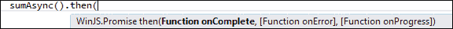

# 三、Windows 应用的 JavaScript

在本章中，我们将介绍用于 JavaScript 的**Windows 库**（`WinJS`库）提供的一些功能，Microsoft 引入该库是为了使用 JavaScript 访问 Windows 应用商店应用的 Windows 运行时。Windows Library for JavaScript 是一个 CSS 和 JavaScript 文件库。它包含一组功能强大且功能丰富的 JavaScript 对象、函数和方法，这些对象、函数和方法被组织到名称空间中，目的是使开发人员更容易使用 JavaScript 创建 Windows 应用商店应用。

我们还将学习使用`WinJS`进行异步编程，并了解如何查询文档中的元素，以及如何使用`WinJS.Utilities`命名空间提供的函数操作这些元素。接下来，我们将了解`xhr`函数及其使用，并最终介绍 Windows JavaScript 库提供的一组 UI 控件。

# 带 Promise 对象的异步编程

当构建 Windows 8 应用时，重点在于具有响应性的 UI，这是 Windows 8 应用商店应用的主要特征之一。在[第 2 章](02.html "Chapter 2. Styling with CSS3")中*使用 CSS3*进行造型，我们了解了如何在的造型层次上实现这一点。响应用户界面还包括具有响应功能，其中后台运行的代码不仅会突然阻止应用的用户界面，而且会在执行某些逻辑或功能时使其对任何用户输入无响应。

JavaScript，作为一种编程语言，是单线程的，这意味着长时间运行的进程的同步执行将阻止所有其他执行，直到该进程完成。因此，应该尽可能避免同步执行。这种困境的解决方案是异步处理，这对于创建响应迅速的高性能应用至关重要。实现异步处理的一种方式是使用**回调函数机制**。在前一个异步操作终止后，使用回调函数作为钩子点继续处理。一个典型的例子是对服务器端后端的调用。

```js
//code sample using jQuery
function longRunningComputation(callbackFunc){
    setTimeout(function(){
        //computation
       //once finished, invoke the callback with the result
       callbackFunc(computationResult);
    }, 1000);
}
```

然后按如下方式调用此函数：

```js
longRunningComputation(function(compResult) {
    //do something meaningful with the result

});
```

回调函数是异步调用的典型解决方案，但它们有一个缺点：它们会创建深链，特别是当您在一个链中放置多个异步操作时，后续函数依赖于先前计算的结果。Windows Library for JavaScript 和 Windows Runtime 提供了一个更为优雅的解决方案，使用了一种称为**Promise**的机制，简化了异步编程。承诺，顾名思义，意味着将来会发生一些事情，据说在事情完成之后，承诺就会实现。

在下面的代码示例中，我们创建了一个名为`sumAsync`的函数，该函数将返回一个`WinJS.Promise`对象，并在`clickMe()`函数中调用它时异步执行：

```js
function clickMe() {
   sumAsync().then(
        function complete(result) {
            document.getElementById("result").textContent = "The promise has completed, with the result: " + result;
        },
        function error(result) {
            document.getElementById("result").innerHTML = "An Error has occurred </br>" + result;
        },
        function progress(result) {
            document.getElementById("result").innerHTML += "The promise is in progress, hold on please." + result;
        })
}
function sumAsync() {
    return new WinJS.Promise(function (comp, err, prog) {
        setTimeout(function () {
            try {
                var sum = 3 + 4;
                var i;
                for (i = 1; i < 100; i++) {
                    prog(i);
                }
                comp(sum);
            } catch (e) {
                err(e);
            }
        }, 1000);
    });
}
```

我们可以从前面的代码示例推断，`Promise`基本上是一个对象。此对象实现了一个名为`then`的方法，该方法依次以以下三个函数作为参数：

*   当`Promise`对象完成并成功完成时将调用的函数
*   在完成`Promise`对象时出现错误时将调用的函数，称为`future`
*   在执行`Promise`时调用的一个函数，用于指示进度信息，称为`deferred`

在 Visual Studio 中，当您向函数添加`then`方法时，IntelliSense 弹出窗口将提示您输入这些参数，如以下屏幕截图所示：



您可以将`then`方法与返回`Promise`的任何函数一起使用；因为它返回`Promise`，所以可以链接多个`then`函数。例如：

```js
sumAsync() 
  .then(function () { return XAsync(); })
  .then(function () { return YAsync(); })
  .done(function () {  endProcessing();})
```

在上例的中，我们将多个`then`方法添加到函数中，并使用`done`方法完成处理。

### 注

`done`方法采用与`then`相同的参数。但两者的区别在于`done`返回的是`undefined`而不是`Promise`，因此无法链接。此外，如果没有提供`error`函数来处理在处理过程中发生的任何错误，`done`方法会抛出异常，`then`函数不会抛出异常，而是返回处于`error`状态的`Promise`对象。

所有向 Windows 应用商店应用公开的 Windows 运行时 API 都包装在`Promise`对象中，公开返回`Promise`对象的方法和函数，允许您在应用中轻松实现异步进程。

# 使用 WinJS.Utilities 查询 DOM

应用的 UI 以 HTML 和相应的样式进行描述。当应用启动时，您应该期望与 UI 进行不同的用户交互。用户将触摸应用的某些部分；他/她将滚动，放大和缩小，或添加或删除项目。此外，该应用可能通过对话框或对话以及在屏幕上发布通知与用户进行交互。对此类交互的响应由代码处理，在我们的例子中，具体地说是由 JavaScript 代码处理。这就是`WinJS.Utilities`派上用场的地方，通过提供帮助函数来实现这一点；例如，用于添加/删除 CSS 类或插入 HTML 元素的函数。但是在与用户进行任何交互之前，必须使用 JavaScript 选择函数，该函数称为**查询 DOM**。

在[第 2 章](02.html "Chapter 2. Styling with CSS3")*中，我们看到了如何使用 CSS 选择器选择 DOM 的部分。JavaScript 通过使用传统的`document.getElementById`函数来实现内置函数。此函数的功能有限，不允许像 jQuery 选择器那样使用 CSS 选择器语法从 DOM 中选择，但是，现在 JavaScript 包括`querySelector()`和`querySelectorAll()`。这两个函数更强大，像 jQuery 选择器语法一样接受 CSS 查询。函数返回单个 DOM 元素，`querySelectorAll()`函数返回节点列表。这两个函数都存在于`document`和`element`对象上。因此，您可以查询文档以查找整个文档中的所有匹配结果，也可以只查询单个元素以查找其下的所有匹配对象。例如：*

```js
var postDiv = document.querySelector('#postDiv);
var allDivs = postDiv.querySelectorAll('div');
```

除了这两种 JavaScript 选择方法之外，`WinJS.Utilities`名称空间还提供了两个功能相似的选择元素的函数，即`id()`和`query()`。基本上，这些函数包装了`querySelector`和`querySelectorAll`函数，但返回的结果值不同。`WinJS.Utilities`提供的选择器函数返回一个`QueryCollection`对象，该对象反过来公开了对集合元素执行操作的各种操作，例如添加和删除类等。

下面的代码显示了使用`id()`和`query()`的语法。我们首先创建一个`WinJS.Utilities`对象，并对其调用这两个方法，如图所示：

```js
var utils = WinJS.Utilities; 
var postDiv = utils.id('postDiv');  
var allParagraphs = utils.query('p');
allParagraphs.setStyle("color", "red");
```

以下屏幕截图显示了 IntelliSense 窗口，其中列出了名称空间提供的函数：


当您需要对`document`的元素应用行为时，查询 DOM 也很有用。例如，您可能希望在用户单击特定按钮时添加功能。为此，我们首先查询该元素，然后向其添加一个`click`处理程序。以下代码显示了如何：

```js
  WinJS.Utilities.id("Btn").listen("click", function () {
    var p = document.createElement("p");
    p.innerHTML = "i was just added";
    document.querySelector("#postDiv").appendChild(p);
});
```

在前面的代码示例中，使用`listen()`方法将事件处理程序连接到 ID 为`Btn`的按钮的`click`事件；在这个处理程序中，我们正在创建一个新的`p`元素并将其添加到 ID 为`postDiv`的`div`元素中。

### 注

`WinJS.Utilities`名称空间提供的方法类似于 jQuery 中提供的函数的简化子集。

以下是您可以调用在`QueryCollection`中返回的对象的一些可用方法的列表：

*   `addClass`
*   `clearStyle`
*   `getAttribute`
*   `hasClass`
*   `query(query)`
*   `removeClass`
*   `removeEventListener`
*   `setAttribute`
*   `setStyle`
*   `toggleClass`
*   `children`

# 理解 WinJS.xhr

`xhr`函数基本上将对中`XMLHttpRequest`的调用封装在对象中。该功能对于跨域和内部网请求非常有用，如下代码所示：

```js
  WinJS.xhr(options).then(
     function completed(result) {
….
      },
     function error(result) {
….
      },
     function progress(result) {
….
      },
```

由于`WinJS.xhr`函数异步处理，并且返回一个`Promise`对象，我们可以将`then()`或`done()`方法传递给它，如上例所示。

您可以使用`WinJs.xhr`功能连接到 web 服务并下载不同类型的内容，例如在`WinJS.xhr`的`responseType`选项中指定的文本或 JSON 字符串。`responseType`选项接受一个字符串值，该字符串值指定请求所期望的响应类型，类型如下：

*   `text`：此为默认值，期望为字符串类型的响应
*   `arraybuffer`：此需要一个**ArrayBuffer**用于表示二进制内容，如整型或浮点型数组
*   `blob`：此需要一个**Blob**（**二进制大对象**），它是一个表示不可变原始数据的对象，通常具有较大的文件大小
*   `document`：此需要 XML 内容；即，MIME 类型为`text/xml`的内容
*   `json`：此需要一个 JSON 字符串
*   `ms-stream`：此需要一个`msStream`对象，该对象处理流式数据，并标记有特定于供应商的前缀（`ms`，因为 W3C 规范中尚未定义该前缀

除了`responseType`之外，还可以对`xhr`（`XMLHttpRequest`对象应用多个选项，除了`url`之外，其他都是可选的。这些方案如下：

*   `url`：此指定一个字符串，该字符串是 XML 数据或服务器端 XML web 服务的绝对或相对 URL
*   `type`：此指定一个字符串，表示使用的 HTTP 方法；例如，`GET`、`POST`或`HEAD`
*   `user`：此指定一个字符串，表示用于身份验证的用户的名称（如果需要）
*   `password`：此指定一个字符串，表示用于身份验证的密码（如果有）
*   `headers`：此指定一个表示自定义 HTTP 头的对象
*   `data`：此指定一个对象，该对象包含将与 HTTP 请求一起发送到服务器的数据；该数据直接传递给`XMLHttpRequest.send`方法
*   `customRequestInitializer`：此指定了一个可用于`XMLHttpRequest`上预处理的函数。

让我们填充关于如何从网站检索一些文本的基本语法，如下代码所示：

```js
WinJS.xhr(
{ url: 'http://www.msdn.microsoft.com/library', responseType: 'text' })
.done(function (request) 
{
    var text = request.responseText;
    document.getElementById("responseDiv").innerHTML = text;
},
function error(request) {
  var errorStatus = "Error returned: " + request.statusText;
  document.getElementById("errorDiv").innerHTML = errorStatus;
});
```

前面的代码示例将从指定的`url`字符串中检索文本，并将其插入到`div`元素`responseDiv`中；如果在处理过程中出现错误，我们将通过`statusText`在错误处理功能中检索该错误。

### 注

不建议使用`XMLHttpRequest`对象请求传输可能需要很长时间才能完成的超大对象，例如**Blob**和**FormData**对象。取而代之的是，您应该考虑使用 Windows 运行时 API 提供的文件上传 API 来进行此类操作。

# 引入一套新的控件

除了内容，你的应用还需要控件；常规 HTML 控件，如按钮、选择列表和复选框；以及一些 Windows 8 专用控件，如 AppBar 分级和设置。除了标准的内置 HTML 控件外，`WinJS`还提供了一组新的、功能丰富的控件，用于使用 JavaScript 的 Windows 应用商店应用。这些控件基本上是`WinJS.UI`名称空间中可用的对象；因此，日期选择器控件将类似于`WinJS.UI.DatePicker`。以下是您将在应用中使用的主要`WinJS.UI`控件列表：

*   `DatePicker`：此呈现可自定义的控件，用于选择日期值
*   `TimePicker`：此呈现可自定义的控件，用于选择时间值
*   `Menu`：此呈现用于显示命令的菜单弹出控件
*   `AppBar`：此呈现用于显示命令的应用工具栏
*   `FlipView`：此呈现要一次显示一个项目的项目集合
*   `ListView`：此在可定制的网格或列表布局中呈现项目集合
*   `Flyout`：该是显示类包含信息的弹出控件的控件；但是，它是轻量级的，不会创建单独的窗口，例如对话框
*   `Rating`：这是一个控件，允许用户对某物进行评分，可以显示三种类型的评分：暂定评分、平均评分或用户评分
*   `SemanticZoom`：此是一个控件，允许用户在放大和缩小视图之间进行缩放，该控件由两个单独的子控件提供，提供每种类型的视图：
*   `ToggleSwitch`：此呈现控件，允许用户在两种状态（on 和 off）之间切换选项
*   `Tooltip`：此呈现一个显示工具提示的控件，以显示有关对象的更多信息，并且可以支持丰富的内容（如图像）
*   `ViewBox`: This renders a control that scales a single child element it contains (without changing its aspect ratio) to make it fit and fill the available space

    ### 注

    这些控件将自动使用默认情况下在 Visual Studio 中创建的任何新 Windows 8 应用商店应用项目中显示的两个样式表之一设置样式。这两个样式表（一个带有深色主题，另一个带有浅色主题）将使您的应用具有 Windows8 的外观和感觉。

与标准 HTML 控件不同，`WinJS.UI`控件没有专用的标记元素或属性标记；例如，您不能像通常使用标准 HTML 元素（如`<input/>`）那样，继续向标记中添加`WinJS.UI.Rating`元素（如`<rating/>`）。要添加`WinJS.UI`控件，需要创建一个 HTML 元素，比如`div`，并使用`data-win-control`属性指定所需的控件类型。下面的代码显示了创建`WinJS.UI``Rating`控件的语法：

```js
<div id="ratingControlDiv" data-win-control="WinJS.UI.Rating"> </div>
```

这将在标记中声明评级元素，但在运行时不会加载应用中的控件。为了激活您在标记中声明的任何`WinJS`控件，JavaScript 代码必须调用`WinJS.UI.processAll()`函数来处理文档并初始化您创建的控件。当您使用 Visual Studio 中提供的任何模板创建应用时，`default.js`文件在代码中包含对`WinJS.UI.processAll`的调用，该调用在`app.onactivated`事件处理程序中声明。

运行应用时，您将看到新的`Rating`控件，如下所示：


您还可以通过调用`WinJS`控件的构造函数并将承载该控件的 HTML 元素传递给构造函数，在代码中创建`WinJS`控件。例如，如果我们的`div`具有`id`属性`ratingControlDiv`，则创建`Rating`控件的 JavaScript 如下：

```js
var ratingHost = document.getElementById("ratingControlDiv");
var ratingControl = new WinJS.UI.Rating(hostElement);
```

在这种情况下，将不需要调用`WinJS.UI.processAll`函数，因为您没有在标记中创建 JavaScript 控件。

此外，设置`WinJS`控件的属性与设置标准 HTML 控件的属性不同；后者具有专用于该目的的属性。例如，`range`类型的`input`元素具有`min`和`max`属性，其值可以在标记中设置，如下代码所示：

```js
<input type="range" min="2" max="10" />
```

对于 JavaScript 控件，我们必须使用`data-win-options`属性在标记中设置一个属性，该属性采用一个包含一个或多个属性/值对（多个属性用逗号分隔）的字符串，其基本形式如以下代码所示：

```js
data-win-options="{propertyName: propertyValue}"
```

下面的语法将显示如何为`WinJS.UI.Rating`控件设置`minRating`和`maxRating`属性：

```js
<div id="ratingHostDiv" data-win-control="WinJS.UI.Rating"
    data-win-options="{ minRating: 2, maxRating: 10}"> 
</div>
```

# 总结

我们已经瞥见了 Windows 8 中`WinJS`的一些功能和强大功能。我们学习了如何使用`Promise`对象实现异步编程。

此外，我们还介绍了`WinJS.Utilities`名称空间中提供的方法，这些方法允许我们检索和修改 HTML 文档的元素。我们还介绍了使用`WinJS.xhr()`函数检索不同类型的内容。

最后，我们了解了`WinJS`库提供的一组新控件，以及如何创建这些 JavaScript 控件并设置它们的属性。

在下一章中，我们将首先介绍所需的工具，然后了解为 Windows8JavaScript 应用提供的模板，从而开始使用 JavaScript 开发应用。此外，我们将创建一个非常基本的应用，并了解 JavaScript 应用的结构。我们还将了解 ListView 控件。