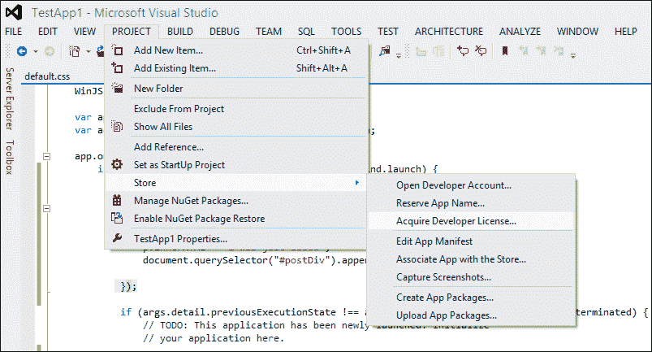
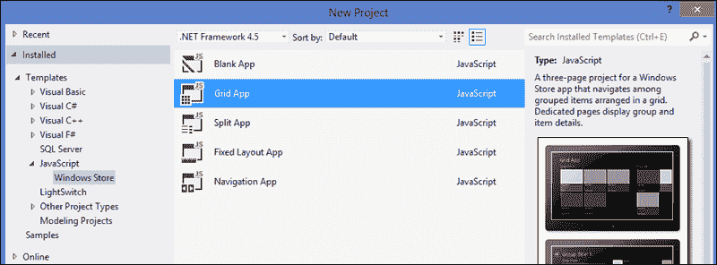
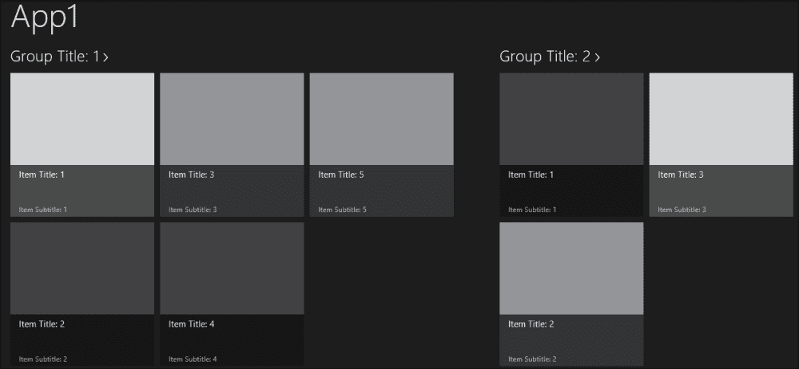
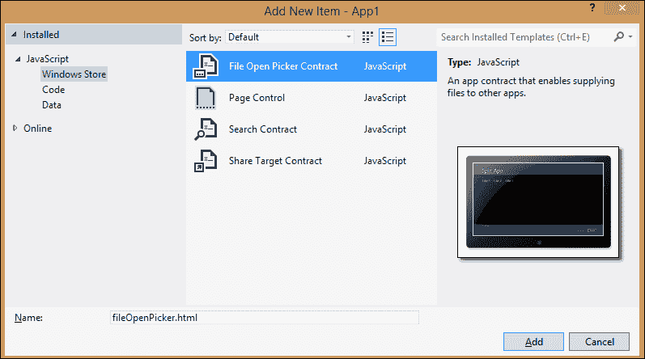
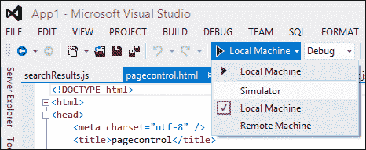
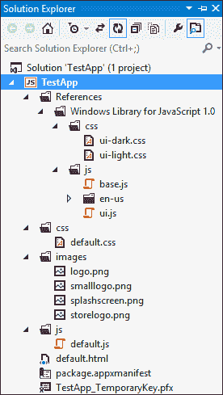
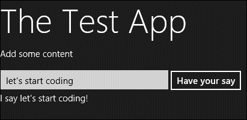

# 四、使用 JavaScript 开发应用

在本章中，我们将学习如何开始使用 JavaScript 开发 Windows8 应用。首先，我们将了解这些工具，然后我们将介绍如何获得开发人员许可证。之后，我们将从为 Windows 应用商店应用开发提供的一个模板开始，从一个空白模板构建一个示例应用，并对其进行修改，以便了解 JavaScript 应用的一些功能。

# 工具介绍

Windows 应用商店应用是 Windows 8 引入的新类型的应用，仅在该平台上运行。因此，要开始开发，首先需要在计算机上安装 Windows 8，其次需要所需的开发工具。

获取Windows 8 有两个选项；一种选择是从 MSDN 上的订阅者下载获得它，如果您在那里有订阅。或者，如果您没有 MSDN 帐户，您可以通过[从 MSDN 网站上的*评估中心*获取 Windows 8 Enterprise 的 90 天评估版本 http://msdn.microsoft.com/en-US/evalcenter/jj554510.aspx?wt.mc_id=MEC_132_1_4](http://msdn.microsoft.com/en-US/evalcenter/jj554510.aspx?wt.mc_id=MEC_132_1_4) 。

### 注

请注意，评估版在到期后无法升级。

安装 Windows 8 后，您需要下载开发者工具，这些工具可在 MSDN 站点的*Windows 开发中心*页面上免费获得。Windows 开发中心及其全新和改进的布局是您可能需要的所有工具和资源的起点，您可以在**下载部分**中找到，以开发 Windows 应用商店应用[http://msdn.microsoft.com/en-US/windows/apps/br229516.aspx](http://msdn.microsoft.com/en-US/windows/apps/br229516.aspx) 。

重要的下载是包含 Visual Studio Express 的捆绑包，它将是您开发 Windows 应用的工具。此下载的链接位于**Visual Studio Express 2012 for Windows 8**部分，包含以下文件：

*   适用于 Windows 8 的 Microsoft Visual Studio Express 2012
*   Blend for Microsoft Visual Studio 2012
*   Windows 8 软件开发工具包（SDK）
*   Windows 应用商店应用项目模板（在 Visual Studio 2012 中提供）

此外，您可以在该页面上找到其他可用下载，例如：

*   设计资产：这包括必要的 Photoshop 模板（`.psd`文件），其中包括设计应用所需的模板、通用控件和通用组件，如合同、通知和瓷砖。
*   示例应用包：这包括来自微软的数百个代码示例，帮助您快速启动项目并了解大多数功能。这在所有或特定的编程语言中都可用。
*   针对 Windows 8 的动手实验室：此包括一系列八个动手实验室模块，依次指导您开发名为 Contoso Cookbook 的 Windows 应用商店应用。这包含了 Windows 8 中提供的许多关键新功能。这些实验室系列提供 JavaScript 和 HTML，或 C#和**可扩展应用标记语言**（**XAML**）。
*   Live SDK: This includes a set of controls and APIs that we can use to enable the app to integrate **Single Sign-on** (**SSO**) with a Microsoft account and access information from SkyDrive, Hotmail, and Windows Live Messenger.

    ### 注

    由于 Visual Studio 2012 中的 Windows 应用商店应用开发仅在 Windows 8 上受支持，因此即使已安装 Visual Studio 2012，也无法在 Windows 7 上开发应用。此外，您无法在 Windows Server 2012 上开发 Windows 应用商店应用，因为该应用没有开发者许可证。

    请注意，您可以使用任何其他 Visual Studio 2012 版本来开发 Windows 应用商店应用，包括 Ultimate、Premium、Professional 和 Test Professional 版本。

## 获得免费开发者许可证

要开始开发 Windows应用商店应用，您需要拥有 Windows 8 的开发者许可证。此许可证允许您在 Windows 应用商店测试和认证应用之前，在本地安装、开发、测试和评估应用。此外，开发者许可证是免费的，您不需要商店账户即可获得；它只需要一个 Microsoft 帐户，每个帐户可以获得多个许可证。30 天后到期，必须续签。如果您已经拥有 Windows 应用商店帐户，许可证将为您提供 90 天的服务。在本地计算机上获得许可证后，除非该许可证过期或您将其删除（可能通过格式化或卸载 Visual Studio），否则不会在该计算机上再次提示您。这是很容易得到一个；您可以使用 Visual Studio 2012 获得开发人员许可证。当您第一次在 Windows 8 上运行它时，它将提示您获取开发者许可证；您只需使用 Microsoft 帐户登录即可。您可以始终尝试使用应用商店选项从 Visual Studio 内部获取或续订 Windows 8 的开发人员许可证，我们将在[第 10 章](10.html "Chapter 10. Packaging and Publishing")、*打包和发布*中详细讨论，当我们了解发布应用时。

### 注

请记住，第一次尝试运行应用时，如果您尚未获得开发人员许可证，系统会提示您获取开发人员许可证。

下面的屏幕截图显示了使用 Visual Studio 2012 Ultimate 的过程。前往**项目****门店****获取开发商许可证**。



如果您使用的是 Express edition，您将直接在顶部菜单中有一个**存储**选项，而不是在**项目**下方。您只需前往**商店****获取开发者许可证**。

### 注

当您尝试在 Visual Studio 中构建或部署应用时，选择不获取或续订开发人员许可证将导致错误（代码 DEP0100）。

安装 Windows 8 和所需工具并获得开发人员许可证后，即可开始构建第一个应用。首先选择要使用的编程语言。正如我们前面提到的，Windows 8 允许您在编程语言知识库的基础上进行构建，并使用您已经知道的语言进行开发（除非您想学习新的东西）。如果你对 web 开发感兴趣，你可以选择 JavaScript 作为你的编程语言，并使用 web 开发中的最新技术（HTML5 和 CSS3 等），这就是本书的全部内容。如果您来自.NET 背景，可以选择 Visual C#或 Visual Basic 和 XAML。并且你有 C++选项和 C++和 XAML 或者 C++和 DirectX。

# 使用 Visual Studio 及其模板

所以我们现在有了工具。有了Visual Studio 作为我们的游乐场，JavaScript 作为我们的编程语言，我们已经做好了开发的准备。我们将首先为 Windows 应用商店创建一个新项目。进入**文件****新项目**。在**已安装**下向下钻取，进入**模板**再进入**JavaScript****Windows 应用商店**，选择模板类型，如下图所示：



正如您在上一个屏幕截图中所看到的，在**新项目**对话框的中心窗格中有五个模板可供选择。这些模板随 Visual Studio 2012 提供，提供了一个良好的起点，帮助您快速启动并加快应用的开发。这些项目模板按照它们在**新建项目**对话框中的出现顺序如下：

*   **空白应用**：这是一个基础项目模板，用于创建一个空的 Windows 应用商店应用，该应用可编译并运行。但是，它不包含用户界面控件或数据。
*   **网格 App**：这是一个提供内容网格视图格式的项目。这是一个很好的应用起点，它允许用户浏览数据类别以查找内容。它的一些使用示例包括 RSS 阅读器、购物应用、新闻应用和媒体库应用。
*   **拆分应用**：这是一个提供内容拆分视图的项目，数据显示在两列主/详细视图中，一边是数据列表，另一边是每个数据项的详细信息，就像在 Outlook 中一样。它的一些应用示例包括新闻阅读器应用、体育成绩应用和电子邮件应用。
*   **固定布局 App**：这是一个具有基本和最小模板的项目，类似于使用**空白 App**模板创建的 App，但区别在于此布局中的内容针对固定布局视口，当窗口大小改变以符合显示区域时，容器自动调整大小；使用`ViewBox`控制装置确保这种缩放。
*   **Navigation App**: This is a project that creates an app with the single-page navigation model recommended for Windows Store apps. You cannot implement a navigation model by just adding `anchor` links to the markup; instead, the navigation model is implemented using the `navigator.js` file, which can also be found in the Grid and Split templates, while the **Blank App** and **Fixed Layout App** templates do not include this file and thus you will have to add the file manually.

    ### 注

    **Grid 应用**和**Split 应用**模板不仅是构建应用的良好起点，也是非常好的学习模板，可以让你很好地了解应用的构建方式和组成。

三个模板**空白应用**、**网格应用**和**拆分应用**在 Windows 应用商店开发的所有可用编程语言之间共享。每个项目模板都包含实现其所代表的功能所需的必要文件，而无需您进行任何开发；例如，创建一个新的网格应用并运行它将产生以下应用：



其结果是一个 Windows 应用商店就绪的应用，其中包含启用导航的虚拟数据，甚至支持**快照和填充布局**，这是当分辨率在并排的两个应用之间拆分时，应用存在的布局。所有这些都不需要编写一行代码！因此，想象一下，如果你通过对布局应用不同的样式来定制这个最小的应用，并在内容中显示真实的数据（比如，来自新闻网站的 RSS 提要），那么你马上就会有一个超过 75%的新闻应用准备就绪（缺少一些功能，例如语义缩放、应用栏和设置）。

您也可以直接从Visual Studio 下载示例。这些示例将提供完整的工作代码示例，这些示例将作为 Windows 应用商店应用编译和运行，目的是演示 Windows 8 中可用的各种新编程模型、平台、功能和组件。

## 项目项模板

除了项目模板外，您还拥有 Windows 应用商店应用独有的特定于语言的项目模板，在我们的例子中称为**JavaScript 项目模板**。这些项模板是应用文件，可以添加到现有项目中，并包含常用代码和功能（将其视为用户控件），还有助于缩短开发时间。项目模板可以通过右键点击顶部菜单中的**项目**，然后进入**添加****新项目**来添加。有四个 JavaScript 项目模板可用；详情如下:

*   **页面控制**：包含应用中页面的基本内容和标记，包括带后退按钮的页眉部分和主内容部分。每个**页面控件**模板将包括三个要添加到项目中的文件（一个包含所需标记的 HTML 文件、一个包含页面相关代码的 JavaScript 文件和一个提供页面特定样式的 CSS 文件）。
*   **文件打开选取器合同**：此将添加允许应用使用**文件选取器**对话框将其数据作为文件列表提供给其他请求的应用的功能。它还将在 ListView 控件中显示文件。这种方法的典型用法是在创建“照片选择器”对话框时使用。
*   **搜索契约**：这将添加搜索契约，允许应用响应来自Windows 8 中 Search Charm 的搜索查询。它包含一个搜索结果页面，用于向用户显示结果。如果你的应用有一些可以搜索的数据，那么添加此合同非常重要。
*   **共享目标合约**：将共享合约添加到应用中，使应用能够公开数据，与其他应用共享，并与 Windows 8 中的共享魅力集成。因此，如果应用具有此合同，它将出现在共享 UI 的应用列表中。此模板的典型用途是允许用户将链接或照片发布到 Facebook、Twitter 或任何其他接收共享内容的应用。反之亦然，它还将使应用能够接收共享内容；因此，应用可以表现得像 Facebook 或 Twitter。

以下屏幕截图显示了带有先前列出的项目项模板的**添加新项**对话框：



### 注

我建议您将每个项目模板添加到具有相关名称的单独文件夹中。由于每个项目模板都添加了三个相关文件，因此如果将它们分组到单独的文件夹中，解决方案将更整洁、更有条理。例如，一个用于页面的文件夹及其下的每个页面的文件夹；合同也是如此。

在您选择了一个应用模板并将其加载到 Visual Studio 之后，您基本上已经创建了一个非常简单的应用；此应用可以直接编译和运行。使用 Visual Studio，您可以在本地计算机或模拟器上运行应用。要在本地计算机上运行，只需按*F5*构建、部署并启动应用。

### 注

请注意，您可以只部署解决方案，但应用不会直接运行；您需要在“开始”菜单中的其他应用中找到它，然后手动启动它。

还有第三个选项可以运行通过以太网电缆直接连接的远程设备。要使用模拟器，只需从运行菜单中的选项中进行选择，如以下屏幕截图所示：



Windows8 模拟器是一个非常好的工具，可以帮助你测试和调试应用；它允许您像使用真实设备一样测试功能，尤其是在开发过程中没有平板电脑或触控设备的情况下。它将使应用能够在横向和纵向之间更改分辨率和屏幕方向，并在不同的应用布局和视图状态（快照和完整）之间切换。此外，您还可以测试该应用如何响应触摸和手势，如滑动和捏缩缩放。在开发过程中，我们无法在笔记本电脑或 PC 上尝试所有这些特性和功能。

### 注

在 Visual Studio 中以调试模式运行应用时，可以对代码和标记进行更改，并刷新应用以查看更改，而无需重新生成/重新运行它。您可以使用**刷新 Windows 应用**按钮执行此操作，只有在从 Visual Studio 中运行应用后，该按钮才会出现在“暂停”、“停止”和“重新启动调试”按钮旁边。

# 开始使用空白应用

让我们开始使用**空白应用**模板创建一个最小的应用；我们需要做的第一件事是启动 Visual Studio 2012，创建一个新项目，然后转到**JavaScript****Windows 应用商店****空白应用**。虽然空白应用在运行时看起来是空的，但它包含几个文件，这些文件对于使用 JavaScript 创建的任何 Windows 存储应用来说是必不可少的；所有其他模板都将包含这些文件。以下屏幕截图显示了**解决方案资源管理器**窗口中列出的此应用的结构：



上一个屏幕截图显示了一个简单应用的框架，其中包含以下文件：

*   `Windows Library for JavaScript 1.0`：Windows JavaScript 库是 CSS和 JavaScript 文件的库。深入查看此文件夹时，您将看到它包含两个子文件夹，如下所示：
    *   `css`：此文件夹包括两个主要 CSS 样式表，其中包含一组样式，使应用具有 Windows 8 外观。这两个样式表是`ui-dark.css`和`ui-light.css`。正如他们的名字所暗示的那样，第一个应用将应用深色主题，而第二个应用将应用浅色主题。您可以通过在 HTML 页面中引用它来选择其中一个。
    *   `js`：该文件夹包括`base.js`和`ui.js`；这两个文件包含 JavaScript API，这些 API 提供控件、对象和助手函数，所有这些都组织到名称空间中，这将使使用 JavaScript 的开发体验更加容易。
*   `default.css`：这是包含应用 CSS 样式的样式表。
*   `images`：此文件夹包含展示应用及其标识所需的图像（两个徽标，闪屏图像和商店徽标）。
*   `default.js`：此 JavaScript文件实现应用的主要功能，并包含处理应用生命周期的代码。在此文件中，您可以编写与`default.html`页面相关的任何附加代码。
*   `default.html`：这是应用运行时第一次加载的开始和主页。它为内容主机（其中每个页面都加载到主窗口）提供标记。
*   `package.appxmanifest`：这是清单文件。它主要通过指定描述应用的属性（如名称、说明、起始页等）来描述 Windows 应用包。
*   `TestApp_TemporaryKey.pfx`（`AppName_TemporaryKey.pfx`）：此档案在档案上签字。

让我们看看`default.html`页面，它是应用的起始页面（在本例中是唯一的页面）：

```js
<!DOCTYPE html>
<html>
<head>
  <meta charset="utf-8" />
  <title>TestApp</title>
    <!-- WinJS references -->
  <link href="//Microsoft.WinJS.1.0/css/ui-dark.css" rel="stylesheet" />
  <script src="//Microsoft.WinJS.1.0/js/base.js"></script>
  <script src="//Microsoft.WinJS.1.0/js/ui.js"></script>

  <!-- TestApp references -->
  <link href="/css/default.css" rel="stylesheet" />
  <script src="/js/default.js"></script>
</head>
<body>
  <p>Content goes here</p>
</body>
</html>
```

从`Doctype html`可以看出，页面是 HTML5。我们在`<head>`中有应用的标题，然后是针对 JavaScript（`WinJS`文件）的 Windows 库的参考。参考文献标有注释`WinJS``references`。首先引用`.css`文件，这样脚本的加载不会延迟或阻碍样式的加载，如果`.js`文件对样式表进行了一些修改，则需要事先加载样式。采用深色主题；您只需按如下所示更改参考，即可将其更改为“light one”：

```js
<link href="//Microsoft.WinJS.1.0/css/ui-light.css" rel="stylesheet" />
```

### 注

尽量不要修改`WinJS`的 CSS 和 JavaScript 文件。最好创建样式或 JavaScript 函数，覆盖不同文件中的现有样式和功能，并将其应用于应用。

在`WinJS`引用下，有对特定于应用的样式表和 JavaScript 文件的引用，并通过注释进行了明确区分。

然后是身体。这里，在一个空白应用的示例中，主体只包含简单的文本。

如果您尝试按原样启动应用，您将看到一个黑色背景覆盖屏幕，同时还会看到文本：**内容在此处**。在这个页面出现之前，您会注意到一个启动屏幕出现了几秒钟，在清单文件中显示了为启动屏幕指定的图像。让我们尝试通过修改起始页并在正文中添加一些标记来为这个空白应用注入一些活力，就像您之前处理过的任何 HTML 页面一样。

将现有段落元素替换为以下内容：

```js
<body>
  <h1>The Test App</h1>
  <p>Add some content </p>
  <input id="contentInput" type="text" />
  <button id="sayButton">Have your say</button>
  <div id="contentOutput"></div>
</body>
```

运行应用；它将显示我们刚才添加的标记。我们可以在`input`元素中键入任何文本，但单击按钮将无效。因此，让我们为这个按钮创建一个事件处理程序，以便在`div`中输出我们在`input`元素中添加的任何内容。我们需要在`default.js`文件中创建事件处理程序，因为我们在这里编写与`default.html`页面交互的附加代码。

首先让我们看看这个`default.js`文件。您会注意到其中的一些代码由单个函数包装，如下所示：

```js
(function () {
   "use strict";
  …
})();
```

这段代码表示一个自动执行的匿名函数，它包装所有代码以避免任何命名冲突，并保持全局命名空间中没有不必要的标识符。匿名函数中的第一行代码声明关键字`use strict`，该关键字打开 JavaScript 代码的严格模式。此严格模式提供了更好的错误检查，例如防止将值指定给只读属性。在这一行之后，您将看到代码的其余部分，它通过添加`app.onactivated`和`app.oncheckpoint`事件处理程序来处理应用的激活状态和检查点状态。我们在`app.onactivated`事件处理程序中添加的代码将在应用启动时添加。

现在回到按钮事件处理程序；让我们创建一个函数，如下所示：

```js
function buttonClickHandler(eventInfo) { 
  var text = document.getElementById("contentInput").value; 
  var outputString = "I say " + text + "!";
  document.getElementById("contentOutput").innerText = outputString; 
}
```

在底线的`app.start()`调用之前的匿名函数中添加此函数。此函数从`input`元素中检索文本，并将其添加到`div`元素中。要将此函数添加到按钮的事件（在本例中为`onclick`事件），我们需要向按钮注册一个事件处理程序。推荐的方法是调用`addEventListener`方法。我们需要在应用激活时注册此事件处理程序。因此，我们应该将其添加到`app.onactivated`事件处理程序中。代码如下所示：

```js
var app = WinJS.Application;
var activation = Windows.ApplicationModel.Activation;

app.onactivated = function (args) {
  if (args.detail.kind === activation.ActivationKind.launch) {
       if (args.detail.previousExecutionState !== activation.ApplicationExecutionState.terminated) {
      // TODO: This application has been newly launched. Initialize
         // your application here.
    } else {
  // TODO: This application has been reactivated from suspension.
  // Restore application state here.
     }
     args.setPromise(WinJS.UI.processAll());

     // Retrieve the button and register our event handler.
     var sayButton = document.getElementById("sayButton");
     sayButton.addEventListener("click", buttonClickHandler, false);
}
};
```

`app`变量是一个全局变量，表示提供应用级功能的`Application`类的实例；例如，处理不同的应用事件，例如我们在前面的代码清单中看到的`onactivated`事件。

在`onactivated`处理程序中，代码检查已发生的激活类型；在本例中，它是启动激活，这意味着此应用在未运行时由用户激活。然后呼叫`WinJS.UI.processAll()`。这将扫描`default.html`文件中的任何`WinJS`控件，并对其进行初始化。由于按钮不是一个`WinJS`控件，而是一个基本的 HTML 控件，我们可以在调用`WinJS.UI.processAll()`之前添加它，但最好在它之后注册事件处理程序。

运行应用，在文本框中输入一些文本，单击按钮时显示内容，如以下屏幕截图所示：



# 了解 ListView 控件

在上一章中，我们介绍了 Windows 库为 JavaScript 提供的一组新控件；其中一个控件是 ListView 控件，标记为`WinJS.UI.ListView`。该对象的基本功能是在可自定义的列表或网格中显示数据项。要创建 ListView 控件，我们需要将`data-win-control`属性添加到`div`元素中，并将其属性设置为`WinJS.UI.ListView`。在`default.html`页面中，在`body`标签内添加以下代码：

```js
<body>
  <div id="sampleListView" data-win-control="WinJS.UI.ListView">
  </div>
</body>
```

这将创建一个空的 ListView。因此，如果我们运行该应用，将没有什么可看的。因为它是一个`WinJS`控件，所以在调用`WinJS.UI.processAll`函数之前，它不会呈现在标记中。

让我们为`sampleListView`控件添加一些要显示的数据。可能来自 Web 数据库或 JSON 数据源的数据将手动创建一个数据源，最好是在单独的 JavaScript 文件中，以便更易于维护。因此，在 VisualStudio 中，在`js`文件夹下，添加一个新项目并选择一个 JavaScript 文件；命名为`data.js`。打开这个新创建的文件，在严格模式下创建一个匿名函数，就像我们在`default.js`文件中看到的那样；在这个函数中，让我们创建一个对象的样本数组，这些对象构成我们需要的数据源。为数组中的每个对象指定三个属性`firstName`、`lastName`和`Age`。

生成的代码如下所示：

```js
(function () {
    "use strict";
    //create an array for a sample data source
    var dataArray = [
    { name: "John Doe", country: "England", age: "28" },
    { name: "Jane Doe", country: "England", age: "20" },
    { name: "Mark Wallace", country: "USA", age: "34" },
    { name: "Rami Rain", country: "Lebanon", age: "18" },
    { name: "Jean Trops", country: "France", age: "56" }

    ];

    //create a list object from the array
    var sampleDataList = new WinJS.Binding.List(dataArray);
})();
```

接下来，我们使用刚刚创建的数组创建一个列表对象；然后，我们需要通过为该列表对象声明名称空间并将该列表添加为公共成员来公开该列表对象：

```js
    // Create a namespace to make the data publicly
    // accessible. 
    var publicMembers =
        {
            itemList: sampleDataList
        };
    WinJS.Namespace.define("DataSample", publicMembers);
```

为了让 ListView 控件能够访问该列表，我们使用`WinJS.Namespace.define`函数创建一个名称空间，并将该列表添加为其成员之一，从而使该列表可以公开访问，因为它是在一个匿名函数中创建的，这使它保持私有。正如您在前面的代码中注意到的，`WinJS.Namespace.define`函数采用两个参数。第一个参数是要创建的名称空间的名称，第二个参数表示包含一个或多个键/值对的对象（`publicMembers`。

创建数据源并使其可由 ListView 控件访问后，下一步是将数据源连接到 ListView 控件。这必须在`default.html`文件中完成。让我们从开始，在那里我们留下了我们的示例空白应用。我们需要添加对刚刚创建的数据文件的引用，如下所示：

```js
<!-- Sample data file. -->
<script src="/js/data.js"></script>
```

然后我们将`data-win-options`属性添加到`div`元素中，并使用我们在`data.js`中创建的数据源在`data-win-options`属性中设置`itemDataSource`属性。将 ListView 控件的`itemDataSource`属性设置为`DataSample.itemList.dataSource`，如下所示：

```js
<div id="sampleListView" data-win-control="WinJS.UI.ListView" 
 data-win-options="{ itemDataSource : DataSample.itemList.dataSource }">  
</div>
```

`DataSample.itemList.dataSource`名称空间包含`DataSample`，这是我们之前注册的名称空间；`itemList`，这是我们在命名空间上注册的对象上定义的属性的名称；最后是`dataSource`，这是`WinJS.Binding.List`方法的一个属性（我们可以在`itemList`上调用它，因为后者被分配给我们从数组中创建的列表对象）。

如果我们现在运行该应用，我们将看到 ListView 控件显示我们创建的数组，没有任何格式设置，如下所示：

```js
    { name: "John Doe", country: "England", age: "28" }
    { name: "Jane Doe", country: "England", age: "20" }
    { name: "Mark Wallace", country: "USA", age: "34" }
    { name: "Rami Rain", country: "Lebanon", age: "18" }
    { name: "Jean Trops", country: "France", age: "56" }
```

我们可以通过覆盖`win-listview`类中设置的默认样式（由 Windows JavaScript 库定义）来设置 ListView 控件的样式。为了覆盖默认样式并将一些样式应用于此 ListView 控件，请复制`win-listview`类，并在其前面添加我们创建的`div`元素的特定 ID，如下所示：

```js
#sampleListView.win-listview {
  width: 500px;
  border: 1px solid gray;
}
```

我们可以向内部的 ListView 元素添加更多样式，我们可以使用`WinJS.Binding.Template`、定义项目模板，该模板用于定义我们要用于显示每个列表项目及其样式的标记。创建`WinJS.Binding.Template`控件非常容易；在 HTML 页面中，添加一个`div`元素，并将数据属性`data-win-control`的属性设置为`WinJS.Binding.Template`。在其中，添加另一个`div`元素作为模板内容的父元素，因为`WinJS.Binding.Template`必须有一个根元素。在这个父元素中，我们添加了我们将创建的标记，，ListView 将使用它来填充它包含的每个数据项。现在，模板将如下所示：

```js
<body>
<div id="sampleTemplate" data-win-control="WinJS.Binding.Template"> 
      <div style="width:200px; height: 100px">    
           <div>    
              <!-- Displays the "name" field. -->
              <h2> </h2>
              <!-- Displays the "country" field. -->
              <h3> </h3>
              <!-- Displays the "age" field. -->
              <h6 style="color:red"> </h6>
           </div>    
      </div>
</div>
</body>      
```

为了将每个元素链接到特定的数据项属性，我们在显示数据的每个元素上使用`data-win-bind`属性。`data-win-bind`属性使用以下语法：`data-win-bind="propertyName: dataFieldName"`。因此，为了在`h2`、`h3`和`h6`元素上设置 name 属性，我们使用以下代码：

```js
<!-- Displays the "name" field. -->
<h2 data-win-bind="innerText: name"></h2>
<!-- Displays the "age" field. -->
<h3 data-win-bind="innerText: country"></h3>
<!-- Displays the "age" field. -->
<h6 style="color:red" data-win-bind="innerText: age"></h6>
```

需要注意的是，列表项模板（`WinJS.Binding.Template`）应该在标记中的 ListView 控件之前，这很重要，因为 HTML 标记是分层的，每个 UI 元素都将在遇到时呈现。因此，当 ListView 控件被呈现并绑定到一个`itemTemplate`元素时，该`itemTemplate`元素必须首先存在；否则它将抛出一个错误。

最后，我们需要应用刚刚在 ListView 控件上创建的绑定模板。因此，使用`select`语法将 ListView 的`itemTemplate`属性设置为`sampleTemplate`，如下所示：

```js
<div id="sampleListView" data-win-control="WinJS.UI.ListView" 
data-win-options="{ itemDataSource : DataSample.itemList.dataSource, itemTemplate: select('#sampleTemplate') }">
</div>
```

如果我们现在运行应用，ListView控件将以更直观的方式显示数据。下面是它的外观：


# 总结

在本章中，我们介绍了使用 JavaScript 创建 Windows 应用商店应用的基础知识。我们已经被介绍了这些工具，以及我们在开发过程中需要做的事情。然后，我们使用 VisualStudio2012 进行了讨论，并查看了为使用 JavaScript 进行开发提供的模板。

我们了解了如何从头开始构建一个应用，并在此过程中了解了 JavaScript Windows 应用商店应用的剖析；我们修改了这个空白应用，使其能够以最简单的方式进行交互，只需点击一个按钮。最后，我们学习了如何使用 ListView 控件显示数据。

在下一章中，我们将学习如何获取要显示的数据。