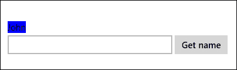
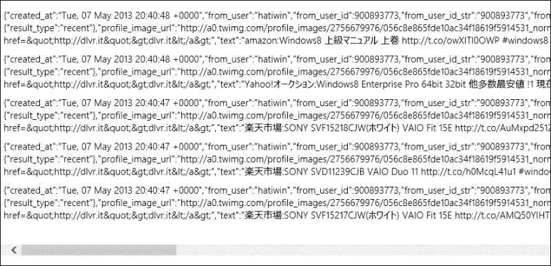
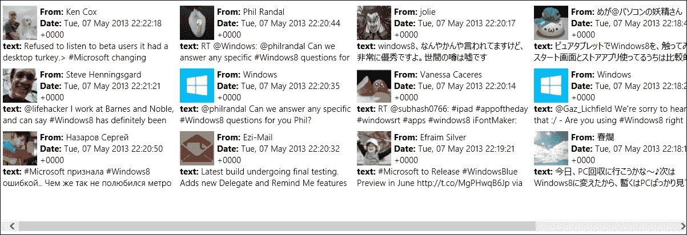
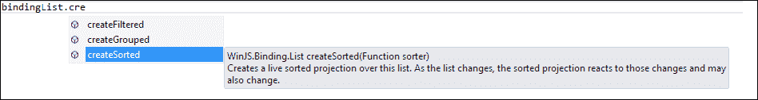
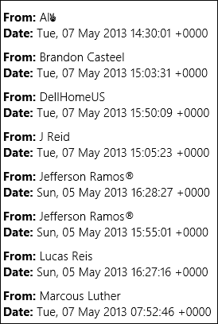
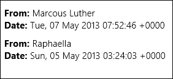

# 五、将数据绑定到应用

在本章中，我们将学习如何实现从不同数据源到应用中元素的数据绑定。用于 JavaScript的 Windows 库提供了数据源对象，可用于使用不同类型的数据填充`WinJS`控件，如`ListView`或`FlipView`。我们有用于访问数组和 JSON 数据的`WinJS.Binding.List`对象和用于访问文件系统信息的`StorageDataSource`对象。这两个数据源对象使我们能够查询并绑定到数据源中的项。此外，我们将学习如何对数据源应用排序和过滤，并使用`ListView`控件显示其数据。

# 获取数据

用于 JavaScript 绑定的**Windows 库**（`WinJS.Binding`提供了将数据和样式绑定到 HTML 元素的机制。Windows 库为 JavaScript 提供的绑定默认为单向绑定，因此当数据发生变化时会更新HTML 元素；但是，HTML 元素中的任何更改都不会反映绑定到的数据。让我们看看这一点，我们将从最基本的绑定开始；也就是说，HTML 元素和只包含数据的简单 JavaScript 对象之间的声明性绑定。

首先我们将检查`WinJS.Binding.optimizeBindingReferences`属性，如果尚未设置，则将其设置为`true`。

### 提示

在执行声明性绑定时，务必将`WinJS.Binding.optimizeBindingReferences`属性设置为`true`。此属性确定绑定是否应自动设置元素的 ID。在使用`WinJS.Binding`的应用中，此属性应设置为`true`。

我们将创建一个样本`person`JavaScript 对象，该对象包含两个属性`name`和`badgeColor`，如下代码所示：

```js
var person = { name: "John", badgeColor: "Blue"};
```

现在我们使用的数据属性`data-win-bind`将一个 HTML`span`元素绑定到`person`对象，如下代码所示：

```js
<span id="nameSpan" data-win-bind="innerText: name"></span>
```

为了进行绑定并使名称出现在`span`元素中，我们必须调用`WinJS.Binding.processAll()`方法并将 DOM 元素和`dataContext`对象传递给它；它将在这个指定元素开始搜索`data-win-bind`属性，然后遍历该元素的所有子元素。

下面的代码从DOM 中检索`span`元素，然后将参数传递给`WinJS.Binding.processAll()`方法：

```js
var nameSpan = document.getElementById("nameSpan");
WinJS.Binding.processAll(nameSpan, person);
```

### 提示

如果在本例中使用 default.HTML 页面，则需要在调用`args.setPromise(WinJS.UI.processAll())`后添加代码，以便所有控件都已初始化，如[第 3 章](03.html "Chapter 3. JavaScript for Windows Apps")、*针对 Windows 应用的 JavaScript*中所述。

运行该项目，您将在屏幕上看到名称**John**。前面的代码只实现了静态绑定，这意味着文本不受数据更改的影响。这是因为 JavaScript 对象本身无法在其更改时通知应用。我们可以使用`WinJS.Binding.as`将此对象更改为可观察的对象，这将使数据源能够在该对象中的项目更改时收到通知。下面的代码片段将创建一个`bindingSource`对象，它显示了我们创建的`person`对象的一个可观察实例；因此，对`bindingSource`所做的任何更改都将反映在它绑定到的 HTML 元素中：

```js
var bindingSource = WinJS.Binding.as(person);
```

让我们看一下动态数据绑定的作用。首先，添加一个`input type`元素输入名称值和一个`button`元素，如下代码所示：

```js
<input type="text" id="nameInpt" />
<button id="setNameBtn">Get name</button>
```

然后，我们编写代码来模拟`person`数据对象中的更改。我们通过将`person`对象中的`name`属性设置为`setNameBtn`按钮的点击事件中`input`元素中输入的新值，如以下代码所示：

```js
document.getElementById("setNameBtn").onclick = function () {
  var newName = document.getElementById("nameInpt").value;
  bindingSource.name = newName;
}
```

运行项目并尝试在`input`元素中输入新值，然后单击按钮查看名称的更改。

我们不仅可以将数据绑定到 HTML 元素，还可以在样式级别应用绑定。回到上一个示例，我们将`style.background`值添加到数据属性中，并将其绑定到`person`对象的`badgeColor`字段，如下代码所示：

```js
data-win-bind="innerHTML: name; style.background: badgeColor"
```

进行上述更改并刷新应用，名称将以蓝色突出显示。运行应用时，输出应如以下屏幕截图所示（如果您引用的是`ui-light.css`样式表，则输出将为深蓝色）：



Windows 应用商店应用中的数据访问和存储还有其他几种方法；数据源可以是本地的，也可以是远程的，您对存储的选择基本上取决于当前的场景。例如，需要连接并处于活动状态的 Windows 应用商店应用需要从远程在线源访问数据。数据可以从 web URL 或 RESTful 服务获取。使用这些 web 服务的理想方式是使用我们在[第 3 章](03.html "Chapter 3. JavaScript for Windows Apps")中介绍的`WinJS.xhr`功能，*针对 Windows 应用的 JavaScript*。

`WinJS.xhr`函数将向 web URL 或服务发出异步请求，并在成功调用时返回数据作为响应。假设我们需要获得一些 tweet 并解析结果；在这种情况下，调用非常简单。为此，请向 Twitter 搜索服务提供 URL，该服务将搜索包含`windows 8`的所有推文，如下代码所示：

```js
WinJS.xhr({ 
url: "http://search.twitter.com/search.json?q=windows8"}).then(
function (result) {
});
```

输出将是所有与 JSON 字符串包装的查询匹配的 tweet，这是许多网站提供的数据格式。Windows8JavaScript 本机支持 JSON；因此，我们可以通过调用`JSON.parse(jsonString)`将 JSON 字符串反序列化为一个对象。让我们附加前面的代码以获得以下代码：

```js
WinJS.xhr({
  url: "http://search.twitter.com/search.json?q=windows8"}).then(
  function (result) {
    var jsonData = JSON.parse(result.responseText);
  });
```

我们也可以使用Windows 提供的`Windows.Storage`API 文件从文件中读取数据。如果我们有一个可读的文件和一个代表它的`storageFile`实例，我们可以从文件中读取文本，也可以使用缓冲区读取字节。为了从文件中读取文本，我们可以使用`fileIO`类的`readTextAsync(file)`函数，如下代码所示：

```js
Windows.Storage.FileIO.readTextAsync(sampleFile).then(
function (fileContents) {
  // some code to process the text read from the file
});
```

当前面的代码成功运行时，此函数通过变量`fileContents`以文本字符串的形式返回文件的内容。

从文件中读取字节时，几乎同样的情况也适用；但是，我们调用方法`readTextAsync(file)`并将文件传递给它。在异步过程完成后，我们可以使用`then()`或`done()`方法捕获响应中的缓冲区数据，如下代码所示：

```js
Windows.Storage.FileIO.readBufferAsync(sampleFile).then(
function (buffer) {
 var bufferData = Windows.Storage.Streams.DataReader.fromBuffer(buffer);
});
```

在前面的代码中，我们使用`DataReader`类读取缓冲区；此类提供从内存流中读取字符串并处理缓冲区的功能。

# 显示数据

我们已经了解了不同的数据来源，并看到了一些关于如何获取数据的示例。现在我们将了解如何格式化和显示这些数据。在前面的示例中，我们看到了如何将数据绑定到任何 HTML 元素，但幸运的是，有更好的方法可以做到这一点。更好的方法是使用 WindowsLibraryforJavaScript，它提供了控件和模板，可以轻松格式化和显示数据。最著名的控件是`ListView`和`FlipView`；当涉及到绑定和显示数据时，这两种技术都适用，但我们将在本章中使用`ListView`。这不是出于个人偏好，而是一个利用`ListView`控件功能的问题，因为它提供了一种灵活的方式来显示数据，内置了对交叉滑动（触摸）手势的支持；此外，它还优化了性能。此外，它还提供了与 Windows 应用商店应用一致的外观和行为。数据绑定显示的步骤如下：

1.  获取数据。
2.  创建一个`WinJS.Binding.List`对象来包装数据。
3.  创建一个`ListView`元素。
4.  将`ListView`元素的`itemDataSource`设置为`WinJS.Binding.List`对象。

让我们继续前面通过 web URL 获取推文的示例；代码返回一个 JSON 字符串，这是我们在这里的数据，因此下一步是创建一个`WinJS.Binding.List`对象，如下所示：

```js
WinJS.xhr({ 
  url: "http://search.twitter.com/search.json?q=windows8"}).then(
  function (result) {
    var jsonData = JSON.parse(result.responseText);
    //create a binding list object from the json
    var bindingList = new WinJS.Binding.List(json.results);
  });
```

我们只做了第一步和第二步；步骤 3 涉及在 DOM 中创建一个`ListView`元素，并在 JavaScript 代码中获取元素的实例。

在 HTML 中，我们使用以下内容：

```js
<div id="sampleListView" data-win-control="WinJS.UI.ListView" >
</div>
```

在 JavaScript 中，我们使用以下内容：

```js
//get an instance of the ListView Control
var listView = document.getElementById("sampleListView").winControl;
```

在步骤 4 中，我们将`ListView`对象的`itemDataSource`属性设置为`bindingList`对象的`dataSource`，并且完整的代码如下所示：

```js
WinJS.xhr({ 
  url: "http://search.twitter.com/search.json?q=windows8"}).then(
  function (result) {
    var jsonData = JSON.parse(result.responseText);
    //create a binding list object from the json
    var bindingList = new WinJS.Binding.List(jsonData.results);
    //get the list view element from the DOM
    var listView = 
    document.getElementById("sampleListView").winControl;
    //bind the data sources
    listView.itemDataSource = bindingList.dataSource
  });
```

如果您在`default.html`页面中添加`ListView`控件或任何其他`WinJS.UI`控件，请记住在函数`WinJS.UI.ProcessAll()`的`then()`或`done()`调用中添加前面的代码，如下代码所示：

```js
args.setPromise(WinJS.UI.processAll().then(function () {
  //get the list view element from the DOM
  var listView = 
  document.getElementById("sampleListView").winControl;
  //bind the data sources
  listView.itemDataSource = bindingList.dataSource
}));
```

添加该代码的原因是该函数处理 JavaScript控件的 Windows 库，并在 DOM 中呈现这些控件。

现在，让我们构建并运行该项目。输出将是一个包含推文的列表，每个推文都有其属性，如以下屏幕截图所示：



尽管`ListView`控件自动绑定数据，但它看起来很混乱，需要格式化。`WinJS`控件提供模板，可与`ListView`和`FlipView`对象结合使用，以指定每个项目应如何显示以及将显示哪些数据。模板可以声明性地定义为一个`WinJS`控件，并提供其结构和样式，可以指定它应该出现在中的`div`元素，也可以使用`render`方法创建它自己的`div`元素。让我们看看这一行动。在 DOM 内部，添加一个`div`元素，并通过`data-win-control`属性将其分配给`WinJS.Binding.Template`，如下所示：

```js
<div id="listTemplate" data-win-control="WinJS.Binding.Template"></div>
```

然后创建模板的内部结构，首先添加一个根`div`元素，然后在该根`div`中添加绑定元素，如下代码段所示：

```js
<div id="listTemplate" data-win-control="WinJS.Binding.Template">
  <div class="templateItem" style ="width:300px; height:100px;">
    
    <b>From:</b><span data-win-bind="innerText: from_user_name"></span>
    <br />
    <b>Date:</b><span data-win-bind="innerText: created_at"></span>
    <br />
    <b>Text:</b><span data-win-bind="innerText: text"></span>
  </div>
</div>
```

在上一个屏幕截图中，您可能已经注意到列出的数据项包含带有引号和冒号的属性；例如，`"created_at":`和`"from_user":`。这些属性表示从 web 调用到 Twitter 的`jsonData`对象中返回的数据，这些属性作为参数传递给要在 DOM 中呈现的`listTemplate`元素中的`data-win-bind`属性。

接下来，我们应该通过在`data-win-options`属性中为`itemTemplate`指定一个值，将这个新创建的模板分配给我们之前创建的`ListView`控件，如下代码所示：

```js
<div id="listViewSample" data-win-control="WinJS.UI.ListView" 
data-win-options="{ itemTemplate: select('#listTemplate') }">
</div>
```

运行该项目，您将看到类似于下一个屏幕截图的内容。由于正在从 Twitter 获取实时数据，因此这些值将根据特定查询进行更改：



# 对数据进行排序和过滤

我们得到了数据，我们使用模板来显示它，并将其绑定到`WinJS`控件。现在，如果我们需要根据某个标准对数据项进行排序，甚至过滤掉不需要的项，该怎么办？`WinJS`库提供的绑定列表 API 使用`createSorted`和`createFiltered`等内置方法无缝处理此问题。如果我们回到前面编写的代码获取推文并编写我们创建的`bindingList`变量，即是`WinJS.Binding.List`的一个实例，并尝试调用方法`createSorted`，您会注意到自动完成功能列出了为该功能提供的其他两个内置函数，如以下屏幕截图所示：



这两种方法将在其数据上创建一个称为“排序投影”的视图。`createSorted`方法将返回一个`SortedListProjection`对象，该对象表示其持有的数据上的排序视图，类似地`createFiltered`方法将返回一个`FilteredListProjection`对象，该对象表示数据上的过滤视图。这两个投影的主要优点是它们是完全可观察的，这意味着当列表中的数据发生变化时，其相应的投影将得到通知并自我更新。此外，当投影自身发生变化时，它会将其变化通知任何收听对象。

我们可以通过调用`createSorted`方法对该绑定列表进行排序，该方法采用处理排序逻辑的排序函数参数。让我们按照用户名的字母顺序对推文进行排序。使用以下代码：

```js
//to recall this was the bindinglist variable we had
var bindingList = new WinJS.Binding.List(json.results);
//create a sorted list instance from that bindingList
var sortedList = bindingList.createSorted(function (first, second) {
return (first.from_user_name).toString().localeCompare(second.from_user_name);
});
```

`createSorted`功能将在分拣机功能参数内执行分拣逻辑，在这种情况下，该参数比较列表中的`from_user_name`字段，并返回按字母顺序排序的列表。请注意，要比较的字段是列表中数据项的字段。

完成排序后，`ListView`控件的`itemDataSource`属性现在应该绑定到新创建的`sortedList`方法，以便查看以下代码：

```js
//pass the sortedList as a datasource
simpleListView.itemDataSource = sortedList.dataSource;
```

构建并运行项目，您将看到与以下屏幕截图类似的结果：



过滤通过调用`createFiltered`方法完成，该方法在该列表上创建一个实时过滤投影。过滤后的投影将对列表中的更改作出反应，并可能相应地更改。该方法接受一个类型为`function`的参数，该参数的基本作用是对列表中的每个元素执行回调方法。例如，我们希望对`bindingList`应用一个过滤器，该过滤器将检查`from_user_name`字符串是否将字符`'a'`作为其值的第二个字符，并仅返回列表中的匹配项。类型为`function`的`createFiltered`参数将检查列表中的每个字符串；如果条件返回 true，则将该字符串包括在筛选列表中。要使用筛选器，请参阅以下代码段：

```js
//to recall this was the bindinglist variable we had
var bindingList = new WinJS.Binding.List(json.results);//create a sorted list instance from that bindingList
var filterdList = bindingList.createFiltered(function (filter) {
return filter.from_user_name.toString().charAt(1) == 'a';
});
simpleListView.itemDataSource = filteredList.dataSource; 
```

运行该项目，您将看到列表已被相应地过滤（您可以随意更改过滤条件，以便更好地查看过滤效果）。结果将类似于以下屏幕截图：



# 总结

在本章中，我们介绍了在 JavaScript 应用中处理数据的基础知识。我们学习了如何从本地对象获取数据，以及如何通过 web 服务从 web 获取数据并处理响应返回的数据。

然后我们讨论了如何显示我们获取的数据并将其绑定到`ListView`控件。最后，我们了解了如何在将数据显示在应用上之前将其添加到排序和过滤中。

在下一章中，我们将学习如何使应用响应，以便在视图状态更改时允许布局更改，以便内容始终以良好的格式显示给用户。