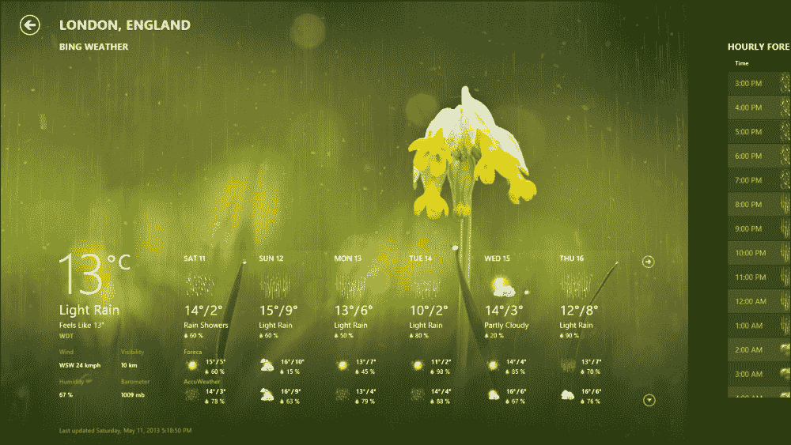
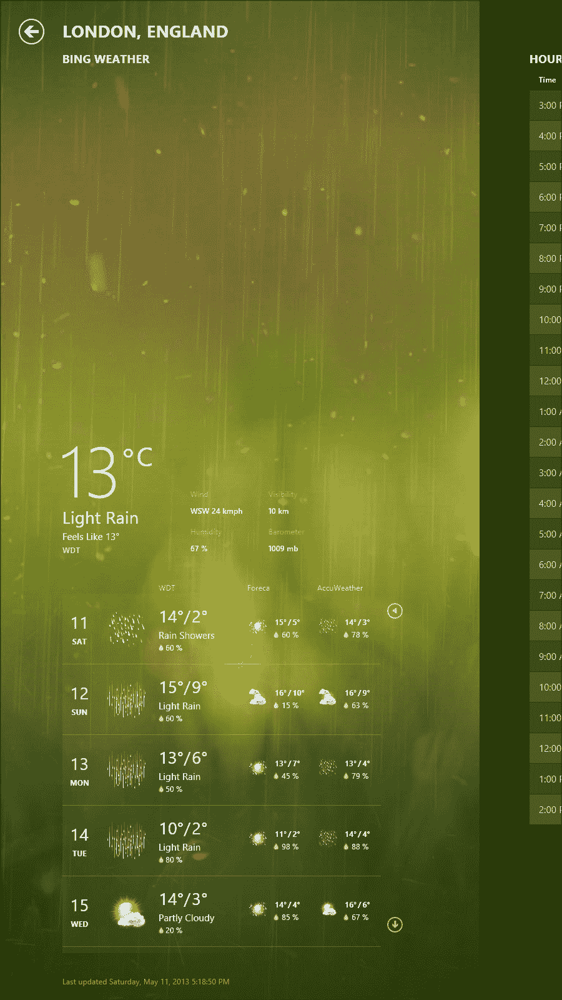
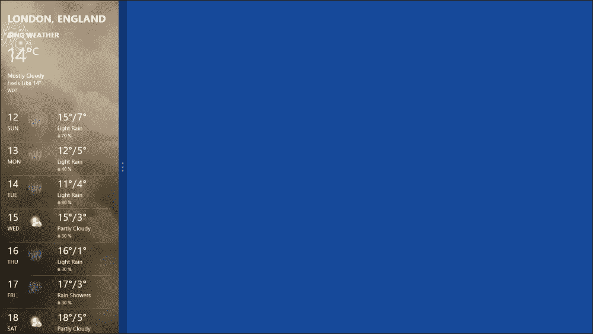
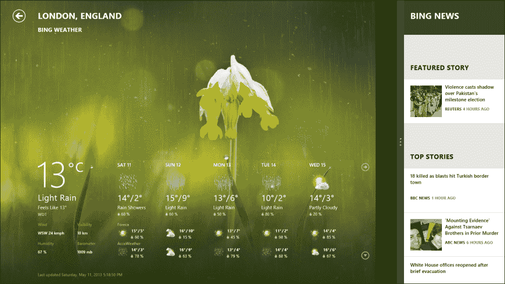
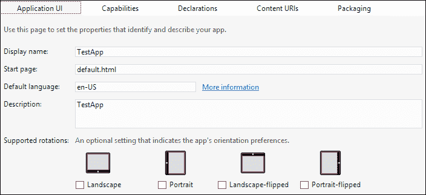
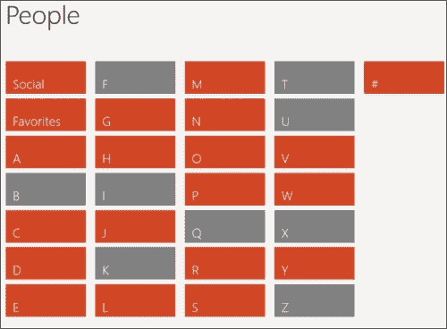
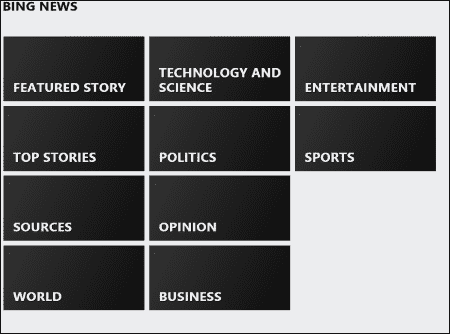

# 六、让应用变成响应式

在本章中，我们将了解应用可能存在的不同视图状态，以及如何使应用适应这些视图状态以及各种形状因素和显示尺寸。Windows 8 面向不同的平台，运行在不同大小的设备上，从大型高清显示器和笔记本电脑到 10 英寸宽屏平板电脑和 4 英寸宽的智能手机。因此，为了遵守 Windows 8 用户体验指南，当用户在这些不同的设备上查看应用时，应用应该保持相同的外观和感觉，并保持其功能，用户翻转屏幕在横向和纵向之间切换，应用放大或缩小，或者应用在各种视图状态之间切换。该应用应提供流畅灵活的布局，使其 UI 能够优雅地回流，并适应这些变化。

在本章中，我们将学习如何使应用响应，以便它处理屏幕大小和视图状态变化，并对放大和缩小做出响应。我们将首先介绍应用视图状态的概念，然后学习如何使用 CSS 和 JavaScript 处理视图状态的更改。最后，我们将学习应用中语义放大的概念。

# 引入 app 视图状态

视图状态表示用户可以选择显示应用的方式。有四种可能的应用视图状态；此处列出了它们，并对它们进行了说明：

*   **Full screen landscape view**: With this, the app fills the entire screen, and this is the default state for all Windows Store apps.

    

*   **Full screen portrait**: With this, the app fills the entire screen again, but this time in a portrait orientation.

    

*   **Snapped view**: With this, the app fills a narrow region of the entire screen (320px) either to the left or right; thus, the screen will display two apps simultaneously.

    

*   **Filled view**: With this, the app runs side by side with a snapped app and it fills the region of the screen that is not occupied by that app; thus, the screen will display two apps simultaneously again.

    

如果我们看前面的图片，我们会看到两个应用并排运行；一个在捕捉视图中，另一个在填充视图中。用户通过将另一个应用（天气应用）或窗口拖到屏幕上，抓取了一个应用（Bing 新闻）。第二个应用将成为当前运行的应用，并将具有填充视图状态，而一度全屏的应用将被捕捉到一旁。现在，用户可以通过按 Windows 键和句点（*。*在“抓拍”和“填充”之间切换这些应用的查看状态。

捕捉一个应用将其大小调整为 320 像素宽，这允许它与另一个应用共享屏幕，从而使两个应用同时可见，因此用户可以多任务处理。

### 注

只能在水平分辨率大于或等于 1366 个相对像素的显示器上使用捕捉视图和填充视图。这是因为快照视图将占据屏幕两侧的 320 像素。因此，剩余的 1046 像素将分配给拆分器（22 像素）和填充视图中的应用，其水平分辨率必须始终为 1024 个相对像素或更高。因此，1366 x 768 的尺寸被视为参考点。

当用户将应用捕捉到任意一侧时，可以手动捕捉该应用，也可以在将另一个应用拖到全屏时自动捕捉该应用。因此，您无法阻止应用进入快照视图。由于用户可以抓拍每个应用，如果你不为抓拍视图状态设计应用，系统将调整你的应用的大小，并可能裁剪内容，弄乱应用的外观。

另一方面，旋转不是强制性的，你可以选择让你的应用支持或不支持旋转。因此，如果您的应用不支持纵向，并且用户翻转设备，那么您的应用将不会发生任何变化；也就是说，它不会随新设备方向旋转。话虽如此，当然，强烈建议支持轮换，以获得满意的用户，毕竟，用户是应用的目标。

点击打开`package_appmanifest`文件，即可设置应用界面选项；其中一个选项是**支持的旋转**，这是一个可选设置，指示应用的方向偏好，有四个值：**横向**、**纵向**、**横向翻转**和**纵向翻转**，如以下屏幕截图所示：



# 处理视图状态

有两种方法可以满足快照视图：使用 CSS3 媒体查询或使用 JavaScript 布局更改事件，有时两者都可以。我们使用媒体查询对布局进行更改，这些更改可以使用 CSS（如元素大小、元素显示（内联、块）和元素可见性）进行处理。通过使用 CSS 媒体查询，可以很容易地定义将根据应用的视图状态应用的不同样式。可以对每个视图状态使用单独的媒体查询，也可以通过组合多个媒体查询将同一组样式应用于多个视图状态。下面的代码显示了与不同视图状态匹配的媒体查询的语法；第一个匹配捕捉的视图状态，第二个匹配视图状态的组合。

```js
@media screen and (-ms-view-state: snapped) {
}
@media screen and (-ms-view-state: fullscreen-landscape), 
  screen and (-ms-view-state: fullscreen-portrait), 
  screen and (-ms-view-state: filled) {
}
```

因此，如果我们有一组类和其他选择器指定 UI 中的样式，我们可以在每次媒体查询中更改这些样式。例如，下面的代码显示了定义为 CSS 网格的页面的包装器`div`，包含两列；在`media`查询视图状态`snapped`时变为单列布局：

```js
.appGrid {
display: -ms-grid;
-ms-grid-columns: 120px 1fr; /* 2 columns */
-ms-grid-rows: 120px 1fr;
width: 100vw;
height: 100vh;
margin-left: 120px;
}

@media (-ms-view-state: snapped) {
 /*styles that will be applied when in snapped view state*/
  .appGrid {
    display: -ms-grid;-ms-grid-columns: 1fr; /* 1 column fills the available space */
    -ms-grid-rows: 120px 1fr;
    width: 100%; height: 100%;
    margin-left: 20px; /* margin decreased from 120 to 20 px*/
}
}
```

为前面代码中显示的宽度和高度值设置的单位`vw`和`vh`分别表示视图宽度和视图高度，用于指定应用占用的全宽度和高度分辨率。

前面的代码示例展示了 CSS 网格的使用，这是实现可以处理视图状态变化的流畅且适应性强的 UI 布局的最方便的方法之一。这是因为网格自动扩展以分发内容并填充可用空间，它允许您纯粹通过 CSS 来指定其中元素的位置，而不受 HTML 标记中指定元素的顺序的影响。这使得在不同的屏幕大小或不同的视图状态下为元素指定不同的排列变得容易。

处理窗口大小变化的第二种方法是使用 JavaScript 事件，这是处理无法用 CSS 样式指定的行为和属性变化时的最佳选择，例如`WinJS`ListView 控件的滚动方向和控件变化（例如从按钮的水平列表更改为下拉列表控件）。如果我们以 ListView 控件为例，它使用网格模式以填充`container`的方式垂直和水平显示项目元素以及应用处于横向、纵向或填充状态时的可用空间。但当应用被抓拍时，ListView 控件应重新排列并垂直显示项目，以避免使用列表模式进行水平滚动。列表和网格模式不能在 CSS 中指定，因为它们在中定义`data-win-options`属性如下：

```js
data-win-options="{ layout: {type: WinJS.UI.GridLayout} }
```

这就是 JavaScript 事件的作用所在，它允许我们为查询`ViewManagement.ApplicationView.value`属性的窗口大小调整事件注册一个事件侦听器来创建视图特定的布局，WinRT 提供该事件侦听器来直接查询应用的当前视图状态。以下示例显示窗口调整大小事件的事件侦听器代码：

```js
window.addEventListener("resize", function (e) {
   var viewState = Windows.UI.ViewManagement.ApplicationView.value;
   var snapped = Windows.UI.ViewManagement.ApplicationViewState.snapped;

   if (viewState === snapped) {
        that.listView.layout = new WinJS.UI.ListLayout();    
}
   else if (viewState!== snapped)
    {        
     that.listView.layout = new WinJS.UI.GridLayout(); 
}
});
```

### 注

ListView 和 Grid 是灵活的控件，它们以最小的开发工作量提供对 UI 的最大控制，因为两者都支持内置的灵活布局，并且可以自动安排和分发其内容。你应该尽可能地使用它们。

# 理解语义缩放

根据 Windows 应用商店应用的用户体验指南，内容水平流动，用户将通过鼠标或触摸从左向右或从右向左滚动内容（某些语言）。但是想象一下一个场景，其中您的内容具有一长串数据，例如在地址簿或不同新闻文章的列表中，滚动浏览内容对用户来说变得很麻烦。在通讯录应用中，联系人按字母顺序排列，用户必须一直滚动才能找到姓名以字母 z 开头的联系人；也就是说，在列表的末尾，用户可以缩小到仅列出字母的视图级别，并找到该字母下的特定联系人。

这同样适用于按类别组织项目/文章的目录或新闻应用；用户可以缩小到类别级别，而不是长时间滚动以获取所需的内容（该内容属于恰好位于列表末尾的类别）。以下屏幕截图分别显示了 Windows 8 上 People 应用和 Bing 新闻应用的“缩小”视图：



Windows 8 中 Bing新闻应用的语义缩放视图如下图所示：



### 注

语义缩放交互是触摸优化的，因此可以通过挤压和拉伸手势执行。此外，用户可以通过滚动鼠标滚轮进行缩放，也可以通过按住*Ctrl*键并按下加号（+）或减号（-）键来使用键盘进行缩放。

这项技术被称为**语义缩放**，Windows 应用商店应用使用这项技术，在一个视图中显示大量相关内容的两个详细级别，同时提供更快的导航。这种技术使用相同内容的两个缩放级别来组织数据：“放大”详细视图（这是应用的默认显示模式）和“缩小”视图（根据某些元数据分组显示项目）。

为了向应用提供语义缩放功能，我们需要定义这两种语义级别模式。幸运的是，`WinJS.UI`为我们提供了使用`WinJS.UI.SemanticZoom`对象实现这一点的最佳方法，该对象将呈现语义缩放控件，使用户能够在相同内容的两个不同视图之间进行缩放。缩放控件使用两个子控件渲染这两个不同的视图；第一个子控件将提供缩小视图，另一个子控件将提供放大视图，反之亦然。在标记或脚本中声明语义缩放控件非常容易，如以下代码所示：

在 HTML 中：

```js
<div data-win-control="WinJS.UI.SemanticZoom">
  <!-- zoomed-in view -->
  <!-- zoomed-out view -->
</div>
```

在 JavaScript 中：

```js
var object = new WinJS.UI.SemanticZoom(element, options);
```

在我们定义了`SemanticZoom`控件之后，让我们添加两个子控件来保存这两个视图。

请记住，子控件应通过实现`IZoomableView`接口支持语义缩放功能，该接口反过来允许控件显示为`SemanticZoom`控件的放大或缩小视图。目前，Windows Library for JavaScript 提供的唯一支持此功能的控件是 ListView 控件。因此，两个子控件将是 ListView 控件的两个实例，如以下代码所示：

```js
<!-- zoomed-in view -->
  <div data-win-control="WinJS.UI.SemanticZoom">
    <div id="zoomedInView" data-win-control="WinJS.UI.ListView" >
    </div>

<!-- zoomed-out view -->
    <div id="zoomedOutView" data-win-control="WinJS.UI.ListView">
    </div>
  </div>
```

现在我们需要在这两个视图中显示一些数据。你还记得我们在[第 4 章](04.html "Chapter 4. Developing Apps with JavaScript")*中创建的数据数组吗？*使用 JavaScript*开发应用，当时我们正在介绍 ListView 控件？好吧，让我们再次使用它，并为它添加更多的名称。随意添加任意数量的内容；这里再次供参考：*

```js
var dataArray = [
    { name: "John Doe", country: "England", age: "28" },
    { name: "Jane Doe", country: "England", age: "20" },
    { name: "Mark Wallace", country: "USA", age: "34" },
    { name: "Rami Rain", country: "Lebanon", age: "18" },
    { name: "Ryan Air", country: "England", age: "18" },
    { name: "Foster Mane", country: "England", age: "18" },
    { name: "Doe Jane", country: "England", age: "18" },
    { name: "Bow Arrow", country: "England", age: "18" },
    { name: "Amy Sparrow", country: "Italy", age: "18" },
    { name: "Jean Trops", country: "France", age: "56" }

    ];
//create a list object from the array    
var bindingList = new WinJS.Binding.List(dataArray);
```

现在我们需要创建一个包含分组信息的数据源版本。我们可以使用`createGrouped`方法来创建列表的分组版本。在上一章中，我们学习了类似的方法`createdFiltered`和`createSorted`。`createGrouped`方法在列表上创建分组投影，并采用以下三个功能参数：

*   `getGroupKey`：取列表中的项，返回该项所属的组密钥
*   `getGroupData`：获取列表中的项，并返回表示该项所属组的数据对象
*   `compareGroups`：比较两组，如果第一组的值小于第二组，则返回负值；如果两组的值相同，则返回零；如果第一组的值大于第二组，则返回正值

以下代码将创建我们的`bindingList`对象的分组版本，它使用每个项目名称的第一个字母来定义元数据：

```js
// Sort the group
function compareGroups(leftKey, rightKey) {
return leftKey.charCodeAt(0) - rightKey.charCodeAt(0);   
}

// Get the group key that an item belongs to.
function getGroupKey(dataItem) {
return dataItem.name.toUpperCase().charAt(0);   
}

// Get a title for a group
function getGroupData(dataItem) {
return {
    title: dataItem.name.toUpperCase().charAt(0);
}; 
}
// Create the groups for the ListView from the item data and the grouping functions
    var groupedItemsList = bindingList.createGrouped(getGroupKey, getGroupData, compareGroups);
```

为了将分组数据绑定到缩小`ListView`控件，我们将其`itemDataSource`属性设置为`groupedItemsList.groups.dataSource`，其中包含组信息，并将放大`ListView`控件的`itemDataSource`设置为`groupedItemsList.dataSource`，其中包含要显示的项，如下所示：

```js
var zoomedInView = document.getElementById("zoomedOutView").winControl;
var zoomedOutView = document.getElementById("zoomedOutView").winControl;

zoomedInView.itemDataSource = groupedItemsList.dataSource;

zoomedOutView.itemDataSource = groupedItemsList.groups.dataSource;
```

有了这些知识，您可以为这两个视图创建模板，正如我们在[第 4 章](04.html "Chapter 4. Developing Apps with JavaScript")*使用 JavaScript*开发应用中所学到的，以更好地呈现数据。

# 总结

在本章中，我们介绍了用户可以选择显示应用的不同视图状态。然后，我们学习了一些技术和控件，这些技术和控件允许我们通过 CSS 和媒体查询或使用检测窗口大小变化的 JavaScript 事件处理程序来适应这些视图状态的变化。

最后，我们了解了语义缩放，以及将此功能合并到应用中是多么容易。

在下一章中，我们将了解 live tiles，如何将 tiles 和徽章添加到应用徽标，并使 tiles 处于活动状态，以及如何从应用向用户发送通知。