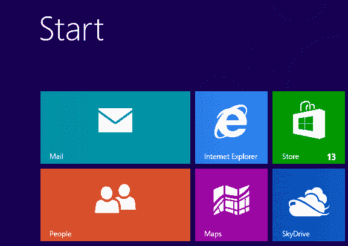
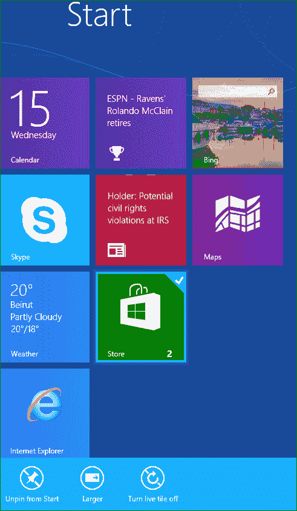
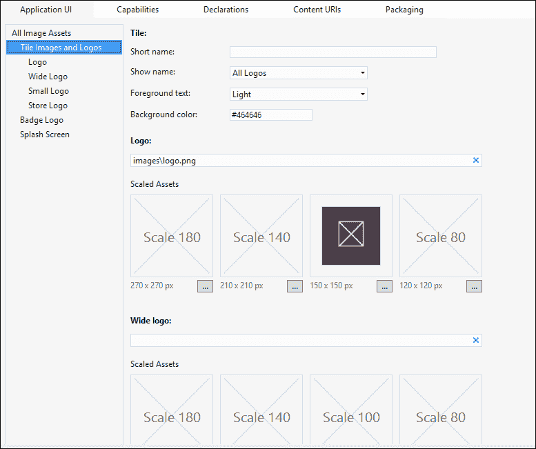
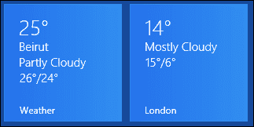
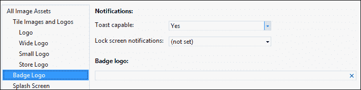
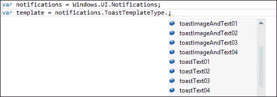
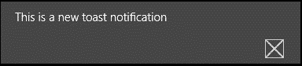

# 七、通过交互器和通知让应用上线

Windows 8 的**启动**屏幕上闪烁着瓷砖，这些瓷砖不仅仅是与特定应用相关联的大图标。在本章中，我们将学习应用磁贴的概念、磁贴类型以及每种磁贴的使用。此外，我们还将了解如何为应用定义这些交互器。然后我们将介绍通知和不同类型的通知方法，我们将编写一个示例代码，为应用创建并实现一个简单的通知。

# 介绍瓷砖、徽章和通知

Windows 8 应用的一个独特的特征是 tiles 的概念。此外，这些瓷砖使 Windows8 应用与众不同。这些应用用丰富的颜色、徽标和信息填充并装饰**开始**屏幕。瓷砖是应用在**开始**屏幕上的图形表示。此外，应用磁贴是应用的启动点；单击交互器将启动与桌面上 Windows 应用快捷方式类似的应用。

以下是一个干净安装的**开始**屏幕截图，显示了几个应用块：



每个已安装的应用都有一个默认磁贴，安装后立即添加到**开始**屏幕。此默认交互器有一个默认徽标图像，表示应用徽标或任何其他品牌来识别应用。默认情况下，交互器上会显示静态内容，其中包含指定应用名称的文本和表示徽标的图像。上一个屏幕截图显示了 Windows 8**启动**屏幕上的基本应用交互器示例。您可以在前面的屏幕截图中注意到，瓷砖有两种尺寸：正方形（150x150）px 和矩形（310x150）px。在 Windows8 命名约定中，这两种尺寸是正方形和宽的。正如您所见，两种尺寸都显示文本和图像，并显示某种状态的通知徽章；我们一会儿就可以看到徽章是什么了。默认情况下，所有应用都支持方形平铺；支持宽瓷砖是可选的。如果应用没有为默认磁贴提供宽徽标图像，用户将无法从**开始**屏幕菜单将应用磁贴放大。此外，如果应用包含宽徽标图像，Windows 8 将默认以宽格式显示交互器。

只要应用交互器包含两个版本，用户可以通过在宽交互器和方形交互器之间切换来个性化其**启动**屏幕。如果应用不包含宽徽标，用户将无法将磁贴变大。用户可以右键点击应用，将出现**开始**屏幕应用栏。从那里，用户可以点击**较大的**选项来更改瓷砖的大小。下面的屏幕截图显示了用户如何将**商店**应用的瓷砖从方形变为宽。



Windows8只要没有要显示的通知，就会显示默认的磁贴图像，当通知过期或用户关闭实时通知时，它会恢复为默认图像。图像大小和其他图像，如**小徽标**（显示在应用名称旁边的搜索结果中）和**商店徽标**（显示在 Windows 商店上）都包含在应用包中，并在**平铺图像和徽标**下的应用清单中指定清单编辑器**应用界面**窗格中的设置。在 Manifest Editor 上，我们可以为交互器指定背景颜色、将出现在交互器上的文本颜色以及应用的简短名称；更重要的是，我们可以浏览（并选择图像）不同大小的瓷砖，如下图所示：



如果您查看我们在前面的章节中创建的`test`应用的**启动**屏幕，您将看到应用磁贴显示 150x150 px 默认徽标中指定的图像；它填充方形瓷砖，不能使其变大。尝试选择一个**宽徽标**来运行应用，然后将应用平铺得更大以查看更改。为了保持 Windows8 的外观，交互器的内容是基于一组 Windows 提供的模板用 XML 定义的。可以在这些模板中通过提供相应的文本或图像或两者来定义交互器的内容。交互器还显示徽标或短名称。

除了默认的交互器外，还有辅助交互器，使用户可以在**开始**屏幕上显示应用中的特定内容。通过应用栏中可用的**Pin to Start**选项创建二级交互器，其中用户选择将特定位置或内容从应用锁定到**Start**屏幕。从辅助交互器启动应用时，用户将被定向到该应用内的特定位置。例如，我们可以从**人物**应用锁定联系人，第二个交互器将使用该联系人的更新信息对**开始**屏幕进行个性化设置；或者，我们可以确定某个特定城市的**天气**。二级交互器允许用户对其重要的**开始**屏幕信息进行个性化设置。下面的屏幕截图显示了天气应用的两个交互器；左侧是显示当前位置的**天气**的默认磁贴，右侧是显示**伦敦市**天气固定内容的辅助磁贴：



应用磁贴可以在应用未运行时传递与应用相关的状态信息，使用一个表示摘要或状态信息的通知徽章，这些信息可以是 1 到 99 之间的数字（大于 99 的值将显示为 99+），也可以是一组 Windows 提供的图像符号，称为**字形**。徽章出现在瓷砖的右下角，可以在方形和宽瓷砖上显示。

该应用的另一个与 UI 相关的概念是 toast 通知；这是一个弹出通知，显示在屏幕的右上角。Toast 通知使应用能够在应用未在屏幕上运行时向用户发送信息，即使用户正在使用另一个应用，或者在桌面上而不是在 Windows 8**启动**屏幕上。

### 提示

需要注意的是，应用分幅不应用作广告表面。根据 Windows 应用商店应用的条款，在大多数情况下不允许使用交互器显示广告。

## 使用活瓷砖

应用磁贴是应用的核心部分；很可能这是最常见的部分。这就是为什么你应该利用这个交互器来吸引用户的注意力，并通过实现一个实时交互器让他们回到应用中。实时交互器是吸引用户访问你的应用的理想方式之一，它可以显示重要信息，显示应用内部发生的最好情况。例如，Windows 8 中的**People**应用有一个实时交互器，可以在特定的时间间隔更改联系人的图片。

与静态交互器显示不同，静态交互器显示的默认内容通常是完整的交互器徽标图像和指示应用名称的文本，live 交互器可以更新默认交互器以显示新内容。Live Tile 可用于向用户更新其联系人、显示活动信息或显示最新消息。此外，实时交互器可以显示应用中的更新摘要，例如未读邮件的数量，从而为用户提供启动应用的动机。

# 发送通知

可以通过几种类型的通知更新交互器、辅助交互器、锁屏交互器和 toast。这些通知可以通过本地 API 调用生成，也可以通过对云上运行的某些服务的调用生成。此外，还有四种不同的通知传递方法可以发送交互器和徽章更新以及 toast 通知。这些方法包括：

*   **本地**：当应用在屏幕或后台运行时发送通知，以更新应用磁贴或徽章，或弹出 toast 通知。
*   **定时**：在预先知道的某个时间发送通知；例如，即将到来的约会的提醒。
*   **定期**：通过固定时间间隔轮询云服务器的新内容，定期发送通知；例如，每 12 小时更新一次天气。定期通知适用于瓷砖和徽章，但不适合用于祝酒。
*   **推送**：即使应用未运行，也会直接从云服务器向屏幕发送通知。推送通知适用于包括实时数据（如社交网络更新）或时间敏感信息（如即时消息或突发新闻）的情况。此通知方法可用于瓷砖、徽章和土司。

默认情况下，本地磁贴通知不会过期，但可以且理想情况下应该给出一个过期时间；但是，推送通知、定期通知和计划通知在提供通知后三天后过期。通过指定过期时间，应用可以从磁贴中删除通知内容（如果在到达过期时间时仍在显示）。

选择通知方式主要取决于您想要传递的信息以及应用的性质和内容。

### 提示

请记住，用户可以随时关闭和打开交互器通知，因此要小心不必要的 toast 通知会让用户不知所措。

为了实现通知功能并允许应用传输 toast 通知，我们必须在 manifest 文件中将其声明为支持 toast。一旦该应用被宣布为 toast 功能，它将被添加到**PC**设置的**通知：**部分的应用列表中。以下屏幕截图显示了在何处更改支持**Toast 的**设置：



现在，让我们编写一些代码来创建一个简单的本地 toast 通知。我们需要经常使用`Windows.UI.Notifications`名称空间；因此，为了简单起见，让我们声明一个名称空间变量，如下所示：

```js
var notifications = Windows.UI.Notifications;
```

接下来，我们需要从 Windows 提供的模板中选择一个来提供一个`ToastTemplateType`；这些模板确保应用在 toast 通知中保持预期的 Windows 8 外观。有如下文本模板：**toastText01**、**toastText02**、**toastText03**、**toastText04**等。图像和文本的模板分别为：**toassimage 和 text01**、**toassimage 和 text02**、**toassimage 和 text03**、**toassimage 和 text04**。

`WinJS`为这些模板提供 IntelliSense，当我们调用 notifications 变量上的`ToastTemplateType`枚举时会列出这些模板，如下面的屏幕截图所示：



对于本例，我们将选择只包含单个文本字符串的`toastText01`，该字符串最多包含三行。如果文本超过三行，它将被截断。然后，我们将获得模板内容，它是一个 XML 文档，如以下代码所示：

```js
var template = notifications.ToastTemplateType.toastText01;
var templateXML = notifications.ToastNotificationManager.getTemplateContent(template);
```

`templateContent`变量将包含以下 XML 框架：

```js
<toast>
  <visual>
    <binding template="toastText01">
      <text id="1"> </text>
    </binding>
  </visual>
</toast>
```

接下来我们需要做的是在这个 XML 模板中填充内容，所以我们需要用标记名`text`检索元素，如下代码所示：

```js
var toastTextElements = templateContent.getElementsByTagName("text");
toastTextElements[0].appendChild(templateXML.createTextNode("This is a new toast notification"));
```

然后，我们根据刚才指定的 XML 内容创建 toast 通知，如下所示：

```js
var newToast = new notifications.ToastNotification(templateXML);
```

最后，我们将创建一个`toastNotifier`变量，将我们定义的 toast 通知`newToast`发送到屏幕上，如下代码所示：

```js
var toastNotifier = notifications.ToastNotificationManager.createToastNotifier();
toastNotifier.show(newToast);
```

在`WinJS.UI.processAll()`方法上调用的`then()`函数中写入要执行的代码；因此，应用一启动，toast 通知就会出现。如果我们现在运行应用，屏幕右上角将弹出以下 toast 通知：



### 提示

请注意，应用于 toast 通知的背景色是应用清单中为应用的交互器声明的背景色。

前面的代码允许我们实现最小的 toast 通知；您可以尝试使用其他 toast 模板并比较结果。

# 总结

在本章中，我们在 UI 级别上介绍了 tile、徽章和通知的概念，并了解了它们之间的区别以及在哪里可以使用它们。

我们还学习了如何发送通知，并编写了一个示例代码，实现了向屏幕发送一个非常简单的 toast 通知。

在下一章中，我们将学习如何使用 Windows Live 服务启用用户身份验证，并允许用户使用其电子邮件 ID 登录。