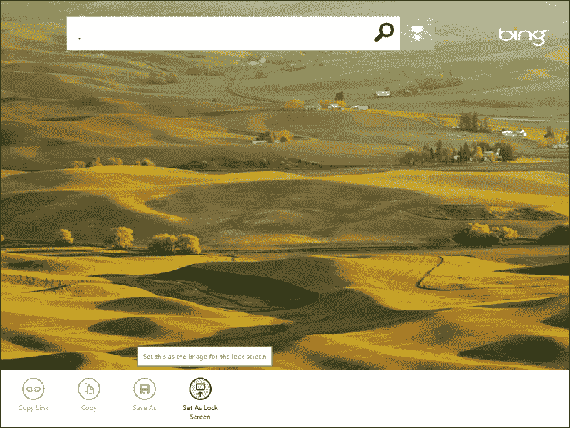
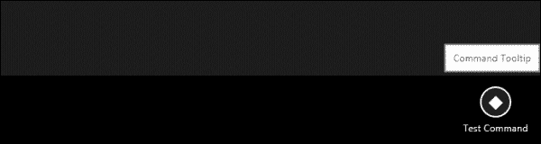
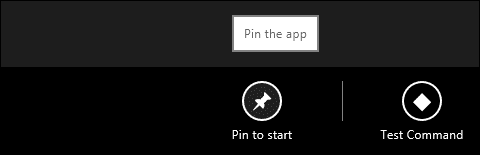

# 第 9 章添加菜单和命令

在本章中，我们将了解应用程序栏，了解其工作原理以及在应用程序上的位置。此外，我们将介绍如何声明应用程序栏并向其添加控件。

# 了解应用程序栏

当你运行 Windows 应用商店应用程序时，你看到的只是一个全屏应用程序，让你沉浸在应用程序的内容中；然而，然后你会问自己所有的按钮和控件都在哪里。它们都包含并隐藏在应用程序栏中，隐藏到您需要它们为止，当然是为了避免分心，并利用屏幕上的每个像素来显示应用程序的内容。

应用程序栏可在屏幕底部找到，并在用户触发时显示。这可以通过触摸手势（从下边缘向上或从上边缘向下敲击或滑动）、鼠标（通过右键单击）或键盘（通过快捷方式窗口+*Z*完成）。应用程序栏通常包含与当前屏幕相关的控件。默认情况下，控件在屏幕的左侧和右侧等分。左侧包含特定于应用程序中当前显示的内容的命令，右侧包含应用程序全局并应用于所有页面的命令。应用程序栏还可以包含特定于应用程序中单个元素的命令。

让我们来看一个示例应用程序栏。下面的屏幕截图显示了微软 Bing 应用程序的应用程序栏，其中包含四个命令，即**复制链接**、**复制**、**另存为**、**设置为锁屏**：



应用程序栏的隐藏机制允许用户集中精力，沉浸在内容中，并最大限度地减少干扰。它让用户在需要时能够一致且轻松地访问命令，并且用户可以轻松地查看或隐藏应用程序栏。

当我们尝试使用鼠标、触摸或键盘显示应用程序栏时，屏幕顶部会同时出现另一个栏。这是一个导航栏，虽然看起来很相似，但它不是一个应用程序栏。导航栏用于显示帮助我们在应用程序的不同部分之间导航的控件。

应用程序栏（如果存在）应始终可供用户使用，从而适应快照和纵向视图之间布局的变化。例如，如果无法在捕捉视图中显示所有命令，则可以尝试将它们分组到菜单中，并为命令提供工具提示，即使 Windows 会自动隐藏标签并相应地调整填充。

### 提示

强烈建议您不要更改`WinJS`提供的默认布局所应用的按钮的大小或填充，因为它设计用于在所有支持的屏幕尺寸上安装 10 个命令；更重要的是，它旨在支持触摸手势。因此，更改布局可能会破坏此行为。

应用程序栏由库使用对象`WinJS.UI.AppBar`提供。

在标记中声明应用程序栏非常简单。我们首先从一个简单的`div`元素创建一个应用程序栏，只需在`data-win-control`属性中指定一个`WinJS.UI.AppBar`控件。语法如下所示：

```js
<div id="testAppBar" data-win-control="WinJS.UI.AppBar"> </div>
```

前面的语法将创建一个空的应用程序栏，当鼠标或向上滑动触发时将显示该应用程序栏。

应用程序栏包含命令按钮，因此让我们在应用程序栏中添加一个命令按钮。为了创建 app bar 命令按钮，我们将使用一个`button`元素，将其`data-win-control`属性指定为`AppBarCommand`，如下代码所示：

```js
<div id="testAppBar" data-win-control="WinJS.UI.AppBar">
  <button data-win-control="WinJS.UI.AppBarCommand"></button>
</div>
```

前面的语法将显示内部带有空命令按钮的应用程序。我们可以通过在`data-win-options`属性中指定一些选项，将生命添加到此命令按钮。这些方案如下：

*   `type`：此选项表示以下值中的命令类型—`button`、`toggle`、`separator`和`flyout`。
*   `Id`：此选项为命令指定一个 ID。
*   `label`：此选项指定要在应用程序栏上显示的文本。
*   `Icon`：此选项通过从 Windows 提供的`AppBarIcon`列表中选择一个值，例如`pin`、`unpin`、`accept`、`cancel`和`delete`，或者通过指定自定义 PNG 图像文件的路径，为命令指定要显示的图标。
*   `section`：此选项表示该命令所属的节，可以是`selection`或`global`。`selection`部分将把命令放在应用程序栏的左侧，这是为上下文或页面特定命令保留的，而`global`部分将把命令放在右侧，这是为全局或应用程序级命令保留的。
*   `tooltip`：此选项指定当用户将鼠标悬停在命令上方时显示的信息工具提示（提示）。

下面的代码显示了为我们在上一个示例中声明的命令按钮添加这些选项后语法的外观：

```js
<button data-win-control="WinJS.UI.AppBarCommand" 
data-win-options="{type:'button', id:'testCmd', label:'Test Command', icon:'placeholder', section:'global', tooltip: 'Command Tooltip' }">
</button>
```

运行应用程序，您将看到一个应用程序栏。如以下屏幕截图所示：



正如您可以在前面的屏幕截图中看到的，应用程序栏包含一个带有占位符图标的按钮，标记为**测试命令**；悬停在上方时，将显示工具提示**命令工具提示**。

## 向命令添加功能

我们刚刚创建的应用程序栏实际上还没有做任何事情，所以让我们添加另一个命令并检查其他类型。但在此之前，我们需要在两个命令之间设置一个分隔符；除了命令按钮之外，它还可以使用应用程序栏默认包含的`hr`元素创建。

`hr`元素还需要设置`data-win-control="WinJS.UI.AppBarCommand"`属性。创建分隔符的语法如下所示：

```js
<hr data-win-control="WinJS.UI.AppBarCommand"data-win-options="{type:'separator', section:'global'}" />
```

在分隔符之后，我们将添加一个新的按钮命令，但这次我们将选择 pin 图标；语法如下所示：

```js
<div id="testAppBar" data-win-control="WinJS.UI.AppBar">
<button data-win-control="WinJS.UI.AppBarCommand" data-win-options="{ type:'button', id:'pinCmd', label:'Pin to start', icon:'pin', section:'global', tooltip: 'Pin the app'}">
</button>
<hr data-win-control="WinJS.UI.AppBarCommand" data-win-options="{type:'separator', section:'global'}" />
<button data-win-control="WinJS.UI.AppBarCommand" data-win-options="{type:'button', id:'testCmd', label:'Test Command', icon:'placeholder', section:'global', tooltip: 'Command Tooltip' }">
</button>
</div>
```

现在运行应用程序，你会看到两个命令按钮，一个带有 pin 图标，另一个带有占位符图标，这两个按钮之间有一个分隔符，看起来像`hr`元素。以下是当用户将鼠标悬停在标有**Pin 以启动**的命令上时生成的应用程序栏的屏幕截图：



这些命令在应用程序栏上看起来不错，但单击时仍然没有任何作用，因此让我们在**Pin 中添加一些功能，以启动**命令按钮并启动应用程序 Pin。

要向命令按钮添加一些功能，我们需要从应用程序栏中检索它们，并向其中添加一个`click`事件处理程序。下面的代码获取应用程序栏并将其设置为变量。然后，它使用其`Id`属性获取该应用程序栏中的特定命令，并将一个函数附加到其单击事件：

```js
//get the appbar control
var appbar = document.getElementById("testAppBar").winControl;
//get the command and add an event handler to it
appbar.getCommandById("pinCmd").addEventListener("click", clickPin, false);
//function to be called when the command is clicked
function clickPin() {
var dialog = new Windows.UI.Popups.MessageDialog("The pin command in the bar has been clicked.");
dialog.showAsync();
}
```

立即运行应用程序，点击**Pin 启动**命令按钮；屏幕上将出现一个弹出消息对话框。

应用程序栏默认位于应用程序的底部，可以更改为位于屏幕的顶部；但是，它应该包含将用户移动到不同页面的导航元素。根据Windows8UX 指南，顶部的应用程序栏是一个导航栏。回到代码，我们只需在 app bar 控件中设置`data-win-options`属性的`placement`属性的值，就可以从下到上改变 app bar 的位置，如下代码所示：

```js
<div id="testAppBar" data-win-control="WinJS.UI.AppBar" data-win-options="{placement:'top'}">
```

但是，用户体验指南的默认和推荐行为是将应用程序栏放在底部，因为顶部栏是为导航命令保留的。

在前面的示例中，我们已将应用程序栏添加到主页`default.html`，但实际上，我们应该选择将应用程序栏包含在其中的页面不是任意的，并且取决于其范围，如下所示：

*   如果应用程序栏包含全局命令且应可用于所有页面，则将其添加到`default.html`页面
*   如果应用程序栏包含特定于一个页面的命令，并且在页面和另一个页面之间会有所不同，则将其添加到特定页面（一个`PageControl`对象）

或者，我们可以在主`default.html`文件中定义一个默认的应用程序栏，然后在该特定页面的加载事件中对应用程序栏进行必要的修改，这需要不同于默认的命令。

# 总结

在本章中，我们了解了什么是应用程序栏，以及在哪里可以放置应用程序的命令和控件。我们还了解了应用程序栏和导航栏之间的区别。我们看到了什么是应用程序栏命令以及它们可以持有的不同选项。然后我们看到了如何创建一个包含命令和分隔符的简单应用程序栏。

最后，我们了解了如何将基本功能添加到应用程序栏上的任何命令类型。

在下一章中，我们将到达 Windows 应用商店应用程序的最终目的地；也就是说，提交到应用商店本身，我们将学习如何从 VisualStudio 将应用程序发布到应用商店，并在仪表板上处理应用程序配置。