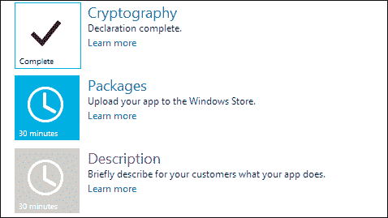
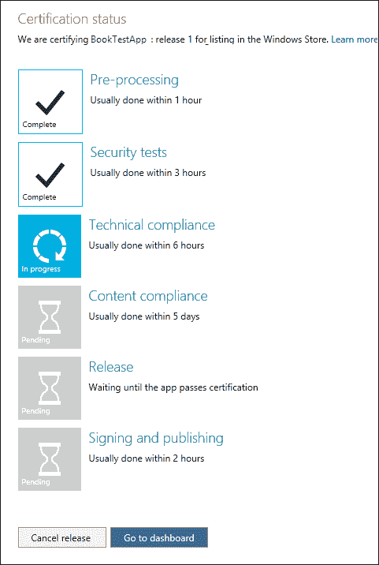
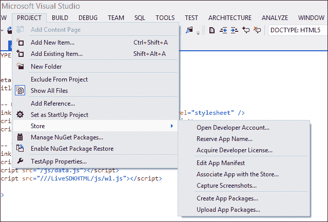
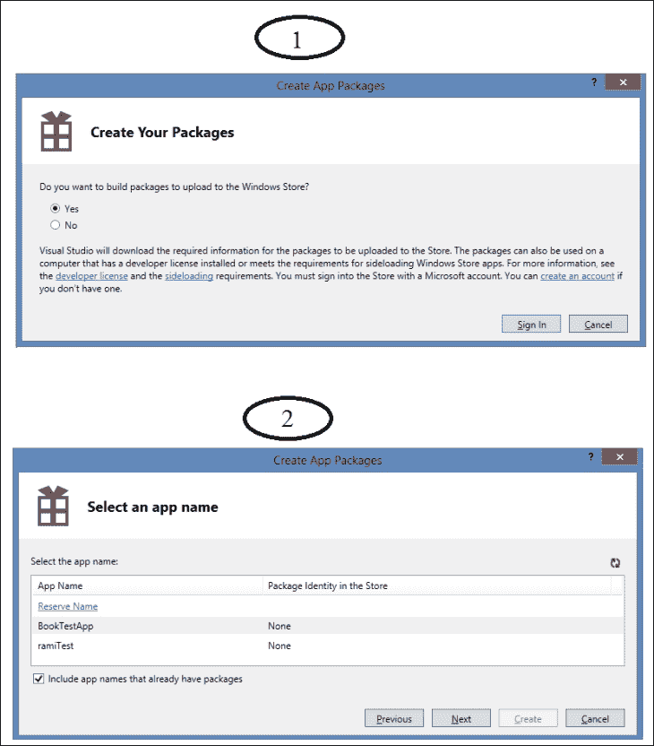
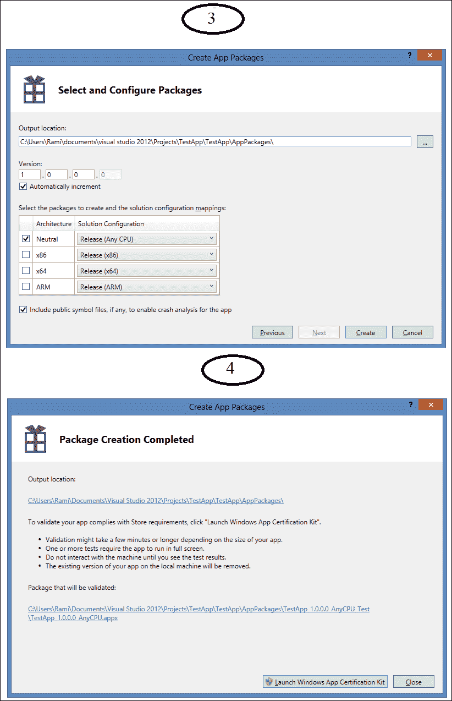
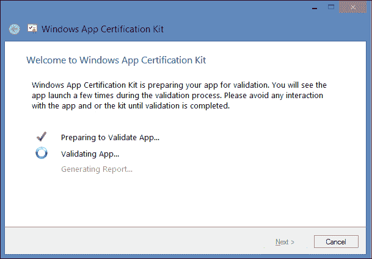
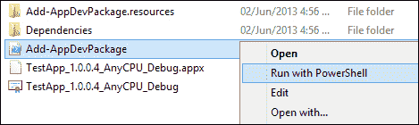
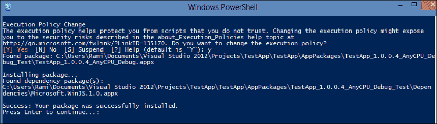

# 第十章包装与出版

Windows 商店就像一个巨大的购物中心，你的应用程序一旦发布到商店，就会像购物中心里的一个小店；Windows 应用商店仪表板是您设置商店所有品牌、广告和营销资料的地方。VisualStudio 是您的生产环境，应用商店是您的目标，两者之间的所有内容都在 Windows 应用商店仪表板中。在本章中，我们将介绍应用商店，并学习如何让应用程序通过发布的所有阶段。此外，我们还将了解如何从 VisualStudio 中与商店交互。

# 介绍 Windows 应用商店

开发 Windows 应用商店应用程序不仅仅是设计、编码和标记。在 Windows 应用商店的仪表板上完成了成功应用程序的一个非常重要的部分。在这里，你可以提交应用程序，为其进入市场铺平道路，并监控其在市场上的表现。此外，在这里，您可以获得有关现有应用程序的所有信息，并可以规划下一个应用程序。当我们学习如何添加身份验证和登录功能时，我们已经在[第 8 章](08.html "Chapter 8. Signing Users in")中对仪表板进行了预览，中的*签名用户。提交过程分为七个阶段，在[第 8 章](08.html "Chapter 8. Signing Users in")中*在*中签署用户，我们完成了发布摘要页面的第一步，即保留应用名称并在 Windows 应用商店注册应用。要提交应用程序进行认证，还有六个步骤需要完成。如果您还没有打开 Windows 应用商店开发人员帐户，现在是时候这样做了，因为您需要它来访问仪表板。在你注册之前，确保你有一张信用卡。Windows 应用商店需要信用卡才能开立开发人员帐户，即使您拥有免费注册的注册码。*

登录后，在主页上的**应用程序进行中**部分找到您的应用程序，然后单击**编辑**。这将引导您进入发布摘要页面，应用程序标题为**AppName:Release 1**。每次提交同一应用程序的新版本时，版本号将自动递增。“发布摘要”页面列出了使应用程序准备好进行 Windows 应用商店认证的步骤。在此页面上，您可以输入有关 Windows 应用商店应用程序的所有信息，并上载其软件包以进行认证。此时，您会注意到页面底部标记为**审查发布信息**和**提交认证应用程序**的两个按钮被禁用，并将保持禁用状态，直到所有前面的步骤被标记为**完成**。提交进度始终可以保存，以便稍后恢复，因此不一定是一次性任务。我们将逐一介绍这些步骤：

1.  **App 名称**：此为第一步，包括为 App 预留唯一名称。
2.  **销售明细**：此步骤包括选择以下内容：
    *   **应用程序价格层**选项设置应用程序的价格（例如，免费或 1.99 美元）。
    *   **免费试用期**选项是客户在开始付费使用应用程序之前可以使用该应用程序的天数。仅当**应用价格层**未设置为**免费**时，此选项才启用。
    *   **市场**中您希望应用程序在 Windows 应用商店中上市。请记住，如果您的应用程序不是免费的，您的开发者帐户必须为您选择的每个国家/地区提供有效的税务资料。
    *   **发布日期**选项指定应用程序在 Windows 应用商店中上市的最早日期。默认选项是在应用程序通过认证后立即发布。
    *   **应用程序类别和子类别**选项表示您的应用程序将在商店中列出，而商店又会列出**类别**下的应用程序。
    *   **硬件要求**选项将指定 DirectX 功能级别和系统 RAM 的最低要求。
    *   **可访问性**选项是一个复选框，当选中该复选框时，表示该应用程序已经过测试，符合可访问性指南。
3.  **服务**：在这一步中，您可以向您的应用程序中添加诸如 Windows Azure 移动服务和 Live 服务等服务（就像我们在[第 8 章](08.html "Chapter 8. Signing Users in")、*中在*中签名用户所做的那样）。您还可以提供客户可以在应用程序内购买的产品和功能，称为应用内优惠。
4.  **年龄等级和等级证书**：在此步骤中，您可以从可用的 Windows 应用商店年龄等级设置应用程序的年龄等级。此外，如果你的应用是游戏，你还可以上传特定国家/地区的评级证书。
5.  **加密**：在此步骤中，您指定您的应用程序是否调用、支持并包含或使用加密或加密。以下是应用程序如何应用加密或加密的一些示例：
    *   使用数字签名，如身份验证或完整性检查
    *   对应用程序使用或访问的任何数据或文件进行加密
    *   密钥管理、证书管理或与公钥基础结构交互的任何内容
    *   使用安全通信通道，如 NTLM、Kerberos、**安全套接字层**（**SSL**）或**传输层安全**（**TLS**）
    *   加密密码或其他形式的信息安全
    *   复制保护或**数字版权管理**（**DRM**）
    *   防病毒保护
6.  **软件包**：在这一步中，您可以通过上传软件包创建过程中在 Visual Studio中创建的`.appxupload`文件，将您的应用程序上传到商店。我们将很快了解如何创建应用程序包。最新上传将显示在软件包框中的发布摘要页面上，并应标记为**验证完成**。
7.  **说明**：在这一步中，您可以添加一个简短的说明（必填），说明应用程序为您的客户做了什么。该描述限制为 10000 个字符，将显示在 Windows 应用商店中应用程序列表的**详细信息**页面中。除说明外，此步骤还包含以下功能：
    *   **应用程序功能**：此功能为可选功能。它允许您列出多达 20 个应用程序的关键功能。
    *   **截图**：此功能为必填项，要求提供至少一张`.png`文件图像；第一个可以是代表您的应用程序的图形，但所有其他图像必须是屏幕截图，带有直接从应用程序中获取的标题。
    *   **注**：此功能为可选功能。输入您认为您的客户需要知道的任何其他信息；例如，更新中的更改。
    *   **推荐硬件**：此功能为可选功能。列出应用程序需要运行的硬件配置。
    *   **关键词**：此功能为可选功能。输入与应用程序相关的关键字，帮助其列表出现在搜索结果中。
    *   **版权和商标信息**：此功能是强制性的。输入将在应用程序列表页面中显示给客户的版权和商标信息。
    *   **附加许可条款**：此功能是可选的。输入客户购买此应用时接受的对**标准****应用许可条款**的任何变更。
    *   **促销图片**：此功能为可选功能。添加编辑用于在商店中提供应用功能的图像。
    *   **网站**：此功能为可选功能。输入描述应用程序的网页的 URL（如果有）。
    *   **支持联系方式**：此功能为必填项。输入支持联系电子邮件地址或网页 URL，您的客户可以在该网页上寻求帮助。
    *   **隐私政策**：此功能为可选功能。输入包含隐私策略的网页的 URL。
8.  **测试人员注意事项**：这是最后一步，它包括为 Windows 应用商店团队审查您的应用程序的人员添加有关此特定版本的注意事项。这些信息将帮助测试人员理解和使用此应用程序，以便快速完成测试并为 Windows 应用商店认证该应用程序。

每个步骤将保持禁用状态，直到前一个步骤完成，并且正在进行的步骤标有完成该步骤所需的大致时间（以分钟为单位）。并且无论何时完成单个步骤中的工作，都会在摘要页面上标记为**完成**，如下图所示：

## 提交 app 进行认证

在所有步骤标记为**完成**后，您可以提交app 进行认证。单击**提交认证**后，您将收到一封电子邮件通知，说明 Windows 应用商店已收到您的认证应用。仪表板将提交应用程序，您将被引导至**认证状态**页面。在这里，您可以在认证过程中查看 app 的进度，包括以下步骤：

*   **预处理**：此步骤将检查是否已输入发布应用程序所需的所有详细信息。
*   **安全测试**：此步骤测试您的应用程序是否存在病毒和恶意软件。
*   **技术符合性**：此步骤涉及 Windows 应用程序认证工具包检查应用程序是否符合技术政策。同样的评估也可以使用 VisualStudio 在本地运行，在上传包之前，我们将很快看到它。
*   **内容符合性**：此步骤由门店团队的测试人员完成，他们将检查应用程序中可用的内容是否符合 Microsoft 设置的内容策略。
*   **发布**：此步骤包括发布 app；除非您在**销售详情**中指定的发布日期在将来，否则不会花费太多时间，在这种情况下，应用程序将一直处于此阶段，直到该日期到来。
*   **签字发布**：这是认证流程的最后一步。在此阶段，您提交的软件包将使用与您的开发者帐户的技术细节相匹配的可信证书进行签名，从而为潜在客户和观众保证该应用程序已通过 Windows 应用商店的认证。

以下屏幕截图显示了 Windows 应用商店仪表板上的认证过程：

没有需要在该页面上等待；您可以点击**进入仪表板**按钮，您将被重定向到**我的应用**页面。在包含您刚刚提交的应用程序的框中，您会注意到**编辑**和**删除**链接已消失，而只有**状态**链接，它将带您进入**认证状态**页面。此外，此页面上将出现一个**通知**部分，列出您刚刚提交的应用程序的状态通知，例如：

**BookTestApp:1 版提交认证。2013 年 6 月 4 日**

认证过程完成后，将通过电子邮件通知您认证结果。此外，将向仪表板主页添加一条通知，显示认证结果（失败或成功），并带有指向认证报告的链接。如果应用程序失败，认证报告将显示需要重新访问的部件。此外，还有一些资源可以帮助您识别和修复认证过程中可能出现的问题和错误；这些资源可在以下位置的 Windows 应用商店应用程序的*Windows 开发中心*页面中找到：

[http://msdn.microsoft.com/en-us/library/windows/apps/jj657968.aspx](http://msdn.microsoft.com/en-us/library/windows/apps/jj657968.aspx)

此外，在认证过程中，您可以随时检查仪表板以检查应用程序的状态。

在认证过程成功完成后，应用程序包将发布到商店，并在您的应用程序列表页面中显示所有相关数据。数以百万计的 Windows 8 用户可以访问此页面，他们将能够找到、安装和使用您的应用程序。

一旦应用程序发布到商店并启动并运行，您就可以开始收集有关其在商店中运行情况的遥测数据；这些指标包括应用程序启动的次数、运行的时间以及是否崩溃或遇到 JavaScript 异常等信息。一旦您启用遥测数据收集，商店将为您的应用程序检索这些信息，分析它们，并在仪表板上的信息丰富的报告中汇总它们。

现在，我们已经介绍了您需要了解的有关将应用程序提交到 Windows 应用商店的过程的几乎所有信息，让我们看看在 Visual Studio 中需要做什么。

# Visual Studio 中的商店

可以使用**存储**菜单从 Visual Studio 中访问 Windows存储。不是我们在仪表板上做的所有事情都可以在这里完成；此菜单提供了一些非常重要的功能，如创建应用程序包。使用 Visual Studio 2012 Ultimate，**Store**菜单可以位于菜单栏中**项目**项下，或者如果您使用的是 Visual Studio 2012 Express，则可以直接在菜单栏中找到它，并且仅当您正在处理 Windows Store 项目或解决方案时，它才会出现。

我们将详细了解**Store**菜单提供的命令，下面是显示菜单外观的屏幕截图：

**存储**菜单中的命令选项如下：

*   **开立开发者账户。。。**：此选项将打开一个网页，引导您至*Windows 应用商店应用程序的 Windows 开发中心*，在那里您可以获得该应用商店的开发人员帐户。
*   **预订应用程序名称。。。**：此选项将引导您进入 Windows 应用商店仪表板，特别是**提交应用程序**页面，您可以从第一步开始，保留应用程序名称，正如我们在[第 8 章](08.html "Chapter 8. Signing Users in")*中所看到的，*中的用户签名。
*   **获取开发者许可证。。。**：此选项将打开一个对话框窗口，将提示您使用您的 Microsoft 帐户登录；在您登录后，它将检索您的开发人员许可证，如果您已经有开发人员许可证，则将其续订。
*   **编辑应用程序清单**：此选项将打开清单设计器选项卡，因此您可以编辑应用程序清单文件中的设置。
*   **将应用程序与商店关联。。。**：此选项将在 Visual Studio 中打开类似向导的窗口，其中包含将应用程序与商店关联所需的步骤。第一步将提示您登录；之后，向导将检索使用您用于登录的 Microsoft 帐户注册的应用。选择一个应用程序，向导将自动将以下值下载到本地计算机上当前项目的应用程序清单文件中：
    *   包的显示名称
    *   包裹名称
    *   发布者帐号
    *   发布者的显示名称
*   **截图截图。。。**：此选项将构建当前应用程序项目，并在模拟器中启动而不是启动屏幕。一旦模拟器打开，您可以使用模拟器侧栏上的**复制屏幕截图**按钮。此按钮将用于拍摄正在运行的应用程序的屏幕截图，该应用程序将此图像保存为`.png`文件。
*   **创建应用程序包。。。**：此选项将打开一个包含**创建应用程序包**向导的窗口，我们将很快看到该向导。
*   **上传应用程序包。。。**：此选项将打开一个浏览器，引导您进入 Windows 应用商店仪表板中的发布摘要页面，前提是您的应用商店帐户已全部设置且应用已注册。否则，它将带您进入登录页面。在发布摘要页面中，您可以选择**软件包**并从中上传您的应用程序包。

## 创建应用程序包

**商店**菜单中最重要的实用程序之一是应用程序包创建，它将为应用程序构建并创建一个包，我们可以在稍后阶段上传到商店。此软件包与商店要求的所有特定于应用程序和特定于开发人员的详细信息一致。此外，开发人员不必担心整个包创建过程的任何复杂性，这是为我们抽象的，可以通过向导链接窗口获得。

在**创建应用程序包**向导中，我们可以直接为 Windows 应用商店创建应用程序包，也可以创建用于测试或本地分发的应用程序包。此向导将提示您为应用程序包指定元数据。

以下屏幕截图显示了此过程中涉及的前两个步骤：

在第一步，向导将询问您是否要构建要上传到 Windows 应用商店的包；如果您想要为商店构建软件包，请选择**是**，如果您想要测试和本地使用的软件包，请选择**否**。考虑到第一种情况，单击**登录**继续并使用您的 Microsoft 帐户完成登录过程。

成功登录后，向导将提示您**选择应用程序名称**（上一屏幕截图的步骤 2），方法是单击向导中列出的应用程序，或选择**保留名称**链接，该链接将引导您到 Windows 应用商店仪表板以完成此过程并保留新的应用程序名称。以下屏幕截图显示了步骤 3 和步骤 4：

步骤 3 包含**选择和配置包**部分，在该部分中，我们将选择指向创建包文件位置的**输出位置**。此外，在本节中，我们可以输入此软件包的版本号，或者选择使其在每次打包应用程序时自动递增。此外，我们可以从**中性**、**ARM**、**x64**和**x86**选项中选择我们想要的包的构建配置，默认情况下，选项，将选择当前活动项目平台，并为所选的每种配置类型生成一个包。

本节最后一个选项是**包含公共符号文件**选项。选择此选项将生成公共符号文件（**.pdb**）并将其添加到包中，这将有助于商店稍后分析您的应用程序，并将用于映射应用程序的崩溃。最后，点击**创建**并等待包装处理。完成后，将出现**包创建完成**部分（步骤 4），并将显示**输出位置**作为指向包文件的链接。另外，还有一个按钮可以直接启动**Windows 应用程序认证套件**。**Windows 应用程序认证工具包**将根据商店要求验证应用程序包，并生成验证报告。

以下屏幕截图显示了包含**Windows 应用程序认证工具包**流程的窗口：

或者，还有第二个场景用于创建应用程序包，但它更侧重于测试，这与我们刚才看到的过程相同，只是您必须在向导的第一页中选择**否**，并且无需使用 Microsoft 帐户登录。此选项将在包创建完成后结束向导，并显示指向输出文件夹的链接，但您将无法启动**Windows 应用程序认证工具包**。使用此选项创建的软件包只能在安装了开发人员许可证的计算机上使用。由于商店的软件包最好首先在本地进行测试，因此将更频繁地使用此场景。创建用于测试或本地分发的应用程序包后，可以将其安装到本地计算机或设备上。

让我们在本地安装这个包。启动**创建应用程序包**向导；在第一步中选择**否**，完成向导，并在为包位置指定的输出文件夹中查找刚刚创建的应用程序包的文件。将其命名为`PackageName_Test`。此文件夹将包含`.appx`文件、安全证书、Windows PowerShell 脚本和其他文件。使用应用程序包生成的 Windows PowerShell 脚本将用于安装软件包进行测试。导航到**输出**文件夹并安装应用程序包。找到并选择名为`Add-AppDevPackage`的脚本文件，然后右键单击并选择**与 PowerShell**一起运行，如下图所示：

运行脚本，脚本将执行以下步骤：

1.  显示**执行策略变更**信息，并提示变更执行策略。输入`Y`继续。
2.  它检查你是否有开发者许可证；如果没有任何脚本，它将提示您获取一个脚本。
3.  检查并验证应用程序包和所需证书是否存在；如果缺少任何项，将通知您在安装开发人员软件包之前安装它们。
4.  它检查并安装任何依赖项包，如`WinJS`库。
5.  显示信息**成功：您的软件包已成功安装**。
6.  按*进入*继续，窗口将关闭。

以下屏幕截图显示了上述步骤：

脚本成功完成后，您可以在**启动**屏幕上查找您的应用程序并启动它。

### 提示

请注意，对于网络上且无权访问`Add-AppDevPackage`PowerShell 脚本文件所在目录的用户，可能会显示错误消息。在运行脚本之前，只需将`output`文件夹的内容复制到本地计算机，即可解决此问题。此外，对于任何与安全相关的问题，您可能希望咨询 Windows 开发人员中心以获得解决方案。

# 总结

在本章中，我们了解了 Windows 应用商店仪表板的细节，并介绍了应用程序提交过程中导致应用程序在应用商店中发布的步骤。我们还了解了 VisualStudio 中的**商店**菜单以及它提供的与仪表板交互的选项。此外，我们还学习了如何创建应用程序包以及如何在本地部署应用程序进行测试。

在下一章中，我们将在硬币的另一面看到一个潜行的高峰，即使用 XAML 开发 Windows 8 应用程序，并了解它与使用 JavaScript 开发应用程序的相似性，从而向您展示使用多种编程语言为 Windows 8 开发应用程序的能力。