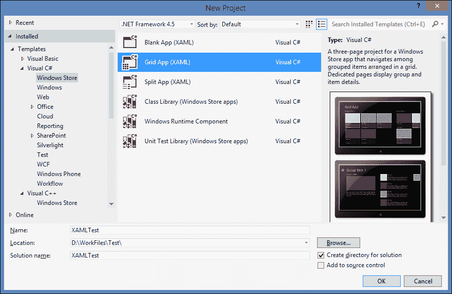
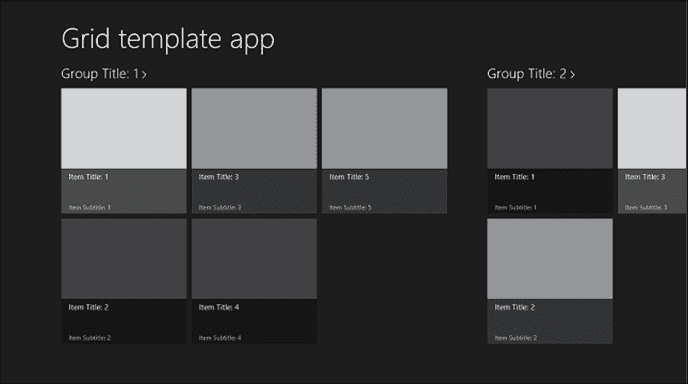
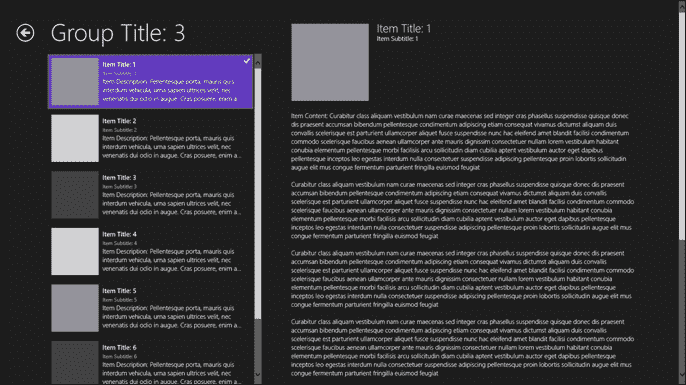
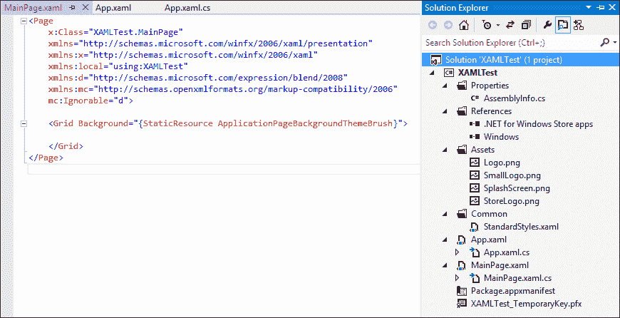
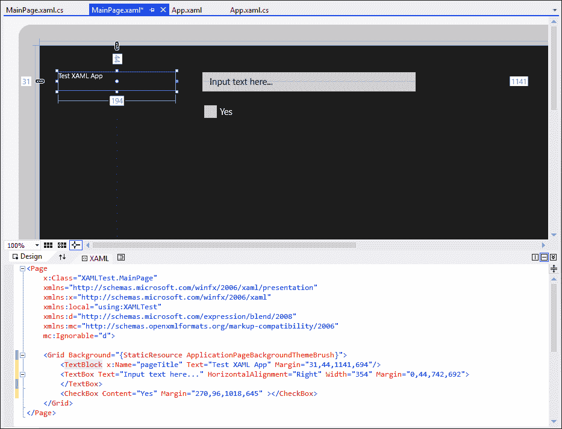
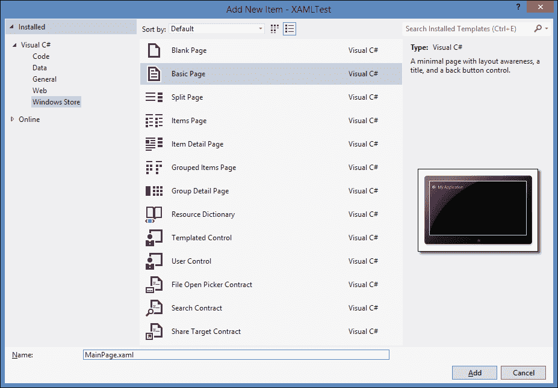
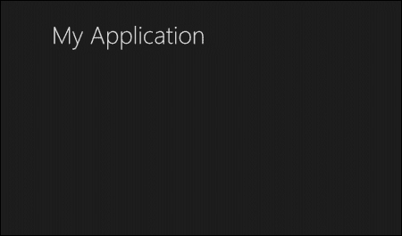
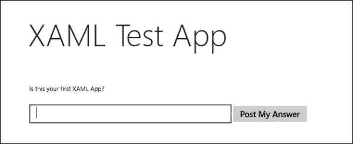
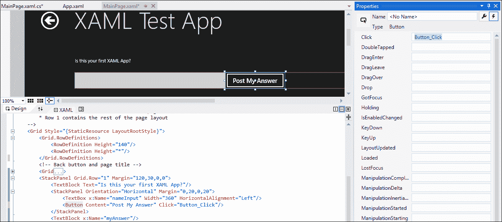

# 第 11 章使用 XAML 开发应用程序

开发 Windows 应用商店应用程序并非 HTML5 和 JavaScript 独有。微软还提供了其他选择，包括**可扩展应用程序标记语言**（**XAML**）和.NET，从而针对更广泛的开发者和专业知识为商店开发。无论您的背景是什么，无论是 web 还是 Windows 开发，都有一个适合您的地方—一个起点，因为无论您选择何种编程语言，通往 Windows 应用商店的路线图都是相同的。在前面的章节中，我们学习了如何使用 HTML5 和 JavaScript 开发应用程序和功能。但在本章中，我们将学习可供开发人员使用的其他平台和编程语言。我们还将介绍使用 XAML/C#创建应用程序的基础知识。

# 创建不同平台的应用

Windows 8 最重要的进步之一是，您可以使用多种框架和编程语言开发应用程序，同时面向 web 和 Windows 开发人员。此外，开发人员可以利用他们现有的编程技能和知识创建 Windows 应用商店应用程序，而不必掌握全新的技能。

Web 开发人员将能够利用他们的 HTML5、CSS3 和 JavaScript 技能，甚至可以轻松地将现有网站移植到商店应用程序中，而熟悉 Microsoft.NET Framework 和 Silverlight 的 Windows 开发人员可以将他们的 XAML、C#和 Visual Basic 技能付诸实施。另外，Windows 8 通过提供 Visual C++／XAML 中创建 Windows 存储应用程序的机会来向熟悉 C++语法和本机库的开发人员提供目标。此外，C++可以创建 Direct2D 和 Direct3D 应用程序。综上所述，我们有了带有 VB.NET、C++和 C++的 XAML 标记，并在上面介绍了 VisualStudio 2012，为所有这些编程语言提供了项目模板和智能感知支持。

同一个应用程序可以用 XAML 或 HTML5 构建，部署并运行时，两个版本将以相同的方式运行。在前几章中，我们学习到的针对 Windows 应用商店应用的 JavaScript 和 HTML5 的所有功能，从功能到特性，都可以通过 C#、VB.Net 和 XAML 来完成。要使用的编程语言的选择主要基于个人偏好、背景经验和语言熟悉程度。这两种选择都需要一定程度的学习。熟悉 HTML 标记、CSS 样式和 JavaScript 功能的 Web 开发人员需要了解 WinJS 特定 JavaScript函数和 HTML 数据属性和类。此外，具有 XAML 经验的开发人员将注意到对 WPF 和 Silverlight 非常熟悉，但必须了解为 Windows 应用商店开发的设计和功能。然而，正如我所提到的，当您在熟悉的领域开始 Windows 应用商店开发时，学习曲线是最小的。

# 推出 XAML 应用

使用 XAML 的 Windows 应用商店应用程序的路线图与使用 JavaScript 的应用商店应用程序的路线图相同，从工具开始，通过设计指南获得开发人员许可证，规划应用程序，最后打包并发布到应用商店。

让我们使用 XAML 创建一个基本的 Windows 应用商店应用程序，并将其与使用 HTML5 制作的应用程序进行比较。在 Visual Studio 中，从顶部菜单导航到**文件****新项目**。在**新建项目**对话框窗口中，从**已安装****模板**下的左窗格中选择您喜欢的编程语言，然后选择**Windows Store**。接下来，我们为 Windows 应用商店应用程序选择一个列出的项目模板，并在**名称：**文本框中输入它的名称。我将选择**Visual C#**进行此演示；请随意使用 AutoT16.VisualBasic Ty17 或 Po.T18 Visual C++ + T19。最后，点击**确定**创建项目：下面的屏幕截图显示了所讨论的整个过程：



前面的屏幕截图显示了随 XAML 提供的以下 Windows 应用商店应用程序模板：**空白应用程序（XAML）**、**网格应用程序（XAML）**和**拆分应用程序（XAML）**。

*   **空白应用程序（XAML）**：此模板提供一个空的 Windows 应用商店应用程序，将编译并运行，但不包含任何用户界面控件或数据。当它运行基于此模板的应用程序时，它将只显示包含占位符文本的黑屏。
*   **Grid App (XAML)**: This template provides an app that enables users to browse through categories and dive into the details of the content that falls under each category. A few good examples for this template include shopping apps, news apps, and photo or video apps. The **Grid App (XAML)** template starts with a landing home page that will display a list of groups or categories. A single group is a named set of items; for example, a group of news articles named Sports News. When the user selects one group, the app opens the group details page, which in turn displays a list of items that the group contains on the right-hand side. Consequently, when the user selects a single item on either the home page or the group details page, the app will open a page that shows the item details.

    下面的屏幕截图显示了**网格应用程序（XAML）**的一个示例主页：

    

*   **Split App (XAML)**: This template provides an app that enables users to browse through categories to find specific content similar to a **Grid App (XAML)** template; however, with the **Split App (XAML)** template, users can view a list of items and item details in the same page in a two-column split view. This split view enables all users to switch among the items rapidly. Examples for the usage of this template include news readers or an e-mail app. This template starts with a landing home page that shows a list of groups. When the user selects a group, the app will open a split-view page. The following screenshot shows a sample split-view page:

    

这三个项目模板与 Windows 应用商店 JavaScript 项目中提供的模板类似，但后者提供了两个额外的模板，**固定布局应用程序**和导航应用程序。

我们将从**空白应用程序（XAML）**模板开始，该模板包含运行应用程序所需的最少项目文件。**空白应用程序（XAML）**模板创建一个空的 Windows 应用商店应用程序，该应用程序不包含任何用户界面，但将编译并运行。一旦创建了空白应用程序 Ty4 T4，就在 VisualStudio 的右侧导航到 PortT5 解决方案资源管理器 OutT6^，并展开项目文件的列表，以查看使用该模板创建的默认文件。

以下屏幕截图显示了在 XAML 文本编辑器中打开时，右侧显示了**解决方案资源管理器**的内容，左侧显示了`MainPage.xaml`文件：



我们刚刚创建的项目包含以下文件夹和文件，它们是所有使用 C#或 Visual Basic 的 Windows 应用商店应用程序不可或缺的：

*   `Properties`：此文件夹包含应用程序组装信息。
*   `References`：此文件夹包含项目引用文件，默认情况下有以下两个 SDK 引用：**.NET for Windows 应用商店应用程序**和**Windows**。
*   `Assets`：此文件夹包含以下图像：
    *   大小分别为 150 x 150 px 和 30 x 30 px 的大型和小型徽标图像。
    *   **飞溅屏幕**图像。
    *   尺寸为 50 x 50 px 的**店标**图像。
*   `Common`：此文件夹包含应用程序中常见的共享资源，如`StandardStyles.xaml`文件，该文件提供了一组默认样式，使应用程序具有 Windows 8 的外观。此外，此文件夹将包含实用程序和帮助程序类的文件。

此模板还包括以下`.xaml`页面文件：

*   `App.xaml`：这是显示用户界面所需的主应用文件，在应用运行时首先加载。此页面声明在应用程序中共享的资源，例如样式，并为内容主机提供标记。此页面类似于使用 JavaScript 的应用程序中的`default.html`页面所表示的内容。
*   `App.xaml.cs`：此是`App.xaml`的代码隐藏文件，包含处理全局应用特定行为和事件的代码，如应用启动和挂起。此文件类似于使用 JavaScript 的应用程序中的`default.js`文件。
*   `MainPage.xaml`：此是应用程序的默认启动页面，包含用于实例化页面的最小 XAML 标记和代码。
*   `MainPage.xaml.cs`：此为`MainPage.xaml`文件对应的代码隐藏文件。

最后是清单文件`Package.appxmanifest`，其中包含应用程序描述和与 JavaScript 模板中相同的设置。

### 注

Microsoft建议不要删除`Common`文件夹中的文件。此外，它既不能重命名也不能修改，因为这会导致生成错误。如果需要修改这些文件，可以创建原始文件的副本，然后修改副本。

那些以前没有听说过 XAML 的人现在可能已经迷路了，他们想知道你刚才在应用程序和`MainPage.xaml`文件中看到的语法。XAML 有一个基于 XML 的基本语法。简单来说，XAML 文档是一个 XML 文档，它显示了对象之间的层次关系，要被认为是有效的，它还必须是一个有效的 XML 文档。XAML 文件有一个`.xaml`文件名扩展名，每个 XAML 文件都与一个代码隐藏文件相关联，该文件包含处理事件、操作在 XAML 中创建或声明的对象和 UI 元素的代码。代码隐藏文件与 XAML 页面的分部类结合在一起，构成了一个完整的类。这类似于 ASP.NET 网页的概念，其中的`.aspx`文件包含`.cs`或`.vb`文件中的标记和代码。此外，可以在 Microsoft Expression Blend 中打开和编辑 XAML 文件。如果您是 XAML 新手，不要太担心语法，因为 VisualStudio 通过提供自动完成提示和建议列表来帮助您编写有效的标记，并且您将在此过程中学习语法。

使用 XAML 标记，我们可以像使用 HTML 一样创建 UI 元素，但使用不同的语法。让我们使用以下语法在`MainPage.xaml`文件中的`Grid`元素中添加以下 UI 元素：

```js
<TextBlock x:Name="pageTitle" Text="Test XAML App" ></TextBlock>
<TextBox Text="Input text here..." />
<CheckBox Content="Yes"/>
```

前面的代码列表显示了以下属性：`x:Name`，它指定分配给`TextBlock`元素的名称；`Text`，将数据指定为将在该元素中填充的文本；和`Content`，与`Text`类似，但将数据指定为文本，显示在`CheckBox`元素旁边。

代码清单中的第一行声明了一个基本的`TextBlock`元素，它类似于 HTML 中的`label`元素。我们给这个元素一个名称，并为其`Text`属性输入一个值。第二个元素是带有`Text`值的`Textbox`，第三个元素是带有`Content`值的`Checkbox`元素。您可以手动编写语法，也可以从**工具箱**窗格中列出的控件中选择一个控件，并将其直接拖动到 XAML 文本编辑器或设计图面，这两个控件在拆分视图中都可见。

在 designer 窗口中，您可以操作这些 UI 控件，并在窗口上排列它们的位置，如以下屏幕截图所示：



您会注意到，操作**设计**窗格中的控件反映了其下方**XAML**窗格中的语法，因为正在为元素设置新属性，并且正在更改现有属性。如果您现在运行该应用程序，您将看到一个黑屏，其中包含我们刚刚添加到`MainPage.xaml`文件中的三个元素。

`MainPage.xaml`文件包含运行页面所需的最低标记和代码，但缺少在 Windows 应用商店应用程序中实现重要功能的所有附加代码和类，例如适应视图的变化和处理应用程序的不同状态。幸运的是，Visual Studio 提供的其他页面模板，如基本页面模板，包括帮助您实现这些功能的代码和助手类。为此，在处理空白应用程序（XAML）项目时，我们通常使用其他页面模板之一替换空的`MainPage`模板。要替换`MainPage.xaml`文件，请在**解决方案资源管理器**中右键单击该文件，然后单击**删除**。然后，右键点击项目根节点，点击**添加新项**，将打开一个对话框窗口。从中，选择**Visual C#**下的**Windows 应用商店**模板类型（如果在本示例开始时选择了其他模板，则选择 Visual Basic）。接下来，选择**基本页面**并命名为`MainPage.xaml`，否则项目将无法正确构建。以下屏幕截图说明了该过程：



然后点击**添加**。如果这是您第一次将不同于**空白页面**模板的新页面添加到**空白应用程序（XAML）**模板中，将显示一条消息对话框，其中显示警告，**此添加取决于您的项目**中缺少的文件。点击**是**自动添加缺失文件。此页面的 XAML 和代码隐藏文件将添加到项目中，如果您展开`Common`文件夹，您将注意到最初包含单个文件`StandardStyles.xaml`的文件夹现在填充了包含多个帮助程序和实用程序类的代码文件。在您构建项目/解决方案之前，新添加的页面不会显示在设计器中，因此它会编译页面所依赖的帮助器类。让我们看看这个应用程序在这次更改后的样子；按*F5*以调试模式构建并运行应用程序。

一旦运行，应用程序将显示为包含标题**我的应用程序**的黑屏，如以下屏幕截图所示：



这里需要注意的重要一点是，默认情况下，此页面与 Windows 8 的设计准则保持一致，而无需添加任何样式或标记。如您所见，标题的字体大小似乎相同，并按照*Windows 8 UX Windows 应用商店应用指南*页面（[中指定的精确边距定位 http://www.microsoft.com/en-in/download/details.aspx?id=30704](http://www.microsoft.com/en-in/download/details.aspx?id=30704) ）。

## 添加标题、主题颜色和内容

让我们通过添加标题和更改其主题颜色来修改这个最小的应用程序。然后，我们将添加一个简单的文本并编写一些代码来处理一个基本的按钮点击事件。

1.  要更改此应用程序的标题，请执行以下步骤：
    1.  打开的`MainPage.xaml`文件。
    2.  在**XAML**设计器窗格中，选择标题**我的应用程序**并右键单击它并选择**编辑文本**或更改在`Common`下的**属性**窗口中找到的`Text`属性的值。如果默认不显示，**属性**窗口应位于 Visual Studio 左侧**解决方案资源管理器**面板下方。
2.  要更改此应用程序的主题颜色，请执行以下步骤。与我们在应用程序中使用 JavaScript 所做的类似，我们也可以在黑暗主题和光明主题之间切换。在使用 JavaScript 的应用程序中，有两个 CSS 文件，`ui-dark.css`和`ui-light.css`，在`default.html`页面中引用。在使用 XAML 的应用程序中，两个主题之间的切换在`App.xaml`文件中完成，如下所示：
    1.  打开`App.xaml`文件。
    2.  进入`<Application>`标签并在标签关闭前添加`RequestedTheme`属性。
    3.  在标记的引号内单击，Visual Studio 的 Intellisense 将提示您两个属性值：**Light**和**Dark**。选择**灯**后`<Application>`标签显示如下：

        ```js
        <Application
        x:Class="App1.App"

           xmlns:x="http://schemas.microsoft.com/winfx/2006/xaml"
           xmlns:local="using:App1" 
           RequestedTheme="Light">
        ```

    4.  运行应用程序以查看差异。
3.  Now to add some UI content, open the `MainPage.xaml` file and locate the root `Grid` element and the `<VisualStateManager.VisualStateGroups>` tag inside it. Add the following XAML code snippet just before this tag:

    ```js
    <StackPanel Grid.Row="1" Margin="120,30,0,0">
      <TextBlock Text="Is this your first XAML App?"/>
      <StackPanel Orientation="Horizontal" Margin="0,20,0,20">
        <TextBox x:Name="answerInput" Width="360"HorizontalAlignment="Left"/>
        <Button Content="Post My Answer"/>
      </StackPanel>
      <TextBlock x:Name="myAnswer"/>
    </StackPanel>
    ```

    前面的XAML 代码声明了一个`StackPanel`控件，该控件将 UI 控件保存在其内部（将其视为一个`div`元素）。在中，我们添加一个`TextBlock`元素并为其`Text`属性赋值，然后我们将一个`StackPanel`控件嵌套在父`StackPanel`（`div`在`div`元素中）。此`StackPanel`元素将包含两个控件：一个`TextBox`元素用于输入我们为其`width`和`HorizontalAlignment`属性指定的输入值，另一个`Button`控件，我们为其`Content`属性指定值。最后，在内部`StackPanel`元素之外添加另一个空`TextBlock`元素。

    运行应用程序，它将显示如下屏幕截图：

    

4.  Lastly, let's add some functionality with an event handler for the button we declared in the markup, as enlisted in the following steps:
    1.  单击 XAML 设计器或文本编辑器中的**发布我的答案**按钮，它将显示在**属性**窗口中。
    2.  在**属性**窗口中，找到并点击左上角的**事件**按钮。
    3.  找到列表顶部的**点击**事件，双击或在提供的文本框中按*输入*。

    此将创建事件处理程序方法。在文件`MainPage.xaml.cs`的代码编辑器中显示。

    以下屏幕截图显示了该过程：

    

    自动生成的事件处理程序会出现名称`Button_Click`（如果按钮的`name`属性有一个值，则事件处理程序看起来类似于`ButtonName_Click`。方法如下所示：

    ```js
    private void Button_Click(object sender, RoutedEventArgs e)
    {
    }
    ```

    让我们添加简单的代码，获取输入文本框中输入的文本，并将其显示在名为`myAnswer`的空`TextBlock`中。代码如下所示：

    ```js
    private void Button_Click(object sender, RoutedEventArgs e)
    {
      myAnswer.Text = answerInput.Text;
    }

    ```

    如果我们回到 XAML 编辑器，我们会看到`Click`事件处理程序被添加到`Button`元素中，如下所示：

    ```js
    <Button Content="Post My Answer" Click="Button_Click"/>
    ```

    现在运行应用程序，在文本框中输入一些文本，然后测试按钮。单击后，它会将文本框中的内容输出到屏幕。

XAML 的远不止这个简单的演示，前面的示例仅向我们展示了如何从一个非常基本的应用程序开始，构建内容和功能。一旦我们熟悉了 XAML，它就不再那么难了；与任何其他编程语言一样，我们需要练习。然而，XAML 和 HTML5 之间的选择完全是你的。

使用 XAML 开发 Windows 应用商店应用程序的优点之一是，可以使用 Microsoft 提供的指南将**Windows Phone 7**应用程序迁移到 Windows 8，以帮助您进行转换。同样，Microsoft 提供了一个指南，帮助您使用 XAML 将现有 Silverlight 或 WPF/XAML 代码移植到 Windows 应用商店应用程序。这两个指南都可以在*Windows Phone 开发中心*页面（[上找到 http://developer.windowsphone.com/en-us](http://developer.windowsphone.com/en-us) ）。

# 总结

在本章中，我们了解了 Windows8 为开发人员提供的不同选择。此外，我们还了解了 Windows 应用商店应用程序中的 XAML 语言和语法。

我们还介绍了如何开始使用 XAML 开发 Windows 应用商店应用程序，以及它与使用 JavaScript 开发应用程序的区别，这为我们提供了使用任何一种语言开发应用程序时的预期。

最后，我们创建了一个最小的应用程序，并使用 XAML 标记向其添加了一些基本的 UI 内容和功能。

在本书中，我们介绍了 HTML5 和 CSS3 中的新功能，然后了解了这些功能是如何在 Windows 应用商店应用程序中实现的。我们还介绍了特定于 Windows 应用商店应用程序的 JavaScript 控件功能。在此之后，我们学习了如何创建基本的 JavaScript 应用程序，以及如何使用 JavaScript 快速开始开发 Windows 应用商店应用程序。此外，我们还了解了应用程序的一些重要功能以及如何实现这些功能。我们首先检索数据并使用 WinJS 控件显示它。然后，我们了解了应用程序的视图状态，以及如何使应用程序响应这些视图状态中的更改。之后，我们介绍了 Windows 8 中的互动程序，并学习了如何添加实时互动程序和向应用程序发送通知。此外，我们还学习了如何将该应用程序与 Windows Live 服务集成，以便为使用其电子邮件帐户的用户启用身份验证和登录。我们还了解了 Windows 应用商店应用程序中的应用程序栏以及如何向其中添加按钮。最后，我们被介绍到 Windows 应用商店，并了解了有关打包应用程序并将其发布到应用商店的所有信息。