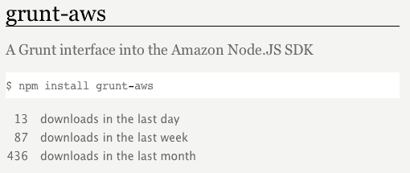

# 三、使用Grunt

现在我们已经安装并配置了 Grunt，可以使用它了。在本章中，我们将回顾如何创建我们自己的任务，并涵盖前面章节中省略的细节。除了在命令行上简单地运行 Grunt 之外，我们还将介绍执行任务的各种方法。最后，我们将介绍如何为工作选择最合适的任务，以及如何将它们集成到我们的 Grunt 构建中。

**创建自己的任务**

在本节中，我们将更详细地探讨 Grunt 任务的创建，特别是普通任务和多任务，以及异步任务。

**任务**

如前所述，创建任务非常简单。我们为 grunt.registerTask 提供了一个名称和一个函数，现在就可以执行了。任务（与多任务相反）最适合于在给定构建中只执行一次的构建过程。这种过程的一个真实示例可能是更新部署日志文件，我们可以在部署时运行该文件，提供简单的部署历史供将来参考。此任务可能如下所示：

//代码示例 01 部署日志任务

var fs=需要（'fs'）；

module.exports=函数（grunt）{

registerTask（'log-deploy'，function（））{

var message='Deployment on'+new Date（）；

fs.appendFileSync（'deploy.log'，message+'\n'）；grunt.log.writeln（'附加“+”消息+”）；

});

};

[www.it-ebooks.info](http://www.it-ebooks.info/)

*使用Grunt*

有关每个内置模块的更多信息，请参阅 Node.js API 文档：http://gswg.io#node-api。

在第一行，我们需要（或导入）内置的 Node.js 文件系统模块：fs。然后，在日志部署任务中，我们将使用 fs.appendFileSync 方法，该方法将向给定文件追加任意文本（如果该文件不存在，则首先创建该文件）。当我们运行此任务时，它应该创建 deploy.log 文件并显示：$grunt log deploy

正在运行“日志部署”任务

附加“2013 年 8 月 28 日星期三 20:43:54 GMT+1000（美国东部时间）的部署”

完成，没有错误。

**任务对象**

我们可以通过 grunt.current 访问当前正在运行的任务的属性。

任务对象。在执行任务时，当前任务对象被用作函数上下文，也可以通过 JavaScript this 操作符访问它。

任务对象具有以下属性：

•name–设置为任务名称的字符串（提供给 grunt 的第一个参数）。

注册任务）。

•async–通知 Grunt 此任务为异步任务并返回回调的函数。在*异步任务*一节中有更多关于这方面的内容。

•requires–一个函数，它接受任务名称（字符串）数组，然后确保它们以前运行过。因此，如果我们有一个部署任务，我们可能会使用这个.requires（[“compile”]），这将确保我们在部署代码之前已经编译了代码。

•requireConfig–grunt.config.requires 函数的别名，在*第 2 章*、*设置 grunt*中简要介绍。如果给定的路径配置属性不存在，此函数将导致当前任务失败。

•nameArgs–设置为任务名称的字符串，包括运行任务时使用的参数。

•args–用于运行任务的所有参数的数组。

•flags–使用每个参数作为其键并使用 true 作为值的对象。这允许我们将参数用作一系列开关。因此，如果我们使用 grunt foo:one:two 运行任务 foo，那么 this.flags.two 将为 true，但是 this.flags.three 将未定义（这是 falsy）。

**[56]**

[www.it-ebooks.info](http://www.it-ebooks.info/)

*第三章*

•errorCount–表示对 grunt.log 的调用次数的数字。

错误

•options–用于检索任务配置选项的函数，该函数在功能上等同于 grunt.config.get（[this.name，

“选项”]）。但是，在关于多任务的下一节中，options 函数变得更有用。

下面是一个简单的示例，演示了任务对象的使用：

//代码示例 02 任务对象

module.exports=函数（grunt）{

grunt.registerTask（'foo'，function（）{

console.log（'我的任务“%s”有参数%j'，this.name，this.args）；

});

};

现在，如果我们使用 grunt-foo:bar:bazz 运行此任务，我们将看到：$grunt-foo:bar:bazz

运行“foo:bar:bazz”（foo）任务

我的任务“foo”有参数[“bar”，“bazz”]

完成，没有错误。

有关任务对象的更多信息，请参阅 http://gswg.io#grunt-task 对象，有关 JavaScript 中 this 操作符的更多信息，请参阅 http://gswg.io#this-接线员。

**任务别名**

除了向 grunt.registerTask 提供函数外，我们还可以提供字符串数组；这将创建一个新任务，该任务将按顺序运行数组中列出的每个任务，基本上允许我们为一组其他任务命名。例如，我们可以创建三个任务：构建、测试和上载，然后使用以下代码将它们别名为新任务上载：

//代码示例 03 任务别名

module.exports=函数（grunt）{

registerTask（'build'，function（））{

console.log（'building…'）；

});

**[57]**

[www.it-ebooks.info](http://www.it-ebooks.info/)

*使用Grunt*

registerTask（'test'，function（））{

console.log（'testing…'）；

});

registerTask（'upload'，function（））{

console.log（'uploading…'）；

});

registerTask（'deploy'，['build'，'test'，'upload']）；

};

因此，当我们运行 grunt deploy 时，它将按顺序执行所有三个任务：$grunt deploy

运行“构建”任务

建筑物

运行“测试”任务

测试。。。

正在运行“上载”任务

上传。。。

完成，没有错误。

现在，让我们假设我们的构建过程更复杂。我们可以进一步将这三个任务分为更小的子任务。例如，我们上面虚构的构建任务也可以是由构建相关任务组成的别名，例如编译咖啡脚本、编译测试、复制 html 等等。在下一节中，我们将看到多任务符合大多数构建过程的模式，因此，当需要命名（或别名）一组任务时，我们很可能会引用多任务及其目标。

**多任务**

与许多构建工具一样，大多数 Grunt 任务对文件组执行静态检查或转换。这是引入多任务的动力。正如我们在前面的章节中所看到的，多任务与任务类似，但是它们接受多种配置。Grunt 将多任务配置的每个属性（选项除外）用作单独的配置，称为目标。这允许我们定义一个任务，该任务可以运行多次，每次根据每个配置执行不同的操作。例如，让我们回顾一下如何实现复制多任务，它根据一组一对一（源到目标）映射复制文件：

**[58]**

[www.it-ebooks.info](http://www.it-ebooks.info/)

*第三章*

//代码示例 04 复制多任务

grunt.registerMultiTask（'copy'，function（）{

this.files.forEach（函数（文件）{

copy（file.src，file.dest）；

});

grunt.log.writeln（'Copied'+this.files.length+'files'）；

});

此任务遍历 This.files 数组，将每个文件对象的源（src）复制到其目标（dest）。为了运行此任务，我们必须至少定义一个目标。因此，让我们用两个目标初始化复制任务配置，每个目标都有两个简单的文件映射：

//代码示例 04 复制多任务

grunt.initConfig({

副本：{

目标 1：{

档案：{

'dest/file1.txt'：'src/file1.txt'，

'dest/file2.txt'：'src/file2.txt'

}

},

目标 2：{

档案：{

'dest/file3.txt'：'src/file3.txt'，

'dest/file4.txt'：'src/file4.txt'

}

}

}

});

现在，我们可以使用命令 grunt copy:target2 运行复制任务的 target2，这将导致：

$grunt 副本：target2

正在运行“复制：目标 2”（复制）任务

复制了 2 个文件

完成，没有错误。

**[59]**

[www.it-ebooks.info](http://www.it-ebooks.info/)

*使用Grunt*

此外，如果省略目标名称，只使用命令 grunt copy，那么 grunt 将运行复制任务的所有目标：$grunt copy

正在运行“复制：目标 1”（复制）任务

复制了 2 个文件

正在运行“复制：目标 2”（复制）任务

复制了 2 个文件

完成，没有错误。

记住，this.files 数组使用*第 2 章**设置 Grunt*中*配置文件*部分描述的方法填充文件对象。这将带我们进入关于多任务对象的下一节。

**多任务对象**

与任务一样，我们可以通过 grunt.current.task 属性访问当前运行的多任务的任务属性。类似地，在调用任务时，多任务对象被设置为函数上下文（this 操作符）。除了任务对象的所有属性外，多任务对象还包含以下内容：

•target–设置为目标名称（Grunt 配置中使用的属性名称）的字符串。

•文件–文件对象的数组。每个对象都有一个 src 属性和一个可选的 dest 属性。当我们描述了用于转换的文件集时，此数组非常有用，其中有源（或输入）文件和可选的目标（或输出）文件。

•filesrc–字符串数组，仅表示上述文件数组中每个文件对象的 src 属性。当我们已经描述了源文件集而没有目标文件时，此数组非常有用。例如，执行静态分析的插件，比如 JSHint，只需要源文件。

•数据–即目标对象本身。如果“文件”数组和“选项”函数未提供必要的功能，则最好将其用作回退。在大多数情况下，不需要使用此属性。

**[60]**

[www.it-ebooks.info](http://www.it-ebooks.info/)

*第三章*

尽管任务对象上也存在选项功能，但多任务对象上的选项功能会执行额外的步骤：

•选项–用于检索任务和目标配置选项组合的函数。这在功能上相当于合并 grunt.config.get（[This.name，“options”]）和 grunt 的结果。

config.get（[this.name，this.target，“options”]）。这非常有用，因为任务用户可以设置任务范围内的默认值，然后在每个目标中，他们可以使用一组特定于目标的选项覆盖这些默认值。

有关多任务对象的详细信息，请参阅 http://gswg.io#grunt-任务对象。

**异步任务**

一旦任务函数返回，同步任务即被视为完成。

但是，在某些情况下，我们可能需要使用带有异步 API 的库。

这些 API 将具有通过回调而不是返回语句提供结果的函数。如果我们在同步任务中使用异步 API，这将导致 Grunt 报告成功（未检测到错误），并错误地继续执行列表中的下一个任务。

如前所述，task 对象和 multitask 对象都包含一个异步函数，该函数通知 Grunt 当前任务是异步的，并返回一个 done 函数。此“完成”功能用于手动控制任务的结果。例如，我们可以创建一个使用 HTTP 检索文件并将内容存储在磁盘上的任务：

//代码示例 05 异步 webget

var 请求=要求（“请求”）；

var url='1〕https://raw.github.com/jpillora/'+

“gswg-examples/master/README.md”；

module.exports=函数（grunt）{

registerTask（'webget'，function（））{

var done=this.async（）；

请求（url、函数（错误、响应、内容）{

如果（错误）{

完成（错误）；

}否则如果（response.statusCode！==200）{

完成（新错误（“不正常”）；

}否则{

grunt.file.write（'file.md'，contents）；

ok（'FILE.md 已成功创建'）；

完成（）；

**[61]**

[www.it-ebooks.info](http://www.it-ebooks.info/)

*使用Grunt*

}

});

});

};

在示例 Gruntfile.js 的顶部，我们需要一个流行的模块来执行 HTTP 请求：request。由于 request 执行异步 HTTP 请求，我们将使用 task 对象的异步函数（this.async（））将此任务置于异步模式，然后检索 done 函数。

随后，我们可以通过向 done 函数传递 Error 对象或 false 来向 Grunt 发出失败信号。其他任何事情都将标志着成功。

在本例中，一旦收到响应，我们将首先检查发送请求时是否存在错误。如果有错误，我们将直接将 err 对象传递给 done。接下来，我们将通过确认 HTTP 状态码为 200 来检查是否成功接收到响应。如果不是，我们将传递自己的自定义错误“not OK”以完成。一旦两个错误检查都通过，我们最终可以将响应的内容写入磁盘，然后调用 done（），通知 Grunt 此异步任务已成功完成。因此，当我们运行此任务时，我们应该看到：

$grunt webget

运行“webget”任务

>>FILE.md 已成功创建

完成，没有错误。

**运行任务**

到目前为止，我们已经学习了如何配置和创建任务。现在是运行它们的时候了！

**命令行**

一些 Node.js 命令行工具（如 express）也可以用作模块，而 Grunt 只能通过命令行使用。在全局安装 grunt cli 模块后，我们的系统将可以访问 grunt 可执行文件。

要运行新加载或创建的任务，我们需要向 Grunt 提供一个任务名称列表，作为空格分隔的命令行参数。这将导致 Grunt 按顺序执行每个指定的任务；这意味着我们可以很容易地规定任务执行的顺序。我们可以运行 foo-bar，然后使用：

**[62]**

[www.it-ebooks.info](http://www.it-ebooks.info/)

*第三章*

**$grunt foo bar**

或者，我们运行 bar-then-foo 时使用：

**$grunt bar foo**

然而，当我们单独执行 grunt 时，有一种特殊情况。Grunt 将其解释为 Grunt 默认任务，随后将尝试运行默认任务。

因此，通过注册默认任务，我们可以轻松地运行最常见的任务。与前面的*任务别名*部分中的示例类似，我们可以使用以下 GrunFile 将构建和测试任务别名为默认任务。

js 文件：

//代码示例 06 默认任务

module.exports=函数（grunt）{

registerTask（'build'，function（））{

console.log（'building…'）；

});

registerTask（'test'，function（））{

console.log（'testing…'）；

});

registerTask（'default'，['build'，'test']）；

};

现在，我们可以简单地运行 grunt，结果应该是：$grunt

运行“构建”任务

建筑物

运行“测试”任务

测试。。。

完成，没有错误。

我们可以以类似的方式运行多任务；然而，当我们指定一个多任务时，Grunt 将执行它的所有目标。如果我们想运行一个特定的目标，那么我们可以将它附加到任务名称中。因此，如果我们想运行 foo 任务的 target1 目标，那么我们将执行 grunt foo:target1。例如，让我们将上一个示例中的构建和测试任务转换为多任务，并进行测试：

//代码示例 07 默认多任务

module.exports=函数（grunt）{

**[63]**

[www.it-ebooks.info](http://www.it-ebooks.info/)

*使用Grunt*

grunt.initConfig({

建造：{

main:{}，

额外：{}

},

测试：{

main:{}，

额外：{}

}

});

registerMultiTask（'build'，function（））{

log（'building target'+this.target+'…'）；

});

grunt.registerMultiTask（'test'，function（））{

log（'testing target'+this.target+'…'）；

});

registerTask（'default'，['build:main'，'test:main']）；

};

我们可以显式运行构建任务的主目标，然后使用以下命令运行测试任务的主目标：

$grunt 构建：主测试：主

运行“构建：主”（构建）任务

正在构建目标主。。。

运行“测试：主”（测试）任务

测试目标主。。。

完成，没有错误。

但是，从上一个示例扩展，我们还可以在默认任务别名中添加这些目标。正如您在前面的代码中所看到的，我们在任务名称数组中放置了目标，因此，当我们运行 grunt 时，应该会看到相同的输出：

$grunt

运行“构建：主”（构建）任务

正在构建目标主。。。

运行“测试：主”（测试）任务

测试目标主。。。

完成，没有错误。

**[64]**

[www.it-ebooks.info](http://www.it-ebooks.info/)

*第三章*

**任务参数**

此外，当我们指定一个*任务*时，我们还可以包括一个可选的、冒号分隔的参数列表。例如，以下 Gruntfile.js 定义了一个 foo 任务，该任务将打印其第一个和第二个参数：

//代码示例 08 任务参数

module.exports=函数（grunt）{

grunt.registerTask（'foo'，函数（p1，p2）{

log（'第一个参数是：'+p1）；

log（'第二个参数是：'+p2）；

});

};

现在，我们可以使用参数 bar 和 bazz 运行 foo 任务，使用：$grunt foo:bar:bazz

运行“foo:bar:bazz”（foo）任务

第一个参数是：bar

第二个参数是：bazz

完成，没有错误。

但是，当我们希望运行多任务时，在指定参数之前，必须首先指定目标。让我们将上一个示例的 foo 任务转换为多任务：

//代码示例 09 多任务参数

module.exports=函数（grunt）{

grunt.initConfig({

傅：{

平：{}，

庞：{}

}

});

grunt.registerMultiTask（'foo'，函数（p1，p2）{

log（'target is:'+this.target）；

log（'第一个参数是：'+p1）；

log（'第二个参数是：'+p2）；

});

};

**[65]**

[www.it-ebooks.info](http://www.it-ebooks.info/)

*使用Grunt*

类似地，但包含 ping 作为目标：$gruntfoo:ping:bar:bazz

运行“foo:ping:bar:bazz”（foo）任务目标是：ping

第一个参数是：bar

第二个参数是：bazz

完成，没有错误。

考虑到这些示例，我们可以创建别名，将任务、多任务、目标和参数一起使用，从而实现极其灵活的构建。

术语提示：调用函数时，我们为其提供参数。在函数内部时，我们使用它的参数。我们可以记住这一点，外部有*参数，*内部有*参数。*

**运行时选项**

为了避免与配置选项混淆，除了任务列表之外，还必须在命令行上指定运行时选项。运行时选项用于为 Grunt 的单个执行创建 Grunt 范围的设置。运行时选项的前缀必须至少有一个破折号“-”，否则它们将被视为任务名称。

当一个或多个任务的配置设置仅在某些时候需要修改时，最好使用运行时选项。例如，当我们执行 Grunt 时，我们可以启用优化选项来指导指定的每个任务以优化模式运行。这可能会删除调试语句、压缩输出等。一旦我们在命令行上指定了一个运行时选项，我们就可以使用 grunt.option 函数检索它的值。

例如，假设我们有以下 Gruntfile.js：

//代码示例 10 运行时选项

module.exports=函数（grunt）{

console.log（'bar 是：'+grunt.option（'bar'）；

grunt.registerTask（'foo'，function（）{

//这里什么都没有。。。

});

};

**[66]**

[www.it-ebooks.info](http://www.it-ebooks.info/)

*第三章*

现在，如果我们在没有选项的情况下运行这个空的 foo 任务，我们将看到：$gruntfoo

酒吧是：未定义

运行“foo”任务

完成，没有错误。

然后，如果我们使用 bar 选项集再次运行此任务：$gruntfoo--bar

酒吧是真的

运行“foo”任务

完成，没有错误。

如果愿意，我们可以使用=value 后缀：$grunt foo--bar=42 为 bar 选项指定一个特定的值

酒吧号码：42

运行“foo”任务

完成，没有错误。

在本例中，我们在任务之外使用 grunt.option 函数。这很重要，因为这意味着我们可以使用运行时选项来帮助配置任务。注意，console.log 输出出现在“Running”之前

“foo”task“输出；这是因为 Grunt 执行我们的 Gruntfile.js 以初始化我们的任务和配置，并且*只有*然后*命令行上指定的任务按顺序运行。*

 *有关 Grunt 运行时选项 API 的详细信息，请参阅 http://gswg.io#grunt-选项。在*第 4 章*、*Grunt In Action*中，在*步骤 5–任务**和选项*部分中，我们将回顾一种通过使用运行时选项实现环境特定构建的技术。

**任务帮助**

当提供给我们的现有项目没有关于 Grunt 构建的明确文档时，我们可以使用 Grunt--help 命令列出可用的任务。当我们使用 grunt.registerTask 或 grunt.registerMultiTask 时，我们可以选择包含一个描述。让我们回顾一下这方面的一个例子：

//代码示例 11 任务帮助

module.exports=函数（grunt）{

**[67]**

[www.it-ebooks.info](http://www.it-ebooks.info/)

*使用Grunt*

grunt.registerTask（'analyze'，

"分析源头",，

函数（）{

log（'analysis…'）；

}

);

grunt.registerMultiTask（'compile'，

“编译源代码”，

函数（）{

console.log（'编译…'）；

}

);

grunt.registerTask（'all'，

“分析并编译源代码”，

['analyze'，'compile']

);

};

现在，如果我们运行 grunt--help，我们将在输出中看到以下摘录：

**$grunt——帮助**

**Grunt:JavaScript 任务运行程序（v0.4.2）**

**用法**

**Grunt【选项】【任务【任务…】**

**…**

**可用任务**

**分析来源**

**编译源代码***

**全部分析编译源代码**

**…**

Grunt 静态帮助文本被省略，只留下动态文本。在这里，我们可以看到 Grunt 列出了我们的每个任务及其描述，多任务的后缀是星号*。这很有用，因为对于这个构建的新手来说，“所有”任务同时运行“分析”任务和“编译”任务可能并不明显。

**[68]**

[www.it-ebooks.info](http://www.it-ebooks.info/)

*第三章*

**以编程方式**

尽管可以从另一个程序执行 Grunt，但它被用作命令行实用程序，因此它的 API 只能与 Grunt 可执行文件一起使用。但是，我们可以在其他任务中以编程方式运行任务*，从而允许我们有条件地运行一系列任务。*

下面的示例与*第 1 章*中的代码示例 04 linting 非常相似，*引入了 Grunt*。然而，这次我们不是在 Gruntfile.js 中定义 JSHint 规则，而是在一个可移植的.jshintrc 文件中定义它们。这对一些人来说是有利的，因为它提供了使用公司范围的 JavaScript 编码风格的能力：

//代码示例 12 条件 lint

module.exports=函数（grunt）{

//加载提供“jshint”任务的插件。

grunt.loadNpmTasks（'grunt-contrib-jshint'）；

//项目配置。

grunt.initConfig({

jshint:{

选项：{

jshintrc:“.jshintrc”

},

目标 1:'src/***/*.js'

}

});

};

但是，使用此配置，如果缺少.jshintrc 文件，jshint 任务将失败：

**$grunt jshint**

**正在运行“jshint:target1”（jshint）任务****错误：找不到配置文件：.jshintrc**

因此，如果我们只想在提供

.jshintrc 文件，然后我们可以创建另一个控制 jshint 任务执行的任务：

//使“jshint”成为可选 grunt.registerTask（'check'，function（）的新任务{

if（grunt.file.exists（'.jshintrc'））{

grunt.task.run（'jshint'）；

}

});

**[69]**

[www.it-ebooks.info](http://www.it-ebooks.info/)

*使用Grunt*

在新的检查任务中，我们将首先验证.jshintrc 是否存在，然后我们将*以编程方式*使用 grunt.task.run 函数运行 jshint 任务。现在，当我们在没有.jshintrc 文件的情况下运行检查任务时，Grunt 应该什么都不做并报告成功：

**$grunt 支票**

**运行“检查”任务**

**完成，没有错误。**

尽管如此，当我们将.jshintrc 文件与 grunfile.js 一起包含并重新运行检查任务时，我们应该看到以下内容：**$grunt check**

**运行“检查”任务**

**正在运行“jshint:target1”（jshint）任务**

**>>1 档无绒布。**

**完成，没有错误。**

有关.jshintrc 文件的示例，请参阅 http://gswg.io#jshintrc-例如。有关 JavaScript Linting 的摘要，请返回*第 1 章**介绍 Grunt*的*静态分析或 Linting*部分。

**自动**

最流行的 Grunt 插件之一是 Grunt contrib watch(http://gswg.io#grunt-contrib watch），因为它允许我们将 Grunt 放在后台，并让它根据需要自动运行我们的任务。由*Kyle Robinson Young*编写，watch 任务指示 Grunt 监视一组特定文件的更改，并执行一个或多个特定任务作为响应。在下面的示例中，我们将查看源文件，然后在更改这些文件时运行 JavaScript 连接任务 concat：

//代码示例 13 手表

module.exports=函数（grunt）{

//加载提供“concat”和“watch”任务的插件。

grunt.loadNpmTasks（“grunt-contrib-concat”）；

grunt.loadNpmTasks（“grunt-contrib-watch”）；

//项目配置。

**[70]**

[www.it-ebooks.info](http://www.it-ebooks.info/)

*第三章*

grunt.initConfig({

srcFiles:[“src/a.js”、“src/b.js”、“src/c.js”]，concat:{

目标 1：{

档案：{

“build/abc.js”：“

}

}

},

观察：{

目标 1：{

文件：“”，

任务：[“concat”]

}

}

});

//定义默认任务

registerTask（'default'，['concat'，'watch']）；

};

在 Gruntfile.js 文件的顶部，我们将加载提供 concat 和 watch 任务的两个插件。然后，我们将使用共享的 srcFiles 属性配置它们。这意味着我们可以修改源文件一次，使用这组文件的所有任务都将保持最新状态。这有助于保持我们的身体干燥(http://gswg.io#dry)通过创造单一的真理来源。监视任务的所有目标（在本例中仅为 target1）都需要 tasks 属性，该属性应指定当目标的一个文件发生更改时要运行的任务列表。最后，我们将提供一个默认任务，该任务运行 concat，后跟 watch。此时运行 grunt 应该生成：grunt

创建运行“concat:target1”（concat）任务文件“build/abc.js”。

运行“监视”任务

等待。。。

此时，我们的监视任务正在运行，正在等待。。。我们的一个文件需要更改；因此，如果我们修改并保存 src/b.js，我们应该在输出中看到以下内容：

好啊

>>文件“src/b.js”已更改。

正在运行“concat:target1”（concat）任务

**[71]**

[www.it-ebooks.info](http://www.it-ebooks.info/)

*使用Grunt*

创建了文件“build/abc.js”。

完成，没有错误。

在 2013 年 9 月 17 日星期二 21:57:52 GMT+1000（美国东部时间）0.648 秒内完成等待。。。

我们的 concat 任务已运行，监视任务正在等待。。。再一次，准备进行更多的更改。由于我们正在查看源文件，我们现在可以最小化终端窗口并继续我们的开发工作流程，知道 Grunt 正在后台运行，为我们处理“Grunt”工作。

**使用第三方任务**

尽管创建我们自己的任务相对简单，但是已经实现了大量插件，为许多常见用例提供了任务。因此，在我们重新发明轮子之前，我们应该确保我们已经彻底搜索过了。

**搜索任务**

在*npm*一节中，我们介绍了*第 2 章*、*设置 Grunt*中的模块搜索，其中我们介绍了基本 npm 命令，包括 npm 搜索。然而，对于那些更喜欢网络搜索的人，我们也可以使用 Grunt 网站的插件页面(http://gswg.io#grunt-插件）。Grunt 团队每小时执行一次 npm 搜索 gruntplugin 并存储结果。当您访问插件页面时，将检索此缓存列表，并可通过在文本输入中输入查询进行过滤。但是，请记住，即使一个插件被称为 grunt foo，也只有当它被*和*标记为 gruntplugin（有些人可能会忘记这样做）时，它才会包含在这个页面中。所以当搜索已有的插件时，我们从 Grunt 的插件页面开始，然后转到 npm 搜索，最后我们应该求助于谷歌。一旦我们找到了一组候选任务，我们就需要决定使用哪一个。

**官方与用户任务**

Grunt 团队已经为他们正式支持的所有插件制定了命名约定。这些插件的前缀是 grunt contrib-，而社区其他成员创建的插件的前缀只是 grunt-。这使我们能够轻松区分官方 Grunt 插件和用户 Grunt 插件。

**[72]**

[www.it-ebooks.info](http://www.it-ebooks.info/)

*第三章*

**任务流行度**

我们搜索合适插件的下一步是查看 npm 下载统计数据。这些统计信息可以在 npm 存储库中所有模块的包页面上找到。例如，要查看 Grunt 插件 Grunt contrib uglify 的下载统计信息，我们可以访问 http://gswg.io#npm-软件包：grunt contrib uglify，我们应该看到：在这里，我们可以看到这个 grunt 插件在上个月下载了**133299**次。这个下载计数可以看作是每个插件用户的隐式投票。

**任务特征**

然而，一个插件的下载数量并不一定意味着它将拥有我们需要的所有功能。例如，grunt-s3 插件(http://gswg.io#npm-package:grunt-s3）是最流行的 Amazon s3 grunt 插件：

**[73]**

[www.it-ebooks.info](http://www.it-ebooks.info/)

*使用Grunt*

然而，在本书发布时，AmazonS3 插件缺少本地缓存（这导致了更高的带宽使用率，这在慢速连接上是次优的）。此外，它还使用 knox npm 模块与 S3 进行接口，而不是新发布的官方支持的 Amazon Node.js SDK。为了解决这个问题，我编写了 grunt aws 插件(http://gswg.io#npm-包装：grunt aws）。目前，grunt aws 不像 grunt-s3 那样受欢迎，但是，它具有我所需要的功能：因此，下载计数是有用的，尽管我们也应该查看插件的文档，以确保它支持我们所寻求的功能。

**任务之星**

除了在任务的 GitHub 存储库中查找文档外，我们还将查找任务的星号计数。近年来，GitHub 已经成为大多数开源项目的发源地。目前，98%的 Grunt 插件的源代码都在 GitHub 上。所有 GitHub 存储库都有一个 stargazers 列表，这些人是该存储库的明星（或将其标记为收藏夹）。该计数器显示在每个存储库的**Star**按钮旁边，该 Star 计数可以被视为明确的投票，这证明了该项目的有用性。

**总结**

总而言之，我们现在应该具备知识，能够使用我们可用的全部功能创建我们自己的任务和多任务。我们还应该能够以各种各样的方式执行任务，并了解在哪些情况下使用运行时选项、参数以及何时只使用配置。

在下一章中，我们将逐步介绍一个使用 Grunt 从头开始构建 Web 应用的完整示例，以及我们在前三章中学到的经验教训。

**[74]**

[www.it-ebooks.info](http://www.it-ebooks.info/)*