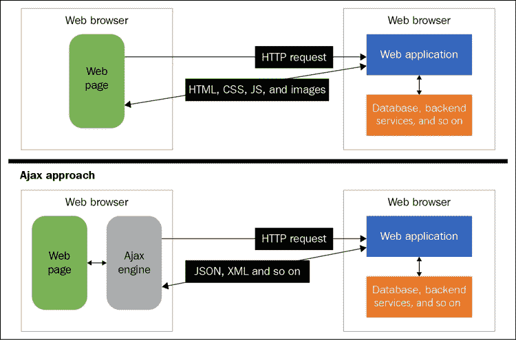
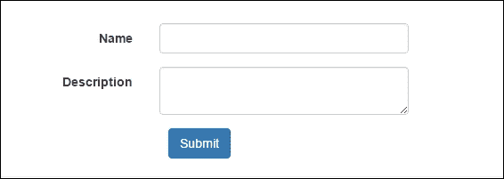
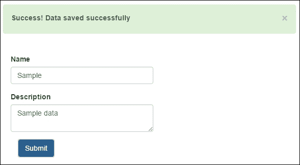
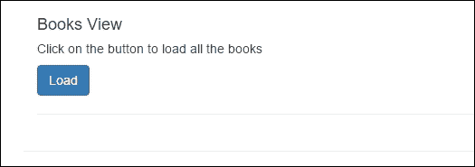
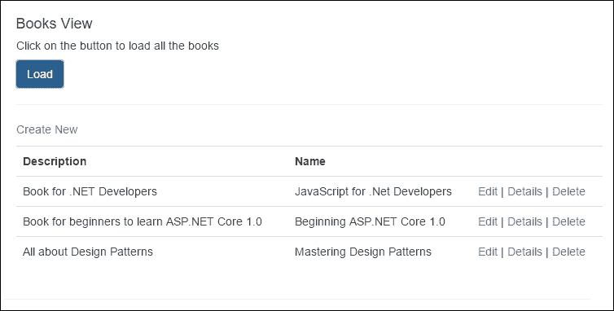
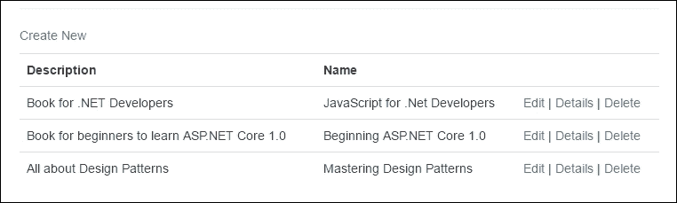
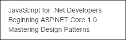
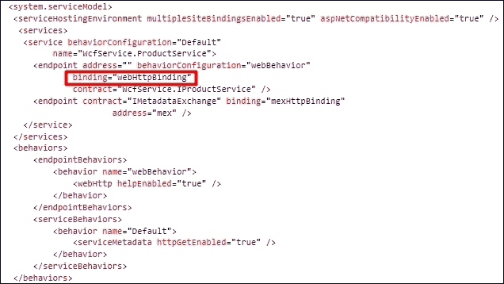
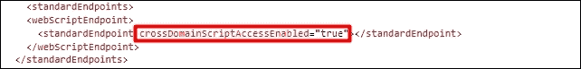
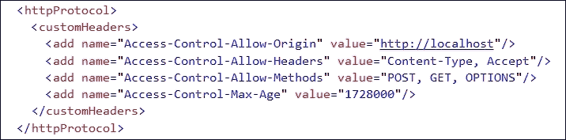

# 第四章 Ajax 技术

开发响应性 web 应用程序的核心特征之一是 Ajax。传统上，在服务器端回发中，每当用户执行任何操作时，表单中提供的信息都会发送回服务器，并再次加载相同的页面，其中包含再次在客户端加载的所有图像、CSS 和 JavaScript 文件。就从客户端和服务器发送的请求和响应的大小而言，这种方法相当繁重。因此，应用程序的响应性变差，用户每次执行任何操作时都必须等待页面刷新。在本章中，我们将讨论如何通过 Ajax 简化整个过程并避免繁重的服务器端回发。

# 引入 Ajax

**Ajax**代表**异步 JavaScript 和 XML**；它在服务器上创建异步请求，而无需在客户端再次发送和呈现整个页面，而它只发送需要发送到服务器的少量信息，并接收特定格式的响应，以通过 JavaScript 更新特定部分或 DOM 元素。这使得开发人员能够开发响应迅速的 web 应用程序并动态更新页面内容，而无需每次为特定操作重新加载页面内容。例如，在母子页关系中，子内容取决于父项选择；使用经典方法，每次选择父项时，页面都会被发布回服务器端，服务器在服务器端执行一些后端工作来填充子部分并返回 HTML 代码，然后在客户端呈现。通过 Ajax，可以通过发出异步请求来发送所选信息并更新页面内容的所选部分来实现这一点。

## Ajax 的工作原理

Ajax 使用**XMLHttpRequest**（**XHR**对象异步调用服务器端方法。XHR 是由微软开发的，最初是由 InternetExplorer5 提供的。最初是通过调用`ActionXObject`实例来创建实例；但是，对于现代版本，每个浏览器都支持通过`XMLHttpRequest`对象初始化 XHR 对象。

下图显示了 Ajax 工作原理的体系结构视图：



传统上，当从客户端执行任何操作时，整个数据都会发送回服务器，并在收到响应后在客户端再次加载。除了更新需要更新的数据（包括 CSS、JavaScript 和图像等所有静态文件）之外，它将从服务器再次加载并在客户端呈现，除非实现了某种缓存机制。使用 Ajax，我们以 JSON 字符串或 XML 格式发送数据，并根据服务器的不同以 JSON、XML、HTML 或任何其他格式获取响应。我们也可以在发送请求时使用请求头，比如`Accept`，这样服务器就知道客户端正在接受什么；基于格式化程序，它可以将数据序列化为特定格式。在 ASP.NET MVC 6 中，默认为 JSON 和 XML 实现了两个格式化程序，它们根据请求`Accept`头发送数据，并相应地序列化对象。自定义格式化程序也可以在服务器级别实现，以处理特定场景。

### 使用经典 XHR 对象的 Ajax 请求

所有浏览器，包括 Internet Explorer、Chrome、Firefox 和 Safari，都提供了这个对象，可以从 JavaScript 中使用它来执行Ajax 请求。

在 JavaScript 中，我们可以如下初始化`XMLHttpRequest`对象：

```js
var xhr = new XMLHttpRequest();
```

每个请求都可以是`GET`或`POST`请求。一旦从服务器接收到响应，就会填充一些属性并调用事件处理程序，在发出 Ajax 请求时可以为 XHR 对象配置这些属性。

让我们详细了解 XHR 对象提供的方法、属性和事件。

#### XHR 方法

XHR 对象提供了如下多种方法，但发起 Ajaxified 请求的两种最重要的方法是`open()`和`send()`：

*   **Sending request**:

    请求可以是`GET`或`POST`。在发出任何请求时，我们首先必须调用这个`open`方法，并指定 HTTP 方法，例如`GET`或`POST`，以及服务器的 URL。其余参数，如`async`位、`user`和`password`是可选的。

    `open`方法的签名如下：

    ```js
    void Open(

      DOMString method, 
      DOMString URL, 
      optional boolean async, 
      optional DOMString user?, 
      optional DOMString password

    );
    ```

    `send`方法用于向服务器发送请求。这是实际的方法，它将请求发送到服务器，并接受各种格式的数据。

    以下表显示了`send`方法可用的重载方法：

    <colgroup class="calibre18"><col class="calibre19"> <col class="calibre19"></colgroup> 
    | 

    方法

     | 

    描述

     |
    | --- | --- |
    | `void send()` | 此方法在发出`GET`请求时使用 |
    | `void send (DOMString? Data)` | 此方法在以字符串形式传递数据时使用 |
    | `void send(Document data)` | 传递文档数据时使用此方法 |
    | `void send(Blob data)` | 此方法用于传递 blob 数据或二进制数据 |
    | `void send(FormData data)` | 此方法用于传递整个表单 |

*   **Aborting request**:

    在某些情况下，开发人员可能需要中止当前请求。这可以通过调用 XHR 对象的`abort()`函数来实现：

    ```js
    var xhr = new XMLHttpRequest();
    xhr.abort();
    ```

*   **Setting request headers**:

    XHR 提供了几种生成 Ajax 请求的技术。这意味着在某些情况下，我们需要根据服务器实现以 JSON、XML 或某些自定义格式发送数据。例如，在使用 ASP.NET MVC 6 时，实现了两个默认格式化程序：JSON 和 XML，如果您想实现自己的自定义格式化程序，这也是可能的。当以特定格式发送数据时，我们需要通过请求头将格式告知服务器。这有助于服务器识别要加载的格式化程序，以序列化响应并处理请求。

    下面的表显示了可以随 Ajax 请求提供的默认标头：

    <colgroup class="calibre18"><col class="calibre19"> <col class="calibre19"></colgroup> 
    | 

    标题

     | 

    描述

     |
    | --- | --- |
    | `Cookie` | 此标头指定客户端中设置的任何 cookie |
    | `Host` | 此标题指定页面的域名 |
    | `Connection` | 此标题指定连接类型 |
    | `Accept` | 此标头指定客户端可以处理的内容类型 |
    | `Accept-charset` | 此标题指定客户端可以显示的字符集 |
    | `Accept-encoding` | 此标头指定客户端可以处理的编码 |
    | `Accept-language` | 此标题指定作为响应接受的首选自然语言 |
    | `User-Agent` | 此标头指定用户代理字符串 |
    | `Referer` | 此标题指定页面的 URL |

    通过 XHR 对象，我们可以通过`setRequestHeader()`函数设置请求头，如下代码所示：

    ```js
    var xhr= new XMLHttpRequest();
    xhr.setRequestHeader('Content-Type', 'application/json');
    ```

*   **Getting response headers**:

    当服务器返回响应时，我们可以通过以下两种方式读取响应头：

    ```js
    var xhr= new XMLHttpRequest();
    function callback(){
      var arrHeaders = xhr.getAllResponseHeaders();
      //or
      var contentType = xhr.getResponseHeader('Content-Type');
    }
    ```

    `getAllResponseHeaders()`函数返回所有响应头的列表，`getResponseHeader()`函数接受头名称并返回提供的头名称的值。

#### XHR 事件

XHR 对象中最有用的事件处理程序是`onreadystatechange`事件，当`readystate`属性的值发生变化时会调用该事件处理程序。在启动请求时，我们可以将函数与此事件处理程序关联并读取响应：

```js
var xhr= new XMLHttpRequest();
xhr.onreadystatechange = callback;

function callback(){
  //do something
}
```

另一个核心事件处理程序是`ontimeout`，它可以在处理请求超时场景的条件中使用。启动 XHR 请求时，有一个`timeout`属性，通过该属性可以以毫秒为单位设置超时，如果请求超过超时值，将调用`ontimeout`事件处理程序。例如，超时设置为 5000 毫秒，如果超时超过`timeout`属性，将调用`timeout`处理函数，如下所示：

```js
var xhr = new XMLHttpRequest();
xhr.timeout = 5000; 
xhr.ontimeout = timeouthandler;
function timeouthandler(){
  //do something
}
```

#### XHR 特性

`XMLHttpRequest`对象可用的属性列表如下：

*   **GET request state**:

    此属性返回有关响应的状态信息。通常使用根据请求状态采取行动：

    ```js
     var xhr=new XMLHttpRequest();
     xhr.readystate;
    ```

    下表列出了`readystate`属性可用的状态及其含义：

    <colgroup class="calibre18"><col class="calibre19"> <col class="calibre19"> <col class="calibre19"></colgroup> 
    | 

    状态值

     | 

    状态

     | 

    描述

     |
    | --- | --- | --- |
    | `0` | `UNSENT` | 在这种状态下，创建了`XMLHttpRequest`对象，但没有调用`open()`方法 |
    | `1` | `OPENED` | 在此状态下，调用`open`方法 |
    | `2` | `HEADERS_RECEIVED` | 一旦调用`send()`并接收到报头，就会出现这种状态 |
    | `3` | `LOADING` | 此状态在下载响应时发生 |
    | `4` | `DONE` | 此状态在响应完成时发生 |

*   **Get response data**:

    可以通过调用`response`或`responseText`属性来检索响应。这些属性之间的区别在于`responseText`属性将响应作为字符串返回，而`response`属性将响应作为`response`对象返回。`response`对象可以是文档、blob 或 JavaScript 对象：

    ```js
    var xhr= new XMLHttpRequest();
    xhr.response;
    //or 
    xhr.responseText;
    ```

*   **Get response status**:

    可以通过调用`status`或`statusText`属性来检索响应状态。这些属性之间的区别在于`status`属性返回数值，例如，如果服务器成功处理请求，则返回`200`，而`statusText`属性包含完整文本，如`200 OK`等：

    ```js
    var xhr= new XMLHttpRequest();
    xhr.status;
    or 
    xhr.statusText;
    ```

让我们来看看下面的例子，它使用 ASP.NET MVC 6 中的 XHR 对象来实现表单 Pro T0 请求。下表有两个字段，**名称**和**说明**：



下面是使用 XHR 对象将请求发送到服务器端的代码片段。此示例以 JSON 格式发送数据：

```js
@model WebApplication.ViewModels.Book.BookViewModel
@{
  ViewData["Title"] = "View";
}
<script>
  var xhr = null;
  function submit() {
    xhr = new XMLHttpRequest();
    xhr.open("POST", '/Book/SaveData');
    var name = document.getElementById("Name").value;
    var description = document.getElementById("Description").value;
    var data =
    {
      "Name": name,
      "Description": description
    };
    xhr.setRequestHeader('Content-Type', 'application/json; charset=utf-8');
    xhr.onreadystatechange = callback;
    xhr.send(JSON.stringify(data));
  }

  function callback() {
    if (xhr.readyState == 4) {
      var msg = xhr.responseText;r 
      document.getElementById("msg").innerHTML = msg;
      document.getElementById("msgDiv").style.display = 'block';
    }
  }
</script>

<form asp-action="SaveData" id="myForm">
  <p> </p>
  <div id="msgDiv" style="display:none" class="alert alert-success">
    <a href="#" class="close" data-dismiss="alert" aria-label="close">&times;</a>
    <strong>Success!</strong> <label id="msg"></label>
  </div>
  <div id="pageDiv" class="container">
    <br />
    <div id="mainDiv" class="form-horizontal">
      <div class="form-group">
        <label asp-for="Name" class="col-md-2 control-label"></label>
        <div class="col-md-10">
          <input asp-for="Name" class="form-control" />
        </div>
      </div>
      <div class="form-group">
        <label asp-for="Description"  class="col-md-2 control-label"></label>
        <div class="col-md-10">
          <textarea asp-for="Description" class="form-control" ></textarea>
        </div>
      </div>
    </div>
    <div class="form-group">
      <div class="col-md-offset-2 col-md-10">
        <button id="btnSubmit" onclick="submit()" type="submit" class="btn btn-primary"> Submit</button>
      </div>
    </div>
  </div>
</form>
```

在 ASP.NET 核心中，对于 JSON 和 XML，我们必须使用`[FromBody]`属性显式地注释复杂类型。这是因为 MVC6 首先搜索查询字符串中的值，而不管其类型是复杂类型还是基本类型。对于 JSON 和 XML 数据，我们需要使用`[FromBody]`属性显式地注释方法的参数，以便可以轻松地绑定数据而不会出现任何问题：

```js
public IActionResult SaveData([FromBody]BookViewModel bookViewModel)
{
  return Content("Data saved successfully"); 
}
```

在前面的代码片段中，我们通过`document.getElementById`读取表单值，然后生成一个 JSON 字符串以 JSON 格式传递表单数据。

输出结果如下：



然而，Google 提供了一个库，它通过调用`serialize()`函数来序列化表单数据。唯一的区别是将请求头`'Content-Type'`设置为`'application/x-www-form-urlencoded'`，并添加以下脚本文件：

```js
<script src=http://form-serialize.googlecode.com/svn/trunk/serialize-0.2.min.js />
```

以下代码是`submit`函数的修订版本，它通过`serialize()`函数对表单数据进行序列化，并将数据作为表单编码值发送：

```js
function submit() {
  xhr = new XMLHttpRequest();
  xhr.open('POST', '/Book/SaveData');
  xhr.setRequestHeader('Content-Type', 'application/x-www-form-urlencoded');
  var html = serialize(document.forms[0]);
  xhr.onreadystatechange = callback;
  xhr.send(html);
}
```

对于表单编码的值，我们将删除`[FromBody]`属性。这是因为表单编码值作为查询字符串中的名称-值对发送：

```js
public IActionResult SaveData(BookViewModel bookViewModel)
{
  return Content("Data saved successfully"); 
}
```

在以前版本的 ASP.NET Web API 中，如果 Web API 控制器的`action`方法包含复杂类型，则 Web API 框架会自动绑定来自请求体的值。而在 ASP.NET 内核中，Web API 和 MVC 已经成为一个统一的框架，并且模型绑定并不等同于我们在以前的 Web API 版本中的绑定。

在前面的示例中，我们看到了发出`POST`请求、以 JSON 格式发送数据以及以编码值的形式发送数据是多么容易。现在，让我们看另一个示例，其中我们将根据服务器发送的 JSON 响应加载部分视图。

以下是 ASP.NET 页面的屏幕截图，该页面包含一个按钮，用于加载表中的书籍列表：



以下是主页的代码片段：

```js
@model WebApplication.ViewModels.Book.BookViewModel
@{
  ViewData["Title"] = "Books";
}
<script>
  var xhr = null;
  function loadData() {
    xhr = new XMLHttpRequest();
    xhr.open('GET', '/Book/Books',true);
    xhr.onreadystatechange = callback;
    xhr.send();
  }
  function callback() {
    if (xhr.readyState == 4) {
      var msg = xhr.responseText;
      document.getElementById("booksDiv").innerHTML = msg;
    }
  }
</script>
<div class="container">  
  <button id="btnLoad" onclick="loadData()" type="submit" class="btn btn-primary">Load</button>
  <hr />
  <div id="booksDiv">
  </div>
</div>
```

以下是在表格中显示书籍列表的局部视图：

```js
@{ 
  Layout = null;
}
@model IEnumerable<WebApplication.ViewModels.Book.BookViewModel>
<script src="http://ajax.aspnetcdn.com/ajax/jQuery/jquery-1.12.0.min.js"></script>
<script>
  $(document).ready(function () {
    $('table').on('click','tr', null, function() {
      $(this).css('background-color', 'aliceblue');
    });
  });
</script>

<p>
  <a asp-action="Create">Create New</a>
</p>
<table class="table">
  <tr>
    <th>
      @Html.DisplayNameFor(model => model.Description)
    </th>
    <th>
      @Html.DisplayNameFor(model => model.Name)
    </th>
    <th></th>
  </tr>

@foreach (var item in Model) {
  <tr>
    <td>
      @Html.DisplayFor(modelItem => item.Description)
    </td>
    <td>
      @Html.DisplayFor(modelItem => item.Name)
    </td>
    <td>
      <a asp-action="Edit" asp-route-id="@item.Id">Edit</a> |
      <a asp-action="Details" asp-route-id="@item.Id">Details</a> |
      <a asp-action="Delete" asp-route-id="@item.Id">Delete</a>
    </td>
  </tr>
}
</table>
```

下面是 ASP.NET MVC`Books`控制器的代码片段，其中包含返回书籍列表的`Books`操作方法：

```js
public class BookController : Controller
{
  // GET: /<controller>/
  public IActionResult Index()
  {
    return View();
  }

  public IActionResult Books()
  {
    List<BookViewModel> books = new List<BookViewModel>();
    books.Add(new BookViewModel { Id = 1, Name = "JavaScript for .Net Developers", Description = "Book for .NET Developers" });
    books.Add(new BookViewModel { Id = 1, Name = "Beginning ASP.NET Core 1.0", Description = "Book for beginners to learn ASP.NET Core 1.0" });
    books.Add(new BookViewModel { Id = 1, Name = "Mastering Design Patterns", Description = "All about Design Patterns" });
    return View(books);
  }

  public IActionResult Create()
  {
    return View();
  }
}
```

这样，当用户点击`Load`按钮时，将向服务器发出请求，并调用 ASP.NET MVC 控制器`Books`动作方法，返回`View`，即呈现将在主页`booksDiv`元素内呈现的部分视图：



### 使用 jQuery 发出 Ajax 请求

在前面的章节中，我们讨论了如何使用普通`XMLHttpRequest`对象发送 Ajax 请求，该对象在所有浏览器中都可用。在本节中，我们将看到 jQuery 在发出 Ajax 请求时提供了什么，以及如何通过 jQuery 对象使用 HTTP`GET`和`POST`请求。

#### jQuery.ajax（）

此方法用于发出`GET`和`POST`异步请求。下面的代码是这个方法的签名，它有两个参数：`URL`和`options`。`URL`参数是实际的服务器 URL，`options`以 JSON 表示形式获取配置请求头和其他属性：

```js
$.([URL],[options]);
$.( [options]);
```

以下示例显示如何在 MVC 控制器上发出异步请求，并在服务器返回成功响应时显示警报：

```js
<script src="http://ajax.aspnetcdn.com/ajax/jQuery/jquery-1.12.0.min.js"></script>
<script>
  $(document).ready(function () {
    $.ajax('/Book/Books', {
      success: function (data) {
        $('#booksDiv').html(data);
      },
      error: function (data) {
        $('#booksDiv').html(data);
      }
    });
  });
</script>
```

`Books`操作方法返回 ASP.NET MVC 视图，该视图传递将在`booksDiv`DOM 元素中填充的书籍列表：



### Ajax 属性

下面的表显示了一些核心属性，您可以指定这些属性来配置 Ajax 请求：

<colgroup class="calibre18"><col class="calibre19"> <col class="calibre19"> <col class="calibre19"></colgroup> 
| 

名称

 | 

类型

 | 

描述

 |
| --- | --- | --- |
| `accepts` | `PlainObject` | 此属性告知服务器客户端将接受的响应类型。 |
| `async` | `Boolean` | 默认为`true`（异步请求），但可以设置为`false`（同步）。 |
| `cache` | `Boolean` | 如果此属性设置为`false`，则浏览器不会缓存强制请求的页面。 |
| `contents` | `PlainObject` | 此属性用于指定解析响应的正则表达式。 |
| `contentType` | `String`或`Boolean` | 此属性告知服务器请求中传递的数据类型。默认值为`application/x-www-form-urlencoded; charset=UTF-8`。 |
| `crossDomain` | `Boolean` | 如果要强制跨域请求，则将此属性设置为`true`。 |
| `data` | `PlainObject`、`String`或`Array` | 此属性可用于以 JSON、XML 或任何其他格式传递数据。 |
| `dataType` | `String` | 此属性指定期望从服务器获得的数据类型。一些核心数据类型是 XML、JSON、脚本和 HTML。 |

#### 预过滤 Ajax 请求

这是一个很好的功能，可以在发送之前过滤现有的请求选项和配置属性。它提供了两种重载方法：一种是采用注入`options`、`originalOptions`和`jqXHR`对象的函数，另一种是采用字符串，您可以在字符串中过滤出特定请求的配置属性，然后使用函数接受参数`options`、`originalOptions`和`jqXHR`。以下代码是两个重载方法的签名：

```js
$.ajaxPrefilter(function(options, originalOptions, jqXHR){
  //Modify options, originalOptions and store jqXHR
}
$.ajaxPrefilter('dataType', function(options, originalOptions, jqXHR){
  //Modify options, originalOptions and store jqXHR
}
```

上述代码中的对象解释如下：

*   `options`：这些对象与 Ajax 请求中提供的请求选项相同，但是它们可以被相应地覆盖和过滤。
*   `originalOptions`：这些对象提供了Ajax 请求中提供的实际选项。它们可用于引用，不能修改。可以使用`options`对象对配置进行任何更改。
*   `jqXHR`：这个对象相当于 jQuery 中的`XMLHttpRequest`对象。

在下面的例子中，我们看一看，它添加了 java T0 参数，告诉 MVC 控制器，请求是从 JavaScript 执行的：

```js
<script>
  $(document).ready(function () {

    $.ajaxPrefilter(function (options, originalOptions, jqXHR) {
      options.url += ((options.url.indexOf('?') < 0) ? '?' : '&')+ 'fromAjax=true';
    });

    $.ajax('/Book/Books', {
      success: function (data) {
        $('#booksDiv').html(data);
      },
      error: function (data) {
        $('#booksDiv').html(data);
      }
    });
  });
</script>
```

以下代码是控制器操作方法，如果请求是 Ajax 请求，则返回书籍列表：

```js
public IActionResult Books(bool fromAjax)
{
  if (fromAjax)
  {
    List<BookViewModel> books = new List<BookViewModel>();
    books.Add(new BookViewModel { Id = 1, Name = "JavaScript for .Net Developers", Description = "Book for .NET Developers" });
    books.Add(new BookViewModel { Id = 1, Name = "Beginning ASP.NET Core 1.0", Description = "Book for beginners to learn ASP.NET Core 1.0" });
    books.Add(new BookViewModel { Id = 1, Name = "Mastering Design Patterns", Description = "All about Design Patterns" });
    return View(books);
  }
  return Content("Request to this method is only allowed from Ajax");
}
```

可用选项有多种属性，您可以在[中查阅 http://api.jquery.com](http://api.jquery.com) 。

#### 为未来所有 Ajax 请求设置默认值

通过`$.ajax.setup`功能，我们可以通过`$.ajax()`或`$.get()`功能设置未来所有请求的配置值。可以在调用`$.ajax()`函数之前设置默认设置，`ajax`函数会选择`$.ajaxSetup()`函数中定义的设置。

以下是调用`$.ajax.setup`的签名：

```js
$.ajaxSetup({name:value, name:value, name:value, …});
```

以下示例为通过`$.ajax`功能发出的`ajax`请求设置默认 URL：

```js
<script>
  $(document).ready(function () {

    $.ajaxSetup({ url: "/Book/Books"});

    $.ajax({
      success: function (data) {
        $('#booksDiv').html(data);
      },
      error: function (data) {
        $('#booksDiv').html(data);
      }
    });
  });
</script>
```

### 通过 jQuery 中的 get 函数加载数据

jQuery 库提供了从服务器检索数据的不同功能。`$.get()`等函数可以通过 HTTP`GET`请求加载数据，而`$.getJSON()`专门用于加载 JSON 编码的数据，`$.getScript()`用于从服务器加载并执行 JavaScript。

#### 使用 jQuery.get（）

`$.get()`功能是`$.ajax()`的速记功能，只允许`GET`请求。它将大部分配置值抽象为默认值。与`$.ajax()`函数类似，它将数据返回给`callback`函数，但不提供错误回调。因此，如果在请求处理过程中发生任何错误，则无法对其进行跟踪。

需要四个参数，`URL`、`data`、`callback`和`type`。其中，URL 是请求发送到的地址，数据采用在发出请求时发送到服务器的字符串，callback 是指请求成功时执行的函数，type 表示希望从服务器获得的数据类型，如 XML、JSON 等。

以下是`$.get()`功能的签名：

```js
$.get('URL',data, callback, type);
```

下面是加载书籍的示例，其标题中包含一个`net`字符串：

```js
<script>
  $(document).ready(function () {

    $.get('/Book/Books', {filter : "net"}, function (data) {
        $('#booksDiv').html(data);
      }
    );

  });
</script>
```

#### 使用 jQuery.getJSON（）

`jQuery.getJSON()`函数用于从服务器加载 JSON。可通过调用`$.getJSON()`函数使用：

```js
$.getJSON('URL', {name:value, name:value, name:value,…});
```

下面是通过调用`action`方法加载 JSON 的示例，该方法返回 JSON 响应并在`booksDiv`元素中显示图书标题：

```js
<script>
  $(document).ready(function () {

    $.getJSON('/Book/Books', function (data) {
      $.each(data, function (index, field) {
        $('#booksDiv').append(field.Name + "<br/> ");
      });
    }
  );
</script>
```

`Action`方法返回 JSON 响应，如下所示：

```js
public IActionResult Books()
{
  List<BookViewModel> books = new List<BookViewModel>();
  books.Add(new BookViewModel { Id = 1, Name = "JavaScript for .Net Developers", Description = "Book for .NET Developers" }
  books.Add(new BookViewModel { Id = 1, Name = "Beginning ASP.NET Core 1.0", Description = "Book for beginners to learn ASP.NET Core 1.0" });
  books.Add(new BookViewModel { Id = 1, Name = "Mastering Design Patterns", Description = "All about Design Patterns" });
  return Json(books);

}
```

在页面上，书名将呈现如下屏幕截图所示：



#### 使用 jQuery.getScript（）

`jQuery.getScript()`功能是`$.ajax()`的简写，专门设计用于从服务器加载脚本。以下是`$.getScript()`功能的签名：

```js
$.getScript(url, callback);
```

下面的示例在加载文档后加载自定义`.js`文件：

```js
<script>
  $(document).ready(function () {

  $.getScript("/wwwroot/js/custom.js");
</script>
```

### 使用 post 功能向服务器发布数据

与`$.get()`函数类似，jQuery 也提供了`$.post()`函数，是`$.ajax()`的简写，而是专门设计用来只进行HTTP`POST`请求的。

以下是`$.post()`函数的签名：

```js
$.post(url, data, callback, type);
```

以下示例使用`$.post()`函数提交表单数据：

```js
<script>

  function submit() {
    $.post('/Book/SaveData', $("form").serialize(), function (data) {
      alert("form submitted");

    });
  }
</script>
```

以下是`Book`控制器的`SaveData`操作方法的代码片段，该方法获取对象并以字符串形式返回响应：

```js
public IActionResult SaveData(BookViewModel bookViewModel)
{
  //call some service to save data 
  return Content("Data saved successfully")
}
```

类似地，我们可以通过将类型指定为`json`来传递 JSON 中的数据：

```js
<script>
  function submit() {
    $.post('/Book/SaveData', {Name:"Design Patterns", Description: "All about design patterns"}, function (data) {
    },'json' );
  }
</script>
```

### Ajax 事件

Ajax 事件分为本地事件和全局事件。使用`$.ajax`函数发出 Ajax 请求时，可以声明本地事件。像`success`和`error`这样的事件称为本地事件，而全局事件处理页面中执行的每个 Ajax 请求。

#### 地方事件

以下是本地事件列表，具体与`$.ajax()`功能相关。其他速记功能，如`$.get()`和`$.post()`没有这些方法，因为它们都有特定的值来传递参数和配置属性：

*   `beforeSend`：此事件在`ajax`请求发出之前触发。
*   `success`：服务器响应成功时发生此事件。
*   `error`：在`ajax`请求过程中发生错误时发生此事件。
*   `complete`：请求完成时发生此事件。它不检查是否发生了错误，或者响应是否成功并在请求完成时执行。

#### 全球事件

以下是全球事件列表，它还可以与所有其他速记功能一起使用，如`$.post()`、`$.get()`和`$.getJSON`：

*   `ajaxStart`：当管道中没有`ajax`请求且第一个`ajax`请求正在启动时，使用此事件
*   `ajaxSend`：向服务器发送`ajax`请求时使用此事件
*   `ajaxSuccess`：当服务器返回任何成功响应时，使用此事件
*   `ajaxError`：当任何`ajax`请求发生错误时，触发此事件
*   `ajaxComplete`：当`ajax`请求完成时，使用此事件

下面的代码是 ASP.NET 的一个简单示例，它调用了`BookController`的操作方法`Books`，该方法返回书籍列表并触发全局和本地事件：

```js
@model WebApplication.ViewModels.Book.BookViewModel
@{
  ViewData["Title"] = "Books";
}
<script src="http://ajax.aspnetcdn.com/ajax/jQuery/jquery-1.12.0.min.js"></script>
<script>

  $(document).ready(function () {

    $(document).ajaxComplete(function (e) {
      alert("Ajax request completed");
    }).ajaxSend(function () {
      alert("Ajax request sending");
    }).ajaxSend(function () {
      alert("Ajax request sent to server");
    }).ajaxStop(function () {
      alert("Ajax request stopped");
    }).ajaxError(function () {
      alert("Some error occurred in Ajax request");
    }).ajaxSuccess(function () {
      alert("Ajax request was successful");
    })
    $('#btnLoad').click(function(){
      $.ajax('/Book/Books', {
        success: function (data) {
          $('#booksDiv').html(data);
        },
        error: function (data) {
          $('#booksDiv').html(data);
        }
      });

    });

  });
</script>
<div class="container">
  <br />
  <h4>Books View</h4>
  <h5>Click on the button to load all the books</h5>
  <button id="btnLoad" type="submit" class="btn btn-primary">Load</button>
  <hr />
  <div id="booksDiv">
  </div>
</div>
```

## 跨境请求

由于安全原因，每个浏览器都限制 web 应用程序通过 JavaScript 发出跨源请求。跨源请求是向另一台服务器发出 HTTP 请求的请求，该服务器是外部域。例如，如果基于应用程序的 URL 为`localhost`，并且您将在`anotherdomain.com`上发出请求，则它将不起作用。然而，浏览器的实现之间几乎没有区别，因为在 Chrome 中，如果端口号不同，它将不允许您发出请求；而 Internet Explorer 忽略了这一点。

跨源请求仅限于`XMLHttpRequest`对象发出的请求；但是，我们仍然可以从其他源或域加载 CSS、图像和脚本文件等资源。

不启用此功能的原因是为了保护数据免受恶意站点攻击。然而，为了处理这些场景，我们可以使用 JSON-P（一种较旧的技术）或 CORS，这将在下一节中讨论。

### JSON-P

较旧的浏览器使用了**JavaScript 对象表示法填充**（**JSON-P**技术。这项技术现在已经过时，或者，CORS 更安全、更整洁。

#### 使用 JSON-P

JSON-P 是一种技术，它伪造浏览器来进行跨源请求。它的工作原理是指定一个`<script>`标记，该标记向其他服务器发出跨源请求，返回的响应实际上是已经在 web 页面中定义的函数名。然后，在执行脚本时，它将数据作为参数传递给函数。

可以通过添加一个`<script>`标记，在`src`属性中指定请求 URL，在同一 URL 的查询字符串中指定 JavaScript`callback`函数来实现。例如，考虑以下请求 URL：

```js
http://otherdomain.com?Id=1
```

在请求 URL 中追加函数，加载脚本时将调用该函数：

```js
http://otherdomain.com?Id=1&callback=jsonPCallback
```

下面的代码段调用`geo`服务并指定一个`callback`参数，该参数指向脚本中定义的`jsonCallback`函数。该脚本将在页面加载并执行`src`URL 时加载，该 URL 最终调用`jsonCallback`方法并传递响应。

此代码段是一个示例 HTTP`GET`请求，它使用`Bing`API 根据提供的纬度和经度值获取位置信息：

```js
<script>
  var scrpt = document.createElement('script');

  scrpt.setAttribute('src',' http://dev.virtualearth.net/REST/v1/Locations/latitudeNo,longitudeNo?o=json&key=BingMapsKey);
  document.body.appendChild(scrpt);
  function jsonCallback(data) {
    alert("Cross Origin request got made");
  }
</script>
```

另一方面，使用 jQuery，可以通过在`$.ajax`调用中将`dataType`属性指定为`jsonp`和`crossDomain`属性指定为`true`来进行跨源请求：

```js
$.ajax({
  url: serviceURL,
  type: "GET",
  dataType: "jsonp",
  method:"GetResult",
  crossDomain: true,
  error: function () {
    alert("list failed!");
  },
  success: function (data) {
    alert(data);
  }
});
```

### CORS

或者，CORS是进行跨来源请求时的首选方式。它是 W3C 标准，允许服务器从任何域发送跨源请求。这需要在服务器端启用。

ASP.NET Core 提供了一种在服务器端启用 CORS 的简单方法，可以通过添加`Microsoft.AspNet.WebApi.Cors`到`NuGet`来实现，也可以通过修改`project.json`并添加依赖项来实现，如下所示：

```js
"Microsoft.AspNet.Cors": "6.0.0-rc1-final"
```

使用`Startup`类中的`ConfigureServices`方法启用 CORS 服务：

```js
public void ConfigureServices(IServiceCollection services
{
  services.AddCors();
}
```

使用`Configure`方法中的`UseCors()`方法添加 CORS 中间件。`UseCors`方法提供了两个重载方法：一个采用 CORS 策略，另一个采用委托，委托可以用作构建策略的生成器。

### 注

注意`UseCors()`应该在`UseMVC`之前添加。

通过 CORS 策略，我们可以定义允许的源、头和方法。在定义中间件时，可以在`ConfigureServices`或`Configure`方法中定义 CORS 策略。

#### 在服务级别指定 CORS 策略

本节将介绍在`ConfigureServices`方法中定义策略的方式，以及在添加中间件时引用的方式。`AddPolicy`方法采用两个参数：策略名称和`CorsPolicy`对象。`CorsPolicy`对象允许链接方法，并允许您使用`WithOrigins`、`WithMethods`和`WithHeaders`方法定义来源、方法和标题。

下面是允许所有源、方法和头的示例代码段。因此，无论传递的请求源（域）和 HTTP 方法或请求头是什么，都将处理该请求：

```js
public void ConfigureServices(IServiceCollection services)
{     
  services.AddCors(options => {
    options.AddPolicy("AllowAllOrigins", builder => builder.AllowAnyOrigin().AllowAnyMethod().AllowAnyHeader());
  });

}
```

在前面的代码中，`Origins`表示域名，`Method`表示 HTTP 方法，`Header`表示 HTTP 请求头。可在`Configure`方法中简单使用如下：

```js
public void Configure(IApplicationBuilder app, IHostingEnvironment env, ILoggerFactory loggerFactory
{

  app.UseCors("AllowAllOrigin");
}
```

我们也可以定义多个策略，如下所示：

```js
public void ConfigureServices(IServiceCollection services)
{
  services.AddCors(options => {
    options.AddPolicy("AllowAllOrigins", builder => builder.AllowAnyOrigin().AllowAnyMethod().AllowAnyHeader());
      options.AddPolicy("AllowOnlyGet", builder => builder.WithMethods("GET").AllowAnyHeader().AllowAnyOrigin());
  });
```

#### 在配置方式下启用 CORS

或者，我们可以在`Configure`方法本身上定义 CORS 策略。`UseCors`方法有两个重载方法：一个是取`ConfigureServices`方法中已经定义的策略名称，另一个是`CorsPolicyBuilder`，策略可以直接在`UseCors`方法本身上定义：

```js
public void Configure(IApplicationBuilder app, IHostingEnvironment env, ILoggerFactory loggerFactory)
{
  app.UseCors(policyBuilder => policyBuilder.WithHeaders("accept,content-type").AllowAnyOrigin().WithMethods("GET, POST"));
}
```

在`ConfigureMethod`类上定义可在整个应用程序中启用 CORS 策略。我们可以专门定义每个控制器的策略名称以及操作级别，而不是使用`EnableCors`属性，并使用`ConfigureServices`方法中定义的策略。

通过属性定义是另一种选择，它引用`ConfigureServices`方法中的策略名称，并忽略在中间件级别定义的策略。以下是在控制器、操作和全局级别启用 CORS 的方法：

*   Enabling CORS at the controller level:

    以下代码在 MVC 控制器级别启用 CORS 策略：

    ```js
    [EnableCors("AllowAllOrigins")]
    public class BookController : Controller
    {
      //to do
    }
    ```

*   Enabling CORS at the action level:

    以下代码在 MVC 操作方法级别启用 CORS 策略：

    ```js
    [EnableCors("AllowAllOrigins")]
    public IActionResult GetAllRecords(
    {
      //Call some service to get records
      return View();
    }
    ```

*   Enabling CORS globally:

    从全局来看，CORS 可以通过在中间件级别定义来启用，正如我们通过`Configure`方法所看到的。否则，如果在`ConfigureServices`级别定义，可以通过`CorsAuthorizationFilterFactory`对象全局启用，如下图：

    ```js
    public void ConfigureServices(IServiceCollection services)
    {
      services.AddCors(options => {
        options.AddPolicy("AllowAllOrigins", builder => builder.AllowAnyOrigin().AllowAnyMethod().AllowAnyHeader());
        options.AddPolicy("AllowOnlyGet", builder => builder.WithMethods("GET").AllowAnyHeader().AllowAnyOrigin());
      });

      services.Configure<MvcOptions>(options =>
      {
        options.Filters.Add(new CorsAuthorizationFilterFactory("AllowOnlyGet"));
      });
    }
    ```

前面的代码段包含两个策略：`AllowAllOrigins`和`AllowOnlyGet`，我们可以通过`CorsAuthorizationFilterFactory`将`AllowOnlyGet`策略作为策略名称传递给全局。

# 从 JavaScript 调用 WCF 服务

要使用 JavaScript 中的 WCF 服务方法，我们需要将它们公开为 RESTful 服务方法，以JSON 或 XML 格式接受和返回数据。这有助于开发人员像使用 REST 服务一样轻松地使用 WCF 服务，并将其与 jQuery`$.ajax`或`$.getJSON`（简称为`$.ajax`的方法）一起使用。要将 WCF 服务公开为 REST 服务，我们需要使用`WebGet`或`WebInvoke`属性注释 WCF 服务方法。`WebGet`属性主要用于发出任何 HTTP`GET`请求，而`WebInvoke`用于所有 HTTP 请求方法。

下面的代码显示了在 WCF 操作合约上使用`WebGet`属性的表示，该合约根据方法调用期间传递的`productCode`返回产品：

```js
[OperationContract]
[WebGet(ResponseFormat = WebMessageFormat.Json, BodyStyle = WebMessageBodyStyle.Wrapped, UriTemplate = "json/{productCode}")]
Product GetProduct(string productCode);
```

我们也可以用`WebInvoke`表示相同的方法，如下代码所示：

```js
[OperationContract]
  [WebInvoke(Method ="GET",  ResponseFormat = WebMessageFormat.Json, BodyStyle = WebMessageBodyStyle.Wrapped, UriTemplate = "products/{productCode}")]
Product GetProduct(string productCode);
```

下面的代码显示了对 HTTP`POST`请求使用`WebInvoke`的表示：

```js
[OperationContract]
[WebInvoke(Method = "POST", ResponseFormat = WebMessageFormat.Json, RequestFormat = WebMessageFormat.Json, BodyStyle = WebMessageBodyStyle.Wrapped, UriTemplate = "products /SaveProduct")]
bool SaveProduct(Product product);
```

如果您注意到，`POST`方法同时包含`RequestFormat`和`ResponseFormat`属性，它们告诉服务器在发出任何 HTTP`POST`请求时提供的数据类型，响应将根据定义的`ResponseFormat`类型返回。

使用 RESTful 服务时，请确保绑定设置为`webHttpBinding`，如下面的屏幕截图所示。同样在.NET framework 4 及更高版本中，Microsoft 引入了另一个称为`crossDomainScriptAccessEnabled`的属性，可以将其设置为`true`以处理跨源请求：



此外，为了启用 CORS，您可以在`system.serviceModel`下指定`standardEndpoints`，如下图截图中的所示：



添加自定义标题，如下所示。指定星号（`*`允许所有操作，但出于安全目的，可以将源、头和方法显式定义为用逗号分隔的特定值：



下表显示了每个访问控制密钥的说明：

<colgroup class="calibre18"><col class="calibre19"> <col class="calibre19"></colgroup> 
| 

访问控制密钥

 | 

描述

 |
| --- | --- |
| `Access-Control-Allow-Origin` | 此密钥用于允许从调用服务的客户端域 |
| `Access-Control-Allow-Headers` | 此键用于指定客户端发出请求时允许的头 |
| `Access-Control-Allow-Method` | 使用此密钥，当客户端发出请求时，HTTP 方法是允许的 |
| `Access-Control-Max-Age` | 此键以秒为单位获取值，以查看在不发送另一个飞行前请求的情况下，对飞行前请求的响应可以缓存多长时间 |

要调用`SaveProduct`方法，我们可以使用 jQuery`$.ajax()`方法并提供以下参数，如下面的代码所示。如果您注意到，我们定义了`contentType`和`dataType`。不同之处在于`contentType`用于告知服务器客户端正在发送的数据类型，而`dataType`用于告知服务器客户端希望收到的响应数据类型。`dataType`值可以是`json`、`jsonp`、`xml`、`html`或`script`：

```js
function SaveProduct(){
  var product = {
    "ProductName":"Product1",
    "ProductDescription":"This is Product A"
  };

  $.ajax({
    type:"POST",
    url:"http://localhost/products/SaveProduct",
    data:JSON.stringify(product),
    contentType: "application/json",
    dataType:"json",
    processData:true,
    success: function(data, status, xhr){
      alert(data);

    },
    error: function(error){
      alert(error);

    }

  });
}
```

为了调用另一个域，我们可以使用`jsonp`，所以服务器将 JSON 数据封装在JavaScript 函数中，称为`callback`函数，当响应返回到客户端时，会自动调用`success`方法。下面的代码显示了处理跨源请求的上述方法的修改版本。

在这段代码中，我们修改了 URL 并将`callback=?`查询字符串作为参数传递。此外，`crossDomain`属性用于确保请求为`crossDomain`。当服务器响应时，`callback`查询中指定的`?`，字符串将被函数名替换，如`json43229182_22822992`，并调用`success`方法：

```js
function SaveProduct(){
  var product = {
    "ProductName":"Product1",
    "ProductDescription":"This is Product A"
  };

  $.ajax({
    type:"POST",
    url:" http://localhost:4958/ProductService.svc/products/SaveProduct?callback=?",
    data:JSON.stringify(product),
    contentType: "application/json",
    dataType:"jsonp",
    crossDomain: true, 
    processData:true,
    success: function(data, status, xhr){
      alert(data);

    },
    error: function(error){
      alert(error);

    }

  });
}
```

同样，我们可以调用`GetProduct`方法，如下代码所示：

```js
(function () {
  var productCode= "Prod-001";
  var webServiceURL = "http://localhost:4958/ProductService.svc/products/GetProduct/"+productCode;
  $.ajax({
    type: "GET",
    url: webServiceURL,
    dataType: "json",
    processData: false,
    success: function (data) {
      alert(data);
    },
    error: function (error) {
      alert(error);
    }
  });
});
```

对于跨域，可以修改如下：

```js
(function () {
  var productCode= "Prod-001";
  var webServiceURL = "http://localhost:4958/ProductService.svc/products/GetProduct/"+productCode;
  $.ajax({
    type: "GET",
    url: webServiceURL+"?callback=?",
    dataType: "jsonp",
    crossDomain:true,   
    processData: false,
    success: function (data) {
      alert(data);
    },
    error: function (error) {
      alert(error);
    }
  });
});
```

或者，对于前面的解决方案，我们也可以覆盖`jsonp`请求中的`callback`函数名，并使用`jsonpCallback`中指定的值来代替 URL 中传递的`callback=?`。以下代码段调用您的本地函数，其名称在`jsonpCallback`值中指定：

```js
function callbackFn(data){

}

(function () {
  var productCode= "Prod-001";
  var webServiceURL = "http://localhost:4958/ProductService.svc/products/GetProduct/"+productCode;
  $.ajax({
    type: "GET",
    url: webServiceURL,
    dataType: "jsonp",
    crossDomain:true,   
    processData: false,
    jsonpCallback: callbackFn,
    success: function (data) {
      alert(data);
    },
    error: function (error) {
      alert(error);
    }
  });
});
```

# 总结

在本章中，我们讨论了 Ajax 技术和使用`XMLHttpRequest`对象的概念。我们已经了解了如何处理 Ajax 请求的基本架构，以及它提供了哪些事件和方法。类似地，我们还讨论了 jQuery 提供了什么，以及它为执行不同类型的 HTTP`GET`和`POST`请求提供的扩展库。在下一章中，我们将讨论`TypeScript`的基础知识，以及最流行的客户端框架 Angular 2。我们还将使用 ASP.NET 核心 MVC 6 开发一个简单的应用程序，Angular 2 作为前端框架，Entity framework 7 用于后端操作。