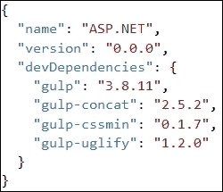

# 九、在大规模项目中使用 JavaScript

大型 web 应用项目由几个模块组成。随着各种 JavaScript 框架开发的不断改进和进步，开发人员在应用的表示层或前端层中频繁使用 JavaScript，服务器端操作仅在需要时执行。例如，当从服务器保存或读取数据或执行其他数据库或后端操作时，会向服务器发出 HTTP 请求，返回纯 JSON 对象并更新 DOM 元素。有了这些开发，大多数应用前端代码都驻留在客户端。然而，当 JavaScript 首次开发时，它被用于执行一些基本操作，例如更新 DOM 元素或显示确认对话框和其他相关操作。JavaScript 代码主要存在于页面本身的`<script>`脚本标记中。然而，大型应用由许多行代码组成，在设计和构建前端时需要适当注意。在本章中，我们将讨论一些有助于使应用前端更具可扩展性和可维护性的概念和最佳实践。

# 三思而后行

大型应用由许多 JavaScript 文件组成，这些文件的适当结构带来了更大的可见性。诸如 AngularJS、EmberJS 和其他 JavaScript 框架已经为定义控制器、工厂和其他对象提供了适当的结构和指导，并提供了使用它们的最佳实践。这些框架非常流行，并且已经解决了更高可伸缩性和可维护性的问题。然而，在某些情况下，我们希望严格依赖纯 JavaScript 文件，并可能开发自己的定制框架来满足特定需求。为了承认这些，我们采用了某些最佳的行业实践，这使得我们基于 JavaScript 的前端更易于维护和扩展。

在处理大规模应用时，我们需要提前考虑应用的范围。我们需要考虑扩展应用的容易程度，以及实现其他模块或功能的速度。如果任何模块出现故障，它会影响应用的行为还是使其他模块崩溃？例如，如果我们正在使用任何第三方 JavaScript 库来修改其方法的某些签名。在这种情况下，如果任何第三方库在我们的应用中到处频繁使用，我们必须在每一点上修改该方法，并且不仅要进行更改，还要进行测试，这可能是一个繁琐的过程。另一方面，如果实现了某个 Facade 或 wrapper，则只需要在一个地方进行更改，而不是在任何地方进行更新。因此，设计应用架构或框架是一个深思熟虑的过程，但它使应用更加健壮和健康。

# 开发高度可扩展和可维护的应用

以下是我们应该考虑的因素，以使高度可扩展和可维护的 Web 应用严重依赖 java 脚本。

## 模块化

对于大型应用，在单个 JavaScript 文件中编写所有内容不是一个好的做法。尽管如此，即使对于不同的模块有单独的 JavaScript 文件，并且通过脚本`<script>`标记引用它们，也会使全局名称空间膨胀。应该进行适当的结构化，将 JavaScript 文件保存到单独的模块级文件夹中。例如，ERP 应用由几个模块组成。我们可以为每个模块创建单独的文件夹，并使用特定的 JavaScript 文件为特定视图或页面提供特定功能。但是，公用文件可以驻留在公用文件夹中。

下面是基于 ERP 模块安排 JavaScript 文件的示例项目结构。每个模块都有一个`service`文件夹，其中包含一些文件，用于在服务器端执行一些读或写操作；还有一个`Views`文件夹，用于在加载数据或调用任何控制事件后操作特定视图的 DOM 元素。`common`文件夹可能包含所有其他模块使用的所有辅助工具实用程序和功能。例如，要在控制台上记录消息，或在服务器端发出 HTTP 请求，可以在公共 JavaScript 文件中定义函数，这些函数可由服务或查看 JavaScript 文件使用：


在前面的结构中，`Services`文件夹可以通过调用一些 Web API 或Web 服务，对数据库执行**创建**、**检索**、**更新**、**和删除**（**CRUD**操作，而`FIMain.js`包含页面特定功能。

要使 HTML 页面干净，最好将 JavaScript 文件与 HTML 页面分开。所以在前面的截图中，`FIMain.js`包含主页面对应的 JavaScript 函数，而`FIDashboard.js`包含仪表板页面对应的 JavaScript 函数，依此类推。

这些文件可以简单地通过`<script>`脚本标记添加，但在 JavaScript 世界中，直接在页面上添加 JavaScript 文件并不是一种好的做法。可以通过实现模块模式在 JavaScript 中定义模块。然而，大多数开发人员更喜欢使用 RequireJS API 来定义模块，以简化模块加载，并更好地定义该模块中定义的变量和函数。它相当于 CommonJS 系统，但由于异步行为，建议使用它。它以异步方式加载 JavaScript 模块，并加快页面加载周期。

### 实现模块模式

模块模式是最流行的设计模式，用于创建松散耦合的体系结构和保持 JavaScript 代码独立于其他模块。

模块就像.NET 类一样，可以具有私有、受保护和公共属性和方法，并向开发人员提供控制，以仅公开其他类所需的方法或属性。

在 JavaScript 中，可以使用立即执行并返回闭包的**立即调用的函数表达式**（**IIFE**）来实现模块模式。闭包实际上隐藏了私有的变量和方法，并返回一个对象，该对象只包含那些公共的且可由其他模块访问的方法或变量。

下面是`Logger`模块，它公开了一个`logMessage()`方法，调用一个私有`formatMessage()`方法来追加日期，并返回格式化的消息，然后在浏览器的**控制台**窗口中打印出来：

```js
<script>
  var Logger= (function () {

    //private method
    var formatMessage = function (message) {
      return message + " logged at: " + new Date();
    }

    return {
      //public method
      logMessage: function (message) {
        console.log(formatMessage(message));
      }
    };

  })();

  Logger.logMessage("hello world");
</script>
```

在前面的代码中，`logMessage()`方法返回一个通过`Logger`命名空间调用的对象。

一个模块可以包含多个方法和属性，为了实现这个场景，让我们修改前面的示例并添加一个方法来显示警报消息，以及一个属性来访问记录器名称并通过对象文本语法公开它们。Object literal 是绑定方法和属性的另一种表示形式，即名称-值对，由逗号分隔，提供了更清晰的表示形式。以下是修改后的代码：

```js
<script> 
  var Logger= (function () {
    //private variable
    var loggerName = "AppLogger";

    //private method
    var formatMessage = function (message) {
      return message + " logged at: " + new Date();
    }

    //private method
    var logMessage= function (message){
      console.log(formatMessage(message));
    }

    //private method
    var showAlert = function(message){
      alert(formatMessage(message));
    }

    return {

      //public methods and variable
      logConsoleMessage: logMessage,
      showAlertMessage: showAlert,
      loggerName: loggerName
    };

  })();

  Logger.logConsoleMessage("Hello World");
  Logger.showAlertMessage("Hello World");
  console.log(Logger.loggerName);
</script>
```

在前面的代码中，`logMessage()`和`showAlert()`将通过`logConsoleMessage()`和`showAlertMessage()`方法访问。

### 通过 RequireJS 模块化 JavaScript 代码

RequireJS 中的模块是模块模式的扩展，其优点是不需要全局引用其他模块。RequireJS 是一个 JavaScript API，用于定义模块并在需要时异步加载模块。它异步下载 JavaScript 文件，减少了加载整个页面的时间。

#### 使用 RequireJS API 创建模块

RequireJS 中的模块可以使用`define()`方法创建，并使用`require()`方法加载。RequireJS提供了两种语法样式来定义模块，如下所示：

*   **Defining module in CommonJS style**: Here is the code snippet to define the module in the CommonJS style:

    ```js
    define(function (require, exports, module) {
      //require to use any existing module
      var utility = require('utility');

      //exports to export values
      exports.example ="Common JS";

      //module to export values 
      module.exports.name = "Large scale applications";

      module.exports.showMessage = function (message) {
        alert(utility.formatMessage(message));
      }
    });
    ```

    前面的 CommonJS 风格语法使用 RequireJSAPI 的`define()`方法，该方法接受一个函数。此函数有三个参数：`require`、`exports`和`module`。最后两个参数`exports`和`module`是可选的。但是，它们必须以相同的顺序定义。如果您没有使用`require`，只想使用`exports`对象导出一些功能，则需要提供`require`参数。`require`参数用于导入在其他模块中使用`exports`或`module.exports` 导出的模块。在前面的代码中，我们通过在调用`require`方法时指定`utility.js`文件的路径，添加了`utility`模块的依赖关系。当添加任何依赖项时，我们只需要指定 JavaScript 文件名后面的路径，而不是文件扩展名。该文件由 RequireJSAPI 自动拾取。导出我们需要其他模块使用的任何函数或变量都可以通过`exports`或`module.exports`进行适当的导出。

*   **Defining module in AMD style**: Here is the code snippet to define the module in an AMD-style syntax:

    ```js
    define(['utility'], function (utility) {
      return {
        example: "AMD",
        name: "Large scale applications",
        showMessage: function () {
          alert(utility.formatMessage(message));
        }
      }

    });
    ```

    AMD 风格的语法将依赖项数组作为第一个参数。要以 AMD 风格的语法加载模块依赖项，必须在数组中定义它们。第二个参数采用`function`参数，采用映射到 dependencies 数组中定义的模块的模块名称，以便在函数体中使用。要导出变量或方法，可以通过对象文字语法导出它们。

#### 引导要求 JS

让我们通过一个简单的示例来了解在 ASP.NET 应用中使用 RequireJS 的概念。要在 ASP.NET 核心应用中使用 RequireJS API，您必须下载并将`Require.js`文件放置在`wwwroot/js`文件夹中。在下面的示例中，我们将编写一个`logging`模块，其中包含一些方法，例如写入控制台、显示警报和在服务器上写入。

让我们在`wwwroot/js/common`文件夹中创建`Logging.js`文件，并编写以下代码：

```js
define(function () {
  return {
    showMessage: function (message) {
      alert(message);
    },
    writeToConsole: function (message) {
      console.log(message);
    },
    writeToServer: function (message) {
      //write to server by doing some Ajax request
      var xhr = new XMLHttpRequest();
      xhttp.open("POST", "http://localhost:8081/Logging?message="+message, true);
      xhttp.send();
    }
  }
});
```

以下是`Index.cshtml`页面的代码，该页面在加载页面时显示警告消息：

```js
<script src="~/js/require.js"></script>
<script>
  (function () {
    require(["js/common/logging"], function(logging){
      logging.showMessage("demo");
    });
  })();
</script>
```

我们还可以将前面的函数包装在`main.js`文件中，并通过脚本`<script>`标记引导它。有一个称为`data-main`的特殊属性，它被 RequireJS 用作应用的入口点。

以下是驻留在`wwwroot/JS`文件夹下的`main.js` 的代码。由于`main.js`位于`wwwroot/js`文件夹下，路径为`common/logging`：

```js
//Main.js
require(["common/logging"], function(logging){
  logging.showMessage("demo");
});
```

最后，我们可以使用脚本标签引导`main.js`，如下代码所示：

```js
<script data-main="~/js/main.js" src="~/js/require.js"></script>
```

下面是示例项目结构，其中包含有要使用公共 JavaScript 文件的`Common`文件夹；鉴于模块特定 JavaScript 文件的`FI`和`HR`文件夹：


假设我们想要修改前面的示例，并在按钮的`click`事件上传递来自输入控件的消息。这可以通过为特定页面开发一个`view`模块并在其中注入`logging`模块来实现。

以下是包含`input`和`button`元素的 HTML 标记：

```js
<div id="myCarousel" class="carousel slide" data-ride="carousel" data-interval="6000">
  <input type="text" id="txtMessage" />
  <button id="btnSendMessage" >Send Message</button>
</div>
```

下面是接受`logging`模块并通过读取`txtMessage`元素值调用其`sendMessage()`方法的`view.js`文件：

```js
define(['common/logging'], function(logging) {
  $('#btnSendMessage').on('click', function(e) {
    sendMessage();
    e.preventDefault();
  });
  function sendMessage(){
    var message= document.getElementById('txtMessage').value;
    logging.showMessage(message);
  }
  return {
    sendMessage: sendMessage
  };
});
```

当点击按钮时，将显示一条警告信息。

## 事件驱动的消息传递

在上一节中，我们启用了对 JavaScript 文件的模块化支持，并将它们转换为模块。在大型应用中，我们不能仅仅依靠在其他模块中注入模块，我们可能需要一些灵活性来通过一些 Pub/Sub 模式调用某些模块的事件。我们已经在[第 7 章](07.html#1565U2-40dd2de0d2d94f79a49cd7a43c4b76e6 "Chapter 7. JavaScript Design Patterns")、*JavaScript 设计模式*中看到了 Pub/Sub 模式，它维护了一个集中列表，以注册指向某些回调函数的事件，并通过发布者对象进行调用。当启用模块之间的事件驱动消息传递时，此模式非常有用，但还有另一种更好的模式称为中介模式，它是 Pub/Sub 模式的超集。中介模式更好，因为它允许发布者或中介访问订阅对象的其他事件/方法，并允许中介决定需要调用的方法或事件。

### 实现模块间通信的中介模式

中介将对象封装在一个集中的列表中，并通过调用它们的方法来使用它们。此列表将所有对象（或模块）保留在中心位置，从而改进它们之间的通信。

让我们看一个实现中介模式的实际示例。中介作为集中控制对象，模块可以在其中订阅或取消订阅。它提供抽象的方法，任何源用户模块都可以调用这些方法与目标用户模块进行通信。中介器持有一个集中的 dictionary 对象，以基于某个键（或主要是名称）持有订阅者对象，并基于订阅者传递的模块名称调用目标模块方法。在下面的示例中，我们有`MediatorCore`（中介）、`EmployeeRepository` （订户）和`HRModule` （订户）对象。我们将使用 RequireJSAPI 将 JavaScript 文件转换为模块。

以下是`MediatorCore`JavaScript 文件：

```js
//MediatorCore.js
define(function () {
  return {

    mediator: function () {
      this.modules = [];

      //To subscribe module
      this.subscribe = function (module) {
        //Check if module exist or initialize array
        this.modules[module.moduleName] = this.modules[module.moduleName] || [];

        //Add the module object based on its module name
        this.modules[module.moduleName].push(module);
        module.mediator = this;
      },

      this.unsubscribe = function (module) {
        //Loop through the array and remove the module
        if (this.modules[module.moduleName]) {
          for (i = 0; i < this.modules[module.moduleName].length; i++) {
            if (this.modules[module.moduleName][i] === module) {
              this.modules[module.moduleName].splice(i, 1);
              break;
            }
          }
        }
      },

      /* To call the getRecords method of specific module based on module name */
      this.getRecords = function (moduleName) {
        if (this.modules[moduleName]) {
          //get the module based on module name
          var fromModule = this.modules[moduleName][0];
          return fromModule.getRecords();
        }
      },

      /* To call the insertRecord method of specific module based on module name */
      this.insertRecord = function (record, moduleName) {
        if (this.modules[moduleName]) {
          //get the module based on module name
          var fromModule = this.modules[moduleName][0];
          fromModule.insertRecord(record);
        }
      },

      /* To call the deleteRecord method of specific module based on module name */
      this.deleteRecord = function (record, moduleName) {
        if (this.modules[moduleName]) {
          //get the module based on module name
          var fromModule = this.modules[moduleName][0];
          fromModule.deleteRecord(record);

        }
      },

      /* To call the updateRecord method of specific module based on module name */
      this.updateRecord = function (record, moduleName) {
        if (this.modules[moduleName]) {
          //get the module based on module name
          var fromModule = this.modules[moduleName][0];
          fromModule.updateRecord(record);

        }
      }

    }
  }
});
```

此中介公开了四种执行 CRUD 操作的方法。这个例子展示了一个简单的`HR`模块，它使用特定的存储库来执行特定的操作。例如，`HR`模块可以有`EmployeeRepository`模块将记录保存在员工专用表中，`DepartmentRepository`进行部门专用操作等。

以下是`EmployeeRepository`的代码片段，其中包含中介中定义的抽象方法的具体实现：

```js
//EmployeeRepository.js
define(function () {
  return {

    //Concrete Implementation of Mediator Interface
    EmployeeRepository: function (uniqueName) {
      this.moduleName = uniqueName;
      //this reference will be used just in case to call some other module methods
      this.mediator = null;

      //Concrete Implementation of getRecords method
      this.getRecords = function () {
        //Call some service to get records

        //Sample text to return data when getRecords method will be invoked
        return "This are test records";

      },
      //Concrete Implementation of insertRecord method
      this.insertRecord = function (record) {
        console.log("saving record");
        //Call some service to save record.
      },

      //Concrete Implementation of deleteRecord method
      this.deleteRecord = function (record) {
        console.log("deleting record");
        //Call some service to delete record
      }

      //Concrete Implementation of updateRecord method
      this.updateRecord = function (record) {
        console.log("updating record");
        //Call some service to delete record
      }

    }
  }
});
```

`EmployeeRepository`在初始化时取 name 参数，定义中介变量在中介注册时可以设置。这是在`EmployeeRepository`想要调用某个其他模块或某个订户模块的存储库时提供的。我们可以为`HRModule`创建多个存储库，例如`RecruitmentRepository`和`AppraisalRepository`，并在需要时使用它们。

以下是通过中介调用`EmployeeRepository`的`HRModule`代码：

```js
//HRModule.js
define(function () {
  return {
    HRModule: function (uniqueName) {
      this.moduleName = uniqueName;
      this.mediator = null;
      this.repository = "EmployeeRepository";

      this.getRecords = function () {
        return this.mediator.getRecords(this.repository);
      },

      this.insertRecord = function (record) {
        this.mediator.insertRecord(record, this.repository);
      },

      this.deleteRecord = function (record) {
        this.mediator.deleteRecord(record, this.repository);
      }

      this.updateRecord = function (record) {
        this.mediator.updateRecord(record, this.repository);
      }

    }
  }
});
```

现在，我们将向中介注册`HRModule`和`EmployeeRepository`，并调用`HRModule`方法来执行 CRUD 操作。

下面的是`HRView.js`的代码，用于捕捉表单上按钮的`click`事件，并在点击按钮时调用`getRecords()`方法：

```js
//HRView.js
define(['hr/mediatorcore','hr/employeerepository','hr/hrmodule'], function (mediatorCore, employeeRepository, hrModule) {
  $('#btnGetRecords').on('click', function (e) {
    getRecords();
    e.preventDefault();
  });
  function getRecords() {
    var mediator = new mediatorCore.mediator();
    var empModule = new hrModule.HRModule("EmployeeModule");
    mediator.subscribe(empModule);

    var empRepo = new employeeRepository.EmployeeRepository("EmployeeRepository");
    mediator.subscribe(empRepo);

    alert("Records: "+ empModule.getRecords());
  }
  return {
    getRecords: getRecords
  };
});
```

以下是用于通过 RequireJS API 引导`HRView.js`文件的`main.js`文件：

```js
//main.js
require(["./hrview"], function(hr){
});
```

最后，我们可以在 ASP.NET 的`Index.cshtml`页面上使用前面的`Main.js`模块，如下所示：

```js
//Index.cshtml

@{
  ViewData["Title"] = "Home Page";
}
<script data-main="js/main.js"  src="~/js/require.js"></script>

<div id="myCarousel" class="carousel slide" data-ride="carousel" data-interval="6000">
  <input type="text" id="txtMessage" />
  <button id="btnGetRecords" >Send Message</button>
</div>
```

以下是显示模块之间如何通信的逻辑图：


## 封装复杂代码

开发高度可扩展和可维护的应用的另一个核心原则是使用包装器并将复杂的代码封装到一个更简单的接口中。这可以通过实现 Facade 模式来实现。

Facade 模式通过公开一个方法并将所有复杂代码隐藏在 Facade 对象中来简化复杂代码。例如，有许多方法和 API 可用于执行 Ajaxified 操作。Ajax 请求可以使用普通的`XmlHttpRequest`对象进行，或者使用 jQuery，使用`$.post()`和`$.get()`方法非常容易。在 AngularJS 中，可以使用自己的`http`对象来调用服务等等。当内部API 被修改时，或者当您决定使用其他更好的 API 时，这些类型的操作可以被封装并从中受益；需要进行修改，这远远少于在所有使用过它的地方进行修改。使用 Facade 模式，您只能在 Facade 对象中修改它，并在使用它的任何地方更新它时节省时间。

使用 Facade 的另一个优点是，它通过将一堆代码封装到一个简单的方法中来减少开发工作量，并使消费者易于使用。Facade 通过最小化调用特定功能所需的代码行来减少开发工作量。有关 Facade 的更多信息，请参考[第 7 章](07.html#1565U2-40dd2de0d2d94f79a49cd7a43c4b76e6 "Chapter 7. JavaScript Design Patterns")、*JavaScript 设计模式*。

## 生成文档

适当的文档可以提高应用的可维护性，并使开发人员在需要或定制应用时更容易引用它。市场上有许多文档生成器。JSDoc和 YUIDoc 是非常流行的 JavaScript 文档生成器，但在本节中，我们将使用 JSDoc3，它不仅可以生成文档，还可以在开发过程中为自定义 JavaScript 模块启用 intellisense。

JSDoc 是一个类似于 JavaDoc 和 PHPDoc 的 API。注释可以直接添加到 JavaScript 代码中。它还提供了一个 JSDoc 工具，通过它可以创建文档网站。

### 在 ASP.NET 内核中安装 JSDoc3

JSDoc3 可以添加为一个节点包，我们可以将它与 Gulp 任务运行程序一起生成文档。要将 JSDoc3 添加到 ASP.NET 核心项目中，首先可以向节点使用的`package.json`文件中添加一个条目。此项必须在开发依赖项中完成：


上一个屏幕截图中定义的第一个开发依赖项是 Gulp，它是创建任务所必需的，而`gulp-jsdoc3`是实际的文档生成器，在您运行该任务时生成 HTML 网站。

任务可定义如下：

```js
/// <binding Clean='clean' />
"use strict";

var gulp = require("gulp"),
jsdoc = require("gulp-jsdoc3");

var paths = {
  webroot: "./wwwroot/"
};

paths.appJs = paths.webroot + "app/**/*.js";

gulp.task("generatedoc", function (cb) {
  gulp.src(['Readme.md', paths.appJs], { read: false })
  .pipe(jsdoc(cb));
});
```

在前面的代码片段中，我们有一个名为`generatedoc`的任务，其中我们正在读取放置在`wwwroot/app/**/*.js`的文件并生成文档。`jsdoc`对象采用配置默认值生成文档。要传递默认配置属性，我们只需通过 Gulp 指定注入函数级别的`cb`参数即可。当您从 Visual Studio 中的任务运行程序运行此`generatedoc`任务时，它将在 web 应用项目的根路径中添加一个`docs`文件夹。在 ASP.NET Core 中，我们已经知道所有静态内容都应该驻留在`wwwroot`文件夹中，要从浏览器访问它，只需将此文件夹拖放到`wwwroot`文件夹中，然后通过运行您的网站进行访问。

#### 添加注释

为了生成文档，我们需要用注释对代码进行注释。提供的注释越多，生成的文档就越好。可以通过`/**`作为起始标签和`*/`作为结束标签添加注释：

```js
/** This method is used to send HTTP Get Request **/
function GetData(path) {
  $.get(path, function (data) {
    return data;
  })
}
```

如果函数是构造函数，可以在注释中指定`@constructor`，给读者更多的含义：

```js
/** This method is used to send HTTP Get Request
   @constructor
*/
function GetData(path) {
  $.get(path, function (data) {
    return data;
  })
}
```

函数也需要参数，这可以通过在注释中使用`@param`来表示。以下是将某些服务的实际路径作为参数来检索记录的相同函数：

```js
/** This method is used to send HTTP Get Request 
  @constructor
  @param path – Specify URI of the resource that returns data
*/
function GetData(path) {
  $.get(path, function (data) {
    return data;
  })
}
```

运行应用时，它将显示以下文档：


我们已经看到了使用 JSDoc3 生成文档是多么容易。这不仅有助于理解代码，而且通过提供intellisense，在开发过程中也有助于开发人员。有关 JSDoc3 的更多信息，请参阅[http://usejsdoc.org/](http://usejsdoc.org/) 。

## 部署优化

大型应用由大量 JavaScript 文件组成。下载页面时，将对其进行解析，并下载使用`<script>`标记定义的所有 JavaScript 文件。下载 JavaScript 文件后，将对其进行解析和执行。因此，这取决于页面上引用的 JavaScript 文件数量，以及每个 JavaScript 文件包含的代码行数。为了优化页面加载周期，建议通过缩小过程对其进行压缩。这使得 JavaScript 文件的大小变小，页面加载周期变得更快。

在 ASP.NET 中，我们可以使用 Grunt 和 Gulp 模块压缩 JavaScript 文件。这些是节点模块，与 ASP.NET 核心高度集成。在 ASP.NET Core 中，我们可以通过在`package.json`文件中添加一个节点包引用来添加这些模块，每个模块都有其单独的配置文件`GulpFile.js`或`GruntFile.js`。

在本例中，我们将使用 Gulp 模块缩小和压缩 JavaScript 文件。在ASP.NET 内核中，我们可以通过在`package.json`文件中添加 Gulp 模块来启用 Gulp：



前面的代码段使用了`gulp`、`gulp-concat`、`gulp-cssmin`和`gulp-uglify`。以下是每个模块的说明：

<colgroup class="calibre18"><col class="calibre19"> <col class="calibre19"></colgroup> 
| 

单元

 | 

描述

 |
| --- | --- |
| `Gulp` | 这是用于定义可通过任务运行程序运行的任务 |
| `gulp-concat` | 此用于将 JavaScript 文件连接到单个文件中 |
| `gulp-cssmin` | 这是用来压缩 CSS 文件的 |
| `gulp-uglify` | 这是用来压缩 JavaScript 文件的 |

以下是可用于压缩 JavaScript 和 CSS 文件的示例`gulpfile.js`：

```js
/// <binding Clean='clean' />
"use strict";

//Adding references of gulp modules
var gulp = require("gulp"),
rimraf = require("rimraf"),
concat = require("gulp-concat"),
cssmin = require("gulp-cssmin"),
uglify = require("gulp-uglify");

//define root path where all JavaScript and CSS files reside
var paths = {
  webroot: "./wwwroot/"
};

/* Path where all the non-minified JavaScript file resides. JS is the folder and ** is used to handle for sub folders */
paths.js = paths.webroot + "js/**/*.js";

/* Path where all the minified JavaScript file resides. JS is the folder and ** is used to handle for sub folders */
paths.minJs = paths.webroot + "js/**/*.min.js";

/* Path where all the non-minified CSS file resides. Css is the main folder and ** is used to handle for sub folder */
paths.css = paths.webroot + "css/**/*.css";

/* Path where all the minified CSS file resides. Css is the main folder and ** is used to handle for sub folder */
paths.minCss = paths.webroot + "css/**/*.min.css";

/* New JavaScript file site.min.js that contains all the compressed and merged JavaScript files*/
paths.concatJsDest = paths.webroot + "js/site.min.js";

/* New CSS file site.min.css that will contain all the compressed and merged CSS files */
paths.concatCssDest = paths.webroot + "css/site.min.css";

//to delete site.min.js file
gulp.task("clean:js", function (cb) {
  rimraf(paths.concatJsDest, cb);
});

//to delete site.min.css file
gulp.task("clean:css", function (cb) {
  rimraf(paths.concatCssDest, cb);
});

/* To merge, compress and place the JavaScript files into one single file site.min.js */
gulp.task("min:js", function () {
  return gulp.src([paths.js, "!" + paths.minJs], { base: "." })
  .pipe(concat(paths.concatJsDest))
  .pipe(uglify())
  .pipe(gulp.dest("."));
});

/* to merge, compress and place the CSS files into one single file site.min.css */
gulp.task("min:css", function () {
  return gulp.src([paths.css, "!" + paths.minCss])
  .pipe(concat(paths.concatCssDest))
  .pipe(cssmin())
  .pipe(gulp.dest("."));
});
```

在前面的代码片段中，有四个任务，下面是它们的描述：

*   `clean:js`：删除`site.min.js`文件
*   `clean:css`：删除`site.min.css`文件
*   `min:js`：合并`paths.js`和`paths.minJs`中指定的所有文件，使用`uglify()`进行缩小，最后创建`site.main.js`文件
*   `min:css`：合并`paths.css`和`paths.minCss`中指定的所有文件，使用`cssmin()`进行缩小，最后创建`site.main.css`文件

在 Visual Studio 2015 中，您可以使用**任务运行器资源管理器**运行这些任务，并将它们与`build`事件绑定：


以下是您可以将其与特定`build`事件关联的选项：


前面的屏幕截图显示了将`clean:js`任务与**清理**构建事件绑定的步骤。因此，每当清理项目时，它都会运行`clean:js`并删除`site.min.js`文件。

# 总结

在本章中，我们讨论了构建基于 JavaScript 的项目并将其拆分为模块以提高可伸缩性和可维护性的一些概念。我们还看到了如何有效地使用中介模式来提供模块之间的通信。文档也扮演着重要的角色并提高了可维护性，我们使用了 JSDoc3，它是最流行的 JavaScript 文档 API 之一，帮助开发人员在开发过程中参考和理解 JavaScript 的功能。最后，我们讨论了如何通过将 JavaScript 文件压缩并合并为一个小型 JavaScript 文件来优化应用的加载时间，以提高性能。在下一章中，我们将讨论测试和调试 JavaScript 应用以及有效排除故障的工具。