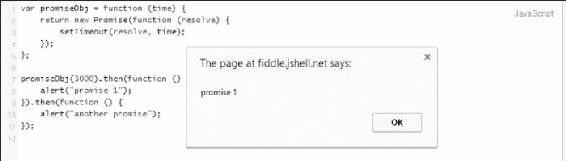

# 第三章承诺链

promises 最重要的特性之一是能够链接和管理异步操作序列。在上一章中，我们了解了 Promise API 的细节及其工作原理；值得注意的是，我们看到了`then`方法的工作原理。我们还了解了 Promissions 当前的浏览器兼容性，以及实现和扩展 JavaScript Promissions 的库。在本章中，我们将介绍以下主题：

*   链接是如何在异步 JavaScript 中出现的
*   用承诺实现连锁
*   从回调地狱转变为组织良好的承诺链

# 前所未有的锁链

正如我们在前面两章中所了解到的，承诺往往会将同步编程的强大功能带到异步函数中。promises 的这种能力包括同步功能的两个关键特性：

*   返回值的函数
*   抛出异常的函数

这些特性的意义在于，它们可以用来将一个函数返回的值直接传递给另一个函数，而不是一次；这可以转化为将这些功能一个接一个地链接起来的能力，由此链中元素之间的绑定关联就是每个操作的承诺返回值。现在，第二个特性意味着什么非常重要，因为抛出异常允许我们主要检测进程是否失败；其次，它允许我们通过处理链中捕获的任何函数捕获这些异常，并帮助我们避免在这些链接函数中丢失它。

现在，这将如何转化为一个异步世界？

首先，在异步世界中，不能简单地返回值，因为这些值还没有及时准备好。类似地，我们不能抛出异常，基本上是因为没有人能够捕获这些抛出的异常。因此，开发人员一直以来都是足智多谋的，他们试图通过恢复到嵌套回调来解决这个问题。这使他们能够将函数与返回值链接起来，但代价是可维护性、可读性，当然还有额外的代码行。当代码成行增长且嵌套回调深入时，当需要编辑或出现错误时，代码将变得更难维护和调试。此外，嵌套回调会对可读性产生负面影响，开发人员需要折叠和展开大括号，以便按照代码指示回调函数的开始和结束位置。

此外，捕获这些嵌套回调中的错误非常困难，需要开发人员手动将错误传递到回调链。异步编程中的这种考验在中很有名，被称为*回调地狱*；它通常以类似以下伪代码的代码结束：

```js
function shout(shoutTxt, callbackFunct) {
    alert(shoutTxt);
    callbackFunct("b");
}

shout('First Shout!', function (a) {
    if (a == "a"){
        alert("hey, there is an error!");
    }
    else {
        shout('Shout Again!', function (a) {
            shout('Third shout!', function (a) {
                a = "c";
                if (a == "c") {
                    shout('I am inside the third shout!', function (a) {
                        alert("hey, I can " + a.toString());
                    });
                } else {
                    shout('I am still inside the third shout!', function (a) {
                        alert("Alright I am tired");
                    });
                }
            });
        });
    }
});
```

在上一个示例中，您会注意到`function`和`});`在类似于金字塔的代码中广泛存在，记住我们甚至没有包含错误处理代码。上一个示例小规模地描述了*回调地狱*的样子。我们还可以观察到，在 JavaScript 编程中非常流行的嵌套回调是如何不受控制地发展成一个相互交织、难以维护的代码的。因此，想象一下在更复杂的场景中代码的外观。

然而，开发人员可以实现一些补救措施，使嵌套回调更具可读性和可维护性。这些补救措施包括在回调参数中使用命名函数而不是匿名函数。另一种解决方案是将执行特定任务的代码放在单独的模块中，然后将该模块插入到其他地方的应用程序代码中，从而将代码分解成更小的块。然而，这些补救措施更多的是一种变通办法，而不是一种标准做法；此外，解决方案还不足以完全解决链接异步操作的概念。

另一方面，与 JavaScript 中的异步编程相比，Promises 以一种开箱即用的方式交付了同步编程中的功能组合。

为什么会这样？因为规范规定提供`then`方法需要承诺。不仅如此；该规范还要求`then`函数或具有兼容实现的任何其他函数应返回承诺。返回的承诺包含一个值（如果满足），或者一个异常（如果拒绝）。因此，`then`可以使用返回的承诺与另一个`then`函数组合，组成一个链，从而将第一个操作的结果传递给下一个操作，依此类推。此外，该链可以在任何时间点被拒绝切断，拒绝可以由链中声明异常处理代码的任何操作来处理；换句话说，错误将通过该链自动冒泡。

### 提示

一些承诺狂热者认为这种承诺链是新标准中最好的部分。

在 JavaScript 编程中，当需要执行多个异步操作时，链接非常重要。这些场景包括一个操作的工作取决于前一个操作的结果的情况。此外，我们可能会遇到这样的情况：第一个操作需要处理一些代码，然后才能返回结果并将其传递给下一个操作。请记住，所有这些都应该在不阻塞其他线程的情况下进行，特别是 UI 线程。因此，我们需要一个简单、标准的机制来链接这些异步操作，而这正是承诺所提供的。

当涉及到链接承诺时，链接可以深入到我们想要的深度，因为`then`总是会返回一个承诺。但是，如果我们正在进行类似于`promise.then(onFullfilled)`的调用，需要注意的一点是`onFulfilled`函数只能在承诺完成后才能调用，承诺的值是它的第一个参数。因此，如果我们在第一个`then`中返回一个简单值并将其链接到另一个`then`，那么将使用前一个`then`返回的简单值调用下一个`then`。如果我们要从第一个`then`返回承诺，则以下`then`必须等待返回的承诺，并且只有在该承诺已履行或完成时才会调用或执行。

让我们看看这一行动。以下是一个非常基本的示例代码，展示了一个链式承诺：

```js
var promiseObj = function (time) {
    return new Promise(function (resolve) {
        setTimeout(resolve, time);
    });
};

promiseObj(3000).then(function () {
    alert("promise 1");
}).then(function () {
    alert("another promise");
});
```

该脚本非常简单，可以在任何开发环境中编写，甚至可以在 JSFiddle.net 之类的在线代码编辑器中编写。首先，我们通过定义`promiseObj`对象来创建承诺。这个对象是一个每次接受一个参数并返回新承诺的函数。

### 提示

请记住，目前并非所有浏览器都支持承诺，正如我们在[第 2 章](2.html#H5A42-fe4c0b71cd2847c897e147ea131725a8 "Chapter 2. The Promise API and Its Compatibility")*中了解到的，承诺 API 及其兼容性*。为此，您需要在兼容的浏览器中在 JSFIDLE 上运行或测试代码。返回本章检查是否有兼容的浏览器。

我们使用`new Promise`构建承诺。构造函数接受一个匿名函数，该函数将执行该工作。此函数通过一个`resolve`参数传递，该参数将实现承诺。在这个构造函数中，我们调用`resolve`参数来执行一个`setTimeout`函数，该函数除了在给定时间后执行的函数外，还接受另一个`time`参数。因此，`setTimeout`将解决该承诺。

代码的第二部分是链接发生的地方。我们首先称之为我们刚刚创建的`promiseObj`；既然它会回报一个承诺，我们可以打电话给`then`。根据定义，`promiseObj`采用`time`参数，以毫秒为单位，传递给`setTimeout`函数。在这里，我们通过了`3000`（3 秒），在它里面，我们简单地调用了一个`alert()`函数，该函数将在屏幕上弹出，如以下屏幕截图所示：



现在，既然`then`返回了一个承诺，我们可以对它进行另一个`then`调用；这将在承诺得到解决后执行，然后执行`alert()`功能。前面的示例虽然非常基本，但说明了如何轻松地将异步操作与承诺链接起来。

让我们尝试将前面看到的示例从嵌套回调转换为承诺链。出于说明的目的，我将添加一个 HTML 元素`div`，在承诺传播时用内容填充它。

HTML 部分如下所示：

```js
<div id="log"></div>
```

JavaScript 部分如下所示：

```js
var log = document.getElementById('log'); 
var shout = new Promise(function (resolve) {
    log.insertAdjacentHTML('beforeend', '(<small>Promise started </small>)<br/>');
    window.setTimeout( 
    function () {
        resolve('First Shout!'); // fulfill the promise !
    }, 2000);
});

shout.then(function (val) {
    log.insertAdjacentHTML('beforeend', val + '  (<small>Promise fulfilled</small>)<br/>');
    var newVal = 'Shout Again!';
    return newVal;
}).then(function (val) {
    log.insertAdjacentHTML('beforeend', val + ' (<small>Promise fulfilled</small>)<br/>');
    var newVal2 = "Third shout, you're out!";
    return newVal2;}).then(function (val) {
    log.insertAdjacentHTML('beforeend', val + ' (<small>Promise fulfilled</small>)<br/>');
    return val;
});
```

在 HTML 中，我们只有一个`div` 元素是空的，并且具有 ID 日志。在 JavaScript 中，我们首先声明一个名为`log`的变量来保存`div`元素。然后，我们构造一个新的承诺，并将其分配给一个名为`shout`的变量。在 promise 对象中，我们添加文本以强调我们刚刚开始了 promise。我们在这里承诺的是等待 2 秒（2000 毫秒）后的`shoutText`字符串。同样，我们使用`window.setTimeout`函数来模拟需要一些时间才能完成的异步操作。它将履行承诺，在给定的时间后解决它。

接下来，我们使用`then`方法调用`shout`，在该方法中，我们定义了当承诺实现时它将做什么。在第一种`then`方法中，我们只需将包含`shoutText`值的`val`参数传递给`log.insertAdjacentHTML`函数。这将以小字体显示包含文本`Promise fulfilled`的`div`元素内容旁边的值。接下来，我们定义一个新变量`newVal`，将文本`Shout Again!`分配给它，并返回它。向前看，第二个`then`还显示上一次承诺调用返回的值。我们还定义了一个新变量，为它指定一个文本值，然后返回它。最后一个`then`调用只是将`val`的值相加，现在该值等于`newVal2`，并将其添加到`div`元素的内容中。注意，`val`保存承诺从一个操作返回到链中下一个操作的值的内容。

### 提示

这个例子也可以在 JSFiddle.net 上测试。

## 按顺序链接

我们不仅可以用承诺链接异步操作，还可以将它们链接起来，使它们按顺序运行这些操作。正如我们在本章前面了解到的，如果一个`then`操作返回一个值，则随后的`then`将被调用该值，除非第一个`then`返回一个承诺；如果发生这种情况，后续的`then`将等待返回的承诺，并且只有在该承诺得到履行或被拒绝时才会调用。该规则允许我们对这些异步操作排队，这样每个操作都将等待前一个操作完成，从而按顺序运行。让我们看一个更好地解释它的例子。在本例中，我们有一个名为`getData`的函数，它接受一个 JSON 文件并从该 JSON 文件检索数据。第一个 JSON 文件具有类别，对于每个类别，我们需要按顺序获取每个类别下的项目。让我们使用以下代码来执行此操作：

```js
getData(jsonCategoryUrl).then(function(data) {
//get the items per category 1 
getItemsPerCategory(data.categories[0]).then(function(items) 
{
        //items are retrieved here
});
  return getData (data.categories[0]); //return category 1
}).then(function(category1) {
   alert("We now have category 1", category1);
//return category 2
return getData (data.categories[1]); 
}).then(function(category2) {
alert("We now have category 2", category2);
//return category 3
return getData (data.categories[2]); 
});
```

前面的代码示例对`jsonCategoryUrl`函数进行异步调用，该函数将返回一组类别；在此之后，我们通过传递`data.categories[0]`参数，然后将第一个类别传递给下一个`then`调用，来请求第一个类别中的项目。在这些连锁承诺的第二个链接中，我们检索第二个类别`data.categories[1]`并将其传递给最后一个`then`调用，最后一个`then`调用又检索第三个类别`data.categories[2]`。这个例子向我们展示了如果我们需要一个链，其中一个链接依赖于或需要等待前面承诺的结果，我们如何在链式承诺中排队异步操作。

此功能确实使承诺从常规回调模式中脱颖而出。我们可以通过使用快捷方式检索类别来优化前面的代码，如下代码所示：

```js
//declare categorypromise varvar catPromise;
function getCategory(i) {
//if catPromise have no value get Data else just populate it from value of catPromise.

  catPromise = catPromise || getData(jsonCategoryUrl); 
  return catPromise.then(function(category) {
      //get the items under that category
      return getData(category.Items[i]);
  })
}
getCategory(0).then(function(items) {
alert(items);
    return getCategory(1);
}).then(function(items) {
   alert(items);
});
```

在前面的代码示例中，我们首先声明一个名为`catPromise`的变量来保存承诺的类别。接下来，我们声明一个名为`getCategory(i)`的函数，该函数将`i`的值作为参数；在这个函数中，我们将`catPromise`设置为`getData(jsonCategoryUrl)`函数检索到的 JSON 数据；但是，使用`||`（or）操作符，我们可以首先检查`catPromise`对象是否有值，这样我们就不会再次获取类别 JSON 文件，而只获取一次。当我们使用值`0`调用`getCategory`时，它将检索第一个类别；在此之后，它将返回带有`getCategory(1)`的下一个类别，并将其传递给最后一个`then`调用。这样，在调用`getCategory`之前，我们不会下载类别 JSON 文件；然而，我们经常再次调用`getCategory`函数，我们不需要重新下载类别 JSON 文件；相反，我们将重用它，因为它将在操作序列中再次调用。由于`getCategory`函数返回另一个 promise 对象，它允许您进行 promise 管道化，我们将第一个操作的结果传递给下一个操作。此外，此示例显示的一个重要特征是，如果提供给`then`的函数返回一个新的承诺，`then`返回的承诺将在该函数返回的承诺实现之前不会实现，从而在该承诺链中将异步操作排队。

此外，前面的示例清楚地显示了承诺如何处理传统回调模型及其生成的金字塔代码。

# 总结

承诺是解决复杂的异步操作的一种很好的方法。承诺为 JavaScript 中异步操作的轻松链接提供了一种很好的机制。它们允许您以比回调模式更好的方式管理这些操作的序列。

在下一章中，我们将学习如何处理承诺中的错误，了解如何使用承诺管理异常，并回顾如何处理承诺中异步操作期间出现的错误的一些示例。