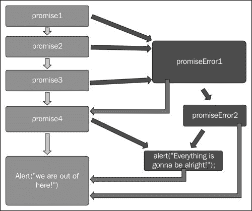

# 第四章错误处理

正如在任何编程语言中一样，错误和异常必然会增加；为了确保代码的平稳运行和更容易的调试，我们需要抛出并捕获这些异常。使用异步 JavaScript 编程处理错误可能会很乏味。然而，承诺为我们提供了处理错误的强大机制，我们将在本章中对此进行探讨。在上一章中，我们学习了异步操作的链接。我们还看到了如何从回调地狱转换为更可读和可维护的承诺链。在本章中，我们将介绍以下主题：

*   promise 中的异常和错误处理
*   如何使用`then`和`catch`方法处理承诺错误

# 例外和承诺

异步 JavaScript 编程中没有标准或约定的机制来处理异常，这主要是因为这些异常会在未来发生，并且无法判断拒绝的承诺最终是否会得到处理。此外，在异步世界中，我们不能简单地抛出异常，因为当这些错误还没有准备好时，没有人能够捕获它们。因此，创建了解决此问题的变通方法。捕获错误和异常的常见技术涉及在嵌套回调链上手动传递这些异常。另一方面，承诺为我们提供了错误处理和开箱即用。他们这样做的方式是声明您的函数应该返回一个承诺，如果该承诺失败，那么该承诺将被拒绝，并给出拒绝的理由。

我们在[第 1 章](1.html#E9OE2-fe4c0b71cd2847c897e147ea131725a8 "Chapter 1. JavaScript Promises – Why Should I Care?")中学习了*JavaScript 承诺——我为什么要在意？*承诺可以存在于三种不同的状态：未决、履行和拒绝。被拒绝状态的要求如下：

*   承诺不得变更为任何其他状态（待定或履行）
*   承诺必须有被拒绝的理由，并且该理由不得在该承诺内改变

拒绝状态的这两个要求允许错误处理，更重要的是允许错误合成，因此拒绝该承诺的原因将使用`then`方法自动触发该承诺链。承诺允许错误在代码链中向上传播，类似于同步异常。此外，它还提供了一种更简洁的样式来处理异步中的错误。

通常，在使用回调方法的异步编程中，我们需要将我们认为不安全的代码块包装在`try`catch 块中。这在以下代码示例中显示：

```js
try {
    return JSON.parse("json"); //this will cause an error
} catch (error) {
    alert("I have an error with the following details: \n" + error);
}
```

上一个代码示例显示了一个脚本块，用于警告错误。在这段代码中，我们将`return JSON.parse("json");`包装在`try`中。。。`catch`块，并通过向其传递无效的 JSON 参数故意导致错误。JavaScript 函数`JSON.parse()`用于将 JSON 文本转换为 JavaScript 对象。在我们的示例中，它将尝试解析文本`json`并抛出一个错误。我们将捕获该异常并显示一个包含该错误详细信息的警报。

如果我们在HTML 页面或在线 JavaScript 编辑器中运行此脚本，结果将是一个带有以下消息的警报框：

**我对以下细节有错误：**

**语法错误：意外标记 j**

我们可以通过[上的这个公共 JSFIDLE URL 浏览代码 http://jsfiddle.net/RamiSarieddine/mj6hs0xu/](http://jsfiddle.net/RamiSarieddine/mj6hs0xu/)

到目前为止，我们已经看到，如果承诺中出现错误，承诺要么得到履行，要么被拒绝。当承诺被拒绝时，类似于在同步代码中引发异常。带`then`功能的标准承诺取`onFulfilled`和`onRejected`两个参数，如下代码所示：

```js
promise.then(onFulfilled, onRejected)
```

`onRejected`参数是一个充当错误处理程序的函数，当承诺失败时将调用它。当承诺中发生错误或异常时，表示承诺被拒绝，引发的错误将提供给`onRejected`错误处理程序。当我们调用`onRejected`时，有几个考虑因素，假设我们有一个简单的`promise.then(onFulfilled, onRejected)`，可以在下面的列表中总结：

*   只有在承诺被拒绝后才能调用`onRejected`，拒绝原因是其第一个论点
*   `onRejected`不得多次呼叫

第二个考虑非常简单。`onRejected`函数不会在同一承诺上被多次调用。第一对价主张，如果承诺被拒绝，`onRejected`将不会被调用。

尽管如此，拒绝确实会隐式发生，也会在该承诺的构造函数回调中抛出错误的情况下发生。以下代码示例说明了这一点：

```js
var promiseTest = new Promise(function (resolve) {
    // JSON.parse will throw an error because of invalid JSON
    // so this indirectly rejects
    resolve(JSON.parse("json"));
});

promiseTest.then(function (data) {
    alert("It worked!" + data);
}, function (error) { //error handler
    alert(" I have failed you: " + error);
});
```

在前面的代码中，我们定义了一个名为`promiseTest`的新承诺，并根据该承诺调用`then`。这个承诺在其构造函数回调中所做的只是 resolve`JSON.parse()`，我们故意向其传递了一个无效参数以导致错误。现在，这将在构造函数中抛出一个错误，当我们使用`then`方法调用承诺时，它将间接导致拒绝。如果我们只有一个`onFullfilled`处理程序，我们就不会发现错误。该异常将作为参数在拒绝中提出，其值为`error`。我们在`promiseTest.then()`的参数中提供了`error`处理程序；因此，我们可以捕获并处理错误。

您可以通过[上的这个公共提琴来测试这个示例代码 http://jsfiddle.net/RamiSarieddine/x2Latjg6/](http://jsfiddle.net/RamiSarieddine/x2Latjg6/) 。

### 提示

由于错误会自动冒泡并成为拒绝，因此在 promise 构造函数回调中处理所有与 promise 相关的作业变得非常方便；如果出现任何错误，将在调用承诺时捕获。

# 用承诺处理错误

正如我们所看到的，Promissions在异步编程中提供了更丰富的错误处理机制。虽然承诺/A+SPEC 只处理一种方法，即 AutoT0T，并且不提供任何其他方法，但是 OLE T1 规范的 AUT T3 规范为承诺互操作性奠定了基础，因此，扩展了承诺特征，包括错误处理。

我们可能会在 JavaScript 库中遇到几个与 Promises/A+兼容的错误处理实现。其中一些扩展包括`catch()`方法，该方法在基本`then()`函数的之上实现。任何人都可以编写一个`catch()`方法，并通过按照以下代码扩展 promise 对象将其包含在脚本中：

```js
Promise.prototype.catch = function(onRejected) {
    return this.then(null, onRejected);
};
```

在前面的代码示例中，我们定义了一个名为`catch`的方法，该方法扩展了当前的`this.then`方法，并通过仅执行`onRejected`处理程序而忽略`then`的`onFulfilled`处理程序参数来返回被拒绝的承诺。在使用中，`catch()`方法如下所示：

```js
var promiseTest = new Promise(function (resolve) {
    resolve(JSON.parse("json"));
});

promiseTest.then(function (data) {
    alert("It worked: " + data)
}).catch(function(error) {
  alert("I have Failed you! " + error);
});
```

`catch()`函数允许我们用更可读的函数替换错误处理程序，该函数提供了更干净的方法来处理错误。

我们可以从前面的代码示例中得出结论，catch 没有什么特别之处，只是它的糖衣功能。此外，正如 Promise/A+规范的作者之一 Brian Cavalier 所说：`catch()`只是`then()`的一个受限子集。但它是否使代码总体上更具可读性，并使错误处理更具可读性？ECMAScript 6.0 将`catch()`作为一项要求纳入 promise 规范中，正如我前面所述，现在大多数流行的实现都包括它。

然而，在实现中，`then()`和`catch()`之间存在一个纠结，因为`then()`有时会有误导性。要在示例中看到它以便更好地理解它，请使用以下两行代码示例：

```js
promise.then(handler1, handler2);

promise.then(handler1).catch(handler2);
```

这两行代码包括`promise`、`then`和`catch`方法，它们有两个处理程序：`handler1`和`handler2`。这两个调用不相等。如果`handler1`中发生错误，第一行将不调用`handler2`。这是因为，如果承诺得到履行，`handler1`将被调用，如果承诺被拒绝，`handler2`将被调用。但如果`handler1`抛出`error`，则不会调用`handler2`作为回报。

同时，在第二行中，如果承诺被拒绝或`handler1`抛出异常，将调用`handler2`。由于`catch()`只是`then(null, handler)`的糖衣，因此第二行与以下内容相同，这可以让这个难题更加清晰：

```js
promise.then(handler1).then(null, handler2);
```

前两行代码中不等效的原因是`then()`的操作方式。`then(handler1, handler2)`方法为一个承诺注册两个并行处理程序，从而调用`handler1`或`handler2`，但绝不同时调用这两个。另一方面，对于`then(handler1).catch(handler2)`，如果`handler1`拒绝，两个处理程序/函数都将被调用，因为它们代表承诺链中的两个独立步骤。承诺拒绝将向前移动到后续`then`方法，只有当我们将`catch`作为`then`的等价物时，才会进行拒绝回调。

虽然乍一看这似乎不是很直观，但提供一个关于异步编程的更简单的推理是非常重要的，这使得拒绝承诺与在同步编程中抛出异常非常相似。在同步世界中，异常不允许同时执行紧跟在`throw`块之后的代码和最近的`catch`块内的代码，因此`try`块内发生的错误直接移动到`catch`块。

### 注

正如我们所了解到的，`Catch()`函数对于应用程序开发人员来说更可取，因为它具有更好的可读性和直观的错误处理流程，而`promise.then(handler1, handler2)`主要在实现承诺时在内部使用。

错误处理机制允许我们编写以安全方式执行操作的函数。让我们看一下以下承诺链，其中包括对`catch()`的错误处理，并看看它在流程图中是如何翻译的：

```js
promise1.then(function () {
    return promise2();
}).then(function () {
    return promise3();
}).catch (function (error) {
    return promiseError1();
}).then(function () {
    return promise4();
}, function (error) {
    return promiseError2();
}).catch (function (error) {
    alert("Everything is gonna be alright!");
}).then(function () {
    alert("We are out of here!");
}); 
```

前面承诺链和错误对应的流程图如下图所示：



绿色的盒子将是实现目标的盒子；红色的表示承诺被拒绝时的错误处理程序。我们可以通过这些行跟踪流程，了解哪些已完成，哪些被拒绝，并将其与之前的代码示例进行比较，以更好地了解错误将如何在承诺链中传播。

# 总结

JavaScript 的承诺提供了一种标准化的错误处理方法，其基础是在 Type T0ER 方法的规范中存在的扩展，该方法可以扩展到诸如 java T1 席等的方法，这允许更可读和直观的错误处理代码。`then`功能有两个强大的参数：`onFulfilled`和`onRejected`。这些函数参数允许我们处理已实现的承诺操作返回的值以及拒绝承诺时返回的错误。在下一章中，我们将介绍 WinJS 库；我们将了解该库中的 promises 对象，以及如何在 Windows 开发中使用它。