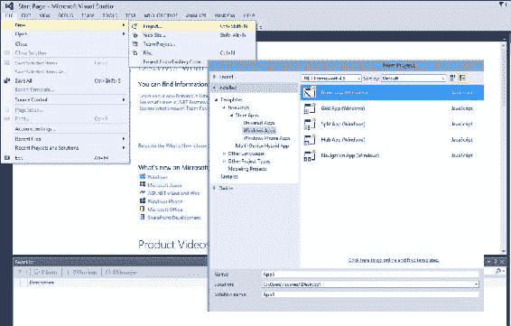
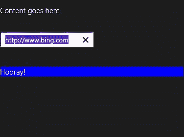

# 第五章 WinJS 中的承诺

Promises 具有来自各种框架的各种实现，所有这些框架共享一个共同的基础；这就是承诺的概念。实际上，所有 promise 库都以不同的形式提供了一个通用的特性，使使用 JavaScript 的异步编程变得更简单、更好。WinJS，用于 JavaScript 的 Windows 库，是有自己承诺实现的库之一，我们将在本章中探讨。在上一章中，我们学习了如何处理承诺操作期间出现的异常。我们还看到 JavaScript 承诺如何配备强大的错误处理机制。此外，我们还学习了如何使用`then`和`catch`方法处理错误。在本章中，我们将介绍以下主题：

*   WinJS 名称空间简介
*   WinJS 的 promise 对象的详细信息
*   在 Windows 应用开发中使用 WinJS.Promise 的基本示例

# 介绍 WinJS

WinJS 是用于 JavaScript 的Windows 库的缩写，它是由微软开发的 JavaScript 库，最近被开源。此库的设计目的是允许开发人员为 Windows 8（使用 HTML5 和 JavaScript）构建具有一流本地质量体验的 Windows 应用商店应用，如 Skype 和音乐应用。它是用 XAML 和 C++、VB.NET 或 C++编程本地应用的第二个选项。这种替代方案允许 web 开发人员利用他们的知识和技能构建应用商店。WinJS 库更像是一个综合工具包。它不仅提供了丰富的名称空间，还包括以下特性：

*   通过 Windows 运行时（WinRT）访问设备硬件
*   提供完善的 UI 控件，如 ListView、FlipView 和语义缩放以及页面控件
*   提供坚实的基础设施，如承诺和数据绑定

此外，WinJS 可以与其他库和框架一起在独立解决方案中使用。

WinJS 自诞生以来已经有了很大的发展。最初是 Windows 应用商店应用专用的平台，现在支持 web 浏览器和其他设备，试图实现跨平台。最新版本的 WinJS 2.1 支持 Windows Phone 8.1，现在 WinJS 正在 Xbox One 应用中使用。此外，它现在准备覆盖其他非微软浏览器和设备上的网站和网络应用。

### 注

开源 WinJS 现在通过[托管在 GitHub 上 https://github.com/winjs/winjs/](https://github.com/winjs/winjs/) ，社区成员可以在这里查看库并贡献其源代码。

所有 WinJS 库函数都是在名为 WinJS 的命名空间下定义的。WinJS 命名空间在 Windows 库中为 JavaScript 提供了特殊功能，包括 promise 对象和`xhr`函数。它包括三种类型的成员对象：属性和函数

对象包括以下两个成员：

*   `ErrorFromName`：这是简单的错误对象。
*   承诺对象：这是我们在本章中谈论的城市。与 promise 对象类似，我们在本书中一直在讨论，它基本上提供了一种技术，可以根据尚不存在的值分配要执行的工作。它提供了一种抽象机制，用于处理与异步公开的 API 的交互。

属性包括以下内容：

*   `validation`：此属性包含一个 setter，用于显示验证过程的结果

职能包括以下三名成员：

*   `log`：此函数记录输出并将其写入 Visual Studio 内的 JavaScript 控制台。此功能可以通过自定义实现进行扩展，也可以使用`WinJS.Utilities.startLog`登录 JavaScript 控制台。
*   `strictProcessing`：此功能不再需要，因为严格处理默认总是开启的。由于不再需要该函数，它已被声明为不推荐使用。
*   `xhr`：此函数只是将对`XMLHttpRequest`的调用封装在承诺中。

这从高级视图总结了 WinJS 名称空间；WinJS 的代码在`base.js`文件中找到。

# 解释 WinJS.Promise 对象

这个对象是 WinJS 库最重要的方面之一，promise 的实例涉及到我们使用异步 API 所做的任何事情。让我们深入了解这个物体的细节。就解剖学而言，promise 对象包括以下三种类型的成员。

## 施工人员

在WinJS 中的构造函数级别，使用`WinJS.Class.define`函数创建一个类。在第一个参数中，函数充当构造函数。现在，在`Promise`类的情况下，它是使用`WinJS.Class.derive`函数从名为`PromiseStateMachine`的基类派生而来的，其第二个参数是构造函数。在这两种情况下，构造函数可以被命名为任何名称；或者，它们也可以是匿名的。然而，此`WinJS.Promise`构造函数的描述与对象描述本身相同。`WinJS.Promise`构造函数接受两个函数参数：`init`和`onCancel`。

在声明新的承诺对象时，我们需要两个参数：`init`和`onCancel`。这两个参数都是函数。语法如下所示：

```js
var promiseObj = new WinJS.Promise(init, onCancel);
```

`init`参数是可选的。`init`函数是在 promise 对象的初始化或构造过程中调用的，它包括 promise（在本例中为`promiseObj`）将表示的工作的实际实现。此实现可以是异步的，也可以是同步的，这取决于所需工作的范围和性质。

### 提示

这里需要注意的一件重要事情是，`init`函数中编写的代码在默认情况下不会呈现为异步。为了确保代码异步运行，我们必须使用异步 API，例如 Windows 运行时异步 API、`setTimeout`、`setImmediate`和`requestAnimationFrame`。

此参数中使用的`init`函数采用以下三个参数：

*   `completeDispatch`：当`init`中的操作已经完成时，会调用此参数，从而传递该操作的结果`init`代码应该在操作完成时调用此参数，将操作结果作为参数传递。
*   `errorDispatch`：该参数将在该操作发生错误时被调用，因此承诺获得错误状态。因为这是一个错误，`errorDispatch`的参数应该是`WinJS.Promise.ErrorFromName`的一个实例。
*   `progressDispatch`：在处理操作时，会定期调用此参数。此函数的参数将包含中间结果。如果承诺内的操作需要支持进度，则使用此参数。

`onCancel`参数是 Promise 构造函数的第二个参数。承诺的消费者可以使用此功能取消其任何未完成的工作。但是，承诺在 WinJS 中没有义务提供或支持取消。

## 事件

接下来在承诺对象成员类型列表中，我们有`Events`。目前，Promise 对象有一个名为`onerror`的事件。如名称所示，当承诺处理过程中出现错误时，会发生此事件。此外，无论此事件是否在其他地方处理，只要在任何承诺中引发运行时错误，就会触发此`onerror`事件。错误处理程序可以帮助调试，可以使用它设置断点并提供错误日志记录。但是，它将只提供在一天结束时导致错误的代码或输入的细节和细节。此`onerror`事件提供了一个通用的错误处理机制。在代码中，添加一般错误处理程序将如下所示：

```js
WinJS.Promise.onerror = errorHandler;

function errorHandler(event) {
     // get generic error handling info
     var exc = event.detail.exception;
     var promiseErrored = event.detail.promise;
}
```

代码示例的第一行只是将`errorHandler`函数附加到 promise 对象的`onerror`事件。接下来，我们定义了`errorHandler`函数，它接受一个参数`event`；该函数所做的只是从示例中的事件中检索信息，例如`exception`和`promise`。然后，我们将这些值分配给变量。参数`event`是`CustomEvent`类型的事件处理程序参数；通常它是一个包含事件信息的对象。

## 方法

承诺对象的最后一个成员类型为`Methods`，目前`WinJS.Promise`有以下六种方式：

*   `addEventListener`：此方法只是将事件侦听器附加并添加到承诺中。取三个参数：`eventType`，为事件的字符串类型名称；`listener`，事件触发时调用的函数；和`capture`，这是一个布尔值，用于启用或禁用捕获。此方法没有返回值，其基本语法如下：

    ```js
    promise.addEventListener(eventType, listener, capture);
    ```

*   `removeEventListener`：此方法从控件中取出事件侦听器。在语法上，它类似于`addEventListener`方法，类似于下面的代码行：

    ```js
    promise.removeEventListener(eventType, listener, capture);
    ```

*   `Cancel`：此方法尝试取消承诺。在承诺支持取消但尚未履行的情况下，此方法将导致承诺进入错误状态，值为 error（“cancelled”）。它没有参数，也没有返回值。其基本语法如下：

    ```js
    promise.cancel();
    ```

*   `dispatchEvent`：此方法只是分派并引发具有指定类型和属性的事件。它接受两个参数并返回一个布尔值，具体取决于是否对事件调用了`preventDefault`。此方法的参数为字符串值类型，包含事件名称和`eventDetails`对象，该对象包含要附加到事件对象的附加属性集。此方法的基本语法如下所示：

    ```js
    promise.dispatchEvent(type, eventDetails);
    ```

*   `Then`: This is the most important method of the promise object. This takes three parameters of the type function, which allows us to specify the work to be done on the completion of the promise: the promise value has been fulfilled; the error handling that will be performed when the promise raises an error, and it has failed to fulfill a value; and lastly the handling of the work progress within the promise along the way. The return value of `then` is a promise that contains the result of executing the `onComplete` function in its value. In its basic form, the `then` method will have the following syntax:

    ```js
    promise.then(onComplete, onError, onProgress);
    ```

    `then`方法的三个参数属于函数类型。详情如下:

    *   `onComplete`：当允诺成功完成并用值实现时，调用此处理程序。该值将作为单个参数传递。`onComplete`返回的值成为`then`返回的承诺的履行值。如果在执行此功能过程中出现错误或异常，`then`返回的承诺将进入错误状态。
    *   `onError`：当承诺违背且履行错误时调用此处理程序；`onError`返回的值将成为`then`方法返回的承诺值。此处错误将作为参数传递，而不是像在`onComplete`函数中那样传递值。
    *   `onProgress`：如果我们需要报告操作的进度，则使用此处理程序。它只有一个参数，即进度数据。请注意，承诺不一定要支持 WinJS 中的进度。
*   `Done`方法，如`Then`也允许我们指定在承诺履行时需要执行什么，承诺失败时的错误处理，以及一路上的进度报告。此外，此函数将抛出在错误状态下作为承诺值从`then`返回的任何错误。与返回承诺的`then`不同，`Done`不返回值。此方法的基本语法如下代码行所示：

    ```js
    promise.done(onComplete, onError, onProgress);
    ```

正如我们在前面的代码语法中所看到的，`promise.done`在参数方面与`promise.then`类似，因为它有功能参数：`onComplete`、`onError`和`onProgress`，这些参数的行为实际上与`Then`方法中的对应参数相同。

`then`和`done`之间存在一些差异；最明显的是返回值。如前所述，`then`方法返回承诺，`done`没有返回值，这直接影响到 WinJS承诺的链接。以下列表总结了这些差异：

*   **在**链接中：`Then`允许链接多个`then`函数，因为它返回一个承诺。而与`done`的链接不能超过一个`done`方法，因为它不返回值；更具体地说，它返回`undefined`。因此，`done`必须是最后一个呼叫。例如，我们可以有`.then().then().then().then()`等等，而`done`则以`.then().then().done()`结尾。
*   **在错误处理**中：如果`done`没有提供错误处理程序，并且发生错误（换句话说，是一个未处理的异常），那么异常将被抛出到事件循环中，允许我们在`window.onerror`事件中捕捉它，但不在`try`/`catch`块中。因此，`done`函数保证调用方方法抛出方法内部未处理的任何错误。而在`then`中，出现的那些未处理的异常会被静默地捕获并作为承诺状态的一部分进行遍历，`then`不会抛出异常，而是返回处于错误状态的承诺。

了解这两种方法之间的差异对于使用它们至关重要。然而，对于这两种方法，建议采用扁平承诺链而不是嵌套承诺链，因为承诺链的格式使其更易于阅读和处理错误。例如，以下示例代码更可取：

```js
asyncFunct()
    .then(function () { return asyncFunct1(); })
    .then(function () { return asyncFunct2(); })
    .done(function () { theEnd(); });
```

以下标记为*不允许事项*之一：

```js
//not very neat!
asyncFunct().then(function () {
    asyncFunct1().then(function () {
            asyncFunct2().done(function () { theEnd(); });
    })
});
```

### 注

我们链接返回承诺的 Windows 运行时（WinRT）方法，这与链接 WinJS 承诺相同。

请记住，WinJS 中的承诺符合 CommonJS 承诺/A 提案中定义的承诺，在撰写本文之前，WinJS 承诺尚未根据新承诺/A+规范进行测试。这对 Windows 应用开发没有影响，因为这些应用正在商店中运行。在浏览器中，WinJS 承诺和 A+投诉承诺之间的主要区别在于 WinJS 承诺不保证承诺的回调函数是异步的。例如，如果我们使用`a`作为回调函数调用`promise.then(a)`，我们将无法确定`a`将以异步还是同步的方式调用。在 Promises/A+规范中，回调函数`a`总是异步调用的。这是必须的。规范的作者解释说，不确保异步回调将使承诺更加难以推理和调试。尽管如此，正如我在本章前面提到的，WinJS 本身现在是开源的，并且托管在 GitHub 上，社区成员和任何对此感兴趣的人都可以下载 WinJS，构建并根据 Promissions/A+Compliance 测试套件对其进行测试。

接下来，让我们看看如何在 Windows 应用开发中使用这些 WinJS 承诺。

## 使用 WinJS 承诺

我们利用Web 上的承诺使 UI 更具响应性，并通过异步执行工作避免阻塞 UI 线程。同样，我们使用 WinJS 承诺异步处理工作，从而保持 Windows应用的 UI 线程可用于响应用户输入。我们还允许在后台异步从服务器和数据库获取需要获取的内容时，正确、快速地加载应用布局和静态项。为此，WinJS 和 Windows 运行时中的异步 API 以 JavaScript 的形式公开。

让我们来看一个承诺的基本例子。为了遵循并复制以下示例，我们需要 VisualStudio（Express 版本就可以了）。我们需要从创建 JavaScript 类型的基本 Windows 应用开始。为此，我们需要从 Visual Studio 顶部菜单转到**文件****新建****项目**，它将弹出一个包含项目类型的小窗口。在那里，我们需要转到**JavaScript****应用商店****Windows 应用**，它将为我们列出可用的不同 JavaScript Windows 应用模板。在本例中，我们可以选择**Blank App**，这是一个针对没有预定义控件或布局的单页 Windows 应用的项目。请随意命名应用，然后单击**确定**。以下屏幕截图说明了所采取的步骤：



现在，我们有一个空白的 Windows 应用，我们可以添加一些代码。为此，我们需要导航到`default.html`页面并对其进行修改。打开该页面，插入一个`input`元素和一个`div`元素，以在`body`元素中显示一些结果，按照以下语法：

```js
<body>
    <p>Content goes here</p>
    <br/>
    <div>
        <input id="urlInput" />
    </div>
 <br/><br/>
    <div id="resultDiv">The result will show here</div>
</body>
```

接下来，我们需要将一些代码附加到`input`元素的更改处理程序中，以便在`input`元素的值发生更改时进行一些工作。我们可以通过`addEventListener`方法实现这一点，并将其作为`WinJS.Utilities.ready`函数的一部分进行请求。在这个函数中添加事件监听器将允许在通过`DOMContentLoaded`事件加载 DOM 之后直接调用我们所附加的更改处理程序，而该事件将在解析页面代码之后和加载所有资源之前触发。

导航到位于`js`文件夹内的`default.js`文件。在这里，我们需要在`app.onactivated`事件处理程序的末尾添加以下代码：

```js
WinJS.Utilities.ready(function () {
    Var inpt = document.getElementById("urlInput");
    inpt.addEventListener("change", onChangeHandler);
  }, false);
```

在前面的代码中，我们在`WinJS.Utilities.ready`中添加了一个匿名函数代码。在该匿名函数中，我们首先从 DOM 中获取该`input`元素，将其分配给名为`inpt`的变量，然后对该`inpt`变量调用方法`addEventListener`，该方法将名为`onChangeHandler`的函数添加到更改事件中。

最后一步是为`onChangeHandler`函数编写代码。在该函数中，我们将调用`WinJS.xhr`方法，该方法基本上封装了对`XMLHttpRequest`的调用，并将其作为承诺公开。我们可以将此方法用于跨域请求和内部网请求。我们将用户在`input`元素中输入的 URL 传递给`xhr`参数，并相应地用结果更新`resultDiv`元素。`Xhr`是一个异步函数，返回承诺；因此，我们可以在此函数上调用 promise对象的`then`或`done`方法来更新 UI。对于这个示例，我们将调用`xhr`函数成功完成`XmlHttpRequest`或引发错误后立即调用的`then`方法。`Then`可以使用三个参数来表示成功、错误和进度，正如我们在前面的定义中所看到的。然而，对于这个基本示例，我们将只看到如何添加`onCompleted`函数。此成功处理程序将通过将`resultDiv`元素的背景色设置为蓝色，将内部文本设置为`Hooray!`来对其应用一些更改。

`onChangeHandler`函数的语法如下所示：

```js
function onChangeHandler(e) {
            var input = e.target;
            var resDiv = document.getElementById("resultDiv");

            WinJS.xhr({ url: e.target.value }).then(function onCompleted(result) {
                if (result.status === 200) {
                    resDiv.style.backgroundColor = "blue";
                    resDiv.innerText = "Hooray!";
                }
            });
        }}
```

让我们分析前面的代码示例。我们首先从`e`参数中检索`input`元素，将`resultDiv`元素获取到变量`resDiv`，然后调用`WinJS.xhr`并将从目标中获取的`input`元素的值传递给它。此值保存我们在文本框中输入的 URL。接下来，我们调用`xhr`函数上的`then`，并将结果作为参数传递给`then`成功处理程序`onCompleted`。这里的结果表示 HTTP 请求。如果请求保持状态 200，即 HTTP 请求中的成功状态，我们将在`resultDiv`上应用更改。

如果我们现在运行应用，在文本框中输入 URL后，我们将得到以下结果：



在检索结果时报告进度如何？为此，我们需要在`xhr`函数的`then`调用中编写进程处理程序。我们会将背景颜色更改为绿色，直到请求完成并调用`onCompleted`处理程序，该处理程序会将背景颜色更改为蓝色。我们将根据以下代码修改代码以包含进度处理程序：

```js
function onChangeHandler(e) {
    var input = e.target;
    var resDiv = document.getElementById("resultDiv");
    WinJS.xhr({ url: e.target.value }).then(function onCompleted(result) {
        if (result.status === 200) {
            resDiv.style.backgroundColor = "blue";
            resDiv.innerText = "Hooray!";
        }
    }, function myfunction() {
//no error handling here; just passing an empty parameter
    }, function progress(result) { //handle progress here
        if (result.status != 200) {
            resDiv.style.backgroundColor = "green";
        }
    });
}
```

在前面的代码示例中，我们添加了一个空的错误处理程序和一个进度处理程序作为匿名函数`function progress(result)`，它将检查请求状态是否与 200 不同，这意味着它还没有成功，并将背景颜色设置为绿色。如果我们现在运行应用并在文本框中输入 URL，我们会注意到，`div`元素的背景色是绿色的一秒钟左右，然后它变为蓝色，文本更新为 Hooray！。

WinJS promises 现在也可以在浏览器中使用，因为产品团队已经启用了一些 WinJS 功能在 Web 上运行。您可以通过[使用新的在线编辑器在直播中看到 WinJShttp://try.buildwinjs.com/](http://try.buildwinjs.com/) 。在任何浏览器中，我们都可以查看和编辑代码，玩 WinJS，并实时查看结果。

# 总结

WinJS 提供了一个强大的承诺实现，我们可以使用它包装任何类型的操作，并以高效和有效的方式利用异步编程实现使用 JavaScript 的 Windows 应用。

在下一章和最后一章中，我们将总结在前面几章中我们所学到的关于 JavaScript 承诺的内容，并将比我们迄今所看到的更成熟的代码示例付诸实施。