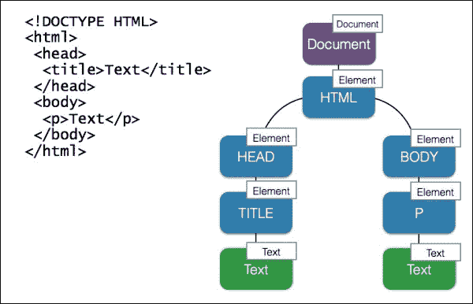

# 三、DOM 脚本和 AJAX

当涉及到**文档对象模型**（**DOM**）操作和 AJAX 时，第一反应可能是使用 jQuery 或 Zepta。但当浏览器提供您所需的一切时，您是否会为常见任务加载一个重要的第三方库？有些人使用 jQuery 来实现跨浏览器兼容性。众所周知，该库修复了*损坏的 DOM API*。当我们支持像 IE7 这样古老的浏览器时，这真的很有帮助。然而，今天我们几乎不需要关心旧式浏览器，因为它们的使用率低于 0.1%（[http://www.w3schools.com/browsers/browsers_explorer.asp](http://www.w3schools.com/browsers/browsers_explorer.asp) 。现代浏览器在支持 Web API 方面相当一致。总的来说，跨浏览器兼容性不再是一个问题。

第二个也是最常见的借口是，该库简化了查询和操作 DOM 所需编写的代码量。它确实在某种程度上简化了代码，但缺点是现在我们有一代开发人员不懂 JavaScript 和 WebAPI，只懂 jQuery。他们中的许多人无法解决没有库的简单任务，也不知道调用库方法时实际发生了什么。好的代码意味着可移植性和高性能。如果不了解本机 API，就很难实现这一点。

因此，在本章中，我们将研究处理 DOM 和 AJAX 的本机方法，重点关注高性能。

本章将涵盖以下主题：

*   高速 DOM 操作
*   与服务器的通信

# 高速 DOM 操作

为了有效地处理 DOM，我们需要了解它的本质。DOM 是一种树结构，表示在浏览器中打开的文档。DOM 的每个元素都是一个称为节点的对象。



作为对象的每个节点都有属性和方法（[https://developer.mozilla.org/en/docs/Web/API/Node](https://developer.mozilla.org/en/docs/Web/API/Node) 。有不同类型的节点。在上图中，您可以看到文档节点、元素节点和文本节点。实际上，树还可能包含特定的节点类型，如注释节点、doctype 节点等。为了说明树中的关系，我们可以说 HTML 有两个子节点**头**和**体**，它们作为兄弟节点相互关联。显然，HTML 是头部和身体的父节点。我们可以使用这些可通过节点属性访问的关系在树中导航：

```js
var html = document.documentElement;
console.log( html.nodeName ); // HTML

var head = html.childNodes[0];
console.log( head.nodeName );  // HEAD
console.log( head.parentNode === html );  // true
```

这一部分很清楚，但如果我们要求下一个兄弟姐妹是头而不是身体。我们将得到一个内容中带有空格的文本节点（`nodeValue`：

```js
var sibling = head.nextSibling;
// the same as html.childNodes[1]
console.log( sibling.nodeName ); // #text
console.dir( sibling.nodeValue ); // "\n  "
```

在 HTML 中，我们通常使用空格、制表符和换行符来分隔元素，以提高可读性，这些元素也构成 DOM 的一部分。因此，为了访问元素，我们使用文档和元素方法。

## 穿越 DOM

当然，您知道如何通过 ID（`document.getElementById`）或标记名（`document.getElementsByTagName`来查找元素。您还可以通过 CSS 选择器（`document.querySelector`搜索元素）：

```js
<article id="bar">
  <h2>Lorem ipsum</h2>
</article>
var article = document.querySelector( "#bar" ),
      heading = article.querySelector( "h2" );
```

选择器由一个或多个类型（标记）选择器、类选择器、ID 选择器、属性选择器或伪类/元素选择器（[生成 http://www.w3.org/TR/CSS21/selector.html%23id-选择器](http://www.w3.org/TR/CSS21/selector.html%23id-selectors)。考虑到组合（以匹配组、后代或兄弟姐妹），这提供了许多可能的选择。因此，很难选择从 JavaScript 绑定 HTML 元素的策略。我的建议是始终使用`data-*`属性选择器：

```js
<article data-bind="bar">
  <h2 data-bind="heading">Lorem ipsum</h2>
</article>

var article = document.querySelector( "[data-bind=\"bar\"]" ),
      heading = article.querySelector( "[data-bind=\"heading\"]" );
```

这样我们就独立于 HTML 结构。例如，如果我们为了更好的语义而更改标记，那么 JavaScript 端就不会出现任何问题。我们独立于 CSS 类，这意味着我们可以安全地重构 CSS。我们不受 ID 的限制，每个文档的 ID 应该是唯一的。

当`querySelector`获取 DOM 中的第一个元素以匹配选择器时，`querySelectorAll`检索所有元素：

```js
<ul data-bind="bar">
  <li data-bind="item">Lorem ipsum</li>
  <li data-bind="item">Lorem ipsum</li>
  <li data-bind="item">Lorem ipsum</li>
</ul>

var ul = document.querySelector( "[data-bind=\"bar\"]" ),
      lis = ul.querySelectorAll( "[data-bind=\"item\"]" );
console.log( lis.length );
```

找到的元素表示为`NodeList`。它看起来像一个数组，但不是。它是一个实时收集，每次 DOM 回流都会更新它。考虑下面的例子：

```js
var divs = document.querySelectorAll( "div" ), i; 
for ( i = 0; i < divs.length; i++ ) { 
  document.appendChild( document.createElement( "div" ) ); 
}
```

前面的代码导致了一个无限循环，因为每当我们访问集合的下一个元素时，一个新元素被追加到集合中，`divs.length`递增，并且我们从不满足循环条件。

重要的是要知道，通过一个实时集合（`NodeList`、`HTMLCollection`进行的迭代是缓慢的，而且资源相当昂贵。如果您不需要它是实时的，只需将集合转换为一个数组，如[第 1 章](1.html#DB7S2-f4ff6b81796e4f78aa983a623fb95daf "Chapter 1. Diving into the JavaScript Core")、*跳入 JavaScript 核心*中所述的`[].slice.call( nodeList )`。在 ES6 中，这可以通过`[...nodeList]spread`操作员完成：

```js
var ul = document.querySelector( "[data-bind=\"bar\"]" ),
      lis = ul.querySelectorAll( "[data-bind=\"item\"]" );
console.log( [].slice.call( lis ) ); // into array ES5 way
console.log( [ ...lis ] ); // into array ES6 way
```

除了查询，我们还可以测试找到的元素是否与给定选择器匹配：

```js
console.log( el.matches( ".foo > .bar" ) );
console.log( input.matches( ":checked" ) );
```

## 改变 DOM

现在我们知道了如何在 DOM 中查找元素。让我们看看如何在 DOM 树中动态地插入新元素。有不同的方法。我们可以简单地用`el.innerHTML`方法设置新的 HTML 内容：

```js
var target = document.getElementById( "target" );
target.innerHTML = "<div></div>";
```

否则，我们可以创建一个节点（`document.createElement`），并将其注入 DOM（`el.appendChild`）：

```js
var target = document.getElementById( "target" ),
      div = document.createElement( "div" ),
target.appendChild( div );
```

在这里，您应该记住，每次更改`el.innerHTML`或将子元素附加到元素时，都会导致 DOM 回流。当这种情况在循环中重复发生时，可能会降低应用的速度。

当我们通过`el.innerHTML`传递 HTML时，浏览器首先必须解析字符串。这是一个消耗资源的操作。但是，如果我们显式地创建元素，这将快得多。如果我们生产一批类似的元件，流程可以进一步优化。我们可以克隆最初创建的元素（`el.cloneNode`），而不是创建循环中的每个元素，这要快得多：

```js
var target = document.getElementById( "target" ),
    /**
     * Create a complex element
     * @returns {Node}
     */
    createNewElement = function(){
      var div = document.createElement( "div" ),
          span = document.createElement( "span" );
      span.appendChild( document.createTextNode( "Bar" ) );
      div.appendChild( span );
      return div;
    },
    el;

el = createNewElement();
// loop begins
target.appendChild( el.cloneNode( true ) );
// loop ends
```

另一方面，我们可以创建一个文档片段（`document.createDocumentFragment`），并在循环期间将创建的节点附加到片段中。文档片段是一种虚拟 DOM，我们操纵它而不是真实的 DOM。完成后，我们可以将文档片段作为一个分支注入到真正的 DOM 中。通过将这项技术与克隆技术相结合，我们应该在性能方面有所提高。实际上，这是不确定的（[http://codepen.io/dsheiko/pen/vObVOR](http://codepen.io/dsheiko/pen/vObVOR) ）。例如，在 WebKit 浏览器中，虚拟 DOM（`document.createDocumentFragment`）的运行速度比真实 DOM 慢。

正如我们在性能方面所做的那样，让我们关注准确性。如果我们需要将元素注入到精确的位置（例如，`foo`和`bar`节点之间），`el.appendChild`不是正确的方法。我们必须使用`el.insertBefore`：

```js
parent.insertBefore(el, parent.firstChild);
```

要从 DOM 中删除特定元素，我们需要执行以下技巧：

```js
el.parentNode.removeChild(el);
```

此外，我们可以重新加载一个元素，例如重置所有订阅的侦听器：

```js
function reload( el ) {
    var elClone = el.cloneNode( true );
    el.parentNode && el.parentNode.replaceChild( elClone, el );
 }
```

## 设计 DOM 的样式

说到样式，我们必须尽可能使用 CSS 类。这提供了更好的可维护性继承、组合和关注点分离。您肯定知道如何通过`el.className`属性将预期的类分配给元素。然而，在现实世界中，`el.classList`对象更有用：

```js
el.classList.add( "is-hidden" );
el.classList.remove( "is-hidden" );
var isAvailable = true;
el.classList.toggle("is-hidden", !isAvailable );
if ( el.classList.contains( "is-hidden" ) ){}
```

在这里，除了明显的 add/remove/contains 方法外，我们还使用了`toggle`。此方法根据作为第二个参数传递的布尔值添加或删除指定的类。

有时我们需要显式地操纵样式。DOM 的一部分称为**CSS 对象模型**（**CSSOM**）提供了一个操作 CSS 的接口。因此，我们可以使用`el.style`属性读取或设置元素的动态样式信息：

```js
el.style.color = "red";
el.style.fontFamily = "Arial";
el.style.fontSize = "1.2rem";
```

一种鲜为人知的技术是更改样式规则的实际文本：

```js
el.style.cssText = "color:red;font-family: Arial;font-size: 1.2rem;";
```

如您所见，第二种方法没有那么灵活。您不能更改或访问单个声明，只能更改或访问整个规则。但是，这种方式的设计速度要快得多（[http://codepen.io/dsheiko/pen/qdvWZj](http://codepen.io/dsheiko/pen/qdvWZj) ）。

当`el.style`包含元素的显式样式时，`window.getComputedStyle`返回继承（计算）的样式：

```js
var el = document.querySelector( "h1" ),
    /**
     * window.getComputedStyle
     * @param {HTMLElement} el
     * @param {String} pseudo - pseudo-element selector or null 
     * for regular elements
     * @return {CSSStyleDeclaration}
     */
    css = window.getComputedStyle( el, null );
console.log( css.getPropertyValue( "font-family" ) );
```

我们刚才检查的案例涉及内联样式。事实上，我们也可以访问外部或内部样式表：

```js
<style type="text/css">
.foo {
 color: red;
}
</style>
<div class="foo">foo</div>
<script type="text/javascript">
var stylesheet = document.styleSheets[ 0 ];
stylesheet.cssRules[ 0 ].style.color = "red";
// or
// stylesheet.cssRules[ 0 ].style.cssText = "color: red;";
</script>
```

我们为什么要这样做？有一些特殊情况。例如，如果我们想要修改，比如说，伪元素样式，我们必须涉及样式表：

```js
var stylesheet = document.styleSheets[ 0 ];
stylesheet.addRule( ".foo::before", "color: green" );
// or
stylesheet.insertRule( ".foo::before { color: green }", 0 );
```

## 利用属性和属性

HTML 元素具有属性，我们可以从JavaScript 访问它们：

```js
el.setAttribute( "tabindex", "-1" );
if ( el.hasAttribute( "tabindex" ) ) {}
el.getAttribute( "tabindex" );
el.removeAttribute( "tabindex" );
```

元素属性由 HTML 定义，属性由 DOM 定义。这就不同了。例如，如果您有一个输入，那么最初属性和属性（`el.value`）都具有相同的值。但是，当用户或脚本更改值时，属性不受影响，但属性为：

```js
// attribute
console.log( input.getAttribute( "value" ) );
// property
console.log( input.value );
```

您可能知道，除了全局属性之外，还有一种特殊类型的自定义数据属性。这些属性旨在提供 HTML 与其 DOM 表示之间的专有信息交换，后者由脚本使用。一般的想法是定义一个自定义属性，如`data-foo`并为其设置一个值。然后从脚本中，我们使用`el.dataset`对象访问并更改属性：

```js
console.log( el.dataset.foo ); 
el.dataset.foo = "foo";
```

如果定义多部分属性，如`data-foo-bar-baz`，则对应的`dataset`属性为`fooBarBaz`：

```js
console.log( el.dataset.fooBarBaz ); 
el.dataset.fooBarBaz = "foo-bar-baz";
```

## 处理 DOM 事件

浏览器中会发生大量事件。它可以是设备事件（例如，设备改变位置或方向）、窗口事件（例如，窗口大小）、进程（例如，页面加载）、媒体事件（例如，视频暂停）、网络事件（连接状态改变），当然还有用户交互事件（点击、键盘、鼠标和触摸）。我们可以让代码侦听这些事件，并在事件发生时调用订阅的处理程序函数。为了订阅 DOM 元素上的事件，我们使用`addEventListener`方法：

```js
EventTarget.addEventListener( <event-name>, <callback>, <useCapture> );
```

在前面的代码中，`EventTarget`可以是窗口、文档、元素或其他对象，如`XMLHttpRequest`。

`useCapture`是一个布尔值，您可以通过它指定希望事件传播的方式。例如，用户单击表单中的按钮，我们为该单击事件订阅了两个元素的处理程序。当`useCapture`为`true`时，首先调用表单元素（`ancestor`）的处理程序（`capturing flow`。否则，表单处理程序将在按钮的处理程序（`bubbling flow`之后调用。

`callback`是在事件触发时调用的函数。它将`Event`对象作为参数接收，该参数具有以下属性：

*   `Event.type`：这是活动的名称
*   `Event.target`：事件发生的事件目标
*   `Event.currentTarget`：这是侦听器所附加到的事件目标（`target`和`currentTarget`在[中提到的将同一事件处理程序附加到多个元素时可能会有所不同）https://developer.mozilla.org/en-US/docs/Web/API/Event/currentTarget](https://developer.mozilla.org/en-US/docs/Web/API/Event/currentTarget)
*   `Event.eventPhase`：这表示正在评估事件流的哪个阶段（无、捕获、目标或冒泡）
*   `Event.bubbles`：表示事件是否为冒泡事件
*   `Event.cancelable`：表示是否可以阻止事件的默认动作
*   `Event.timeStamp`：指定事件发生的时间

事件还有以下方法：

*   `Event.stopPropagation()`：这将阻止事件的进一步传播。
*   `Event.stopImmediatePropagation()`：如果我们有多个监听器订阅了同一个事件目标，那么调用此方法后，将不会调用剩余的监听器。
*   `Event.preventDefault()`：这将阻止默认操作。例如，如果它是 submit 类型按钮上的单击事件，则通过调用此方法，我们可以防止它自动提交表单。

现在让我们在实践中尝试一下：

```js
<form action="/">
<button type="submit">Click me</button>
</form>
<script>
var btn = document.querySelector( "button" )
    onClick = function( e ){
      e.preventDefault(); 
      console.log( e.target );
    };
btn.addEventListener( "click", onClick, false );
</script>
```

在这里，我们订阅了一个`onClick`监听器，用于按钮元素上的点击事件。单击按钮时，它会在 JavaScript 控制台中显示未提交表单的按钮元素。

如果我们想订阅键盘事件，可以按如下方式执行：

```js
addEventListener( "keydown", function( e ){
    var key = parseInt( e.key || e.keyCode, 10 );
     // Ctrl-Shift-i
    if ( e.ctrlKey && e.shiftKey && key === 73 ) {
      e.preventDefault();
      alert( "Ctrl-Shift-L pressed" );
    }
  }, false );
```

流程事件最常见的例子是文档就绪状态更改。我们可以收听`DOMContentLoaded`或`load`事件。当文档完全加载和解析后，将触发第一个。第二个还等待样式表、图像和子帧完成加载。这里有一个怪癖。我们必须检查`readyState`，因为如果我们在事件可能被触发后向其注册侦听器，则永远不会调用回调：

```js
function ready( cb ) {
  if ( document.readyState !== "loading" ){
    cb();
  } else {
    document.addEventListener( "DOMContentLoaded", cb );
  }
}
```

嗯，我们知道如何使用`EventTarget.addEventListener`方法订阅 DOM 事件。`EventTarget`对象也有一个从侦听器取消订阅的方法。例如，请参见以下内容：

```js
btn.removeEventListener( "click", onClick );
```

如果我们想要触发一个 DOM 事件，例如模拟一个按钮点击，我们必须创建一个新的`Event`对象，设置它，并在我们想要触发事件时对元素进行调度：

```js
var btn = document.querySelector( "button" ),
    // Create Event object
    event = document.createEvent( "HTMLEvents" );
// Initialize a custom event that bubbles up and cannot be canceled 

event.initEvent( "click", true, false );
// Dispatch the event
btn.dispatchEvent( event );
```

同样，我们可以创建我们的自定义事件：

```js
var btn = document.querySelector( "button" ),
    // Create Event object
    event = document.createEvent( "CustomEvent" );
// Subscribe to the event 
btn.addEventListener("my-event", function( e ){
  console.dir( e );
});
// Initialize a custom event that bubbles up and cannot be canceled 
event.initEvent( "my-event", true, false );
// Dispatch the event
btn.dispatchEvent( event );
```

# 与服务器通信

许多人使用第三方库向服务器发出任何请求。但我们需要这些图书馆吗？让我们在以下内容中研究如何在本机上使用 AJAX，以及下一个通信 API 是什么。

## XHR

**XMLHttpRequest**（**XHR**是 JavaScript 中的主 API，用于客户端和服务器之间的数据交换。XHR 是微软在 IE5 中通过 ActiveX（1999）首次提出的，在 IE 浏览器中有专有语法，直到版本 7（2006）。这导致了兼容性问题，从而催生了*AJAX 库*的兴起，如 Prototype 和 jQuery。如今，对 XHR 的支持在所有主流浏览器中都是一致的。通常，要执行 HTML 或 HTTPS 请求，我们必须执行许多任务。我们创建一个 XHR 实例，通过 open 方法初始化请求，向侦听器订阅请求相关事件，设置请求头（`setRequestHeader`，最终调用 send 方法：

```js
var xhr = new XMLHttpRequest();
xhr.open( "GET", "http://www.telize.com/jsonip?callback=0", true );
xhr.onload = function() {
      if ( this.status === 200 ) {
        return console.log( this.response );
      }
    };

xhr.responseType = "json";
xhr.setRequestHeader( "Content-Type", "application/x-www-form-urlencoded" );
xhr.send( null );
```

更多选项可用。例如，我们可以利用`progress`和`abort`事件来控制文件上传（[https://developer.mozilla.org/en-US/docs/Web/API/XMLHttpRequest/Using_XMLHttpRequest](https://developer.mozilla.org/en-US/docs/Web/API/XMLHttpRequest/Using_XMLHttpRequest) ）。

我突然想到，对于一个简单的调用，这个接口过于复杂了。在互联网上有大量的XHR 包装器实现。最流行的实现之一可以在[中找到 https://github.com/Raynos/xhr](https://github.com/Raynos/xhr) 。它使 XHR 的使用变得非常简单：

```js
xhr({
  uri: "http://www.telize.com/jsonip",
  headers: {
    "Content-Type": "application/json"
  }
}, function ( err, resp ) {
  console.log( resp );
})
```

此外，该库还提供了一个模拟对象，可用于替换单元测试中的真实 XHR。

## 获取 API

我们刚刚检查了 XHRAPI。15 年前看起来还不错，但现在看起来很笨拙。我们必须使用包装纸使其更友好。幸运的是，这种语言已经进化，现在我们有了一种新的内置方法，称为 fetchapi。试想一下，用它打电话是多么容易：

```js
fetch( "/rest/foo" ).then(function( response ) {
  // Convert to JSON
  return response.json();
}).catch(function( err ) {
  console.error( err );
});
```

尽管表面上很简单，但 API 非常强大。`fetch`方法在第一个强制参数中需要一个带远程方法 URL 的字符串或一个`Request`对象。请求选项可以在第二个可选参数中传递：

```js
fetch( "/rest/foo", {
  headers: {
    "Accept": "application/json",
    "Content-Type": "application/json"
  }
});
```

与前面的代码片段类似，fetch 方法返回**Promise**。承诺正在成为异步或延迟操作的常见做法。在 Promise Completed 事件（请参见 then）上调用的函数接收一个`Response`对象。此函数有许多属性和方法（[https://developer.mozilla.org/en-US/docs/Web/API/Response](https://developer.mozilla.org/en-US/docs/Web/API/Response) 。因此，我们可以使用相应的方法将响应转换为 JSON、文本、blob 或流，并获得请求相关信息：

```js
console.log( response.text() );
console.log( response.status );
console.log( response.statusText );
console.log( response.headers.get( "Content-Type" ) );
```

那么`POST`请求呢？Fetch 有一个名为`body`的 mixin，它代表`Response`/`Request`的主体。我们可以通过以下方式传递`POST`数据：

```js
var form = document.querySelector( "form[data-bind=foo]" ),
    inputEmail = form.querySelector( "[name=email]" ),
    inputPassword = form.querySelector( "[name=pwd]" );

fetch( "/feedback/submit", {
  method: "post",
  body: JSON.stringify({
    email: inputEmail.value,
    answer: inputPassword.value
  })
});
```

它不仅接受键值对，还接受例如`FormData`，因此您可以按原样提交整个表单，包括附件：

```js
var form = document.querySelector( "form[data-bind=foo]" );
fetch( "/feedback/submit", {
  method: "post",
  body: new FormData( form )
});
```

目前，一些主要浏览器（例如 IE/Edge、Safari）不支持此 API。但是，如果您打算使用Fetch API，您可以使用Fetch polyfill（[https://github.com/github/fetch](https://github.com/github/fetch) ）。

# 总结

在过去，每个浏览器的供应商都有定制的 DOM 实现，这些实现在很大程度上是不兼容的。然而，这已经改变了，我们已经在浏览器中很好地支持 W3CDOM 至少十年了。今天，我们可以安全地使用 JavaScript 本机 API 来访问、操作和设置 DOM 的样式。

在 JavaScript 中，XHR 仍然是客户端和服务器之间通信的主要 API。不过，它对开发人员不太友好。因此，我们通常为它编写自定义包装。

然而，一个名为 Fetch 的新 API 已经被提出并在 Chrome、Firefox 和 Opera 中实现。这个新的 API 更易于使用，与 XHR 相比，它提供了更令人印象深刻、更灵活的特性。