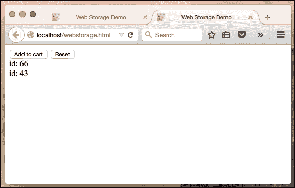
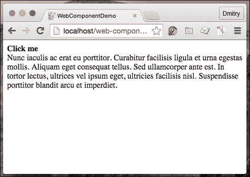
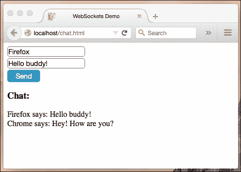
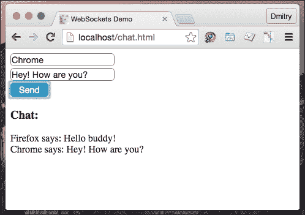

# 四、HTML5 API

虽然语言规范（**ECMA-262**几年内会发生一次变化，但新的 HTML5 API 几乎在每次浏览器更新时都会潜入到语言中。已经可用的 API 相当多。然而，在本章中，我们将重点讨论那些用于重新考虑整个开发过程的方法。我们将学习如何从使用 web workers 的多线程中获益，如何使用可重用的独立 web 组件构建应用，如何在客户端存储和搜索大量数据，以及如何与服务器建立双向通信。

在本章中，我们将介绍以下主题：

*   在 web 浏览器中存储数据
*   使用 JavaScript 工作者提高性能
*   创建我们的第一个 web 组件
*   学习使用服务器到浏览器的通信通道

# 在 web 浏览器中存储数据

在 HTML5 的特性中，有几个用于在客户端存储数据的：Web 存储、IndexedDB 和文件系统 API。当发生以下情况时，我们将受益于这些技术：

*   我们希望缓存客户端数据，使它们无需额外的 HTTP 请求即可获取
*   我们在 web 应用中有大量的本地数据，我们希望我们的应用能够脱机工作

让我们来看看这些技术。

## Web 存储 API

过去，我们只有机制来保持应用状态，它使用**HTTP cookies**。除了不友好的 API，Cookie 还有一些缺陷。它们的最大大小通常约为 4KB。因此，我们根本无法存储任何适当数量的数据。当应用状态在不同选项卡中更改时，Cookie 并不适合。Cookie 易受**跨站点脚本**攻击。

现在我们有了一个名为**Web 存储**的高级 API。它提供了更大的存储容量（5-25 MB，具体取决于浏览器），并且不会将任何数据附加到 HTTP 请求头。有两个 JavaScript 内置对象实现此接口：**本地存储**和**会话存储**。第一个用作持久数据存储，第二个用于在会话期间保存数据。

存储 API 使用非常简单，如下所示：

```js
var storage = isPersistent ? localStorage : sessionStorage;
storage.setItem( "foo", "Foo" );
console.log( storage.getItem( "foo" ) );
storage.removeItem( "foo" );
```

或者，为了方便起见，我们可以使用 getter/setter，如下所示：

```js
storage.foo = "Foo";
console.log( storage.foo );
delete storage.foo;
```

如果我们想遍历存储，我们可以使用`storage.length`和`storage.key()`：

```js
var i = 0, len = storage.length, key;
for( ; i < len; i++ ) {
  key = storage.key( i );
  storage.getItem( key );
}
```

如您所见，与 cookie 相比，Web 存储 API 对开发人员更加友好。它也更强大。我们需要存储的最常见的现实生活示例之一是购物车。在设计应用时，我们必须记住，用户在做出选择时，通常会在多个选项卡或窗口中打开包含产品详细信息的页面。因此，我们应该注意跨所有打开的页面的存储同步。

幸运的是，每当我们更新 localStorage 时，`storage`事件就会在 window 对象上触发。因此，我们可以订阅此事件的处理程序，以使用实际数据更新购物车。说明此示例的简单代码可能如下所示：

```js
<html>
  <head>
    <title>Web Storage</title>
  </head>
  <body>
    <div>
      <button data-bind="btn">Add to cart</button>
      <button data-bind="reset">Reset</button>
    </div>
    <output data-bind="output">

    </output>
    <script>

    var output = document.querySelector( "[data-bind=\"output\"]" ),
        btn = document.querySelector( "[data-bind=\"btn\"]" ),
        reset = document.querySelector( "[data-bind=\"reset\"]" ),
        storage = localStorage,
       /**
        * Read from the storage
        * @return {Arrays}
        */
        get = function(){
           // From the storage we receive either JSON string or null
           return JSON.parse( storage.getItem( "cart" ) ) || [];
        },
        /**
         * Append an item to the cart
         * @param {Object} product
         */
        append = function( product ) {
          var data = get();
          data.push( product );
          // WebStorage accepts simple objects, so we pack the object into JSON string         storage.setItem( "cart", JSON.stringify( data ) );
        },
        /** Re-render list of items */
        updateView = function(){
          var data = get();
          output.innerHTML = "";
          data && data.forEach(function( item ){
            output.innerHTML += [ "id: ", item.id, "<br />" ].join( "" );
          });
        };

    this.btn.addEventListener( "click", function(){
      append({ id: Math.floor(( Math.random() * 100 ) + 1 ) });
      updateView();
    }, false );

    this.reset.addEventListener( "click", function(){
      storage.clear();
      updateView();
    }, false );

    // Update item list when a new item is added in another window/tab
    window.addEventListener( "storage", updateView, false );

    updateView();

    </script>
  </body>
</html>
```

要看到这一点，我们必须在两个或多个选项卡中打开代码 HTML。现在，当我们点击**添加到购物车**按钮时，我们会在每个选项卡中更新订购物品的列表。您可能已经注意到，我们也可以通过点击**重置**按钮来清理购物车。这将调用`storage.clear`方法并清空列表。如果您想在这里使用 sessionStorage 而不是 localStorage，我必须警告您这行不通。sessionStorage 对于每个选项卡或窗口都是隔离的，因此我们无法通过这种方式进行通信。

然而，如果我们在不同的框架中加载页面，但是在同一个窗口中加载页面，我们可以使用 sessionStorage 运行这个示例。以下屏幕截图是购物车应用运行的一个示例：



## IndexedDB

当我们必须存储相当小的数据量（兆字节）时，Web 存储可以很好地发挥作用。但是，如果我们需要更多的结构化数据，并且希望使用索引对这些数据进行性能搜索，那么我们将使用 IndexedDB API。API 将数据存储在浏览器中的数据库中的想法并不新鲜。几年前，谷歌及其合作伙伴积极倡导一种称为**Web SQL 数据库**的标准候选者。但该规范未能通过 W3C 推荐。现在，我们有了 IndexedDB API，它已经得到了广泛的支持，并提供了显著的性能提升（异步 API 和索引键带来的健壮搜索）。

然而，IndexedDB 的 API 相当复杂。由于存在大量嵌套回调，因此也很难读取：

```js
/**
 * @type {IDBOpenDBRequest}
 * Syntax: indexedDB.open( DB name, DB version );
 */
var request = indexedDB.open( "Cem", 2 );

/** Report error */
request.onerror = function() {
  alert( "Opps, something went wrong" );
};
/**
 * Create DB
 * @param {Event} e
 */
request.onupgradeneeded = function ( e ) {
  var objectStore;
  if ( e.oldVersion ) {
    return;
  }
  // define schema
  objectStore = e.currentTarget.result.createObjectStore( "employees", { keyPath: "email" });
  objectStore.createIndex( "name", "name", { unique: false } );
   // Populate objectStore with test data
  objectStore.add({ name: "John Dow", email: "john@company.com" });
  objectStore.add({ name: "Don Dow", email: "don@company.com" });
};
/**
 * Find a row from the DB
 * @param {Event} e
 */
request.onsuccess = function( e ) {
  var db = e.target.result,
      req = db.transaction([ "employees" ]).objectStore( "employees" ).get( "don@company.com" );

  req.onsuccess = function() {
    console.log( "Employee matching `don@company.com` is `" + req.result.name + "`" );
  };
};
```

在这个示例中，我们创建了一个打开 DB 的请求。如果数据库不存在或其版本更改，则触发`upgradeneeded`事件。在订阅此事件的函数中，我们可以通过声明对象存储及其索引来定义模式。因此，如果我们需要更新现有数据库的模式，我们可以增加版本号，`upgradeneeded`将再次触发，并调用侦听器更新模式。一旦定义了模式，我们就可以用样本数据填充对象存储。当打开数据库的请求完成时，我们请求与电子邮件 ID`don@company.com`匹配的记录。请求完成后，我们进入控制台：

```js
Employee matching 'don@company.com` is `Don Dow'
```

很纠结，不是吗？这个 API 让我想到了包装器。我所知道的最好的名字叫**德西**（[http://www.dexie.org](http://www.dexie.org) ）。只需将解决同一个任务与它公开的接口进行比较即可：

```js
<script src="./Dexie.js"></script>
<script>
var db = new Dexie( "Cem" );
// Define DB
db.version( 3 )
  .stores({ employees: "name, email" });

// Open the database
db.open().catch(function( err ){
  alert( "Opps, something went wrong: " + err );
});

// Populate objectStore with test data
db.employees.add({ name: "John Dow", email: "john@company.com" });
db.employees.add({ name: "Don Dow", email: "don@company.com" });

// Find an employee by email
db.employees
  .where( "email" )
  .equals( "don@company.com" )
  .each(function( employee ){
    console.log( "Employee matching `don@company.com` is `" + employee.name + "`" );
  });

</script>
```

## 文件系统 API

在 web应用中，我们可以使用 web 存储存储键值对，我们可以创建和使用 IndexedDB。有些东西还没找到。桌面应用可以读取和写入文件和目录。这正是我们在能够脱机运行的 web 应用中经常需要的。文件系统 API 允许我们在应用范围内创建、读取和写入用户的本地文件系统。让我们举一个例子：

```js
window.requestFileSystem  = window.requestFileSystem || window.webkitRequestFileSystem;
    /**
     * Read file from a given FileSystem
     * @param {DOMFileSystem} fs
     * @param {String} file
     */
var readFile = function( fs, file ) {
      console.log( "Reading file " + file );
      // Obtain FileEntry object
      fs.root.getFile( file, {}, function( fileEntry ) {
        fileEntry.file(function( file ){
           // Create FileReader
           var reader = new FileReader();
           reader.onloadend = function() {
             console.log( "Fetched content: ", this.result );
           };
           // Read file
           reader.readAsText( file );
        }, console.error );
      }, console.error );
    },
    /**
     * Save file into a given FileSystem and run onDone when ready
     * @param {DOMFileSystem} fs
     * @param {String} file
     * @param {Function} onDone
     */
    saveFile = function( fs, file, onDone ) {
      console.log( "Writing file " + file );
      // Obtain FileEntry object
      fs.root.getFile( file, { create: true }, function( fileEntry ) {
        // Create a FileWriter object for the FileEntry
        fileEntry.createWriter(function( fileWriter ) {
          var blob;
          fileWriter.onwriteend = onDone;
          fileWriter.onerror = function(e) {
            console.error( "Writing error: " + e.toString() );
          };
          // Create a new Blob out of the text we want into the file.
          blob = new Blob([ "Lorem Ipsum" ], { type: "text/plain" });
          // Write into the file
          fileWriter.write( blob );
        }, console.error );
      }, console.error );
    },
    /**
     * Run when FileSystem initialized
     * @param {DOMFileSystem} fs
     */
    onInitFs = function ( fs ) {
      const FILENAME = "log.txt";
      console.log( "Opening file system: " + fs.name );
      saveFile( fs, FILENAME, function(){
        readFile( fs, FILENAME );
      });
    };

window.requestFileSystem( window.TEMPORARY, 5*1024*1024 /*5MB*/, onInitFs, console.error );
```

首先，我们请求一个本地文件系统（`requestFileSystem`，它被沙箱存储到应用中。对于第一个参数，我们说明文件系统是否应该是持久的。通过在参数中传递`window.TEMPORARY`，我们允许浏览器自动删除数据（例如，当需要更多空间时）。如果我们使用`window.PERSISTENT`，我们确定在没有明确的用户确认的情况下无法清理数据。第二个参数指定我们可以为文件系统分配多少空间。然后是`onSuccess`和`onError`回调。创建文件系统时，我们会收到对`FileSystem`对象的引用。此对象具有`fs.root`属性，其中该对象将`DirectoryEntry`绑定到根文件系统目录。`DirectoryEntry`对象具有`DirectoryEntry.getDirectory`、`DirectoryEntry.getFile`、`DirectoryEntry.removeRecursevly`和`DirectoryEntry.createReader`方法。在前面的示例中，我们写入当前（`root`目录，因此我们只需使用`DirectoryEntry.getFile`打开一个给定名称的文件。成功打开文件后，我们将收到表示打开文件的`FileEntry`。对象有几个属性，如：`FileEntry.fullPath`、`FileEntry.isDirectory`、`FileEntry.isFile`、`FileEntry.name`和方法，如`FileEntry.file`和`FileEntry.createWriter`。第一个方法返回`File`对象，该对象可用于读取文件内容，第二个方法用于写入文件。当操作完成时，我们从文件中读取。为此，我们创建了一个`FileReader`对象，并让它以文本的形式读取`File`对象。

# 使用 JavaScript 工作人员提高性能

JavaScript 是一个单线程环境。因此，多个脚本不能同时运行。是的，我们使用`setTimeout()`、`setInterval()`、`XMLHttpRequest`和事件处理程序异步运行任务。所以我们获得了非阻塞执行，但这并不意味着并发。但是，使用 web workers，我们可以在后台独立于 UI 脚本运行一个或多个脚本。Web Worker 是长时间运行的脚本，不会因阻止 UI 事件而中断。Web 工作者利用多线程，因此我们可以从多核 CPU 中获益。

那么，我们在哪里可以使用网络工作者呢？任何我们进行处理器密集型计算并且不希望它们阻塞 UI 线程的地方。它可以是图形、web 游戏、加密和 web I/O。我们不能直接从 web worker 操作 DOM，但我们可以访问`XMLHttpRequest`、web 存储、IndexedDB、文件系统 API、web 套接字和其他功能。

那么让我们看看这些网络工作者在实践中做了什么。大体上，我们在主脚本中注册了一个现有的 web worker，并使用PostMessage API（[与 web worker 通信 https://developer.mozilla.org/en-US/docs/Web/API/Window/postMessage](https://developer.mozilla.org/en-US/docs/Web/API/Window/postMessage) ：

```js
index.html
<html>
  <body>
<script>
"use strict";
// Register worker
var worker = new Worker( "./foo-worker.js" );
// Subscribe for worker messages
worker.addEventListener( "message", function( e ) {
  console.log( "Result: ", e.data );
}, false );
console.log( "Starting the task..." );
// Send a message to worker
worker.postMessage({
  command: "loadCpu",
  value: 2000
});
</script>
  </body>
</html>
foo-worker.js
"use strict";
var commands = {
  /**
   * Emulate resource-consuming operation
   * @param {Number} delay in ms
   */
  loadCpu: function( delay ) {
    var start = Date.now();
    while (( Date.now() - start ) < delay );
    return "done";
  }
};
// Workers don't have access to the window object. // To access global object we have to use self object instead.
self.addEventListener( "message", function( e ) {
  var command;
  if ( commands.hasOwnProperty( e.data.command ) ) {
    command = commands[ e.data.command ];
    return self.postMessage( command( e.data.value ) );
  }
  self.postMessage( "Error: Command not found" );

}, false );
```

在`index.html`中，我们请求 web工作者（`foo-worker.js`）订阅工作者消息，并请求其加载 CPU 2000 毫秒，这表示一个资源消耗过程。工作者接收消息并检查在`command`属性中指定的函数。如果存在，则工作者将消息值传递给函数，并使用返回值进行回复。

请注意，尽管通过启动`index.html`启动了如此昂贵的进程，但主线程仍保持非阻塞状态。尽管如此，当流程完成时，它会向控制台报告。但是如果您尝试在主脚本中运行`loadCpu`函数，UI 将冻结，很可能导致脚本超时错误。现在考虑一下：如果你异步调用 AutoT2A.（例如，用 Type T3^），UI 仍然会挂起。处理处理器敏感操作的唯一安全方法是将它们交给 web 工作人员。

网络工作者可以是专门的和共享的。只有通过脚本（我们称之为 worker 的脚本）才能访问专用的 worker。可以从多个脚本（甚至是在不同窗口中运行的脚本）访问共享工作进程。这使得这个 API 有点不同：

**index.html**

```js
<script>
"use strict";
var worker = new SharedWorker( "bar-worker.js" );
worker.port.onmessage = function( e ) {
  console.log( "Worker echoes: ", e.data );
};
worker.onerror = function( e ){
  console.error( "Error:", e.message );
};
worker.port.postMessage( "Hello worker" );
</script>
bar-worker.js
"use strict";
onconnect = function( e ) {
  var port = e.ports[ 0 ];
  port.onmessage = function( e ) {
    port.postMessage( e.data );
  };
  port.start();
};
```

前面的示例 worker 只是回显接收到的消息。如果工作人员执行一些有效的计算，我们将能够从不同页面上的不同脚本命令它。

这些示例展示了如何使用 web workers 进行并发计算。从一些 web I/O 操作中卸载主线程怎么样？例如，我们被要求向远程**商业智能服务器**（此处使用**BI 服务器**接收统计数据）报告指定的 UI 事件。这不是一个核心的功能，因此最好将这些请求产生的任何负载保留在主线程之外。所以我们可以使用网络工作者。但是，工作进程只有在加载后才可用。通常情况下，这种情况发生得非常快，但我仍然希望确保不会因为工作进程不可用而丢失 BI 事件。我能做的是将 web worker 代码嵌入 HTML 并通过数据 URI 注册 web worker：

```js
<script data-bind="biTracker" type="text/js-worker">
  "use strict";

  // Here shall go you BI endpoint
  const REST_METHOD = "http://www.telize.com/jsonip";
  /**
   * @param {Map} data - BI request params
   * @param {Function} resolve
   */
  var call = function( data, resolve ) {
    var xhr = new XMLHttpRequest(),
        params = data ? Object.keys( data ).map(function( key ){
            return key + "=" + encodeURIComponent( data[ key ] );
          }).join( "&" ) : "";

    xhr.open( "POST", REST_METHOD, true );
    xhr.addEventListener( "load", function() {
        if ( this.status >= 200 && this.status < 400 ) {
          return resolve( this.response );
        }
        console.error( "BI tracker - bad request " + this.status );
      }, false );
    xhr.addEventListener( "error", console.error, false );
    xhr.responseType = "json";
    xhr.setRequestHeader( "Content-Type", "application/x-www-form-urlencoded" );
    xhr.send( params );
  };
  /**
   * Subscribe to window.onmessage event
   */
  onmessage = function ( e ) {
    call( e.data, function( data ){
      // respond back
      postMessage( data );
    })
  };
</script>

<script type="text/javascript">
  "use strict";
  window.biTracker = (function(){
    var blob = new Blob([ document.querySelector( "[data-bind=\"biTracker\"]" ).textContent ], {
          type: "text/javascript"
        }),
        worker = new Worker( window.URL.createObjectURL( blob ) );

    worker.onmessage = function ( oEvent ) {
      console.info( "Bi-Tracker responds: ", oEvent.data );
    };
    return worker;
  }());
  // Let's test it
  window.biTracker.postMessage({ page: "#main" });
</script>
```

通过将web I/O 移交给工作人员，我们还可以对其进行额外控制。例如，在响应网络状态更改时（工作人员可以使用`ononline`和`onoffline`事件以及`navigator.online`属性），我们可以使用实际调用结果或缓存结果响应应用。换句话说，我们可以使应用脱机工作。事实上，有一些特殊类型的 JavaScript 工作者称为服务工作者。服务工作者继承自共享工作者，并充当web 应用和网络之间的代理（[https://developer.mozilla.org/en-US/docs/Mozilla/Projects/Social_API/Service_worker_API_reference](https://developer.mozilla.org/en-US/docs/Mozilla/Projects/Social_API/Service_worker_API_reference) 。

# 创建第一个 web 组件

您可能熟悉HTML5 视频元素（[http://www.w3.org/TR/html5/embedded-content-0.html#the-视频元素](http://www.w3.org/TR/html5/embedded-content-0.html#the-video-element)。通过在 HTML 中放置单个元素，您将获得一个运行视频的小部件。此元素接受许多属性来设置播放器。如果您想增强这一点，可以使用它的公共 API 并订阅其事件的侦听器（[http://www.w3.org/2010/05/video/mediaevents.html](http://www.w3.org/2010/05/video/mediaevents.html) ）。所以，每当我们需要一个播放器时，我们就重用这个元素，并且只为项目相关的外观定制它。只要我们有足够的这些元素，在每次需要页面上的小部件时都可以选择。然而，这不是将我们可能需要的任何小部件包含在 HTML 规范中的正确方法。但是，创建自定义元素（如视频）的 API 已经存在。我们真的可以定义一个元素，打包化合物（JavaScript、HTML、CSS、图像等等），然后从消费 HTML 链接它。换句话说，我们可以创建一个独立的、可重用的 web 组件，然后通过在 HTML 中放置相应的自定义元素（`<my-widget />`来使用它。我们可以重新设置元素的样式，如果需要，我们可以利用元素 API 和事件。例如，如果您需要一个日期选择器，您可以使用一个现有的 web 组件，比如说在[上可用的组件 http://component.kitchen/components/x-tag/datepicker](http://component.kitchen/components/x-tag/datepicker) 。我们只需下载组件源代码（例如，使用浏览器软件包管理器）并从 HTML 代码链接到组件：

```js
<link rel="import" href="bower_components/x-tag-datepicker/src/datepicker.js"> 
```

在 HTML 代码中声明组件：

```js
<x-datepicker name="2012-02-02"></x-datepicker>
```

这在最新版本的 Chrome 中应该可以顺利实现，但在其他浏览器中可能无法实现。运行 web 组件需要在客户端浏览器中解锁许多新技术，例如**自定义元素**、**HTML 导入**、**阴影 DOM**和模板。这些模板包括我们在[第 1 章](1.html#DB7S2-f4ff6b81796e4f78aa983a623fb95daf "Chapter 1. Diving into the JavaScript Core")中检查的 JavaScript 模板，*深入 JavaScript 核心*。自定义元素 API 允许我们定义新的 HTML 元素、它们的行为和属性。影子 DOM 封装了自定义元素所需的 DOM 子树。HTML 导入的支持假设用户代理通过给定的链接在页面上包含 HTML 来启用 web 组件。我们可以使用 polyfill（[http://webcomponents.org/](http://webcomponents.org/) 为确保在所有主要浏览器中支持所有必需的技术：

```js
<script src="./bower_components/webcomponentsjs/webcomponents.min.js"></script>
```

你喜欢写你自己的 web 组件吗？让我们做吧。我们的组件的行为类似于 HTML 的`details/summary`。当点击**摘要**时，会显示详细信息。所以我们创建了`x-details.html`，在这里我们将组件样式和 JavaScript 与组件 API 放在一起：

**x-details.html**

```js
<style>
  .x-details-summary {
    font-weight: bold;
    cursor: pointer;
  }
  .x-details-details {
    transition: opacity 0.2s ease-in-out, transform 0.2s ease-in-out;
    transform-origin: top left;
  }
  .x-details-hidden {
    opacity: 0;
    transform: scaleY(0);
  }
</style>
<script>
"use strict";
    /**
     * Object constructor representing x-details element
     * @param {Node} el
     */
var DetailsView = function( el ){
      this.el = el;
      this.initialize();
    },
    // Creates an object based in the HTML Element prototype
    element = Object.create( HTMLElement.prototype );
/** @lend DetailsView.prototype */
Object.assign( DetailsView.prototype, {
  /**
   * @constracts DetailsView
   */
  initialize: function(){
    this.summary = this.renderSummary();
    this.details = this.renderDetails();
    this.summary.addEventListener( "click", this.onClick.bind( this ), false );
    this.el.textContent = "";
    this.el.appendChild( this.summary );
    this.el.appendChild( this.details );
  },
  /**
   * Render summary element
   */
  renderSummary: function(){
    var div = document.createElement( "a" );
    div.className = "x-details-summary";
    div.textContent = this.el.dataset.summary;
    return div;
  },
  /**
   * Render details element
   */
  renderDetails: function(){
    var div = document.createElement( "div" );
    div.className = "x-details-details x-details-hidden";
    div.textContent = this.el.textContent;
    return div;
  },
  /**
   * Handle summary on click
   * @param {Event} e
   */
  onClick: function( e ){
    e.preventDefault();
    if ( this.details.classList.contains( "x-details-hidden" ) ) {
      return this.open();
    }
    this.close();
  },
  /**
   * Open details
   */
  open: function(){
    this.details.classList.toggle( "x-details-hidden", false );
  },
  /**
   * Close details
   */
  close: function(){
    this.details.classList.toggle( "x-details-hidden", true );
  }
});

// Fires when an instance of the element is created
element.createdCallback = function() {
  this.detailsView = new DetailsView( this );
};
// Expose method open
element.open = function(){
  this.detailsView.open();
};
// Expose method close
element.close = function(){
  this.detailsView.close();
};
// Register the custom element
document.registerElement( "x-details", {
  prototype: element
});
</script>
```

在 JavaScript代码中，我们基于一个通用 HTML 元素（`Object.create( HTMLElement.prototype )`创建了一个元素。在这里，如果需要，我们可以从复杂元素（例如视频）继承。我们注册了一个`x-details`自定义元素，使用早期创建的元素作为原型。通过`element.createdCallback`，我们订阅了一个处理程序，在创建自定义元素时将调用该处理程序。在这里，我们将我们的观点附加到元素上，以增强它的功能性。现在我们可以在 HTML 中使用该组件，如下所示：

```js
<!DOCTYPE html>
<html>
  <head>
    <title>X-DETAILS</title>
    <!-- Importing Web Component's Polyfill -->
    <!-- uncomment for non-Chrome browsers
    script src="./bower_components/webcomponentsjs/webcomponents.min.js"></script-->
    <!-- Importing Custom Elements -->
 <link rel="import" href="./x-details.html">
  </head>
  <body>
    <x-details data-summary="Click me">
      Nunc iaculis ac erat eu porttitor. Curabitur facilisis ligula et urna egestas mollis. Aliquam eget consequat tellus. Sed ullamcorper ante est. In tortor lectus, ultrices vel ipsum eget, ultricies facilisis nisl. Suspendisse porttitor blandit arcu et imperdiet.
    </x-details>
  </body>
</html>
```

运行中的 X-detailsweb 组件如下图所示：



# 学习使用服务器浏览通讯频道

使用 XHR 或 Fetch API，我们可以从服务器请求状态。这是一种单向沟通。如果我们想要实时通信，我们也需要相反的方向。例如，我们可能希望在数据库中相应的记录发生更改时立即弹出用户通知（您的帖子已被喜欢、新评论或新的私人消息）。服务器端连接到数据库，因此我们希望服务器通知客户端。过去，为了在客户机上接收这些事件，我们使用了在术语**COMET**（隐藏 iframe、长轮询、标记长轮询等）下已知的技巧。现在我们可以使用本机 JavaScript API。

## 服务器发送事件

提供订阅服务器端事件方式的技术是**服务器发送事件**（**SSE**API。在客户端上，我们注册一个服务器流（`EventSource`并订阅来自它的事件：

```js
var src = new EventSource( "./sse-server.php" );

src.addEventListener( "open", function() {
   console.log( "Connection opened" );
}, false);

src.addEventListener( "error", function( e ) {
  if ( e.readyState === EventSource.CLOSED ) {
    console.error( "Connection closed" );
  }
}, false );

src.addEventListener( "foo", function( e ) {
  var data = JSON.parse( e.data );
  console.log( "Received from the server:", data );
}, false);
```

在这里，我们订阅了一个名为`"foo"`的特定事件的侦听器。如果希望在每个服务器事件上调用回调，只需使用`src.onmessage`。对于服务器端，我们只需要设置 MIME 类型`text/event-stream`并发送事件负载块，并用成对的新行分隔：

```js
event: foo\n
data: { time: "date" }\n\n
```

SSE 通过 HTTP 连接工作，因此我们需要一个 web 服务器来创建流。PHP 相当简单，是一种广泛使用的服务器端语言。很可能您已经熟悉了它的语法。另一方面，PHP 不是为长时间的持久连接而设计的。然而，我们可以通过声明一个循环来欺骗它，使我们的 PHP 脚本永无止境：

```js
<?PHP
set_time_limit( 0 );
header("Content-Type: text/event-stream");
header("Cache-Control: no-cache");
date_default_timezone_set("Europe/Berlin");

function postMessage($event, $data){
  echo "event: {$event}", PHP_EOL;
  echo "data: ", json_encode($data, true), PHP_EOL, PHP_EOL;
  ob_end_flush();
  flush();
}
while (true) {
  postMessage("foo", array("time" => date("r")) );
  sleep(1);
}
```

您可能已经看到了SSE 示例，其中服务器脚本输出数据一次并终止进程（例如[http://www.html5rocks.com/en/tutorials/eventsource/basics/](http://www.html5rocks.com/en/tutorials/eventsource/basics/) ）。这也是一个有效的例子，因为每次服务器终止连接时，浏览器都会更新连接。然而，通过这种方式，我们没有任何与轮询相同的 SSE 优势。

现在一切都准备好了，所以我们可以运行 HTML 代码。在执行此操作时，我们在控制台中获得以下输出：

```js
Connection opened
Received from the server: Object { time="Tue, 25 Aug 2015 10:31:54 +0200"}
Received from the server: Object { time="Tue, 25 Aug 2015 10:31:55 +0200"}
Received from the server: Object { time="Tue, 25 Aug 2015 10:31:56 +0200"}
Received from the server: Object { time="Tue, 25 Aug 2015 10:31:57 +0200"}
Received from the server: Object { time="Tue, 25 Aug 2015 10:31:58 +0200"}
Received from the server: Object { time="Tue, 25 Aug 2015 10:31:59 +0200"}
Received from the server: Object { time="Tue, 25 Aug 2015 10:32:00 +0200"}
Received from the server: Object { time="Tue, 25 Aug 2015 10:32:01 +0200"}
Received from the server: Object { time="Tue, 25 Aug 2015 10:32:02 +0200"}
...
```

## Web 套接字

好的，通过 XHR/Fetch，我们从客户端到服务器进行通信。对于 SSE，我们以相反的方向进行。但我们能同时进行双向沟通吗？另一个名为 Web 套接字的 HTML5 产品提供双向、全双工客户机-服务器通信。

客户端看起来与您看到的类似。我们只需注册 Web 套接字服务器，订阅其事件，并向其发送我们的事件：

```js
var rtm = new WebSocket("ws://echo.websocket.org");
rtm.onopen = function(){
  console.log( "Connection established" );
  rtm.send("hello");
};
rtm.onclose = function(){
  console.log( "Connection closed" );
};
rtm.onmessage = function( e ){
  console.log( "Received:", e.data );
};
rtm.onerror = function( e ){
  console.error( "Error: " + e.message );
};
```

这个位于`ws://echo.websocket.org`的演示源只是回显发送给它的任何消息：

```js
Connection established
Received: hello
```

需要更实用的吗？我相信最能说明问题的是聊天：

**demo.html**

```js
<style>
  input {
    border-radius: 5px;
    display: block;
    font-size: 14px;
    border: 1px solid grey;
    margin: 3px 0;
  }
  button {
    border-radius: 5px;
    font-size: 14px;
    background: #189ac4;
    color: white;
    border: none;
    padding: 3px 14px;
  }
</style>

<form data-bind="chat">
  <input data-bind="whoami" placeholder="Enter your name">
  <input data-bind="text" placeholder="Enter your msg" />
  <button type="submit">Send</button>
</form>
<h3>Chat:</h3>
<output data-bind="output">
</output>
<script>

var whoami = document.querySelector( "[data-bind=\"whoami\"]" ),
    text = document.querySelector( "[data-bind=\"text\"]" ),
    chat = document.querySelector( "[data-bind=\"chat\"]" ),
    output = document.querySelector( "[data-bind=\"output\"]" ),
    // create ws connection
    rtm = new WebSocket("ws://localhost:8001");

rtm.onmessage = function( e ){
  var data = JSON.parse( e.data );
  output.innerHTML += data.whoami + " says: " + data.text + "<br />";
};
rtm.onerror = function( e ){
  console.error( "Error: " + e.message );
};

chat.addEventListener( "submit", function( e ){
  e.preventDefault();
  if ( !whoami.value ) {
    return alert( "You have enter your name" );
  }
  if ( !text.value ) {
    return alert( "You have enter some text" );
  }
  rtm.send(JSON.stringify({
    whoami: whoami.value,
    text: text.value
  }));
});

</script>
```

这里我们有一个带有两个输入字段的表单。第一种是姓名，第二种是聊天信息。提交表单时，两个输入的值都会发送到 Web 套接字服务器。服务器响应显示在输出元素中。与 SSE 不同，Web 套接字需要特殊的协议和服务器实现才能正常工作。为了运行该示例，我们将采用一个简单的基于 nodejs 的服务器实现**nodejs websocket**（[https://github.com/sitegui/nodejs-websocket](https://github.com/sitegui/nodejs-websocket) ：

**ws.js**

```js
    /** @type {module:nodejs-websocket} */
var ws = require( "nodejs-websocket" ),
    /** @type {Server} */
    server = ws.createServer(function( conn ) {
        conn.on( "text", function ( str ) {
          console.log( "Received " + str );
          broadcast( str );
        });
    }).listen( 8001 ),
    /**
     * Broadcast message
     * @param {String} msg
     */
    broadcast = function ( msg ) {
      server.connections.forEach(function ( conn ) {
        conn.sendText( msg );
      });
    };
```

该脚本在端口 8001 上创建一个可用的服务器，用于侦听 Web 套接字消息，当接收到任何消息时，该端口将其广播到所有可用的连接。我们可以这样启动服务器：

```js
node ws.js
```

现在我们在两种不同的浏览器中打开演示聊天。当我们从其中一个浏览器发送消息时，消息会显示在两个浏览器中。以下屏幕截图显示了 Firefox 中 WebSocket 驱动的聊天：



以下屏幕截图显示了在 Chrome 中 WebSocket 驱动的聊天：



注意客户端对事件的反应有多快。通过套接字进行通信具有无可争辩的优势。

对于各种语言，有许多 Web 套接字服务器实现，例如 Socket.IO（[）http://socket.io](http://socket.io) 用于 Node.js，码头（[http://www.eclipse.org/jetty](http://www.eclipse.org/jetty) 为爪哇语，Faye（[http://faye.jcoglan.com](http://faye.jcoglan.com) 红宝石，龙卷风（ [http://www.tornadoweb.org 对于 Python 来说是](http://www.tornadoweb.org)，甚至对于 PHP 来说也是棘轮（[http://socketo.me](http://socketo.me) 。然而，我想提请您注意一个语言不可知的 WebSocket 守护程序 Websocketd（[http://websocketd.com/](http://websocketd.com/) 。类似于**公共网关接口**（**CGI**），但用于 Web 套接字。因此，您可以使用自己喜欢的语言编写服务器登录，然后将脚本附加到守护程序：

```js
websocketd --port=8001 my-script
```

# 总结

HTML5 提供了许多很棒的 API，我们刚刚研究了其中的一些。在浏览器存储 API 中，有 localStorage 和 sessionStorage，它们扩展了 cookies 残余。两者都能够存储兆字节的数据，并且可以轻松地跨不同的浏览器窗口/选项卡进行同步。IndexedDB 允许我们存储更多的数据，并为使用索引的高性能搜索提供了一个接口。我们还可以使用文件系统 API 创建和操作绑定到 web 应用的本地文件系统。

虽然 JavaScript 是单线程环境，但我们仍然可以在多个线程中运行脚本。我们可以注册专用或共享的 Web 工作人员，并移交任何处理器密集型操作，使主线程和 UI 不受影响。我们还可以利用一种特殊的 JavaScript 工作者服务工作者——作为 web 应用和网络之间的代理。当浏览器切换在线/离线模式时，这将启用对网络 I/O 的控制。

现在，我们可以创建自己的定制高级元素，这些元素可以轻松地重用、重新设计样式和增强。呈现这些元素所需的资产是 HTML、CSS、JavaScript，图像作为 Web 组件捆绑在一起。因此，我们现在可以用类似于砖块建筑的组件来构建网络。

在过去，我们使用称为 COMET 的技巧在服务器和客户端之间交换事件。现在我们可以使用 SSE API 订阅通过 HTTP 发送的服务器事件。我们还可以使用 Web 套接字进行双向、全双工客户机-服务器通信。