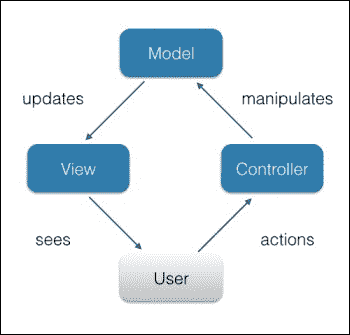

# 六、大规模 JavaScript 应用架构

任何有经验的程序员都会努力使代码可重用和可维护。在这里，我们遵循面向对象编程的原则，如封装、抽象、继承、组合和多态性。除了这些基础知识外，我们还遵循了 Robert C.Martin 定义的面向对象编程和设计的*五项基本原则*，首字母缩写为**SOLID**（[https://en.wikipedia.org/wiki/SOLID_（面向对象设计）](https://en.wikipedia.org/wiki/SOLID_(object-oriented_design))。当我们在代码审查过程中遇到违反这些原则的情况时，它被认为是一种代码气味，并导致重构。我们每天在开发中解决的任务的核心，往往是我们一次又一次遇到的共同问题。在本章中，我们将介绍 JavaScript 开发中最常见的通用体系结构解决方案和概念：

*   JavaScript 中的设计模式
*   使用 JavaScript MV*框架理解 JavaScript 中的关注点分离

# JavaScript 中的设计模式

摘要防弹解决方案早已为人所知，通常被称为**设计模式**。最初的 23 种编程设计模式是在 1995 年由*Erich Gamma*、*Richard Helm*、*Ralph Johnson*和*John Vlissides*发布的有影响力的书籍*设计模式：可重用面向对象软件的元素*中首次收集的 GoF）。这些模式与语言无关。尽管如此，*Addy Osmani*在他的在线书籍*中学习 JavaScript 设计模式*（[http://addyosmani.com/resources/essentialjsdesignpatterns/book/](http://addyosmani.com/resources/essentialjsdesignpatterns/book/) 展示了 GoF 的一些模式是如何在 JavaScript 中实现的。

在这里，我们不会重复他的工作；相反，我们将研究如何组合这些模式。JavaScript 开发中的一个常见问题是动态创建的对象之间的通信。例如，我们有一个对象，需要从`foo`调用对象`bar`的方法（`baz`。但是，我们无法知道`bar`是否已经可用。GoF 的模式中介鼓励我们使用一个对象来代理其他对象之间的通信。因此，我们通过防止对象直接交互来促进松散耦合。在我们的案例中，尽管打电话`bar.baz`，我们还是将我们的意图告知调解人。当`bar`可用时调解人将进行呼叫：

```js
"use strict";

class EventEmitter {
  /** Initialize */
  constructor() {
    /**
    * @access private
    * @type {EventHandler[]}
    */
   this.handlers = [];
  }
 /**
  * Subscribe a cb handler for a given event in the object scope
  * @param {String} ev
  * @param {Function} cb
  * @param {Object} [context]
  * @returns {EventEmitter}
  */
  on( ev, cb, context ){
     this.handlers.push({
       event: ev,
       callback: cb,
       context: context
     });
     return this;
  }
/**
  * Emit a given event in the object
  * @param {String} ev
  * @param {...*} [arg]
  * @returns {EventEmitter}
  */
  trigger( ev, ...args ) {
    this.handlers.forEach(function( evObj ){
     if ( evObj.event !== ev || !evObj.callback.apply ) {
       return;
     }
     evObj.callback.apply( evObj.context || this, args );
   }, this );
   return this;
  }
}

window.mediator = new EventEmitter();
```

在这里，我们使用了ES6 语法，它正好能够完美地描述代码设计。在 ES6 中，可以显示出简洁明了的意图，而在 JavaScript 版本 ES5 和更早版本中，我们需要额外的代码行来实现相同的结果。

在前面的示例中，我们通过实例化`EventEmitter`类创建了一个中介对象。`EventEmitter`实现了一种称为 PubSub 的消息传递模式。此模式描述了一种消息交换，其中一个对象向另一个对象发送一个事件，第二个对象调用订阅该事件的处理程序（如果有）。换句话说，如果我们为`myevent`中介事件（`mediator.on`订阅`foo`对象的处理程序函数，那么我们可以通过在中介（`mediator.trigger`上发布`myevent`事件从任何其他对象调用`foo`的处理程序。让我们看一个例子。我们想象的应用是本地化的。它从一个登录屏幕开始。当用户登录时，屏幕会跳转到带有新闻的仪表板。用户可以在任何屏幕上更改语言。但是，在第一阶段，新闻视图对象甚至还没有创建，而在第二阶段，登录视图对象已经被销毁。但是，如果我们使用中介，我们可以触发`translate`事件，所有可用的订阅者都会收到消息：

```js
class News {
  /** Initialize */
  constructor(){
    mediator.on( "translate", this.update, this );
  }
  /** @param {String} lang */
  update( lang ){
    // fetch news from remote host for a given lang
    console.log( "News loaded for", lang );
  }
}

class Language {
  /** @param {String} lang */
  change( lang ) {
    mediator.trigger( "translate", lang );
  }
}

let language = new Language();
new News()
language.change( "de" );
```

每当用户更改语言（`language.change`时，相应的事件都会通过中介进行广播。当 news 实例可用时，它调用接收事件负载的`update`方法。在实际应用中，此实例将加载给定语言的新闻并更新视图。

那么，我们取得了什么成就？当使用中介和事件驱动的方法（PubSub）时，我们的对象/模块是松散耦合的，因此，整体架构更好地接受需求更改。此外，我们在单元测试中获得了更大的灵活性。

在编写本书时，没有浏览器为 ES6 类语句提供本机支持。但是，您可以使用 Babel.js运行时（[来运行给定的代码 https://babeljs.io/docs/usage/browser/](https://babeljs.io/docs/usage/browser/) 或蒸腾。

当应用增长并且我们获得了太多正在循环的事件时，将事件处理封装到单独的消息中心对象中是有意义的。这里想到的是`Facade`模式，它为其他接口定义了一个统一的高级接口：

```js
class Facade {
  constructor(){
    mediator.on( "show-dashboard", function(){
      this.dashboard.show()
      this.userPanel.remove();
    }, this )
    .on( "show-userpanel", function(a){
      this.dashboard.hide()
      this.userPanel = new UserPanel( this.user );
    }, this )
    .on( "authorized", function( user ){
      this.user = user;
      this.topBar = new TopBar( user.name );
      this.dashboard = new Dashboard( user.lang );
      this.mainMenu = new MainMenu( user.lang );
    }, this )
    .on( "logout", function(){
      this.userPanel.remove();
      this.topBar.remove();
      this.dashboard.remove();
      this.mainMenu.remove();
      this.login = new Login();
    }, this );
  }
}
```

初始化`Facade`类后，我们只需在中介器上触发一个事件，就可以触发一个涉及多个模块的复杂流。这样我们将行为逻辑封装到一个专用对象中；这使得代码更具可读性，整个系统更易于维护。

# 理解 JavaScript 中的关注点分离

在编写JavaScript（特别是客户端）时，的主要挑战之一是避免*意大利面代码*，在该代码中，同一模块呈现用户视图，处理用户交互，并执行业务逻辑。这样一个模块可能会很快成长为一个源文件的怪物，在这里，开发人员宁愿迷失方向，也不愿发现并解决问题。

被称为**模型视图控制器**（**MVC**的 MVC 编程范式将应用功能划分为单独的层，如表示、数据和用户输入。简单地说，MVC 意味着用户在一个控制器模块中与视图平台交互，该控制器模块操纵一个模型，从而更新视图。在 JavaScript 中，控制器通常是侦听 UI 事件的观察者。用户单击一个按钮，事件被触发，控制器寻址相应的模型。例如，控制器请求模型将提交的数据发送到服务器。视图会收到关于模型状态更改的通知并做出相应的反应，比如说它会显示一条消息，**数据已保存**。MVC 模式下的组件协作如下图所示：



如您所见，我们可以将所有用户输入处理程序封装在一个模块中（这里是**控制器**，我们可以按照领域驱动的设计实践将数据层抽象到一个模型模块中。最后，我们有一个视图模块负责更新 UI。因此，模型不知道组件的表示（HTML、CSS），也不知道 DOM 事件，而 DOM 事件只是纯粹的数据和操作。控制器只知道来自视图和视图 API 的事件。最后，视图对模型和控制器一无所知，但会公开其 API 并发送事件。因此，我们有一个易于维护和测试的高效体系结构。

然而，对于 JavaScript 构建的 UI，在视图逻辑和控制器逻辑之间划一条线并不容易。这里我们得到了方便的 MVC 衍生物：**MVP**和**MVVM.MVP**。

**MVP**中的**P**代表**演讲者**为用户请求提供服务。演示者侦听视图事件，检索数据，操纵数据，并使用视图 API 更新演示。**演示者**可以与模型交互以保存数据。如下图所示，**演示者**的行为就像一个经理，接收请求，使用可用资源处理请求，并引导视图进行更改。下图显示了 MVP 模式中组件的协作：


与 MVC 相比，MVP 提供了更好的可测试性和关注点分离。您可以在[找到实现 MVP 的`TODO`应用示例 http://codepen.io/dsheiko/pen/WQymbG](http://codepen.io/dsheiko/pen/WQymbG) 。

## MVVM

MVP 的被动视图主要是关于数据绑定和 UI 事件代理。事实上，这是我们可以抽象的东西。**模型视图**（**MVVM**方法中的视图可能根本不需要任何 JavaScript。通常，视图是用 ViewModel 已知的指令进行 HTML 扩展的。该模型表示特定于领域的数据，并公开相应的方法，如验证。ViewModel 是视图和模型之间的中间人。它转换视图模型中的数据对象。例如，当模型属性包含原始日期时间时，ViewModel 会将其转换为视图中预期的格式，如`1 January 2016, 00:01`。下图显示了 MVVM 模式中组件的协作：


MVVM模式具有命令式和声明式编程的优点。它可以通过在公共绑定器模块中抽象大多数通用视图逻辑，从而大大缩短开发时间。该模式在流行的 JavaScript 框架（如 Knockout、Angular 和 Meteor）中获得了发展势头。您可以在[找到一个基于 MVVM 模式的RSS 阅读器应用示例 https://msdn.microsoft.com/en-us/magazine/hh297451.aspx](https://msdn.microsoft.com/en-us/magazine/hh297451.aspx) 。

# 使用 JavaScript MV*框架

当启动一个新的可伸缩 web 应用时，您必须决定是否使用框架。现在很难找到任何不建立在框架之上的大型项目。然而，使用框架也有缺点；请看**零框架宣言**（[http://bitworking.org/news/2014/05/zero_framework_manifesto](http://bitworking.org/news/2014/05/zero_framework_manifesto) ）。然而，如果您决定支持框架，那么您将进退两难地选择哪种框架。这确实不是一项容易的任务。如今的 JavaScript 框架相当多；只需看看TodoMVC（[上提供的品种 http://todomvc.com](http://todomvc.com) 。审查所有这些框架几乎是不可行的，但我们可以简要地审查一些最流行的框架。根据最近的调查（例如，[http://ashleynolan.co.uk/blog/frontend-tooling-survey-2015-results](http://ashleynolan.co.uk/blog/frontend-tooling-survey-2015-results) ），其中最流行的是棱角分明、反应灵敏和脊梁骨。这三种模式给出了完全不同的发展模式。因此，它们适合于总体描述 JavaScript 框架。

## 主干

主干（[http://backbonejs.org](http://backbonejs.org) 非常轻便且易于启动。这是唯一一个流行的框架，您可以在相当短的时间内掌握整个代码库（[http://backbonejs.org/docs/backbone.html](http://backbonejs.org/docs/backbone.html) 。从本质上讲，主干网给了你一个一致的抽象，除此之外没有其他东西。大体上，我们将所有与 UI 相关的逻辑封装到一个子类型`Backbone.View`中。视图所需的任何数据，我们都将其转换为`Backbone.Model`或`Backbone.Collection`的导数（当它是条目列表时）。最后，我们通过`Backbone.Route`路由基于散列的导航请求。

让我们考虑一个例子。我们想象中的应用允许我们通过给定的电子邮件地址查找联系人。因为我们希望这是用户友好的，所以我们希望在输入申请表时对其进行验证。为此，我们需要一点 HTML：

```js
<form data-bind="fooForm">
      <label for="email">Email:</label>
      <input id="email" name="email" required />
      <span class="error-msg" data-bind="errorMsg"></span>
      <button data-bind="submitBtn" type="submit">Submit</button>
  </form>
```

在这里，我们有一个输入控件、一个提交按钮和一个可能的错误消息容器。为了对此进行管理，我们将使用以下`Backbone.View`：

**ContactSearchView.js**

```js
"use strict";
/** @class {ContactSearchView}  */
var ContactSearchView = Backbone.View.extend(/** @lends ContactSearchView.prototype */{
  events: {
    "submit": "onSubmit"
  },
  /** @constructs {ContactSearchView} */
  initialize: function() {
    this.$email = this.$el.find( "[name=email]" );
    this.$errorMsg = this.$el.find( "[data-bind=errorMsg]" );
    this.$submitBtn = this.$el.find( "[data-bind=submitBtn]" );
    this.bindUi();
  },
  /** Bind handlers */
  bindUi: function(){
    this.$email.on( "input", this.onChange.bind( this ) );
    this.model.on( "invalid", this.onInvalid.bind( this ) );
    this.model.on( "change", this.onValid.bind( this ) );
  },
  /** Handle input onchange event */
  onChange: function(){
    this.model.set({
      email: this.$email.val(),
      // Hack to force model running validation on repeating payloads
      "model:state": ( 1 + Math.random() ) * 0x10000
    }, { validate: true });
  },
  /** Handle model in invalid state */
  onInvalid: function(){
    var error = arguments[ 1 ];
    this.$errorMsg.text( error );
    this.$submitBtn.prop( "disabled", "disabled" );
  },
  /** Handle model in valid state */
  onValid: function(){
    this.$errorMsg.empty();
    this.$submitBtn.removeProp( "disabled" );
  },
  /** Handle form submit */
  onSubmit: function( e ){
    e.preventDefault();
    alert( "Looking up for " + this.model.get( "email") );
  }
});
```

在构造函数（方法`initialize`）中，我们将 HTML 的代理节点绑定到视图的属性，并向 UI 和模型事件订阅处理程序。然后，我们在`submit`表单和`input`表单上注册侦听器方法。第二个处理程序在我们键入时被调用，并更新模型。模型运行验证，并根据结果，以`invalid`或`change`模型事件进行响应。在`invalid`事件的情况下，视图显示错误消息，否则它被隐藏。

现在我们可以添加模型，如下图：

**ContactSearchModel.js**

```js
 "use strict";
/** @class {ContactSearchModel}  */
var ContactSearchModel = Backbone.Model.extend(/** @lends ContactSearchModel.prototype */{
  /** @type {Object} */
  defaults: {
    email: ""
  },
  /**
   * Validate email
  * @param {String} email
  */
  isEmailValid: function( email ) {
    var pattern = /^[a-zA-Z0-9\!\#\$\%\&\'\*\+\-\/\=\?\^\_\`\{\|\}\~\.]+@[a-zA-Z0-9.\-]+\.[a-zA-Z]{2,4}$/g;
    return email.length && pattern.test( email );
  },
  /**
   * Validate model
  * @param {Map} attrs
  */
  validate: function( attrs ) {
    if ( !attrs.email ) {
      return "Email is required.";
    }
    if ( !this.isEmailValid( attrs.email ) ) {
      return "Invalid email address.";
    }
  }
});
```

该模型在`defaults`属性中定义域数据，并提供`validate`方法，在设置或保存模型时自动调用该方法。

现在我们可以将所有组合在一起并初始化视图：

```js
<!DOCTYPE html>
<html>
  <script type="text/javascript" src="//ajax.googleapis.com/ajax/libs/jquery/1.11.3/jquery.min.js"></script>
  <script type="text/javascript" src="//cdnjs.cloudflare.com/ajax/libs/underscore.js/1.5.2/underscore-min.js"></script>
  <script type="text/javascript" src="//cdnjs.cloudflare.com/ajax/libs/backbone.js/1.0.0/backbone-min.js"></script>
  <script type="text/javascript" src="ContactSearchView.js"></script>
  <script type="text/javascript" src="ContactSearchModel.js"></script>
  <style>
    fieldset { border: 0; }
    .error-msg{ color: red; }
  </style>
  <body>
   <form data-bind="fooForm">
    <fieldset>
      <label for="email">Email:</label>
      <input id="email" name="email" required />
      <span class="error-msg" data-bind="errorMsg"></span>
    </fieldset>
    <fieldset>
      <button data-bind="submitBtn" type="submit">Submit</button>
    </fieldset>
  </form>
<script>

// Render foo view
 new ContactSearchView({
   el: $( "[data-bind=fooForm]" ),
   model: new ContactSearchModel
 });

</script>
  </body>
</html> 
```

主干网本身的尺寸非常小（压缩 6.5 公斤），但有了 jQuery 和下划线依赖，这就形成了一个相当大的捆绑包。这两种依赖关系在过去都很重要，但现在的问题是，我们到底需要它们吗？因此，检查**外骨骼**（[是有意义的 http://exosjs.com/](http://exosjs.com/) 项目，这是一个优化的主干网版本，在没有依赖性的情况下可以完美地工作。

## 角度

角度（[http://Angular.org](http://Angular.org) ）现在似乎是世界上最流行的 JavaScript 框架。它是谷歌支持的，被认为是为您解决大多数日常任务的框架。特别是，Angular 有一个称为双向绑定的功能，这意味着 UI 更改会传播到绑定模型，反之亦然，并且模型更改（例如，通过 XHR）会更新 UI。

在 AngularJS 中，我们使用指令直接在 HTML 中定义行为。指令是采用与 web 组件类似的 UI 逻辑的自定义元素和属性。实际上，您可以在 AngularJS 中创建功能性小部件，而无需编写一行 JavaScript 代码。AngularJS 中的模型是简单的数据容器，与主干不同，它与外部源没有连接。当我们需要读取或写入数据时，我们使用服务。当任何数据被发送到视图时，我们可以使用过滤器来格式化输出。框架利用依赖注入（DI）模式，允许将核心组件作为依赖项相互注入。这使得模块更容易满足需求变化和单元测试。让我们在实践中看到这一点：

```js
<!DOCTYPE html>
<html>
  <script src="http://ajax.googleapis.com/ajax/libs/Angular/1.3.14/angular.min.js"></script>
  <style>
    fieldset { border: 0; }
    .error-msg{ color: red; }
  </style>
  <body>
   <form ng-app="contactSearch" name="csForm" ng-submit="submit()" ng-controller="csController">
    <fieldset>
      <label for="email">Email:</label>
      <input id="email" name="email" ng-model="email" required
          ng-pattern="/^[a-zA-Z0-9\!\#\$\%\&\'\*\+\-\/\=\?\^\_\`\{\|\}\~\.]+@[a-zA-Z0-9.\-]+\.[a-zA-Z]{2,4}$/"  />
      <span class="error-msg" ng-show="csForm.email.$dirty && csForm.email.$invalid">
        <span ng-show="csForm.email.$error.required">Email is required.</span>
        <span ng-show="csForm.email.$error.pattern">Invalid email address.</span>
      </span>
    </fieldset>
    <fieldset>
      <button type="submit" ng-disabled="csForm.email.$dirty && csForm.email.$invalid">Submit</button>
    </fieldset>
  </form>
<script>
  "use strict";
  angular.module( "contactSearch", [] ).controller( "csController", [ "$scope", function ( $scope ){
    $scope.email = "";
    $scope.submit = function() {
      alert( "Looking up for " + $scope.email );
    };
  }]);
</script>
  </body>
</html>
```

在本例中，我们声明了一个输入字段，并将其绑定到一个模型电子邮件（`ng-model`指令）。表单验证的工作方式与 HTML5 表单中的工作方式相同：如果我们声明了一个输入类型的电子邮件，它会得到相应的验证。这里我们使用默认的文本类型，并使用`ng-pattern`（类似于 HTML5 的模式）属性为电子邮件设置与主干案例相同的验证规则。此外，当输入状态为空（`csForm.email.$dirty`或无效（`csForm.email.$invalid`时，我们依靠`ng-show`指令来显示错误消息块。在这种情况下，则相反，submit 按钮是隐藏的。使用`ng-controller`和`ng-submit`指令，我们将`csController`控制器和`on-submit`处理程序绑定到表单。在`csController`（JavaScript）的主体中，`$scope.submit`需要表单提交事件的处理函数。

正如您在 Angular 中看到的，实现同一任务所需的代码总数要少得多。然而，我们应该承认，将应用逻辑保留在 HTML 中会使代码阅读变得非常困难。

此外，Angular 为每个指令订阅了许多观察者（预期的处理程序、自动脏检查等），并使其在具有大量交互元素的页面上运行缓慢且资源昂贵。如果你想调整你的应用性能，你宁愿学习 Angular 源代码，这将是一项具有挑战性的任务，大约 11.2K 行代码（版本 1.4.6）。

## 反应

反应（[https://facebook.github.io](https://facebook.github.io) 是 Facebook 的一个项目，它不是一个真正的框架，而是一个库。React 的独特方法意味着基于组件的应用。本质上，React 使用所谓的虚拟 DOM 定义组件的视图，这使得 UI 呈现和更新速度惊人。通过对视图的关注，React 包含一个模板引擎。或者，可以将 React 组件编写在名为 JSX 的 JavaScript 子集中，您可以在其中将 HTML 模板放入 JavaScript 中。JSX 可以像下面的示例中那样动态解析，也可以预编译。由于 React 只处理视图，而不对其他关注点进行假设，因此将其与其他框架结合使用是有意义的。因此，React 可以插入框架（例如，作为角度视图中的指令或主干视图中的指令）。

在这次实现联系人搜索应用时，我们将使用React 来控制我们示例的视图，将其分为两个组件（`FormView`和`EmailView`。第一个定义了搜索表单的视图：

```js
   /** @class {FormView}  */
var FormView = React.createClass({
  /** Create an initial state with the model  */
  getInitialState: function () {
    return {
      email: new EmailModel()
    };
  },
  /**
   * Update state on input change event
   * @param {String} value - changed value of the input
   */
  onChange: function( value ){
    this.state.email.set( "email", value );
    this.forceUpdate();
  },
  /** Handle form submit */
  onSubmit: function( e ){
    e.preventDefault();
    alert( "Looking up for " + this.state.email.get( "email") );
  },
  /** Render form */
  render: function () {
    return <form onSubmit={this.onSubmit}>
      <fieldset>
      <label htmlFor="email">Email:</label>
      <EmailView model={this.state.email} onChange={this.onChange} />
      </fieldset>
      <fieldset>
        <button data-bind="submitBtn" type="submit">Submit</button>
      </fieldset>
    </form>;
  }
});
```

在`render`方法中，我们使用 JSX 表示法声明组件的视图。这使得操作虚拟 DOM 变得更加容易。与 Angular 类似，我们可以在 HTML 中直接处理组件范围。因此，我们通过引用`onSubmit`和`onChange`属性中的相应处理程序来订阅表单提交事件和输入更改事件。由于 React 不提供内置模型，因此我们重用了`ContactSearchModel`，即我们在探索主干时创建的模型。

您可能会注意到 JSX 中有一个`EmailView`自定义标记。这是我们如何引用第二个组件的，它表示电子邮件输入控件：

```js
    /** @class {EmailView}  */
var EmailView = React.createClass({
  /**
   * Delegate input on-changed event to the from view
   * @param {Event} e
   */
  onChanged: function( e ){
    this.props.onChange( e.target.value );
  },
  /** Render input */
  render: function () {
    var model = this.props.model;
    return <span>
      <input id="email" type="text" value={model.email} onChange={this.onChanged} />      
      <span className="error-msg" data-bind="errorMsg"> {model.isValid() ? "" : model.validationError}</span>
    </span>;
  }
});
```

在这里，我们将电子邮件输入绑定到模型，将错误消息容器绑定到模型状态。我们还将输入`onChange`事件传递给父组件。

现在，我们可以在 HTML 中添加组件并呈现表单：

```js
<!DOCTYPE html>
<html>
<head>
  <script src="https://cdnjs.cloudflare.com/ajax/libs/react/0.13.3/react.js"></script>
  <script src="https://cdnjs.cloudflare.com/ajax/libs/react/0.13.3/JSXTransformer.js"></script>
  <script type="text/javascript" src="//cdnjs.cloudflare.com/ajax/libs/underscore.js/1.5.2/underscore-min.js"></script>
  <script type="text/javascript" src="//cdnjs.cloudflare.com/ajax/libs/backbone.js/1.0.0/backbone-min.js"></script>
  <script type="text/javascript" src="ContactSearchModel.js"></script>
  <style>
    fieldset { border: 0; }
    .error-msg{ color: red; }
  </style>
</head>
<body>
  <div data-bind="app"></div>
<script type="text/jsx">
  /** @jsx React.DOM */

// Please insert here both components
// FormView and EmailView

// render app
React.render(
  <FormView />,
  document.querySelector( "[data-bind=app]" )
);
</script>
</body>
</html>
```

我们通过相应的自定义元素处理模板中的组件，例如 web 组件。不要对相似性感到困惑，React 组件是从浏览器中抽象出来的，而 web 组件的工作方式与浏览器本身类似。React 的核心概念是，虚拟 DOM 允许我们避免不必要的 DOM 回流循环，从而使库更适合于高性能应用。React 非常适合使用 Node.js 在服务器上呈现静态页面。因此，我们可以在服务器端和客户端之间重用应用组件。

# 总结

编写可维护代码是一门艺术。也许提供这方面指导的最好的书是罗伯特·C·马丁的*干净的代码：敏捷软件工艺手册*。它是关于命名函数、方法、类、注释、代码格式，当然还有关于 OOP 和 SOLID 的正确使用。然而，当重用本书或任何设计模式系列中描述的解决方案时，我们必须将它们转换为 JavaScript，并且由于语言的性质，这可能是一个挑战。在更高的层次上，我们必须将代码划分为表示层、业务逻辑层、数据访问层和持久性层，在这些层中，每一个代码包处理一个关注点，并且与其他关注点松散耦合。在这里，我们可以选择一种方法。在 JavaScript 世界中，它通常是 MVC（MVP 或 MVVM 或其他）的派生。考虑到这一点，一个好的编程设计需要大量的抽象。今天，我们可以使用许多框架。它们提供了不同的编程范例。