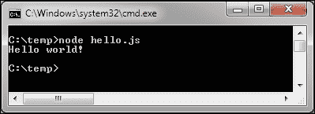
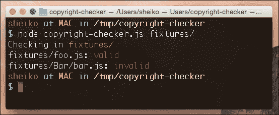
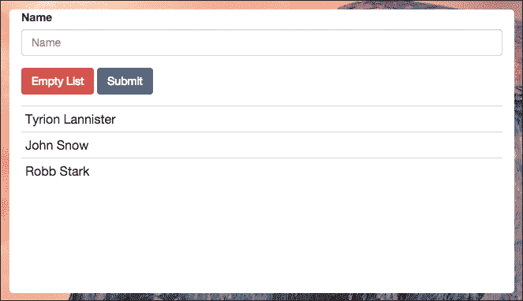
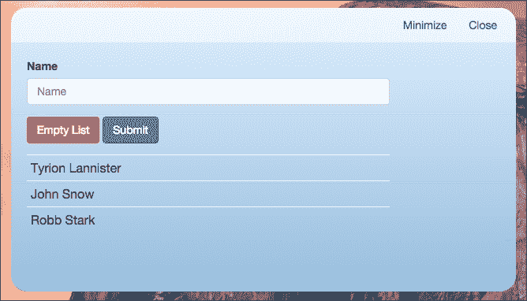
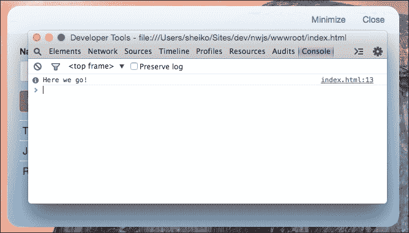
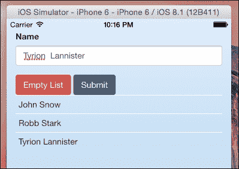

# 第 7 章浏览器之外的 JavaScript

最初，JavaScript 被设计为一种客户端脚本语言，但如今，它被广泛使用：服务器脚本、移动和桌面软件编程、游戏开发、数据库查询、硬件控制和操作系统自动化。如果您有客户端 JavaScript 的经验，再加上一些额外的知识，您也可以将您的技能应用到其他编程领域。在这里，我们将学习如何使用 JavaScript 编写命令行工具、web 服务器、桌面应用和移动软件。

在本章中，我们将学习以下内容：

*   升级 JavaScript 中命令行程序的编码
*   用 JavaScript 构建 web 服务器
*   编写桌面 HTML5 应用
*   使用 PhoneGap 制作移动本机应用

# 升级 JavaScript 中命令行程序的编码

你一定听说过 Node.js。这是一个开源的跨平台开发环境，允许使用 JavaScript 创建 web 服务器、网络和其他工具。js 通过一组专门的模块扩展了经典 JavaScript。这些模块处理文件系统 I/O、网络、操作系统级操作、二进制数据、加密功能、数据流和其他模块（[https://nodejs.org/api/index.html](https://nodejs.org/api/index.html) ）。Node.js 使用事件驱动的 I/O 模型。与 JavaScript 类似，它在执行非阻塞调用的单线程上运行。因此，耗时的函数可以通过在回调完成时调用回调来并发运行。

为了获得 Node.js 的感觉，我们从一个简单打印*Hello world*的示例开始：

**hello.js**

```js
console.log( "Hello world!" );
```

现在让我们打开控制台（Windows 中的命令行界面：**CMD**或 Linux 和 Mac OS 中的**终端**，导航到示例脚本位置，并运行以下操作：

```js
node hello.js
```

在这里，我们在输出中获得`Hello world!`。

下面的屏幕截图显示了 Windows 命令



Node.js模块遵循 CommonJS 规范，与我们在[第 2 章](2.html#K0RQ2-f4ff6b81796e4f78aa983a623fb95daf "Chapter 2. Modular Programming with JavaScript")、*使用 JavaScript*进行模块化编程的方式相同：

**foo.js**

```js
console.log( "Running foo.js" );
module.exports = "foo";
main.js
var foo = require( "./foo" );
console.log( "Running main.js" );
console.log( "Exported value:", foo );
```

当我们运行`main.js`时，我们应该得到以下输出：

```js
Running foo.js
Running main.js
Exported value: foo
```

Node.js 本机模块，如`fs`[https://nodejs.org/api/index.html](https://nodejs.org/api/index.html) ）不需要下载。我们可以在`require()`中引用它们，在运行时，我们将知道在哪里可以找到它们：

```js
"use strict";
var fs = require( "fs" );
fs.readFile( __filename, "UTF-8", function( err, data ){
  if ( err ) {
    throw new Error( err );
  }
  console.log( "Source of ", __filename, ":\n", data );
});
```

这里我们使用文件系统 I/O（`fs`模块来读取文件。模块作用域的`__filename`属性包含执行源文件的绝对路径。还记得我们在[第 5 章](5.html#11C3M2-f4ff6b81796e4f78aa983a623fb95daf "Chapter 5. Asynchronous JavaScript")中研究的*错误优先回调*方法吗？*异步 JavaScript*是 Node.js 中异步函数的主接口。

现在让我们尝试一些更实际的方法。我们将编写一个实用程序，递归扫描给定目录中的所有源文件，以确保每个文件都具有最新版权的块注释。首先，我们需要一个模块，可以测试提供的块注释文本是否包含实际的版权行：

```js
./Lib/BlockComment.js 
   /**
   * Block comment entity
   * @class
   * @param {String} code
   */
var BlockComment = function( code ){
  return {
    /**
     * Check a block comment
     * @returns {Boolean}
     */
    isValid: function(){
      var lines = code.split( "\n" );
      return lines.some(function( line ){
          var date = new Date();
          return line.indexOf( "@copyright " + date.getFullYear() ) !== -1;
        });
    }
  };
};

module.exports = BlockComment;
```

这里，我们有一个构造函数，它创建一个表示`BlockComment`的对象。对象有一个方法（`isValid`来测试其有效性。因此，如果我们创建一个带有块注释文本的`BlockComment`实例，我们可以根据我们的要求进行验证：

```js
var comment = new BlockComment( "/**\n* @copyright 2015 \n*/" );
comment.isValid() // true 
```

现在，我们将编写一个模块，能够测试给定源代码中的所有版权行是否具有实际年份：

```js
./Lib/SourceFile.js
    /** @type {module:esprima} */
var esprima = require( "esprima" ),

/**
 * Source file entity
 * @class
 * @param {String} fileSrc
 * @param {module:Lib/BlockComment} BlockComment - dependency injection
 */
SourceFile = function( fileSrc, BlockComment ){
  return {
    /**
     * Test if source file has valid copyright
     */
    isValid: function() {
      var blockComments = this.parse( fileSrc );
      return Boolean( blockComments.filter(function( comment ){
        return comment.isValid();
      }).length );
    },
    /**
     * Extract all the block comments as array of BlockComment instances
     * @param {String} src
     * @returns {Array} - collection of BlockComment
     */
    parse: function( src ){
      return esprima.parse( src, {
        comment: true
      }).comments.filter(function( item ){
        return item.type === "Block";
      }).map(function( item ){
        return new BlockComment( item.value );
      });
    }

  };
};

module.exports = SourceFile;
```

在本例中，我们介绍了一个具有两种方法的`SourceFile`对象，`parse`和`isValid`。私有方法`parse`从给定 JavaScript 源代码中提取所有块注释，并返回`BlockComment`对象数组。`isValid`方法检查所有接收的`BlockComment`对象是否满足我们的要求。在这些方法中，为了操纵数组，我们使用了[第 1 章](1.html#DB7S2-f4ff6b81796e4f78aa983a623fb95daf "Chapter 1. Diving into the JavaScript Core")中检查的`Array.prototype.filter`和`Array.prototype.map`，*深入 JavaScript 核心*。

但是我们如何才能可靠地从 JavaScript 源中提取`blockComments`？最好的方法是使用一种叫做**esprima**解析器（[的防弹解决方案 http://esprima.org/](http://esprima.org/) ）执行代码静态分析并返回包含注释的完整语法树。然而，esprima 是一个第三方软件包，应该从应用下载和链接。通常，一个包可能依赖于其他包，这些包也有依赖关系。看起来，将所需的依赖项组合在一起可能是一项艰巨的工作。幸运的是，Node.js 是随 NPM 包管理器一起分发的。该工具可用于在NPM 存储库（[中安装和管理 https://www.npmjs.com/](https://www.npmjs.com/) 第三方模块。NPM 不仅下载请求的模块，还解析模块依赖关系，允许在项目范围内或全局范围内的可重用组件的细粒度结构。

因此，为了使`esprima`在我们的应用中可用，我们只需使用以下命令从 NPM 请求它：`npm install esprima`。

通过在控制台中运行此命令，我们自动获得一个新的`node_modules`子目录，其中包含`esprima`包。如果包需要任何依赖项，将在`node_modules`中获取并分配这些依赖项。一旦 NPM 安装了包，Node.js 就可以通过其名称找到它。例如，`require( "esprima"` 。现在，当我们有了`SourceFile`对象时，我们只需要从给定目录读取文件并用`SourceFile`测试它们的主脚本：

**copyright-checker.js**

```js
        /** @type {module:cli-color} */
var clc = require( "cli-color" ),
    /** @type {module:fs-walk} */
    walk = require( "fs-walk" ),
    /** @type {module:path} */
    path = require( "path" ),
    /** @type {module:fs} */
    fs = require( "fs" ),
    /**
     * Source file entity
     * @type {module:Lib/SourceFile}
     */
    SourceFile = require( "./Lib/SourceFile" ),
    /** @type {module:Lib/BlockComment} */
    BlockComment = require( "./Lib/BlockComment" ),
    /**
     * Command-line first argument (if none given, go with ".")
     * @type {String}
     */
    dir = process.argv[ 2 ] || ".";

console.log( "Checking in " + clc.yellow( dir ) );

// Traverse directory tree recursively beginning from 'dir'
walk.files( dir, function( basedir, filename ) {
      /** @type {Function} */
  var next = arguments[ 3 ],
      /** @type {String} */
      fpath = path.join( basedir, filename ),
      /** @type {String} */
      fileSrc = fs.readFileSync( fpath, "UTF-8" ),
      /**
       * Get entity associated with the file located in fpath
       * @type {SourceFile}
       */
      file = new SourceFile( fileSrc, BlockComment );
  // ignore non-js files
  if ( !filename.match( /\.js$/i ) ) {
    return next();
  }
  if ( file.isValid() ) {
    console.log( fpath + ": " + clc.green( "valid" ) );
  } else {
    console.log( fpath + ": " + clc.red( "invalid" ) );
  }
  next();
}, function( err ) {
  err && console.log( err );
});
```

在这段代码中，我们依赖于第三方模块`cli-color`，对命令行输出着色。我们使用`fs-walk`模块递归遍历一个目录。而 Node.js 本机模块 path 允许我们通过给定的相对目录和文件名解析绝对路径，`fs`内置模块用于读取文件。

当我们打算从控制台运行应用时，我们可以使用命令行选项传递要测试的目录：

```js
node copyright-checker.js some-dir
```

我们可以从内置进程（`process.argv`对象）中提取脚本参数。对于该命令，`process.argv`将包含如下数组：

```js
[ "node", "/AbsolutePath/copyright-checker.js", "some-dir" ]
```

所以在主脚本中，现在我们可以将这个数组的第三个元素传递给`walk.files`。该函数将遍历给定的目录，并对找到的每个文件运行回调。在回调函数中，如果文件名看起来像 JavaScript，我们将读取内容并使用`SourceFile`对象对其进行测试。

在运行主脚本之前，我们需要向 NPM 询问我们将在脚本中使用的第三方软件包：

```js
npm install fs-walk cli-color
```

现在我们可以出发了。当我们运行`node copyright-checker.js fixtures`时，我们会得到一份关于 fixture 中JavaScript 文件有效性的报告。

以下屏幕截图显示 Mac OS X 终端：



# 用 JavaScript 构建 web 服务器

我们刚刚学习了如何使用 Node.js 编写命令行脚本。然而，这种运行时通常被称为服务器端 JavaScript，这意味着这是运行 HTTP 服务器的软件。事实上，Node.js 对于这种工作特别适合。如果我们启动一个基于 Node.js 的服务器应用，它将永久运行，只初始化一次。例如，我们可以创建一个 DB 连接对象，并在有人请求应用时重用它。此外，它为我们提供了 JavaScript 的所有灵活性和功能，包括事件驱动、非阻塞 I/O。

那么我们如何利用这个呢？得益于 Node.js 的 HTTP 本机模块，一个简单的 web 服务器可以像这样简单地实现：

```js
simple-server.js
"use strict";
    /** @type {module:http}  */
var http = require( "http" ),
    /** @type {HttpServer}  */
    server = http.createServer(function( request, response ) {
      response.writeHead( 200, {"Content-Type": "text/html"} );
      response.write( "<h1>Requested: " + request.url + "</h1>" );
      response.end();
    });

server.listen( 80 );
console.log( "Server is listening..." );
```

在这里，我们创建了一个带有 dispatcher 回调的服务器来处理 HTTP 请求。然后，我们让服务器监听端口 80。现在从控制台运行`node simple-server.js`，然后在浏览器中点击`http://localhost`。我们将看到以下情况：

```js
Requested: /
```

因此，我们只需要路由传入的请求，读取相应的 HTML 文件，并将它们与响应一起发送，以创建一个简单的静态 web 服务器。或者我们可以安装现有模块`connect`和`serve-static`：

```js
npm install connect serve-static
```

并使用以下方法实现服务器：

```js
"use strict";
    /** @type {module:connect}  */
var connect = require( "connect" ),
    /** @type {module:serve-static}  */
    serveStatic = require( "serve-static" );

connect().use( serveStatic( __dirname ) ).listen( 80 );
```

实际上，路由请求可能是一项具有挑战性的任务，因此我们更倾向于使用框架。例如，Express.js（[http://expressjs.com](http://expressjs.com) 。那么，我们的路线可能看起来像这样：

```js
"use strict";
    /** @type {module:express}  */
var express = require( "express" ),
    /** @type {module:http}  */
    http = require( "http" ),
    /** @type {Object}  */
    app = express();
// Send common HTTP header for every incoming request
app.all( "*", function( request, response, next ) {
  response.writeHead( 200, { "Content-Type": "text/plain" } );
  next();
});
// Say hello for the landing page
app.get( "/", function( request, response ) {
  response.end( "Welcome to the homepage!" );
});
// Show use if for requests like http://localhost/user/1
app.get( "/user/:id", function( request, response ) {
  response.end( "Requested ID: "  + req.params.id );
});
// Show `Page not found` for any other requests
app.get( "*", function( request, response ) {
  response.end( "Opps... Page not found!" );
});

http.createServer( app ).listen( 80 );
```

# 编写桌面 HTML5 应用

你有没有想过用 HTML5 和 JavaScript 编写一个桌面应用？现在，我们可以用 NW.js 很容易地做到这一点。该项目是一个基于 Chromium 和 Node.js 的跨平台应用运行时。因此，它提供了一个无框架浏览器，其中 DOM API 和 Node.js API 都可用。换句话说，我们可以运行 NW.js 经典 web 应用，访问低级 API（文件系统、网络、进程等），并重用 NPM 存储库的模块。有趣的我们将开始一个教程，在这里我们将创建一个简单的 HTML5 应用，并使用 NW.js 运行它。这将是一个花名册申请表，其中有一个表格可以输入姓名和已经提交的姓名列表。这些名称将存储在 localStorage 中。让我们摇滚吧。

## 立项

首先，我们必须从[下载与我们的平台（Mac OS X、Windows 或 Linux）相关的 NW.js运行时 http://nwjs.io](http://nwjs.io) 。在 NW.js 可执行文件（`nw.exe`、`new.app`或`nw.`旁边，具体取决于平台），我们放置了`package,json`文件（[https://github.com/nwjs/nw.js/wiki/manifest-format](https://github.com/nwjs/nw.js/wiki/manifest-format) 我们在这里描述我们的项目：

```js
{
  "name": "roster",
  "main": "wwwroot/index.html",
  "window": {
    "title": "The Roster",
    "icon": "wwwroot/roaster.png",
    "position": "center",
    "resizable": false,
    "toolbar": false,
    "frame": false,
    "focus": true,
    "width": 800,
    "height": 600,
    "transparent": true
  }
}
```

我们的`package.json`文件有三个主要字段。`name`包含与项目关联的唯一名称。请注意，此值将是存储应用数据（会话存储、本地存储等）的目录路径的一部分。`main`接受项目主 HTML 页面的相对路径。最后，`window`描述了显示 HTML 的浏览器窗口。

## 添加 HTML5 应用

根据`package.json`中的字段`main`将我们的`index.html`放入`wwwroot`子目录。我们可以使用以下简单的 HTML 进行尝试：

```js
<html>
  <body>
    Hello world!
  </body>
</html>
```

NW.js 以与浏览器相同的方式处理 HTML，因此如果我们现在启动 NW.js 可执行文件，我们将看到`Hello world!`。为了给它带来外观，我们可以添加 CSS 和 JavaScript。因此，我们可以像为浏览器编写代码一样，为 NW.js 编写代码。在这里，我们有一个很好的机会来应用我们在[第 6 章](6.html#181NK2-f4ff6b81796e4f78aa983a623fb95daf "Chapter 6. A Large-Scale JavaScript Application Architecture")*中学习的原则，一个大型 JavaScript 应用架构*。为了使示例简洁而富有表现力，我们将采用 AngularJS 方法。首先，我们创建 HTML。正文的标记如下所示：

```js
<main class="container">
  <form >
    <div class="form-group">
      <label for="name">Name</label>
      <input class="form-control">
    </div>
    <button class="btn btn-danger">Empty List</button>
    <button type="submit" class="btn btn-primary">Submit</button>
  </form>
  <table class="table table-condensed">
    <tr>
      <td></td>
    </tr>
  </table>
</main>
```

我们定义了一个表单来提交新名称，并定义了一个表来显示已存储的名称。为了让它更漂亮，我们使用了引导（[http://getbootstrap.com](http://getbootstrap.com) 风格。CSS 文件可以从 CDN 加载，如下所示：

```js
<link rel="stylesheet" href="https://maxcdn.bootstrapcdn.com/bootstrap/3.3.5/css/bootstrap.min.css">
```

现在，我们将通过添加 AngularJS 指令使其生效：

```js
<html>
<body ng-app="myApp" >
      <main ng-controller="RosterController" class="container">
        <form ng-submit="submit()">
          <div class="form-group">
            <label for="name">Name</label>
            <input class="form-control" id="name" name="name" ng-model="name" required placeholder="Name">
          </div>
          <button ng-click="empty()" class="btn btn-danger">Empty List</button>
          <button type="submit" class="btn btn-primary">Submit</button>
        </form>
        <table class="table table-condensed">
          <tr ng-repeat="person in persons">
            <td>{{person.value}}</td>
          </tr>
        </table>
      </main>
  </body>
</html>
```

这里我们声明了一个`myApp`模块作用域（`<body ng-app="myApp" >`。其中，我们定义了一个`RosterController`控制器。在控制器的边界中，我们将输入字段绑定到模型名称（`<input ng-model="name">`，并为`form submit`和`Empty List`按钮点击事件（`<form ng-submit="submit()">`和`<button ng-click="empty()">`设置处理程序。最后，我们制作了一个从表中绑定到`$scope.persons`集合的模板。因此，每当集合发生更改时，表都会更新：

```js
<table class="table table-condensed">
  <tr ng-repeat="person in persons">
    <td>{{person.value}}</td>
  </tr>
</table>
```

现在是向我们的 HTML 添加一些 JavaScript 的时候了：

```js
<script>
  var app = angular.module( "myApp", [ "ngStorage" ]);

  app.controller("RosterController", function( $scope, $localStorage ) {
    var sync = function() {
      $scope.persons = JSON.parse( $localStorage.persons || "[]" );
    };
    sync();
    $scope.name = "";
    $scope.submit = function() {
      sync();
      $scope.persons.push({ value: $scope.name });
      $localStorage.persons = JSON.stringify( $scope.persons );
    };
    $scope.empty = function() {
      $localStorage.persons = "[]";
      sync();
    };
  });
</script>
```

由于我们打算将提交的数据存储在表单中，我们可以使用我们在[第 4 章](4.html#SJGS2-f4ff6b81796e4f78aa983a623fb95daf "Chapter 4. HTML5 APIs")、*HTML5 API*中讨论的本地存储。为了以 AngularJS 的方式获取本地存储，我们使用了`ngStorage`模块（[https://github.com/gsklee/ngStorage](https://github.com/gsklee/ngStorage) 。因此，我们在模块初始化期间指定了插件，这使得该插件作为参数（`$localStorage`在控制器中可用。在控制器主体中，我们有一个函数`sync`，该函数使用 localStorage 中的 person 数组设置`$scope.persons`。我们在表单提交处理程序（`$scope.submit`中调用`sync`函数，在点击处理程序（`$scope.empty`上的**空列表**按钮中调用`sync`函数。它会导致 person 表每次更新。在处理提交事件的过程中，我们将`$scope.persons`输入的值追加，并将`$scope.persons`保存在 localStorage 中。

为了启用此功能，我们必须加载 AngularJS 和 ngStorage 插件：

```js
<script src="http://ajax.googleapis.com/ajax/libs/angularjs/1.3.14/angular.min.js"></script>

<script src="https://cdnjs.cloudflare.com/ajax/libs/ngStorage/0.3.6/ngStorage.min.js"></script>
```

现在我们启动 NW.js 可执行文件并使应用正常工作。以下屏幕截图显示了 NW.js 中没有样式的 Roaster 示例应用：



这很好，但是当我们运行 NW.js 无框架时，我们甚至无法关闭应用。此外，我们不能在桌面上拖动应用窗口。这很容易解决。我们可以通过两个按钮将HTML 片段添加到 HTML 正文中，以关闭并最小化应用：

```js
<header ng-controller="ToolbarController">
  <a href="#" ng-click="minimize()">Minimize</a>
  <a href="#" ng-click="close()">Close</a>
</header>
```

现在，我们向这些按钮订阅侦听器，这些按钮调用 close 和 minimizeNW.js 窗口 API（[https://github.com/nwjs/nw.js/wiki/Window](https://github.com/nwjs/nw.js/wiki/Window) 方法分别为：

```js
var win = require( "nw.gui" ).Window.get();
app.controller("ToolbarController", function( $scope ) {
  $scope.close = function(){
    win.close();
  };
  $scope.minimize = function(){
    win.minimize();
  };
});
```

为了让我们的窗口可以拖动（[https://github.com/nwjs/nw.js/wiki/Frameless-window](https://github.com/nwjs/nw.js/wiki/Frameless-window) ，我们可以使用`-webkit-app-region`CSS 伪类。我们使用句柄容器（标题）上的 drag 值和其中任何可单击元素上的 no drag 值来设置它：

```js
header {
  -webkit-app-region: drag;
}
header a {
   -webkit-app-region: no-drag;
}
```

此外，我们还美化了页面的外观和感觉。注意，使用 NW.js，我们可以有一个透明的背景。所以我们在`html`元素上设置`border-radius`，窗口变圆：

```js
html {
 height: 100%;
 border-radius: 20px;
 background-color: rgba(0,0,0,0);
}
body {
  min-height: 100%;
  background: linear-gradient(to bottom,  #deefff 0%,#98bede 100%);
  overflow: auto;
}
header {
  text-align: right;
  width: auto;
  padding: 12px;
  background: rgba(255,255,255, 0.5);
  border-radius: 20px 20px 0 0;
  -webkit-app-region: drag;
}
header a {
  margin: 12px;
  -webkit-app-region: no-drag;
}
```

现在我们可以再次启动我们的 NW.js 可执行文件。NW.js 中带有样式的 Roaster 示例应用如以下屏幕截图所示：



请注意，在 Mac OS X/Linux 上，我们必须使用特殊参数（[启动 https://github.com/nwjs/nw.js/wiki/Transparency](https://github.com/nwjs/nw.js/wiki/Transparency) ）以获得透明效果。例如，我们必须在 Mac OS X 上执行以下操作：

```js
open -n ./nwjs.app --args --enable-transparent-visuals –disable-gpu
```

## 调试

还是有什么东西不见了。如果出现任何错误，我们如何调试和跟踪错误？有几个选项可供选择：

*   使用`--enable-logging`参数启动 NW.js 可执行文件，并在`stdout`中获取日志。
*   使用`--remote-debugging-port`启动 NW.js 可执行文件，并在远程运行的 Chrome 中访问 DevTools 应用。例如，我们以`nw --remote-debugging-port=9222`启动项目，并在 Chrome 中查找`http://localhost:9222`页面。
*   为`package.json`中的窗口启用工具栏和框架。

第一个选项在调试中不是很方便。第二个选项为您提供了有限版本的 DevTools，最后一个选项带来了框架，可能会使应用看起来很糟糕。幸运的是，我们可以通过应用以编程方式调用 DevTools。因此，在`DEVELOPMENT/TEST`环境中，您可以通过按*Ctrl*+*Shift*+*I*来添加显示 DevTools 的代码：

```js
console.info( "Here we go!" );

document.addEventListener( "keydown", function( e ){
  var key = parseInt( e.key || e.keyCode, 10 );
  // Ctrl-Shift-i
  if ( e.ctrlKey && e.shiftKey && key === 73 ) {
    e.preventDefault();
    win.showDevTools();
  }
}, false );
```

在 NW.JS 中以编程方式调用的 DevTools 如以下屏幕截图所示：



## 包装

为了获得真正的桌面应用体验，我们可以将项目资产和 NW.js 文件捆绑到单个可执行文件中。首先，我们使用 ZIP 压缩我们的项目目录（`wwwroot`和附带的文件（`node_modules`目录和`NAPI`插件）到`app.nw`。然后，我们将归档文件与 NW.js 可执行文件结合起来。在 Windows 中，可以按如下方式执行此操作：

```js
run copy /b nw.exe+app.nw app.exe
```

如果针对您平台的 NW.js 发行版包含任何组件（例如，Windows 发行版包含 DLL），请使用Enigma Virtual Box（[将其注入新创建的应用可执行文件中 http://enigmaprotector.com](http://enigmaprotector.com) 。瞧，现在我们可以在一个文件中分发这个项目了。

# 使用 PhoneGap 制作手机原生应用

好吧，现在我们可以用 JavaScript 制作桌面应用，但是本地移动应用呢？有许多基于 web 的框架可用于移动开发（[https://en.wikipedia.org/wiki/Multiple_phone_web-based_application_framework](https://en.wikipedia.org/wiki/Multiple_phone_web-based_application_framework) ）。最流行的解决方案之一是 AdobePhoneGap，它构建在 ApacheCordova 项目之上。大体上，PhoneGap 应用由一个 web 堆栈（HTML5、CSS 和 JavaScript）组成。尽管现在 HTML5 提供了一些本机功能（加速计、摄像头、触点、振动、GPS 等），但不同设备之间的支持不一致且古怪，性能相对较差。因此 PhoneGap 在设备上的本机网络视图中运行 HTML5，并提供对设备资源和 API 的访问（[https://en.wikipedia.org/wiki/Foreign_function_interface](https://en.wikipedia.org/wiki/Foreign_function_interface) ）。因此，我们可以基于 HTML5 编写一个移动应用，并使用 PhoneGap 为我们支持的设备和操作系统（iPhone、Android、Blackberry、Windows、Ubuntu、Firefox 操作系统等）构建它。这里的一个优点是，我们可以在为移动设备开发时重用为 Web 创建的组件。事实上，我们可以将为 NW.js 制作的花名册应用捆绑为一个移动应用。那么，让我们这样做。

## 立项

首先，我们需要一个框架。最简单的安装方法是使用 NPM 工具：

```js
npm install -g cordova
```

`-g`选项意味着我们在机器上全局安装此选项，在设置任何新项目时不需要这样做。

现在，我们可以使用以下命令创建新项目：

```js
cordova create roster org.tempuri.roster Roster
```

在`roster`子目录中，该工具为在`org.tempuri.roster`命名空间中注册的名为`Roster`的项目创建一个`boilerplate`文件结构。

现在，我们需要告知 PhoneGap 我们想要支持的平台。因此，我们导航到`roster`子目录并键入以下内容：

```js
cordova platform add ios
cordova platform add android
```

## 建设项目

在`www`子目录中，我们可以找到占位符 HTML5 应用。我们可以用为 NW.js 编写的花名册应用（当然，没有特定于环境的头容器及其侦听器代码）来替换它。为了检查项目是否正确初始化，我们运行以下程序：

```js
cordova build ios
cordova emulate ios
```

或者，我们可以使用以下方法：

```js
cordova build android
cordova emulate android
```

这将生成项目并使用特定于平台的仿真器显示它。在 Mac 电脑上，这就是它的外观。PhoneGap 的花名册示例应用如以下屏幕截图所示：



## 添加插件

如前所述，通过PhoneGap，我们可以访问本机设备功能（[http://phonegap.com/about/feature](http://phonegap.com/about/feature) ）。此外，我们还可以安装并使用`Cordova`存储库（[中提供的本机插件 http://cordova.apache.org/plugins/](http://cordova.apache.org/plugins/) ）。让我们拿其中一个-*cordova 插件振动*。我们可以简单地将其添加到项目中，如下所示：

```js
cordova plugin add cordova-plugin-vibration
```

由于我们有这个插件，我们可以在 JavaScript 代码中使用它的 API：

```js
// Vibrate for 3 seconds
navigator.vibrate(3000);
```

## 调试

对于调试移动应用，有很多选项（[https://github.com/phonegap/phonegap/wiki/Debugging-in-PhoneGap](https://github.com/phonegap/phonegap/wiki/Debugging-in-PhoneGap) 。其主要思想是使用桌面检查器工具访问应用。对于 iOS，我们使用 SafariWebInspector 桌面。只需在**开发**菜单中找到**iPhone Simulator**选项，然后按应用 HTML 对应的**WebView**即可。同样，我们可以在Chrome 开发工具（[中访问Android WebViewhttps://developer.chrome.com/devtools/docs/remote-debugging#debugging-网络视图](https://developer.chrome.com/devtools/docs/remote-debugging#debugging-webviews)。

# 总结

广泛传播的 Node.js 运行时使用低级 API 扩展了 JavaScript，为我们打开了创建命令行工具、web 服务器和专用服务器（例如 UDP-TCP/WebSocket/SSE 服务器）的方法。要看我们能走多远的网络，只需考虑一个独立的 OS NoDOS 内置 Node.js。有了 HTML5 和 JavaScript，我们可以编写一个桌面软件，并轻松地将其分发到不同的平台。类似地，我们可以用 HTML5/JavaScript 和本机 API 组成一个移动应用。使用 PhoneGap 等工具，我们可以为各种移动平台构建应用。

在本章中，我们学习了如何访问 DevTools 来调试 NW.js 和 PhoneGap 应用。在下一章中，我们将讨论如何有效地使用 DevTools。