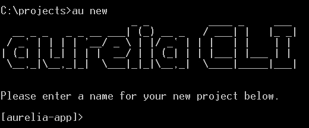
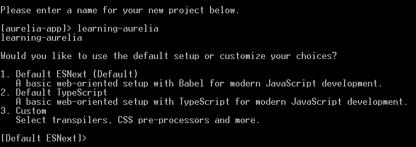
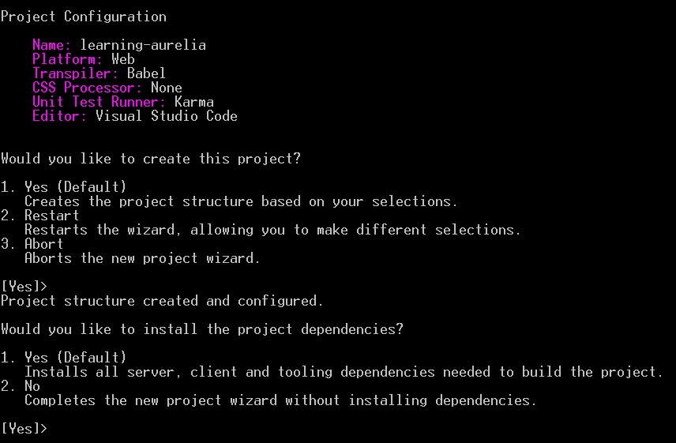

# 第一章开始

开发人员经验是 Aurelia 的关键优势。它的作者仔细关注了开发过程的各个方面，因此使用该框架是无缝和流畅的，因此学习曲线尽可能平滑。

这本书谦虚地试图遵循同样的哲学。它将教您如何使用 Aurelia 从 A 到 Z 构建真实世界的应用。事实上，在阅读本书和遵循代码示例的同时，您也将这样做。您将从设置开发环境和创建项目开始，然后我将引导您了解路由、模板、数据绑定、自动测试、国际化和捆绑等概念。我们将讨论应用设计、组件之间的通信以及第三方的集成。我们将涵盖大多数现代、真实的单页应用所需的每一个主题。

在第一章中，我们将首先定义一些贯穿全书的术语。我们将快速介绍一些核心的 Aurelia 概念。然后，我们将了解核心 Aurelia 库，并了解它们如何相互作用以形成一个完整、功能齐全的框架。我们还将了解开发 Aurelia 应用需要哪些工具以及如何安装它们。最后，我们将开始创建应用并探索其全局结构。

# 术语

由于本书是关于 JavaScript 框架的，JavaScript 在其中扮演着核心角色。如果你不完全了解这个术语，这在过去几年里发生了很大变化，那么让我澄清一些事情。

JavaScript（或 JS）是**ECMAScript**（**ES**标准）的方言或实现。它不是唯一的实现，但肯定是最流行的。在本书中，我将使用 JS 首字母缩略词来讨论实际的 JavaScript 代码或代码文件，在讨论 ECMAScript 标准的实际版本时，使用 ES 首字母缩略词。

与计算机编程中的一切一样，ECMAScript 标准也会随着时间的推移而发展。在撰写本文时，最新版本为**ES2016**，于 2016 年 6 月发布。原名为**ES7，**，但起草规范的委员会**TC39**决定更改其批准和命名模式，因此改名为新名称。

命名模式变更前的上一个版本名为**ES2015**（**ES6**），于 2015 年 6 月发布，与之前的版本相比向前迈进了一大步。这个名为**ES5**的旧版本于 2009 年发布，是六年来最新的版本，因此现在所有现代浏览器都广泛支持它。如果您在过去五年中一直在编写 JavaScript，那么您应该熟悉 ES5。

当他们决定更改 ES 命名模型时，TC39 委员会还选择更改规范的批准模型。这一决定是为了更快地发布该语言的新版本。因此，社区正在起草和讨论新功能，并且必须通过批准流程。每年都会发布一个新版本的规范，包括当年批准的功能。

这些即将推出的功能通常被称为**ESNext**。该术语包括已批准或至少接近批准但尚未发布的语言特性。可以合理预期，这些特性中的大部分或至少部分将在下一个语言版本中发布。

由于 ES2015 和 ES2016 仍然是最新版本，大多数浏览器并不完全支持它们。此外，ESNext 功能通常根本不支持浏览器。

那些多个名字可能会让人很困惑。为了使事情更简单，我将坚持使用官方名称 ES5 作为上一个版本，ES2016 作为当前版本，ESNext 作为下一个版本。但那只是我的偏好；在下面的章节中，我们可能会遇到一些仍然使用原始术语的工具或库。

在继续之前，您应该熟悉 ES2016 引入的功能以及 ESNext 装饰师（如果您还不熟悉的话）。我们将在整本书中使用这些功能。

### 注

如果您不知道从哪里开始 ES2015 和 ES2016，您可以在 Babel 的网站上找到新功能的概述：

[https://babeljs.io/docs/learn-es2015/](https://babeljs.io/docs/learn-es2015/)

至于 ESNext 装饰师，谷歌工程师艾迪·奥斯马尼（Addy Osmani）对他们做了很好的解释：

[https://medium.com/google-developers/exploring-es7-decorators-76ecb65fb841](https://medium.com/google-developers/exploring-es7-decorators-76ecb65fb841)

为了进一步阅读，您可以查看未来 ES 版本的功能建议（装饰器、类属性声明、异步函数等）：

[https://github.com/tc39/proposals](https://github.com/tc39/proposals)

# 核心概念

在我们开始动手之前，有几个核心概念需要解释。

## 公约

首先，奥雷莉亚非常依赖传统。这些约定中的大多数都是可配置的，如果不适合您的需要，可以进行更改。每一次我们在书中遇到一个惯例，我们都会看到如何尽可能地改变它。

## 组件

组件是奥雷利亚的一等公民。什么是 Aurelia 组件？它是一对 HTML 模板，称为**视图**，和一个 JavaScript 类，称为**视图模型**。视图负责显示构件，而视图模型控制其数据和行为。通常，视图位于`.html`文件中，视图模型位于`.js`文件中。按照惯例，这两个文件是通过命名规则绑定的，它们必须位于同一目录中，并且具有相同的名称（当然，扩展名除外）。

下面是一个没有数据、没有行为和静态模板的空组件示例：

`component.js`

```js
export class MyComponent {} 

```

`component.html`

```js
<template> 
  <p>My component</p> 
</template> 

```

组件必须符合两个约束，视图的根 HTML 元素必须是`template`元素，视图模型类必须从`.js`文件导出。根据经验，组件的 JS 文件应该导出的唯一函数应该是视图模型类。如果导出了多个类或函数，Aurelia 将迭代文件导出的函数和类，并使用它找到的第一个作为视图模型。但是，根据 ES 规范，由于对象键的枚举顺序是不确定的，因此无法保证导出将以声明的相同顺序进行迭代，因此 Aurelia 可能会选择错误的类作为组件的视图模型。

该规则的唯一例外是一些视图资源，我们将在[第 3 章](03.html "Chapter 3. Displaying Data")、*显示数据*和[第 5 章](05.html "Chapter 5. Making Reusable Components")、*制作可重用组件*中看到。除了视图模型类之外，组件的 JS 文件还可以导出诸如值转换器、绑定行为和自定义属性之类的内容，基本上可以导出任何不具有视图的视图资源（不包括自定义元素）。

组件是 Aurelia 应用的主要构建块。组件可以使用其他组件；它们可以组合成更大或更复杂的组件。由于插槽机制，您可以设计组件的模板，以便替换或自定义组件的某些部分。我们将在下一章中看到所有这些。

# 建筑

Aurelia 不是一般的单一框架。它是一组松散耦合的库，具有定义良好的抽象。它的每个核心库都解决了单页应用常见的特定且定义良好的问题。Aurelia 利用依赖注入和插件体系结构，因此您可以放弃框架的某些部分，用第三方甚至您自己的实现替换它们。或者你可以扔掉你不需要的功能，这样你的应用更轻，加载速度更快。我们将在[第 2 章](02.html "Chapter 2. Layout, Menu, and Getting Familiar")、*布局、菜单和熟悉*中深入探讨这个插件机制。

核心 Aurelia 库可分为多个类别。让我们快速浏览一下。

## 核心特征

以下库大部分是独立的，如果需要，它们可以自己使用。它们都提供了一组集中的功能，是 Aurelia 的核心：

*   `aurelia-dependency-injection`：一个轻量级但功能强大的依赖注入容器。它支持多种生命周期管理策略和子容器。
*   `aurelia-logging`：一个简单的记录器，支持日志级别和可插拔的使用者。
*   `aurelia-event-aggregator`：一种轻量级消息总线，用于解耦通信。
*   `aurelia-router`：客户端路由器，支持静态、参数化或通配符路由，支持子路由器。
*   `aurelia-binding`：一个自适应、可插拔的数据绑定库。
*   `aurelia-templating`：一个可扩展的 HTML 模板引擎。

## 抽象层

以下库主要定义接口和抽象，以便解耦关注点并实现可扩展性和可插拔行为。这并不意味着上一节中的一些库除了其特性之外，不公开它们自己的抽象。他们中的一些人是这样做的。但本节中描述的库除了定义抽象之外几乎没有其他用途：

*   `aurelia-loader`：定义用于加载 JS 模块、视图和其他资源的接口的抽象。
*   `aurelia-history`：定义路由使用的历史管理接口的抽象。
*   `aurelia-pal`：平台特定功能的抽象。它用于抽象出运行代码的平台，例如浏览器或 Node.js。实际上，这意味着一些 Aurelia 库可以在服务器端使用。

## 默认实现

以下库是前两节中的库公开的抽象的默认实现：

*   `aurelia-loader-default`：基于 SystemJS 和`require`的加载程序的`aurelia-loader`抽象实现。
*   `aurelia-history-browser`：基于标准浏览器哈希更改和推送状态机制的`aurelia-history`抽象实现。
*   `aurelia-pal-browser`：浏览器`aurelia-pal`抽象的实现。
*   `aurelia-logging-console`：浏览器控制台`aurelia-logging`抽象的实现。

## 集成层

以下库的目的是将一些核心库集成在一起。它们提供接口实现和适配器，以及默认配置或行为：

*   `aurelia-templating-router`：在`aurelia-router`和`aurelia-templating`库之间的集成层。
*   `aurelia-templating-binding`：在`aurelia-templating`和`aurelia-binding`库之间的集成层。
*   `aurelia-framework`：一个集成层，将所有核心 Aurelia 库整合到一个全功能框架中。
*   `aurelia-bootstrapper`：集成层，为`aurelia-framework`带来默认配置，处理应用启动。

## 其他工具和插件

如果你看一下 GitHub 上的 Aurelia 组织页面[https://github.com/aurelia](https://github.com/aurelia) 您将看到更多的存储库。前面几节中列出的库只是 Aurelia 的核心，如果可以的话，它只是冰山一角。GitHub 上还提供了许多其他公开附加功能或集成第三方库的库，其中一些由 Aurelia 团队开发和维护，许多由社区开发和维护。我们将在后面的章节中介绍一些额外的库，但我强烈建议您在阅读本书后自己探索奥雷利亚生态系统，因为它正在迅速发展，奥雷利亚社区正在做一些非常令人兴奋的事情。

# 工装

在下一节中，我们将介绍开发 Aurelia 应用所需的工具。

## Node.js 与 NPM

Aurelia 作为一个 JavaScript 框架，它的开发工具也使用 JavaScript 是有道理的。这意味着您在开始使用 Aurelia 时需要做的第一件事是在您的开发环境中安装 Node.js 和 NPM。

### 注

js 是一个基于 Google 的 V8 JavaScript 引擎的服务器端运行时环境。它可以用于构建完整的网站或 web API，但许多前端项目也使用它进行开发和构建任务，如传输、linting 和最小化。

NPM 实际上是 Node.js 的包管理器。它使用[http://www.npmjs.com](http://www.npmjs.com) 作为其主存储库，存储所有可用包。它与 Node.js 捆绑在一起，因此如果您在计算机上安装 Node.js，也将安装 NPM。

要在您的开发环境中安装 Node.js 和 NPM，只需转到[https://nodejs.org/](https://nodejs.org/) 下载适合您环境的安装程序。

如果 Node.js 和 NPM 已经安装，我强烈建议您确保至少使用 NPM 的版本 3，因为旧版本可能会在与我们将使用的其他一些工具协作时遇到问题。如果不确定所使用的版本，可以在控制台中运行以下命令进行检查：

```js
> npm -v

```

如果 Node.js 和 NPM 已经安装，但您需要升级 NPM，则可以通过运行以下命令进行升级：

```js
> npm install npm -g

```

## 奥雷利亚 CLI

尽管可以使用您想要的任何包管理器、构建系统或绑定器构建 Aurelia 应用，但管理 Aurelia 项目的首选工具是命令行界面，即 CLI。

在撰写本文时，CLI 仅支持 NPM 作为其包管理器，`requirejs`作为其模块加载器和绑定器，这可能是因为它们都是最成熟和最稳定的。它还在幕后使用 Gulp4 作为构建系统。

即使在开发环境中，基于 CLI 的应用在运行时也总是捆绑在一起。这意味着在开发过程中应用的性能将非常接近其在生产中的性能。这也意味着绑定是一个经常性的问题，因为必须将新的外部库添加到某些绑定中才能在运行时可用。我们将在[第 10 章](10.html "Chapter 10. Bundling for Production")、*生产捆绑*中详细介绍。

在本书中，我们将坚持使用首选解决方案并使用 CLI。然而，本书末尾有两个附录，涵盖了替代方案，第一个附录用于 Webpack，第二个附录用于带 JSPM 的 SystemJS。

### 安装 CLI

CLI 是一个命令行工具，应通过打开控制台并执行以下命令全局安装：

```js
> npm install -g aurelia-cli

```

根据您的环境，您可能必须以管理员权限运行此命令。

如果已安装，请通过运行以下命令确保安装了最新版本：

```js
> au -v

```

然后，您可以将此命令输出的版本与 GitHub 上标记的最新版本号进行比较，位置为[https://github.com/aurelia/cli/releases/latest](https://github.com/aurelia/cli/releases/latest) 。

如果没有最新版本，只需运行以下命令进行更新：

```js
> npm install -g aurelia-cli

```

如果出于某种原因，更新 CLI 的命令失败，只需卸载，然后重新安装即可：

```js
> npm uninstall aurelia-cli -g
> npm install aurelia-cli -g

```

这将重新安装最新版本。

# 项目框架

作为 CLI 的替代方案，项目框架可在[处获得 https://github.com/aurelia/skeleton-navigation](https://github.com/aurelia/skeleton-navigation) 。此存储库包含多个示例项目，它们使用不同的技术，如 SystemJS with JSPM、Webpack、ASP.Net Core 或 TypeScript。

准备骨架很容易。您只需从 GitHub 下载并解压缩归档文件，或在本地克隆存储库。每个目录都包含一个不同的框架。根据您选择的工具，您需要安装不同的工具并运行安装命令。一般来说，骨架的`README.md`文件中的说明非常清楚。

这些框架是使用不同技术开始新应用的其他良好起点。本书末尾的两个附录展示了如何使用其中的一部分来使用 SystemJS 和 JSPM 或 Webpack 构建应用。

除了这些附录之外，本书的其余部分将继续使用 CLI。

## 我们的申请

使用 CLI 创建 Aurelia 应用非常简单。您只需在要创建项目的目录中打开控制台，然后运行以下命令：

```js
> au new

```

CLI 的项目创建过程将启动，您应该看到如下内容：



CLI 要求的第一件事是您希望为项目指定的名称。此名称将用于创建项目所在的目录，并设置一些值，例如它将创建的`package.json`文件中的`name`属性。让我们将我们的应用命名为`learning-aurelia`：



接下来，CLI 询问我们希望使用什么技术来开发应用。在这里，您可以选择自定义 transpiler（如 TypeScript）和 CSS 预处理器（如 LESS 或 SASS）。

### 注

transpiler 是编译器的近亲，它将一种编程语言翻译成另一种编程语言。在我们的例子中，它将用于将 ESNext 代码（并非所有浏览器都支持）转换为 ES5，所有现代浏览器都能理解 ES5。

默认选择是使用 ESNext 和纯 CSS，这是我们将选择的：



下面的步骤简单地回顾了我们所做的选择，并要求确认创建项目，然后询问我们是否希望安装项目的依赖项，默认情况下它会这样做。此时，CLI 将创建项目并在幕后运行`npm install`。完成后，我们的应用即可开始运行：


此时，您在其中运行`au new`的目录将包含一个名为`learning-aurelia`的新目录。此子目录将包含 Aurelia 项目。我们将在下一节中对此进行探讨。

### 注

CLI 将来可能会发生变化并提供更多选项，因为有计划支持其他工具和技术。如果在运行时看到不同的或新的选项，不要感到惊讶。

我们创建项目所遵循的路径使用 Visual Studio 代码作为默认代码编辑器。如果您想使用其他编辑器，如**Atom**、**Sublime**或**WebStorm**，这些都是编写时支持的其他选项，您只需在创建过程开始时选择选项#3 自定义 transpilers、CSS 预处理器等，然后为每个问题选择默认答案，直到被要求选择默认代码编辑器。创建过程的其余部分应该保持大致相同。请注意，如果选择不同的代码编辑器，您自己的体验可能与本书中的示例和屏幕截图有所不同，因为 Visual Studio 代码是编写过程中使用的编辑器。

如果您是 TypeScript 开发人员，则可能需要创建 TypeScript 项目。不过，我建议您坚持使用纯 ESNext，因为本书中的每个示例和代码示例都是用 JS 编写的。尝试使用 TypeScript 可能会很麻烦，不过如果您喜欢这个挑战，也可以尝试一下。

## 基于 CLI 的项目结构

如果在代码编辑器中打开新创建的项目，则应看到以下文件结构：

*   `node_modules`：包含项目依赖项的标准 NPM 目录
*   `src`：包含应用源代码的目录
*   `test`：包含应用自动测试套件的目录，我们将在[第 7 章](07.html "Chapter 7. Test All the Things")、*测试所有东西*中探讨
*   `.babelrc`：Babel 的配置文件，CLI 使用该文件将我们的应用的 ESNext 代码传输到 ES5 中，以便大多数浏览器可以运行它
*   `index.html`：加载并启动应用的 HTML 页面
*   `karma.conf.js`：CLI 用于运行单元测试的**Karma**配置文件；
*   `package.json`：标准 Node.js 项目文件

该目录包含其他文件，如`.editorconfig`、`.eslintrc.json`和`.gitignore`，这些文件对学习奥雷莉亚不感兴趣，因此我们将不介绍它们。

除此之外，您还应该看到一个名为`aurelia_project`的目录。此目录包含与使用 CLI 构建和绑定应用相关的内容。让我们看看是什么做的。

### aurelia.json 文件

在这个目录中，第一件重要的事情是一个名为`aurelia.json`的文件。此文件包含 CLI 用于测试、构建和绑定应用的配置。根据您在项目创建过程中所做的选择，此文件可能会发生巨大变化。

### 注

很少有需要手动修改此文件的情况。将外部库添加到应用就是这样一种场景，我们将在下一章中多次面对这种场景。除此之外，此文件通常不应手动更新。

本文件中第一个有趣的部分是`platform`：

```js
"platform": { 
  "id": "web", 
  "displayName": "Web", 
  "output": "scripts", 
  "index": "index.html" 
}, 

```

本节告诉 CLI 写入捆绑包的输出目录名为`scripts`。它还告诉我们，将加载并启动应用的 HTML 索引页就是`index.html`文件。

下一个有趣的部分是`transpiler`部分：

```js
"transpiler": { 
  "id": "babel", 
  "displayName": "Babel", 
  "fileExtension": ".js", 
  "options": { 
    "plugins": [ 
      "transform-es2015-modules-amd" 
    ] 
  }, 
  "source": "src/**/*.js" 
}, 

```

本节告诉 CLI 使用 Babel 传输应用的源代码。它还定义了额外的插件，因为一些插件已经在`.babelrc`中配置好，以便在传输源代码时使用。在这种情况下，它添加了一个插件，将传输的文件作为 AMD 兼容模块输出，以实现`requirejs`兼容性。

本文件中还有许多其他章节，其中一些我们将在后续章节中介绍，还有一些我留给你们自己去探索。

### 任务

`aurelia_project`目录包含名为`tasks`的子目录。此子目录包含用于构建、运行和测试应用的各种 Gulp 任务。可以使用 CLI 执行这些任务。

您可以尝试的第一件事是在没有任何争论的情况下运行`au`：

```js
> au

```

这将列出所有可用命令及其可用参数。此列表包括内置命令，如我们已经使用过的`new`，或我们将在下一节中看到的`generate`，以及在`tasks`目录中声明的 Gulp 任务。

要运行其中一个任务，只需以任务名称作为第一个参数执行`au`：

```js
> au build

```

此命令将运行`aurelia_project/tasks/build.js`中定义的`build`任务。此任务使用 Babel 传输应用代码，执行 CSS 和标记预处理器（如果有），并将代码捆绑到`scripts`目录中。

运行之后，您应该会在`scripts`中看到两个新文件：`app-bundle.js`和`vendor-bundle.js`。这些是应用启动时`index.html`将加载的实际文件。前者包含所有应用代码、JS 文件和模板，而后者包含应用使用的所有外部库，包括 Aurelia 库。我们将在[第 10 章](10.html "Chapter 10. Bundling for Production")、*生产捆绑*中学习如何定制捆绑。

您可能已经注意到在可用命令列表中有一个名为`run`的命令。此任务在`aurelia_project/tasks/run.js`中定义，并在生成本地 HTTP 服务器以服务于应用之前在内部执行`build`任务：

```js
> au run

```

默认情况下，HTTP 服务器将侦听端口 9000 上的请求，因此您可以打开喜爱的浏览器并转到 http://localhost:9000/ 查看运行中的默认演示应用。

### 注

如果您需要更改运行开发 HTTP 服务器的端口号，只需打开`aurelia_project/tasks/run.js`，并找到对`browserSync`函数的调用。传递给此函数的对象包含名为`port`的属性。您可以相应地更改其值。

`run`任务可以接受`--watch`开关：

```js
> au run --watch

```

如果存在此开关，任务将继续监视源代码，并且在任何代码文件更改时，将重建应用并自动刷新浏览器。这在开发过程中非常有用。

### 发电机

CLI 还提供了一种使用`aurelia_project/generators`目录中定义的类生成代码的方法。在编写本文时，有生成器可以创建自定义属性、自定义元素、绑定行为、值转换器，甚至任务和生成器。是的，有生成器可以生成生成器。

### 注

如果您对 Aurelia 一点也不熟悉，那么这些概念、值转换器、绑定行为以及自定义属性和元素可能对您来说毫无意义。别担心，我们将在下一章中介绍这些主题。

可以使用内置的`generate`命令执行生成器：

```js
> au generate attribute

```

此命令将运行自定义属性生成器。它将要求生成属性的名称，然后在`src/resources/attributes`目录中创建它。

如果您查看在`aurelia_project/generators/attribute.js`中找到的这个生成器，您将看到该文件导出一个名为`AttributeGenerator`的类。这个类使用`@inject`装饰器（我们将在[第 2 章](02.html "Chapter 2. Layout, Menu, and Getting Familiar")中看到更详细的内容，*布局、菜单和熟悉）*将`aurelia-cli`库中的各种类声明为依赖项，并在其构造函数中注入它们的实例。它还定义了一个`execute`方法，该方法在运行生成器时由 CLI 调用。此方法利用`aurelia-cli`提供的服务与用户交互并生成代码文件。

### 注

默认情况下可用的确切生成器名称为`attribute`、`element`、`binding-behavior`、`value-converter`、`task`和`generator`。

### 环境

基于 CLI 的应用支持特定于环境的配置值。默认情况下，CLI 支持三种环境：开发环境、暂存环境和生产环境。每个环境的配置对象都可以在`aurelia_project/environments`目录中的不同文件`dev.js`、`stage.js`和`prod.js`中找到。

典型的环境文件如下所示：

`aurelia_project/environments/dev.js`

```js
export default { 
  debug: true, 
  testing: true 
}; 

```

默认情况下，环境文件用于在 Aurelia 框架中启用调试日志记录和仅测试模板功能，具体取决于环境。我们将在下一节中看到这一点。但是，可以使用您可能需要的任何属性来增强环境对象。通常，它可以用于为后端配置不同的 URL，具体取决于环境。

添加一个新环境只需在`aurelia_project/environments`目录中为其添加一个文件即可。例如，您可以通过在目录中创建一个`local.js`文件来添加`local`环境。

许多任务，基本上是`build`和所有其他使用它的任务，例如`run`和`test`都希望使用`env`参数指定环境：

```js
> au build --env prod

```

在这里，应用将使用`prod.js`环境文件构建。

如果没有提供`env`参数，则默认使用`dev`。

### 注

执行时，`build`任务只需将适当的环境文件复制到`src/environment.js`，然后运行 transpiler 并绑定输出。这意味着不应手动修改`src/environment.js`，因为它将被`build`任务自动覆盖。

## Aurelia 应用的结构

上一节描述了特定于基于 CLI 的项目的文件和文件夹。然而，无论构建系统和包管理器是什么，项目的某些部分几乎是相同的。这些是我们将在本节中看到的更具全球性的主题。

### 托管页面

Aurelia 应用的第一个入口点是加载和托管 HTML 页面。默认情况下，此页面名为`index.html`，位于项目的根目录下。

默认宿主页面如下所示：

`index.html`

```js
<!DOCTYPE html> 
<html> 
  <head> 
    <meta charset="utf-8"> 
    <title>Aurelia</title> 
  </head> 

  <body aurelia-app="main"> 
    <script src="scripts/vendor-bundle.js"  
            data-main="aurelia-bootstrapper"></script> 
  </body> 
</html> 

```

加载此页面时，`body`元素中的`script`元素加载`scripts/vendor-bundle.js`文件，该文件包含`requirejs`本身以及所有外部库的定义和对`app-bundle.js`的引用。加载时，`requirejs`检查`data-main`属性并将其值用作入口点模块。这里，`aurelia-bootstrapper`开始起作用。

引导程序首先在 DOM 中查找具有`aurelia-app`属性的元素。我们可以在默认的`index.html`文件中的`body`元素上找到这样的属性。此属性标识用作应用视口的元素。引导程序使用该属性的值作为应用主模块的名称，并定位该模块，加载该模块，并在元素内呈现生成的 DOM，覆盖以前的任何内容。应用现在正在运行。

### 注

即使默认应用没有说明这种情况，HTML 文件也可以承载多个 Aurelia 应用。它只需要包含多个具有`aurelia-app`属性的元素，每个元素都引用自己的主模块。

### 主模块

按照惯例，`aurelia-app`属性引用的主模块名为`main`，因此位于`src/main.js`下。该文件将导出一个`configure`函数，该函数将由 Aurelia 引导过程调用，并将传递一个用于配置和引导框架的配置对象。

默认情况下，`configure`主功能如下：

`src/main.js`

```js
import environment from './environment'; 

export function configure(aurelia) { 
  aurelia.use 
    .standardConfiguration() 
    .feature('resources'); 

  if (environment.debug) { 
    aurelia.use.developmentLogging(); 
  } 

  if (environment.testing) { 
    aurelia.use.plugin('aurelia-testing'); 
  } 

  aurelia.start().then(() => aurelia.setRoot()); 
} 

```

`configure`函数首先告诉 Aurelia 使用其默认配置，并加载`resources`功能，我们将在[第 2 章](02.html "Chapter 2. Layout, Menu, and Getting Familiar")、*布局、菜单和熟悉*中了解功能的工作原理。它还根据环境的`debug`属性有条件地加载开发日志插件，以及基于环境`testing`属性的测试插件。这意味着，默认情况下，两个插件都将在开发中加载，而没有一个插件将在生产中加载。

最后，函数启动框架，然后将根组件附加到 DOM。

### 注

`start`方法返回一个`Promise`，其解析触发对`setRoot`的调用。如果您对 JavaScript 中的`Promise`不熟悉，我强烈建议您在进一步研究之前先查阅，因为它们是 Aurelia 中的核心概念。

### 根成分

任何 Aurelia 应用的根都是一个组件，它包含应用中的所有内容。按照惯例，这个根组件被命名为`app`。它由两个文件组成`app.html`，其中包含用于呈现组件的模板，以及`app.js`，其中包含其视图模型类。

在默认应用中，模板非常简单：

`src/app.html`

```js
<template> 
  <h1>${message}</h1> 
</template> 

```

此模板由单个`h1`元素组成，该元素将包含视图模型的`message`属性值作为文本，这要归功于字符串插值，我们将在[第 3 章](03.html "Chapter 3. Displaying Data")、*显示数据*中详细探讨。

`app`视图模型如下所示：

`src/app.js`

```js
export class App { 
  constructor() { 
    this.message = 'Hello World!'; 
  } 
} 

```

此文件仅导出具有包含字符串`Hello World!`的`message`属性的类。

此组件将在应用启动时呈现。如果您运行应用并在您喜爱的浏览器中导航到该应用，您将看到一个包含`Hello World!`的`h1`元素。

您可能会注意到，在这个组件的代码中没有对 Aurelia 的引用。事实上，视图模型只是普通的 ESNext，Aurelia 可以按原样使用它。当然，我们稍后将在我们的许多视图模型中利用许多 Aurelia 功能，因此我们的大多数视图模型实际上都依赖于 Aurelia 库，但这里的关键点是，如果您不想在视图模型中使用任何 Aurelia 库，因为 Aurelia 被设计得尽可能不引人注目。

## 常规自举

可以将托管页面中的`aurelia-app`属性保留为空：

```js
<body aurelia-app> 

```

在这种情况下，引导过程要简单得多。引导程序不会加载包含`configure`函数的主模块，而是简单地使用框架的默认配置并加载`app`组件作为应用根。

对于一个非常简单的应用来说，这是一种更简单的入门方式；因为它不需要`src/main.js`文件，所以您可以简单地删除它。但是，这意味着您必须使用默认的框架配置。无法加载功能或插件。对于大多数实际应用，您需要保留主模块，这意味着将其指定为`aurelia-app`属性的值。

## 定制 Aurelia 配置

主模块`configure`功能接收配置对象，用于配置框架：

`src/main.js`

```js
//Omitted snippet... 
aurelia.use 
  .standardConfiguration() 
  .feature('resources'); 

if (environment.debug) { 
  aurelia.use.developmentLogging(); 
} 

if (environment.testing) { 
  aurelia.use.plugin('aurelia-testing'); 
} 
//Omitted snippet... 

```

这里，`standardConfiguration()`方法是一个简单的助手，它封装了以下内容：

```js
aurelia.use 
  .defaultBindingLanguage() 
  .defaultResources() 
  .history() 
  .router() 
  .eventAggregator(); 

```

这是默认的 Aurelia 配置。它加载默认绑定语言、默认模板资源、浏览器历史插件、路由器插件和事件聚合器。这是典型的 Aurelia 应用使用的默认特性集。所有这些插件都将在本书中的某一点上介绍。除了模板引擎需要的绑定语言之外，所有这些插件都是可选的。如果你不需要，就不要加载它。

除了标准配置之外，还根据环境的设置加载一些插件。当环境的`debug`属性为`true`时，Aurelia 的控制台记录器使用`developmentLogging()`方法加载，因此可以在浏览器控制台中看到跟踪和错误。当环境的`testing`属性为`true`时，使用`plugin`方法加载`aurelia-testing`插件。这个插件注册了一些在调试组件时有用的资源。

`configure`函数中的最后一行启动应用并显示其根组件，按惯例命名为`app`。但是，您可以绕过约定，将根组件的名称作为第一个参数传递给`setRoot`，如果您以其他方式命名：

```js
aurelia.start().then(() => aurelia.setRoot('root')); 

```

这里，根组件应该位于`src/root.html`和`src/root.js`文件中。

# 总结

多亏了 CLI，Aurelia 的入门非常简单。安装工具并创建一个空项目只需运行几个命令，等待初始 NPM 安装完成通常比实际安装花费更多的时间。

在下一章中，我们将介绍依赖项注入和日志记录，我们将通过添加组件和配置在它们之间导航的路由来开始构建应用。