# 一、让我们从 Sencha Touch 开始！

随着移动设备、手机和平板电脑的日益普及，消费者已迅速转向使用基于触摸的操作系统和应用。这种受欢迎程度让开发者可以选择多种平台，包括苹果的 iOS（iPhone、iTouch 和 iPad）、谷歌的安卓（Android）、WindowsMobile7 等。不幸的是，这种丰富多样的平台带来了同样丰富多样的编程语言供选择。选择任何一种语言通常会将您锁定在特定的平台或设备中。

SenchaTouch 通过提供基于 JavaScript、HTML5 和 CSS 的框架消除了这一障碍。这些标准在大多数现代浏览器和移动设备上都得到了强有力的支持。通过使用基于这些标准的框架，您可以将应用部署到多个平台，而无需完全重写代码。

本书将帮助您熟悉 Sencha Touch，从基本设置到构建复杂的应用。我们还将介绍框架和触摸应用的一些基本知识，并提供有关如何设置开发环境和以多种不同方式部署应用的提示。

在本章中，我们将介绍以下内容：

*   框架
*   移动应用框架
*   为触摸屏设计应用
*   Sencha Touch 入门
*   设置开发环境
*   使用 Sencha Touch 开发的其他工具

# 框架

**框架**是一组可重用的代码，它提供了一组对象和函数，您可以使用这些对象和函数在构建应用时抢占先机。框架的主要目标是防止您在每次构建应用时重新发明轮子。

一个写得好的框架也有助于提供一些一致性度量，并轻轻地推动您遵循标准实践。这种一致性还使框架更易于学习。这种可重用性和易学性的关键是两个编码概念，称为**对象**和**继承。**

大多数框架，如 Sencha Touch，都是围绕一种**面向对象编程（OOP）**风格构建的。OOP 背后的思想是，代码是围绕简单的基本对象设计的。基本对象将具有它可以执行的某些属性和函数。

例如，假设我们有一个名为 `wheeled vehicle`的对象。我们的轮式车辆具有以下几个特性：

*   一个或多个轮子
*   一个或多个座位
*   转向装置

它还有一些功能：

*   `Move Forward`
*   `Move Backward`
*   `Move Left`
*   `Move Right`
*   `Stop`

这是我们的基本目标。创建此基础对象后，我们可以对其进行扩展以添加更多功能和属性。这允许我们创建更复杂的对象，例如自行车、摩托车、汽车、卡车、公共汽车等等。这些复杂对象中的每一个都比我们的基本轮式对象做得更多，但它也继承了原始对象的属性和能力。如果需要的话，我们甚至可以覆盖原来的功能，比如让我们的 `Move Forward`功能在汽车上比在自行车上运行得更快。

这意味着我们可以制造许多不同类型的轮式车辆，而不必重新创建我们的原始工作。我们甚至可以构建更复杂的对象。例如，一旦我们有了一辆普通车，我们就可以制造从大众到法拉利的一切，只需为特定车型添加新的属性和功能。

让我们从 Shanch Touch 本身的一个更具体的例子来看，PosiT0.容器 PosiT1 对象。

容器对象是 Sencha Touch 的基本构建块之一。顾名思义，它设计用于保存其他项目，如按钮、字段、工具栏等。容器对象有 40 多个不同的配置选项，可以控制简单的事情，例如：

*   身高
*   宽度
*   衬料
*   边缘

配置选项还控制更复杂的行为，例如：

*   **布局：**确定容器中物品的定位方式
*   **监听器：**确定容器应该注意哪些事件，以及在听到事件时应该做什么

该容器还可以执行 60 多种方法或操作。这些方法包括简单的事情，例如：

*   `Show`
*   `Hide`
*   `Enable`
*   `Disable`
*   `Set Height`
*   `Set Width`

还有更复杂的方法，例如：

*   `Query:`在容器中搜索特定项目
*   `Update:`获取 HTML 或数据，并更新容器的内容

该容器还具有许多可以使用的属性和它可以侦听的事件。

此基本容器对象在 Sencha Touch 中用作构建块，用于创建按钮、面板、表单字段和其他更复杂的对象。这些子对象或子对象继承容器对象（父对象）的所有功能和属性。每个都包括相同的高度、宽度等配置选项。他们将知道如何做容器可以做的所有事情—显示、隐藏等等。

这些子对象中的每一个子对象还将具有其自身的其他独特配置和方法。例如，按钮具有设置其标题的附加文本属性，并且按钮还可以在用户单击按钮时显示。通过扩展容器对象，创建按钮的人只需为这些额外的配置和方法编写代码。

从编码的角度来看，对象和继承意味着我们可以重用大量的工作。这还意味着，当我们遇到诸如 Sencha Touch 之类的新语言时，我们可以使用所学的基本代码对象来快速理解更复杂的对象。

## 从地基上建筑

除了提供可重用性之外，框架还为您提供了一组核心对象和函数，这些对象和函数通常用于构建应用。这可以防止您在每次启动新应用时从头开始。

这些代码对象通常处理用户输入、操作或查看数据的大多数方式。它们还涵盖了在应用后台执行的常见任务，例如管理数据、处理会话、处理不同的文件格式以及格式化或转换不同类型的数据。

对于大多数框架来说，您希望执行的任何常见任务都有可能已经被考虑，只是等待您的发现。一旦您熟悉 Sencha Touch 等框架提供的各种对象和功能，您就可以快速、高效地开发应用：

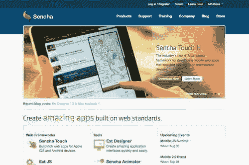

## 有平面图的建筑物

在任何框架中都需要查找的关键内容之一是文档。一个没有文档的框架，或者更糟糕的是，一个有糟糕文档的框架，只是一个受挫的练习。好的文档应该提供关于框架中每个对象、属性、方法和事件的低级信息。它还应该提供更一般化的信息，例如在各种情况下如何使用代码的示例。

文档和示例是 Sencha Touch 作为框架的两大优势。在 Sencha 的主要网站[上提供了大量信息 http://www.sencha.com](http://www.sencha.com) ，**API 文件****森茶触控**下。

一个设计良好的框架还维护着一套标准和实践。这些可以是简单的事情，比如对变量名使用 camel-case（例如， `myVariable)`），也可以是更复杂的注释和记录代码的实践。这些标准和实践的关键是一致性。

一致性使您能够快速学习语言，并直观地理解在哪里可以找到问题的答案。这有点像有一个建筑计划；你知道事情是如何安排的，以及如何快速到达你需要去的地方。

框架还将通过提供一个编码结构和一致性示例，帮助您了解如何构建自己的应用。

在这方面，Sencha 已尽一切努力鼓励一致性，遵守标准，并为 Sencha Touch 框架提供广泛的文档。这使得 Sencha Touch 成为初学者非常有效的第一语言。

## 有社区的建筑

框架很少孤立存在。开发人员组倾向于围绕特定的框架进行收集，并形成社区。这些社区是提问和学习新语言的绝佳场所。

与所有社区一样，有许多不成文的规则和习俗。在发布问题之前，一定要花时间通读论坛，以防问题已经被提出和回答。

Sencha Touch 拥有一个活跃的开发者社区，其论坛可从 Sencha 主网站[访问 http://www.sencha.com/](http://www.sencha.com/) （选择页面顶部的**论坛**链接，然后找到**森茶触摸**论坛）。

# 移动应用框架

移动应用框架需要解决与标准框架不同的功能。与传统的桌面应用不同，移动设备处理的是触摸和滑动，而不是鼠标点击。键盘是屏幕的一部分，如果不是不可能的话，也会使传统的键盘导航命令变得困难。为了理解这些约束，我们可以从研究不同类型的移动框架及其工作方式开始。

## 本地应用与 web 应用

移动应用框架有两种基本类型：一种是构建**本地应用**，另一种是构建**基于 web 的应用**，比如 Sencha Touch。

本机应用是直接安装在设备上的应用。它通常可以更多地访问设备的硬件（摄像头、GPS、定位硬件等）以及设备上的其他程序，如通讯簿和相册。对本机应用的更新通常要求每个用户下载更新程序的新副本。

顾名思义，基于 Web 的应用需要用户访问的公共 Web 服务器才能使用该应用。用户将使用其移动设备上的浏览器导航到您的应用网站。由于应用在 web 浏览器中运行，因此它对本地文件系统和硬件的访问较少，但也不需要用户完成复杂的下载和安装过程。对基于 web 的应用的更新可以通过对公共 web 服务器进行单个更新来完成。然后，该程序会为访问该网站的任何人自动更新。

基于 Web 的应用也可以修改为更像本机应用，甚至可以由单独的程序编译为完全本机应用：

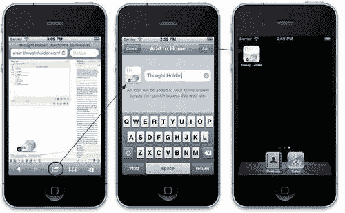

例如，用户可以导航到 web 应用，然后选择将其保存到移动设备的桌面上。这会在屏幕上放置一个图标，就像本机应用一样。它还从应用中删除浏览器导航，使应用看起来像一个完整的本机应用。设计合理的 web 应用可以使用设备的内置存储功能在本地存储数据，甚至在设备脱机时也可以正常工作。

如果您发现需要本机应用的全部功能，请使用外部编译器，如 PhoneGap（[http://www.phonegap.com/](http://www.phonegap.com/) ）可以将您基于 web 的应用编译成完整的本机应用，您可以上传并在苹果的应用商店或谷歌的 Android Marketplace 中销售。PhoneGap 还提供编程挂钩，供您访问摄像头功能、联系人列表等。

## 基于 Web 的移动框架

基于 web 的移动框架依赖于 web 浏览器来运行应用。出于几个原因，这是一条关键信息。

首先，web 浏览器必须在移动平台上保持一致。如果您以前做过任何网站开发，那么您熟悉浏览器兼容性这一痛苦的问题。根据浏览器的不同，网站的外观可能完全不同。在一个浏览器中工作的 JavaScript 在另一个浏览器中不工作。人们还倾向于保留旧浏览器而不进行更新。幸运的是，这些问题对于大多数移动设备来说都不是什么问题，对于 iOS 和 Android 来说也没有什么问题。

苹果 iOS 和谷歌 Android 的网络浏览器都基于**WebKit**引擎。WebKit 是一个开源引擎，它基本上控制浏览器如何显示页面、处理 JavaScript 和实现 web 标准。这意味着您的应用在两个平台上的工作方式应该相同。

但是，不使用 WebKit 的移动设备（如 Windows mobile）将无法使用您的应用。好消息是，随着越来越多的浏览器采用 HTML5 标准，这个问题也可能开始消失。

基于 web 的应用的第二个考虑因素是它所在的位置。在用户的设备上安装本机应用。基于 web 的应用需要安装在公共服务器上。用户需要能够在其 web 浏览器中键入 URL 并导航到您的应用。如果应用只存在于您的计算机上，那么您是唯一可以使用它的人。这对于测试来说非常好，但是如果您想让其他人使用您的应用，则需要将其托管在公共服务器上。

第三个考虑因素是连通性。如果用户无法连接到 Internet，则他们将无法使用您的应用。但是，Sencha Touch 可以配置为在本地存储您的应用及其所有数据。乍一看，此功能似乎完全否定了连接问题，但实际上，当用户使用多个设备连接到应用时，它会导致问题：

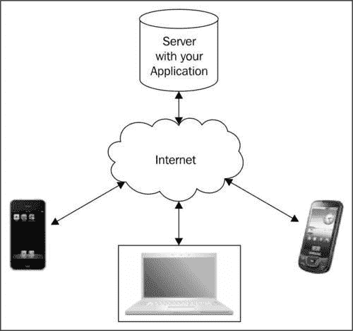

使用 web 浏览器，可以从任何地方访问基于 web 的应用。可以从移动设备、个人计算机和手机访问相同的应用。这对于信息丰富的应用来说是一个巨大的优势。例如，在基于 web 的应用中，如果我在手机上向应用输入数据，我可以从家用计算机登录，但仍然可以看到这些数据。这是因为数据与应用一起存储在远程服务器上。

但是，如果我已将应用设置为在本地存储所有内容，则我在手机中输入的任何内容都将保留在手机中，并且无法从其他位置（例如我的家用电脑）查看。如果我使用计算机访问该站点，它将创建第二个单独的本地数据集，与我的家用计算机相连。

幸运的是，Sencha Touch 可以设置为在服务器和各种设备之间同步数据。当您的应用连接到 Internet 时，它将同步任何现有的脱机数据，并使用远程服务器存储联机时完成的任何操作。这确保您可以在所有设备上访问数据，同时允许您根据需要脱机工作。

## 网络框架与触控

标准 web 框架以前被设计为在鼠标和键盘环境中工作，但移动 web 框架也必须理解触摸导航和数据输入的概念：

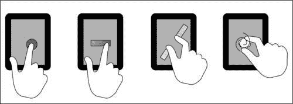

大多数基于触摸的框架都理解以下类型的触摸手势：

*   **点击：**单触屏
*   **双击：**两次快速触摸屏幕
*   **滑动：**将一根手指从左到右或从上到下在屏幕上移动
*   **捏**或**展开：**用两个手指触摸屏幕，并以捏的动作将它们放在一起，或将它们分开以反转动作
*   **旋转：**将两根手指放在屏幕上，顺时针或逆时针旋转，通常用于旋转屏幕上的物体

这些触摸交互最初仅限于本机应用框架，但 Sencha touch 和其他基于 web 的框架使其可用于 web 浏览器。

现在我们可以为我们的移动应用使用这些触摸和手势，我们也应该考虑它们如何改变我们的用户与我们的应用交互的方式。我们还应该讨论一下移动应用的潜在问题。

# 设计移动和触摸应用

移动应用需要一些思维上的改变。最大的考虑因素是规模。如果您习惯于在 21 英寸的显示器上设计应用，那么处理 3.5 英寸的手机屏幕可能是一段痛苦的经历。手机和移动设备也使用多种屏幕分辨率：

*   **iPhone 4**和**iPod Touch 4:**960 x 640
*   **iPhone 4**和**iPod Touch 3:**480 x 320
*   **安卓 4 手机**支持四种通用尺寸：
    *   xlarge 屏幕至少为 960 x 720
    *   大屏幕至少为 640 x 480
    *   正常屏幕至少为 470 x 320
    *   小屏幕至少为 426 x 320
*   **iPad:**1024 x 768

在设计移动应用时，模拟设计通常是一个好主意，以便更好地了解各种应用元素的规模和去向。有许多优秀的布局程序可帮助您实现这一点：

*   Mac 全方位抓拍（[http://www.omnigroup.com/products/omnigraffle/](http://www.omnigroup.com/products/omnigraffle/)
*   Mac、Windows 和 Linux 的 Balsamiq 实体模型（[http://balsamiq.com/](http://balsamiq.com/) ）
*   适用于 Mac、Windows 和 Linux 的 DroidDraw（[http://www.droiddraw.org/](http://www.droiddraw.org/) ）
*   iPad 的 iMockups（[http://www.endloop.ca/imockups/](http://www.endloop.ca/imockups/)

触摸应用还需要记住某些注意事项。如果您来自一个典型的 web 开发背景，您可能习惯于使用诸如 hover 之类的事件。

**悬停**通常用于 web 应用中，提醒用户可以执行某个操作或提供工具提示。例如，显示可以通过在用户悬停鼠标光标时更改颜色来单击图像或文本。由于触摸应用要求用户与屏幕接触，因此实际上没有悬停的概念。用户可以激活或与之交互的对象应该是明显的，并且图标应该有清晰的标签。

与鼠标驱动的应用不同，触摸应用通常设计为模拟真实世界的交互。例如，在触摸应用中翻页通常是通过水平滑动手指在页面上完成的，与现实世界中的翻页方式大致相同。这鼓励了对应用的探索，但也意味着编码人员必须特别注意任何潜在的破坏性操作，例如删除条目。

虽然为触摸编程似乎需要相当多的额外工作和护理，但它有许多优点。

## 为什么要触摸？

在触摸屏出现之前，应用通常仅限于外部键盘和鼠标的输入。在移动平台上，这两种情况都不是很理想。即使在非触摸式设备中使用全内置键盘，它们也会占用设备上巨大的空间，从而限制可用的屏幕大小。相比之下，基于触摸的键盘在不需要时就会消失，留下更大的屏幕区域供显示。

移动设备上的滑出式键盘不会对屏幕大小产生不利影响，但它们可能会很拥挤，使用起来不舒服。此外，触摸屏键盘允许使用特定于应用的键盘和键，例如在使用 web 浏览器时添加*.com*键。

键盘和鼠标也给一些用户带来了心理上的隔阂。在办公桌上用鼠标控制单独屏幕上的一个小指针，往往会让人觉得你不能完全控制活动。而直接触摸屏幕上的物体并移动它，则会让你处于活动的中心。因为我们通过手触摸和移动对象与物理世界进行交互，基于触摸的应用通常提供更直观的用户界面（UI）。

触摸技术也开始进入台式计算机领域。随着这项技术变得越来越便宜和普遍，对基于触摸的应用的需求将继续增长。

# Sencha Touch 入门

在开始使用任何新的编程框架时，最好了解所有可用的资源。购买这本书是一个很好的开始，但是当您探索 Sencha Touch 框架时，还有一些额外的资源对您来说是非常宝贵的。

幸运的是，Sencha 网站提供了丰富的信息，可以在您发展的每个阶段为您提供帮助。

## API

Sencha Touch**应用编程接口（API）**文档提供了 Sencha Touch 提供给您的每个对象类的详细信息。API 中的每个类都包含该特定类的每个配置选项、属性、方法和事件的详细文档。API 还包括简短示例和其他有用信息。

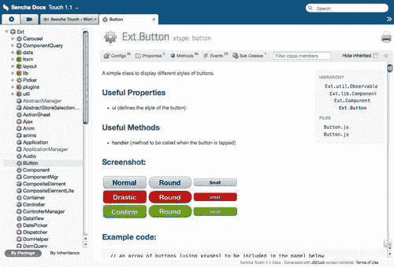

API 文档可在 Sencha 网站[上获得 http://docs.sencha.com/touch/1-1/](http://docs.sencha.com/touch/1-1/) 。

Sencha Touch 框架还包含一份副本，您将下载该副本以创建应用。

## 示例

Sencha 网站还包括一些示例应用供您查看。到目前为止，其中最有用的是厨房水槽应用：

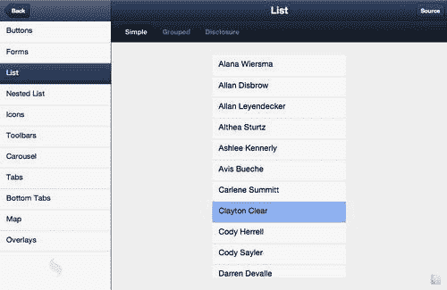

### 厨房水槽应用

厨房水槽应用提供了以下示例：

*   用户界面项，如按钮、窗体、工具栏、列表等
*   用于翻转页面或在表单中滑动的动画
*   触摸事件，如轻触、滑动和挤压
*   JSON、YQL 和 AJAX 的数据处理
*   音频和视频的媒体处理
*   更改应用外观的主题

每个示例的右上角都有一个**源**按钮，该按钮将显示当前示例的代码。

厨房水槽应用还提供了一个**事件记录器**和**事件模拟器**。这将允许您记录、存储和回放设备屏幕触发的任何触摸事件。

这些模拟器演示了如何在自己的应用中录制动作，以便作为实时演示或教程进行回放。它还可以用于易于重复的功能测试。

您可以使用苹果的 Safari 网络浏览器，在任何移动设备或普通电脑上使用 Kitchen Sink 应用。厨房水槽应用可在 Sencha 网站[上获得 http://dev.sencha.com/deploy/touch/examples/kitchensink/](http://dev.sencha.com/deploy/touch/examples/kitchensink/) 。

厨房水槽应用的副本也包含在 Sencha Touch 框架中，您将下载该框架来创建应用。

## 学习

Sencha 网站还有一部分专门讨论 Sencha Touch 框架的特定方面。本节适当地命名为**学习**。本节包含许多教程、屏幕广播和指南，可供您使用。每个部分都被标记为**容易、中等**或**难**，这样您就可以了解自己将进入的领域。

**学习**部分可在 Sencha 网站上获取，网址为[http://www.sencha.com/learn/touch/](http://www.sencha.com/learn/touch/) 。

## 论坛

虽然之前提到过，但 Sencha 论坛值得再次提及。这些社区讨论提供一般知识、bug 报告、问答会议、示例、竞赛等。论坛是从每天使用该框架的人那里找到答案的好地方。

# 设置您的开发环境

现在您已经熟悉了可用的 Sencha Touch 资源，下一步是设置开发环境并安装 Sencha Touch 库。

为了开始使用 Sencha Touch 开发应用，强烈建议您拥有一个可以运行的 web 服务器，在那里您可以托管应用。可以开发 Sencha Touch 应用，使用 web 浏览器查看本地文件夹。如果没有 web 服务器，您将无法使用任何移动设备测试应用。

## 在 Mac OSX 上设置 web 共享

如果您使用的是 Mac OSX，那么您已经安装了 web 服务器。要启用它，请启动您的系统首选项，选择**共享**，然后启用**网络共享**。如果您还没有这样做，请单击**创建个人网站文件夹**，在您的主目录中设置一个网站文件夹。默认情况下，此文件夹称为站点，我们将在此处构建应用：

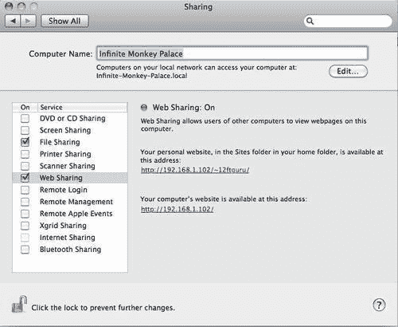

共享面板将告诉您您的 web 服务器 URL。记住这一点，以后再说。

## 在 Microsoft Windows 上安装 web 服务器

如果您正在运行 Microsoft Windows，则可能正在运行 Microsoft 的 Internet 信息服务器（**IIS**。您可以进入您的**控制面板**并选择以下选项之一进行查找：

*   **程序功能****打开或关闭 Windows 功能**（在 Vista 或 Windows 7 中）。详细说明见[http://www.howtogeek.com/howto/windows-vista/how-to-install-iis-on-windows-vista/](http://www.howtogeek.com/howto/windows-vista/how-to-install-iis-on-windows-vista/) 。
*   **添加/删除程序****添加/删除 Windows 组件**（在 Windows XP 中）。详细说明见[http://www.webwiz.co.uk/kb/asp-tutorials/installing-iis-winXP-pro.htm](http://www.webwiz.co.uk/kb/asp-tutorials/installing-iis-winXP-pro.htm) 。

如果您没有安装 IIS，或者不熟悉其操作，建议您安装 Apache 服务器，以便与本书一起使用。在我们的示例中，这将允许我们为 Mac 和 PC 提供一致的指令。

安装 Apache 最简单的方法之一是下载并安装 XAMPP 软件包（[http://www.apachefriends.org/en/xampp-windows.html](http://www.apachefriends.org/en/xampp-windows.html) ）。这个包包括 Apache 以及 PHP 和 MySQL。随着技能的提高，这些附加程序可能会有所帮助，使您能够创建更复杂的程序和数据存储选项。

下载并运行 XAMPP 后，系统将提示您运行 XAMPP 控制面板。您也可以从 Windows**开始**菜单运行 XAMPP 控制面板。您应该单击控制面板 Apache 行上的**启动**来启动 web 服务器。如果您收到来自防火墙软件的通知，则应选择允许 Apache 连接到 Internet 的选项：

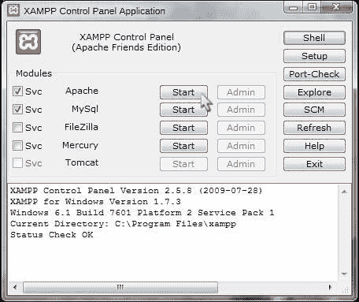

在安装 XAMPP 的文件夹中，有一个子目录名为 `htdocs`。这是我们将在其中设置 Sencha Touch 的 web 文件夹。完整路径通常为 `C:\xampp\htdocs`。您的 web 服务器 URL 将是 `http://localhost/`，您需要记住这一点，以便下一步使用。

## 下载并安装 Sencha Touch 框架

在您的 web 浏览器中，转至[http://www.sencha.com/products/touch/](http://www.sencha.com/products/touch/) 点击**下载**按钮。将 ZIP 文件保存到临时目录。

### 注

请注意，本书中的所有示例都是使用 Sencha Touch 1.1.0 版编写的。

解压缩您下载的文件将创建一个名为 `sencha-touch-version`的目录（在我们的例子中是 `sencha-touch-1.1.0)`。将此目录复制到您的 web 文件夹并重命名，删除版本号，只留下 `sencha-touch`。

现在，打开您的 web 浏览器并输入您的 web URL，在末尾添加 `sencha-touch`。您应该看到以下 Sencha Touch 演示页面：

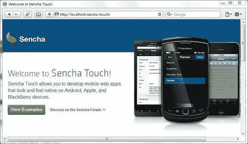

祝贺您已成功安装 Sencha Touch。

# 使用 Sencha Touch 开发的附加工具

除了配置 web 服务器和安装 Sencha Touch 库之外，在进入第一个 Sencha Touch 应用之前，您可能还需要了解一些其他开发工具。Sencha 还有一些其他产品可以在 Sencha Touch 应用中使用，还有很多第三方工具可以帮助您开发和部署应用。我们不会详细讨论如何设置和使用它们，但这些工具绝对值得研究。

## Safari 网站检查员

Safari web Inspector 与桌面版 Safari web 浏览器捆绑在一起，允许您调试 JavaScript 和 CSS，检查 HTML 和浏览器的本地存储，等等。

我们建议在开发过程中使用 Safari 检查 Sencha Touch 应用，Safari Web Inspector 是其中的一个重要部分。Chrome 和 Firefox 都有类似的工具（Chrome Developer tools 和 Firefox 的 Firebug），但由于 iOS 设备在其 web 浏览器中使用 Safari，我们认为在开发中使用 Safari 有助于保持简单并提供一致的浏览体验。您可以在[下载 http://www.apple.com/safari/download/](http://www.apple.com/safari/download/) 。

在本书中，我们将使用 Safari web 浏览器测试我们的示例：

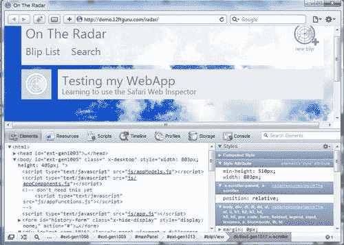

除了 Safari 和 Web Inspector 之外，您还可以使用一些附加包来增强和测试您自己的项目。

## 其他森茶产品

Sencha 提供了几种扩展 Sencha Touch 功能的产品。

### 森查动画师

尽管 Sencha Touch 附带了一些内置动画，但通过 Sencha Animator 桌面应用，您可以创建与基于 Flash 的动画相匹敌的专业动画。不过，与 Flash 动画不同的是，Sencha Animator 动画可以在大多数移动浏览器上运行，非常适合在 Sencha Touch 应用中添加额外的 flare。您可以在[下载 Sencha Animatorhttp://www.sencha.com/products/animator/](http://www.sencha.com/products/animator/) 。

### 森查木卫一

Sencha.io 是 Sencha 提供的云计算服务。他们的初始服务名为 Sencha.io Src，这是将图像整合到 Sencha Touch 应用中的一个好方法。Sencha.io Src 处理移动设备中使用的各种显示器和分辨率的图像大小调整、缓存和优化。创建一个高分辨率的图像，其余的由 Sencha.io Src 处理。可在[获取 http://www.sencha.com/products/io/](http://www.sencha.com/products/io/) 。

### 森查触摸图

Sencha Touch Charts 为触摸环境带来强大的图表功能，互动功能直接针对移动设备。创建饼图、直线图、堆叠图、条形图和雷达图，并将它们轻松地应用到 Sencha Touch 应用中。Sencha 触摸图可在[上获得 http://www.sencha.com/products/touch/charts:](http://www.sencha.com/products/touch/charts)

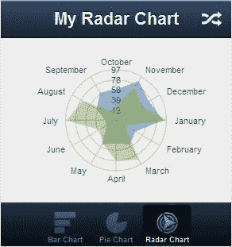

### RemoteJS 和事件记录器

RemoteJS 和 EventRecorder 不是 Sencha 的官方产品，但它们是由 Sencha 开发的，并作为开源工具发布，用于调试专门在 Android 平台上运行的应用。

RemoteJS 允许您使用 Android SDK 的内置模拟器或您自己的 Android 设备执行远程调试。然后，您可以通过 RemoteJS 接口执行 JavaScript 命令来检查变量，并可以运行函数来查看其输出。

EventRecorder 允许您记录用户与应用的交互，然后在以后播放这些交互。这允许您以可重复、自动化的方式测试应用的更新，类似于 web 应用测试工具 Selenium。

RemoteJS 和 EventRecorder 均可在[下载 https://github.com/senchalabs/android-tools](http://https://github.com/senchalabs/android-tools) 。

## 第三方开发工具

您还可以从各种开发工具中进行选择，这些工具在开发 Sencha Touch 应用时可能会很有用。

### Xcode 4

**Xcode 4**是苹果公司的完整开发环境，专为任何苹果平台 OSX、iPhone 或 iPad 的用户而设计。因此，它附带了很多编写 Sencha Touch 应用所不需要的东西。然而，Xcode 4 中包含的一个东西，对于 Sencha Touch 开发者来说非常方便，**iOS 模拟器**。使用 iOS 模拟器，您可以在各种 iOS 设备上测试应用，而无需实际拥有它们。

下载 Xcode 4 需要加入 Apple 开发者计划。注册会员后，您可以从[下载 Xcode 4http://developer.apple.com/xcode/:](http://developer.apple.com/xcode/)

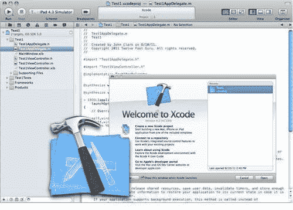

### 安卓仿真器

**Android 仿真器**是与 Xcode 4 附带的 iOS 仿真器相对应的 Android 仿真器。Android Emulator 是免费 Android SDK 下载的一部分（[http://developer.android.com/guide/developing/devices/emulator.html](http://developer.android.com/guide/developing/devices/emulator.html) ）。Android Emulator 可以配置为模拟许多特定的 Android 移动设备，允许您跨多种设备测试应用：

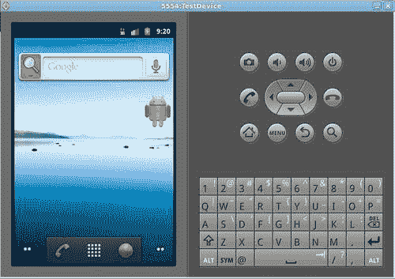

### YUI 试验

任何编程的一个常见部分就是测试。**YUI 测试**是 Yahoo 的 YUI JavaScript 库的一部分，它允许您创建和自动化单元测试，就像 JUnit for Java 一样。单元测试为特定代码段设置测试用例。然后，如果将来代码发生更改，可以重新运行单元测试以确定代码是否仍然通过。这非常有用，不仅可以查找代码中的错误，还可以在发布前确保代码质量。YUI 测试可在[找到 http://yuilibrary.com/yui/docs/test/.](http://yuilibrary.com/yui/docs/test/.)

### 茉莉花

Jasmine 是一个类似于 YUI 测试的测试框架，但基于**行为驱动设计（BDD）**。在 BDD 测试中，您从规范开始，讲述您的应用在某些场景中应该做什么，然后编写符合这些规范的代码。YUI test 和 Jasmine 都以不同的方式实现了测试代码的相同目标。在[下载茉莉花 http://pivotal.github.com/jasmine/.](http://pivotal.github.com/jasmine/.)

### JSLint

可能是这个列表中最有用的 JavaScript 工具，**JSLint**将检查代码的语法错误和代码质量。JSLint 由 JavaScript 创始人之一 Douglas Crockford 编写，它将非常详细地检查代码，这对于在部署代码之前查找错误非常有用。在[下载 http://www.jslint.com/lint.html](http://www.jslint.com/lint.html) 。

### 韦恩尔

在移动设备上测试 web 应用的最大问题之一是缺少调试工具。模拟器和仿真器将为您提供大部分解决方案，但总有一些问题只有在移动设备上进行实际测试时才会遇到。**Weinre**是 PhoneGap 的开源产品，它为您提供了一个类似于 Safari Web Inspector 的调试控制台，但适用于在移动设备上运行的 Web 应用。它涉及到设置一个特殊的服务器，但是站点上的说明非常简单，而且好处远远大于安装所需的工作量。Weinre 在[上提供 http://phonegap.github.com/weinre/.](http://phonegap.github.com/weinre/.)

# 总结

在本章中，我们介绍了 web 应用框架的基础知识以及为什么要使用 Sencha Touch。我们完成了开发环境的设置和 SenchaTouch 库的安装。我们还简要介绍了开发触摸应用时的一些注意事项，以及一些使您的开发工作更轻松的工具。有关信息，请访问：

*   森查触摸学习中心（[http://www.sencha.com/learn/touch/](http://www.sencha.com/learn/touch/) ）
*   苹果 iOS 人机界面指南（[http://developer.apple.com/library/ios/#documentation/UserExperience/Conceptual/MobileHIG/Introduction/Introduction.html](http://developer.apple.com/library/ios/#documentation/UserExperience/Conceptual/MobileHIG/Introduction/Introduction.html) ——为 iOS 设备开发用户界面的深入指南。

在下一章中，我们将创建第一个 Sencha Touch 应用，并在此过程中学习使用 Sencha Touch 的基础知识。